2020 年 6 月 2 日

## 将事件驱动融入因子选股

## 联系信息

陶勤英

## 首席分析师

SAC 证书编号：S0160517100002

taoqy@ctsec.com

021-68592393

张宇

分析师

SAC 证书编号：S0160519120001

zhangyu1@ctsec.com

021-68592337

17621688421

## 相关报告

## “星火”多因子专题报告（十四）

【1】“星火”多因子系列（一）：《Barra模型初探：A 股市场风格解析》

【2】“星火”多因子系列（二）：《Barra模型进阶：多因子模型风险预测》

【3】“星火”多因子系列（三）：《Barra模型深化：纯因子组合构建》

【4】“星火”多因子系列（四）：《基于持仓的基金绩效归因：始于 Brinson，归于 Barra》

【5】“星火”多因子系列（五）：《源于动量，超越动量：特质动量因子全解析》

【6】“星火”多因子系列（六）：《Alpha 因子重构：引入协方差矩阵的因子有效性检验》

【7】“星火”多因子系列（七）：《借因子组合之力，优化 Alpha因子合成》

【8】“星火”多因子系列（八）：《组合风险控制：协方差矩阵估计方法介绍及比较》

【9】“星火”多因子系列（九）：《博彩偏好还是风险补偿？高频特质偏度因子全解析》

【10】“星火”多因子系列（十）：《如何对Beta因子进行稳健估计？》

【11】“星火”多因子系列（十一）：《在下跌中寻找惊喜：业绩超预期与反转因子的融合》

【12】“星火”多因子系列（十二）：《从质量到质量增长：挖掘公司基本面改善带来的Alpha》

【13】“拾穗”多因子系列（五）：《数据异常值处理：比较与实践》

【14】“拾穗”多因子系列（八）：《非线性规模因子：A 股市场存在中市值效应吗？》

【15】“拾穗”多因子系列（十一）：《多因子风险预测：从怎么做到为什么》

【16】“拾穗”多因子系列（十四）：《补充：基于特质动量因子的沪深 300 增强策略》

“慧博资讯”专业的投资研究大数据分享平台

## 投资要点：

## 引言：事件驱动与因子选股

- 在过往的研究中，我们总是单纯地将“事件驱动”策略和“因子选股”策略作为两种独立的策略类型进行探讨。本期专题，我们在过往研究的基础上，以“分析师评级上调”为事件，以“复合基本面因子”为Alpha 信号，介绍两种不同的方法对其进行融合。

## 好风凭借力，送我上青云——“好风借力”组合介绍

- 以“分析师评级上调”作为第一层筛选条件，以复合基本面因子进行排序作为第二层筛选条件，构建“好风借力”组合。截至 2020年 5月 22日，该组合今年的超额收益为 15.21%，表现较为抢眼。

## 将事件驱动融入指数增强型策略

- 以“个股预期收益”为桥梁，打通“事件驱动”和“因子选股”之间的隔阂。通过将因子暴露和事件触发转化为个股预期收益，我们构建了复合预期因子，并通过组合优化的方法构建指数增强型组合。

- 截至 2020 年 5 月 22 日，采用如上方法构建的中证 500 增强组合（全市场选股）超额收益为 5.23%，沪深 300 增强组合（全市场选股）超额收益为 10.08%。

- 风险提示：本报告统计数据基于历史数据，过去数据不代表未来，市场风格变化可能导致模型失效。

在财通金工“星火”专题（13）《从事件驱动角度看分析师评级上调带来的Alpha》中，我们通过对朝阳永续一致预期数据进行研究发现，从因子选股的角度来看，部分一致预期因子在近年出现明显的回撤，而从事件驱动的角度而言，分析师评级上调、目标价上调和盈利预测上调仍能够带来明显的 Alpha。然而，如何将“事件驱动型”策略融入到成熟的多因子选股体系中呢？本期专题，我们以“分析师评级上调”作为事件，以“复合基本面因子”作为 Alpha 信号，介绍两种不同的方法对其进行融合，以供投资者参考。

## 1、 引言：事件驱动与因子选股

## 1.1 事件驱动：以分析师评级上调为例

在财通金工“星火”专题（13）中，我们考察了分析师评级上调、目标价上调、盈利预测上调等多种事件触发后，个股相较全市场的超额收益情况。从图1 可以看到，个股“上调至买入评级”事件被触发后的 6 个月将会取得近 5%的超额收益，且这一超额收益的增长较为稳健。

图 1：分析师评级上调事件前后累计超额收益CAR
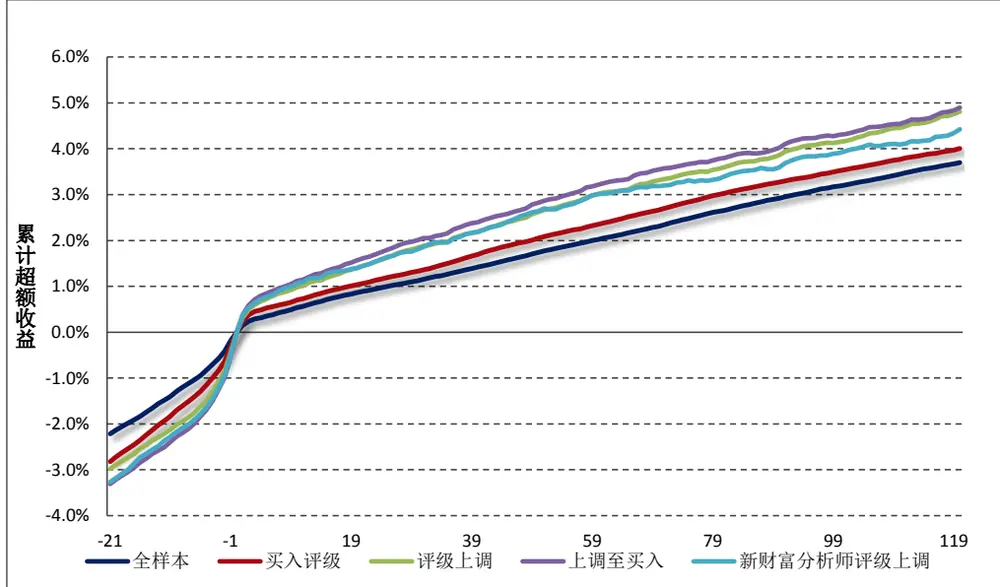
数据来源：财通证券研究所，朝阳永续

随后，我们从事件驱动角度出发，构建了一个更为可行的投资组合，其具体方法如下：

（1） 假设投资者持有的初始资金为 1 千万，将资金等分为 N 个通道，每个通道的初始资金为 1/N 千万元；

（2） 假设调仓频度以月度为单位，在每个月的最后一个交易日扫描过去一个月中触发事件的股票，以等资金买入全部股票，并持有 N 个月不变，以此类推（假设某只股票多次触发该事件，则只计算一次）；

（3） 当组合平稳运行后，每个月都有 1 个通道进行调仓，卖出 N 个月之前建仓的股票，买入本月符合要求的股票；

（4） 由于交易的股票数量较多，策略对于调仓周期及手续费影响较为敏感。我们将调仓周期设置为月度，将手续费设置为双边千分之三，买入和卖出均需扣除手续费。

按照如上规则，我们以月度为调仓频率，将初始资金分为 6个通道，每个通道在买入后持有 6个月，并在6 个月后的最后一个交易日进行调仓。

图 2：分析师“上调至买入评级”事件收益
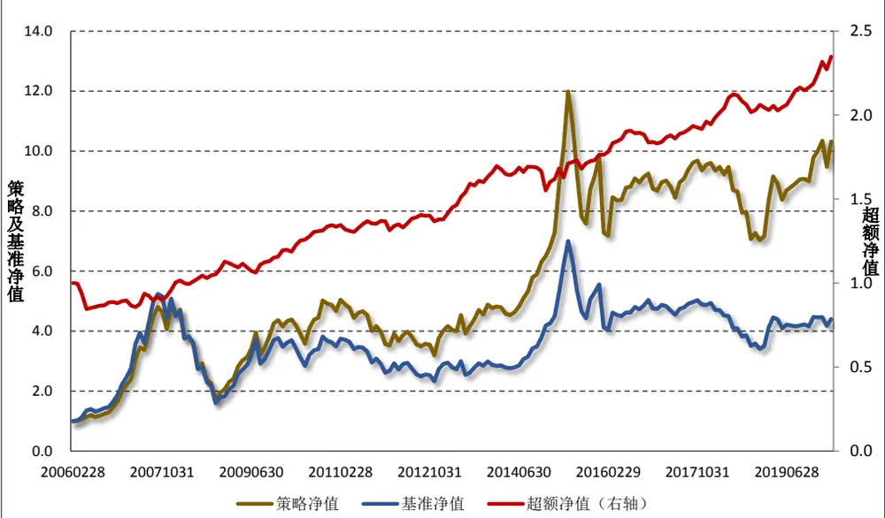

|  | 年化超额 | 年化波动 | 年化 IR | 最大回撤 | 月胜率 |
| --- | --- | --- | --- | --- | --- |
| 对冲组合 | 5.85% | 7.52% | 0.78 | 17.69% | 64.71% |

数据来源：财通证券研究所，朝阳永续

图 2 展示了分析师“上调至买入评级”事件策略的累计净值及基准（中证全指）的净值，可以看到组合的年化超额收益为 5.85%，年化波动 7.52%，年化 IR 为 0.78。图3 展示了组合在历年的超额收益，可以看到在 2014 年组合出现了明显的回撤，此外的多年都展现出一定的稳定性。进入到 2020 年，该组合相较中证全指的超额收益达到 7.26%。

图 3：分析师“上调至买入评级”事件收益
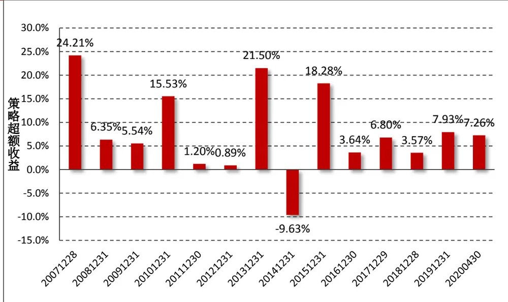
数据来源：财通证券研究所，朝阳永续

显而易见的，通过如上规则构建的组合存在一个很大的问题——部分时间段内调仓的股票数量过多。图4 展示了上述组合每月持仓数量，可以看到部分时间组合的持股数达到 200 多只，这样不仅造成手续费过高，也不利于实际投资操作。

图 4：分析师“上调至买入评级”事件月度持仓数量
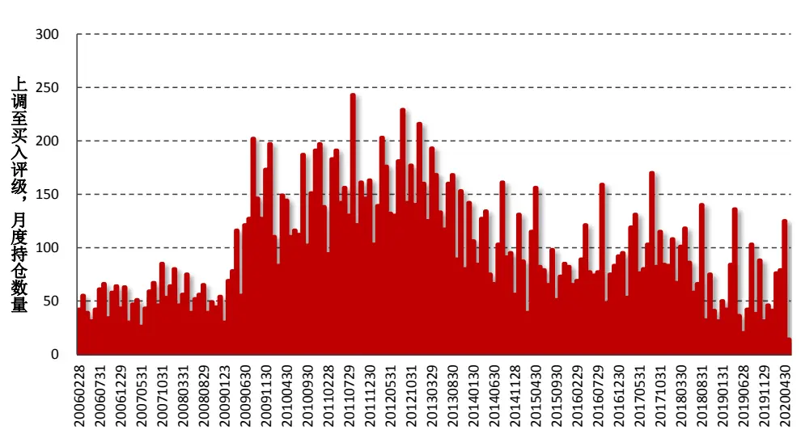
数据来源：财通证券研究所，朝阳永续

此外，单纯地将分析师事件作为唯一的事件触发因子，完全忽略个股的基本面情况，将会忽略掉很多有效信息。为了同时考虑到个股的基本面情况，同时也为了减少组合的持仓数量，我们必须在分析师事件触发的基础上进行另一层筛选。

## 1.2 因子选股：以基本面合成因子为例

在财通金工“星火”多因子系列（11）《在下跌中寻找惊喜：业绩超预期与反转因子的融合》中，我们介绍了如何采用业绩快报、业绩预告及标准化财务报表计算个股业绩超预期因子。在“星火”多因子系列（12）《从质量到质量增长：挖掘公司基本面改善带来的 Alpha》中，我们从盈利能力、成长能力及分红水平出发，构建了综合质量因子。

表 1：所选取基本面基础因子定义

| 因子代码 | 因子名称 | 备注 |
| --- | --- | --- |
| NetProfitQYOY | 单季度净利润同比增长率 |  |
| OperatingRevenueQYOY | 单季度营业收入同比增长率 |  |
| QualityFactor | 综合质量因子 | 参见“星火”（12） |
| SUE | 标准化预期外盈利 | 参见“星火”（11） |
| SUR | 标准化预期外营业收入 | 参见“星火”（11） |

数据来源：财通证券研究所

本文我们以表1介绍的5个财务类因子为基础，通过对其过去24期RankICIR进行加权合成为一个复合因子，接下来我们将对该复合因子进行有效性检验，具体细节如下：

因子预处理：在横截面上将因子对个股行业及市值进行正交化处理

回测时间：2007.7.30-2020.4.30，月度调仓

回测样本：Wind 全 A样本股

样本筛选：剔除上市时间少于 100 天、剔除调仓日停牌一天、剔除 ST、*ST、PT 等被标为风险预警的股票、剔除调仓日涨停或者跌停的股票调仓时间：每月最后一个交易日

分组方式：按照因子值从小到大分 10 组（D0-D9），每组成分股进行等权处理，因子值最大的组别即为 D9 组，因子值最小的组别即为 D0 组

基准指数：每期满足条件的样本股收益等权平均

手续费：单边千分之三

图 5：复合基本面因子各组年化超额收益
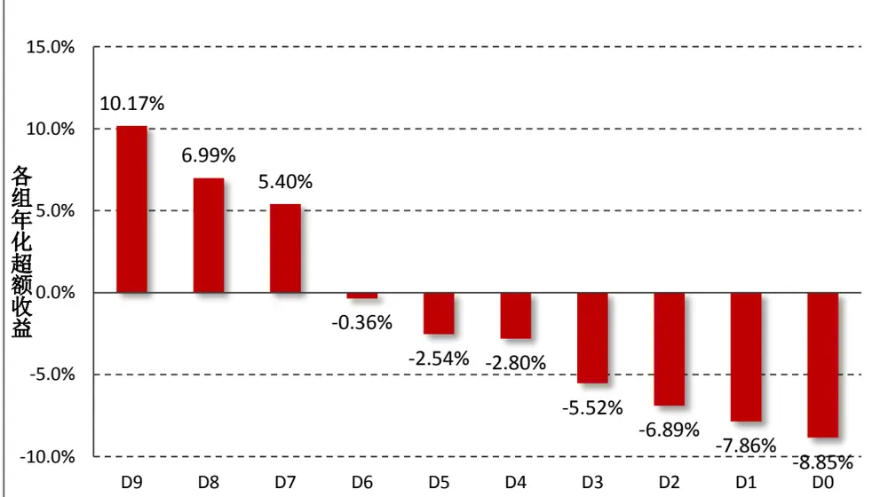

| RankIC | 月胜率 | 均值 | T值 | RankICIR |
| --- | --- | --- | --- | --- |
|  | 77.1% | 4.7% | 8.57 | 2.37 |
| 对冲组合 | 年化收益 | 年化波动 | 年化IR | 最大回撤 |
|  | 18.03% | 7.15% | 2.52 | 12.9% |

数据来源：财通证券研究所，恒生聚源

图 展示了复合基本面因子在全样本时间段内的表现情况，可以看到组合在多头和空头方面的超额收益较为平均，其中多头超额年化 10.17%，空头超额收益年化-8.85%，与传统的价量因子超额收益主要由空头部分贡献情况不同。

图 6：复合基本面因子多头超额净值及 RankIC 走势
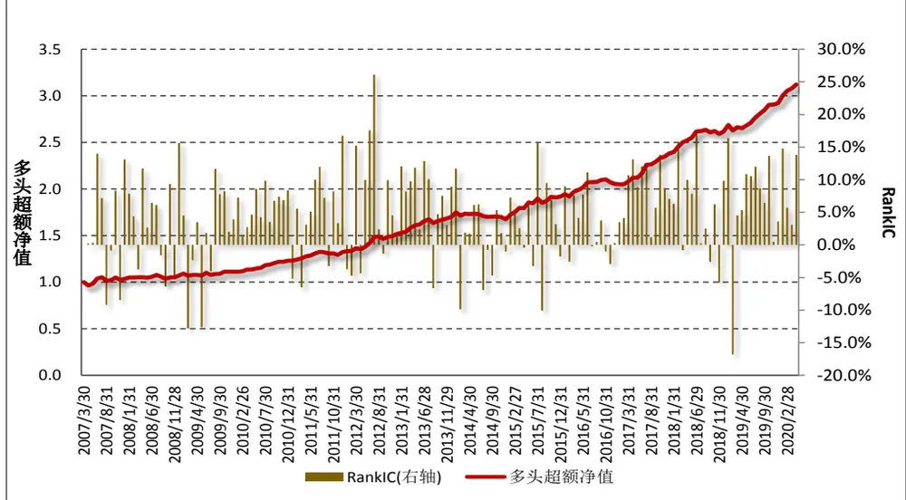
数据来源：财通证券研究所，恒生聚源

图 6 展示了复合基本面因子多头超额净值及 RankIC 走势，可以看到，因子多头部分展现出了较为稳定超额收益。

图 7：复合因子多头及空头历年超额收益
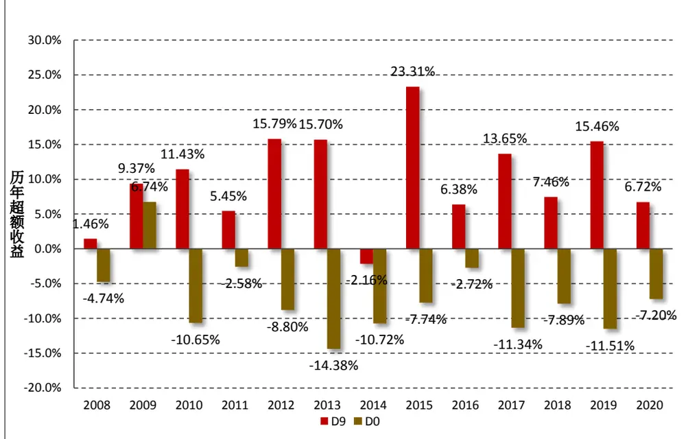
数据来源：财通证券研究所，恒生聚源

分年度来看，图 7 展示了复合因子多头和空头历年相较基准的超额收益。可以看到，对于多头部分而言，除 2014 年外，每年都能够稳定地超越基准。截至2020 年 4 月 30 日，多头相较基准的超额收益达到 6.72%，表现较为抢眼。

## 2、 好风凭借力，送我上青云——“好风借力”组合介绍

在介绍了本文采用的事件类型和因子类型之后，从本小节开始我们介绍一种方法将二者进行结合。所谓“好风凭借力，送我上青云”，如果说公司优秀的基本面可以被叫做“好风”的话，那么市场分析师的推荐无非就能够给“好风”一些“借力”。当优异的基本面公司得到市场分析师推荐的时候，我们认为这样的标的更能够获得市场青睐。

基于这一想法，我们通过如下方式构建组合：

（1） 假设投资者持有的初始资金为 1 千万，将资金等分为 N 个通道，每个通道的初始资金为 1/N 千万元；

（2） 假设调仓频度以月度为单位，在每个月的最后一个交易日扫描过去一个月中触发事件的股票（假设某只股票多次触发该事件，则只计算一次）。随后，将这些股票按照其基本面复合因子从大到小进行排序，选出其因子值最大的 K值股票，以等资金买入，并持有 N个月不变，以此类推；

（3） 当组合平稳运行后，每个月都有 1 个通道进行调仓，卖出 N 个月之前建仓的股票，买入本月符合要求的股票；

（4） 将调仓周期设置为月度，将手续费设置为双边千分之三，买入和卖出均需扣除手续费。

按照如上规则，我们以月度为调仓频率，将初始资金分为 6个通道，每个通道在买入后持有 6 个月，并在 6个月后的最后一个交易日进行调仓。样本时间段选取为 2010.1.29-2020.5.22，每次买入的股票 K 选定为 10 只。这样，当组合平稳运行后，组合中的个股数量不超过 60 只（因为部分通道的个股可能出现重复）。

图 8：“好风借力”组合历年超额收益
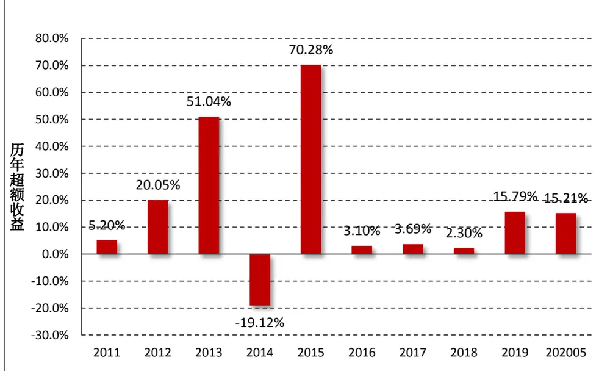
数据来源：财通证券研究所，恒生聚源

图 8 展示了“好风借力”组合相较中证全指的历年超额收益情况。由前期的专题系列报告我们可以看到，以基本面为主的质量因子和分析师评级上调在2014年均出现了回撤，因此“好风借力”组合在 2014 年的回撤明显，在其他年度均取得了一定的超额收益。截至 2020 年 5 月 22 日，该组合今年的超额收益达到15.21%，表现较为抢眼。

图 9：“好风借力”组合净值走势
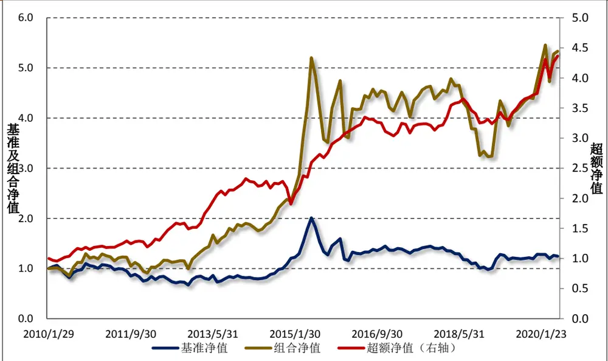

| 年化收益 | 年化波动 | 年化IR | 最大回撤 | 胜率 |
| --- | --- | --- | --- | --- |
| 15.32% | 12.64% | 1.21 | 18.26% | 66.13% |

数据来源：财通证券研究所，恒生聚源

图 9 展示了“好风借力”组合及超额净值走势，在全样本区间组合的超额年化收益为 15.32%，年化波动 12.64%，年化 IR 为 1.21。

## 3、 将事件驱动融入到指数增强型策略

## 3.1 策略介绍

在上一小节中，我们介绍了一种以“事件”为主体，在“事件”基础上根据因子大小筛选股票的方法。然而，这一方法与多因子选股的体系融合方法也难说完美。

在多因子选股体系中，我们通常是最大化组合在 Alpha因子上的暴露程度，同时叠加上行业中性、风格中性、个股偏离、完全投资的约束，通过组合优化的方式构建最终的投资组合。在实际应用中，我们通常将个股在 Alpha 因子上的暴露程度等同于个股的未来收益，这是因为对于横截面上的所有股票而言，因子收益是完全相同的，因此其预期收益之间的差别仅仅与个股因子暴露度有关，因子收益只不过起到倍数的作用。然而，当我们将“事件驱动”和“因子选股”两种不同类型的策略结合起来时，我们必须找到连接二者的桥梁——“个股预期收益”即为我们提供了一种很好的媒介。

基于这一想法，我们通过如下方法构建策略：

（1） 假设当前处于 T 月月末，获取 $[T-N,T-1]$ 月月末（共 N 个月）个股在 Alpha 因子上的暴露程度 $X_{t}$ 及未来一个月相较市场指数的超额收益 $R_{t+1}$ 。在每个截面期上，将个股未来收益 $R_{t+1}$ 对因子暴露度 $X_{t}$ 进行带截距项的 OLS 回归，得到 Alpha 因子在每个截面期上的收益率时间序列 $f_{T-N+1},\ldots,f_{T}$ 。随后，计算这 N 个因子收益的平均，作为本期因子的预期收益：

$$
\mathsf E[f_{T+1}]=\frac{1}{N}\sum_{t=1}^{t=T}f_{t}
$$

由此，个股的预期收益可以表示为因子暴露与因子预期收益的乘积，即为：

$$
\operatorname{E}\left[r_{i,T+1}\right]=X_{i,t}\cdot\operatorname{E}[f_{T+1}]
$$

（2） 同样的，在T 月月末，记录 $\left[T-N,T-1\right]\mathcal{A}$ 之间（共 N 个月）出现过“上调至买入评级”的个股，并同时计算个股触发该事件后的第 1天、第 2 天…第 N 天的日度超额收益率。为了避免市值、风格等对个股收益造成的影响，此处我们采用根据 Barra 模型剔除后的特质收益来计算个股累计超额收益情况。随后，我们将所有的事件整合起来，计算事件触发后的第 1 天、第 2 天…第 N 天的日度超额平均，作为该事件触发后的日度超额收益，记为 $er_{t+1},er_{t+1},\ldots,er_{t+120^{\circ}}$

（3） 扫描过去 1 个月（[T −1,T]期间）出现过“上调至买入评级”的个股，计算个股触发事件后的最后一个日期距离调仓日的天数，随后计算该天数往后推21天的区间超额收益率E[ $er_{i,T+1.}$ ]作为该股票未来一个月由于触发该事件能够获取到的超额收益情况。举个例子，某只股票在调仓日前 10 天触发了该事件，那么我们就可以对（2）中得到的 $er_{t+11},\ldots,er_{t+31}$ 进行加总，作为其预期超额收益 $\mathrm{\normalfont{i}}[er_{i,T+1}]$

（4） 将（1）中根据 Alpha 因子得到的预期收益与（3）中根据事件驱动得到的超额收益进行加总，作为最终的复合预期收益。

在得到最终的复合预期收益后，我们即可嵌入到传统的组合优化器中，具体方式如下：

$$
\begin{array}{rl}&{max(w-w_{B})^{\prime}\alpha}\\&{X_{S}^{lower}\leq(w-w_{B})^{\prime}X_{S}\leq X_{S}^{upper}}\\&{X_{I}^{lower}\leq(w-w_{B})^{\prime}X_{I}\leq X_{I}^{upper}}\\&{~w^{\prime}1=1}\\&{w^{lower}\leq w\leq w^{upper}}\end{array}
$$

我们限制个股与基准组合在中信一级行业因子上的权重偏离 2%，个股相较基准偏离 2%，组合与基准在市值因子上的偏离为 0.05（注意此处的 0.05 并非指权重数据）。

## 3.2 中证 500 指数增强组合

根据 3.1 小节的说明，我们综合“分析师评级上调”事件和“基本面复合因子”合成最终的个股预期收益，并通过组合优化的形式构建中证 500 指数增强组合（全市场选股）。

图 10：中证500 增强组合绝对净值走势
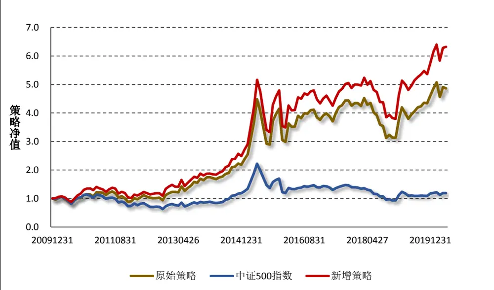
数据来源：财通证券研究所，恒生聚源

图 11：中证500 增强组合超额净值走势
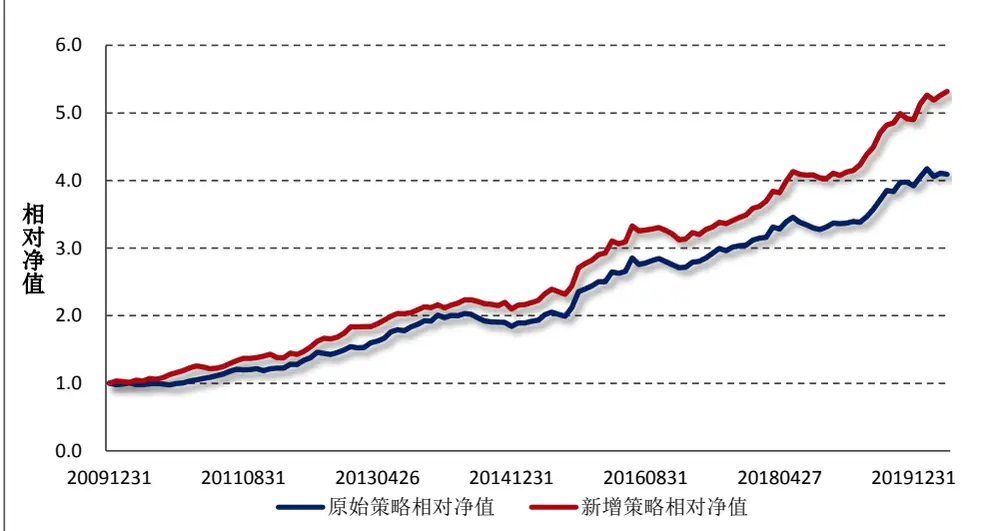
数据来源：财通证券研究所，恒生聚源
谨请参阅尾页重要声明及财通证券股票和行业评级标准

图 10 和图 11 分别展示了仅仅采用复合基本面因子构建的组合与融入“分析师评级上调”事件构建的组合的绝对净值走势以及相较基准的超额净值走势。可以看到，叠加了分析师事件之后的组合的超额收益更加明显。

图 12：中证500 增强组合历年超额收益
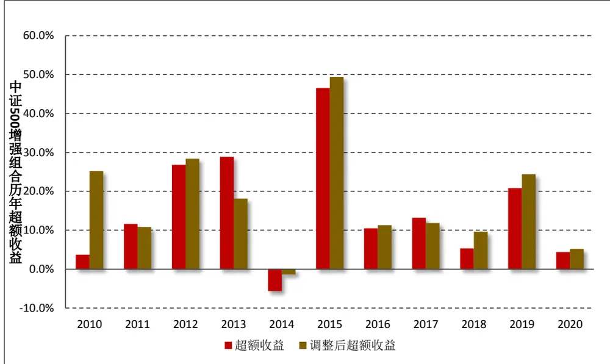
数据来源：财通证券研究所，恒生聚源

图 12 展示了原始组合与经分析师调整后组合的中证 500 增强组合相较基准的历年超额收益。可以看到，两个组合在 2014 年出现了一定程度的回撤，在其他年份均能够保持较好的超额收益情况。截至 2020 年5 月 22 日，叠加分析师评级构建的指数增强组合超额收益 5.23%。

## 3.3 沪深 300 指数增强组合

图 13：沪深300 增强组合绝对净值走势
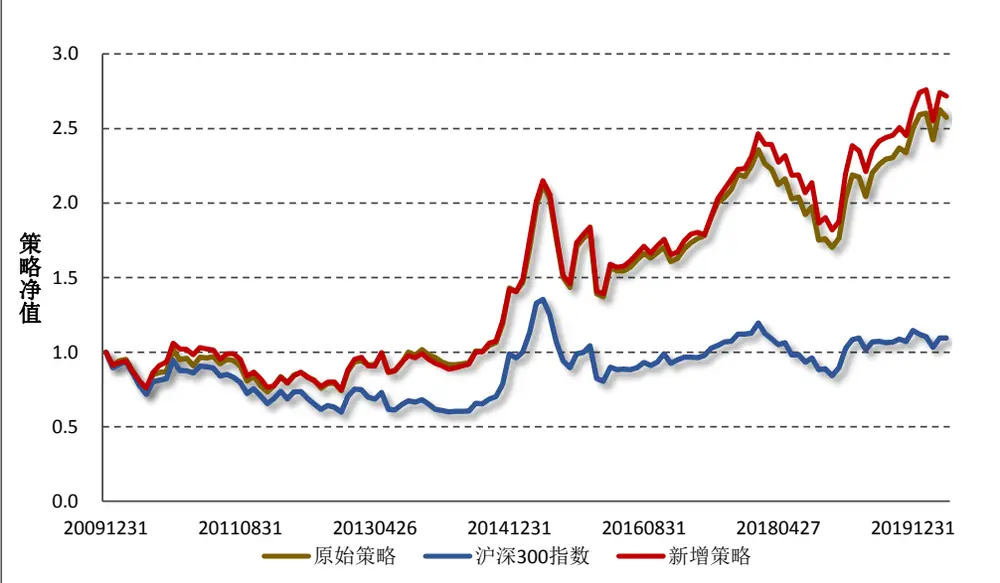
数据来源：财通证券研究所，恒生聚源
谨请参阅尾页重要声明及财通证券股票和行业评级标准

图 14：沪深300 增强组合超额净值走势
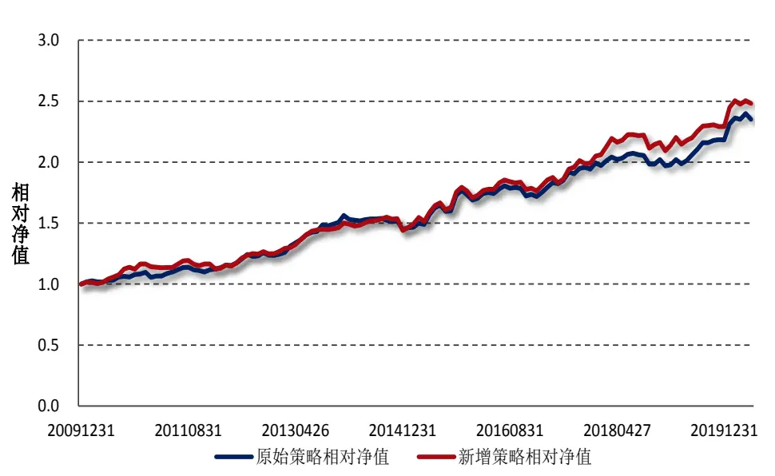
数据来源：财通证券研究所，恒生聚源

图13和图14分别展示了按照如上方法构建的沪深300指数增强组合的绝对净值及相对超额净值走势。与在中证 500 中的效果不同，叠加了分析师评级事件后的复合因子在沪深 300 指数中的提升效果并不明显。

图 15：沪深300 增强组合历年超额收益
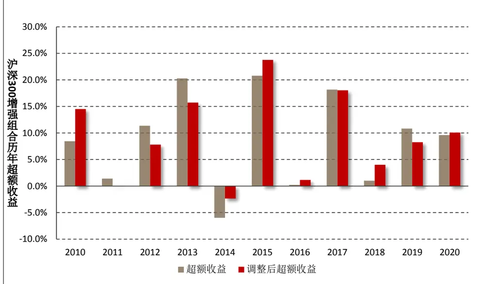
数据来源：财通证券研究所，恒生聚源

图15展示了沪深300增强组合历年相较基准指数的历年超额收益。同样的，除了在 2014 年出现回撤之后，在其他年份均取得了不错的效果。截至 2020年 5月 22 日，组合相较基准超额收益达到 10.08%。

## 4、 总结与展望

在过往的研究中，我们总是单独地将“事件驱动”策略和“因子选股”策略作为独立的两种策略类型进行探讨。本期专题，我们在过往研究的基础上，以“分析师评级上调”作为事件，以“复合基本面因子”作为 Alpha 信号，介绍两种不同的方法对其进行融合，主要结论如下：

（1） 从因子选股的角度来看，部分一致预期因子在今年出现明显的回撤。而从事件驱动的角度而言，分析师评级上调、目标价上调和盈利预测上调仍能够带来明显的 Alpha。

（2） 我们选取 5 个基本面因子构建了复合基本面因子，该复合因子在全样本区间内的分组效果良好，多头收益较为稳健。

（3） 我们以“分析师评级上调”作为第一层筛选条件，以复合基本面因子进行排序作为第二层筛选条件，构建“好风借力”组合。截至 2020年 月 日，该组合今年的超额收益达到 ，表现较为抢眼。

（4） 我们以个股预期收益为桥梁，打通了“事件驱动”和“因子选股”之间的隔阂。通过将因子暴露和事件触发转化为个股预期收益，我们构建了复合预期因子，并通过组合优化的方式构建指数增强组合。

（5） 截至 2020 年5 月 22 日，采用如上方法构建的中证 500 增强组合（全市场选股）超额收益为 5.23%，沪深 300 增强组合（全市场选股）超额收益为 10.08%。

## 5、 风险提示

多因子模型拟合均基于历史数据，市场风格的变化将可能导致模型失效。

## 信息披露

## 分析师承诺

作者具有中国证券业协会授予的证券投资咨询执业资格，并注册为证券分析师，具备专业胜任能力，保证报告所采用的数据均来自合规渠道，分析逻辑基于作者的职业理解。本报告清晰地反映了作者的研究观点，力求独立、客观和公正，结论不受任何第三方的授意或影响，作者也不会因本报告中的具体推荐意见或观点而直接或间接收到任何形式的补偿。

## 资质声明

财通证券股份有限公司具备中国证券监督管理委员会许可的证券投资咨询业务资格。

## 公司评级

买入：我们预计未来 6 个月内，个股相对大盘涨幅在 15%以上；

增持：我们预计未来 6 个月内，个股相对大盘涨幅介于 5%与15%之间；

中性：我们预计未来 6 个月内，个股相对大盘涨幅介于-5%与5%之间；

减持：我们预计未来 6 个月内，个股相对大盘涨幅介于-5%与-15%之间；

卖出：我们预计未来 6 个月内，个股相对大盘涨幅低于-15%。

## 行业评级

增持：我们预计未来 6 个月内，行业整体回报高于市场整体水平 5%以上；

中性：我们预计未来 6 个月内，行业整体回报介于市场整体水平-5%与 5%之间；

减持：我们预计未来 6 个月内，行业整体回报低于市场整体水平-5%以下。

## 免责声明

本报告仅供财通证券股份有限公司的客户使用。本公司不会因接收人收到本报告而视其为本公司的当然客户。

本报告的信息来源于已公开的资料，本公司不保证该等信息的准确性、完整性。本报告所载的资料、工具、意见及推测只提供给客户作参考之用，并非作为或被视为出售或购买证券或其他投资标的邀请或向他人作出邀请。

本报告所载的资料、意见及推测仅反映本公司于发布本报告当日的判断，本报告所指的证券或投资标的价格、价值及投资收入可能会波动。在不同时期，本公司可发出与本报告所载资料、意见及推测不一致的报告。

本公司通过信息隔离墙对可能存在利益冲突的业务部门或关联机构之间的信息流动进行控制。因此，客户应注意，在法律许可的情况下，本公司及其所属关联机构可能会持有报告中提到的公司所发行的证券或期权并进行证券或期权交易，也可能为这些公司提供或者争取提供投资银行、财务顾问或者金融产品等相关服务。在法律许可的情况下，本公司的员工可能担任本报告所提到的公司的董事。

本报告中所指的投资及服务可能不适合个别客户，不构成客户私人咨询建议。在任何情况下，本报告中的信息或所表述的意见均不构成对任何人的投资建议。在任何情况下，本公司不对任何人使用本报告中的任何内容所引致的任何损失负任何责任。

本报告仅作为客户作出投资决策和公司投资顾问为客户提供投资建议的参考。客户应当独立作出投资决策，而基于本报告作出任何投资决定或就本报告要求任何解释前应咨询所在证券机构投资顾问和服务人员的意见；

本报告的版权归本公司所有，未经书面许可，任何机构和个人不得以任何形式翻版、复制、发表或引用，或再次分发给任何其他人，或以任何侵犯本公司版权的其他方式使用。