金融工程丨深度报告

[Table_Title] 神经网络因子挖掘——TCN 日频量价因子

## 报告要点

[Table_Summary] 我们使用 TCN神经网络进行量价因子挖掘，思考并尝试了多种损失函数，最终采用“单个因子有效性+合成因子有效性+因子间相关系数”的构造方式。样本外从 2018 年起进行滚动训练，最终得到 64个日频量价因子，平均 RankIC为 5.54%；进行等权合成得到的合成因子 RankIC高达 11.73%。最终在沪深两市全 A上构建多头组合，从 2018年以来实现 20.31%的年化超额收益率。

分析师及联系人

郑起SAC：S0490520060001

# 神经网络因子挖掘——TCN 日频量价因子

## [Table_Summary2] 因子挖掘的三种方式

因子挖掘可以分成三种方式：人工挖掘因子，遗传规划挖掘因子，神经网络挖掘因子。前者基于逻辑，后两者基于算力。一方面，我们认为神经网络相比于人工挖掘因子的优势在于批量生成有效且低相关因子。另一方面，相比于遗传规划挖掘因子，神经网络完全牺牲所挖因子的可解释性从而提升因子的有效性上限。虽然目前仍在探索过程中，但是随着深度学习的发展，神经网络挖掘因子将逐步展示其优越性。

## TCN 神经网络处理长时间输入序列

TCN（Temporal Convolutional Network）是一种用于处理序列数据的深度学习模型，它通过卷积操作来捕获输入数据中的时间动态信息，其主要优势如下：

1. 并行计算：TCN可以并行处理输入数据，这使得它在处理长序列数据时，比 RNN 具有更高的效率。

2. 捕获长距离依赖：TCN可以通过使用膨胀卷积（Dilated Convolution）来捕获输入数据中的长距离依赖关系，这使得模型在处理长序列数据时，可以更好地理解数据的全局信息，以及较长时间前的数据信息。

3. 残差链接：它允许网络在前向传播过程中跳过某些层，直接从输入层到输出层。这种连接方式可以帮助网络更好地学习输入数据的特征，从而提高模型的性能。

## 因子挖掘损失函数：单个因子有效性+合成因子有效性+因子间相关系数

直观上来解释，我们希望网络同时考虑每个因子的有效性，合成因子的有效性，以及因子间相关系数三个部分，前两者越高越高，后者越低越好。我们依次剔除了上述损失函数中的某一部分，来观察它对所挖因子的影响。最后发现，忽视任意一部分约束，都将使得所挖因子在该方面有一定的损失，这说明了我们所构建的损失函数的合理性。

## 股票未来 20日收益率量价因子

最终我们使用 TCN神经网络以股票过去 63 日的量价数据作为输入，预测隔天未来 20 日收益率，获得了 64 个量价因子和 1 个等权合成因子。样本外 2018 年以来 64 个量价因子的平均RankIC为 5.54%，等权合成因子的 RankIC为 11.73%，表现优异。在各指数成分股上也有较好的表现。最终构建多头策略，2018 年以来，每年均实现了较高的超额收益，平均年化超额收益为 20.31%。

## 风险提示

1、深度学习模型训练过程中有随机性，可能导致预测结果有误差；

2、模型总结的市场规律是基于历史数据的，存在失效风险。

3、日频交易策略回测结果仅供参考，需要考虑实际交易存在的滑点等风险。

## 相关研究

- 《三季度净赎回 999 亿，电新主动减仓 1.41%》2023-10-31

- 《我们从基金投顾组合中获得了什么？——基金投顾业务现状详解与基金组合策略》2023-10-23•《行业轮动（八）：为什么需要区分热门和非热门行业》2023-10-23

更多研报请访问长江研究小程序

## 因子挖掘

因子挖掘是一种金融分析和投资领域中的重要方法，其核心任务是发现并分析与资产价格或投资表现相关的关键因素。这些因素通常被称为“因子”，它们可以包括市值、估值、盈利能力、动量、波动性等各种财务和市场数据，甚至是宏观经济指标。因子挖掘的目标是确定哪些因子对资产的表现具有预测性，以便更好地理解市场和制定更有效的投资策略。

1976 年 Stephen Ross 首次提出 APT（Arbitrage Pricing Theory，套利定价理论），其核心思想是资产的预期回报不仅取决于市场风险，还取决于多个因子，如宏观经济因素、行业特征、公司财务指标等。其中，多因子模型和套利机会均为 APT 理论所提出的关键概念和重要原理，这进一步掀起了学术界和业界对因子的研究和挖掘。但是随着大量Alpha 因子的提出，因子挖掘的难度在不断提升，效益却在逐渐下降。

## 因子挖掘方式

## 人工合成因子挖掘

因子挖掘最主流的方式是人工寻找或合成历史数据中与资产收益率有显著相关性的指标。人工进行因子挖掘需要投资者具备深入的金融知识、数据分析能力和统计学知识。这个过程需要谨慎和反复的试验，以确定最有效的因子组合，并不断监测和更新模型以适应不断变化的市场条件。

人工进行因子挖掘的优点在于，从市场现象出发，所得到的因子具有较强的经济意义和可解释性。如果能直接发现某种资产错误定价的根源，这种因子在特定条件下的有效性是极高的。

但是另一方面，这同时也可能是其缺点的主要来源。直观的市场规律受行为经济学的影响，很有可能会随着时间的变化而变化，因此这种可解释性强的 Alpha 因子一旦拥挤度过高，往往会显著失效。

## 遗传规划因子挖掘

站在人工合成因子挖掘的另一边的是计算机合成因子挖掘，而在这个领域，目前 A 股上量化投资者使用较多的机器学习方法是基于遗传规划算法的因子挖掘技术。使用遗传算法（Genetic Algorithm，GA）进行因子挖掘是一种基于生物演化的优化算法，用于寻找能够有效预测资产价格或投资表现的因子公式组合。遗传算法模拟了自然界中的遗传过程，通过选择、交叉和变异等操作来不断演化候选因子组合，以找到最优的公式组合。

相对于人工合成因子，遗传规划算法的优势在于快速产生批量有效因子，并且可以通过解读公式尽可能地理解遗传规划所挖掘出的因子的经济意义。直观上来说，遗传规划算法挖掘因子，以牺牲因子的部分可解释性为代价，批量产生有效的因子。

## 神经网络因子挖掘

遗传规划算法在因子挖掘领域的成功，我们认为主要原因来自于对因子复杂度的提升。一般情况而言，因子的复杂度与可解释性是对立的，越复杂的因子越难解释。但是，Alpha因子在经过几十年业界和学术界不断的研究和挖掘，简单且有效的因子近乎不存在。为了进一步提升因子挖掘的效率，挖掘更多的增量信息，理论上来说作为当下最为有效的预测工具，神经网络的应用或许能够给我们带来更多的可能性。

拥有大量参数的神经网络相比于遗传规划算法挖掘因子，能够大幅度的提升因子的复杂度，同时也基本牺牲了因子的可解释性。其复杂度的提升主要来自于对“因子必须为原始变量和运算符号组成的特定长度的显示公式”这一限制条件的解除。理论上来说，拥有大量参数的神经网络能够拟合任意长度的显示公式，因此在训练成熟的情况下，神经网络挖掘因子的有效性上限必然比遗传规划算法更高。

但是神经网络作为完全黑箱的模型，需要合适的设计和精细化的训练，才能尽可能的接近有效上限。我们认为，这种难度上的限制恰好是神经网络因子挖掘的技术壁垒所在。

## 量价数据因子挖掘

因子挖掘所使用的数据可类比于炒菜使用的原材料，使用文本数据和使用量价数据所挖掘的因子必然是完全不同的。本文将以结构化最为完善，获取相对简单和使用最为广泛的量价数据作为原始数据进行量价因子挖掘。

不同频率的量价数据，所蕴含的信息也不尽相同。我们选用日频量价数据，挖掘用于预测未来 20 个交易日收益率的中短期日频因子。因此我们的预测目标为 T+1 日收盘价买入，持有 20 天于 T+21 日收盘价卖出的区间涨跌幅。考虑到所预测目标近似于股票未来一个月的收益，在输入数据方面，我们选择用接近一个季度的过去 63 个交易日的量价数据矩阵，后续将在数据处理章节详细说明。

## TCN时间卷积神经网络

在时间序列问题上，深度学习从业者通常将循环架构视为序列建模任务的默认起点。但是 S. Bai 等人使用简单的卷积架构在各种任务和数据集上都胜过经典的循环网络，如LSTM，同时展现出更长的有效内存。因此，他们得出结论，应重新考虑序列建模和循环网络之间的常见关联，而应该将卷积网络视为序列建模任务的自然起点。虽然该结论仍然存在较大争议，但是其文中所提出改良版的 TCN神经网络值得我们参考借鉴。

我们认为 TCN的显著特点包括：

1. 架构中的卷积是因果的，意味着没有来自未来到过去的信息泄漏；

2. 该架构可以接受任意长度的序列并将其映射到相同长度的输出序列；

3. 网络可以通过并行运算的方式查看非常远的过去来进行预测。

## 一维卷积核

不同于图像处理问题上，使用传统卷积神经网络中的二维卷积核对相邻像素间的信息进行学习，TCN 使用一维卷积核学习同一特征不同时间区间上的信息，这种一维卷积的逻辑更加合理，直观上来形容就是依次观察每一个特征上的时序变化情况，最后再将这些信息汇总用于预测目标值。

## 膨胀卷积

空洞卷积是在标准的卷积里注入空洞，以此来增加感受野。空洞卷积多了一个超参数膨胀系数，指的是卷积核的间隔数量（标准的 CNN 中膨胀系数等于 1）。空洞的好处是不经过池化层损失信息的情况下，增加了感受视野，让每次卷积输出都包含较大范围的信息。

举例说明，若我们使用一个大小为 2 的一维卷积核对特征 X进行卷积，且此时膨胀系数为 4，那么时间 T上的输出 $Y_{T}$ 实际为 $[X_{\mathrm{T}-4},X_{T}]$ 与卷积核的向量乘积，中间忽视了三个时间的特征值。

## 残差模块

残差链接被证明是训练深层网络的有效方法，它使得网络可以以跨层的方式传递信息。简单来说，如图 1(b)所示，在 TCN 神经网络中，每一块残差块模块含有两个卷积层，输入数据在经过一块残差模块的完整处理后将输出数据再与该块处理前的输入数据相加作为下一块的输入数据。这种结构可以有效地捕捉到输入数据的复杂特征，同时避免了梯度消失或梯度爆炸的问题。

图 1：An Empirical Evaluation of Generic Convolutional and Recurrent Networks for Sequence Modeling 网络结构
An Empirical Evaluation of Generic Convolutional and Recurrent Networks for Sequence Modeling
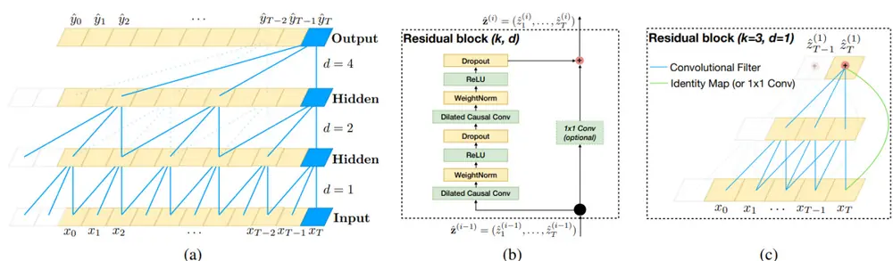
Figure 1. Architectural elements in a TCN. (a) A dilated causal convolution with dilation factors d = 1, 2, 4 and filter size k = 3. The receptive field is able to cover all values from the input sequence. (b) TCN residual block. An 1x1 convolution is added when residual input and output have different dimensions. (c) An example of residual connection in a TCN. The blue lines are filters in the residual function, and the green lines are identity mappings.
资料来源：《An Empirical Evaluation of Generic Convolutional and Recurrent Networks for Sequence Modeling》1，长江证券研究所

## 最大时间长度上限

TCN 神经网络虽然可以接受任意时间长度的输入数据，但是不同于循环神经网络，在参数固定的情况下，它存在可学习的时间长度上限。具体而言，其上限由三个参数决定—

—残差模块个数 n，膨胀基数 d 和一维卷积核大小 k。下面我们直接给出最大时间长度上限 L 的公式。

$$
\mathrm{L}=1+\sum_{i=0}^{n-1}2(k-1)d^{i}=1+2(k-1){\frac{d^{n}-1}{d-1}}
$$

## 数据处理

首先，我们需要再次明确模型的输入和目标，以便于理解如何处理数据。TCN神经网络针对每一个样本，读取该股票从 T 日往前推过去 63 个交易日的最高价、开盘价、最低价、收盘价、成交均价、成交量、成交额 7 个特征，也就是说每一个样本的输入数据是63 × 7 的数据矩阵。所预测的对象即目标值是 T+1 日至 T+21 日以收盘价计算的未来20 日涨跌幅。

明确了输入和目标，我们需要思考如何对数据进行处理。如果不对数据进行处理，不同股票不同特征之间的量纲均有较大差异，会极大影响模型的效果。我们希望模型对不同股票具有基本一致的判断原则，判断依据应该以各个特征时序上的变化程度和走势为主，而不应该被实际股票价格的高低所影响。因此针对数据，我们进行了以下三项处理：

过去 63 日的五个价格数据——最高价、开盘价、最低价、收盘价、成交均价，均除以T-63 日的收盘价。

过去 63 日的成交量和成交金额分别进行最大最小值归一，即分别对成交量和成交金额计算以下公式：

$$
vol_{t}=\frac{vol_{t}-\operatorname*{min}(vol_{i})}{\operatorname*{max}(vol_{i})-\operatorname*{min}(vol_{i})},i=1,2,\dots63
$$

对目标值也就是未来 20 日涨跌幅计算截面分位数。

首先，对输入数据中价格数据的处理，是为了消除不同股票价格数据量纲的影响，得到的数据同时保留了时序上的变化情况以及截面上的不同价格数据的差异，仅仅忽视了价格的实际大小，保留了所有其他变化和差异信息。

其次，对输入数据中成交量和成交金额的处理，同样是为了将数据均限制在 0 到 1 之间，直观上来形容，模型读取的实际是类似于反应成交量和成交额时序变化的序列。

最后，对目标值的处理，是考虑到我们最终挖掘的因子仍然是以截面选股为最终目的，因此应该以预测相对排名为主。但是我们并没有采用截面收益率或者截面标准化等方法，主要是因为截面分位数虽然放弃了收益率之间的实际差异大小这一重要信息，但是就目前的金融数据而言，收益率之间的实际差值的噪声过大，因此放弃部分有效信息的同时能剔除大量无效噪声。直观上来形容，我们不去预测实际未来 20 日收益率，而直接以预测股票未来 20 日收益率排名为目标。

## 数据样本

在数据区间选择上，我们使用自 2005 年 1月 1 日到2023年 9 月 30 日沪深两市上全 A的日频量价数据，其中关于训练集、验证集和测试集的划分，我们将在后文使用前作说明，因为不同小节的数据划分会有所不同。

## 定义网络结构

本文的输入数据时间步长为 63 天，因此最终我们将网络的参数定为 5 个残差模块，其中每一个一维卷积核的大小均为 2，膨胀基数为 2。具体而言，第一个残差模块的膨胀系数为 1，第二个为 2，第三个为 4，第四个为 8，第五个为 16。在本文中根据以上参数和最大时间长度上限公式可以计算得到我们的 TCN 神经网络，所能学习到的最大时间长度上限为 63 天，即接近一个季度的量价数据。

为了批量产生多个因子，我们选择将网络的输出数据格式设置成 64 × 1 的向量。每支股票每天根据过去 63 天的量价数据通过网络计算得到 64 个预测值即量价因子。

图 2：本文 TCN 网络结构
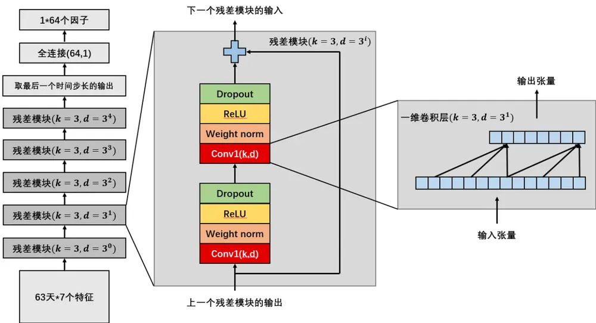
资料来源：长江证券研究所

## 因子挖掘损失函数的设计

## 单对单有效性

在通常的时序预测任务中，损失函数只需要考虑如何衡量单个预测值预测单个真实目标值的准确性，我们简称为单对单时序预测任务。在这种情形下，普适性最强的损失函数为 MSE（均方误差），它基本适用于任何回归预测问题。而在预测股票收益率领域，其泛用性同样是毋庸置疑的。

$$
Loss_{1}=\frac{\sum(\hat{y}-y)^{2}}{n}
$$

另一方面，我们在度量因子有效性时，往往采用的是预测值和目标值的截面相关系数或是截面秩相关系数，也就是 IC 和 RankIC。虽然如果因子值的MSE 越小，IC 和 RankIC通常来讲是越高的，但是二者也并非完全等价。这也就衍生出了另一个可微分的损失函数——相关系数的相反数。

$$
\begin{array}{r}{Loss_{2}=-\mathrm{Corr}(\hat{y},y)}\end{array}
$$

它的好处在于直接以因子 IC 作为优化目标，并且适用于深度学习批量化数据的训练模式。因此我们在后文中主要以 $Loss_{2}$ 为有效性的计算基础。

## 多对单有效性

本文的任务不仅是需要有效预测单个目标值，还要批量输出多个有效的预测值，而这需要神经网络对一个样本的数据输出一个多维向量，该向量的每一个值均可视为一个独立的因子或称为预测值。因此也就需要思考如何度量多个因子的整体有效性，也就是多对单任务的有效性。

第一种思路是依次度量向量中每一个因子的有效性，再将有效性求平均，即可得到所有因子整体的有效性。

$$
\mathit{Loss}_{3}=\frac{\sum_{i=1}^{n}-\mathrm{Corr}(\widehat{y_{i}},y)}{n}
$$

第二种思路是将所有因子先取均值，再求得到的等权合成因子的有效性，即可反映多个因子的整体有效性，且同时可以反应多个因子的线性可加性。

$$
Loss_{4}=-\mathrm{Corr}(\sum_{i=1}^{n}\widehat{y}_{i},y)
$$

在我们看来，以上两种思路各有利弊。第一种思路是最适合因子挖掘的思路，这种设计会使得每一个因子作为独立的个体，模型在不断训练的过程中会提升每一个因子的有效性。第二种思路会弥补第一种思路对组合因子的忽视，每一个因子都有效不代表合成后的因子必然有提升，很多时候会出现合成因子的有效性仅仅是合成前多个因子有效性的中位数。

综上所述，我们在损失函数的尝试中，将会同时加上以上两种多对单有效性的损失函数。

## 多对单重复性

除了有效性，在因子挖掘领域还有一个很重要的衡量指标——因子间相关性。再次思考神经网络挖掘因子的意义，我们希望批量获得多个有效且不一样的市场规律。在先前的工作中，我们先设计了如何获取有效的规律，然后我们设计如何获得多个有效的规律，因此最后我们需要设计如何使得多个有效的规律不一样，也就是尽量降低获得的多个因子之间的相关性。

从因子相关性矩阵出发，我们的目的是限制因子相关性矩阵中每一个值的大小，因此我们可以计算因子相关性矩阵中的每一个值求绝对值后求均值，但是这种方法会使得个别因子间相关性极高个别因子相关性极低。所以我们可以考虑计算因子相关性矩阵中的每一个值的平方再求均值，以此来给相关性极高的因子更高的惩罚约束，使得最终得到的每一个因子与其他因子的相关性都较为平衡。

$$
Loss_{5}=\frac{\sum_{i=1}^{n}\sum_{j=1}^{n}Corr(\widehat{y_{i}},\widehat{y_{j}})^{2}}{n_{2}}
$$

除此之外，我们还可以使用相关性矩阵的二范数，或是对角线归零后的相关性矩阵的列和范数与行和范数限制因子间相关性，后文就不做过多实验。

## 不同损失函数的对比

为了验证损失函数的合理性，本节将分别测试四种损失函数所挖掘的因子表现，以此来判断哪个损失函数更适合神经网络因子挖掘。为了节省时间，本节不做滚动训练，固定训练集为 2005 年到 2018 年，验证集为 2019 年。

损失函数 1：单个因子有效性+合成因子有效性+因子间相关系数

损失函数 2：单个因子有效性+因子间相关系数

损失函数 3：合成因子有效性+因子间相关系数

损失函数 4：单个因子有效性+合成因子有效性

不难发现，损失函数 2 到4 分别为忽略损失函数 1 中的某个部分所得到。

表 1：验证集上不同损失函数因子挖掘表现

| 64 个因子平均 64 个因子平均 等权合成因子 损失函数 |  |  |  |  |
| --- | --- | --- | --- | --- |
|  | Ranklc² | RankICIR | Ranklc³ | 等权合成因子 RankICIR 相关系数均值 |
| 损失函数1 | 7.58% | 97.86% | 14.31% | 144.77% 24.28% |
| 损失函数2 | 7.49% | 102.63% | 14.18% 146.24% | 26.61% |
| 损失函数3 | 2.97% | 42.37% | 13.33% 119.71% | 6.77% |
| 损失函数4 | 12.58% | 105.86% | 12.56% | 105.87% 98.49% |

资料来源：Wind，长江证券研究所

从验证集上结果来看，采用损失函数 1 的神经网络能够在较低的因子间相关系数的限制下同时获得有效性较强的因子。

其次，损失函数 2 在忽略合成因子的有效性的情况下，最终等权合成因子 RankIC 有小幅下降，但是整体差距和损失函数 1 并不大，因子间相关系数可能略有上升。

再看到损失函数3，忽略了单个因子有效性后，64个因子的平均RankIC下降到2.97%，但是等权合成因子仍有 13.33%的 RankIC。这说明如果忽视单个因子有效性，网络所挖因子单个的预测能力将会有很大的差异，部分因子可能存在“浑水摸鱼”的现象，最终导致等权合成因子虽然表现不差，但是仍与前两种损失函数有一定差距。

最后是损失函数 4，在忽略了因子间相关系数后，神经网络所挖因子虽然平均 RankIC高达 12.58%，但同时因子间相关系数也高达 98.49%，说明这 64 个因子基本可以视为同一个因子，等权合成后也几乎没有信息增量，因此等权合成因子 RankIC为 12.56%，与合成前均值相比甚至略有下降。直观上来理解，忽视了因子间相关系数的约束，会使得网络挖掘单个十分有效性的量价因子，并将其重复 64 次，即得到了 64 个十分有效但是几乎相同的因子，类似“抄作业”现象。

## 最终损失函数

最终我们的损失函数定义如下：

$$
Loss_{final}=-\frac{\sum_{i=1}^{n}\mathrm{Corr}(\widehat{\mathcal{V}}_{i},\mathcal{Y})}{n}-\lambda_{1}\mathrm{Corr}(\sum_{i=1}^{n}\widehat{\mathcal{V}}_{i},y)+\lambda_{2}\frac{\sum_{i=1}^{n}\sum_{j=1}^{n}Corr(\widehat{\mathcal{V}}_{i},\widehat{\mathcal{Y}}_{j})^{2}}{n_{2}}
$$

直观上来解释，我们希望网络同时考虑每个因子的有效性，合成因子的有效性，以及因子间相关系数三个部分，前两者越高越高，后者越低越好。

在惩罚项系数上，经过尝试我们令 $\lambda_{1}=0.5,\ \lambda_{2}=1$ ，使得三个部分的惩罚项系数为2:1:2。这部分可以根据自己的需求进行定义，如果需要相关性更低的因子，只需取更高的λ2即可。

## 单年训练实例展示

为了展示单次因子挖掘的整个过程，我们以 2019 年及以前的数据为样本内，预测 2020年之后数据为实验对象。

- 训练集：2005 年 1 月 1 日——2018 年 12 月 31 日；

- 验证集：2019 年 1 月 1 日——2019 年 12 月 31 日；

- 测试集：2020 年 1 月 1 日——2023 年 9 月 30 日。

## 模型迭代过程

图 3：训练集和测试集损失函数折线图
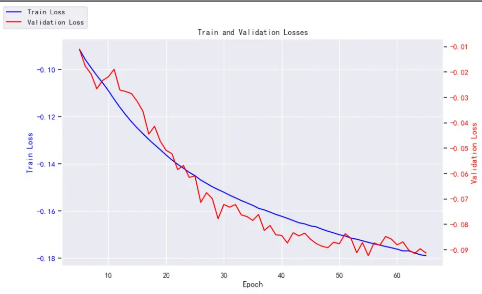
资料来源：Wind，长江证券研究所

图 4：验证集因子间相关系数折线图
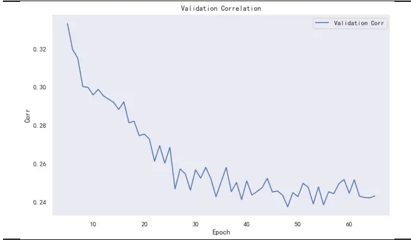
资料来源：Wind，长江证券研究所

图 5：验证集均值合成因子 IC折线图
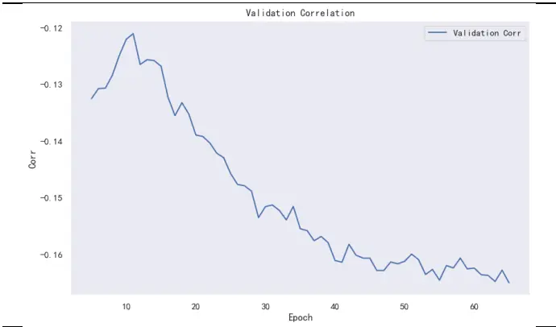
资料来源：Wind，长江证券研究所

由图 3 可知，模型在训练到第65 轮时，由于验证集上的损失函数已 10 轮未有下降，因此停止迭代。整个过程中，训练集上的损失函数下降十分平滑，验证集的损失函数略有波动，但是整体优化过程较为平稳。

图 4 展示的是验证集上每轮迭代后，64 个因子间相关系数变化过程。下降到第五轮时因子间相关系数仍有 0.34 左右，到最后因子间相关系数仅为 0.24。

图 5 展示的是验证集上每轮迭代后，64 个因子均值合成得到的合成因子的 IC 变化过程。可以看到在经过 5 轮迭代后，IC 快速提升到 0.13。随着轮数的上升，最终 IC 是提升到了 0.16 的水平，并且仍有不断提升的趋势，但是由于损失函数中合成因子 IC 仅占一部分，因此我们以损失函数为早停依据的情况下，模型在 65 轮完成学习。

## 64 个因子分年 IC

我们对所得的 64 个因子，在测试集也就是 2020 年以来进行分年回测，同时加入 64 个因子的均值合成因子。

64 个单因子 2020 年以来的平均 RankIC 为 6.74%，平均 RankICIR 为 83.75%。均值合成因子的平均 RankIC 为 12.45%，平均 RankICIR 为 130.75%。

图 6：单次训练-量价因子分年回测

| 因子 | 20 | 20 | 2021 |  | 2022 |  | 2023 |  | 平 | 均 |
| --- | --- | --- | --- | --- | --- | --- | --- | --- | --- | --- |
|  | IC | ICIR | IC | ICIR | IC | ICIR | IC | ICIR | IC | ICIR |
| 0 | 6.78% | 75.26% | 6.34% | 68.12% | 9.75% | 108.12% | 8.60% | 76.55% | 7.61% | 79.15% |
| 1 | 6.34% | 98.32% | 7.20% | 119.73% | 5.37% | 63.57% | 5.12% | 46.20% | 6.09% | 77.28% |
| 2 | 5.70% | 75.13% | 8.27% | 107.19% | 10.46% | 145.80% | 9.86% | 107.79% | 8.41% | 105.06% |
| 3 | 4.78% | 59.97% | 5.99% | 74.79% | 5.82% | 54.70% | 4.44% | 49.40% | 5.35% | 60.18% |
| 4 | 2.25% | 28.97% | 3.63% | 67.88% | 3.36% | 38.01% | 1.34% | 15.46% | 2.83% | 36.85% |
| 6 | 6.64% | 71.04% | 7.55% | 83.58% | 10.55% | 112.90% | 10.10% | 84.43% | 8.46% | 85.53% |
| 8 | 7.46% | 98.08% | 7.01% | 88.91% | 8.51% | 117.14% | 7.18% | 64.80% | 7.52% | 90.70% |
| 9 | 4.87% | 57.91% | 8.24% | 112.81% | 8.32% | 94.24% | 8.38% | 84.94% | 727% | 84.58% |
| 10 | 7.60% | 101.21% | 7.51% | 119.24% | 9.79% | 146.90% | 8.64% | 132.35 | % 8.24% | 120.05% |
| 11 | 5.69% | 57.03% | 7.80% | 86.56% | 8.80% | 99.30% | 11.68% | 99.04% | 8.06% | 81.08% |
| 12 | 6.38% | 72.81% | 8.46% | 119.61% | 8.55% | 98.66% | 3.49% | 34.90% | 7.04% | 80.98% |
| 13 | 7.63% | 111.04% | 5.63% | 89.28% | 9.71% | 159.57% | 5.29% | 67.75% | 719% | 104.69% |
| 14 | 696% | 107.98% | 3.39% | 56.49% | 7.35% | 111.54% | 5.98% | 85.41% | 6.01% | 90.12% |
| 15 | 6.85% | 99.60% | 6.59% | 117.00% | 7.45% | 9511% | 8.82% | 117.13% | 7132 | % 104.77% |
| 16 | 6.46% | 87.29% | 7.69% | 101.28% | 7.83% | 94.31% | 8.66% | 88.57% | 7.51% | 92.34% |
| 17 | 5.96% | 60.54% | 7.58% | 88.30% | 6.03% | 66.72% | 9.46% | 97.25% | 7.02% | 75.68% |
| 18 | 4.46% | 47.19% | 6.84% | 92.43% | 8.42% | 104.09% | 7.30% | 86.92% | 6.58% | 77.82% |
| 19 | 7.75% | 76.62% | 8.54% | 86.18% | 9.24% |  |  |  |  |  |
| 20 | 6.56% | 95.66% | 5.92% | 88.47% | 8.64% | 113.47% | 6.65% | 82.78% | 6.92% | 94.96% |
| 21 | 8.20% | 136.09% | 695% | 114.34% | 6.41% | 71.60% | 5.66% | 78.46% | 6.94% | 96.69% |
| 22 | 3.13% | 50.46% | 4.85% | 72.95% | 5.17% | 53.70% | 4.49% | 60.62% | 4.36% | 57.51% |
| 24 | 6.48% | 8344% | 7.20% | 82.59% | 781% | 94.00% | 650% | 66.40% | 6.95% | 81.42% |
| 25 | 0.91% | 15.42% | 6.04% | 87.86% | 5.93% | 61.36% | 2.41% | 30.88% | 4.04% | 50.73% |
| 26 | 7.47% | 104.29% | 5.43% | 105.26% | 7.22% | 88.67% | 2.97% | 45.70% | 6.08% | 86.28% |
| 27 | 9.73% | 109.40% | 6.94% | 68.22% | 7.63% | 72.81% | 7.65% | 67.26% | 8.00% | 79.09% |
| 28 | 4.60% | 67.51% | 5.97% | 93.89% | 7.42% | 85.06% | 4.37% | 56.27% | 5.73% | 76.74% |
| 30 | 7.69% | 88.30% | 8.52% | 106.66% | 9.20% | 101.90% | 7.91% | 80.99% | 8.35% | 94.84% |
| 31 | 5.75% | 89.59% | 6.17% | 87.51% | 6.87% | 83.69% | 5.83% | 57.38% | 6.19% | 79.16% |
| 32 | 5.99% | 88.99% | 5.96% | 75.67% | 5.00% |  |  |  |  |  |
| 33 | 7.27% | 84.84% | 5.36% | 58.50% | 9.04% | 95.17% | 10.69% | 111.95% | 7.69% | 82.22% |
| 35 | 4.69% | 46.81% | 10.10% | 96.42% | 6.93% | 65.24% | 7.30% | 51.65% | 7.15% | 63.65% |
| 36 | 8.70% | 101.11% | 7.56% | 93.96% | 9.97% | 132.09% | 9.60% | 96.29% | 8.91% | 105.68% |
| 37 | 5.33% | 8447% | 6.89% | 108.26% | 8.90% | 119.89% | 6.20% | 82.08% | 6.89% | 98.70% |
| 38 | 5.99% | 8110% | 4.33% | 7925% | 7.59% | 109.34% | 4.23% | 57.03% | 5.75% | 82.93% |
| 39 | 696% | 100.33% | 4.55% | 74.17% | 8.31% | 111.76% | 6.72% | 106.65% | 6.66% | 96.97% |
| 41 | 706% | 75.27% | 7.50% | 89.12% | 8.24% | 107.13% | 7.80% | 100.75% | 7.60% | 90.65% |
| 42 | 5.40% | 69.14% | 6.74% | 92.54% | 7.12% | 94.94% | 5.63% | 58.68% | 6.15% | 77.36% |
| 44 | 6.22% | 81.99% | 5.97% | 102.51% | 7.23% | 100.71% | 5.62% | 60.98% | 6.30% | 85.75% |
| 46 | 8.73% | 91.01% | 9.79% | 94.59% | 9.35% | 85.50% | 10.43% | 85.36% | 9.41% | 88.90% |
| 47 | 9.02% | 113.51% | 3.10% | 49.16% | 6.09% | 68.06% | 2.16% | 33.77% | 5.46% | 68.27% |
| 48 | 5.52% | 67.48% | 8.08% | 107.78% | 7.78% | 94.74% | 5.10% | 61.13% | 6.82% | 84.49% |
| 50 | 3.78% | 53.83% | 4.07% | 60.11% | 3.98% | 48.36% | -0.87% | -11.60% | 3.15% | 41.53% |
| 52 | 2.67% | 34.60% | 6.75% | 112.94% | 7.80% | 92.86% | 4.54% | 50.92% | 5.52% | 69.75% |
| 53 | 4.91% | 85.60% | 7.72% | 122.98% | 6.96% | 86.87% | 4.25% | 58.85% | 6.17% | 88.88% |
| 54 | 7.29% | 88.58% | 6.93% | 108.33% | 9.28% | 119.73% | 4.96% | 54.21% | 7.32% | 92.97% |
| 56 | 6.04% | 8336% | 5.23% | 7843% | 7.69% |  |  |  |  |  |
| 57 | 5.97% | 76.60% | 9.39% | 102.83% | 9.97% | 114.29% | 9.23% | 93.41% | 8.52% | 95.99% |
| 58 | 8.13% | 131.25% | 6.03% | 93.40% | 8.79% | 122.85% | 5.98% | 97.82% | 7.41% | 111.13% |
| 60 | 6.00% | 84.36% | 8.46% | 98.78% | 5.98% | 62.95% | 7.74% | 73.67% | 6.90% | 78.06% |
| 61 | 6.57% | 85.05% | 6.67% | 101.46% | 8.24% | 86.62% | 7.45% | 93.37% | 7.18% | 89.89% |
| 63 | 8.86% | 123.80% | 6.38% | 85.84% | 9.17% | 113.45% | 650% | 58.96% | 7.82% | 94.03% |
| 均值因子 | 12.37% | 139.61% | 12.19% | 135.07% | 13.67% 153.11% |  | 11.45% | 95.63% | 12.45% | 130.75% |

资料来源：Wind，长江证券研究所

即使是未进行滚动训练的 TCN 神经网络也能挖掘得到效果优异的日频量价因子。

## 完整分年滚动训练

考虑到市场规律的时变性，我们还是以分年滚动训练来进行完整的因子挖掘和后续策略构建。我们设置的分年滚动训练为，对 T年进行预测时数据集划分如下：

- 训练集：2005 年——T-2 年

- 验证集：T-1 年

- 测试集：T 年

考虑到回测希望能够覆盖较长时间，包含各种市场状态，我们设置测试集首年为 2018年，即进行 6 次滚动训练。其中 2023 年的测试集截至 2023年 9 月 30 日。

## 因子 IC 回测

我们不对训练过程进行更多的赘述和可视化，直接进行因子结果的展示。首先是 6 年测试集下的完整因子 RankIC 和 RankICIR 直方图。

图 7：滚动训练-量价因子 IC直方图
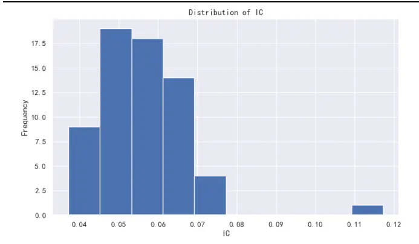
资料来源：Wind，长江证券研究所

图 8：滚动训练-量价因子 ICIR 直方图
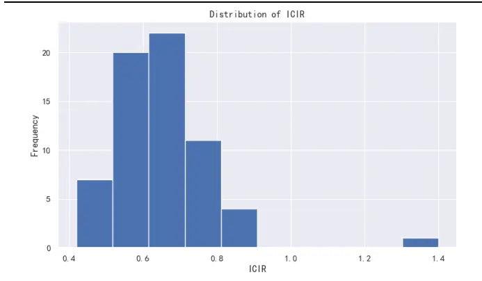
资料来源：Wind，长江证券研究所

在忽略均值合成因子的情况下，64 个日频量价因子的平均 RankIC 为 5.54%，平均RankICIR 为 64.31%，IC 值和 ICIR 值都与正态分布较为相近。在对 64 个因子进行简单的等权合成后，RankIC 值提升到 11.73%，RankICIR 值提升至 140.04%，远超合成前的 64 个因子单因子表现。

图 9：滚动训练-量价因子分年回测
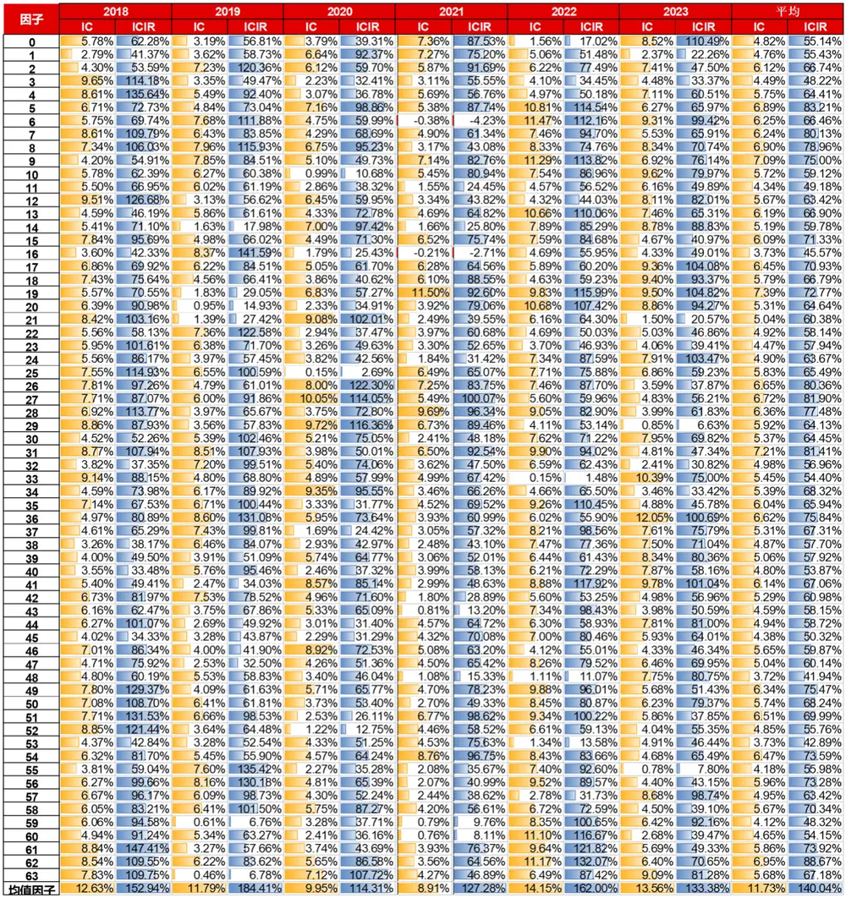
资料来源：Wind，长江证券研究所

## 因子间相关性

其次我们再看到因子间相关系数，我们统计 2018 年以来截面因子间的相关系数大小，并取均值绘制成因子相关性矩阵热力图。其中对角线无意义，因此我们取 0。可以发现，因子间相关系数较为均衡，且基本低于 0.5。整体而言，包含均值合成因子在内的因子间相关系数均值为 0.21。其中因子间相关系数大部分来自于均值合成因子与 64 个量价因子的相关系数所贡献，最后一行和最后一列普遍在 0.5 左右。

且我们对热力图的因子 IC 进行排序，左上角为 IC 最低的因子，右下角为 IC 最高的因子，均值合成因子对高 IC 因子和低 IC 因子并没有过分的相关性偏移。

图 10：滚动训练-因子间相关系数
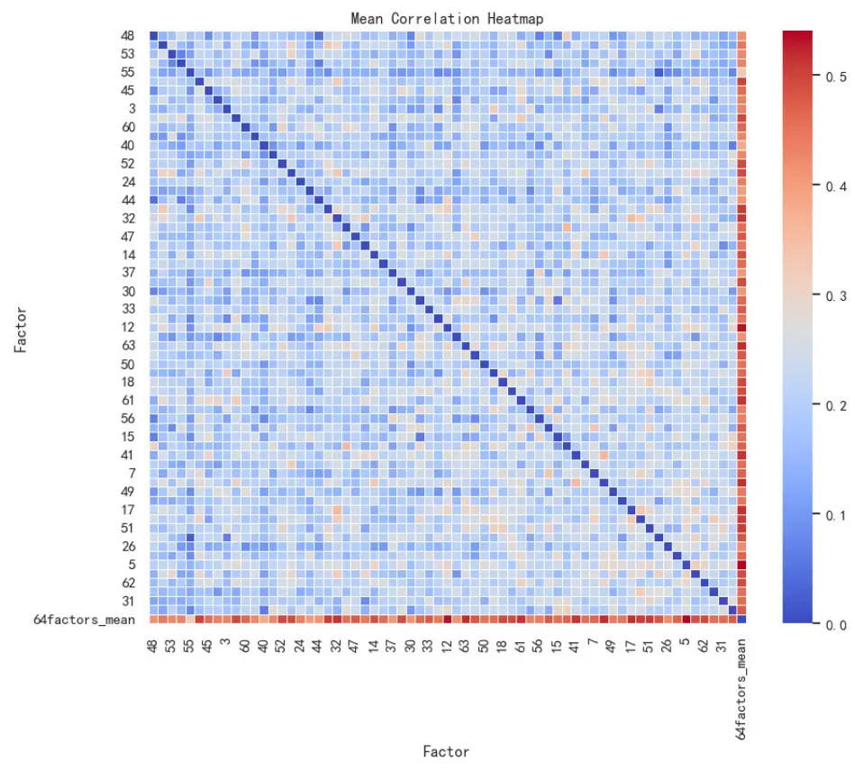
资料来源：Wind，长江证券研究所

## 因子分组相对收益率

为了展示因子的分组相对收益率，我们选取了 64 个因子中IC 值最高的十个因子，进行简单的截面分 20 组分别统计收益率均值。可以看到这十个因子的分组单调性和差异性较为显著。

图 11：滚动训练-因子分组相对收益率
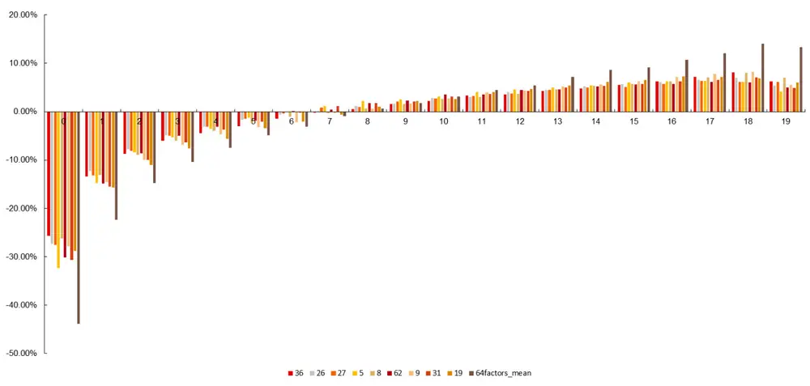
资料来源：Wind，长江证券研究所

## 因子预测未来多个区间收益的效果

虽然网络所挖掘的因子是日频因子，但是由于其目标值为未来 20 日收益率，因此理论上来说因子值与未来 20 日收益率的相关性应该最高。本小节，我们分别统计了因子值与未来 20 日收益率，未来 10 日收益率，未来 5 日收益率和未来 1 日收益率的截面RankIC。从结果来看，收益率区间越短，预测效果越差，这与推测逻辑相符合。

表 2：滚动训练-因子预测未来不同区间收益

| 指标 | 20日收益率 | 10日收益率 | 5 日收益率 | 1日收益率 |
| --- | --- | --- | --- | --- |
| RankIC 均值 | 5.54% | 5.04% | 4.46% | 2.01% |
| RankICIR 均值 | 64.31% | 59.68% | 53.06% | 25.00% |
| 合成因子IC | 11.73% | 10.63% | 9.43% | 4.25% |
| 合成因子 RankICIR | 140.04% | 124.39% | 110.62% | 42.74% |

资料来源：Wind，长江证券研究所

## 因子在不同指数成分股上的表现

为了探究所挖因子在不同指数成分股上的表现，我们选择了沪深 300、中证 500、中证1000 和国证 2000 四个指数成分股。与全 A 上的因子表现作对比，可以发现沪深 300的因子有效性下降最为明显，合成因子 RankIC 从 11.73%下降到 7.24%。但是在国证2000 指数成分股上，64 个单因子和合成因子的有效性均有所提升，2018 年以来合成因子的平均 RankIC 为 12.48%，64 个单因子的平均 RankIC 为 5.96%高于全 A 上的5.54%。这说明，因子在市值较小的股票上表现比大市值股票好，这个现象是目前市场上大部分因子均存在的，原因可能是关注度较高的股票错误定价更少。

表 3：滚动训练不同指数成分股下的因子表现

| 指数 | 因子 | 2018年 |  | 2019年 |  | 2020年 |  | 2021年 |  | 2022年 |  | 2023年 |  | 平均 |  |
| --- | --- | --- | --- | --- | --- | --- | --- | --- | --- | --- | --- | --- | --- | --- | --- |
|  |  |  | IC ICIR | IC | ICIR | IC | ICIR | IC | ICIR | IC | ICIR | IC | ICIR | IC | ICIR |
| 沪深 300 | 64 个因子 | 2.77% | 23.63% | 1.63% | 13.15% | 2.74% | 22.96% | 1.19% | 9.09% | 4.50% | 34.80% | 5.44% | 40.63% | 2.90% | 22.17% |
|  | 合成因子 | 6.99% | 61.96% | 4.30% | 33.76% | 6.60% | 46.47% | 3.18% | 26.42% | 10.80% | 89.08% | 13.78% | 104.83% | 7.24% | 55.54% |
| 中证 | 64 个因子 | 4.01% | 44.22% | 2.88% | 30.41% | 3.06% | 29.84% | 2.12% | 21.43% | 4.85% | 40.08% | 4.41% | 37.46% | 3.50% | 32.23% |
| 500 | 合成因子 | 8.84% | 88.03% | 6.75% | 83.98% | 7.34% | 71.92% | 4.80% | 56.20% | 10.97% | 105.03% | 10.82% | 104.54% | 8.10% | 82.35% |
|  | 64 个因子 | 5.92% | 72.83% | 5.40% | 68.16% | 4.60% | 53.13% | 3.46% | 41.67% | 5.91% | 56.72% | 5.24% | 50.26% | 5.08% | 54.23% |
| 中证 1000 | 合成因子 | 12.03% | 128.78% | 12.82% | 200.12% | 10.22% | 111.91% | 7.42% | 96.63% | 12.38% | 122.94% | 12.05% | 110.11% | 11.10% | 121.85% |
|  | 64 个因子 | 6.95% | 92.89% | 5.43% | 81.59% | 5.25% | 61.84% | 4.76% | 64.41% | 7.41% | 77.74% | 5.99% | 58.30% | 5.96% | 68.16% |
| 国证 2000 | 合成因子 | 13.65% | 163.23% | 12.35% | 183.12% | 10.94% | 110.58% | 9.97% | 129.73% | 15.05% | 163.29% | 13.12% | 114.30% | 12.48% | 138.46% |

资料来源：Wind，长江证券研究所

其次，当我们关注到分年的因子表现时，可以发现我们的量价因子在各个指数成分股上包括全 A 上都存在年份有效性差异。其中 2021 年的因子表现普遍落后于其他年份，2022 年因子普遍表现优于其他年份。

图 12：滚动训练合成因子分年 IC条形图
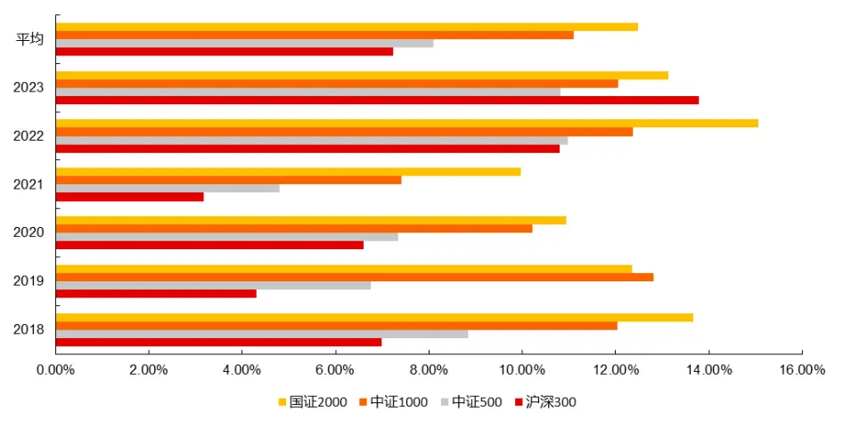
资料来源：Wind，长江证券研究所

2023 年以来，截止到 9 月 30 日，合成因子在沪深 300 指数成分股上的有效性反超其他三项指数，RankIC 高达 13.78%。

## 小结

综上所述，我们可以得出结论：

- TCN 神经网络所挖的 64 个量价因子在全 A 上虽然效果不尽相同，但是均有一定的截面选股作用。

- 在进行简单的等权合成后，因子的效果有比较大的提升，证明了 64 个量价因子有较好的线性合成性，在合成时不会出现信息重叠等负面现象。

- 因子间相关系数偏低，且较为均衡，说明 64 个因子所蕴含的选股规律各不相同，在合成时能够提供不同的信息增量。

因子预测未来 20 日收益率效果最佳，预测效果随着未来区间的缩短逐步减少。

- 整体来看，因子在较小市值股票上的选股效果略高于大市值股票，但是这个现象在2023 年有一定的反转。

## 日频量价因子策略

如何合理应用预测未来 20日收益率的日频因子呢？

由于我们的因子是预测未来 20 日收益率，因此每支股票必须要持有 20 日才能享受完整的预测收益，如果持有较短时间，则会较大程度地浪费我们的预测能力，这可以从“因子预测未来多个区间收益的效果”小节分析结果得知。

最简单的做法是构建一个每隔 20 日依据最新的因子值进行一次完整调仓的选股策略。这个方法较为容易实现，但是并没有运用到日频因子的所有信息，它忽略了非调仓日的因子值所提供的信息，且存在一个不稳定性，即建仓日的选择，建仓日的不同可能会大幅影响到策略的最终表现。

因此我们选择以不同建仓日的 20个子策略并行投资的方式，来构建最终的选股策略。

直观上来说，我们从测试集初始日开始，每一天构建一个子策略，直到第 21 天开始不再增加子策略。20 个子策略互不影响，调仓日刚好错开，第二十个子策略调仓后的下一日就是第一个子策略的调仓日，以此构成一个循环。

如果将其思考成一个整体策略，这个策略所做的就是每日以收盘价卖出 20 日前买入的股票，并在当日用卖出的资金以收盘价买入应该买入的股票。从换手率的角度来看，虽然该策略是日频调仓策略，但是换手率水平与月频调仓策略接近，每日单边换手在 5%左右。

接下来，我们需要思考如何同时应用 64 个量价因子以及均值合成因子。我们选择等权合成这 65 个因子的截面分位数，得到最终的打分值。并以此为依据计算多头，空头等收益。

## 分组比例影响

我们探究了不同分组数下的多空收益，分成 5 组时多头因子值前 20%的股票，空头因子值后 20%的股票。分成 10 组、分成 20 组、分成 50 组和分成100 组分别对应多空市场上股票数量 10%、5%、2%和1%的股票。

可以发现，随着比例的减小多头收益和多空收益都在不断提升。这说明，我们 65 个因子的打分值有较强的选股能力，并且因子值越高，股票收益越高，因子值越低股票跌幅越高。这种单调性十分明显，以至于在细分到 100 组时，仍然生效。

表 4：不同分组比例的多空收益

| 分成X组 | 2018年以来 多头总收益 | 2018年以来 多空总收益 | 多头年化收益 | 多空年化收益 |
| --- | --- | --- | --- | --- |
| 分成5组 | 120.06% | 81.66% | 14.52% | 10.91% |
| 分成10组 | 151.34% | 173.63% | 17.07% | 18.72% |
| 分成 20 组 | 165.74% | 285.71% | 18.15% | 25.57% |
| 分成 50 组 | 177.01% | 499.02% | 18.96% | 34.85% |
| 分成100 组 | 183.82% | 720.16% | 19.43% | 41.88% |

资料来源：Wind，长江证券研究所

## 最终策略

日频策略设置：

- 股票池：沪深两市全 A，非停牌、ST 股票；

- 买入条件：当天因子值排名为全市场符合条件的股票的前 1%；

- 交易成本：千分之二；

- 时间区间：2018 年 1 月 3 日——2023 年 9 月 26 日。

将万得全 A 作为基准，从净值曲线和超额回撤面积图来看，整体超额净值较为平稳。最大超额回撤发生在 2021 年初，相比于万得全 A 有 20.74%的超额回撤，风险上仍有待优化。

图 13：策略净值
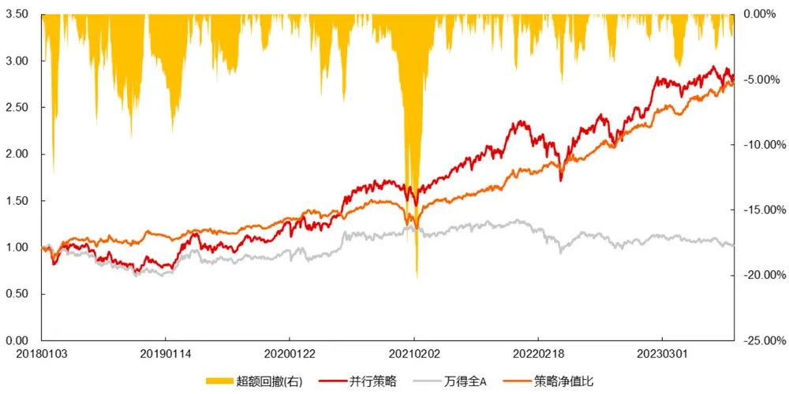
资料来源：Wind，长江证券研究所

2018 年以来，相对于万得全 A，每年均有较高的超额收益，年化超额 20.31%，日频超额胜率 55.16%。2023 年以来，已实现年化超额 19.01%。

表 5：分年收益率、最大回撤和胜率

| 指标 | 并行策略（20个子策略） | 万得全A 超额收益 |
| --- | --- | --- |
| 2018 收益率 | -20.00% | -29.66% 9.66% |
| 2019 收益率 | 49.78% | 34.29% 15.49% |
| 2020 收益率 | 35.69% | 23.65% 12.04% |
| 2021 收益率 | 40.17% | 7.47% 32.70% |
| 2022 收益率 | 2.80% -18.49% | 21.29% |
| 2023 收益率 | 15.73% -3.28% | 19.01% |
| 年化收益率 | 20.80% 0.40% | 20.31% |
| 最大回撤 | -30.60% -33.17% | -20.74% |
| 日频胜率 | 56.31% 50.86% | 55.16% |

资料来源：Wind，长江证券研究所

## 总结

因子挖掘可以分成三种方式：人工挖掘因子，遗传规划挖掘因子，神经网络挖掘因子。前者基于逻辑，后两者基于算力。一方面，我们认为神经网络相比于人工挖掘因子的优势在于批量生成有效且低相关因子。另一方面，相比于遗传规划挖掘因子，神经网络完全牺牲所挖因子的可解释性从而提升因子的有效性上限。虽然目前仍在探索过程中，但是随着深度学习的发展，神经网络挖掘因子将逐步展示其优越性。

TCN（Temporal Convolutional Network）是一种用于处理序列数据的深度学习模型，它通过卷积操作来捕获输入数据中的时间动态信息，其主要优势如下：

1. 并行计算：TCN可以并行处理输入数据，这使得它在处理长序列数据时，比 RNN具有更高的效率。

2. 捕获长距离依赖：TCN可以通过使用膨胀卷积（Dilated Convolution）来捕获输入数据中的长距离依赖关系，这使得模型在处理长序列数据时，可以更好地理解数据的全局信息。

3. 残差链接：它允许网络在前向传播过程中跳过某些层，直接从输入层到输出层。这种连接方式可以帮助网络更好地学习输入数据的特征，从而提高模型的性能。

我们希望网络同时考虑每个因子的有效性，合成因子的有效性，以及因子间相关系数三个部分，前两者越高越高，后者越低越好。我们依次剔除了上述损失函数中的某一部分，来观察它对所挖因子的影响。最后发现，忽视任意一部分约束，都将使得所挖因子在该方面有一定的损失，这说明了我们所构建的损失函数的合理性。

最终我们使用 TCN 神经网络以股票过去 63 日的量价数据作为输入，预测隔天未来 20日收益率，获得了 64 个量价因子和 1 个等权合成因子。样本外 2018 年以来 64个量价因子的平均 RankIC 为 5.54%，等权合成因子的 RankIC 为 11.73%，表现优异。在各指数成分股上也有较好的表现。最终构建多头策略，2018 年以来，每年均实现了较高的超额收益，平均年化超额收益为 20.31%。

## 风险提示

1、TCN神经网络为深度学习模型，在训练的过程中有一定的随机性，随机性包括训练数据集的划分和网络结构中的随机丢弃等，以上情况均可能导致预测结果会有波动和误差风险。

2、市场量价规律可能随时间变化而变化，模型总结的规律是基于历史数据且是固定的，存在失效风险。

3、日频交易的投资策略较为理想化，回测结果仅供参考。需要注意实际交易时可能存在的滑点等投资风险。

## 投资评级说明

|  | 行业评级报告发布日后的12个月内行业股票指数的涨跌幅相对同期相关证券市场代表性指数的涨跌幅为基准， 投资建议的评级标准为： |
| --- | --- |
|  | 看 好：相对表现优于同期相关证券市场代表性指数 |
|  | 中 性：相对表现与同期相关证券市场代表性指数持平 |
|  | 看 淡：相对表现弱于同期相关证券市场代表性指数 |
|  | 公司评级报告发布日后的12个月内公司的涨跌幅相对同期相关证券市场代表性指数的涨跌幅为基准，投资建 |
| 买 | 议的评级标准为： 入：相对同期相关证券市场代表性指数涨幅大于10% |
| 增 | 持：相对同期相关证券市场代表性指数涨幅在 5%～10%之间 |
| 中 减 | 性：相对同期相关证券市场代表性指数涨幅在-5%～5%之间 |
| 级： | 持：相对同期相关证券市场代表性指数涨幅小于-5% 无投资评由于我们无法获取必要的资料，或者公司面临无法预见结果的重大不确定性事件，或者其 |
| 他原因，致使我们无法给出明确的投资评级。 相关证券市场代表性指数说明：A股市场以沪深300指数为基准；新三板市场以三板成指（针对协议转让标的） 或三板做市指数（针对做市转让标的）为基准；香港市场以恒生指数为基准。 |  |

## 办公地址

| 上海 | 武汉 Add/武汉市江汉区淮海路88 号长江证券大厦 37 楼 |
| --- | --- |
| Add/浦东新区世纪大道1198号世纪汇广场一座29层 P.C /(200122) | P.C /(430015) |
| 北京 Add /西城区金融街 33 号通泰大厦 15层 | 深圳 Add /深圳市福田区中心四路 1 号嘉里建设广场 3 期 |
| P.C /(100032) | 36 楼 |
|  | P.C /(518048) |

## 分析师声明

作者具有中国证券业协会授予的证券投资咨询执业资格并注册为证券分析师，以勤勉的职业态度，独立、客观地出具本报告。分析逻辑基于作者的职业理解，本报告清晰准确地反映了作者的研究观点。作者所得报酬的任何部分不曾与，不与，也不将与本报告中的具体推荐意见或观点而有直接或间接联系，特此声明。

## 重要声明

长江证券股份有限公司具有证券投资咨询业务资格，经营证券业务许可证编号：10060000。

本报告仅限中国大陆地区发行，仅供长江证券股份有限公司（以下简称：本公司）的客户使用。本公司不会因接收人收到本报告而视其为客户。本报告的信息均来源于公开资料本公司对这些信息的准确性和完整性不作任何保证，也不保证所包含信息和建议不发生任何变更。本公司已力求报告内容的客观、公正，但文中的观点、结论和建议仅供参考，不包含作者对证券价格涨跌或市场走势的确定性判断。报告中的信息或意见并不构成所述证券的买卖出价或征价，投资者据此做出的任何投资决策与本公司和作者无关。

本报告所载的资料、意见及推测仅反映本公司于发布本报告当日的判断，本报告所指的证券或投资标的的价格、价值及投资收入可升可跌，过往表现不应作为日后的表现依据；在不同时期，本公司可以发出其他与本报告所载信息不一致及有不同结论的报告；本报告所反映研究人员的不同观点、见解及分析方法，并不代表本公司或其他附属机构的立场；本公司不保证本报告所含信息保持在最新状态。同时，本公司对本报告所含信息可在不发出通知的情形下做出修改，投资者应当自行关注相应的更新或修改。

本公司及作者在自身所知情范围内，与本报告中所评价或推荐的证券不存在法律法规要求披露或采取限制、静默措施的利益冲突。

本报告版权仅为本公司所有，未经书面许可，任何机构和个人不得以任何形式翻版、复制和发布。如引用须注明出处为长江证券研究所，且不得对本报告进行有悖原意的引用、删节和修改。刊载或者转发本证券研究报告或者摘要的，应当注明本报告的发布人和发布日期，提示使用证券研究报告的风险。未经授权刊载或者转发本报告的，本公司将保留向其追究法律责任的权利。