金融工程丨深度报告

# 神经网络因子挖掘（二）——1 分钟频量价因子

## 报告要点

[Table_Summary] 我们尝试使用 TCN 模型对每日 1 分钟频率的量价数据进行因子挖掘，旨在挖掘更多有助于选股的日内量价变化信息。1 分钟频率数据的处理难度较大，因此选择了一种牺牲内存以提升网络训练速度的方法。最终经过多项尝试，我们采用分日多模型 TCN，通过单独构建每日数据的TCN 再集成得到 1分钟频率量价因子。与日频量价因子合成后，因子的稳定性和有效性均有所提升，但仍存在多空收益失衡和短期回撤严重等深度学习量价因子的“通病”。2024年以来，“合成因子”呈现出先大跌后大幅反弹的现象。

分析师及联系人

郑起SAC：S0490520060001

韩轶超SAC：S0490512020001SFC：BQK468

# 神经网络因子挖掘（二）——1 分钟频量价因子

[Table_Summary2] 深度学习方法或存在高胜率低盈亏比的特点

我们通过样本外跟踪前期报告《神经网络因子挖掘——TCN 日频量价因子》得到的日频量价因子发现，2023 年四季度虽然持续有效，但是因子在 2024 年以来截止 2 月 8 日以来发生明显失效。经过多项测算，我们认为日频量价因子近期回撤分组来看，回撤主要集中在多头端；分域来看，回撤主要集中在小市值股票。而从深度学习模型训练方法出发，我们认为目前主流的深度学习模型都存在关注胜率，相对忽视盈亏比的问题。这可能是导致深度学习方法在构建策略时虽然长时间看胜率较高，但是也可能在短时间内遭受较大幅度的回撤的根本原因。

## 1 分钟频率量价数据

为了进一步挖掘更多信息的量价因子，我们选择使用 TCN 模型对每日 1 分钟频率的量价数据进行因子挖掘，来尝试挖掘更多对选股有帮助的日内量价变化信息。在数据处理和模型训练框架的设计过程中，我们发现相比于日频量价数据，1 分钟频率量价数据的数据量和处理难度都较大，因此我们选择了一种牺牲内存大幅提升网络训练速度的方法。虽然日内量价数据需要花费较大时间成本去处理和调整，但是这从另一个角度看这也可能是一种技术壁垒。

## 分日多模型 TCN

我们最终的实验方案为使用过去 5 日1 分钟频率量价数据来预测未来 5 日收益率。在网络结构设计上，过去 5 日数据直接放入单模型 TCN 可能存在一个经济意义上的问题，即不同日期的1 分钟频率量价数据可能会有间断性。因此我们选择将每日的数据拆分后单独构建一个 TCN进行学习，再将不同天数得到的信息进行集成。经过验证集的计算，分日多模型 TCN 明显优于单模型 TCN。

## 1 分钟频率量价因子+日频量价因子

我们将 1 分钟频率量价因子和日频量价因子分别计算截面均值方差标准化后再进行等权合成得到最终的“合成因子”。从因子 RankIC 变化和分组收益率来看，合成后因子的稳定性和有效性均有不小的提升，说明 TCN 神经网络所挖掘的日间量价信息和日内量价信息有较好的互补提升性。但是仍然存在“多空收益失衡”以及“短期回撤严重”等前文所总结的深度学习模型的弊端。2024 年以来，“合成因子”呈现出以春节为间隔点先大跌后大幅反弹的现象。截止 3月 1 日，因子在除中证全指以外的主流宽基指数成分股内已取得不俗的多头超额收益，而中证全指上的多头超额收益已从低点的-20%左右回升至-2.35%。

## 风险提示

1、深度学习模型训练过程中有随机性，可能导致预测结果有误差；

2、模型总结的市场规律是基于历史数据的，存在失效风险。

3、日频交易策略回测结果仅供参考，需要考虑实际交易存在的滑点等风险。

## 相关研究

[Table_Report] •《绝对收益（九）：宏观利率择时与长短债轮动》2024-02-28

- 《机构洞察系列（一）：三问三答，医药投资新解法的迭代》2024-02-24

- 《上市公司回购全解析》2024-02-24

更多研报请访问长江研究小程序

## TCN日频量价因子回顾

我们在前期报告《神经网络因子挖掘——TCN日频量价因子》中使用时间卷积神经网络（TCN）学习股票过去 63 日的量价数据变化信息批量挖掘出 64 个量价因子，目标在于预测未来 20 日收益率。并且进行逐年滚动训练，将 64 个量价因子进行二次加工合成，获得最终构建策略的信号（下文统称为日频量价因子），在报告的测试集 2018 年 1月 1日至 2023 年 9月 30 日上有较好的表现。

我们在样本外持续预测跟踪，并在 2023 年末更新训练集和验证集，重新训练模型用于2024 年预测。图 1 为沪深 A 股上预测值前 1%的多头策略净值，不难发现策略表现可以分成两段进行分析：策略在 2023年四季度持续有效并且相对万得全 A收获了较高的超额收益；但于 2024 年 1 月下旬开始，多头策略相对于万得全 A 的净值比持续下行，超额回撤陡增。

图 1：TCN日频量价因子样本外多头策略净值跟踪（截止 20240208）
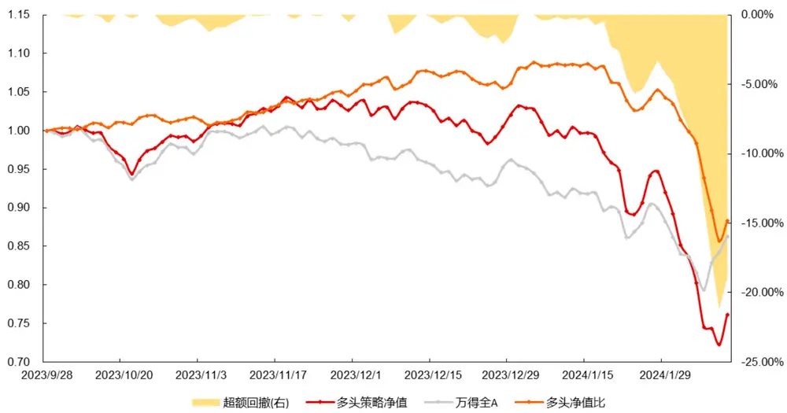
资料来源：Wind，长江证券研究所

## 2023年四季度持续有效

2023 年四季度策略持续有效，相对万得全 A 获得 5.90%的超额收益，但是从净值比走势来看，四季度超额主要集中在 2023 年 11 月份，2023 年 12 月份多头超额整体处于回调阶段。最后在 2023 年 12月末和 2024 年 1 月初获得最后一波超额，并与 2024 年1 月下旬开始大幅回调。

图 2：TCN日频量价因子 2018年以来多头策略净值跟踪（截止 20240208）
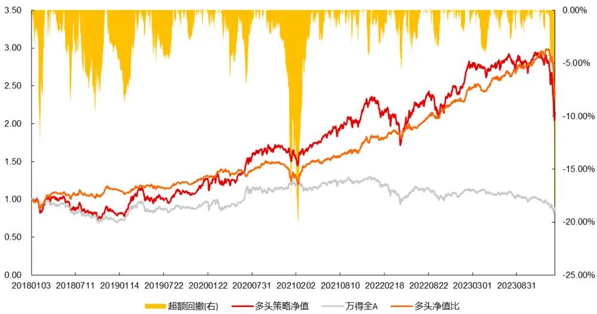
资料来源：Wind，长江证券研究所

## 深度学习方法或存在高胜率低盈亏比的特点

2024 年 1 月末 2 月初预测效果显著下滑，全 A 上选股效果大幅回撤，这与微盘股大幅回撤有较高的相关性。不可否认的是深度学习量价因子天然对小市值股票有较高的偏好，其原因可能是由于小市值股票错误定价现象存在高胜率低盈亏比的特点。

深度学习模型的训练目标是最小化损失函数，通常来说损失函数采用预测值和真实值的均方误差或相关系数，这就导致模型学习的目标是基于每个样本的预测胜率出发。举例说明，考虑深度学习因子在一周内的负超额足以覆盖掉前一年的正超额的情况下，我们不论是计算均方误差还是相关系数都会发现深度学习因子依然十分有效，但是从收益的角度来看它是失效的。也就是说在不改变目标函数的情况下，深度学习模型更多关注胜率，相对忽视盈亏比。

因此我们可以发现深度学习方法在构建策略时虽然长时间看胜率较高，但是也可能在短时间内遭受较大幅度的回撤。

## 成分股内多空收益相对稳定

为了探究日频量价因子在成分股内的有效性，我们使用因子在成分股内构建多空组合，计算方法为多头成分股内因子值前 10%的股票同时空头因子值后 10%的股票，采用等权加权方法。最终各指数的分年多空收益呈现在图 3 中，可以发现 2018 年以来中证1000 和国证 2000 市值较小的成分股内多空收益明显较高。

另一方面，从图 4 的多空收益净值近期表现来看，2023 年四季度以来上证 50 和沪深300 表现较为突出。2024 年截止 2 月8 日，中证 500 多空收益为 11.02%，各大指数多空收益均为正值，这与全 A 上多头超额大幅回撤的现象并不一致。

其一，日频量价因子在全 A 上虽有失效，但是集中体现在多头超额，空头端预测能力依旧强势。其二，经过进一步的测算我们发现成分股内多头超额下降最严重的国证 2000也仅有 2.80%的负超额。这说明日频量价因子在微盘股内有效性大幅下滑或是全 A 上多头超额显著下滑的主要原因；而在成分股内多头超额虽有下降，但是幅度较小。通过以上分析，我们可以得到关于日频量价因子近期回撤的两个结论：分组来看，回撤主要集中在多头端；分域来看，回撤主要集中在小市值股票。

图 3：成分股内分年多空收益（截止 20240208）
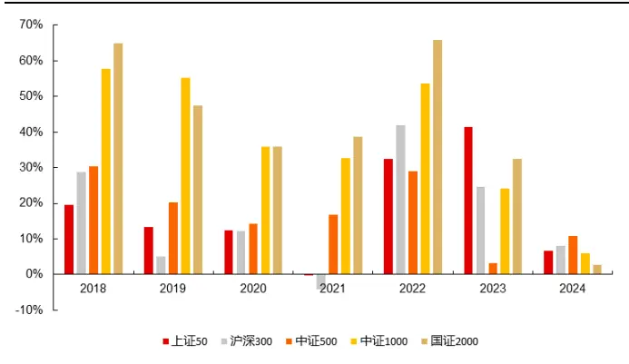
资料来源：Wind，长江证券研究所

图 4：2023 年四季度以来成分股内多空收益净值（截止 20240208）
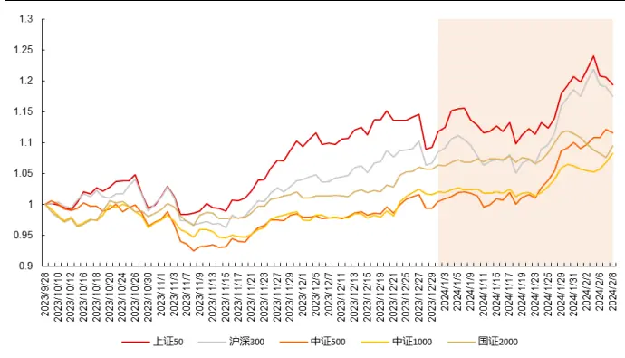
资料来源：Wind，长江证券研究所

## 分钟频率深度学习因子挖掘

虽然近期深度学习因子多头超额集体遭受较大的回撤，但是从历史数据的角度来看，并非首次出现大幅失效，因此我们认为本次回调仅代表深度学习方法确有缺陷，但是其仍具有较高的研究意义。

为了进一步挖掘更多信息的量价因子，最自然的想法就是提高原始数据的频率。近几年关注度较高的高频因子，主要的思路就是通过不同的计算方法将日内量价信息提取成不同的日频因子。既然日频量价数据可以使用深度学习模型进行因子挖掘，那么只要设计得当，深度学习模型应该也可以用于挖掘日内量价信息。

但是在尝试之前，我们可以简要分析下日内量价数据相对于日频数据的利弊。其一，更低的信噪比：高频是日内量价数据最大的特点，但是在金融数据中高频往往伴随着更高的噪声即低信噪比；其二，训练速度：日内量价数据的数据量远高于日频，因此在不更新算力的情况下，使用深度学习模型可能存在训练速度过慢，数据生成过慢等情况。

## 1分钟频率量价数据

日内量价数据主要可分为订单簿数据和按照不同频率切片的快照数据。订单簿数据是最原始的交易数据，含有大量信息，但是处理起来有一定的难度：一方面，数据量远超任何频率的快照数据，普通个人计算机很难完整的将历史订单簿数据存到本地磁盘；另一方面，如果不进行特殊的处理，很难作为深度学习模型的输入特征来直接进行训练。

因此本文选择使用深度学习模型对日内 1 分钟频率的快照数据进行训练，用于预测未来一段时间的股票收益率。1 分钟频率的快照数据包含 26 个原始行情数据，与日频量价数据相同的 6 个交易行情数据：开盘价、收盘价、最高价、最低价、成交量和成交额；以及日频量价数据所没有的 20 个订单委托行情数据：买一价到买五价，卖一价到卖五价和上述十个买卖报价对应的委托量数据。

图 5：Python中 1分钟频率量价数据示例

| StockID 日期 | price | open | high | low | vol | amount | buy1 | sale1 | buy2 | sale2 | bc1 | bc2 | bc3 | bc4 bc5 |  | sc1 | sc2 sc3 |  | sc4 sc5 |
| --- | --- | --- | --- | --- | --- | --- | --- | --- | --- | --- | --- | --- | --- | --- | --- | --- | --- | --- | --- |
| 601858.SH 20230103 | 10.87 | 10.76 | 10.94 | 10.76 | 383800.0 | 4157981.0 | 10.86 | 10.87 | 10.85 | 10.88 | 14200 | 9100 16300 |  | 8600 700 | 16000 | 5000 | 5500 | 19700 | 400 |
| 20230103 | 10.91 | 10.86 | 10.93 | 10.85 | 276000.0 | 3002250.0 | 10.91 | 10.92 | 10.90 10.93 |  | 9600 26800 | 3500 | 15000 | 2800 | 1000 | 4700 | 13900 | 23300 | 8000 |
| 20230103 | 10.89 | 10.92 | 10.92 | 10.87 | 265100.0 | 2888415.0 | 10.89 | 10.90 10.88 | 10.91 |  | 11500 28400 | 26000 | 11600 | 3400 | 92300 | 6900 | 39200 | 5400 | 9800 |
| 20230103 | 10.99 | 10.90 | 11.04 | 10.90 | 400900.0 | 4391397.0 | 10.98 | 10.99 10.97 | 11.00 | 26000 | 2300 | 1100 | 200 | 200 | 300 | 11600 | 400 | 11600 | 12400 |
| 20230103 | 10.89 | 10.98 | 10.99 | 10.89 | 253500.0 | 2770778.0 | 10.89 | 10.90 10.88 | 10.91 |  | 1900 7000 | 3100 | 12000 | 5900 | 7300 | 7900 | 3500 | 3200 | 14000 |

资料来源：天软科技，长江证券研究所

从数据量上来看，我们将 2004 年 12 月31 日到 2024 年2月 8 日的 A 股所有股票的 1分钟频率数据从 Python 存成本地的 parquet 压缩格式，一共占用 150G 内存。parquet文件相比于 csv文件在压缩大小和读写速率上都有较大的提升，数据量越大，二者的差异越大。除此之外，还有 pickle、feather、jay 和 hdf5 等数据存储格式，在数据量较大的情况下，都比 csv文件有更好的压缩机制和读写效率。

## 模型的输入和输出

由于本文的目的在于使用深度学习模型对 1 分钟频率量价数据进行因子挖掘，因此我们仍以类似《神经网络因子挖掘——TCN日频量价因子》中的数据处理方式尽量保留原始数据中大部分信息，核心逻辑为消除个股数据量纲，以便深度学习模型进行信息的提取。

## 数据处理

不同股票不同特征之间的量纲均有较大差异，会极大影响模型的效果。我们希望模型对不同股票具有基本一致的判断原则，判断依据应该主要以各个特征时序上的变化程度和走势，而不应该被实际股票价格的高低所影响。因此针对数据，我们进行了以下三项处理：

1. 过去 n 日的所有价格数据——最高价、开盘价、最低价、收盘价、买一价到买五价，卖一价到卖五价，均除以时间窗口第一分钟的开盘价。

2. 过去 n 日的成交量、买一量到买五量，卖一量到卖五量统一进行最大最小值归一，即对每一个交易量数据计算以下公式：

$$
vol_{t}=\frac{vol_{t}-\operatorname*{min}(volmax_{i})}{\operatorname*{max}(volmax_{i})-\operatorname*{min}(volmax_{i})},i=1,2,\dots n
$$

3. 过去 n 日的1 分钟成交金额单独进行最大最小值归一。

4. 对目标值也就是未来 m 日涨跌幅计算截面分位数。

我们以过去 5 日的一分钟数据进行简单的可视化，图 6 和图7 分别为某一个样本的输入数据中收盘价和卖五量的走势，可以发现价格数据一般为从 1 附近开始的时间序列，反应过去五日每分钟的变化情况。而量数据为 0 到1 之间的序列变化值，同时保留了不同量之间的差异信息。

图 6：过去 5日 1分钟频率收盘价走势
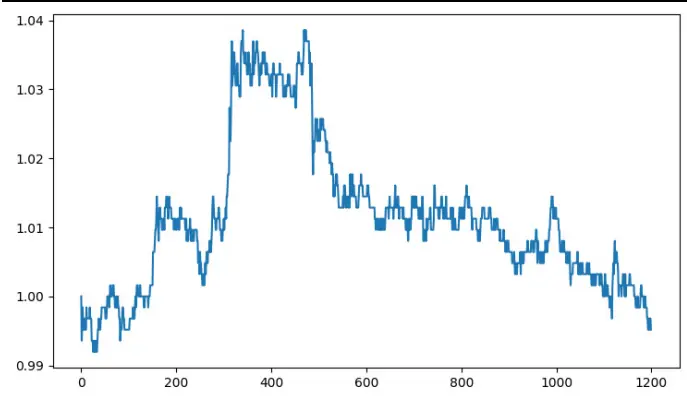
资料来源：天软科技，长江证券研究所

图 7：过去 5日 1分钟频率卖五量走势
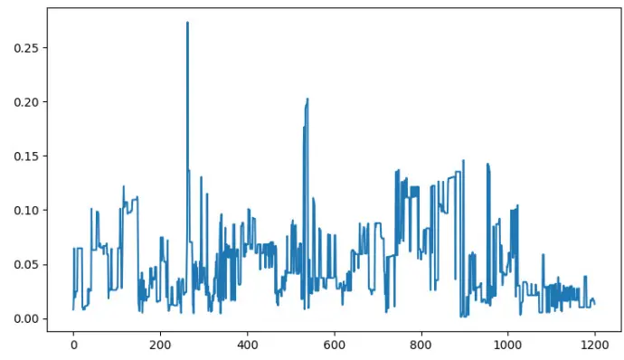
资料来源：天软科技，长江证券研究所

## 数据存储和模型训练

相同压缩格式下，同时段日频量价数据的数据量仅为 2.5GB，但是 1 分钟频率量价数据的数据量高达 150GB。因此在训练神经网络的过程中，我们使用 Dataloader 生成批量化输入数据这一步将耗费大量时间，如果不进行特殊处理，只读取一轮一年的数据样本可能就要花费几个小时的时间。虽然 Dataloader 支持多线程生成数据，但是提升几倍速度也远远慢于日频量价数据的训练速度。

除了速度方面的问题，单日 1分钟频率的数据要想进行批量化训练，还存在的问题是对运行内存的要求极高。即使忽略速度的影响，要想同时将所有数据读进 Python，Python将占用 100GB 以上的运行内存。

因此我们选择依次处理每天的 1 分钟频率量价数据，使用 Dataloader 生成数据后，把每天生成好的 Batch 数据存成本地 pickle 文件，这样我们就可以在训练的过程中指定读取某一天的数据样本，完全解决对运行内存的要求。缺点在于，将 Batch 数据存成本地数据后，其数据量将是原始数据的 n 倍左右，n 取决于输入数据回看的天数。经过测试，我们生成回看过去 5 日的 1 分钟频率数据，存成本地后占用大概 1TB 的内存。同时，数据存储的磁盘读写速率可能会影响到我们训练模型的速度，因为这样做相当于我们在不断读取数据进行训练，而非生成数据进行训练。

## 预实验：当天日内量价预测未来 1日收益率

为了印证我们的想法成立，即日内量价数据能够直接对未来收益率进行预测。我们选择先进行一个相对简单的实验，以每支股票当天的 240 行 1 分钟频率数据预测未来 1 日收益率。通常来说，我们人为判断短时间内的股票走势一般需要观察当前价格并结合过去一段时间的走势，因此根据直觉来判断，仅仅使用当天的日内数据预测未来 1 日收益率应该是比较困难的一项任务。

沿用我们之前挖掘日频量价数据的框架，我们经过简单的调整 TCN 模型的超参数即可使得其最大回看时间步长大于 240：残差模块个数依旧为 5，膨胀基数为 3，一维卷积核大小为 3，因此根据以下公式，可以算出模型的最大回看时间步长为 485 大于所需要的 240。超出的部分基本不会影响模型最终的收敛情况，我们在上篇报告中有说明 TCN模型回看的时间步长只需要超过数据的时间步长即可。

$$
\mathrm{L}=1+\sum_{i=0}^{n-1}2(k-1)d^{i}=1+2(k-1){\frac{d^{n}-1}{d-1}}
$$

关于最终模型的输出维度，即所挖因子的个数，我们经过简单的几轮尝试后发现。1 分钟频率的数据和日频数据结果有所不同，直接输出单个因子，并以皮尔逊相关系数的负数为目标函数效果，优于批量输出低相关因子再做合成。

图 8：预实验——日内因子挖掘框架
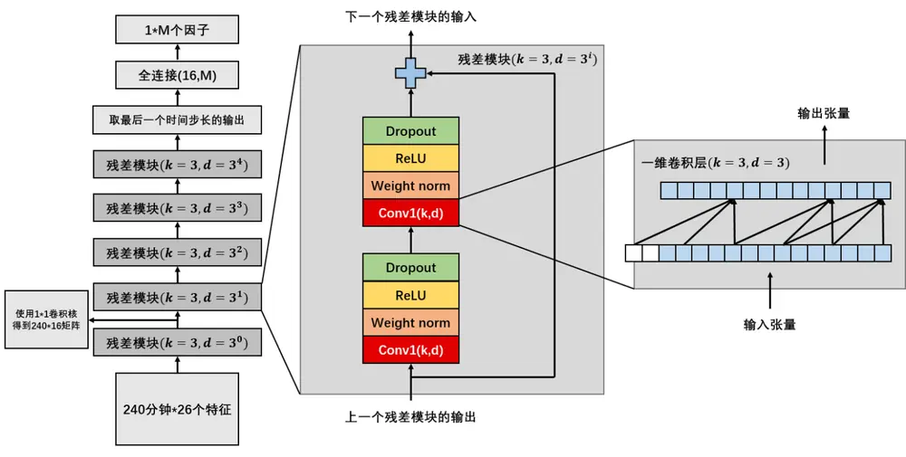
资料来源：长江证券研究所

训练集和验证集的选择仍以滚动训练进行调整：对 T年进行预测时数据集划分如下：

- 训练集：2014 年——T-2 年

- 验证集：T-1 年

- 测试集：T 年

考虑到回测希望能够覆盖较长时间，包含各种市场状态，我们设置测试集首年为 2018年，即进行 7 次滚动训练。其中 2024 年的测试集截至 2024年 3 月1 日。

表 1：滚动训练预实验——预测值预测未来一日收益率

| 测试集 RankIC | 验证集 RankIC |
| --- | --- |
| 2024 2.78% 2023 | 6.98% |
| 2023 6.49% | 2022 6.76% |
| 2022 6.40% | 2021 6.51% |
| 2021 5.37% | 2020 6.71% |
| 2020 6.73% | 2019 8.50% |
| 2019 8.44% | 2018 9.04% |
| 2018 8.67% | 2017 8.95% |
| 平均 6.41% | 平均 7.64% |

资料来源：天软科技，长江证券研究所

根据表 1 来看，2018 年以来当天日内量价信息预测未来一日收益率均有不俗的预测能力，平均 RankIC 高达 6.41%。验证集和测试集上的效果差异较小，说明模型过拟合现象不显著，样本外泛化能力较为稳定。

但是今年以来 RankIC 仅为 2.78%，这说明今年的回撤可能是对基于量价数据的深度学习模型集体的打击，改变原始数据的频率并不能有效规避此次回撤。因此虽然在历史上有较为优秀的回测结果，我们也仍需要对量价逻辑出发的深度学习模型的风险保持警惕。

## 主实验：过去5日日内量价预测未来5日收益率

经过前期预实验的测试，我们可以得出结论：TCN 网络可以根据 1 分钟频率的原始量价数据对未来股票的涨跌幅进行一定的预测。那么如何进一步优化该方法呢？很自然的想法是加入更多天数的 1 分钟频率量价数据，并且将预测目标设置为噪声相对较低的未来更长时间的收益率。至于具体而言如何选择输入长度和预测目标，可以根据个人需求来进行调整。

最终我们确定的方案为：过去 5 日 1 分钟频率量价数据预测未来 5 日收益率。模型最终的预测值相当于是参考了过去 5 日的日内量价变化信息，理论上来说应该比预实验中的得到的预测值效果更好。这也与高频因子使用过去一段时间的因子值均值或是加权均值等计算方法后比单天的因子值表现更好有类似的逻辑。

## 网络结构设计

过去 5 日 1 分钟频率的输入数据代表神经网络需要回看的时间步长将达到 1200，因此这里可以对网络的结构进行不同的尝试。我们以 2014 年至 2017 年为训练集进行模型的训练，2018 年为验证集进行效果的测试和对比，来构造一种相对合理的网络结构。

## 单模型

首先最简单的方法，我们可以通过增加单个 TCN 的残差模块个数，将其所能回看的最大时间步长提升到 1200 以上，理论上来说，网络就可以处理过去 5 日的1 分钟频率量价数据。因此我们将预实验中的 TCN 模型多加一个残差模块，将残差模块个数提升至6，这样 TCN所能回看的最长时间步长就能增加至 1457 满足需求。

## 分日多模型

单模型的设计可能存在一个经济意义上的问题，即不同日期的 1 分钟频率量价数据可能会有间断性。首先，由于集合竞价阶段数据和连续竞价阶段数据在生成逻辑上就有较大差异，因此我们未将其纳入本次的 1 分钟频率量价数据。其次，根据数据矩阵的生成方式来看，每日收盘的数据和第二日开盘的数据相邻，因此这里诞生的问题就是隔日间断的序列变化信息是否值得学习，其中的变化信息甚至可能为模型带来噪声。我们不论是以卷积核的形式还是循环单元结构的形式训练时，本质上都是在学习序列变化信息。

这就产生了另一种网络结构设计思路，如图 9 所示将每日的数据拆分后单独构建一个TCN 进行学习，再将不同天数得到的信息进行集成。由于预实验中我们发现对于单天的1 分钟频率数据而言，只输出单个预测值比输出多个低相关预测值更有效，因此本文后续都沿用此种做法，单个 TCN 模型只输出单个预测值，即图中 M取值均为 1。

图 9：分日多模型 TCN
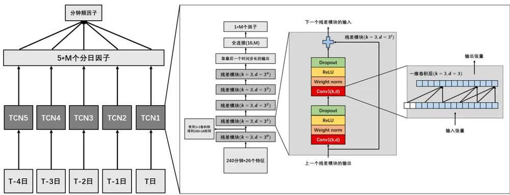
资料来源：长江证券研究所

对于分日多模型而言，目标函数也可以进行不同的尝试，我们首先称每日 TCN 的输出预测值为 $\widehat{Day_{\imath}},i=1,2,3,4,5$ ，其中 $\widehat{\mathsf{I}Day_{5}}$ 代表 T 日的 TCN 输出的预测值；5 个分日预测值再连一层全连接层输出的单个预测值为 $\widehat{y_{funal}}$ ；5 个分日预测值等权合成的单个预测值为 $\widehat{y_{mean}}$ 。下面我们尝试了四种逻辑上较为合理的损失函数：

1. 只计算 $\widehat{y_{funal}}$ 与真实值的相关系数：

$$
\begin{array}{r}{Loss_{1}=-{\mathrm{Corr}}(\widehat{y_{funal}},\mathbf{y})}\end{array}
$$

2. 只计算 $\widehat{y_{mean}}$ 与真实值的相关系数：

$$
\begin{array}{r}{Loss_{2}=-\mathtt{Corr}(\widehat{y_{mean}},\mathbf{y})}\end{array}
$$

3. 5 个分日预测值 $\widehat{\mathbf{D}ay_{l}}$ , i = 1,2,3,4,5与真实值的相关系数：

$$
Loss_{3}=-\frac{\sum_{i=1}^{5}\mathrm{Corr}\left(\widehat{Day_{\imath}},\mathbf{y}\right)}{5}
$$

4. 5 个分日预测值 $\widehat{\lfloor Day_{\iota}}$ , i = 1,2,3,4,5和等权合成预测值 $\widehat{y_{mean}}$ 与真实值的相关系数

$$
Loss_{4}=-\frac{\sum_{i=1}^{5}\mathrm{Corr}\left(\widehat{Day_{\imath}},\mathbf{y}\right)}{5}-\mathrm{Corr}(\widehat{y_{mean}},\mathbf{y})
$$

从表 2 中不难发现，分日多模型加上 $\cdot Loss_{4}$ 的方法所获得的最终预测值在验证集上表现最好，RankIC 为 12.89%。从构造逻辑上来分析， $Loss_{4}$ 相对平等的优化每日的预测值同时考虑他们的等权加权后最终预测值的预测效果。

通过对比单模型和分日多模型的最终预测值，我们不难发现分日多模型集成的思路有不小的提升，这可能与隔日量价数据信息间断有较大可能性；通过对比 $Loss_{1}$ 和 $|Loss_{2}$ ，我们可以得出结论，让模型自主的学习权重加权合成相比于将每日预测值等权合成效果更好；再结合 $\cdot Loss_{4}$ 表现，我们可以发现将每日的预测值同时纳入到损失函数中一起进行优化，会比只优化任何一种最终合成值有更好的表现。

表 2：不同模型和损失函数在验证集上 RankIC比较

| 模型和损失函数 | Day1 | Day2 | Day3 | Day4 | Day5 | 最终预测值 |
| --- | --- | --- | --- | --- | --- | --- |
| 单模型 |  |  |  |  |  | 10.84% |
| 多模型 Loss1 | -7.37% | 7.26% | 8.80% | -9.87% | -6.65% | 12.58% |
| 多模型 Loss2 | 7.57% | 7.47% | 8.08% | 8.33% | 9.41% | 11.84% |
| 多模型 Loss3 | 9.79% | 10.08% | 10.39% | 10.70% | 11.83% | 11.71% |
| 多模型 Loss4 | 9.71% | 9.67% | 10.32% | 10.39% | 11.65% | 12.89% |

资料来源：天软科技，长江证券研究所

## 滚动训练

网络结构上我们采用分日多模型，损失函数上我们使用Loss 来进行最终的分年滚动训练。我们设定训练集开始年份为 2014 年，测试集开始年份为 2018 年，并根据以下规则严格进行分年滚动训练：

- 训练集：2014 年——T-2 年

- 验证集：T-1 年

- 测试集：T 年

## 因子 RankIC

表 3 中我分别计算每年得到的分日预测值和等权合成预测值与未来 5 日收益率在测试集和验证集上的表现情况。不难看出样本外预测能力相比于验证集必然是有所下降的，但是下降幅度并不大，属于合理范畴。2018 年以来，截止 2024 年 3 月 1 如，等权合成因子的 RankIC 均值在 9.90%。分年来看，2021年和 2024年效果较差，等权合成因子RankIC 在 7.50%左右，这也说明近期回撤与 2021 年模型回撤情况较为类似。另一方面，我们分日来看，在预测未来 5 日收益率的目标任务下，最新一天的因子 RankIC 相比于前几天的因子 RankIC 并没有表现出明显的优势，并且在模型显著失效时期，T 日的因子 RankIC 明显低于 T-1 日因子 RankIC，侧面说明只利用最新一天的日内量价变化信息稳定性和有效性上均有提升空间。

表 3：与未来 5日收益率计算因子有效性

| 测试集因子 RankIC |  |  |  |  |  |  | 验证集因子 RankIC |  |  |  |  |  |  |
| --- | --- | --- | --- | --- | --- | --- | --- | --- | --- | --- | --- | --- | --- |
| 测试集 | T-4 | T-3 | T-2 | T-1 | T | 等权合成 | 验证集 | T-4 | T-3 | T-2 | T-1 | T | 等权合成 |
| 2024 | 6.52% | 5.89% | 5.40% | 7.11% | 6.86% | 7.47% | 2023 | 10.13% | 10.27% | 10.63% | 10.35% | 9.32% | 11.22% |
| 2023 | 9.63% | 9.38% | 9.76% | 9.64% | 8.80% | 10.66% | 2022 | 9.50% | 9.13% | 9.43% | 9.17% | 9.27% | 10.64% |
| 2022 | 9.42% | 9.30% | 9.26% | 9.56% | 8.46% | 10.67% | 2021 | 8.96% | 8.85% | 8.83% | 9.17% | 7.89% | 10.15% |
| 2021 | 6.75% | 6.53% | 6.47% | 6.35% | 4.82% | 7.50% | 2020 | 8.20% | 8.35% | 8.54% | 8.62% | 8.16% | 10.48% |
| 2020 | 7.35% | 7.21% | 7.02% | 7.51% | 8.11% | 9.34% | 2019 | 9.28% | 9.18% | 8.80% | 9.51% | 10.43% | 11.74% |
| 2019 | 8.53% | 8.78% | 9.66% | 9.01% | 10.16% | 11.36% | 2018 | 9.71% | 9.67% | 10.32% | 10.39% | 11.65% | 12.89% |
| 2018 | 9.73% | 9.40% | 9.71% | 9.96% | 10.97% | 12.30% | 2017 | 8.83% | 8.46% | 8.71% | 9.53% | 9.97% | 11.40% |
| 平均 | 8.28% | 8.07% | 8.18% | 8.45% | 8.31% | 9.90% | 平均 | 9.23% | 9.13% | 9.32% | 9.53% | 9.53% | 11.22% |

资料来源：天软科技，长江证券研究所

表 4 中我分别计算每年得到的分日预测值和等权合成预测值与未来 1 日收益率在测试集和验证集上的表现情况。结合预实验中仅用一天的日内量价数据预测未来 1 日收益率，我们可以发现在这种分日多模型集成的做法下，T日的量价信息并没有被完全利用，但是最终等权合成后样本外仍然比仅用一天的日内量价数据构建的因子效果要更好，虽然这也跟训练的预测目标不同有关。其次，结合表 3 的结论，T日的预测值虽然在预测未来 5 日收益率中没有比前几日更加有效，但是在预测未来 1 日收益率中，其单日平均RankIC 为 5.55%，显著高于 T-4 日到 T-1 日的单日平均 RankIC。

表 4：与未来 1日收益率计算因子有效性

| 测试集因子 RankIC |  |  |  |  |  |  | 验证集因子 RankIC |  |  |  |  |  |  |
| --- | --- | --- | --- | --- | --- | --- | --- | --- | --- | --- | --- | --- | --- |
| 测试集 | T-4 | T-3 | T-2 | T-1 | T | 等权合成 | 验证集 | T-4 | T-3 | T-2 | T-1 | T | 等权合成 |
| 2024 | 3.33% | 2.71% | 3.30% | 2.83% | 2.15% | 3.25% | 2023 | 7.26% | 7.47% | 7.48% | 7.40% | 6.55% | 8.03% |
| 2023 | 6.82% | 6.80% | 6.87% | 6.89% | 6.39% | 7.69% | 2022 | 6.38% | 5.89% | 6.14% | 6.08% | 6.61% | 7.27% |
| 2022 | 6.41% | 6.04% | 6.09% | 6.41% | 5.98% | 7.28% | 2021 | 5.78% | 5.64% | 5.80% | 6.08% | 6.09% | 7.06% |
| 2021 | 4.27% | 4.03% | 4.28% | 4.11% | 4.13% | 5.30% | 2020 | 5.05% | 5.28% | 5.47% | 5.66% | 6.10% | 7.28% |
| 2020 | 4.70% | 4.67% | 4.76% | 4.84% | 5.97% | 6.57% | 2019 | 6.26% | 6.12% | 5.87% | 6.60% | 8.24% | 8.66% |
| 2019 | 5.42% | 5.45% | 5.55% | 5.46% | 5.92% | 6.89% | 2018 | 5.88% | 5.89% | 6.55% | 6.61% | 8.64% | 8.72% |
| 2018 | 5.79% | 5.58% | 5.87% | 5.95% | 8.30% | 8.28% | 2017 | 5.32% | 5.45% | 5.75% | 6.03% | 7.90% | 8.06% |
| 平均 | 5.25% | 5.04% | 5.25% | 5.21% | 5.55% | 6.47% | 平均 | 5.99% | 5.96% | 6.15% | 6.35% | 7.16% | 7.87% |

资料来源：天软科技，长江证券研究所

## 1 分钟频率量价因子+日频量价因子

在经过多种尝试后，我们使用 TCN 网络学习过去 5 日日内量价数据得到了 1 分钟频率量价因子。为了测试 1 分钟频率量价因子与使用 TCN 网络学习日频量价数据得到的日频量价因子所蕴含的信息量是否相同，我们还将进一步对二者进行相关性分析和合成。理论上来说，1 分钟频率量价因子所挖掘的是日内信息，日频量价因子所挖掘的是日间信息。

在做合成时，为了消除两种因子在同一截面上量纲的不同，我们选择对二者分别进行均值方差标准化后再进行等权合成得到最终的“等权合成因子”。方便其间，下面我们统一以未来 5 日收益率为超额收益和因子 IC 的计算依据。

## 不同频率因子间相关性和有效性变化

为了研究三者间的相关性和有效性变化，我们首先测算了三种因子的截面 RankIC 月频均值序列，以及日频量价因子和 1 分钟频率量价因子的截面斯皮尔曼相关系数。

由图 10 我们可以总结出三点：

1. “等权合成因子”的 RankIC 通常而言与“日频量价因子”和“分钟频量价因子”的 RankIC 高者相近，也就是说在合成后因子的稳定性和有效性均有不小的提升。

2.“日频量价因子”和“分钟频量价因子”的相关性自 2018 年以来存在上升趋势。

3. 在类似 2024 年 1 月至 2 月这种极端市场环境下，“日频量价因子”和“分钟频量价因子”表现出较大的分化。2024 年1 月“日频量价因子”首先遭遇较大回撤但是在 2 月份迎来大幅逆转，而“分钟频量价因子”在 2 月份急转直下，并没有享受到反弹市场下的超额收益，二者的截面相关系数也下降至 29.07%，情况类似于2021 年初的低点。

图 10：三类因子 RankIC走势和相关性变化
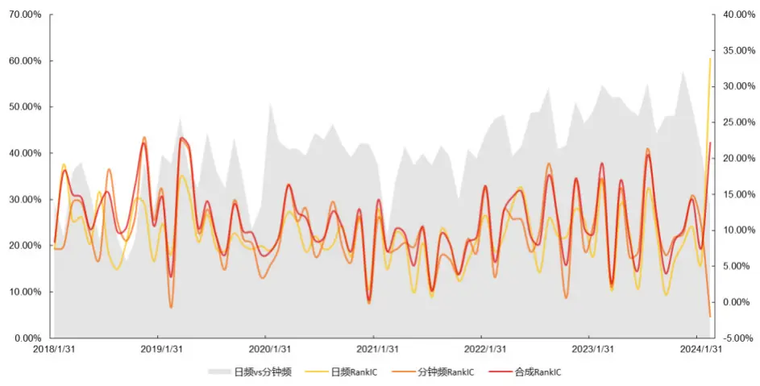
资料来源：天软科技，长江证券研究所

## 分组超额收益

我们在沪深两市全 A 上测算三类因子的分组超额收益，结果如图所示。合成因子前 5%多头组超额由“日频量价因子”的21.31%和“分钟频量价因子”的19.78%提升至28.41%，而因子值后 5%的空头组负超额也进一步提升至-58.05%。但是整体而言，量价数据加上深度学习模型产生的预测值仍然有多空收益明显失衡的现象。

图 11：分组超额收益
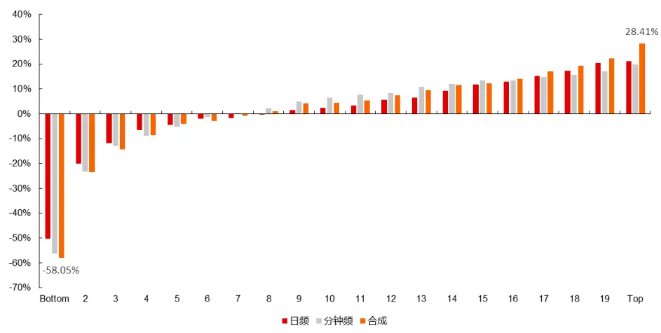
资料来源：天软科技，长江证券研究所

## 分年有效性

从因子 IC 的角度来看，2018年到 2023 年每年的规律均为：“日频量价因子”<“分钟频量价因子”<“合成因子”。但是 2024 年截止到 3 月 1 日来看，今年“分钟频量价因子”相对走弱，主要原因还是在于年后的反弹幅度较弱，远不及“日频量价因子”。整体而言，“合成因子”表现优异且相对稳定，RankIC 均值提升至 11.19%。

图 12：三类因子分年 RankIC
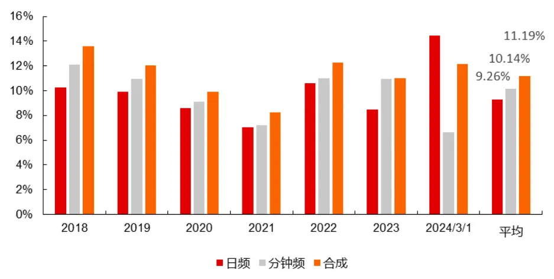
资料来源：天软科技，长江证券研究所

## 成分股内多空收益

为了测算“合成因子”在各个成分股内的选股能力，我们下面分别计算了因子在各个成分股内多头前 10%的股票组合以及多空前后 10%的股票组合的策略净值和收益。需要特殊说明的是，由于中证 2000 指数的发布日期为 2023 年 8 月 11 日，因此本文测算的中证 2000 指数成分股内历史表现为 2023 年 8月 11 日发布以来的回测结果。

从图 14 和表 5 中，我们能发现最终的合成因子仍旧是在小市值成分股内有更好的预测能力。在中证 1000、国证 2000和中证全指上平均多头超额收益分别为 21.12%、23.14%以及 24.84%。

但是当我们测算 2024 年以来截止 3 月 1 日的成分股内多头净值比不难发现，在中证1000、国证2000以及中证全指上呈现出以春节为间隔点先大跌后大幅反弹的变化情况。特别是在中证全指上，今年以来多头累计超额收益在 2 月 7 日当天一度下降至-20%左右。最终今年多头超额收益在各个指数上的表现与历史长期表现有所不同，在上证 50和沪深 300 这类大市值指数成分股内反而有更优异的表现。

图 13：成分股 2024年以来多头净值比（截止 20240301）
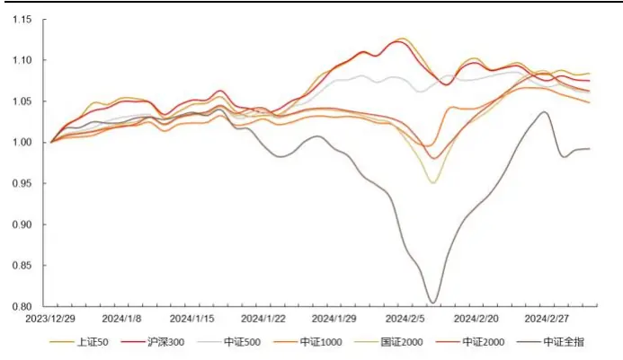
资料来源：天软科技，长江证券研究所

图 14：成分股分年多头超额收益
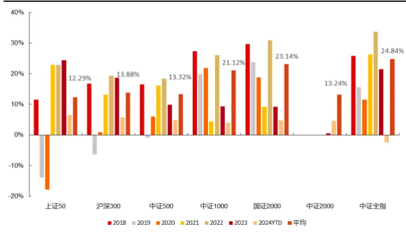
资料来源：天软科技，长江证券研究所

表 5：成分股分年多头超额收益
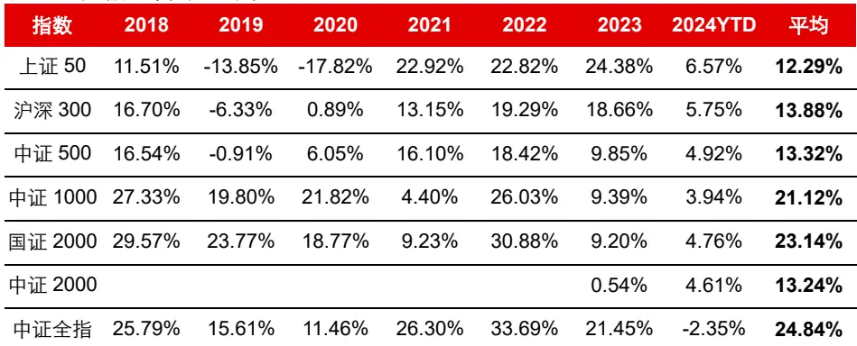
资料来源：天软科技，长江证券研究所

除了多头端，我们还结合因子空头端计算了各个成分股内的多空收益，由于深度学习模型本身对于空头端股票的预测能力较强，因此多空收益相对多头超额有更加稳定的表现。

整体而言，小市值指数成分股内的多空收益显著高于大市值指数成分股，并且该现象今年以来仍然存在。但是结合图 15 今年以来的多空净值走势，我们也能看出节前虽然多空收益并没有大幅的负向收益，但是沪深 300 和上证 50 内的累计多空收益明显高于国证 2000 等小市值指数。

图 15：成分股 2024 年以来多空净值（截止 20240301）
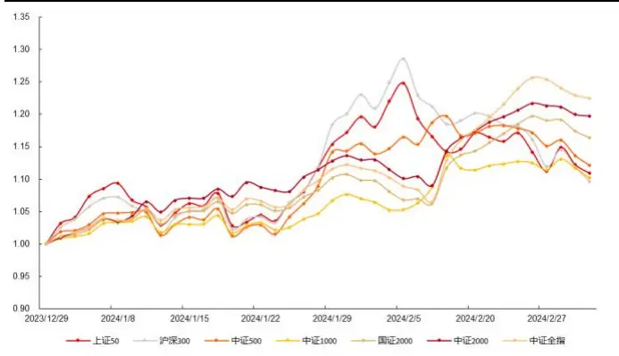
资料来源：天软科技，长江证券研究所

图 16：成分股分年多空收益
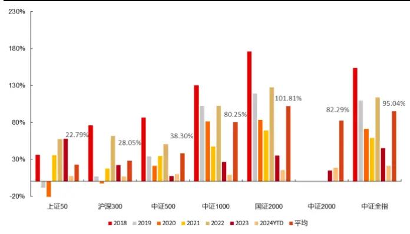
资料来源：天软科技，长江证券研究所

表 6：成分股分年多空收益

| 指数 2018 2019 2020 2021 2022 2023 2024YTD 平均 |
| --- |
| 上证50 36.25% -8.57% -28.50% 35.63% 57.14% 58.12% 7.51% 22.79% |
| 沪深 30075.79% 6.90% -2.50% 17.50% 61.54% 22.21% 6.93% 28.05% |
| 中证 50086.56% 33.89% 21.21% 34.33% 50.61% 7.30% 10.09% 38.30% |
| 中证 1000130.47%102.63%81.09% 47.16% 102.46%26.66% 9.26% 80.25% |
| 国证 2000175.79%119.04%83.36% 69.18% 127.60%35.15% 15.17% 101.81% |
| 中证 2000 14.61% 18.61% 82.29% |
| 中证全指153.62%109.47% 71.31% 59.08% 113.98% 45.14% 21.06% 95.04% |

资料来源：天软科技，长江证券研究所

## 总结

我们通过样本外跟踪前期报告《神经网络因子挖掘——TCN 日频量价因子》得到的日频量价因子发现，2023 年四季度虽然持续有效，但是因子在 2024 年以来截止 2 月 8 日以来发生明显失效。经过多项测算，我们认为日频量价因子近期回撤分组来看，回撤主要集中在多头端；分域来看，回撤主要集中在小市值股票。而从深度学习模型训练方法出发，我们认为目前主流的深度学习模型都存在关注胜率，相对忽视盈亏比的问题。这可能是导致深度学习方法在构建策略时虽然长时间看胜率较高，但是也可能在短时间内遭受较大幅度的回撤的根本原因。

为了进一步挖掘更多信息的量价因子，我们选择使用 TCN 模型对每日 1 分钟频率的量价数据进行因子挖掘，来尝试挖掘更多对选股有帮助的日内量价变化信息。在数据处理和模型训练框架的设计过程中，我们发现相比于日频量价数据，1 分钟频率量价数据的数据量和处理难度都较大，因此我们选择了一种牺牲内存大幅提升网络训练速度的方法。虽然日内量价数据需要花费较大时间成本去处理和调整，但是这从另一个角度看这也可能是一种技术壁垒。

我们最终的实验方案为使用过去 5 日1 分钟频率量价数据来预测未来 5 日收益率。在网络结构设计上，过去 5 日数据直接放入单模型 TCN 可能存在一个经济意义上的问题，即不同日期的 1 分钟频率量价数据可能会有间断性。因此我们选择将每日的数据拆分后单独构建一个 TCN进行学习，再将不同天数得到的信息进行集成。经过验证集的计算，分日多模型 TCN 明显优于单模型 TCN。

我们将 1 分钟频率量价因子和日频量价因子分别计算截面均值方差标准化后再进行等权合成得到最终的“合成因子”。从因子 RankIC 变化和分组收益率来看，合成后因子的稳定性和有效性均有不小的提升。但是仍然存在“多空收益失衡”以及“短期回撤严重”等前文所总结的深度学习模型的弊端。2024 年以来，“合成因子”呈现出以春节为间隔点先大跌后大幅反弹的现象。截止 3 月1 日，因子在除中证全指以外的主流宽基指数成分股内已取得不俗的多头超额收益，而中证全指上的多头超额收益已从低点的-20%左右回升至-2.35%。

## 风险提示

1、深度学习模型训练过程中有随机性，可能导致预测结果有误差。TCN神经网络为深度学习模型，在训练的过程中有一定的随机性，随机性包括训练数据集的划分和网络结构中的随机丢弃等，以上情况均可能导致预测结果会有波动和误差风险。

2、模型总结的市场规律是基于历史数据的，存在失效风险。市场量价规律可能随时间变化而变化，模型总结的规律是基于历史数据且是固定的，存在失效风险。

3、日频交易策略回测结果仅供参考，需要考虑实际交易存在的滑点等风险。日频交易的投资策略回测较为理想化，回测结果仅供参考，需要注意实际交易时可能存在的滑点等投资风险。

## 投资评级说明

| 行业评级 | 报告发布日后的12个月内行业股票指数的涨跌幅相对同期相关证券市场代表性指数的涨跌幅为基准，投资建议的评 |
| --- | --- |
| 级标准为： 看 | 好： 相对表现优于同期相关证券市场代表性指数 |
| 中 性： | 相对表现与同期相关证券市场代表性指数持平 |
|  | 淡： 相对表现弱于同期相关证券市场代表性指数 |
| 公司评级 | 报告发布日后的12个月内公司的涨跌幅相对同期相关证券市场代表性指数的涨跌幅为基准，投资建议的评级标准为： |
| 买 入： | 相对同期相关证券市场代表性指数涨幅大于10% |
| 增 | 相对同期相关证券市场代表性指数涨幅在5%～10%之间 |
| 持： 中 性： | 相对同期相关证券市场代表性指数涨幅在-5%～5%之间 |
| 减持： | 相对同期相关证券市场代表性指数涨幅小于-5% |
|  | 无投资评级：由于我们无法获取必要的资料，或者公司面临无法预见结果的重大不确定性事件，或者其他原因，致使 |
| 我们无法给出明确的投资评级。 相关证券市场代表性指数说明：A股市场以沪深300指数为基准；新三板市场以三板成指（针对协议转让标的）或三板做市指数 |  |

## 办公地址

[Tabl上海
Add /浦东新区世纪大道 1198号世纪汇广场一座 29 层
P.C /（200122）
北京
Add /西城区金融街 33 号通泰大厦 15 层
P.C /（100032）
武汉
Add /武汉市江汉区淮海路 88号长江证券大厦 37 楼
P.C /（430015）
深圳
Add /深圳市福田区中心四路1号嘉里建设广场 3 期 36 楼
P.C /（518048）

## 分析师声明

本报告署名分析师以勤勉的职业态度，独立、客观地出具本报告。分析逻辑基于作者的职业理解，本报告清晰准确地反映了作者的研究观点。作者所得报酬的任何部分不曾与，不与，也不将与本报告中的具体推荐意见或观点而有直接或间接联系，特此声明。

## 法律主体声明

本报告由长江证券股份有限公司及/或其附属机构（以下简称「长江证券」或「本公司」）制作，由长江证券股份有限公司在中华人民共和国大陆地区发行。长江证券股份有限公司具有中国证监会许可的投资咨询业务资格，经营证券业务许可证编号为：10060000。本报告署名分析师所持中国证券业协会授予的证券投资咨询执业资格书编号已披露在报告首页的作者姓名旁。

在遵守适用的法律法规情况下，本报告亦可能由长江证券经纪（香港）有限公司在香港地区发行。长江证券经纪（香港）有限公司具有香港证券及期货事务监察委员会核准的“就证券提供意见”业务资格（第四类牌照的受监管活动），中央编号为：AXY608。本报告作者所持香港证监会牌照的中央编号已披露在报告首页的作者姓名旁。

## 其他声明

本报告并非针对或意图发送、发布给在当地法律或监管规则下不允许该报告发送、发布的人员。本公司不会因接收人收到本报告而视其为客户。本报告的信息均来源于公开资料，本公司对这些信息的准确性和完整性不作任何保证，也不保证所包含信息和建议不发生任何变更。本报告内容的全部或部分均不构成投资建议。本报告所包含的观点、建议并未考虑报告接收人在财务状况、投资目的、风险偏好等方面的具体情况，报告接收者应当独立评估本报告所含信息，基于自身投资目标、需求、市场机会、风险及其他因素自主做出决策并自行承担投资风险。本公司已力求报告内容的客观、公正，但文中的观点、结论和建议仅供参考，不包含作者对证券价格涨跌或市场走势的确定性判断。报告中的信息或意见并不构成所述证券的买卖出价或征价，投资者据此做出的任何投资决策与本公司和作者无关。本研究报告并不构成本公司对购入、购买或认购证券的邀请或要约。本公司有可能会与本报告涉及的公司进行投资银行业务或投资服务等其他业务(例如:配售代理、牵头经办人、保荐人、承销商或自营投资)。

本报告所包含的观点及建议不适用于所有投资者，且并未考虑个别客户的特殊情况、目标或需要，不应被视为对特定客户关于特定证券或金融工具的建议或策略。投资者不应以本报告取代其独立判断或仅依据本报告做出决策，并在需要时咨询专业意见。

本报告所载的资料、意见及推测仅反映本公司于发布本报告当日的判断，本报告所指的证券或投资标的的价格、价值及投资收入可升可跌，过往表现不应作为日后的表现依据；在不同时期，本公司可以发出其他与本报告所载信息不一致及有不同结论的报告；本报告所反映研究人员的不同观点、见解及分析方法，并不代表本公司或其他附属机构的立场；本公司不保证本报告所含信息保持在最新状态。同时，本公司对本报告所含信息可在不发出通知的情形下做出修改，投资者应当自行关注相应的更新或修改。本公司及作者在自身所知情范围内，与本报告中所评价或推荐的证券不存在法律法规要求披露或采取限制、静默措施的利益冲突。

## 本报告版权仅为本公司所有， 。未经书面许可，任何机构和个人不得以任何形式翻版、复制和发布

给其他机构及/或人士（无论整份和部分）。如引用须注明出处为本公司研究所，且不得对本报告进行有悖原意的引用、删节和修改。刊载或者转发本证券研究报告或者摘要的，应当注明本报告的发布人和发布日期，提示使用证券研究报告的风险。本公司不为转发人及/或其客户因使用本报告或报告载明的内容产生的直接或间接损失承担任何责任。未经授权刊载或者转发本报告的，本公司将保留向其追究法律责任的权利。

本公司保留一切权利。