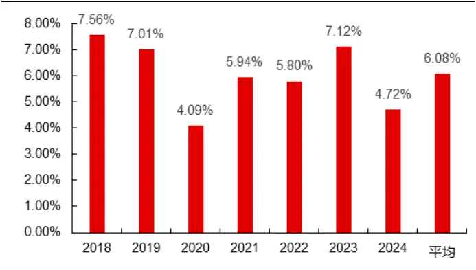
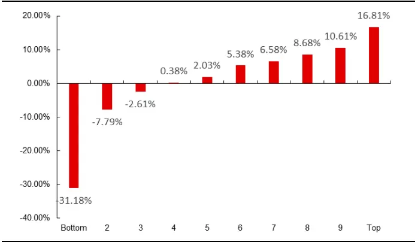
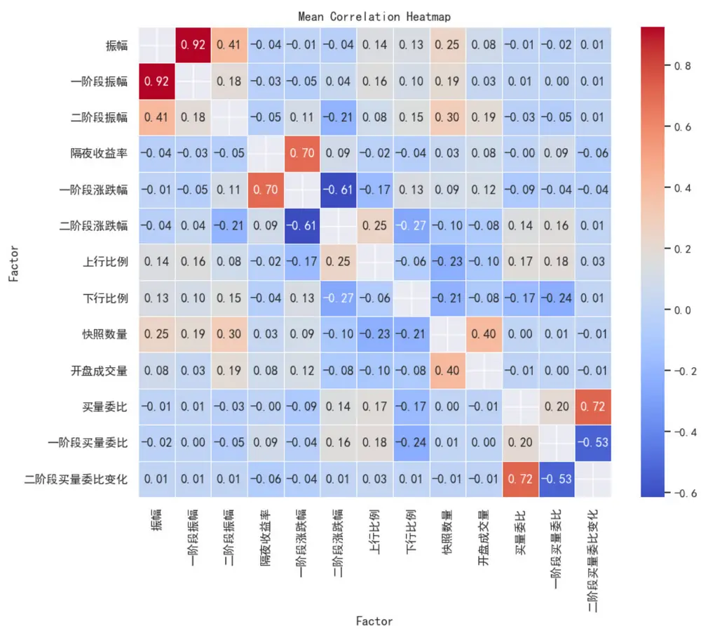
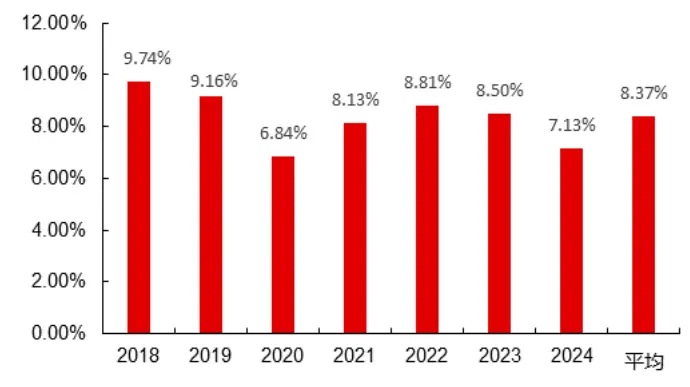
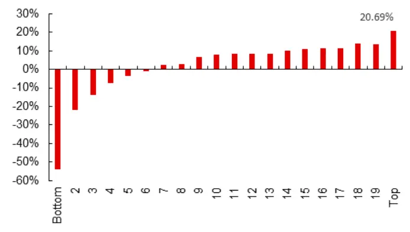
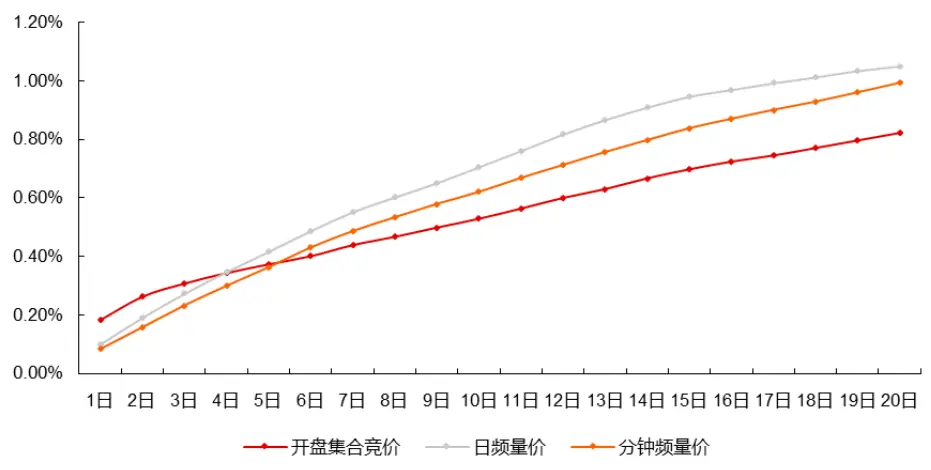
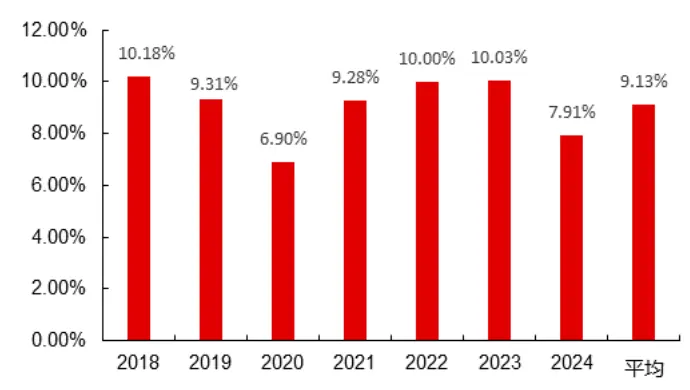
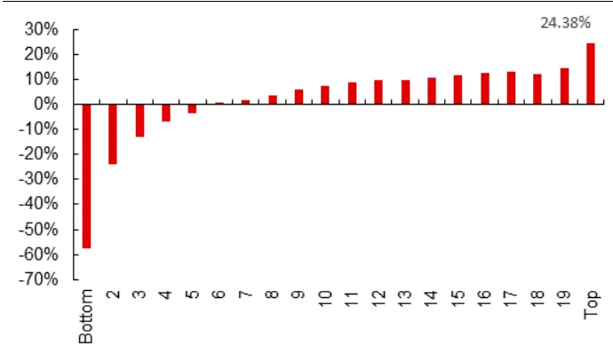
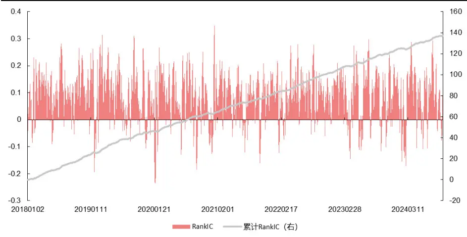
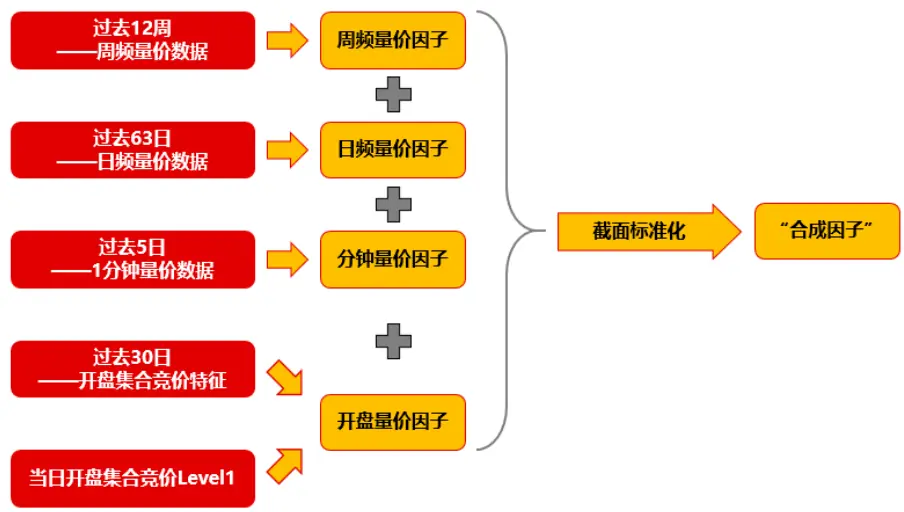

# 金融工程丨深度报告[Table_Title] 神经网络因子挖掘（三）——开盘集合竞价因子

## 报告要点

[Table_Summary] 我们使用神经网络对开盘集合竞价 Level1 数据进行学习，并且尝试构建了多种网络的输入矩阵，最终以特征工程和 Level1 数据重采样矩阵作为网络的输入能够得到有一定预测能力的因子。其中在特征工程阶段，我们发现使用 Level1 数据人为构造的因子同样也有不俗的选股能力。最终，我们将开盘量价因子与混频神经网络量价因子进行合成，样本外 RankIC、多头超额、宽基选股能力都得到了不小的提升，充分说明开盘集合竞价信息值得挖掘。

分析师及联系人

覃川桃

杨凯杰

SAC：S0490513030001

SFC：BUT353

# 神经网络因子挖掘（三）——开盘集合竞价因子

金融工程丨深度报告

## [Table_Summary2] 开盘成交数据因子效果欠佳

以开盘集合竞价最终成交数据作为输入的神经网络，输出的预测值在样本外有一定的选股效果，2018 年以来因子与未来 5 日收益率的 RankIC 为 6.08%。但是这与本系列前期报告中日频量价数据和分钟频量价数据得到的因子有较大差距，说明开盘成交价和开盘成交量所蕴含的信息虽然有效但是不够丰富，因此需要开发更高频的开盘集合竞价 Level1 数据。

## 特征工程+神经网络

我们从开盘集合竞价 Level1 量价数据出发构造出 13 个有一定逻辑的特征，将特征的滚动 20日平均值作为因子进行回测后发现，大部分因子都有一定的选股能力，其中表现较好的有快照数量、二阶段振幅和二阶段涨跌幅，RankIC 分别为-6.59%、-6.19%和 5.20%。再将过去30 日的特征矩阵作为神经网络的输入后，模型预测值在样本外 RankIC 提升至8.37%。

## 当日开盘集合竞价重采样因子

在对当日开盘集合竞价数据进行重采样后，我们将 Level1 数据转化为 10 秒频率的数据矩阵。使用相同的网络对未来 1 日收益率进行学习后，模型在样本外同样取得了不俗的选股效果。但是该预测值也表现出 2 个问题：（1）超额收益随持有时间的增加而明显衰减。（2）因子 IC 值显著高于 RankIC，这可能说明因子值分布更接近真实收益率分布。

## 神经网络合成因子得到进一步提升

我们探讨了将开盘数据因子与本系列前期报告中已有的混频量价因子相结合的效果。通过将不同频率的数据进行融合，模型的整体预测效果得到了显著的提升。这种结合提供了多维度的信息，使得模型能够更全面地理解市场动态，综合考虑短期和长期趋势之间的相互作用。2018 年样本外以来，合成因子的 5 日收益率 RankIC 值达到了 12.00%，沪深两市 A 股分 20 组 Top多头年化超额高达 38.20%。在各大宽基指数成分股内多头超额同样有一定提升，说明使用神经网络提取开盘集合竞价中的信息能够带来不小的增量提升。

## 相关研究

- 《机构持仓（十七）：A 股机构投资者概览》2024-10-22

- 《市场板块效应减弱，选股因子超额收益局部调 整》2024-10-14

- 《市场板块效应减弱，选股因子超额收益回归正 常》2024-09-12

## 风险提示

1、深度学习模型训练过程中有随机性，可能导致预测结果有误差；

2、模型总结的市场规律是基于历史数据的，存在失效风险；

3、日频交易策略回测结果仅供参考，需要考虑实际交易存在的滑点等风险。

更多研报请访问长江研究小程序

## 开盘集合竞价简述

为了得到有效的开盘信息，我们先需要对交易所开盘集合竞价阶段规则稍加分析。交易所将开盘集合竞价阶段分为两个时间段，首先是 9:15-9:20 为第一阶段，在这个时间段，交易所接受所有的委托订单，并且所有订单都是可以申请后撤回的。而 9:20-9:25 为第二阶段，交易所接受所有的委托订单但是并不接受订单撤回。最后 9:25-9:30 交易所不接受任何订单申请，但是根据特殊情况第二阶段的时间可能会延长到 9:25 分之后，这种情况极为少见。

## 1. 开盘集合竞价一阶段：9:15-9:20

投资者可以申报，也可以撤销申报。

## 2. 开盘集合竞价二阶段：9:20-9:25

投资可以申报，不可以撤销申报。

集合竞价与常规交易时段的连续竞价方式有显著区别。通俗得来讲，在集合竞价期间，交易所接收所有的买卖订单，然后在该阶段结束时一起处理这些订单。在这个阶段，没有任何交易是实际完成的，因为所有的订单都要等到集合竞价结束时才会被统一撮合。因此，直到集合竞价阶段结束，开盘价才会确定。虽然在撮合前没有确定的成交价，但研究者已经开发了一些方法来估算实时的成交价格。例如，我们接下来将使用买一价和卖一价的平均值来估算集合竞价阶段的实时价格。

## 开盘成交数据因子

每只股票开盘集合竞价的最后一条数据，就是交易所对集合竞价期间所用委托订单集中撮合成交的结果。如图 1 所示，本文所用数据包含成交价、成交量、买一价到买三价及对应的委买量、卖一价到卖三价及对应的委卖量。参考前期报告中，我们发现使用神经网络对原始行情数据进行简单的剔量纲等处理，就可以获得效果不俗的因子，因此我们以每日开盘集合竞价成交数据作为日频特征，沿用前期报告中的神经网络 TCN，每日输入过去 30 日特征值返回预测值，用以预测未来 5 日收益率。

图 1：开盘集合竞价最后一条数据

| 日期 | StockID | StockNane | price | vol | buy1 | sale1 | buy2 | sale2 | buy3 | sale3 | bc1 | bc2 | bc3 | sc1 | sc2 | sc3 |
| --- | --- | --- | --- | --- | --- | --- | --- | --- | --- | --- | --- | --- | --- | --- | --- | --- |
| 20101008 | 000001.SZ | 平安银行 | 16.7 | 942198 | 16.7 | 16.71 | 16.69 | 16.72 | 16.68 | 16.73 | 18702 | 10200 | 10000 | 1400 | 29737 | 5500 |
|  | 000002.SZ | 万科A | 8.3 | 1319700 | 8.29 | 8.3 | 8.28 | 8.31 | 8.27 | 8.32 | 1400 | 19300 | 57600 | 947839 | 14900 | 26300 |
|  | 000004.SZ | 国华网安 | 0 | 0 | 11.45 | 11.55 | 11.31 | 11.57 | 11.21 | 11.58 | 3200 | 500 | 5000 | 200 | 16000 | 200 |
|  | 000005.SZ | ST星源 | 4.36 | 39900 | 4.35 | 4.36 | 4.33 | 4.37 | 4.32 | 4.38 | 2300 | 20900 | 8400 | 11100 | 49500 | 63600 |
|  | 000006.SZ | 深振业A | 7.34 | 197100 | 7.34 | 7.35 | 7.33 | 7.36 | 7.32 | 7.37 | 271200 | 44300 | 29400 | 29400 | 2000 | 4400 |
|  | 000007.SZ | 全新好 | 8.29 | 33000 | 8.29 | 8.3 | 8.28 | 8.31 | 8.25 | 8.33 | 5000 | 4700 | 4000 | 1000 | 1200 | 100 |
|  | 000008.SZ | 神州高铁 | 13.19 | 1100 | 13.18 | 13.19 | 13.11 | 13.2 | 13.02 | 13.25 | 5000 | 5400 | 4500 | 14900 | 500 | 1000 |
|  | 000009.SZ | 中国宝安 | 11.99 | 89215 | 11.99 |  | 11.98 | 12.03 | 11.97 | 12.05 | 12685 | 13800 | 3700 | 5000 | 5000 | 1000 |
|  | 000011.SZ | 深物业A | 8.2 | 34600 | 8.19 | 8.2 | 8.16 | 8.23 | 8.15 | 8.24 | 300 | 600 | 2100 | 300 | 900 | 500 |
|  | 000012.SZ | 南玻A | 15.95 | 50292 | 15.95 | 15.96 | 15.94 | 15.98 | 15.93 | 15.99 | 94608 | 2800 | 60100 | 9300 | 2000 | 9400 |
|  | 000014.SZ | 沙河股份 | 10.75 | 20900 | 10.74 | 10.75 | 10.72 | 10.76 | 10.71 | 10.78 | 3000 | 1200 | 1000 | 145 | 13000 | 1400 |

资料来源：天软科技，长江证券研究所

- 训练方式：分年滚动训练

2018 年以来样本外回测结果如图所示，预测值对股票未来 5 日收益率有一定的预测效果，但是 6.08%的 RankIC 和 16.81%的多头超额相较于前期报告中日频网络因子和分钟频网络因子有较大差距，因此下文考虑如何进行优化。

图 2：开盘成交数据因子分年 RankIC（5日收益率）

资料来源：Wind，天软科技，长江证券研究所

图 3：开盘成交数据因子分组超额收益（5日收益率年化）

资料来源：Wind，天软科技，长江证券研究所

## 开盘集合竞价特征工程

学习原始开盘集合竞价成交数据所得到的因子效果较为一般，因此在优化方向上我们考虑人为构造部分因子再使用网络进行学习，可以将人工构造因子视为深度学习的特征工程步骤。我们从 Level1 量价数据出发构造出一共 13 个有一定逻辑的特征，由于集合竞价阶段并无真正的成交价，因此我们以买一价和卖一价的均价为当前快照的拟成交价，并依次计算各类价格相关特征。

表 1：开盘集合竞价特征工程

| 特征 | 构造方式 |
| --- | --- |
| 振幅 | (最高价-最低价)/最低价 |
| 一阶段振幅 | 一阶段：（最高价-最低价）/最低价 |
| 二阶段振幅 | 二阶段：（最高价-最低价）/最低价 |
| 隔夜收益率 | 开盘成交价/昨收盘价-1 |
| 一阶段涨跌幅 | 一阶段价格/昨收盘价-1 |
| 二阶段涨跌幅 | 二阶段价格/一阶段价格-1 |
| 上行比例 | 价格上行快照数量/快照数量 |
| 下行比例 | 价格下行快照数量/快照数量 |
| 快照数量 | 开盘集合竞价期间快照总数 |
| 开盘成交量 | 开盘集合竞价最终成交量 |
| 买量委比 | (买一量+买二两+买三量)/ (买一量+买二量+买三量+卖一量+卖二量+卖三量) |
| 一阶段买量委比 | 9:20 买量委比 |
| 二阶段买量委比变化 | 9:25买量委比-9:20买量委比 |

资料来源：长江证券研究所

在训练网络前，我们对各特征依次进行单因子回测，可以观察各特征的线性有效性。这里我们以量价因子相对普遍的方法，取过去 20 日特征均值作为个股因子值进行回测。从逻辑上推测，开盘集合竞价因子的收益衰减应该较为严重，因此我们预测时长为相对较短的未来 5 日收益率。历史回测区间为 2010 年 11 月4 日至 2024 年 9月 30 日。

表 2：单因子历史回测结果

| 因子 | RankIC ICIR（未年化） |
| --- | --- |
| 振幅 | -4.46% -26.04% |
| 一阶段振幅 | -3.54% -23.12% |
| 二阶段振幅 | -6.19% -33.92% |
| 隔夜收益率 | 2.28% 21.94% |
| 一阶段涨跌幅 | -1.76% -24.81% |
| 二阶段涨跌幅 | 5.20% 45.20% |
| 上行比例 | 1.70% 12.57% |
| 下行比例 | -0.75% -4.87% |
| 快照数量 | -6.59% -57.92% |
| 开盘成交量 | -5.13% -43.01% |
| 买量委比 | 0.18% 3.17% |
| 一阶段买量委比 | -0.24% -4.78% |
| 二阶段买量委比变化 | 0.41% 6.69% |

资料来源：Wind，天软科技，长江证券研究所

表 3：单因子分年 RankIC均值

| 因子 | 2010 | 2011 | 2012 | 2013 | 2014 | 2015 | 2016 | 2017 | 2018 | 2019 | 2020 | 2021 |  | 2022 | 2023 2024 |
| --- | --- | --- | --- | --- | --- | --- | --- | --- | --- | --- | --- | --- | --- | --- | --- |
| 振幅 | -1.74% | -5.00% | -5.49% | -0.46% | -4.15% | -0.89% | -3.09% | -8.53% | -5.54% | -5.32% | -5.73% | -3.92% | -5.36% | -4.07% | -5.64% |
| 一阶段振幅 | -1.60% | -3.98% | -5.07% | -0.31% | -2.97% | -0.16% | -2.10% | -7.23% | -4.53% | -4.04% | -4.90% | -2.81% | -4.29% | -3.18% | -4.52% |
| 二阶段振幅 | -2.16% | -7.26% | -6.46% | -2.04% | -5.89% | -2.58% | -5.72% | -10.07% | -6.82% | -7.07% | -5.82% | -6.34% | -7.44% | -6.58% | -7.59% |
| 隔夜收益率 | 2.78% | 4.63% | 1.24% | -0.77% | 0.82% | 0.30% | 0.98% | 4.94% | 4.56% | 1.87% | 2.56% | 2.74% | 2.78% | 2.61% | 2.63% |
| 一阶段涨跌幅 | -0.90% | 1.53% | -2.81% | -2.59% | -2.38% | -2.00% | -2.60% | -1.89% | -1.93% | -3.28% | -2.02% | 0.03% | -2.16% | -1.58% | -1.01% |
| 二阶段涨跌幅 | 5.08% | 4.91% | 5.92% | 2.38% | 5.15% | 4.08% | 5.58% | 8.64% | 7.72% | 6.84% | 5.07% | 2.86% | 4.96% | 4.24% | 4.09% |
| 上行比例 | 4.99% | -0.33% | 1.30% | 4.54% | -1.41% | 6.24% | 3.30% | -0.49% | 1.88% | 3.54% | 1.89% | 0.49% | 1.03% | 1.52% | -0.83% |
| 下行比例 | 3.31% | -1.86% | -2.41% | 3.65% | -3.73% | 4.45% | 1.21% | -4.29% | -1.94% | -0.06% | -0.22% | -1.09% | -1.60% | -0.85% | -3.01% |
| 快照数量 | -4.94% | -5.28% | -5.43% | -6.45% | -4.27% | -10.22% | -9.72% | -6.12% | -6.84% | -6.07% | -3.68% | -6.80% | -7.33% | -8.65% | -5.34% |
| 开盘成交量 | -5.98% | -2.77% | -4.69% | -5.56% | -1.46% | -9.23% | -6.17% | -4.60% | -5.68% | -6.87% | -5.71% | -3.42% | -5.26% | -5.94% | -4.06% |
| 买量委比 | 1.26% | 0.88% | 0.35% | 0.73% | 1.56% | 2.33% | 0.79% | 0.87% | 0.42% | 0.51% | -0.43% | -1.10% | -2.16% | -2.91% | 0.54% |
| 一阶段买量委比 | 2.22% | -1.17% | -0.18% | 1.84% | -1.89% | 2.02% | -0.23% | -1.32% | 0.00% | 0.49% | -0.68% | -0.91% | -0.94% | -0.95% | 0.25% |
| 阶段买量委比变化 | 0.06% | 1.72% | 0.94% | -0.45% | 2.84% | 1.33% | 1.06% | 1.75% | 0.36% | -0.06% | -0.21% | -0.40% | -1.32% | -2.03% | 0.06% |

资料来源：Wind，天软科技，长江证券研究所

表 4：单因子分 10组年化超额收益

| 因子 | Bottom | 2 | 3 | 4 | 5 | 6 | 7 | 8 | 9 | Top |
| --- | --- | --- | --- | --- | --- | --- | --- | --- | --- | --- |
| 振幅 | 4.36% | 4.45% | 3.32% | 3.10% | 0.49% | -0.56% | -2.42% | -3.85% | -5.22% | -3.41% |
| 一阶段振幅 | 4.71% | 4.38% | 2.20% | 1.12% | -0.10% | -2.83% | -2.60% | -3.31% | -4.61% | 1.12% |
| 二阶段振幅 | 2.40% | 3.87% | 5.41% | 4.56% | 4.51% | 3.17% | 1.06% | -0.04% | -5.92% | -16.93% |
| 隔夜收益率 | -19.77% | -3.13% | 0.09% | 4.23% | 2.97% | 5.10% | 5.48% | 5.22% | 3.71% | -1.28% |
| 一阶段涨跌幅 | -7.97% | 3.51% | 3.71% | 4.02% | 4.02% | 3.45% | 2.15% | 0.95% | -1.77% | -10.63% |
| 二阶段涨跌幅 | -21.34% | -7.76% | -3.00% | 0.65% | 3.20% | 5.10% | 5.18% | 6.58% | 7.19% | 8.41% |
| 上行比例 | -6.52% | -5.56% | -4.34% | -3.98% | -1.82% | 0.86% | 3.05% | 2.95% | 5.20% | 11.78% |
| 下行比例 | -0.22% | 0.26% | -1.47% | -0.69% | -0.12% | -1.50% | -0.49% | 1.78% | 0.19% | 2.30% |
| 快照数量 | 17.92% | 13.91% | 10.01% | 6.13% | 1.72% | -1.41% | -3.90% | -8.99% | -11.95% | -17.99% |
| 开盘成交量 | 10.68% | 9.66% | 7.88% | 4.93% | 2.61% | 0.67% | -1.52% | -4.82% | -9.44% | -17.35% |
| 买量委比 | -8.86% | -2.55% | -0.59% | 0.74% | 0.99% | 1.26% | 1.40% | 1.55% | 2.60% | 3.71% |
| 一阶段买量委比 | 0.75% | 0.96% | -1.85% | -1.49% | -2.13% | -2.29% | -1.99% | -2.07% | 2.67% | 7.87% |
| 二阶段买量委比变化 | -4.11% | -0.90% | -0.72% | -0.06% | -1.74% | -0.58% | 1.10% | 0.69% | 1.65% | 4.76% |

资料来源：Wind，天软科技，长江证券研究所

从单因子 RankIC 回测结果来看，效果比较好的因子是快照数量、二阶段振幅和二阶段涨跌幅，RankIC 分别为-6.59%、-6.19%和5.20%。其中快照数量因子的分组收益也呈现明显的单调递减趋势，多空两端超额收益较高且并未出现明显失衡。

图 4：因子间截面秩相关系数均值

资料来源：Wind，天软科技，长江证券研究所

从因子间秩相关系数矩阵来看，除个别构造方式相同的因子有较高相关性之外，大部分因子间相关性较低。选股效果较好的快照数量和开盘成交量相关性较高，说明快照数量反映的仍旧类似于流动性方面的信息。

## 神经网络训练结果

13 个开盘集合竞价特征的数据分布有较大差异，因此标准化是必要的步骤，考虑到虽然这些特征有一定的截面选股能力，但是我们使用时序网络更关注的应该是特征时序变化信息。为此我们选择将个股特征进行时序标准化和去极值，时间步长方面选择过去 30日。最终输入网络的数据矩阵为（30,13），预测目标为个股当日收盘起未来 5 日收益率的分位数。

- 训练方式：滚动训练

从 RankIC 的角度和分组超额收益来看，预测值的样本外泛化能力有显著提升。但是从分 20 组的组间差异可以看出，预测值在多空两端预测能力较强，但是中间分组差异较小甚至出现第 18 组收益高于第 19 组这种局部非单调的问题。

图 5：人工特征开盘因子分年 RankIC（5 日收益率）

资料来源：Wind，天软科技，长江证券研究所

图 6：人工特征开盘因子分组超额收益（5日收益率年化）

资料来源：Wind，天软科技，长江证券研究所

## 当日开盘集合竞价重采样因子

考虑到开盘集合竞价原始数据本身蕴含的信息对于未来的预测是相对短期的，在前文报告中我们也同样发现了 A 股长期存在的隔夜收益率和日内收益率强反转的现象，因此我们将预测目标缩短至未来 1 日，只用当天开盘集合竞价 Level1 的数据预测当天收盘至第二天收盘股票的涨跌幅。

输入端我们考虑将当天开盘集合竞价 10 分钟的 Level1 快照数据重采样为 10 秒一行的快照数据，目的是将输入矩阵的时间步长固定为 60 步，方便输入任意时序神经网络以进行学习。数据清洗阶段，我们认为当天开盘集合竞价快照数据个数小于 5 个的股票样本或是无开盘成交价的股票样本质量较低，因此将上述两种情况的样本剔除。特征工程阶段，对于 6 个价格特征同时除以开盘成交价，对于 6 个委托量特征同时除以当天开盘集合竞价期间 6 个委托量中出现过的最大委托量。最终我们网络的输入矩阵维度是（60,12），预测目标为未来1日股票涨跌幅的全 A 分位数。

网络方面，我们对 TCN 进行简单的修改，考虑到价格数据和委托量数据的分布和区间皆有一定差异，我们构建两个 TCN 子模型分别学习价格变化信息和委托量变化信息，再将二者的最终隐藏层在特征维度进行拼接，最终用一层全连接网络对隐藏层特征进行加权输出预测值。

训练方式：滚动训练

表 5：当日开盘集合竞价重采样因子分年 RankIC与 IC（5日收益率）

| 年份 | 1日收益率 RankIC | 5日收益率 RankIC | 10 日收益率 RankIC | 20 日收益率 RankIC | 1日收益率 IC | 5 日收益率 IC | 10 日收益率 IC | 20 日收益率 IC |
| --- | --- | --- | --- | --- | --- | --- | --- | --- |
| 2018 | 7.14% | 8.96% | 9.98% | 11.29% | 16.07% | 19.91% | 18.98% | 16.77% |
| 2019 | 7.05% | 7.99% | 8.26% | 7.47% | 13.39% | 17.34% | 16.82% | 12.76% |
| 2020 | 5.93% | 6.19% | 6.54% | 6.83% | 11.17% | 14.29% | 13.57% | 11.05% |
| 2021 | 6.29% | 9.06% | 10.63% | 13.42% | 8.33% | 10.64% | 10.29% | 10.18% |
| 2022 | 6.78% | 9.27% | 10.38% | 12.51% | 8.60% | 10.69% | 10.80% | 11.23% |
| 2023 | 6.89% | 9.48% | 11.29% | 13.24% | 6.98% | 9.46% | 10.12% | 10.29% |
| 2024 | 6.64% | 7.40% | 7.86% | 8.71% | 9.26% | 10.63% | 10.80% | 10.81% |
| 平均 | 6.68% | 8.37% | 9.33% | 10.58% | 10.60% | 13.39% | 13.16% | 11.92% |
| ICIR（未年化） | 67.41% | 83.50% | 89.13% | 97.52% | 121.48% | 146.66% | 142.52% | 133.79% |

资料来源：Wind，天软科技，长江证券研究所

从 RankIC 的结果看，虽然预测目标为 1 日收益率，但是预测值与更长时间的收益率秩相关系数更高，这种现象相对普遍，本质原因可能在于股票收益率本身，更长时间的收益率排序相比于短期收益率排序的信噪比更高。

从 IC 的结果看，能发现该因子特点主要有两点。其一是收益率衰减显著，预测值与 5日收益率的相关系数最高，超过 5 日后相关系数随着时间的增加而下降，说明即使在不考虑超额收益实现周期的问题，该因子也更适用于构建相对高频调仓的策略。此种现象在日频神经网络因子和分钟频神经网络因子的回测结果中均未出现过。

其二是因子分布与真实收益率分布更相近，因子 IC 值显著高于 RankIC 值，对于大部分因子来说 RankIC 应该是略高于 IC 的。IC 本质上是皮尔逊相关系数，度量的是因子值和收益率的线性相关性，除了需要满足因子值更高收益率更高这一排序相关性以外，还会受变量分布影响。

为了更加直观的刻画收益率衰减程度，我们计算了因子 Top5%选股样本的未来 n 日超额曲线，来反映因子多头超额收益的实现过程，同时以日频量价因子和分钟频量价因子作为对比，股票池为沪深两市A 股且三个因子当天均有因子值的样本。不难发现，开盘集合竞价因子的多头超额在首日远高于日频量价因子和分钟频量价因子，前者的超额收益为 0.18%，而日频量价因子和分钟频量价因子分别为 0.10%和 0.08%。但是从第 3 日开始开盘集合竞价因子的多头超额实现速率有明显的下降，并且于第 6 日完全落后于日频量价因子和分钟频量价因子，最终保持略低于前二者的斜率直至 20 日。总结来看，开盘集合竞价因子的优势需要更高频的调仓和更高的换手率来实现，但是这部分超额收益所带来的增量也可能被交易成本抹平。

图 7：因子多头超额时序衰减程度

资料来源：Wind，天软科技，长江证券研究所

## 开盘因子小结

以过去 30 日开盘集合竞价成交原始数据作为输入的因子选股效果较为一般。而人工构建有一定选股能力的因子作为特征后，网络输出的因子选股效果得到显著提升。最后，我们还尝试以当日开盘集合竞价的 Level1 数据以 10 秒为间隔重采样作为神经网络的输入矩阵，同样有不俗的选股效果，但是存在因子 IC 高于 RankIC 和收益衰减更加显著这两个特点。

最终从效果出发，我们考虑将后面两次尝试的因子值等权合成作为神经网络开盘量价因子，效果相较于二者单个因子都有明显的提升。

图 8：开盘因子分年 RankIC（5 日收益率）

资料来源：Wind，天软科技，长江证券研究所

图 9：开盘因子分组超额收益（5日收益率年化）

资料来源：Wind，天软科技，长江证券研究所

图 10：开盘因子累计 RankIC（5日收益率）

资料来源：Wind，天软科技，长江证券研究所

## 神经网络合成因子

在经过一系列的尝试，我们得到了最终的开盘集合竞价神经网络因子，并且在单因子回测中表现可观。但是量价因子本身存在高相关的现象，虽然数据区间和频率不同，新构造的因子与现有的因子信息大多高度重合。为了验证本文因子的具体增量，我们将本系列前期报告《神经网络因子挖掘——TCN日频量价因子》中的日频量价因子和《神经网络因子挖掘（二）——1 分钟频量价因子》的分钟频量价因子以及类似方法学习得到的周频量价因子等权合成值作为基准因子，检测开盘集合竞价因子在原有因子的基础上能够带来多少 RankIC 和多头超额方面的优化。

图 11：神经网络合成因子框架图

资料来源：长江证券研究所

开盘因子与分钟因子相关系数较高，与相对低频的日频因子和周频因子相关系数较低。

表 6：因子间秩相关系数矩阵

| I | 周因子 | 日因子 | 分钟因子 | 开盘因子 |
| --- | --- | --- | --- | --- |
| 周因子 | 100.00% | 57.11% | 35.83% | 32.66% |
| 日因子 | 57.11% | 100.00% | 40.77% | 38.61% |
| 分钟因子 | 35.83% | 40.77% | 100.00% | 60.72% |
| 开盘因子 | 32.66% | 38.61% | 60.72% | 100.00% |

资料来源：Wind，天软科技，长江证券研究所

## 因子 RankIC

加入开盘因子后，5 日 RankIC 从 11.74%提升至 12.00%，且每年 RankIC 均高于基准的“周+日+分钟”因子，因此可以认为开盘因子带来的优化是较为稳定的，并非某些年份上风格偏移所带来的提升。从单一因子的回测效果来看，开盘因子相对较弱，但是这可能与开盘集合竞价数据本身包含的信息时效性较高有关。

表 7：汇总因子分年 RankIC（5日收益率）

| 因子 | 2018 | 2019 | 2020 | 2021 | 2022 | 2023 | 2024 | 平均 |
| --- | --- | --- | --- | --- | --- | --- | --- | --- |
| 周 | 12.23% | 9.57% | 9.22% | 8.74% | 10.54% | 9.35% | 7.80% | 9.70% |
| 日 | 10.28% | 9.91% | 8.64% | 7.23% | 10.83% | 8.60% | 9.70% | 9.30% |
| 分钟 | 11.71% | 10.78% | 8.93% | 7.40% | 10.91% | 10.87% | 8.70% | 9.94% |
| 开盘 | 10.18% | 9.31% | 6.96% | 9.28% | 10.00% | 10.03% | 7.91% | 9.14% |
| 日+分钟 | 13.39% | 12.00% | 9.94% | 8.54% | 12.36% | 11.02% | 10.27% | 11.10% |
| 周+日+分钟 | 14.76% | 12.32% | 10.72% | 9.65% | 12.86% | 11.40% | 10.10% | 11.74% |
| 周+日+分钟+开盘 | 15.06% | 12.50% | 10.83% | 10.14% | 13.09% | 11.67% | 10.30% | 12.00% |

资料来源：Wind，天软科技，长江证券研究所

表 7：汇总因子分年 RankIC（20日收益率）

| 因子 | 2018 | 2019 | 2020 | 2021 | 2022 | 2023 | 2024 | 平均 |
| --- | --- | --- | --- | --- | --- | --- | --- | --- |
| 周 | 14.28% | 11.59% | 10.48% | 11.90% | 13.74% | 12.85% | 8.38% | 12.04% |
| 日 | 12.59% | 11.71% | 9.90% | 8.87% | 14.14% | 12.35% | 10.09% | 11.43% |
| 分钟 | 15.44% | 12.82% | 11.96% | 10.14% | 15.37% | 15.99% | 8.74% | 13.11% |
| 开盘 | 12.51% | 9.05% | 8.15% | 13.45% | 13.29% | 13.83% | 8.81% | 11.41% |
| 日+分钟 | 17.08% | 14.27% | 12.23% | 11.17% | 16.79% | 16.12% | 10.54% | 14.18% |
| 周+日+分钟 | 18.16% | 14.64% | 12.86% | 12.78% | 17.19% | 16.40% | 10.54% | 14.84% |
| 周+日+分钟+开盘 | 18.37% | 14.48% | 12.89% | 13.52% | 17.37% | 16.69% | 10.72% | 15.05% |

资料来源：Wind，天软科技，长江证券研究所

## 分 20 组超额

从单个因子的分组超额收益率结果来看，相对低频的周频因子和日频因子多头端组间超额收益差异明显更加平滑，相对高频的分钟频因子和开盘因子 Top 组相对第 19 组超额收益跨度较大。这可能存在稳定性的问题，例如多头 10%选股组合和多头 5%选股组合的表现存在较大差异。而在空头端，相对高频的分钟因子和开盘因子也更为出色。

最终对比合成因子的表现来看，“周+日+分钟+开盘”因子表现确为最优。每多加一个因子都有一定的提升，说明使用神经网络学习四种不同频率的量价数据都有一定的增量。

表 8：因子分组超额收益率（5日收益率）

| 因子分组 | 周 | 日 | 分钟 | 开盘 | 日+分钟 | 周+日+分钟 | 周+日+分钟+开盘 |
| --- | --- | --- | --- | --- | --- | --- | --- |
| Bottom | -50.00% | -53.24% | -56.09% | -57.45% | -58.85% | -58.76% | -61.71% |
| 2 | -25.55% | -20.98% | -24.27% | -23.74% | -26.19% | -27.72% | -29.02% |
| 3 | -16.13% | -12.76% | -14.03% | -12.79% | -15.65% | -17.80% | -17.06% |
| 4 | -11.25% | -6.74% | -8.55% | -6.57% | -9.04% | -11.60% | -11.44% |
| 5 | -8.62% | -4.35% | -5.20% | -3.64% | -4.31% | -7.47% | -7.05% |
| 6 | -5.19% | -1.37% | -1.29% | 0.56% | -1.98% | -5.40% | -4.49% |
| 7 | -2.65% | -0.78% | 0.26% | 1.34% | 0.12% | -1.57% | -1.55% |
| 8 | -0.38% | 0.32% | 3.02% | 3.58% | 0.01% | -0.56% | 0.51% |
| 9 | 2.12% | 2.11% | 4.95% | 5.85% | -0.14% | 1.59% | 2.33% |
| 10 | 2.93% | 3.33% | 6.12% | 7.37% | 5.16% | 4.76% | 4.17% |
| 11 | 5.99% | 4.20% | 7.96% | 8.39% | 6.30% | 5.98% | 7.07% |
| 12 | 8.07% | 6.12% | 9.15% | 9.84% | 8.50% | 7.75% | 8.66% |
| 13 | 10.48% | 7.98% | 10.86% | 9.46% | 10.47% | 10.96% | 10.71% |
| 14 | 12.00% | 10.25% | 11.66% | 10.59% | 12.12% | 12.54% | 12.49% |
| 15 | 14.60% | 11.84% | 13.12% | 11.58% | 12.85% | 15.62% | 15.65% |
| 16 | 16.21% | 14.00% | 12.84% | 12.36% | 14.85% | 17.67% | 17.73% |
| 17 | 18.43% | 15.96% | 14.11% | 12.80% | 17.52% | 20.92% | 20.51% |
| 18 | 20.72% | 17.53% | 15.27% | 12.28% | 20.01% | 24.28% | 25.08% |
| 19 | 23.13% | 20.46% | 15.92% | 14.13% | 22.65% | 27.86% | 28.57% |
| Top | 22.13% | 21.05% | 24.18% | 24.31% | 33.52% | 34.35% | 38.20% |

资料来源：Wind，天软科技，长江证券研究所

## 宽基成分股内选股效果

从各大宽基指数成分股内多头超额来看，相比于日频量价因子+分钟频量价因子，周频量价因子和开盘因子的加入使得各宽基指数成分股内超额收益都有明显提升。需要特殊说明的是，由于中证 2000 指数的发布日期为 2023 年 8月 11日，因此本文测算的中证2000 指数成分股内历史表现为 2023 年 8月 11 日发布以来的回测结果。

- 调仓频率：5 日

- 加权方式：等权

- 基准：宽基指数

- 交易成本：双边千二

表 9：宽基指数成分股内多头 10%超额

| 周+日+分钟+开盘 |  |  |  |  |  | 日+分钟 |  |  |  |  |
| --- | --- | --- | --- | --- | --- | --- | --- | --- | --- | --- |
| 年份 | 沪深300 |  |  |  | 中证 500 中证 1000 国证 2000 中证 2000 中证全指 | 沪深300 |  |  | 中证 500 中证 1000 国证 2000 中证 2000 中证全指 |  |
| 2018 | 20.61% | 19.10% | 33.64% | 36.70% | 32.34% | 16.66% | 16.11% | 26.53% | 28.90% | 25.15% |
| 2019 | -8.19% | 3.57% | 24.53% | 28.85% | 19.48% | -6.41% | -0.89% | 18.90% | 22.84% | 15.72% |
| 2020 | 2.90% | 3.30% | 22.81% | 21.88% | 15.10% | 0.79% | 5.83% | 22.31% | 18.83% | 11.93% |
| 2021 | 16.59% | 11.06% | 11.71% | 8.88% | 30.00% | 13.47% | 14.00% | 3.40% | 9.18% | 26.47% |
| 2022 | 20.38% | 18.15% | 25.01% | 33.54% | 35.72% | 18.73% | 17.92% | 25.21% | 30.74% | 34.02% |
| 2023 | 18.91% | 12.49% | 17.16% | 14.23% | 3.10% 27.23% | 18.84% | 9.81% | 9.22% | 9.04% 0.50% | 22.65% |
| 20241016 | 24.00% | 13.48% | 2.92% | 8.08% | 11.78% 3.70% | 18.93% | 12.08% | 4.61% | 9.07% 10.44% | 2.57% |
| 平均 | 16.16% | 13.76% | 22.24% | 24.63% | 13.45% 26.39% | 14.35% | 12.91% | 18.67% | 21.07% 9.76% | 22.74% |

资料来源：Wind，天软科技，长江证券研究所

## 总结

以开盘集合竞价最终成交数据作为输入的神经网络，输出的预测值在样本外有一定的选股效果，2018 年以来因子与未来 5 日收益率的 RankIC 为 6.08%。但是这与本系列前期报告中日频量价数据和分钟频量价数据得到的因子有较大差距，说明开盘成交价和开盘成交量所蕴含的信息虽然有效但是不够丰富，因此需要开发更高频的开盘集合竞价Level1 数据。

我们从开盘集合竞价 Level1 量价数据出发构造出 13 个有一定逻辑的特征，将特征的滚动 20 日平均值作为因子进行回测后发现，大部分因子都有一定的选股能力，其中表现较好的有快照数量、二阶段振幅和二阶段涨跌幅，RankIC 分别为-6.59%、-6.19%和5.20%。再将过去30日的特征矩阵作为神经网络的输入后，模型预测值在样本外RankIC提升至 8.37%。

在对当日开盘集合竞价数据进行重采样后，我们将 Level1 数据转化为 10 秒频率的数据矩阵。使用相同的网络对未来 1 日收益率进行学习后，模型在样本外同样取得了不俗的选股效果。但是该预测值也表现出 2 个问题：（1）超额收益随持有时间的增加而明显衰减。（2）因子 IC 值显著高于 RankIC，这可能说明因子值分布更接近真实收益率分布。

我们探讨了将开盘数据因子与本系列前期报告中已有的混频量价因子相结合的效果。通过将不同频率的数据进行融合，模型的整体预测效果得到了显著的提升。这种结合提供了多维度的信息，使得模型能够更全面地理解市场动态，综合考虑短期和长期趋势之间的相互作用。2018 年样本外以来，合成因子的 5 日收益率 RankIC 值达到了 12.00%，沪深两市 A 股分 20 组 Top 多头年化超额高达 38.20%。在各大宽基指数成分股内多头超额同样有一定提升，说明使用神经网络提取开盘集合竞价中的信息能够带来不小的增量提升。

## 风险提示

1、深度学习模型训练过程中有随机性，可能导致预测结果有误差。神经网络在训练的过程中有一定的随机性，随机性包括训练数据集的划分和网络结构中的随机丢弃等，以上情况均可能导致预测结果会有波动和误差风险。

2、模型总结的市场规律是基于历史数据的，存在失效风险。市场量价规律可能随时间变化而变化，模型总结的规律是基于历史数据且是固定的，存在失效风险。

3、日频交易策略回测结果仅供参考，需要考虑实际交易存在的滑点等风险。

## 投资评级说明

| 行业评级 报告发布日后的12个月内行业股票指数的涨跌幅相对同期相关证券市场代表性指数的涨跌幅为基准，投资建议的评级标准为： |
| --- |
| 看 好：相对表现优于同期相关证券市场代表性指数 |
| 中 性：相对表现与同期相关证券市场代表性指数持平 |
| 看 淡：相对表现弱于同期相关证券市场代表性指数 |
| 公司评级 报告发布日后的12个月内公司的涨跌幅相对同期相关证券市场代表性指数的涨跌幅为基准，投资建议的评级标准为： |
| 买 入：相对同期相关证券市场代表性指数涨幅大于10% |
| 增 持：相对同期相关证券市场代表性指数涨幅在 5%～10%之间 |
| 中 性：相对同期相关证券市场代表性指数涨幅在-5%～5%之间 |
| 减 持：相对同期相关证券市场代表性指数涨幅小于-5% |
| 无投资评由于我们无法获取必要的资料，或者公司面临无法预见结果的重大不确定性事件，或者其级： 他原因，致使我们无法给出明确的投资评级。 |
| 相关证券市场代表性指数说明：A股市场以沪深300指数为基准；新三板市场以三板成指（针对协议转让标的）或三板做市指数（针对做市转让标的）为基准；香港市场以恒生指数为基准。 |

## 办公地址

| 上海 Add/虹口区新建路200号国华金融中心 B栋 22、23层 | 武汉 Add/武汉市江汉区淮海路88号长江证券大厦37楼 |
| --- | --- |
| P.C /(200080) | P.C /(430015) |
| 北京 Add /西城区金融街 33 号通泰大厦 15 层 P.C /(100032) | 深圳 Add/深圳市福田区中心四路1 号嘉里建设广场 3 期 36 楼 |

## 分析师声明

本报告署名分析师以勤勉的职业态度，独立、客观地出具本报告。分析逻辑基于作者的职业理解，本报告清晰准确地反映了作者的研究观点。作者所得报酬的任何部分不曾与，不与，也不将与本报告中的具体推荐意见或观点而有直接或间接联系，特此声明。

## 法律主体声明

本报告由长江证券股份有限公司及/或其附属机构（以下简称「长江证券」或「本公司」）制作，由长江证券股份有限公司在中华人民共和国大陆地区发行。长江证券股份有限公司具有中国证监会许可的投资咨询业务资格，经营证券业务许可证编号为：10060000。本报告署名分析师所持中国证券业协会授予的证券投资咨询执业资格书编号已披露在报告首页的作者姓名旁。

在遵守适用的法律法规情况下，本报告亦可能由长江证券经纪（香港）有限公司在香港地区发行。长江证券经纪（香港）有限公司具有香港证券及期货事务监察委员会核准的“就证券提供意见”业务资格（第四类牌照的受监管活动），中央编号为：AXY608。本报告作者所持香港证监会牌照的中央编号已披露在报告首页的作者姓名旁。

## 其他声明

本报告并非针对或意图发送、发布给在当地法律或监管规则下不允许该报告发送、发布的人员。本公司不会因接收人收到本报告而视其为客户。本报告的信息均来源于公开资料，本公司对这些信息的准确性和完整性不作任何保证，也不保证所包含信息和建议不发生任何变更。本报告内容的全部或部分均不构成投资建议。本报告所包含的观点、建议并未考虑报告接收人在财务状况、投资目的、风险偏好等方面的具体情况，报告接收者应当独立评估本报告所含信息，基于自身投资目标、需求、市场机会、风险及其他因素自主做出决策并自行承担投资风险。本公司已力求报告内容的客观、公正，但文中的观点、结论和建议仅供参考，不包含作者对证券价格涨跌或市场走势的确定性判断。报告中的信息或意见并不构成所述证券的买卖出价或征价，投资者据此做出的任何投资决策与本公司和作者无关。本研究报告并不构成本公司对购入、购买或认购证券的邀请或要约。本公司有可能会与本报告涉及的公司进行投资银行业务或投资服务等其他业务(例如:配售代理、牵头经办人、保荐人、承销商或自营投资)。

本报告所包含的观点及建议不适用于所有投资者，且并未考虑个别客户的特殊情况、目标或需要，不应被视为对特定客户关于特定证券或金融工具的建议或策略。投资者不应以本报告取代其独立判断或仅依据本报告做出决策，并在需要时咨询专业意见。

本报告所载的资料、意见及推测仅反映本公司于发布本报告当日的判断，本报告所指的证券或投资标的的价格、价值及投资收入可升可跌，过往表现不应作为日后的表现依据；在不同时期，本公司可以发出其他与本报告所载信息不一致及有不同结论的报告；本报告所反映研究人员的不同观点、见解及分析方法，并不代表本公司或其他附属机构的立场；本公司不保证本报告所含信息保持在最新状态。同时，本公司对本报告所含信息可在不发出通知的情形下做出修改，投资者应当自行关注相应的更新或修改。本公司及作者在自身所知情范围内，与本报告中所评价或推荐的证券不存在法律法规要求披露或采取限制、静默措施的利益冲突。

本报告版权仅为本公司所有，本报告仅供意向收件人使用。未经书面许可，任何机构和个人不得以任何形式翻版、复制和发布给其他机构及/或人士（无论整份和部分）。如引用须注明出处为本公司研究所，且不得对本报告进行有悖原意的引用、删节和修改。刊载或者转发本证券研究报告或者摘要的，应当注明本报告的发布人和发布日期，提示使用证券研究报告的风险。本公司不为转发人及/或其客户因使用本报告或报告载明的内容产生的直接或间接损失承担任何责任。未经授权刊载或者转发本报告的，本公司将保留向其追究法律责任的权利。

本公司保留一切权利。