金融工程丨深度报告[Table_Title]神经网络因子挖掘（四）因子风格暴露与标签中性化

## 报告要点

[Table_Summary] 回顾 2024 年神经网络量价因子的表现，神经网络合成因子在沪深 300 指数中的预测能力显著超越历史平均水平，但是因子在较小市值股票下表现更为突出的现象并没有变化。我们进一步探讨了 Alpha 收益与 Beta 收益的拆分，强调准确预测 Alpha 收益是量化投资的核心目标。最终我们认为以 Alpha收益为预测目标能够有效降低风格暴露的同时提升一部分超额收益。更加稳健的做法是以多策略的形式同时使用原始收益率和 Alpha收益率生成的因子。超额收益虽可能不会有明显的提高，但是稳定性方面大概率会有一定的优化，特别是在部分极端行情下。

分析师及联系人

覃川桃

SAC：S0490513030001

杨凯杰

SFC：BUT353

# [Table_Title 神经网络因子挖掘（四）——2]因子风格暴露与标签中性化

## [Table_Summary2] 2024 年神经网络类量价因子依旧可观

我们回顾了 2024 年神经网络量价因子的表现，发现其在沪深 300 指数中的预测能力显著超过历史平均水平，而在中证全指成分股内，合成因子的 5 日收益率 RankIC 为 11.28%与历史平均水平较为接近，但 20 日收益率 RankIC 为 10.69%，相对于历史平均水平 14.90%有较大下滑，这可能与 2024 年行业轮动和风格轮动的速度加快有关。

## Alpha预测是提升收益稳定性的关键

通过将预测目标调整为市值行业 Barra 中性化收益率（Alpha1），模型风格暴露显著降低。以残差波动因子为例，Alpha1 与 Barra 风格因子相关系数均值从 Baseline 的-29.45%降至-15.04%。因子严格中性化后 Alpha1 的 Top 组超额收益达 20.19%，较 Baseline 提升 3.15%，且在 2024 年 2 月及 9 月的极端行情中回撤更小。

## 相关研究

[Table_Report] •《板块效应震荡，各板块基本多因子增强重回收益区间》2025-02-15

- 《电子行业公募重仓比 18.53%创历史新高》2025-02-10

- 《投研工具箱（一）：指数分红预测与基差监控》2025-02-10

## 因子存在一定的风格择时能力

严格中性化后，我们的合成因子 RankIC 普遍下滑三分之一，表明原模型收益部分依赖 Beta 暴露（如小市值、低流动性）。但 Beta 收益并非完全无效，沪深 300 内因子通过风格择时（如2019-2020 年偏大市值，2022-2023 年偏小市值）实现长期超额。因此，需结合事前剔除（软中性）与事后约束（硬中性），平衡 Alpha 与 Beta 收益的获取。

## Alpha 收益率和原始收益率作为预测目标各有利弊

对比 Alpha1 与 Baseline 的多头净值比，二者在 2019-2021 年表现趋同，但 2024 年 Alpha1在市值因子剧烈切换时优势显著。对比二者后，我们发现不同策略在全年收益相近（中证全指23.75%），但是在路径上有较大区别。

## 预测Beta收益或可进行风格择时

我们以 Beta 预测值与每个风格因子的 IC 时间序列为基础，再计算其 IC 值的 20 日差分作为对应风格方向择时指标，计算该指标与风格因子是否反向的混淆矩阵，目的在于观察我们的预测值是否有风格异常时的提示能力。从精确率和召回率的角度来看，有一定的效果，但也无法作为一个高胜率的指标来使用。

将 Alpha 预测值和 Beta 预测值按照 3:1 比例线性加权后与原始收益率预测值较为接近，但多头超额可进一步提升，最终相比于 Baseline 提升 3.07%。

## 风险提示

1、深度学习模型训练过程中有随机性，可能导致预测结果有误差；

2、模型总结的市场规律是基于历史数据的，存在失效风险；

3、日频交易策略回测结果仅供参考；

4、数据处理细节上的差异对策略有一定的影响。

更多研报请访问长江研究小程序

## 2024 年神经网络量价因子复盘

神经网络因子挖掘系列报告前三篇得到四个样本外持续跟踪的因子，并将四个因子截面标准化后等权合成作为最终的“合成因子”进行回测。

图 1：神经网络合成因子框架图
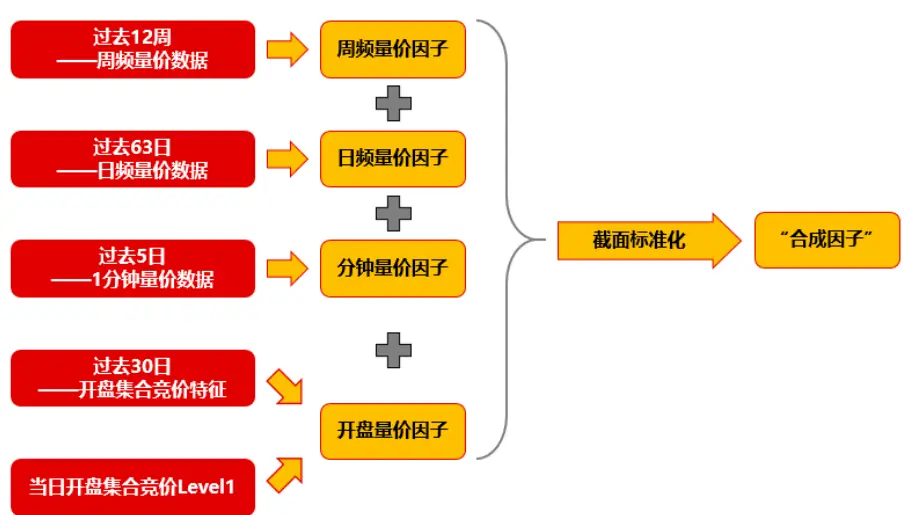
资料来源：长江证券研究所

为了对神经网络类量价因子有更深刻的认识和反思，我们对上述因子的 2024 年表现进行 RankIC 和多头超额收益等指标测算。

## RankIC 表现

首先我们观察图 2 所示 2018 年至 2024 年不同因子在各个成分股内针对 1 日收益率、5 日收益率、10 日收益率以及 20 日收益率的 RankIC 平均值。合成因子在中证全指中5 日收益率 RankIC 为 12.08%，20 日收益率 RankIC 为 14.90%，整体表现可以总结为两点：

## 1. 市值较小的指数成分股内 RankIC 较高

## 2. 目标收益率时间较长 RankIC 较高

以上两点在量价因子的表现中较为普遍，其原因主要是大市值股票的定价更加准确，单纯使用过去一段时间的量价信息对其的预测能力相对有限。其次，目标收益率时间越长，噪声越低，因此使用相同的因子所求得的排序相关性会偏高，但这并不代表使用因子构建策略时以 20 日作为调仓周期所获得的收益会高于 5 日调仓周期。

图 2：2018 年至 2024 年因子 RankIC 表

| 目标收益率 | 因子值 | 上证50 | 沪深300 | 中证500 | 中证800 | 中证1000 | 国证2000 | 中证2000 | 中证全指 |
| --- | --- | --- | --- | --- | --- | --- | --- | --- | --- |
| 1日收益率 | 周频 | 3.40% | 4.24% | 4.43% | 4.43% | 5.40% | 6.39% | 6.60% | 6.10% |
|  | 日频 | 4.16% | 4.10% | 4.54% | 4.41% | 5.38% | 6.67% | 7.76% | 6.41% |
|  | 分钟频 | 3.84% | 4.04% | 5.02% | 4.50% | 6.18% | 7.44% | 8.29% | 6.95% |
|  | 开盘 | 2.94% | 3.43% | 4.71% | 4.07% | 6.16% | 7.76% | 8.53% | 7.13% |
|  | 合成因子 | 5.06% | 5.46% | 6.08% | 5.84% | 7.22% | 8.56% | 8.85% | 8.17% |
| 5日收益率 | 周频 | 5.29% | 7.04% | 7.39% | 7.39% | 9.14% | 10.26% | 10.25% | 9.87% |
|  | 日频 | 5.97% | 6.17% | 6.87% | 6.73% | 8.12% | 9.86% | 11.03% | 9.50% |
|  | 分钟频 | 5.14% | 5.57% | 7.04% | 6.29% | 8.97% | 10.79% | 11.22% | 10.22% |
|  | 开盘 | 3.13% | 4.06% | 5.94% | 5.06% | 8.05% | 10.17% | 10.76% | 9.44% |
|  | 合成因子 | 7.01% | 8.11% | 8.99% | 8.68% | 10.83% | 12.52% | 12.32% | 12.08% |
| 10日收益率 | 周频 | 6.06% | 7.57% | 8.12% | 8.09% | 10.61% | 11.85% | 11.97% | 11.36% |
|  | 日频 | 6.56% | 7.03% | 7.61% | 7.53% | 9.47% | 11.36% | 12.70% | 10.84% |
|  | 分钟频 | 5.78% | 6.40% | 7.99% | 7.14% | 10.47% | 12.48% | 12.36% | 11.76% |
|  | 开盘 | 4.05% | 4.85% | 6.53% | 5.69% | 9.14% | 11.36% | 11.52% | 10.57% |
|  | 合成因子 | 7.94% | 9.03% | 9.98% | 9.65% | 12.55% | 14.37% | 13.97% | 13.80% |
| 20日收益率 | 周频 | 6.34% | 7.87% | 8.31% | 8.28% | 11.25% | 12.53% | 12.89% | 11.99% |
|  | 日频 | 7.88% | 7.74% | 7.80% | 7.91% | 10.31% | 12.06% | 13.02% | 11.42% |
|  | 分钟频 | 6.88% | 7.75% | 9.00% | 8.21% | 12.16% | 14.10% | 13.28% | 13.24% |
|  | 开盘 | 4.42% | 5.87% | 7.14% | 6.41% | 10.52% | 12.69% | 12.17% | 11.83% |
|  | 合成因子 | 9.08% | 10.07% | 10.48% | 10.31% | 13.84% | 15.61% | 14.74% | 14.90% |

资料来源：Wind，长江证券研究所

结合图 2 的分析结论与图 3 所示仅 2024 年 RankIC 测算结果，我们可以发现因子在2024 年的一些变化。

首先整体规律并没有发生太大的变化，仍然以市值越小目标收益率越长 RankIC 越高为主。但是 2024 年因子在沪深 300 上的表现远高于历史平均水平，且优于中证 500 和中证 1000，考虑到沪深 300 中股票数量相对于其余宽基指数较少，因此合成因子 10.41%的 5 日 RankIC 和 12.48%的 20 日 RankIC 更具有投资价值。

其次，在中证全指上，合成因子的5日收益率RankIC为11.28%，而20日收益率RankIC仅为 10.69%，也就是说 2024 年因子的 5 日预测能力相对历史平均水平并没有过大的下滑，但是 20 日预测能力相对历史平均水平 14.90%表现出断崖式的下滑，这可能与2024 年行业轮动和风格轮动的速度加快有关。

图 3：2024 年因子 RankIC 表

| 目标收益率 | 因子值 | 上证50 | 沪深300 | 中证500 | 中证800 | 中证1000 | 国证2000 | 中证2000 | 中证全指 |
| --- | --- | --- | --- | --- | --- | --- | --- | --- | --- |
| 1日收益率 | 周频 | 3.82% | 6.17% | 4.91% | 5.51% | 4.69% | 5.40% | 6.48% | 5.47% |
|  | 日频 | 4.80% | 6.03% | 5.23% | 5.63% | 4.85% | 6.41% | 7.95% | 6.99% |
|  | 分钟频 | 5.45% | 6.01% | 5.76% | 5.24% | 5.98% | 7.08% | 8.34% | 7.19% |
|  | 开盘 | 5.41% | 5.35% | 4.30% | 3.94% | 5.56% | 7.11% | 8.75% | 7.32% |
|  | 合成因子 | 6.42% | 7.45% | 6.50% | 6.65% | 6.19% | 7.44% | 8.86% | 7.77% |
| 5日收益率 | 周频 | 5.55% | 9.59% | 7.75% | 8.68% | 7.28% | 8.71% | 10.58% | 8.82% |
|  | 日频 | 6.81% | 8.85% | 7.34% | 8.13% | 7.31% | 9.88% | 12.10% | 10.39% |
|  | 分钟频 | 8.02% | 7.85% | 7.16% | 6.54% | 8.11% | 9.86% | 11.65% | 10.32% |
|  | 开盘 | 7.09% | 7.19% | 4.58% | 4.63% | 6.80% | 8.93% | 11.14% | 9.09% |
|  | 合成因子 | 8.93% | 10.41% | 8.76% | 9.11% | 8.80% | 10.90% | 12.99% | 11.28% |
| 10日收益率 | 周频 | 5.97% | 10.16% | 7.62% | 8.93% | 7.31% | 9.31% | 11.79% | 9.37% |
|  | 日频 | 6.19% | 9.58% | 7.86% | 8.73% | 7.82% | 10.79% | 13.35% | 11.13% |
|  | 分钟频 | 9.30% | 8.54% | 7.19% | 6.71% | 8.32% | 10.01% | 12.12% | 10.43% |
|  | 开盘 | 9.83% | 8.53% | 4.74% | 5.19% | 6.87% | 9.05% | 11.43% | 9.15% |
|  | 合成因子 | 9.34% | 11.16% | 8.81% | 9.47% | 9.00% | 11.51% | 14.03% | 11.72% |
| 20日收益率 | 周频 | 4.30% | 10.90% | 6.70% | 8.63% | 6.59% | 8.79% | 11.44% | 8.56% |
|  | 日频 | 4.43% | 9.36% | 6.60% | 7.83% | 6.64% | 9.90% | 12.71% | 9.60% |
|  | 分钟频 | 11.39% | 10.41% | 7.26% | 7.61% | 8.72% | 9.96% | 11.72% | 10.00% |
|  | 开盘 | 12.47% | 10.58% | 5.03% | 6.26% | 7.39% | 9.18% | 11.27% | 9.04% |
|  | 合成因子 | 9.76% | 12.48% | 7.98% | 9.60% | 8.52% | 10.98% | 13.52% | 10.69% |

资料来源：Wind，长江证券研究所

## 多头 10%超额收益

我们以因子值前 10%的个股等权组合相对于成分股整体等权组合的净值比为观察对象，复盘合成因子的多头超额与回撤。需要提前说明的是我们未对因子或者组合进行中性化以及交易成本的扣除，因此多头超额不仅包含因子 Alpha 收益也包含一部分风格收益。

从图 4 的超额净值比不难看出，我们的因子在 2024 年2 月份的市场环境下并未出现大幅的超额回撤，其中沪深 300内的多头超额持续走高。但是自 8 月底到 11 月份，因子在各宽基成分股内均发生较长时间的超额回撤，直到 11 月下半旬以及 12 月份才缓慢恢复超额。

虽然根据表 1 所示，合成因子在 2024 年各个成分股内均取得不同程度的正超额，其中沪深 300 上超额收益最终有 27.38%显著高于历史平均水平，但是其超额回撤也让人难以承受。直接对因子或者持仓组合进行市值行业风格中性化固然对降低超额回撤有所帮助，但是我们仍然需要思考在训练神经网络的过程中是否能够对 Beta 收益和 Alpha 收益作区分处理，从而缓解因子受到市场风格影响导致的大幅和长期回撤。

图 4：2024年合成因子多头超额净值比（未扣费1）
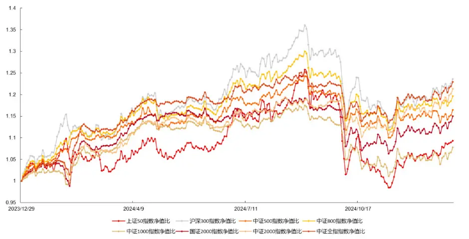
资料来源：Wind，长江证券研究所

表 1：合成因子分年多头超额收益（未扣费）
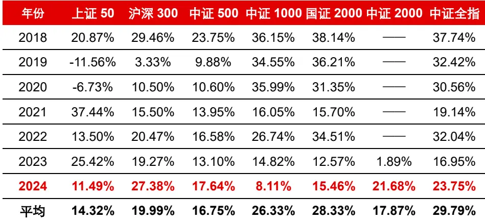
资料来源：Wind，长江证券研究所

## Alpha 收益和 Beta 收益拆分

从收益率的角度出发，我们认为基于因子模型框架下的个股收益率可以拆分成市场收益、个股风格收益和个股残差收益。

具体而言在 A 股上进行收益率拆分时，市场收益可以定义为 A 股市场的整体收益率；个股风格收益可以定义为市值、行业、流动性等风险收益通常称为 Beta，该收益需要投资者主动暴露对应的风险，在方向正确的情况下才能获取对应的收益；个股残差收益通常称为 Alpha，是量化投资者最为关心的目标，理论上如果能对残差收益进行较为准确的预测，即可获取一定的无风险收益，因此大批量的人工因子挖掘以及机器学习因子挖掘其核心在于对残差收益的预测。

$$
\mathrm{y}=\mathrm{y}_{\mathrm{mkt}}+\beta+\alpha
$$

## 神经网络量价因子的风格收益

前期报告中我们通过不断加入新的数据集，加强神经网络量价因子的预测能力，但是并没有着重分析过其 Beta 暴露和 Alpha 属性的高低。从前一小节 2024 年样本外复盘来看，融合多种数据集确实带来了样本内外收益的提升，但是结合图 5 我们不能发现，日频量价因子和周频量价因子的风格暴露明显低于分钟频量价因子和开盘集合竞价因子。特别是 2024 年影响最大的市值因子、残差波动因子和流动性因子上，加入相对高频的数据后，预测值与 BarraCNE5的十大风格因子相关性有不小的增加。

从投资的角度出发，某些风格因子确实长期能带来一定的收益，例如小市值、低波和低流动性，但是也会加剧短期的波动。因此为了最大化收益的同时降低风险，目前大部分量化的产品对风格收益进行了一定的约束，而因子研究也需要更加关注对 Alpha 的预测，而非对 Beta 的择时。

图 5：神经网络量价因子与 Barra 风格因子的相关性
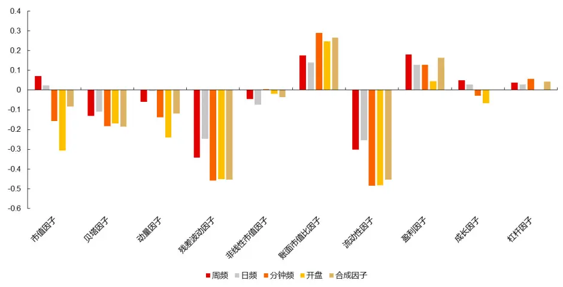
资料来源：Wind，天软科技，长江证券研究所

这里我们再做一个简单的尝试，如果将上述因子分别做严格的行业和 Barra 风格（包含市值）中性化后，它们的 RankIC 和多头超额还剩下多少。

通过对比图 6 所示的中性化后因子 RankIC 与图 2 所示的中性化前因子 RankIC，可以发现 RankIC 值普遍下滑了三分之一以上，且市值越大的成分股下滑越明显。该现象说明两点，其一我们前期的神经网络量价因子 RankIC 存在“虚高”部分，其二神经网络量价因子在中证 800 成分股内的收益大部分来源于行业与风险收益，即拆分收益率中的Beta 收益部分。

图 6：中性化后因子 RankIC

| 目标收益率 | 因子值 | 上证50 | 沪深300 | 中证500 | 中证800 | 中证1000 | 国证2000 | 中证2000 | 中证全指 |
| --- | --- | --- | --- | --- | --- | --- | --- | --- | --- |
| 1日收益率 | 周频 | 0.77% | 1.36% | 1.84% | 1.62% | 3.07% | 4.01% | 4.35% | 3.48% |
|  | 日频 | 1.38% | 0.92% | 2.04% | 1.56% | 3.38% | 4.68% | 5.53% | 4.00% |
|  | 分钟频 | 1.15% | 1.47% | 1.92% | 1.74% | 3.51% | 4.83% | 5.73% | 4.16% |
|  | 开盘 | 0.49% | 0.93% | 1.84% | 1.50% | 3.69% | 5.32% | 6.27% | 4.47% |
|  | 合成因子 | 1.69% | 1.88% | 2.77% | 2.38% | 4.57% | 6.02% | 6.61% | 5.19% |
| 5日收益率 | 周频 | 1.78% | 2.61% | 3.36% | 2.97% | 5.35% | 6.44% | 6.57% | 5.61% |
|  | 日频 | 1.89% | 1.34% | 2.93% | 2.22% | 4.97% | 6.82% | 7.48% | 5.73% |
|  | 分钟频 | 1.58% | 2.19% | 2.76% | 2.51% | 5.05% | 6.89% | 7.54% | 5.96% |
|  | 开盘 | -0.45% | 0.71% | 2.00% | 1.51% | 4.41% | 6.39% | 7.36% | 5.37% |
|  | 合成因子 | 2.53% | 3.01% | 4.12% | 3.59% | 6.72% | 8.59% | 8.83% | 7.41% |
| 10日收益率 | 周频 | 2.55% | 2.91% | 3.55% | 3.19% | 6.19% | 7.36% | 7.56% | 6.37% |
|  | 日频 | 2.07% | 1.50% | 2.98% | 2.30% | 5.72% | 7.75% | 8.38% | 6.40% |
|  | 分钟频 | 1.67% | 2.53% | 2.97% | 2.75% | 5.80% | 7.82% | 8.68% | 6.72% |
|  | 开盘 | -0.30% | 0.93% | 1.86% | 1.52% | 4.69% | 6.66% | 7.90% | 5.62% |
|  | 合成因子 | 3.14% | 3.38% | 4.27% | 3.80% | 7.64% | 9.66% | 9.89% | 8.25% |
| 20日收益率 | 周频 | 2.86% | 2.92% | 3.25% | 3.03% | 6.34% | 7.54% | 7.83% | 6.45% |
|  | 日频 | 2.73% | 1.25% | 2.72% | 2.05% | 6.06% | 7.98% | 8.59% | 6.48% |
|  | 分钟频 | 2.06% | 3.06% | 3.14% | 3.06% | 6.42% | 8.31% | 9.28% | 7.13% |
|  | 开盘 | -0.87% | 0.70% | 1.31% | 1.07% | 4.85% | 6.65% | 8.09% | 5.53% |
|  | 合成因子 | 3.59% | 3.38% | 3.95% | 3.62% | 8.05% | 9.95% | 10.15% | 8.41% |

资料来源：Wind，长江证券研究所

但是 Beta 收益也不完全是洪水猛兽，事实上前文也展示了沪深 300 内的超额收益是十分可观的。主要是因为神经网络类因子在行业与风险因子上的暴露并非固定在一个水平上，而是类似于择时。比如因子在 2019 年到 2020 年期间更偏向大市值，而到 2022 年和 2023 年期间更偏向于小市值，因此可以认为因子在行业和风险因子择时上有一定的胜率，从而长期来看得到了高于所暴露风险的收益，这一部分也可以称之为因子的择时Alpha，非传统 Alpha。

我们认为 Beta 收益和 Alpha 收益更多是人为拆分和定义的结果，因此根据不同人的理解和投资观念，会得到不一样的 Beta 和 Alpha。而历史上多因子风险模型的研究，也是为了更加准确的拆分出 Beta，从而预测个股风险，但是这件事本身是很难验证真伪的，毕竟金融市场是极为复杂的，尝试用线性模型去逼近一个人为博弈且可能随时变的规律是较为困难的。

## Alpha 预测

虽然前文将神经网络量价因子进行 Beta 中性化后，剩余部分仍然对收益率有不俗的预测能力，但是这也代表原本模型中学习的部分规律对 Alpha是无用的。为了提升模型对Alpha 的预测能力，或者说将模型的全部预测能力集中于对 Alpha 的预测，我们希望在模型训练阶段就尝试剔除对 Beta 的预测，我们认为事前剔除往往比事后剔除更加有效。

我们的做法是在其他模型和参数等条件不变的情况下，仅改变预测目标为 Alpha 收益率来训练神经网络。由于在拆分 Alpha 收益率和 Beta 收益率的时候，一般是通过对Beta 因子回归后取残差项作为 Alpha 收益，因此 Alpha 收益本身与 Beta 收益相关系数固定为零。而只学习 Alpha 收益也自然可以让模型预测值与 Beta 因子的相关性大幅降低。

且这里我们可以通过不同的中性化来对比剔除不同 Beta 因子的必要性。方便其间，我们将对比两种 Alpha 收益率目标：

## 1. 市值和行业中性化 Alpha

## 2. 市值、行业和 BarraCNE5 十大风格因子中性化 Alpha

后文都将以较为常用且耗时较短的日频量价数据因子任务作为实验对象，目的是快速验证不同方法的有效性。

表 2：实验设计

| 环节 | 项目名称 | 具体细节 |
| --- | --- | --- |
| 数据样本 | 预测周期 | 未来 5 日 原始收益率 Baseline、 |
|  | 预测目标 | 市值行业 Barra 中性化收益率 Alpha1、 市值行业中性化收益率 Alpha2 |
|  | 输入数据 | 过去 63 日量价数据： 开盘价、收盘价、最高价、最低价、成交量、成交额 训练集：2010年1月1日—T-2年12月01日； |
|  | 数据集划分 | 验证集：T-2年1月1日—T-1年12月01日； 测试集：T年1月1日—T年12月31日； 样本外T年取值范围：2018年——2024年 |
|  | 数据处理 | 价格输入数据：除以最后一日收盘价； 成交输入数据：做时序最大最小值标准化； 预测目标：截面分位数 |
|  | 样本范围 | 沪深两市 A 股全市场 |
| 网络模型 和 训练参数 | 模型 | TCN 卷积核大小：2 |
|  | 参数 | 通道个数：[64,64,64,64,64] 残差模块个数：5 输出维度：64 |
|  | 损失函数 | $\begin{array}{c}{{Loss_{final}=\displaystyle-\frac{\sum_{i=1}^{64}\mathrm{Corr}(\widehat{y}_{i},y)}{64}-\frac{1}{2}\mathrm{Corr}(\displaystyle\sum_{i=1}^{64}\widehat{y}_{i},y)}}\\{{+\displaystyle\frac{\sum_{i=1}^{64}\sum_{j=1}^{64}Corr(\widehat{y}_{i},\widehat{y}_{j})^{2}}{64}}}\end{array}$ |
|  | 最终预测值 | 64个单因子等权合成 |
|  | 早停轮数 | 10轮 |
|  | 学习率 | 0.0001 |

资料来源：长江证券研究所

可以看出，以市值行业 Barra 中性化收益率 Alpha1 为预测目标的模型预测值在 Barra风格因子的相关系数上相比于原始收益率有较大幅度的下降，但是仅以市值行业中性化收益率 Alpha2 为预测目标的模型预测值在 Barra 风格因子上的相关系数不降反升。这一点充分说明了 Beta 收益的事前剔除能显著影响预测值的风格暴露程度。

但是另一方面，我们发现 Alpha1 的预测值仍然在残差波动因子、流动性因子和盈利因子有一定的暴露，这三者也恰好是 Baseline 暴露最大的三个Barra 风格因子。这说明事前剔除在限制风格暴露上是“软中性”，而非事后剔除把所有相关系数降至零的“硬中性”。

表 3：因子间相关系数与 Barra 相关系数

| 意义 | 因子 | Alpha1 | Alpha2 | Baseline |
| --- | --- | --- | --- | --- |
| 因子间相关系数 | Alpha1 | 100.00% | 81.65% | 76.15% |
|  | Alpha2 | 81.65% | 100.00% | 85.31% |
|  | Baseline | 76.15% | 85.31% | 100.00% |
| Barra 风格因子 相关系数 | 市值因子 | 6.97% | 7.32% | 3.23% |
|  | 贝塔因子 | -2.21% | -10.69% | -8.54% |
|  | 动量因子 | 1.65% | -3.68% | -3.91% |
|  | 残差波动因子 | -15.04% | -29.67% | -29.45% |
|  | 非线性市值因子 | -4.11% | -6.25% | -6.06% |
|  | 账面市值比因子 | 4.95% | 13.96% | 13.24% |
|  | 流动性因子 | -14.37% | -27.02% | -25.52% |
|  | 盈利因子 | 9.28% | 16.01% | 13.95% |
|  | 成长因子 | 4.47% | 4.70% | 3.47% |
|  | 杠杆因子 | 0.87% | 3.14% | 1.57% |

资料来源：Wind，天软科技，长江证券研究所

我们在下图中从时间维度对比了 Alpha1 与 Baseline 的 Barra 风格因子相关系数。可以看出来在大部分本身暴露不高的风格上，Alpha1 与 Baseline 基本趋同。但是在残差波动、流动性和盈利因子上，Alpha1 在 Baseline 偏离较大的部分区间维持在零附近波动，因此最终在全区间上的暴露均值显著降低。但是部分时间的风格约束是否带来了收益上的提升呢？

图 7：Alpha1和 Baseline分别与市值因子相关系数时间序列

Comparison of Alpha1 vs Baseline across Different Metrics从分组原始收益率的角度看，Alpha1 相对 Baseline 也有一定的优化。虽然 Baseline 在长期获得超额收益的低波低流动性以及价值等风格上有更高的偏离，但是 Alpha1 的 Top组超额收益相对于 Baseline 的Top 组超额收益仍有 1.57%的提升。

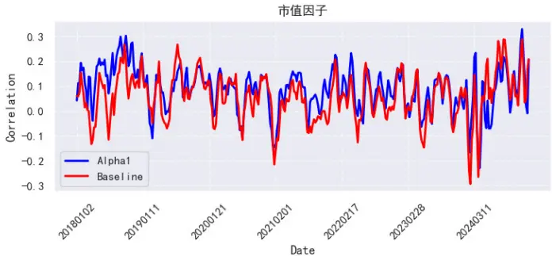

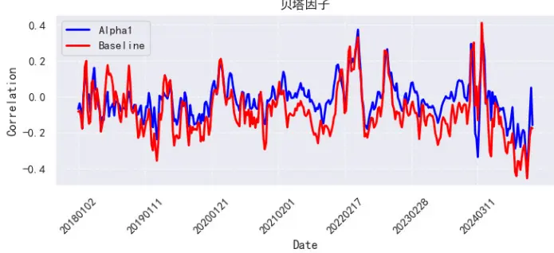

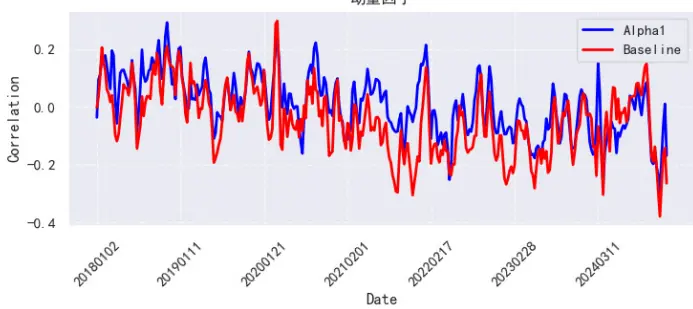

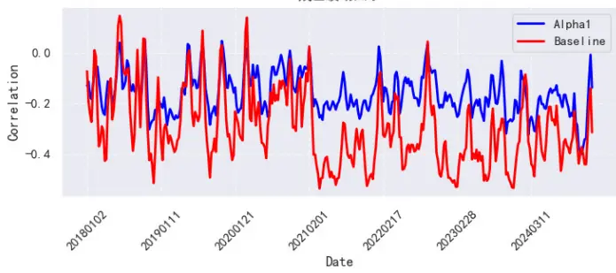

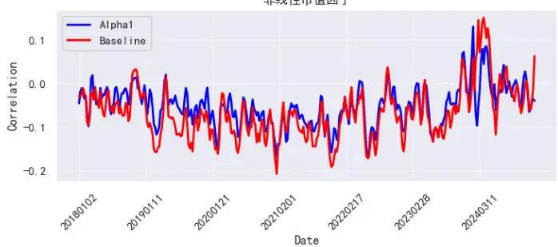

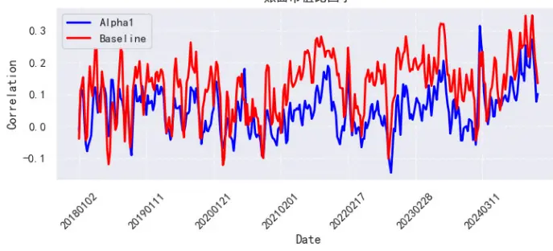

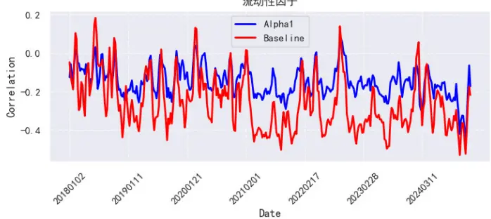

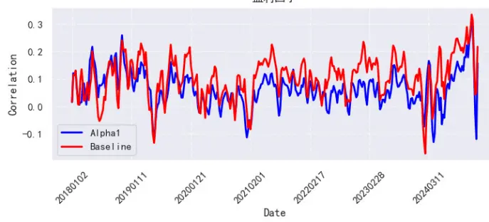

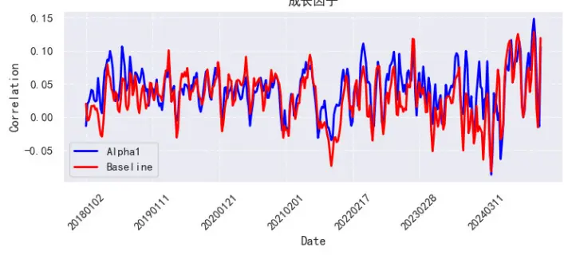
资料来源：Wind，天软科技，长江证券研究所

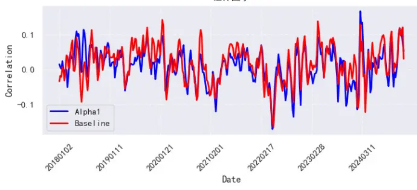

表 4：不同收益率目标因子分组超额

| 分组 | Alpha1 Alpha2 | Baseline |
| --- | --- | --- |
| Bottom | -43.15% -43.49% | -42.35% |
| 2 | -11.99% -11.47% | -11.95% |
| 3 | -4.63% -4.46% | -3.86% |
| 4 | 0.16% 0.54% | 0.02% |
| 5 | 4.00% 4.23% | 4.61% |
| 6 | 8.27% 8.24% | 8.50% |
| 7 | 11.57% 11.73% | 10.68% |
| 8 | 14.69% 14.37% | 13.82% |
| 9 | 18.22% 18.40% | 18.17% |
| Top | 22.38% 21.43% | 20.81% |

资料来源：Wind，长江证券研究所

但是表 4 中的结果仍不能代表 Alpha1 预测值的 Alpha 更强，因为多头超额优化的另一个可能是 Baseline 在 Beta 暴露上遭受了一定的风险，从而导致 Alpha1 对 Beta 进行约束后多头组规避了这一部分回撤。

因此我们可以直接对比二者严格中性化后的分组超额，剔除二者在所有截面上的风格收益。从结果上来看，二者均有一定的下降，但是 Alpha1 的超额收益下滑程度明显低于Baseline。

表 5：因子中性化后分组超额

| 分组 | Alpha1-中性化 Baseline-中性化 |
| --- | --- |
| Bottom | -39.71% -36.30% |
| 2 | -10.63% -10.59% |
| 3 | -3.10% -3.80% |
| 4 | 0.73% 0.54% |
| 5 | 3.49% 4.24% |
| 6 | 6.43% 6.92% |
| 7 | 10.17% 9.48% |
| 8 | 12.24% 11.26% |
| 9 | 15.81% 14.00% |
| Top | 20.19% 17.04% |

资料来源：Wind，长江证券研究所

这可以说明两点，其一神经网络挖掘的因子确实能从风格暴露上获得一定的长期超额，其二 Alpha1 相比于 Baseline 的优化是 Alpha 预测能力的提升，并非 Beta 风险的控制。为了比较各成分股内二者的多头超额在时间上的变化情况，我们以 Alpha1 的多头组净值比上 Baseline 的多头组净值得到二者净值比，以此观察二者时间上的强弱变化，净值比向上走代表 Alpha 相对较强。

图 8：Alpha1 与 Baseline 多头组净值比（未扣费）
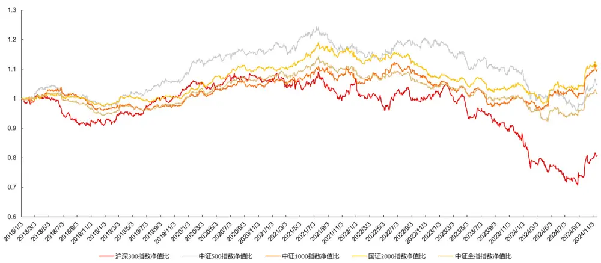
资料来源：Wind，长江证券研究所

图 9：Alpha1与 Baseline多头组净值比（未扣费且中性化后）
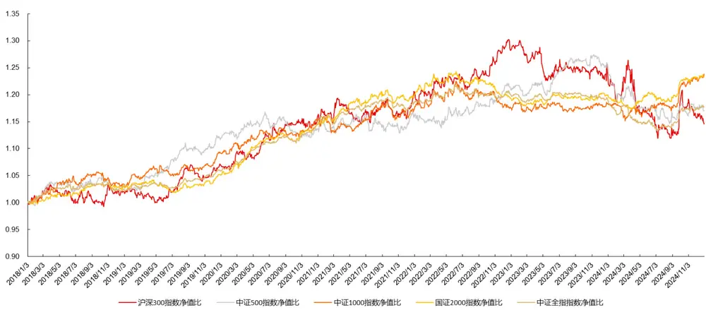
资料来源：Wind，天软科技，长江证券研究所

从图中不难看出，在 2019 年至 2021 年这段时间，所统计的宽基指数成分股内 Alpha1的多头组均能稳定跑赢 Baseline。但是在 2022 年和 2023 年期间，Baseline 在未进行中性化前略优于 Alpha1，中性化后各有优劣。总而言之，Alpha1 虽说在历史上优于Baseline 但是近几年的表现并无明显差异，2024 年 9 月份以来 Alpha1 又表现出了明显的优势，可能与市场环境发生大幅切换有关。

因此在训练神经网络时，Alpha1 即使没有充分性也有必要性。更加稳健的做法是以多策略的形式同时使用原始收益率和中性化收益率生成的因子。超额收益虽可能不会有明显的提高，但是稳定性方面大概率会有一定的优化，特别是在部分极端行情下。

2024 年中证全指内二者多头超额的走势对比是一个较为明显的例子。全年来看，二者超额收益相差无几，但是如果从时间维度分析，可以发现二者在超额收益的获取路径上有很大区别。Alpha1 在 3 月份之前市值因子和流动性因子大幅切换的环境下 Baseline优势明显。而 9 月份到 10 月份 Baseline 超额大幅回撤，Alpha1 基本不受影响。

总而言之，大部分情况下，二者并无明显差异，但是在某些极端市场环境下，可能会有较大的分化。因此将二者结合后使用不失为一个良策。

图 10：2024年中证全指内不同因子多头超额净值（未扣费且中性化后）
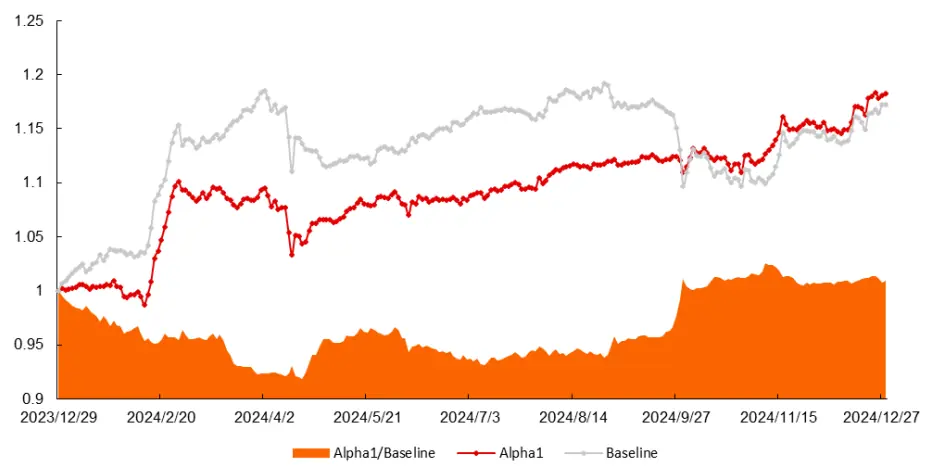
资料来源：Wind，天软科技，长江证券研究所

## Beta 预测

前文验证了市值行业风格中性化收益率作为预测目标训练神经网络能够提升其 Alpha预测能力，自然会联想到被剔除的 Beta 收益是否有预测价值。

理论上来说，如果我们能使用模型精确预测个股的 Beta 收益，那这同样能成为一个好的 Alpha 因子，甚至可以成为一个优秀的市场择时信号。大家之所以约束风格暴露，是因为普遍认为 Beta 收益相比于 Alpha 收益更难预测。而事实上也是如此，如果投资者能够以一定的胜率预测当日小市值好还是大市值好，就不止能通过选股来获取超额收益，还可以直接通过不同市值大小的宽基指数金融工具实现一部分稳定的收益。

我们仍旧使用日频 K 线数据作为输入特征，在保持模型和各项训练参数不变的条件下，尝试预测个股的 Beta 收益。需要注意的是，我们训练 Beta 收益神经网络时与前期报告中最大的区别在于单个 Batch样本的划分。

## Alpha 预测时采用打乱 Batch

前期报告我们习惯将训练集完全打乱样本，并随机抽样 1024 个样本作为单个 Batch 进行训练，这样做的好处在于训练时模型收敛的更加平滑。主观逻辑上，我们认为截面Batch 也就是单日所有股票样本作为一个 Batch 训练的问题在于，模型训练到小部分量价因子大幅失效的截面时，会计算得到一个较高的梯度，因此神经网络每当训练到该样本时，会对网络参数有较大的影响，先不论该影响是正向还是负向，至少会使得网络效果波动更大。打乱 Batch 的好处在于，每个 Batch 是随机抽样得到的，更接近统计学上的同分布，即使在这 1024 个样本中存在个别样本梯度较高，也不影响最终整体反向传播时梯度过高。

## Beta 预测时采用截面 Batch

在预测 Beta 收益时，我们认为截面整体的信息可能比个股信息更为重要，因此我们保留截面 Batch 的采样形式。但是输入数据要进行截面标准化，即对每个特征减去其截面均值除以截面标准差，目的是将截面的信息进行进一步的加强。

表 6：Beta预测实验设计

| 环节 | 项目名称 | 具体细节 |
| --- | --- | --- |
| 数据样本 | 预测周期 | 未来5 日 |
|  | 预测目标 | 风险收益 Beta 过去 63 日量价数据： |
|  | 输入数据 | 开盘价、收盘价、最高价、最低价、成交量、成交额 训练集：2010年1月1日—T-2年12月01日； |
|  | 数据集划分 | 验证集：T-2年1月1日—T-1年12月01日； 测试集：T年1月1日—T年12月31日； 样本外T年取值范围：2018年——2024年 |
|  | 数据处理 | 价格输入数据：除以最后一日收盘价并截面标准化； 成交输入数据：做时序最大最小值标准化并截面标准化； 预测目标：不做处理； Batch:截面 Batch |
|  | 样本范围 | 沪深两市 A 股全市场 |
| 网络模型 和 训练参数 | 模型 | TCN |
|  | 参数 | 卷积核大小：2 通道个数：[64,64,64,64,64] 残差模块个数：5 |

| 输出维度：1 |
| --- |
| 损失函数 Lossfinal = MSE(y, ) |
| 最终预测值 模型输出 |
| 早停轮数 10轮 |
| 学习率 0.0001 |

资料来源：长江证券研究所

从使用的角度来看，我们可以从预测风格收益方向的角度来评判 Beta 预测值的有效性，这并不是说其作为因子没有多头超额，而是其超额稳定性必然不高。其次 Beta 预测值与 Barra 风格因子的相关性自然会比较高，因为 Beta 收益本身是由风格因子与行业因子的线性回归所得。从图中 Barra 风格相关系数可以看出来，日频 K 线中所能提取的风格信息主要是残差波动因子、流动性因子、账面市值比因子、动量因子和盈利因子，这与直观逻辑也是相符的。

图 11：Beta收益率预测值风格因子相关系数
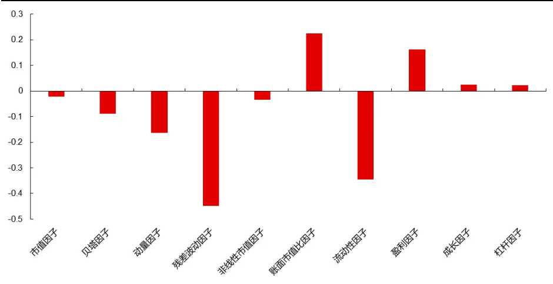
资料来源：Wind，天软科技，长江证券研究所

但是 Beta 预测值在风格择时上的胜率可能是我们更加关心的，我们以 Beta 预测值与每个风格因子的 IC 时间序列为基础，再计算其 IC 值的 20 日差分作为对应风格方向择时指标，计算该指标与风格因子是否反向的混淆矩阵，目的在于观察我们的预测值是否有风格异常时的提示能力。从精确率和召回率的角度来看，有一定的效果，但也无法作为一个高胜率的指标来使用。这里需要说明的是，精确率和召回率小于 50%并不代表没有意义，例如残差波动因子在历史上正 IC 的比例远低于负 IC的比例，因此如果仅以抛硬币的方式去预测，胜率远低于 50%，因此应该具体问题具体分析样本不平衡时的混淆矩阵数值。

精确率的解释可以理解为，模型提示风格异常时，风格实际异常的胜率。而召回率可以理解为风格异常时，模型提示风格异常的概率。在风格异常这种较小概率事件发生时，若模型有 50%的胜率提前给出提示，那该预测是比较有意义的。

表 7：Beta预测值 20日差分的风格异常混淆矩阵

| 风格因子 | 真阴性 (TN) | 假阳性 (FP) | 假阴性 (FN) | 真阳性 (TP) | 准确率 | 精确率 | 召回率 | F1分数 |
| --- | --- | --- | --- | --- | --- | --- | --- | --- |
| 市值因子 | 481 | 472 | 322 | 418 | 53.10% | 46.97% | 56.49% | 51.29% |
| 贝塔因子 | 474 | 414 | 384 | 421 | 52.86% | 50.42% | 52.30% | 51.34% |
| 动量因子 | 533 | 366 | 385 | 409 | 55.64% | 52.77% | 51.51% | 52.14% |
| 残差波动因子 | 724 | 496 | 193 | 280 | 59.30% | 36.08% | 59.20% | 44.84% |
| 非线性市值因子 | 595 | 520 | 279 | 299 | 52.81% | 36.51% | 51.73% | 42.81% |
| 账面市值比因子 | 526 | 439 | 390 | 338 | 51.03% | 43.50% | 46.43% | 44.92% |
| 流动性因子 | 603 | 475 | 301 | 314 | 54.16% | 39.80% | 51.06% | 44.73% |
| 盈利因子 | 541 | 409 | 385 | 358 | 53.10% | 46.68% | 48.18% | 47.42% |
| 成长因子 | 404 | 461 | 418 | 410 | 48.08% | 47.07% | 49.52% | 48.26% |
| 杠杆因子 | 445 | 446 | 376 | 426 | 51.45% | 48.85% | 53.12% | 50.90% |

资料来源：Wind，天软科技，长江证券研究所

当然以上对于风格择时的应用，目前还不够成熟，也很难对量化产品产生稳定的超额收益。我们不作过多展开，但是我们认为方法本身还是有一定价值的。

## Alpha 与 Beta 收益预测值合成

虽然前文中 Alpha 收益率作为预测目标所得因子的分组超额收益有一定的优化，但是如果将 Beta 预测值和 Alpha 预测值合成后，类似于原始收益率的两步预测，会不会有进一步的提升呢？

这里我们将 Alpha 收益率预测值与 Beta 收益率预测值按照 3:1 的比例进行加权合成，这是与原始收益率作为目标最为相似的，且Alpha和Beta比例也最为相近的合成方法。我们可以直接对比其多头超额。不难发现，Alpha+Beta 后多头超额又有小幅提升，这部分提升相比于 Alpha 预测值主要来自于 Beta 择时的加入。

表 8：Alpha+Beta 分组超额

| 分组 | Alpha | Beta | Baseline | Alpha+Beta | Alpha+Beta +Baseline |
| --- | --- | --- | --- | --- | --- |
| Bottom | -43.15% | -25.45% | -42.35% | -42.46% | -43.67% |
| 2 | -11.99% | -8.74% | -11.95% | -13.87% | -13.68% |
| 3 | -4.63% | -4.18% | -3.86% | -5.22% | -4.49% |
| 4 | 0.16% | -0.63% | 0.02% | 0.41% | -0.01% |
| 5 | 4.00% | 2.55% | 4.61% | 4.44% | 5.31% |
| 6 | 8.27% | 4.44% | 8.50% | 8.28% | 9.19% |
| 7 | 11.57% | 6.39% | 10.68% | 11.27% | 11.92% |
| 8 | 14.69% | 9.41% | 13.83% | 14.94% | 14.65% |
| 9 | 18.22% | 9.99% | 18.17% | 17.89% | 18.25% |
| Top | 22.38% | 12.46% | 20.81% | 23.88% | 22.96% |

资料来源：Wind，长江证券研究所

## 总结

我们回顾了 2024 年神经网络量价因子的表现，发现其在沪深 300 指数中的预测能力显著超过历史平均水平，而在中证全指成分股内，合成因子的 5日收益率 RankIC为 11.28%与历史平均水平较为接近，但 20 日收益率 RankIC 为 10.69%，相对于历史平均水平14.90%有较大下滑，这可能与2024 年行业轮动和风格轮动的速度加快有关。

通过将预测目标调整为市值行业 Barra 中性化收益率（Alpha1），模型风格暴露显著降低。以残差波动因子为例，Alpha1与Barra风格因子相关系数均值从Baseline的-29.45%降至-15.04%。因子严格中性化后 Alpha1 的 Top 组超额收益达 20.19%，较 Baseline 提升 3.15%，且在 2024 年 2 月及 9 月的极端行情中回撤更小。

严格中性化后，我们的合成因子 RankIC 普遍下滑三分之一，表明原模型收益部分依赖Beta 暴露（如小市值、低流动性）。但 Beta 收益并非完全无效，沪深 300 内因子通过风格择时（如 2019-2020 年偏大市值，2022-2023 年偏小市值）实现长期超额。因此，需结合事前剔除（软中性）与事后约束（硬中性），平衡 Alpha 与 Beta 收益的获取。

我们以 Beta 预测值与每个风格因子的 IC 时间序列为基础，再计算其 IC 值的 20 日差分作为对应风格方向择时指标，计算该指标与风格因子是否反向的混淆矩阵，目的在于观察我们的预测值是否有风格异常时的提示能力。从精确率和召回率的角度来看，有一定的效果，但也无法作为一个高胜率的指标来使用。

将Alpha预测值和Beta预测值按照3:1比例线性加权后与原始收益率预测值较为接近，但多头超额可进一步提升，最终相比于 Baseline 提升 3.07%。

## 风险提示

1、深度学习模型训练过程中有随机性，可能导致预测结果有误差。神经网络在训练的过程中有一定的随机性，随机性包括训练数据集的划分和网络结构中的随机丢弃等，以上情况均可能导致预测结果会有波动和误差风险。

2、模型总结的市场规律是基于历史数据的，存在失效风险。市场量价规律可能随时间变化而变化，模型总结的规律是基于历史数据且是固定的，存在失效风险。

3、日频交易策略回测结果仅供参考，需要考虑实际交易存在的滑点等风险。

4、数据处理细节上的差异对策略有一定的影响，例如缺失值和行情数据复权方式的差异，可能导致最终因子值和策略产生一定的误差。

## 投资评级说明

| 行业评级 | 报告发布日后的12个月内行业股票指数的涨跌幅相对同期相关证券市场代表性指数的涨跌幅为基准，投资建议的评 |
| --- | --- |
| 级标准为： 看 | 好： 相对表现优于同期相关证券市场代表性指数 |
| 中 性： | 相对表现与同期相关证券市场代表性指数持平 |
|  | 淡： 相对表现弱于同期相关证券市场代表性指数 |
| 公司评级 | 报告发布日后的12个月内公司的涨跌幅相对同期相关证券市场代表性指数的涨跌幅为基准，投资建议的评级标准为： |
| 买 入： | 相对同期相关证券市场代表性指数涨幅大于10% |
| 增 | 相对同期相关证券市场代表性指数涨幅在5%～10%之间 |
| 持： 中 性： | 相对同期相关证券市场代表性指数涨幅在-5%～5%之间 |
| 减持： | 相对同期相关证券市场代表性指数涨幅小于-5% |
|  | 无投资评级：由于我们无法获取必要的资料，或者公司面临无法预见结果的重大不确定性事件，或者其他原因，致使 |
| 我们无法给出明确的投资评级。 相关证券市场代表性指数说明：A股市场以沪深300指数为基准；新三板市场以三板成指（针对协议转让标的）或三板做市指数 |  |

## 办公地址

[Tabl上海
Add /虹口区新建路 200 号国华金融中心 B 栋 22、23 层
P.C /（200080）
北京
Add /西城区金融街 33 号通泰大厦 15 层
P.C /（100032）
武汉
Add /武汉市江汉区淮海路 88号长江证券大厦 37 楼
P.C /（430015）
深圳
Add /深圳市福田区中心四路1号嘉里建设广场 3 期 36 楼
P.C /（518048）

## 分析师声明

本报告署名分析师以勤勉的职业态度，独立、客观地出具本报告。分析逻辑基于作者的职业理解，本报告清晰准确地反映了作者的研究观点。作者所得报酬的任何部分不曾与，不与，也不将与本报告中的具体推荐意见或观点而有直接或间接联系，特此声明。

## 法律主体声明

本报告由长江证券股份有限公司及/或其附属机构（以下简称「长江证券」或「本公司」）制作，由长江证券股份有限公司在中华人民共和国大陆地区发行。长江证券股份有限公司具有中国证监会许可的投资咨询业务资格，经营证券业务许可证编号为：10060000。本报告署名分析师所持中国证券业协会授予的证券投资咨询执业资格书编号已披露在报告首页的作者姓名旁。

在遵守适用的法律法规情况下，本报告亦可能由长江证券经纪（香港）有限公司在香港地区发行。长江证券经纪（香港）有限公司具有香港证券及期货事务监察委员会核准的“就证券提供意见”业务资格（第四类牌照的受监管活动），中央编号为：AXY608。本报告作者所持香港证监会牌照的中央编号已披露在报告首页的作者姓名旁。

## 其他声明

本报告并非针对或意图发送、发布给在当地法律或监管规则下不允许该报告发送、发布的人员。本公司不会因接收人收到本报告而视其为客户。本报告的信息均来源于公开资料，本公司对这些信息的准确性和完整性不作任何保证，也不保证所包含信息和建议不发生任何变更。本报告内容的全部或部分均不构成投资建议。本报告所包含的观点、建议并未考虑报告接收人在财务状况、投资目的、风险偏好等方面的具体情况，报告接收者应当独立评估本报告所含信息，基于自身投资目标、需求、市场机会、风险及其他因素自主做出决策并自行承担投资风险。本公司已力求报告内容的客观、公正，但文中的观点、结论和建议仅供参考，不包含作者对证券价格涨跌或市场走势的确定性判断。报告中的信息或意见并不构成所述证券的买卖出价或征价，投资者据此做出的任何投资决策与本公司和作者无关。本研究报告并不构成本公司对购入、购买或认购证券的邀请或要约。本公司有可能会与本报告涉及的公司进行投资银行业务或投资服务等其他业务(例如:配售代理、牵头经办人、保荐人、承销商或自营投资)。

本报告所包含的观点及建议不适用于所有投资者，且并未考虑个别客户的特殊情况、目标或需要，不应被视为对特定客户关于特定证券或金融工具的建议或策略。投资者不应以本报告取代其独立判断或仅依据本报告做出决策，并在需要时咨询专业意见。

本报告所载的资料、意见及推测仅反映本公司于发布本报告当日的判断，本报告所指的证券或投资标的的价格、价值及投资收入可升可跌，过往表现不应作为日后的表现依据；在不同时期，本公司可以发出其他与本报告所载信息不一致及有不同结论的报告；本报告所反映研究人员的不同观点、见解及分析方法，并不代表本公司或其他附属机构的立场；本公司不保证本报告所含信息保持在最新状态。同时，本公司对本报告所含信息可在不发出通知的情形下做出修改，投资者应当自行关注相应的更新或修改。本公司及作者在自身所知情范围内，与本报告中所评价或推荐的证券不存在法律法规要求披露或采取限制、静默措施的利益冲突。

本报告版权仅为本公司所有，本报告仅供意向收件人使用。未经书面许可，任何机构和个人不得以任何形式翻版、复制和发布给其他机构及/或人士（无论整份和部分）。如引用须注明出处为本公司研究所，且不得对本报告进行有悖原意的引用、删节和修改。刊载或者转发本证券研究报告或者摘要的，应当注明本报告的发布人和发布日期，提示使用证券研究报告的风险。本公司不为转发人及/或其客户因使用本报告或报告载明的内容产生的直接或间接损失承担任何责任。未经授权刊载或者转发本报告的，本公司将保留向其追究法律责任的权利。

本公司保留一切权利。