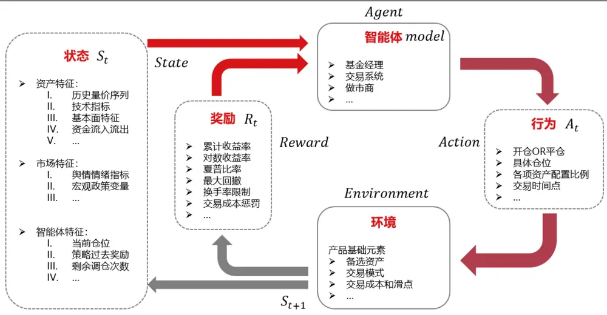
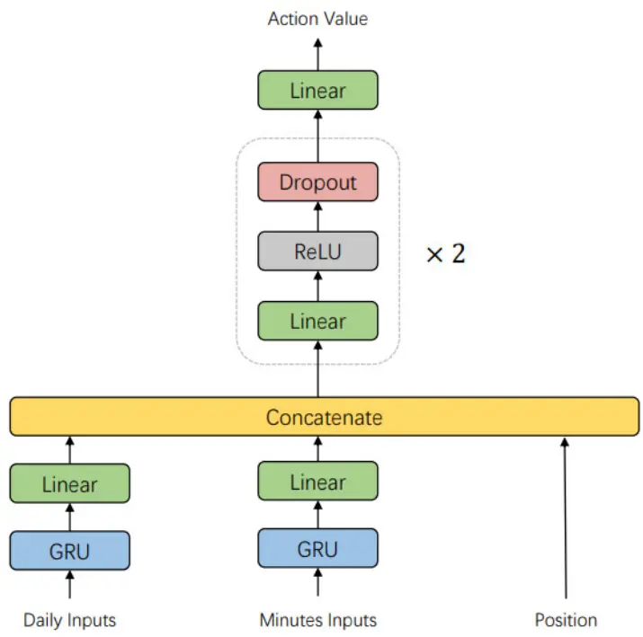
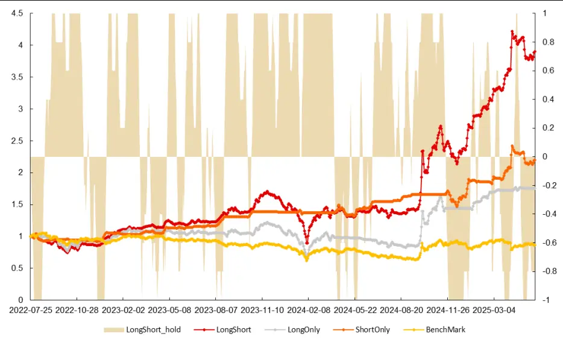
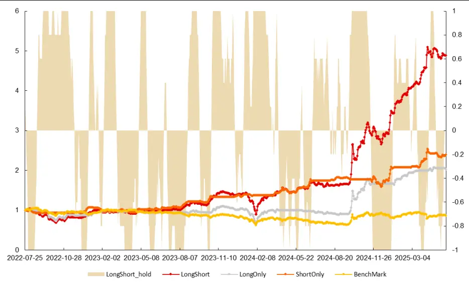

## 金融工程丨深度报告 [Table_Title]神经因子挖掘（五） 强化学习混频 Multi-Step DQN 择时策略

## 报告要点

[Table_Summary]我们设计 DQN 的核心是学习在给定市场状态下最优交易动作的潜在价值。将 DQN 应用于中证 1000指数日频择时，模型信号（做多/做空/空仓）显示出有效预测能力。构建的策略显著超越基准：多空策略年化收益高达 64.9%（经多步 DQN优化后提升至 79.4%），空头策略风险控制优异（最大回撤仅-14.33%，优化后夏普/卡玛比领先）。仓位变动连续合理，避免了高频无意义切换。多步优化 DQN 进一步提升了信号质量和各策略表现（收益与风控指标均改善），证明了其在量化择时领域的巨大潜力。

分析师及联系人

覃川桃

杨凯杰

SAC：S0490513030001

SFC：BUT353

# [Table_Title 神经因子挖掘（五）2] 强化学习混频 Multi-Step DQN 择时策略

## [Table_Summary2] 强化学习为量化投资带来新思路，解决传统模型痛点

传统的量化投资方法，尤其是预测股票收益率的模型，虽然有效但存在明显局限。它们往往只能间接优化最终的投资目标（如年化收益、风险控制），如通过预测收益率或排序来间接提升策略。而且，构建投资组合通常分好多步（找因子、合成因子、优化组合），步骤之间不够连贯，有时预测指标提升了，实际组合表现却没改善。此外，像资产择时（判断买卖时机）这种问题，可用的历史数据量相对选股少得多，传统模型很容易“死记硬背”历史（过拟合），学不到真正有用的规律。

强化学习（RL）提供了一种新范式。它直接让行为主体（智能体）在模拟的市场环境（环境）中学习交易策略（动作），目标就是最大化投资回报（奖励）。这种“边做边学”的方式，可以直接优化我们关心的最终收益和风险指标，并有可能将因子挖掘、信号生成和组合构建整合到一个连续的决策流程中，从而有效缓解传统方法的前两个主要痛点。

## 风险提示

## DQN 算法是构建择时策略的有效工具，其核心在于学习“最优动作价值”

1、深度学习模型训练过程中有随机性，可能导致预测结果有误差；

将 DQN 应用于中证 1000 指数的日频择时。模型输入融合了日频和分钟频数据，以捕捉更丰富的市场信息。实际测试结果较为有效。信号有效：模型发出的做多和做空信号，其预测的未来收益统计特征（如胜率、盈亏比）都显示出正向预测能力。策略表现优异：构建的多空策略（可做多做空）、纯多头策略和纯空头策略均显著跑赢了基准（一直持有）。其中，多空策略年化收益高达 64.9%（优化后达 79.4%），空头策略则展现出更优的风险控制能力（回撤小，夏普、卡玛比率高）。多步 DQN 效果更佳：采用考虑未来多步奖励的改进版 DQN（Multi-StepDQN）后，信号质量（做多做空更均衡，指标提升）和策略表现（各策略年化收益进一步提高，风险控制指标如夏普、卡玛比率也改善）都得到了显著优化。这印证了调整未来收益评估机制（减少单步评估偏差）的有效性。

## 相关研究

在众多强化学习算法中，深度 Q 网络（DQN）被证明较为适合像单一资产择时这样的任务。DQN 的核心思想是教会模型一个关键能力：评估在特定市场状况（状态）下，采取不同交易动作（如做多、做空、空仓）的“潜在未来总回报”（称为最优动作价值函数 Q*）。简单说，就是让模型学会判断：“在当前这种市场环境下，选择买、卖或平仓，哪个未来可能赚得最多？”

2、模型总结的市场规律是基于历史数据的，存在失效风险；

[Table_Report] •《风格轮动策略（四）：成长、价值轮动的基本面信号》2025-06-05

为了训练这个 DQN 模型，可以采用了几个关键技巧：1）目标网络：使用一个稍滞后更新的 Q网络来计算目标值，防止模型自我欺骗导致估值过高；2）ε-贪婪策略：让小部分时间随机尝试新动作，避免模型只走老路错过更好机会；3）经验回放：把过去的交易经验储存起来并打乱顺序反复学习，这样更高效且能打破数据的时间关联性。

3、日频交易策略回测结果仅供参考；

## Multi-Step DQN择时策略潜力巨大，多步优化提升效果

4、数据处理细节上的差异对策略有一定的影响。

- 《港股通交易解析与事件驱动策略》2025-05-20•《量化角度看可转债（九）：机构持仓及策略构建》2025-05-14

更多研报请访问长江研究小程序

## 强化学习与量化投资

在过去十年中，人工智能（AI），特别是强化学习（RL）的兴趣和发展显著增长。强化学习在游戏领域的进展值得注意，最近的算法在围棋、国际象棋和星际争霸中超过了人类水平的熟练度。这些进展促使人们在金融领域，特别是量化投资中探索强化学习的应用场景。尽管强化学习在高频交易上已经取得了部分成果，但复杂和动态的金融数据限制了其在其他量化方法上的拓展。这些挑战包括金融市场的不可预测性、高计算需求以及对改进模型可解释性的需求。

## 收益率预测模型存在的问题

在强化学习被引入金融的特定领域之前，传统机器学习和深度学习方法在基于因子模型的收益率预测问题上取得了较高的成效，时至今日也是量化选股策略、CTA 策略最有效的方法之一，并且随着因子数量不断增加，市场不断发生变化，该方向的研究仍有较大发展空间，目前也是各家公募量化以及私募量化获取超额收益最重要的环节之一。

但是该方法从实际结果和逻辑上可能存在一些问题。结合其他文献和前期报告的预测结果，我们发现不论以何种方法、特征和模型进行股票收益率预测，预测值与未来股票收益率的相关系数很难超过 20%，且预测值与真实值的均方误差也相比于其他领域的回归任务高很多，这在统计学的角度来讲，很难评价其为优秀的回归任务。这种“不够优秀”的预测虽然已经可以为投资者获取稳定客观的投资收益，但是很难不让人对这种预测产生质疑。以上担忧对股票涨跌分类任务也同样存在，预测准确率在 70%甚至 60%以下的分类模型在股票涨跌预测任务中是较为常见的优秀结果。

金融数据在无法满足高斯-马尔可夫定理基本假设的前提下，使用负 IC 作为损失函数与使用均方误差作为损失函数，模型的预测值表现相近且投资收益也相近这种现象，可能也说明目前的股票收益率预测是一种模糊的预测，而非精确的回归任务。

综上所述，我们认为传统神经网络在以下几个方面存在一定的隐患：

不够直接的优化指标：最直接的优化指标本应该是年化收益率、夏普比、最大回撤等策略指标，由于多因子模型和收益率预测模型的框架很难以上述指标进行优化，只能以优化每支股票的收益率或是收益率排序值预测能力来提升最终策略的表现。

两步生成投资组合不够连续：目前的流程一般分为因子挖掘到因子合成再到组合优化，虽然神经网络等机器学习模型已具备一定能力可以将因子挖掘与因子合成一步实现，但是仍然很难直接生成持仓权重，需要组合优化等方式同时考虑风险和收益后得到最终持仓权重。因此本身这个流程存在一定的间断性，导致研究过程中会发现即使最终预测值的 IC 或是多头超额等指标得到提升，在组合优化后构建的策略也不一定能有提升。

在样本量极少的的资产择时问题上难有成效：在股票截面收益率预测问题上，即使日频采样数据量也是千万级别，这对于我们常用的非大模型的神经网络而言是较为充分的。除了选股问题，量化择时问题上首先数据量就极大的限制了传统自监督学习的有效性。不同资产的择时方法或者规律可能存在较大差异，因此当我们研究择时问题时，基本不会考虑将其他不相关的资产数据也作为样本进行学习。因此择时问题所能使用的数据将远比选股少，数据量较少的情况下仍然采用传统的自监督学习，十分容易产生过拟合的现象。

以上三个问题在使用强化学习后至少可以有效缓解前两个问题，但是数据量不足以及金融数据信噪比较低等类似的问题，即使是使用强化学习也只能尝试去忍受，需要通过其他办法来尽量减少其影响。

## 强化学习的基础概念

首先我们要明确使用强化学习完成的是一件什么事情。回顾神经网络自监督学习预测股票收益率，用通俗的语言概括就是——通过某种训练方式，学习得到一种模型，该模型可以通过已知的股票特征对未来的股票标签进行预测。因此明确该范式之后，后续的优化将围绕训练方式、模型、特征和标签展开。

回到强化学习的概念中，Sutton1给出过一个很好的定义——“强化学习是学习做什么——如何将情境映射到动作——以便最大化一个数值奖励信号。”带入到金融领域，我们可以翻译为——“强化学习是学习在某种规则下交易某些资产——如何利用已知信息得到怎么交易——以便最优化策略目标。”

为了进一步详细介绍强化学习，我们还是需要介绍一些基础概念和名词，这些也是看懂相关论文以及后续做优化的基本。

## 智能体

强化学习的主体，根据当前状态做出行为的对象，比如在投资中，基金经理、交易员和做市商都可以是智能体，在量化投资中往往用模型作为智能体做出决策行为。

## 环境

与智能体交互的对象，可以抽象的理解为交互过程中的规则或机理。在投资中，市场交易规则就可以是环境，比如持有某种资产随着价格变化会产生盈亏、A 股的 T+1 股票交易规则以及交易产生的成本和滑点，以上都可以是构筑环境的依据。

## 行为 or 动作

智能体做出的决策，在投资中就是买什么卖什么，买多少卖多少。动作空间是指所有可能的行为的集合，如果我们判断某种资产涨或者跌，那行为空间就是买入或者卖出，也可以是更复杂的买 n 手与卖n手，n 的上限是能够交易的上限。

## 状态

对当前时刻环境的概括，是智能体做出行为的依据，也可以是智能体做出行为后会发生改变的对象。在投资中，状态可以是资产的历史价格、当前的持有仓位、历史的业绩表现以及当下的宏观政策等等，投资者做出交易的线索和依据。状态空间是指状态可能出现的所有情况，一般来说状态空间是无限的，但是在剪刀石头布这种简单游戏中，状态空间也可能是有限的。

## 奖励

智能体执行一个动作之后，环境返回给智能体的一个数值，作用是告诉智能体当前状态下做出某种行为的好坏，以此来优化迭代智能体。在投资中，可以定义策略的收益率为奖励，也可以定义夏普比、最大回撤等指标，但是有效与否需要设计合理的强化学习流程，并非设置好奖励即可最优化目标。

## 状态转移

智能体从当前 t 时刻的状态 s 转移到下一个时刻状态 $s^{\prime}$ 的过程。在投资中，假设我们本来没有任何的仓位，当下的现金仓位状态是 100%，因为本次全仓买入的动作，就会导致没有剩余现金，即下一时刻的现金仓位状态是 0%。状态转移可以是确定的也可以是随机的，这通常而言取决于环境和状态的定义。我们用状态转移概率函数来描述状态转移，记作

$$
\mathrm{p_{t}}(\mathsf{s}^{\prime}|\mathsf{s},\mathsf{a})=\mathrm{P}(\mathsf{S}_{\mathsf{t}+1}^{\prime}=\mathsf{s}^{\prime}|\mathsf{S}_{\mathsf{t}}=\mathsf{s},\mathsf{A}_{\mathsf{t}}=\mathsf{a})
$$

## 回报（折扣回报）

从当前时刻开始到本回合结束的所有奖励的总和，也称为累计奖励，通常来说会将未来的奖励乘以一个折扣率 γ 来降低未来奖励在当前时刻的重要性。在投资中，可以同比时间价值成本，相比于远期收益，投资人更倾向于获得即时收益，因为存在时间成本也可以说是机会成本。

$$
\mathrm{U_{t}}=\mathrm{R_{t}}+\gamma\mathrm{R_{t+1}}+\gamma^{2}R_{t+2}+\cdots=\sum_{i=0}^{T}\gamma^{i}R_{t+i}
$$

回报其实就是智能体需要最大化的函数，强化学习的目标就是寻找一个策略，使得回报$\mathrm{U_{t}}$ 最大化，这个策略称为最优策略。虽然每一时刻的奖励构成了回报，但是最优策略并不一定是最大化每一时刻的奖励，这就好比价值投资中在资产底部加仓承受短期可能的回撤，但赢得未来资产大涨时的高额收益。

图 1：强化学习应用于量化投资的流程图

资料来源：《The Evolution of Reinforcement Learning in Quantitative Finance: A Survey》Pippas N, Ludvig E, Turkay C. 2025，长江证券研究所

结合流程图更方便我们理解量化投资中可以如何定义强化学习的各个概念

1. 智能体模型接受当前的市场状态 $s_{\mathrm{t}}$ 做出行为 ${\sf a_{t}}$ ；

2. 根据当前的行为结合规则，我们可以给出当下的奖励 $\boldsymbol{\mathrm{r}}_{\mathrm{t}}$ 和下一个时刻的状态$s_{\mathrm{t}+1}$ ；

3. 根据上一步 $\boldsymbol{\mathrm{r}}_{\mathrm{t}}$ ，我们可以对模型参数进行迭代。

## 强化学习算法在量化中的应用

强化学习的基础知识、训练技巧以及先进算法等仍有很多值得学习，如果想更深入的学习强化学习，一篇报告是远远不够讲清楚的，市面上也已有很多教材资料，因此下文将直接以强化学习在量化中的应用为重点进行介绍。

《The Evolution of Reinforcement Learning in Quantitative Finance: A Survey》论文统计了 1996-2022 年学术界使用强化学习研究量化金融的文章，只有 27.5%的出版物早于 2016 年，这反映了近年来相关研究激增，而其中主要采用的方法有基于价值学习的DQN、Q学习、基于策略学习的递归强化学习、策略梯度算法以及演员-评论家（Actor-Critic）的 DDPG、PPO。

表 1：基于强化学习方法和算法的文献统计

| 方法 | 英文 | 算法 | 计数 |
| --- | --- | --- | --- |
| 基于价值 | Value-Based | DQN | 37 |
|  |  | Q-Learning | 36 |
|  |  | SARSA | 10 |
|  |  | 其他 | 6 |
| 基于策略 | Policy-Based | Policy-Gradient | 13 |
|  |  | REINFORCE | 5 |
|  |  | RRL | 31 |
|  |  | 其他 | 7 |
| 演员-评论家 | Actor-Critic | A2C | 4 |
|  |  | DPG | 6 |
|  |  | DDPG | 14 |
|  |  | PPO | 14 |
|  |  | TRPO | 2 |
|  |  | 其他 | 12 |

资料来源：《The Evolution of Reinforcement Learning in Quantitative Finance: A Survey》Pippas N, Ludvig E,Turkay C. 2025，长江证券研究所

虽然历史论文中已知有如此多的算法，但是我们很难将其同时复现，因为不同算法可能需要设计不同的智能体、环境、奖励函数等元素才能发挥其真实效果，如果像前期报告中收益率预测模型一样只设计一套框架套不同结构的神经网络，或许在强化学习上没有太多可比较的意义。因此本文采用使用最多的基于价值学习的 DQN，也是我们认为较为适合单一资产择时的算法，下文将详细介绍。

除此之外，例如 Actor-Critic的 DDPG 算法也是很好的选择，但是在本文同一框架下效果并不如意，这并不代表该算法不如 DQN，在其他领域的问题上 DDPG反而更有可能得到更好的表现，这也是上文强调的同一框架下不同算法不一定存在可比性，不同算法需要精心设计方能体现其优势。

## DQN 与 Q-learning

在介绍 Q 学习之前，我们需要明确两个常用的定义——动作价值函数和最优动作价值函数。

## 动作价值函数（action-value function）

在 t 时刻，假如我们知道基于指定策略 π 采取动作 $\mathsf{a}_{\mathrm{t}}$ 的未来回报 $\mathrm{U_{t}}$ 的值，那么我们即可做出在该策略下的最优动作。但问题是，未来回报 $\mathrm{U_{t}}$ 是一个随机变量，随机性来自于未来状态和动作，因此我们可以通过计算未来回报 $\mathrm{U_{t}}$ 的期望值来消除随机性，判断目前状态下采取某种动作的好坏。

$$
\mathrm{Q}_{\mathrm{{\pi}}}(\mathrm{s}_{\mathrm{t}},\mathrm{a}_{\mathrm{t}})=\mathrm{E}_{\mathrm{{S}_{t+1}},A_{t+1},\ldots,{S}_{n},A_{n}}(\mathrm{U}_{\mathrm{t}}|\mathrm{S}_{\mathrm{t}}=\mathrm{s}_{\mathrm{t}},\mathrm{A}_{\mathrm{t}}=\mathrm{a}_{\mathrm{t}})
$$

期望中 ${\sf S}_{\mathrm{t}}={\sf s}_{\mathrm{t}},{\sf A}_{\mathrm{t}}={\sf a}_{\mathrm{t}}$ 是条件，意思是已经观测到状态 $\mathsf{S}_{\mathrm{t}}$ 和动作 $\mathrm{A_{t}}$ 的值，条件期望的结果 $\cdot\sf{Q}_{\pi}(s_{\mathrm{t}},a_{\mathrm{t}})$ 被称为动作价值函数。

t 时刻的动作价值函数依赖于以下三个因素：

1. 当前状态，在择时策略中可以理解为当前市场环境的好坏，比如在一个比较好预测的市场环境下，未来收益率的期望值是越大的。

2. 当前动作，在择时策略中可以理解为不同的行为如开多、平仓、开空会影响策略未来的收益率。

3. 策略函数，在择时策略中可以理解为具体策略，例如在一个震荡市中，均线策略能获得的收益率较低，但是布林带策略能获得较高的收益率。

## 最优动作价值函数（optimal action-value function）

如何才能排除掉策略 π 的影响，只评价当前状态和动作的好坏呢？我们可以定义最优动作价值函数。

$$
\mathbb{Q}_{*}(s_{\mathrm{t}},\mathrm{a}_{\mathrm{t}})=\operatorname*{max}_{\pi}Q_{\pi}(s_{t},a_{t}),\mathrm{~}\forall s_{t}\epsilon S,a_{t}\epsilon A.
$$

意思就是任何情况下选择最好的策略函数，未来回报的期望值。因此最优动作价值函数$\mathtt{Q}_{*}(\mathtt{s}_{\mathrm{t}},\mathtt{a}_{\mathrm{t}})$ 只依赖于状态 $s_{\mathrm{t}}$ 和动作 ${\sf a_{t}}$ ，与策略 π 无关。

通俗来讲，最优动作价值函数就是正确答案，如果我们知道最优动作价值函数，就可以在任何状态下选择 Q值最高的动作，最大化未来回报。但实际情况是，我们不知道最优动作价值函数 $\mathtt{Q}_{*}(\mathtt{s}_{\mathrm{t}},\mathtt{a}_{\mathrm{t}})$ ，因此 Q 学习的目的就是学到最优动作价值函数 $\mathrm{\Delta Q_{*}}$ ，用 Q 表格来近似 $\boldsymbol{{0}}_{\ast}$ 。进一步思考，在很多任务中，Q函数十分复杂，所以我们可以用神经网络替代 Q 表格去近似 Q函数，这就是 DQN。

## DQN

TD 算法是最常用训练 DQN 的方法，回顾对回报 return 的定义：

$$
\mathrm{U_{t}}=\sum_{i=0}^{T}\gamma^{i}\cdot R_{t+i}=\mathrm{R_{t}}+\gamma\mathrm{R_{t+1}}+\gamma^{2}R_{t+2}+\cdots=R_{t}+\gamma\sum_{i=0}^{T}\gamma^{i}\cdot R_{t+1+i}=R_{t}+\gamma\cdot U_{t+1}.
$$

结合最优价值函数 $\cdot\mathrm{Q}_{\ast}(\mathrm{s}_{\mathrm{t}},\mathrm{a}_{\mathrm{t}})=\operatorname*{max}_{\pi}Q_{\pi}(\boldsymbol{s}_{t},\boldsymbol{a}_{t})=\operatorname*{max}_{\pi}\mathrm{E}(\mathrm{U}_{\mathrm{t}}|\mathrm{S}_{\mathrm{t}}=\mathrm{s}_{\mathrm{t}},\mathrm{A}_{\mathrm{t}}=\mathrm{a}_{\mathrm{t}})$ ，根据附录 A推导，可以得到最优贝尔曼方程（optimal Bellman equations）的一种形式。

定理.最优贝尔曼方程

$$
\mathsf{Q}_{*}(\mathsf{s}_{\mathrm{t}},\mathsf{a}_{\mathrm{t}})=\mathrm{E}_{\mathsf{S}_{\mathrm{t}+1}\sim p(\cdot|s_{t},a_{t})}[R_{t}+\gamma\cdot\operatorname*{max}_{A\in\mathcal{A}}Q_{*}(S_{t+1},A)|S_{t}=s_{t},A_{t}=a_{t}]
$$

通俗来理解，TD 算法的 DQN 就是让 Q 网络对 t 时刻的未来回报预测值 $\widehat{U_{t}}$ 和考虑折扣因子后的下一时刻的未来回报预测值 $\gamma U_{t+1}\dot{2}$ 差尽量接近真实奖励 $\mathtt{R_{t}}$ 。因此更新 Q 网络的 MSE 损失函数为：

$$
\cos=\frac{\sum\left(\widehat{U_{t}}-\gamma\widehat{U_{t+1}}-R_{t}\right)^{2}}{n}
$$

DQN 的训练过程

给定一个四元组 $(s_{t},a_{t},r_{t},s_{t+1})$ ，我们可以利用 Q网络计算出

t 时刻的预测值： $\widehat{q_{t}}=\mathbb{Q}(s_{\mathrm{t}},\mathsf{a}_{\mathrm{t}};\theta)$ ，θ是神经网络的待训练参数。

- TD 目标： $\widehat{y_{t}}={\mathrm{r}_{t}}+\gamma{\operatorname*{max}_{a\in\mathcal{A}}}{\operatorname{Q}^{-}}(s_{{\mathrm{t}+1}},\mathrm{a};\theta^{-})$ ，θ−是目标 Q网络的参数。

- TD 误差： $\delta_{\mathrm{t}}=\widehat{q_{t}}-\widehat{y_{t}}$

- MSE 损失函数： $\mathrm{loss}=\delta_{\mathrm{t}}^{2}=(\widehat{q_{t}}-\widehat{y_{t}})^{2}$

下面我们直接给出 DQN的训练流程：

1. 初始化最大容量为 N 的经验放回池 D

2. 随机初始化Q网络的参数θ，初始化目标Q−网络的参数 ${\bf\theta}^{-}={\bf\theta}$

遍历 $\mathbf{episode}=1$ 到 M 开始

遍历 t = 1 到 T 开始

i.以概率ε选择一个随机动作 $\mathbf{\Delta}\cdot\mathbf{a}_{t}$ ，或以概率 1-ε选择 $\mathbf{argmax}Q(s_{t},a)$ 为 $\mathbf{}\mathbf{a}_{t}$

$$
\mathbf{a_{t}}=\left\{\begin{array}{cc}{\mathbf{argmax}Q(s_{t},a),}&{\quad\mathcal{L}\mathcal{L}\mathbf{\mathcal{H}}\mathbf{\mathcal{Z}}\mathbf{\dot{\mathcal{E}}}\mathbf{1}-\boldsymbol{\varepsilon}}\\{a}&{\quad}\\{\qquad\mathcal{B}\mathbf{\dot{Z}}\mathbf{\dot{\mathcal{D}}}\mathbf{\dot{Z}}\mathbf{\dot{\mathcal{D}}}\mathbf{\mathcal{H}}\mathbf{\mathcal{F}},}&{\quad\mathcal{L}\mathcal{L}\mathbf{\dot{\mathcal{H}}}\mathbf{\mathcal{Z}}\mathbf{\dot{\mathcal{E}}}\mathbf{\mathcal{E}}}\end{array}\right.
$$

ii. 执行动作 $\scriptstyle:\mathbf{a}_{t}$ ，观测奖励 $\mathbf{\boldsymbol{r}}_{t}$ ，得到下一时刻状态 $\pmb{s}_{t+1}$

iii.将四元组 $(s_{t},a_{t},r_{t},s_{t+1})$ 存入经验放回池 D

iv. 在 经 验 放 回 池 D 中 随 机 采 样 一 批 数 据 $(s_{i},a_{i},r_{i},s_{i+1}),i=$ 1, 2, … batchsize

v. 计算 $\widehat{l_{t}}=\mathbf{Q}(s_{\mathrm{t}},\mathbf{a}_{\mathrm{t}};\mathbf{\theta})\overrightarrow{\ast}\Vert\widehat{y_{t}}=\mathbf{r}_{\mathrm{t}}+\gamma\underset{a\epsilon\mathcal{A}}{\operatorname*{max}}\mathbf{Q}^{-}(s_{\mathrm{t}+1},\mathbf{a};\mathbf{\theta}^{-})$

$\mathsf{\pmb{v}}\mathsf{\pmb{i}}.$ 计算对网络 Q进行反向传播的损失函数 $\delta_{\mathrm{t}}^{2}=(\widehat{\pmb q_{t}}-\widehat{\pmb y_{t}})^{2}$ ，更新θ

vii.θ每更新 C次，更新目标Q−网络参数 $\mathbf{\partial}\cdot\mathbf{\partial}\mathbf{\partial}\mathbf{\partial}\mathbf{\partial}\mathbf{\partial}\mathbf{\partial}\mathbf{\partial}\mathbf{\partial}\mathbf{\partial}\mathbf{\partial}\mathbf{\partial}\mathbf{\partial}\mathbf{\partial}\mathbf{\partial}\mathbf{\partial}\mathbf{\partial}\mathbf{\partial}\mathbf{\partial}\mathbf{\partial}\mathbf{\partial}\mathbf{\partial}\mathbf{\partial}\mathbf{\partial}\mathbf{\partial}\mathbf{\partial}\mathbf{\partial}\mathbf{\partial}\mathbf{\partial}\mathbf{\partial}\mathbf{\partial}\mathbf{\partial}\mathbf{\partial}\mathbf{\partial}\mathbf{\partial}\mathbf{\partial}\mathbf{\partial}\mathbf{\partial}\mathbf{\partial}\mathbf{\partial}\mathbf{\partial}\mathbf{\partial}\mathbf{\partial}\mathbf{\partial\partial}\mathbf{\partial}\mathbf{\partial\partial}\mathbf{\partial\partial}\mathbf{\partial\partial}\mathbf{\partial\partial}\mathbf{\partial\partial}\mathbf{\partial\partial}\mathbf{\partial\partial}\mathbf{\partial\partial}$

结束循环

## DQN 算法的优化技巧

## 目标网络（target network）

DQN 学习算法容易出现高估 Q 值的缺陷，这主要来源于自举导致偏差的传播进而使得最大化导致高估。自举的意思是“用一个估算去更新同类的估算”，因此使用目标网络的目的就是切断“自举”避免偏差的传播，从而缓解 DQN 的高估。具体来说，就是每一轮互动时，产生动作的是每轮在反向传播的 Q 网络，计算 TD 目标的是另一个目标网络，目标网络与产生动作的网络结构和超参数均相同，但具体参数不同。经过一定轮数的学习，我们才会将前者的参数更新目标网络的参数，在上一次更新与这一次更新期间，训练不存在自举。但是从完整的训练过程而言，目标网络的估算仍然用于更新自己，因此本方法是起到缓解作用，无法杜绝自举产生的高估 Q值问题。

## ε-greedy

此方法是用于提升模型的探索能力，避免模型陷入局部最优。具体来说，我们在生成动作时，以提前设置好的概率 ε 采取随机动作，以 1−ε 的概率采取 Q网络预测的最优动作。在量化领域，可以理解为以一定的概率尝试新策略，而非始终坚持当前最佳交易策略。

## 经验回放

经验回放（experience replay）是强化学习中一个重要的技巧，可以大幅提升强化学习的表现。经验回放的意思是把智能体与环境交互的记录（即经验）储存到一个数组里，事后反复利用这些经验训练智能体。这个数组被称为经验回放数组（replay buffer）。

具体来说，把智能体的轨迹划分成 $(s_{t},a_{t},r_{t},s_{t+1}$ )这样的四元组，存入一个数组。需要人为指定数组的大小（记作 N）。数组中只保留最近 N 条数据；当数组存满之后，删除掉最旧的数据。数组的大小 N 是可以调的超参数，会影响训练的结果。N 如果过大会使得模型在训练时用到很久以前的数据影响梯度下降的准确性，N 如果过小会使得模型在训练时容易对近期数据过拟合。

## 经验回放的优势在于：

打破序列的相关性。打乱数据对于深度学习训练往往有较大帮助，这一点在前期报告中训练因子挖掘的神经网络时可得到验证。但是强化学习的智能体与环境互动时必须按照时间顺序进行遍历，这主要是因为强化学习的基本假设是马尔科夫过程。因此经验回放能够帮助我们将遍历顺序和训练顺序分开进行。

重复利用收集到的经验，而不是用一次就丢弃。这样可以用更少的样本数量达到同样的表现。

## 日频择时策略

前文我们介绍了强化学习与 DQN 算法，下面我们重点介绍如何使用 DQN 构建日频择时策略。首先设计强化学习的关键在于如何定义强化学习的五个要素：环境、智能体、状态、动作和奖励。下面简要给出我们尝试的定义：

- 环境：A 股资产日频择时策略，将总资金分成 5 份，每日根据前一天预测回报最高的动作以开盘价进行交易，既可以做多也可以做空，当日开仓持有 5 日后平仓，交易考虑单边万分之五的交易成本。

- 状态：过去 30 日的日频价量数据、过去 1 日的分钟频价量数据和目前持有仓位。

智能体：以为当前状态为输入数据，使用神经网络给出每个动作的预测值。

- 动作：做多、空仓和做空三种选择。

- 奖励：结合当日交易成本的未来 5 日收益率

$$
\mathrm{~r_{t}=}\left\{\begin{array}{c}{{a_{t}\cdot return_{5}-\left|a_{t}\right|\cdot cost,a\epsilon[-1,0,1],t<5}}\\{{a_{t}\cdot return_{5}-\left|a_{t}-a_{t-5}\right|\cdot cost,a\epsilon[-1,0,1],t\geq5}}\end{array}\right.
$$

## 网络结构

网络结构方面，我们对日频数据和分钟频数据分别采用两个结构相同但不共享参数的GRU 为第一层提取时序信息，然后与持仓向量在特征维度进行合并，再经过后续两个线性层、ReLU激活函数和随机丢弃层的组合，最终由一个线性层给出不同动作的价值。

图 2：混频Q 网络结构图

资料来源：长江证券研究所

我们认为网络模型是可以优化的一个环节，但不是决定有效与否的一个环节，因此选了业界较为熟悉的结构和处理方式，如果在其他任务上有较为熟悉且更有效的网络，可自行设计替换，可能会有进一步的提升。

## 数据处理与特征工程

除了原始的收盘价、开盘价、最高价、最低价、成交量和成交金额，我们还在日频和分钟频上同时构造了额外 21 个技术指标作为特征，因此 Q网络的输入数据最终一共是 54个特征。数据处理方面，由于择时问题与截面选股逻辑有本质的区别，因此我们只采用时序 Zscore 标准化。

## 中证1000择时实践

下面我们以中证 1000 指数为标的进行研究，考虑到中证 1000 股指期货正式挂牌交易时间为 2022 年 7月 22 日，且中证 1000 指数的发布日期为 2014 年10 月17 日。因此我们测试集初始日期设置为 2022 年7 月 22 日，截至日期为2025年 5 月23 日，采用每年滚动训练的方式更新模型，首年的训练集和验证集时间为 2014 年 10 月 17 日——2021年 11 月30 日，之后样本内数据依次增加一年。

在尝试的过程中，我们发现模型存在多次训练结果差异较大的现象，因此我们采用多次训练取均值的方法缓解该问题，实践下来 10 次实验取平均的效果已经较为稳定，保险起见我们采用 50 次实验取平均。

表 2：DQN 实验参数设置

| 参数类型 | 参数项 | 具体参数 |
| --- | --- | --- |
| 实验对象 | 标的 | 中证 1000 |
|  | 滚动训练集和验证集 | 2014年10月17日—T-1年11月30日 4:1 进行切割 |
|  | 滚动测试集 | T年 初始日期：2022年7月22日 |
| DQN 超参数 | 学习率 | 1e-4 |
|  | 折扣因子 | 0.5 |
|  | ε | 初始值：1 衰减比例：0.9999 |
|  | 经验回放上限 | 2048 |
|  | BatchSize | 128 |
|  | 目标网络更新步数 | 512 GRU_hiddensize:64 |
|  | 网络参数 | Linear_hiddensize:64 Dropout:0.2 |
|  | 最大轮数 | Output_dim:3 |
| 其他 |  | 30 |
|  | 早停轮数 实验次数 | 5 50 |

资料来源：天软科技，长江证券研究所

## 测试集结果

首先我们按照每日信号值与未来 5 日收益率统计 DQN 预测未来 5 日收益率的表现。从胜率的角度看，做空信号胜率较高，做多信号在触发次数比例超过一半的情况下，收益率大于零的概率达到 55.18%，空仓信号也有一定的做空价值。从盈亏比的角度看，做多信号高于做空信号。再从未来 5 日收益率均值来看，做空信号略优于做多信号，但二者均能提供不俗的绝对收益率。

表 3：中证 1000——DQN信号指标

| 信号 | 收益率均值 | 收益率中位数 | 触发次数 胜率 |  | 盈亏比 |
| --- | --- | --- | --- | --- | --- |
| 做空 | -0.22% | -0.20% | 211 | 67.30% | 1.21 |
| 空仓 | -0.10% | -0.08% | 119 | 42.02% | 0.90 |
| 做多 | 0.15% | 0.09% | 357 | 55.18% | 1.29 |

资料来源：天软科技，长江证券研究所

我们根据信号分别构建了三个择时策略：

- LongShort 即可做多也可做空

- LongOnly 只允许做多

- ShortOnly 只允许做空

从净值结果上来看，多空策略效果亮眼，且收益率来源不会明显失衡，多空收益均有助力。而多头策略在 2024 年中旬之前仅能说跑过了一直持有的基准，在此之后大幅上涨。空头策略虽然触发次数较少，但是由于信号胜率较高因此净值较为稳定，呈现阶梯式上升。

再从多空策略的仓位变化来看，信号还是具有一定的连续性，这可能与标的行情存在动量趋势效应有关，也可能与模型奖励函数中设置了交易成本惩罚项有关。

图 3：中证 1000——DQN择时策略净值与仓位

资料来源：天软科技，长江证券研究所

观察三类策略净值指标，三类策略收益方面不俗，但是从稳定性的角度来看，还是空头策略较为亮眼。虽然多空策略年化收益率高达 64.90%，但是最大回撤远高于空头策略，夏普比率和卡玛比率，空头策略都更加优秀。模型犯错主要集中于 2023 年末到 2024 年初这段时间持续给出做多信号。

表 4：中证 1000——DQN择时策略指标

| 指标 | 多空策略 | 多头策略 空头策略 |
| --- | --- | --- |
| 累计收益率 | 290.24% | 75.68% 120.43% |
| 年化收益率 | 64.90% | 23.00% 33.69% |
| 最大回撤 | -47.57% | -46.95% -14.33% |
| 夏普比率(未年化) | 0.11 | 0.05 0.13 |
| 卡玛比率 | 1.36 | 0.49 2.35 |

资料来源：天软科技，长江证券研究所

## 优化：Multi-Step DQN

多步 DQN 是在 DQN 的基础上进行扩展，用多步奖励函数构造多步 TD 目标替代原始的 TD 目标。我们先介绍多步 TD 目标的公式。

已知 t 时刻的未来回报公式如下：

$$
\mathrm{U_{t}}=\sum_{i=0}^{T}\gamma^{i}\cdot R_{t+i}=\mathrm{R_{t}}+\gamma\mathrm{R_{t+1}}+\gamma^{2}R_{t+2}+\cdots=R_{t}+\gamma\sum_{i=0}^{T}\gamma^{i}\cdot R_{t+1+i}=R_{t}+\gamma\cdot U_{t+1}.
$$

对 $\cdot\gamma\cdot U_{t+1}$ 连续展开多次即可发现：

$$
\mathrm{U_{t}}=R_{t}+\gamma\cdot U_{t+1}=\left(\sum_{i=0}^{m-1}\gamma\cdot R_{t+i}\right)+\gamma^{m}\cdot U_{t+m}
$$

假设我们采用 n 步 TD 目标的 DQN，，给定一个四元组 $(s_{t},a_{t},r_{t},s_{t+1})$ ，我们可以利用 Q网络计算出下一个四元组 $(s_{t+1},a_{t+1},r_{t+1},s_{t+2})$ ，依次类推到未来 n 个四元组，构成一个包含 n 步的轨迹： $(s_{t},a_{t},r_{t},s_{t+1},a_{t+1},r_{t+1},\dots,s_{t+n},a_{t+n},r_{t+n})$

t 时刻的预测值： $\widehat{q_{t}}=\mathbb{Q}(s_{\mathrm{t}},\mathsf{a}_{\mathrm{t}};\theta)$ ，θ是神经网络的待训练参数;

- TD 目标： $\begin{array}{r}{\widehat{y_{t}}=\sum_{i=0}^{m-1}\gamma\cdot r_{t+i}+\gamma^{m}\underset{a\epsilon,\mathscr{A}}{\operatorname*{max}}Q^{-}(s_{{\mathrm{t}}+1},\mathsf{a};\theta^{-})}\end{array}$ ，θ−是目标 Q网络的参数；

- TD 误差： $\delta_{\mathrm{t}}=\widehat{q}_{t}-\widehat{y_{t}};$

- MSE 损失函数： $\mathrm{loss}=\delta_{\mathrm{t}}^{2}=(\widehat{q_{t}}-\widehat{y_{t}})^{2}$

多步 TD 目标的意义在于，减少 DQN 自举产生的高估问题。我们在前文中提过自举会使得 Q网络产生系统性偏差，可以理解为 TD 目标本身是一个有偏估计，但是优势在于不用每次互动都将任务遍历至结束。与其完全相反的方法是蒙特卡洛，训练 Q 网络的是偶，我们可以将每次互动都进行到底再统计奖励和总回报，以此替代 TD 目标，理论上来说该方法得到的回报是 Q网络需要预测的无偏估计值，但是缺点是速度慢，且由于蒙特卡洛是模拟产生轨迹，因此随机性较大。

表 5：蒙特卡洛和自举的对比

| 维度 | 蒙特卡洛 自举 |
| --- | --- |
| 偏差 无偏估计 | 有偏估计 |
| 方差 | 方差大 方差小 |
| 速度 慢 | 快 |

资料来源：长江证券研究所

多步 TD 目标介于单步 TD 目标和蒙特卡洛之间，因此通常来说，选择一个合理的步数往往可以得到比前两者更好的效果。

我们采用 3 步 TD 目标，在折扣因子为 0.5 的条件下，3 步 TD 目标中有偏估计的折扣系数为 0.125，偏差减小至原来的 1/4。实验设计方面除了 TD 目标，其他与前文保持一致，我们直接观察结果。

首先做多信号和做空信号的比例更加均衡，且做多和做空信号的收益率均值、胜率和盈亏比都有一定的提升，优化效果较为显著。

表 6：中证 1000——Multi-Step DQN 信号指标

| 信号 | 收益率均值 收益率中位数 |  | 触发次数 | 胜率 | 盈亏比 |
| --- | --- | --- | --- | --- | --- |
| 做空 | -0.22% | -0.22% | 259 | 67.18% | 1.24 |
| 空仓 | -0.11% | -0.12% | 139 | 43.88% | 0.80 |
| 做多 | 0.23% | 0.15% | 288 | 59.03% | 1.35 |

资料来源：天软科技，长江证券研究所

再从净值来看 2024 年中旬之前的表现有一定的提升，虽然绝大部分收益仍然是在此之后获得的。仓位变化仍然有较强的连续性，不存在高频的多空切换。

图 4：中证 1000——Multi-Step DQN 择时策略净值与仓位

资料来源：天软科技，长江证券研究所

多头策略的优化较为明显，空头策略略有提升，多空策略的夏普比率提升至 0.13 与空头策略持平，但是卡玛比率方面空头策略仍然更优。

表 7：中证 1000——Multi-Step DQN 择时策略指标

| 指标 | 多空策略 | 多头策略 | 空头策略 |
| --- | --- | --- | --- |
| 累计收益率 | 390.05% | 103.37% | 139.38% |
| 年化收益率 | 79.44% | 29.84% | 37.87% |
| 最大回撤 | -39.27% | -41.46% | -14.02% |
| 夏普比率（未年化） | 0.13 | 0.07 | 0.13 |
| 卡玛比率 | 2.02 | 0.72 | 2.70 |

资料来源：天软科技，长江证券研究所

总结而言，Multi-Step DQN 在信号指标和择时策略方面均有一定的优化。

## 强化学习的不足

即使前文回测结果可观，但是我们也要认识到强化学习可能存在的风险，不能完全依赖模型的预测值进行交易。

稳定性不足：在尝试的过程中，我们发现改变随机种子的多次训练，结果有不小的差异，因此最终采用了训练 50 次取平均的方式，缓解了训练结果的不稳定性。但是这说明算法本身是不够稳定的，因此我们只能选择靠“多次取平均”的思路降低方法本身的方差，使最终结果接近期望值。

超参数较为敏感：强化学习大部分算法都有较多的超参数，例如本文表 2 中就有很多超参数可以设置。在前期选股网络报告中，超参数更多是优化作用，比如选择一个更好的学习率可以将效果提升 10%。但是在本文强化学习模型的尝试过程中，我们发现将折扣因子从 0.5 改变至 0.9，效果就可能从有效变成失效。这其中说明我们应该给予即时奖励更高的权重，但也说明模型训练对超参数有较为敏感。

样本内过拟合：强化学习不同与自监督学习，它通过智能体不断试错的方式迭代学习，因此更加容易对样本内的数据有过度学习，得到的策略也在样本内回测收益率远高与样本外回测收益率。因此需要想更多严谨的风控方法缓解样本内过拟合。

模型黑箱性：这个问题属于神经网络的通病，即使模型的输入数据是我们可以设计的有逻辑的特征，但是只要经过神经网络的学习，预测值几乎没有可解释性。而在实际投资过程中黑箱的模型一旦失效，就几乎没有任何价值可言，因为无法对其行为进行归因。

## 总结

传统的量化投资方法，尤其是预测股票收益率的模型，虽然有效但存在明显局限。它们往往只能间接优化最终的投资目标（如年化收益、风险控制），如通过预测收益率或排序来间接提升策略。而且，构建投资组合通常分好多步（找因子、合成因子、优化组合），步骤之间不够连贯，有时预测指标提升了，实际组合表现却没改善。此外，像资产择时（判断买卖时机）这种问题，可用的历史数据量相对选股少得多，传统模型很容易“死记硬背”历史（过拟合），学不到真正有用的规律。

强化学习（RL）提供了一种新范式。它直接让模型（智能体）在模拟的市场环境（环境）中学习交易策略（动作），目标就是最大化投资回报（奖励）。这种“边做边学”的方式，可以直接优化我们关心的最终收益和风险指标，并有可能将因子挖掘、信号生成和组合构建整合到一个连续的决策流程中，从而有效缓解传统方法的前两个主要痛点。

在众多强化学习算法中，深度 Q 网络（DQN）被证明较为适合像单一资产择时这样的任务。DQN 的核心思想是教会模型一个关键能力：评估在特定市场状况（状态）下，采取不同交易动作（如做多、做空、空仓）的“潜在未来总回报”（称为最优动作价值函数Q*）。简单说，就是让模型学会判断：“在当前这种市场环境下，选择买、卖或平仓，哪个未来可能赚得最多？

为了训练这个 DQN 模型，可以采用了几个关键技巧：1）目标网络：使用一个稍滞后更新的 Q 网络来计算目标值，防止模型自我欺骗导致估值过高；2）ε-贪婪策略：让小部分时间随机尝试新动作，避免模型只走老路错过更好机会；3）经验回放：把过去的交易经验储存起来并打乱顺序反复学习，这样更高效且能打破数据的时间关联性。

将 DQN 应用于中证 1000 指数的日频择时。我们设计了强化学习的五大要素：环境（模拟交易规则、成本）、智能体（DQN 模型）、状态（过去价格、技术指标、仓位等）、动作（做多/做空/空仓）、奖励（考虑交易成本的未来收益）。模型输入融合了日频和分钟频数据，以捕捉更丰富的市场信息。

实际测试结果较为有效。信号有效：模型发出的做多和做空信号，其预测的未来收益统计特征（如胜率、盈亏比）都显示出正向预测能力。策略表现优异：构建的多空策略（可做多做空）、纯多头策略和纯空头策略均显著跑赢了基准（一直持有）。其中，多空策略年化收益高达 64.9%（优化后达 79.4%），空头策略则展现出更优的风险控制能力（回撤小，夏普、卡玛比率高）。仓位连续合理：模型给出的仓位变动比较连续，没有出现频繁无意义的买卖切换，这得益于模型设计（如交易成本惩罚）和标的本身可能存在的趋势效应。

采用考虑未来多步奖励的改进版 DQN（Multi-Step DQN）后，信号质量（做多做空更均衡，指标提升）和策略表现（各策略年化收益进一步提高，风险控制指标如夏普、卡玛比率也改善）都得到了显著优化。这印证了调整未来收益评估机制（减少单步评估偏差）的有效性。

最后我们需要认识到强化学习模型目前存在的不足，主要概括为四个方面：稳定性不足、超参数敏感、样本内过拟合和模型的黑箱性。因此在实际投资中，不可完全依赖模型的预测值进行交易。

## 附录

定理 A.1. 贝尔曼方程

假设 $\mathbf{R_{t}}$ 是 $\pmb{S}_{\mathbf{t}},\mathbf{A}_{\mathbf{t}},\pmb{S}_{\mathbf{t+1}}$ 的函数。那么

$$
Q_{\pi}(s_{t},a_{t})=E_{S_{t+1},A_{t+1}}[R_{t}+\gamma\cdot Q_{\pi}(S_{t+1},A_{t+1})|S_{t}=s_{t},A_{t}=a_{t}]
$$

证明：根据回报的定义 $\begin{array}{r}{\mathrm{U}_{\mathrm{t}}=\sum_{k=t}^{n}\gamma^{k-t}\cdot R_{k}}\end{array}$ ，不难验证这个等式：

$$
U_{t}=R_{t}+\gamma\cdot U_{t+1}
$$

用符号 $\mathcal{S}_{\mathrm{t}+1:}=\{S_{t+1},S_{t+2},\ldots\}$ }和 $\mathcal{A}_{\mathrm{t}+1:}=\{A_{t+1},A_{t+2},..$ }表示从 t+1 时刻起所有的状态和动作随机变量。根据动作价值函数 $\boldsymbol{\mathrm{Q}}_{\pi}$ 的定义，

$$
Q_{\pi}(s_{t},a_{t})=E_{\mathcal{S}_{t+1},\mathcal{A}_{t+1};}[U_{t}|S_{t}=s_{t},A_{t}=a_{t}]
$$

把 $U_{t}$ 替换成 $\mathrm{R}_{\mathrm{t}}+\gamma\cdot\mathrm{U}_{\mathrm{t}+1}$ ，那么

$$
Q_{\pi}(s_{t},a_{t})=E_{\mathcal{S}_{t+1},\mathcal{A}_{t+1}}[U_{t}|S_{t}=s_{t},A_{t}=a_{t}]
$$

$$
=E_{\delta_{t+1},\circ}\mathcal{A}_{t+1}.[R_{t}|S_{t}=s_{t},A_{t}=a_{t}]+\gamma\cdot E_{\delta_{t+1},\circ}\mathcal{A}_{t+1}.[U_{t+1}|S_{t}=s_{t},A_{t}=a_{t}]\tag{A.1}
$$

假设 $\mathrm{R}_{\mathrm{t}}$ 是 $\mathrm{S}_{\mathrm{t}},\mathrm{A}_{\mathrm{t}},\mathrm{S}_{\mathrm{t}+1}$ 的函数。那么，给定 $s_{t}$ 和 $\vert a_{t}$ ，则 $\mathrm{R}_{\mathrm{t}}$ 随机性唯一的来源就是 $S_{\mathrm{t}+1}$ ，所以 ES ,A [Rt|St = st, At = at] = ES [Rt|St = st, At = at] （A.2）

等式（A.1）右边 $U_{t+1}$ 的期望可以写成

$$
E_{\mathcal{S}_{t+1;},\mathcal{A}_{t+1;}}[U_{t+1}|S_{t}=s_{t},A_{t}=a_{t}]=
$$

$$
\begin{array}{r}{E_{S_{t+1},A_{t+1};}\big[E_{\mathcal{S}_{t+2},\mathcal{A}_{t+2};}[U_{t+1}|S_{t+1},A_{t+1}]\big|S_{t}=s_{t},A_{t}=a_{t}\big]=}\end{array}
$$

$$
E_{S_{t+1:},A_{t+1:}}[Q_{\pi}(S_{t+1},A_{t+1})|S_{t}=s_{t},A_{t}=a_{t}]\tag{A.3}
$$

由公式（A.1）、（A.2）、（A.3）可得定理。

定理 A.2. 最优贝尔曼方程

假设 $\mathbf{R_{t}}$ 是 $\mathbf{S_{t}},\mathbf{A_{t}},\mathbf{S_{t+1}}$ 的函数。那么

$$
Q_{*}(s_{t},a_{t})=E_{S_{t+1}\sim p(\cdot\vert s_{t},a_{t})}\left[R_{t}+\gamma\cdot\underset{A\epsilon\mathcal{A}}{max}Q_{*}(S_{t+1},A)\left.S_{t}=s_{t},A_{t}=a_{t}\right.\right.
$$

证明：设最优策略函数为 $\pi^{*}=argmax_{\pi}Q_{\pi}(s,a)$ , ∀ $s\epsilon\mathcal{S},a\epsilon\mathcal{A}$ 。由贝尔曼方程可得：

$$
Q_{\pi*}(s_{t},a_{t})=E_{S_{t+1},A_{t+1}}[R_{t}+\gamma\cdot Q_{\pi*}(S_{t+1},A_{t+1})|S_{t}=s_{t},A_{t}=a_{t}]
$$

根据定义，最优动作价值函数是

$$
Q_{*}(s,a)\triangleq\mathop{max}_{\pi}Q_{\pi}(s,a),\mathrm{~}\forall s\epsilon\mathcal{S},a\epsilon\mathcal{A}
$$

所以 $Q_{\pi*}(s_{t},a_{t}.$ )就是Q∗(s, a)。于是

$$
Q_{*}(s_{t},a_{t})=E_{S_{t+1},A_{t+1}}[R_{t}+\gamma\cdot Q_{*}(S_{t+1},A_{t+1})|S_{t}=s_{t},A_{t}=a_{t}]
$$

因为动作 $A_{t+1}=argmax_{A}Q_{*}(S_{t+1},A)$ 是状态 $S_{t+1}$ 的确定性函数，所以

$$
Q_{*}(s_{t},a_{t})=E_{S_{t+1}}\left[R_{t}+\gamma\cdot\smash{max}Q_{*}(S_{t+1},A)\mathinner{|{S_{t}=s_{t},A_{t}=a_{t}}\right]}
$$

——《深度强化学习》王树森 黎彧君 张志华著

## 参考文献

本文所有公式推导和算法描述均参考以下论文

《深度强化学习》王树森 黎彧君 张志华著，2022

2. Pippas N, Ludvig E, Turkay C. The Evolution of Reinforcement Learning in Quantitative Finance: A Survey[J]. ACM Computing Surveys, 2025.

3. Alameer A, Saleh H, Alshehri K. Reinforcement learning in quantitative trading: A survey[J]. Authorea Preprints, 2022.

4. van Seijen H. Effective multi-step temporal-difference learning for non-linear function approximation[J]. arXiv preprint arXiv:1608.05151, 2016.

## 风险提示

1、深度学习模型训练过程中有随机性，可能导致预测结果有误差。神经网络在训练的过程中有一定的随机性，随机性包括训练数据集的划分和网络结构中的随机丢弃等，以上情况均可能导致预测结果会有波动和误差风险。

2、模型总结的市场规律是基于历史数据的，存在失效风险。市场量价规律可能随时间变化而变化，模型总结的规律是基于历史数据且是固定的，存在失效风险。

3、日频交易策略回测结果仅供参考，需要考虑实际交易存在的滑点等风险。

4、数据处理细节上的差异对策略有一定的影响，例如缺失值和行情数据复权方式的差异，可能导致最终因子值和策略产生一定的误差。

## 投资评级说明

| 行业评级 |  | 报告发布日后的12个月内行业股票指数的涨跌幅相对同期相关证券市场代表性指数的涨跌幅为基准，投资建议的评 |  |
| --- | --- | --- | --- |
|  |  | 级标准为： |  |
|  | 看 好： |  | 相对表现优于同期相关证券市场代表性指数 |
|  | 中 | 性： | 相对表现与同期相关证券市场代表性指数持平 |
| 公司评级 | 看 | 淡： | 相对表现弱于同期相关证券市场代表性指数 |
|  |  |  | 报告发布日后的12个月内公司的涨跌幅相对同期相关证券市场代表性指数的涨跌幅为基准，投资建议的评级标准为： |
|  | 买 增 | 入： 持： | 相对同期相关证券市场代表性指数涨幅大于10% 相对同期相关证券市场代表性指数涨幅在5%～10%之间 |
|  | 中 | 性： | 相对同期相关证券市场代表性指数涨幅在-5%～5%之间 |
|  | 减 | 持： |  |
|  |  |  | 相对同期相关证券市场代表性指数涨幅小于-5% 无投资评级：由于我们无法获取必要的资料，或者公司面临无法预见结果的重大不确定性事件，或者其他原因，致使 |
| 相关证券市场代表性指数说明：A股市场以沪深300指数为基准；新三板市场以三板成指（针对协议转让标的）或三板做市指数 (针对做市转让标的）为基准；香港市场以恒生指数为基准。 |  | 我们无法给出明确的投资评级。 |  |

## 办公地址

[Tabl上海
Add /虹口区新建路 200 号国华金融中心 B 栋 22、23 层
P.C /（200080）
北京
Add /朝阳区景辉街 16 号院1号楼泰康集团大厦 23 层
P.C /（100020）
武汉
Add /武汉市江汉区淮海路 88号长江证券大厦 37 楼
P.C /（430023）
深圳
Add /深圳市福田区中心四路1号嘉里建设广场 3 期 36 楼
P.C /（518048）

## 分析师声明

本报告署名分析师以勤勉的职业态度，独立、客观地出具本报告。分析逻辑基于作者的职业理解，本报告清晰准确地反映了作者的研究观点。作者所得报酬的任何部分不曾与，不与，也不将与本报告中的具体推荐意见或观点而有直接或间接联系，特此声明。

## 法律主体声明

本报告由长江证券股份有限公司及/或其附属机构（以下简称「长江证券」或「本公司」）制作，由长江证券股份有限公司在中华人民共和国大陆地区发行。长江证券股份有限公司具有中国证监会许可的投资咨询业务资格，经营证券业务许可证编号为：10060000。本报告署名分析师所持中国证券业协会授予的证券投资咨询执业资格书编号已披露在报告首页的作者姓名旁。

在遵守适用的法律法规情况下，本报告亦可能由长江证券经纪（香港）有限公司在香港地区发行。长江证券经纪（香港）有限公司具有香港证券及期货事务监察委员会核准的“就证券提供意见”业务资格（第四类牌照的受监管活动），中央编号为：AXY608。本报告作者所持香港证监会牌照的中央编号已披露在报告首页的作者姓名旁。

## 其他声明

本报告并非针对或意图发送、发布给在当地法律或监管规则下不允许该报告发送、发布的人员。本公司不会因接收人收到本报告而视其为客户。本报告的信息均来源于公开资料，本公司对这些信息的准确性和完整性不作任何保证，也不保证所包含信息和建议不发生任何变更。本报告内容的全部或部分均不构成投资建议。本报告所包含的观点、建议并未考虑报告接收人在财务状况、投资目的、风险偏好等方面的具体情况，报告接收者应当独立评估本报告所含信息，基于自身投资目标、需求、市场机会、风险及其他因素自主做出决策并自行承担投资风险。本公司已力求报告内容的客观、公正，但文中的观点、结论和建议仅供参考，不包含作者对证券价格涨跌或市场走势的确定性判断。报告中的信息或意见并不构成所述证券的买卖出价或征价，投资者据此做出的任何投资决策与本公司和作者无关。本研究报告并不构成本公司对购入、购买或认购证券的邀请或要约。本公司有可能会与本报告涉及的公司进行投资银行业务或投资服务等其他业务(例如:配售代理、牵头经办人、保荐人、承销商或自营投资)。

本报告所包含的观点及建议不适用于所有投资者，且并未考虑个别客户的特殊情况、目标或需要，不应被视为对特定客户关于特定证券或金融工具的建议或策略。投资者不应以本报告取代其独立判断或仅依据本报告做出决策，并在需要时咨询专业意见。

本报告所载的资料、意见及推测仅反映本公司于发布本报告当日的判断，本报告所指的证券或投资标的的价格、价值及投资收入可升可跌，过往表现不应作为日后的表现依据；在不同时期，本公司可以发出其他与本报告所载信息不一致及有不同结论的报告；本报告所反映研究人员的不同观点、见解及分析方法，并不代表本公司或其他附属机构的立场；本公司不保证本报告所含信息保持在最新状态。同时，本公司对本报告所含信息可在不发出通知的情形下做出修改，投资者应当自行关注相应的更新或修改。本公司及作者在自身所知情范围内，与本报告中所评价或推荐的证券不存在法律法规要求披露或采取限制、静默措施的利益冲突。

本报告版权仅为本公司所有，本报告仅供意向收件人使用。未经书面许可，任何机构和个人不得以任何形式翻版、复制和发布给其他机构及/或人士（无论整份和部分）。如引用须注明出处为本公司研究所，且不得对本报告进行有悖原意的引用、删节和修改。刊载或者转发本证券研究报告或者摘要的，应当注明本报告的发布人和发布日期，提示使用证券研究报告的风险。本公司不为转发人及/或其客户因使用本报告或报告载明的内容产生的直接或间接损失承担任何责任。未经授权刊载或者转发本报告的，本公司将保留向其追究法律责任的权利。

本公司保留一切权利。