金融工程丨深度报告
[Table_Title]神经网络因子挖掘（六）
筹码分布因子

## 报告要点

[Table_Summary]本报告基于 Level1 高频数据构建了更精确的筹码分布估计方法。研究发现，直接使用Transformer学习原始筹码矩阵效果有限，而通过构造 75个具有逻辑的筹码衍生特征（如分盈亏区域计算统计量），结合 TCN 模型，2019 年至 2025 年 11 月 5 日期间因子 RankIC 提升至9.05%，多头超额收益达 21.76%。同时进一步升级了神经网络选股框架：优化了 GRU-Transformer资金流模型；最终合成因子在中证全指内实现 32.13%的平均超额；构建的指数增强组合自 2019年以来表现优异，其中国证 2000增强年化超额达 28.42%。

分析师及联系人

杨凯杰SAC：S0490525080004

覃川桃SAC：S0490513030001SFC：BUT353

# [Table_Title 神经网络因子挖掘（六）——2]筹码分布因子

金融工程丨深度报告

## [Table_Summary2] Level1 快照数据计算更加精确的筹码分布估计数据

传统筹码分布数据难以精确获取，本报告采用 Level1 快照数据中的价格、成交量、成交笔数等高频信息，结合换手率与筹码留存率，可以得到更为准确的筹码分布估计方法。通过将价格区间分为 60 档，并计算成交量、成交笔数、快照数量等5 类分布特征，形成了 60×6 维的筹码矩阵，为后续模型输入提供了高质量、细粒度的数据基础。

## 使用原始的 Transformer模型学习筹码矩阵效果不佳

## 相关研究

尽管尝试了 TCN、GRU和 Transformer等深度学习模型直接学习筹码矩阵以预测未来收益率，但实验结果表明，原始 Transformer模型在捕捉筹码矩阵中的有效信息方面表现有限。因子在Barra 风格因子中暴露出较高的小市值、低波动等风格敞口，难以作为纯粹的 Alpha 因子融入现有框架，说明直接处理原始矩阵存在信息提取效率低的问题。

[Table_Report] •《宏观预期视角下的轮动信息》2025-11-21

- 《港股量化洞察（2）：港股通持股与资金流中的选股信息》2025-11-10

- 《复盘系列（三）：四季度是否存在风格切换》2025-10-22

## 神经网络能从有逻辑的筹码衍生特征中提取更有效的 Alpha

为解决矩阵学习效果不佳的问题，报告转向构造具有逻辑解释性的筹码衍生特征。基于筹码分布计算了均值、标准差、偏度、峰度、熵等 5 类统计量，并进一步将筹码分为盈利与亏损两部分，共构造 75 个特征。使用 TCN 模型对这些特征进行学习后，因子在 2019 年以来 RankIC从 7.71%提升至 9.05%，多头超额收益从 16.62%提升至 21.76%，在各指数内选股能力显著增强，尤其在沪深 300 中超额收益从 6.78%提升至 17.42%。

## 神经网络选股框架更新

资金流模型优化：采用 GRU 作为位置编码器，结合 Transformer 自注意力结构，捕捉资金流数据中的时序依赖与截面关系，提升了资金流因子的预测能力。

多因子融合提升选股能力：将筹码分布因子与 K 线因子、开盘量价因子、资金流因子等进行合成，形成“合成因子”。2019 年至 2025 年 11月 5 日样本外回测以来，因子在中证全指内平均超额达 32.13%，在小市值指数中表现尤为突出。

指数增强组合构建与回测验证：基于合成因子构建了沪深 300、中证 500、中证 1000 和国证2000 的指数增强组合，在相对严格控制风格暴露与换手率的条件下，各组合均实现显著超额收益，其中国证 2000 增强组合在 2019 年至 2025 年 11 月 5 日期间年化超额达 28.42%，夏普比率提升至 1.21，验证了模型在实际组合中的有效性与稳定性。

## 风险提示

1、深度学习模型训练过程中有随机性，可能导致预测结果有误差；

2、模型总结的市场规律是基于历史数据的，存在失效风险；

3、日频交易策略回测结果仅供参考；

4、数据处理细节上的差异对策略有一定的影响。

更多研报请访问长江研究小程序

## 筹码分布和神经网络

在量化投资中，股票筹码分布反映了不同价位上全体市场参与者的持仓成本，其核心意义在于为分析市场心理和预测价格行为提供了数据基础。在历史报告《筹码分布中的Alpha：交易行为的非对称性选股》中，我们基于每日成交均价与换手率来近似计算股票的筹码分布数据，并随后构造出筹码分布的四个代理变量——均值、方差、偏度和峰度，以此作为出发点构造了多个有逻辑的筹码分布相关选股因子。本篇报告作为神经网络系列研究，将着重思考如何使用深度学习模型挖掘筹码分布数据中的非线性 Alpha。

图 1：上证指数筹码分布
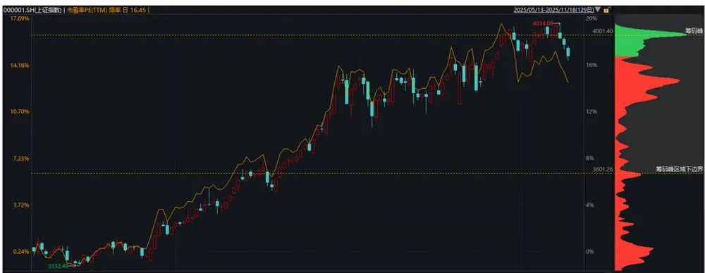
资料来源：Wind，长江证券研究所

## 筹码分布计算

真实的筹码分布数据是几乎无法获得的，因为这涉及到所有投资者的每一笔交易，即使是用逐笔交易数据也无法得知投资者的交易顺序，也就无法得到真实的筹码分布数据。因此，目前市场上对筹码分布的计算方法不尽相同，得到的结果也都仅能算是筹码分布的估计，或者更像是过去一段时间考虑换手率加权后不同价格上发生的成交额。除了成交额以外，我们认为成交量、成交笔数和快照数量同样可能存在差异化的信息，因此可以将该成交额直接替换成成交量、成交笔数和快照数量这三个数据，得到不同筹码分布。

本文使用的数据为 Level1 快照数据的价格、成交量和成交笔数，以及日频的换手率数据，因此不需要考虑用三角分布或者均匀分布等方式近似成交分布形态，虽然需要处理较大的数据量，但是得到的筹码分布数据也更加精确。我们以成交量分布为例，计算步骤如下：

1. 计算每日的成交量分布，每个成交价所对应的成交量之和。

2. 使用每日换手率，计算过去 n 日每日的筹码留存率：

$$
r_{T-t}=\prod_{i=1}^{t}(1-turnover_{T-i+1}),t=1{,}2,\ldots,n-1.
$$

3. 过去 n 日成交量分布的筹码留存率加权之和即为当日的成交量筹码分布数据，再对成交量进行归一化处理，即可得到所有成交价上对应的筹码占比。

## 筹码矩阵因子

筹码分布数据本身可视为矩阵形式，如下图所示，我们计算出了每一档成交价所对应的成交量、成交笔数、快照数量、每笔成交量和每快照成交量，5 种分布特征。可以看出不同特征在价格上的分布有一定的差异，因此后续研究将主要围绕这 5 个特征展开。所有对成交量筹码分布的处理方式，可同理处理其他 4 种特征。

图 2：单日筹码分布图
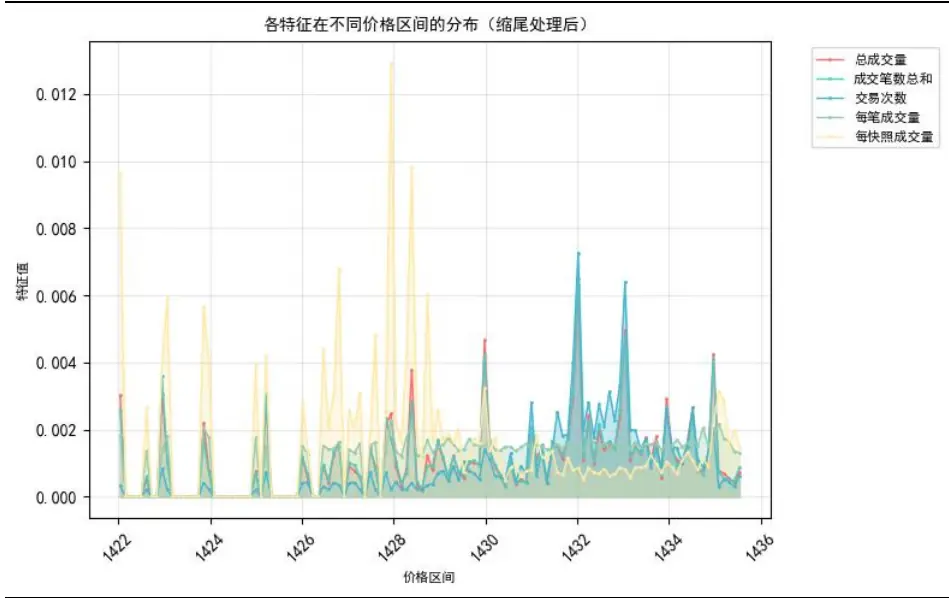
资料来源：天软科技，长江证券研究所

首先考虑使用神经网络直接学习筹码矩阵来预测股票未来收益率，实验参数如下：

训练方式：分年滚动训练

- 训练集：2014 年——T-2 年

- 验证集：T-1 年

- 测试集：T 年

- 样本外：2019 年 1 月 1 日——2025 年 11 月 5 日

- 数据处理：以过去 20 日 Level1 快照计算得到筹码矩阵数据。价格数据除以当日收盘价，根据价格进行分箱统计，分箱数量为 60，以该档平均价格为成交价格列，其余 5 种筹码特征占比加总得到 60 档价格的新筹码占比矩阵。矩阵维度为 60 行6 列，特征分别为成交价、成交量占比、成交笔数占比、快照数量占比、每笔成交量占比和每快照成交量占比。最后进行截面 Zscore 标准化处理，保证不同截面的数据分布尽量一致。

- 预测标签：股票 T+1 日收盘价至 T+11 日收盘价的收益率模型方面，我们尝试了以往的 TCN、GRU 和 Transformer 中的自注意力结构，最终采用自注意力结构学习不同价格档位之间的注意力权重，该处理方式将同一价位的 6 种筹码量价特征视为对该档位节点的信息描述，重点在于学习不同价位之间的信息，类似于文本数据中的前后文关系。

## 回测表现

本文都将以 T+1 收盘价起算的未来 5 日收益率为回测对象，所有回测结果时间区间为2019 年至 2025 年 11 月 5 日。

首先从因子 RankIC 序列的角度看，2019 年以来平均 RankIC 为 7.71%，且自 2020 年以来 RankIC 持续提升。

图 3：ChipDistDL 因子 RankIC 序列
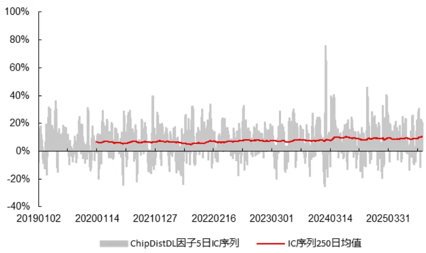
资料来源：Wind，天软科技，长江证券研究所

从分组超额的角度看，2019 年以来全市场因子多头 10%组合超额为 16.62%，2025 年以来多头 10%超额为20.12%，有效性得以延续并未下降。

图 4：ChipDistDL 因子全市场分 10 组超额
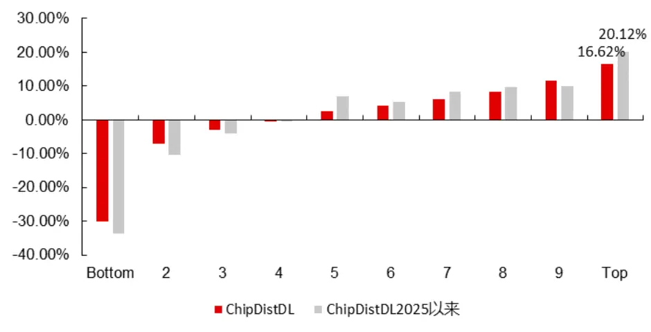
资料来源：Wind，天软科技，长江证券研究所

从超额的角度看，沪深 300 和中证 500 内超额较为一般，小市值宽基指数中超额较为可观。分年来看 2019 年和 2020 年超额较低，2021 年以来超额较高。

表 1：ChipDistDL 因子指数成分股内 Top10%超额收益

| 指数 2019 2020 2021 2022 20251105 平均 |  |  |  |  |  |  |
| --- | --- | --- | --- | --- | --- | --- |
| 沪深 300 | -7.12% | -13.39% 21.58% | 8.42% | 2023 13.82% | 2024 15.91% | 0.99% 6.78% |
| 中证 500 | -5.27% | -6.05% | 4.83% 5.42% | 5.99% | 5.62% | 4.05% 2.55% |
| 中证1000 | 3.53% | 8.27% | 9.18% 8.74% | 9.49% | 6.08% | 11.30% 8.78% |
| 国证 2000 | 9.90% | 14.12% | 10.83% 15.35% | 9.89% | 21.33% | 14.31% |
| 中证全指 | 5.52% | 7.90% | 16.09% 15.02% | 11.92% | 34.75% | 15.01% 21.22% 17.37% |

资料来源：Wind，天软科技，长江证券研究所

从与 Barra 风格因子相关系数的角度分析，模型在小市值、低波动和低流动性的暴露显著高于往期模型，在负贝塔和反转上也有较高的暴露，因此很难作为一个 Alpha 因子来使用或者加入到我们已有的深度学习因子框架中。

图 5：ChipDistDL 因子与 Barra 风格因子相关系数
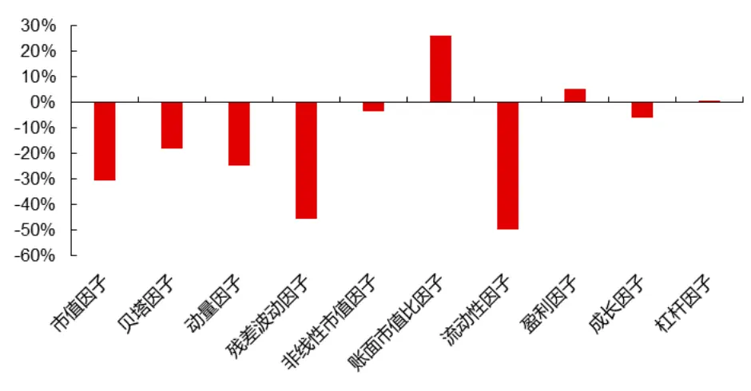
资料来源：Wind，天软科技，长江证券研究所

## 筹码特征因子

参考前期报告《神经网络因子挖掘（三）——开盘集合竞价因子》尝试二的思路，首先人为构造有逻辑的特征，能够充分反映过去一段时间的筹码分布以及变化信息。我们将以每种筹码分布特征为原始特征，加工出以下 5 个衍生代理变量——筹码均值、筹码标准差、筹码峰度、筹码偏度和筹码熵。其中Price 代表筹码价格（需除以当日收盘价剔除量纲）， $Ratio_{i}$ 代表该筹码价格下筹码分布特征对应的概率密度即占比，可以用成交量、成交笔数、快照数量、每笔成交量和每快照成交量进行计算。

$$
Mean=\sum Price_{i}\cdot Ratio_{i},i=1{,}2,\ldots,m
$$

$$
Std=\sqrt{\sum(Price_{i}-Mean)^{2}\cdot Ratio_{i}},i=1{,}2,\ldots,m
$$

$$
Skew=\sum\frac{(Price_{i}-Mean)^{3}}{Std}\cdot Ratio_{i},i=1{,}2,\ldots,m
$$

$$
Kurt=\sum\frac{(Price_{i}-Mean)^{4}}{Std}\cdot Ratio_{i}-3,i=1,2,\ldots,m
$$

$$
Entropy=\sum log\frac{1}{Ratio_{i}}\cdot Ratio_{i},i=1{,}2,\ldots,m
$$

考虑到在筹码分布的逻辑中，不理性投资者处于盈利状态和处于亏损状态时交易行为应该有较大差异，例如盈利时倾向于快速止盈或者亏损时倾向于长期抗跌，因此我们可以根据当日收盘价为筹码盈利与否的判断依据，对筹码数据进行分域，分成盈利筹码和亏损筹码。进而在盈利筹码和亏损筹码中分别计算以上 5 种衍生特征，表征更多不同的信息。最终我们构造出了 75 个筹码特征供后续模型学习。

我们在反复测试过程中发现，这种带有条件的分域特征能够提供较高的信息增量，也就是说即使神经网络有较强的非线性学习能力，但是如果在特征工程上构造更多富含逻辑的特征，是有可能带来更多信息增量的。

## 回测表现

经过 RankIC 的测算，这 75 个筹码衍生特征本身与股票收益率有一定的相关性，但并不算高。

从原始特征角度看，以每笔成交量和每快照成交量衍生出来的特征 RankIC 略高。

从衍生算法的角度看，均值、标准差和熵类特征 RankIC 较高。

- 从分域计算的角度看，盈利筹码特征的线性相关性相对较弱，而亏损筹码相对较高。这或许和筹码类量价因子在市场整体下行时有更强的预测能力有关。

- 从特征间相关系数矩阵的角度看，相同衍生算法的特征之间有较高相关系数，如成交量的平均筹码价格和成交笔数的平均筹码价格。盈利筹码和亏损筹码计算出的衍生特征间相关系数较低，即使是相同原始特征或者相同衍生算法。图中受限于文字大小，并未注明所有特征名，因此仅以热力图颜色作为整体相关性高低参考。

表 2：75 个筹码衍生特征 RankIC

| 特征名 | 全筹码 | 盈利筹码 | 亏损筹码 |
| --- | --- | --- | --- |
| vol_sum_mean | 2.7% | -0.5% | 3.9% |
| vol_sum_std | -3.7% | -1.2% | -4.4% |
| vol_sum_skew | -0.7% | -1.6% | 0.8% |
| vol_sum_kurt | -1.9% | -0.6% | -1.6% |
| vol_sum_entropy | -4.5% | -1.7% | -5.6% |
| cjbs_abs_sum_mean | 2.4% | -0.2% | 3.6% |
| cjbs_abs_sum_std | -3.2% | -0.9% | -3.6% |
| cjbs_abs_sum_skew | -0.8% | -1.5% | 0.2% |
| cjbs_abs_sum_kurt | -1.9% | -0.6% | -1.5% |
| cjbs_abs_sum_entropy | -3.5% | -1.5% | -4.3% |
| trade_count_mean | 3.8% | 0.0% | 4.3% |
| trade_count_std | -3.5% | -0.8% | -4.3% |
| trade_count_skew | -1.7% | -2.2% | -0.4% |
| trade_count_kurt | -2.3% | -1.4% | -1.4% |
| trade_count_entropy | -4.0% | -1.4% | -5.3% |
| vol_per_trade_mean | 2.9% | -0.8% | 4.6% |
| vol_per_trade_std | -4.3% | -0.9% | -4.8% |
| vol_per_trade_skew | -0.2% | -2.3% | 0.9% |
| vol_per_trade_kurt | -2.1% | -1.7% | -1.0% |
| vol_per_trade_entropy | -4.8% | -2.1% | -5.8% |
| vol_per_snapshot_mean | 1.0% | -1.3% | 4.2% |
| vol_per_snapshot_std | -4.1% | -0.8% | -4.8% |
| vol_per_snapshot_skew | 3.2% | 0.9% | 2.7% |
| vol_per_snapshot_kurt | -3.1% | -1.8% | -1.8% |
| vol_per_snapshot_entropy | -3.7% | -1.6% | -5.3% |

资料来源：Wind，天软科技，长江证券研究所

图 6：特征间截面相关系数矩阵
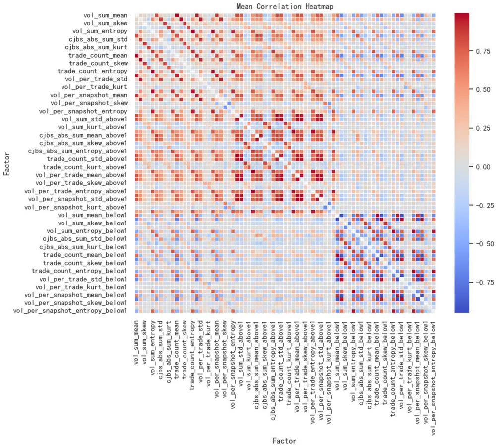
资料来源：Wind，天软科技，长江证券研究所

模型方面仍旧采用 TCN模型，我们对比过两层 GRU和带有位置编码的 Transformer模型，效果差异几乎可以忽略不计，因此我们直接选择前期报告中常用的时序数据学习模型 TCN。参数方面，通道数维持 64 不变，卷积核大小为 2，由于输入数据的时间长度为过去 20 天，因此层数可缩减至 4 层即可学习到完整长度。严谨起见，每年滚动训练的模型我们都将重复训练 5 次，再将 5 个模型的预测值取平均作为最终预测结果进行回测，保证结果的可靠性。

从 IC 序列的角度看，2019 年以来 5 日 RankIC 均值从 7.71%提升至 9.05%，可能在个别时间段例如 2024 年春节前后，仍有较大的波动。

图 7：ChipDist75feat 因子 RankIC 序列
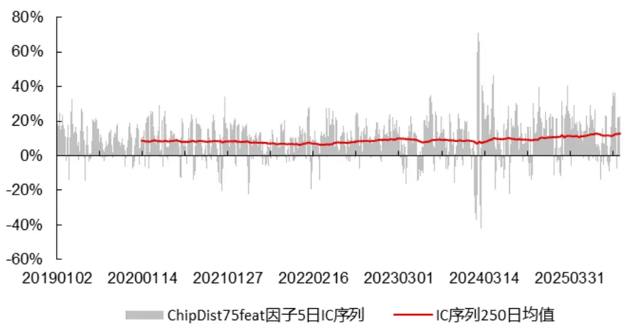
资料来源：Wind，天软科技，长江证券研究所

从分组超额的角度看，多空两端的超额收益均有一定的优化，其中多头组从 16.62%提升至 21.76%。并且 2025 年以来的超额收益也从之前的 20.12%提升至 24.37%。

图 8：ChipDist75feat 因子全市场分 10 组超额
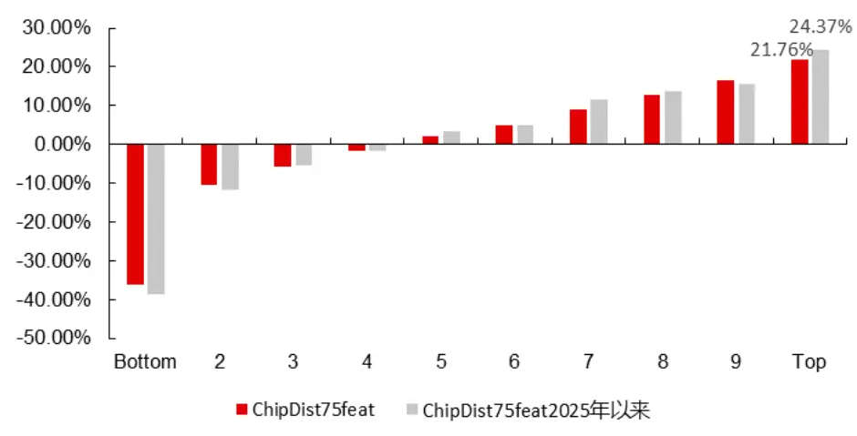
资料来源：Wind，天软科技，长江证券研究所

再从指数成分股内分年多头超额的角度看，构造人工筹码特征进行学习相比于直接学习筹码矩阵有较大的提升，其中市值较大的沪深 300 内超额收益从 6.78%直接提升至17.42%，而市值较小的中证全指上多头超额从 17.37%提升至 24.16%，都足以说明本方法的优越性。并且多头超额的稳定性相比于一般的量价因子有较大的提升，例如在中证全指内最差的一年 2023 年超额收益仍有 14.53%，而最新的 2025 年截至 11 月 5 日超额收益仍有 25.52%，高于 2019 年以来的平均水平24.16%。

因子选股能力提升的同时，在市值、残差波动因子、流动性因子、贝塔因子和动量因子上的暴露也有所降低。

表 3：ChipDist75feat 因子指数成分股内 Top10%超额收益

| 2019 2020 2021 2022 平均 |  |  |  |  |  |  |
| --- | --- | --- | --- | --- | --- | --- |
| 指数 沪深 300 | 14.86% | 29.27% | 15.01% 14.46% | 2023 17.80% | 2024 17.34% | 20251105 5.01% 17.42% |
| 中证 500 | 7.17% | 17.87% | 9.13% | 12.85% 2.86% | 4.78% | 2.49% 8.81% |
| 中证1000 | 25.95% | 31.54% | 11.33% | 11.77% 9.99% | 9.42% | 17.51% 17.41% |
| 国证 2000 | 21.08% | 31.03% | 25.46% | 20.56% 10.97% | 20.49% | 23.73% 23.38% |
| 中证全指 | 20.96% | 29.39% | 22.52% | 19.90% 14.53% | 24.39% | 25.52% 24.16% |

资料来源：Wind，天软科技，长江证券研究所

图 9：ChipDist75feat 因子与 Barra 风格因子相关系数
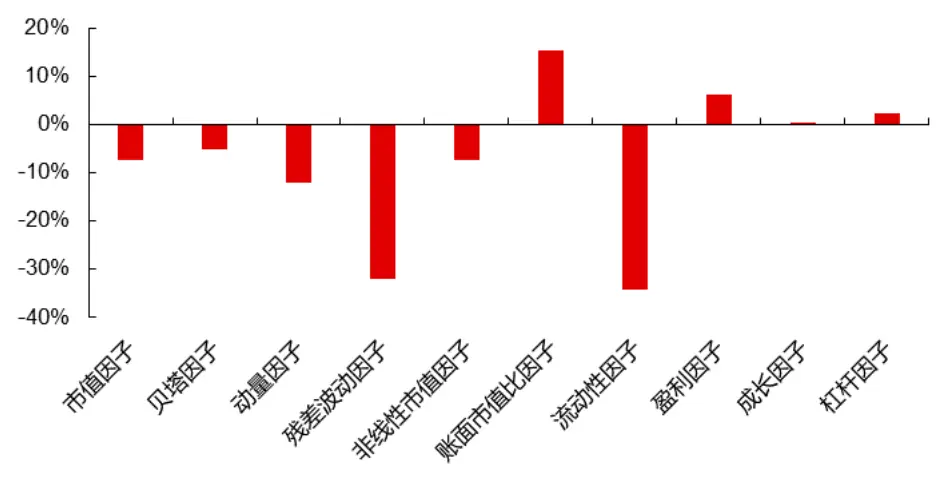
资料来源：Wind，天软科技，长江证券研究所

## 神经网络选股框架

经过多次改进和尝试，我们使用不同频率的量价数据训练出 K 线因子，再以开盘集合竞价的Level1数据训练出开盘量价因子。此外，我们用GRU作为位置编码器，Transforme的自注意力结构作为主要学习层，捕捉万得底层数据库的资金流特征中的 Alpha，得到资金流因子。最后是前文使用筹码分布数据构造出的 75 个筹码分布特征，再结合 TCN模型得到筹码分布因子。

图 10：资金流因子模型 GRU-Transformer 结构
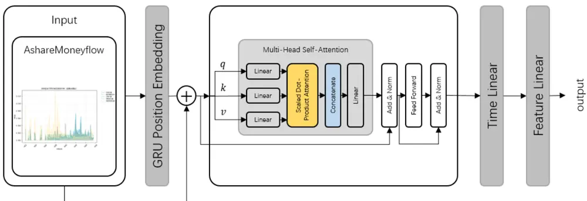
资料来源：长江证券研究所

图 11：深度学习因子框架
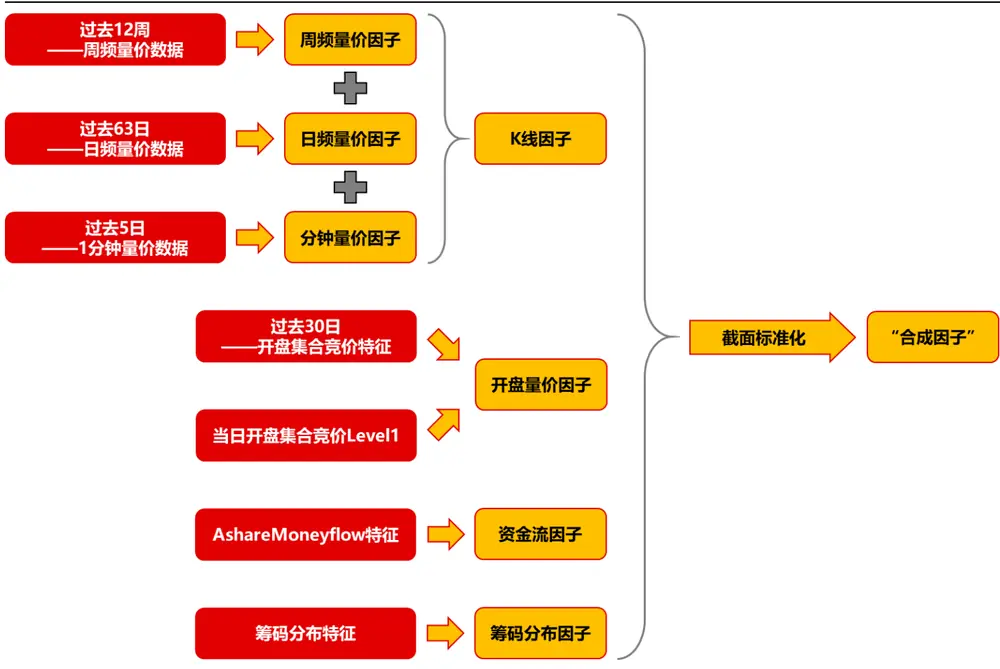
资料来源：长江证券研究所

从分年超额来看，合成因子仍旧是在 A 股整体或者小市值股票中有较强的选股能力，并且该 Alpha 并未随着时间衰减。但是在沪深 300 和中证 500里，2025 年的超额有明显下滑。

表 4：合成因子指数成分股内Top10%超额收益

| 指数 2019 2020 2021 |  |  |  |  |  |  |
| --- | --- | --- | --- | --- | --- | --- |
| 20.99% 42.53% | 21.35% | 2022 21.89% | 2023 19.89% | 2024 24.53% | 20251105 平均 2.77% 23.39% |  |
| 沪深 300 中证500 | 7.63% | 28.24% | 12.16% 17.49% | 9.01% | 15.86% | 5.54% 14.87% |
| 中证 1000 | 28.62% | 48.83% | 24.64% 18.53% | 14.28% | 11.26% | 21.90% 24.93% |
| 国证 2000 | 28.29% | 41.32% | 27.78% 25.77% | 15.97% | 23.38% | 27.22% 29.02% |
| 中证全指 | 28.35% | 44.21% | 29.98% 29.66% | 20.24% | 22.65% 34.66% | 32.13% |

资料来源：Wind，天软科技，长江证券研究所

由于 2024 年以来，不管是人工量价因子还是各类机器学习算法挖掘合成的量价因子都受到了不小的挑战，因此我们专门对这段时间的指数成分股多头净值比进行分析。不难发现2024年春节前，我们的因子在国证2000和中证全指上表现出了较大的超额回撤，而在 2024 年 4 月左右超额净值得到修复。

2025 年以来，大市值指数沪深 300 和中证 500 上多头超额起起伏伏，截至 2025 年 11月 5 日，超额收益分别为 2.77%和 5.54%，显著低于往年平均值。但是在小市值指数中证 1000、国证 2000 和中证全指上，多头超额基本维持在历史平均值附近，表现可观。从路径上来分析，2025 年 3 季度的超额回撤主要原因可能在于科技板块引领的牛市与A 股历史长期规律有一定的差异，因此我们量价模型作为总结历史规律预测未来的选股方式，很难跟上指数自身的单边上涨幅度。

图 12：2024年以来指数成分股内Top10%多头净值比
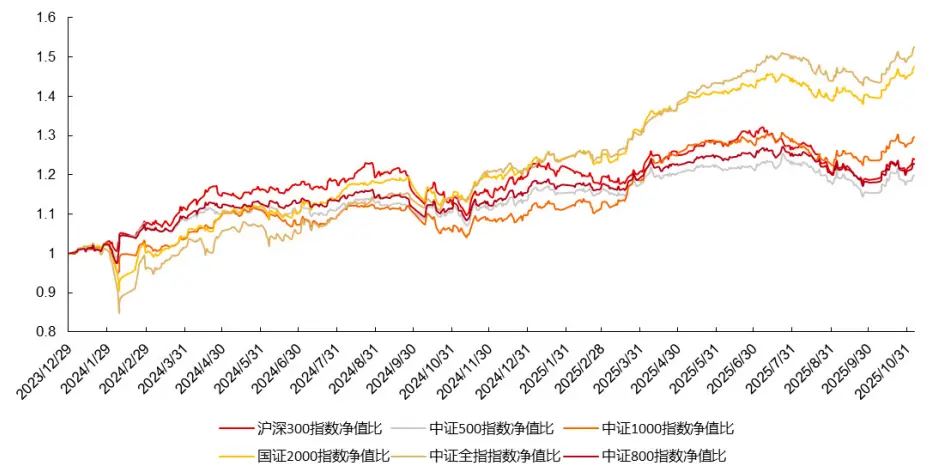
资料来源：Wind，天软科技，长江证券研究所

## 合成因子指数增强组合

为了尽可能的衡量合成因子的 Alpha，我们构造了沪深 300、中证 500、中证 1000 和国证 2000 的增强组合，基准均为全收益指数，组合约束条件如下：

- 个股偏离：1%

- 行业偏离：2%

- 成分股持仓占比下限：80%

- Barra 风格偏离：0.3 倍标准差

Y双边换手率上限：沪深 300 和中证 500为 30%，中证 1000和国证 2000 为 40%

- 调仓频率：5 日

- 交易成本：双边千三

在回测的过程中，我们发现初始日期或者说调仓日期的选择对结果有不小的影响，因此我们构造 5 个初始日期不同的子策略，并将 5 个子策略的平均表现视为最终回测结果，这种方法避免了调仓日期带来的影响，同时也类似于在换手率保持不变的情况下进行每日调仓，更好的利用了合成因子的预测能力。

图 13：沪深 300 增强组合
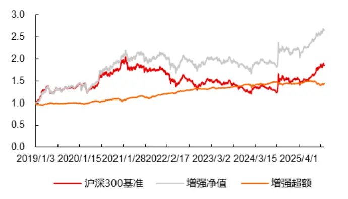
资料来源：Wind，天软科技，长江证券研究所

图 14：中证 500增强组合
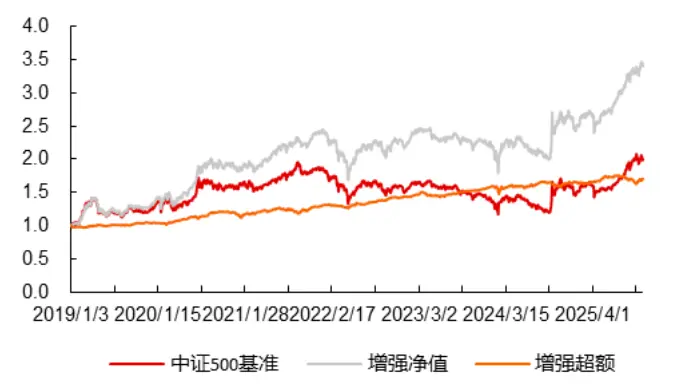
资料来源：Wind，天软科技，长江证券研究所

图 15：中证 1000增强组合
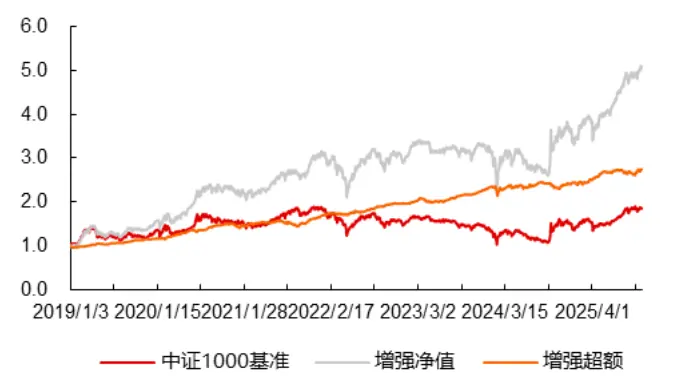
资料来源：Wind，天软科技，长江证券研究所

图 16：国证 2000 增强组合
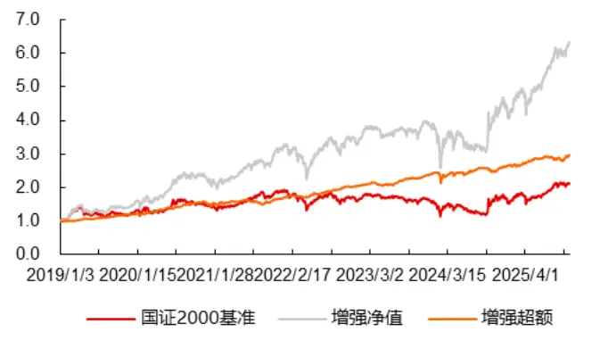
资料来源：Wind，天软科技，长江证券研究所

表 5：沪深 300增强组合回测指标

| 指标 | 总区间 | 2019 | 2020 | 2021 | 2022 | 2023 | 2024 | 20251105 |
| --- | --- | --- | --- | --- | --- | --- | --- | --- |
| 年化收益率 | 16.05% | 42.44% | 37.92% | 6.46% | -11.70% | -2.73% | 22.00% | 23.00% |
| 年化超额 收益率 | 9.41% | 0.69% | 9.88% | 10.62% | 7.65% | 6.56% | 2.28% | -1.07% |
| 夏普比率 | 0.90 | 2.02 | 1.61 | 0.45 | -0.55 | -0.17 | 1.12 | 1.88 |
| 超额夏普比率 | 1.17 | 0.10 | 1.79 | 2.03 | 2.54 | 2.28 | 0.30 | -0.23 |
| 最大超额回撤 | 7.05% | 3.67% | 3.14% | 5.26% | 1.40% | 2.34% | 5.84% | 7.05% |
| 最大超额 回撤天数 | 80 | 54 | 31 | 61 | 59 | 22 | 23 | 80 |
| Calmar 比率 | 1.33 | 0.19 | 3.14 | 2.02 | 5.44 | 2.81 | 0.39 | -0.15 |

资料来源：Wind，天软科技，长江证券研究所

表 6：中证 500增强组合回测指标

| 指标 | 总区间 | 2019 | 2020 | 2021 | 2022 | 2023 | 2024 | 20251105 |
| --- | --- | --- | --- | --- | --- | --- | --- | --- |
| 年化收益率 | 20.49% | 35.09% | 35.12% | 30.46% | -10.22% | 1.52% | 13.34% | 36.40% |
| 年化超额 收益率 | 14.34% | 5.03% | 14.64% | 15.23% | 8.32% | 8.95% | 4.58% | 3.95% |
| 夏普比率 | 0.99 | 1.52 | 1.36 | 2.00 | -0.38 | 0.19 | 0.60 | 2.24 |
| 超额夏普比率 | 1.29 | 0.82 | 2.00 | 1.60 | 2.04 | 2.22 | 0.52 | 0.49 |
| 最大超额回撤 | 7.81% | 3.19% | 4.62% | 6.71% | 4.72% | 5.17% | 7.62% | 7.44% |
| 最大超额 回撤天数 | 90 | 63 | 74 | 83 | 88 | 77 | 23 | 87 |
| Calmar 比率 | 1.84 | 1.58 | 3.17 | 2.27 | 1.76 | 1.73 | 0.60 | 0.53 |

资料来源：Wind，天软科技，长江证券研究所

表 7：中证 1000增强组合回测指标

| 指标 | 总区间 | 2019 | 2020 | 2021 | 2022 | 2023 | 2024 | 20251105 |
| --- | --- | --- | --- | --- | --- | --- | --- | --- |
| 年化收益率 | 28.06% | 48.70% | 48.11% | 38.96% | -6.80% | 9.48% | 8.04% | 46.72% |
| 年化超额 收益率 | 24.56% | 20.60% | 30.18% | 19.59% | 13.50% | 16.51% | 4.84% | 16.48% |
| 夏普比率 | 1.12 | 1.85 | 1.66 | 1.87 | -0.14 | 0.73 | 0.40 | 2.38 |
| 超额夏普比率 | 2.12 | 3.03 | 3.47 | 1.68 | 2.98 | 3.34 | 0.57 | 1.82 |
| 最大超额回撤 | 9.21% | 4.22% | 4.92% | 8.82% | 2.80% | 4.77% | 9.21% | 4.67% |
| 最大超额 回撤天数 | 21 | 11 | 25 | 63 | 62 | 54 | 21 | 79 |
| Calmar 比率 | 2.67 | 4.88 | 6.13 | 2.22 | 4.82 | 3.46 | 0.53 | 3.53 |

资料来源：Wind，天软科技，长江证券研究所

表 8：国证 2000增强组合回测指标

| 指标 | 总区间 | 2019 | 2020 | 2021 | 2022 | 2023 | 2024 | 20251105 |
| --- | --- | --- | --- | --- | --- | --- | --- | --- |
| 年化收益率 | 32.34% | 49.85% | 45.25% | 44.27% | 0.87% | 14.96% | 10.69% | 49.74% |
| 年化超额 收益率 | 28.42% | 23.82% | 29.73% | 16.52% | 17.68% | 17.39% | 9.37% | 16.39% |
| 夏普比率 | 1.21 | 1.92 | 1.61 | 1.97 | 0.17 | 1.04 | 0.47 | 2.29 |
| 超额夏普比率 | 2.10 | 3.48 | 3.52 | 1.27 | 3.50 | 3.28 | 0.91 | 1.75 |
| 最大超额回撤 | 13.39% | 3.44% | 6.20% | 9.06% | 3.48% | 4.50% | 13.39% | 4.92% |
| 最大超额 回撤天数 | 21 | 11 | 24 | 90 | 62 | 59 | 21 | 73 |
| Calmar 比率 | 2.12 | 6.92 | 4.79 | 1.82 | 5.07 | 3.86 | 0.70 | 3.33 |

资料来源：Wind，天软科技，长江证券研究所

## 总结

传统筹码分布数据难以精确获取，本报告采用 Level1 快照数据中的价格、成交量、成交笔数等高频信息，结合换手率与筹码留存率，可以得到更为准确的筹码分布估计方法。通过将价格区间分为 60 档，并计算成交量、成交笔数、快照数量等 5 类分布特征，形成了 60×6 维的筹码矩阵，为后续模型输入提供了高质量、细粒度的数据基础。

尽管尝试了 TCN、GRU 和 Transformer 等深度学习模型直接学习筹码矩阵以预测未来收益率，但实验结果表明，原始 Transformer模型在捕捉筹码矩阵中的有效信息方面表现有限。因子在 Barra 风格因子中暴露出较高的小市值、低波动等风格敞口，难以作为纯粹的 Alpha 因子融入现有框架，说明直接处理原始矩阵存在信息提取效率低的问题。

为解决矩阵学习效果不佳的问题，报告转向构造具有逻辑解释性的筹码衍生特征。基于筹码分布计算了均值、标准差、偏度、峰度、熵等 5 类统计量，并进一步将筹码分为盈利与亏损两部分，共构造75个特征。使用TCN模型对这些特征进行学习后，因子RankIC从 7.71%提升至 9.05%，多头超额收益从 16.62%提升至 21.76%，在各指数内选股能力显著增强，尤其在沪深 300中超额收益从 6.78%提升至 17.42%。

资金流模型优化：采用 GRU 作为位置编码器，结合 Transformer 自注意力结构，捕捉资金流数据中的时序依赖与截面关系，提升了资金流因子的预测能力。

多因子融合提升选股能力：将筹码分布因子与 K 线因子、开盘量价因子、资金流因子等进行合成，形成“合成因子”。因子在中证全指内平均超额达 32.13%，在小市值指数中表现尤为突出。

指数增强组合构建与回测验证：基于合成因子构建了沪深 300、中证 500、中证1000 和国证 2000 的指数增强组合，在相对严格控制风格暴露与换手率的条件下，各组合均实现显著超额收益，其中国证 2000 增强组合年化超额达 28.42%，夏普比率提升至 1.21，验证了模型在实际组合中的有效性与稳定性。

## 风险提示

1、深度学习模型训练过程中有随机性，可能导致预测结果有误差：神经网络在训练的过程中有一定的随机性，随机性包括训练数据集的划分和网络结构中的随机丢弃等，以上情况均可能导致预测结果会有波动和误差风险。

2、模型总结的市场规律是基于历史数据的，存在失效风险：市场量价规律可能随时间变化而变化，模型总结的规律是基于历史数据且是固定的，存在失效风险。

3、日频交易策略回测结果仅供参考：实际交易存在的滑点等风险，历史回测仅是模拟。

4、数据处理细节上的差异对策略有一定的影响：例如缺失值和行情数据复权方式的差异，可能导致最终因子值和策略产生一定的误差。

## 投资评级说明

| 行业评级 |  | 报告发布日后的12个月内行业股票指数的涨跌幅相对同期相关证券市场代表性指数的涨跌幅为基准，投资建议的评 |  |
| --- | --- | --- | --- |
|  |  | 级标准为： |  |
|  | 看 好： |  | 相对表现优于同期相关证券市场代表性指数 |
|  | 中 | 性： | 相对表现与同期相关证券市场代表性指数持平 |
| 公司评级 | 看 | 淡： | 相对表现弱于同期相关证券市场代表性指数 |
|  |  |  | 报告发布日后的12个月内公司的涨跌幅相对同期相关证券市场代表性指数的涨跌幅为基准，投资建议的评级标准为： |
|  | 买 增 | 入： 持： | 相对同期相关证券市场代表性指数涨幅大于10% 相对同期相关证券市场代表性指数涨幅在5%～10%之间 |
|  | 中 | 性： | 相对同期相关证券市场代表性指数涨幅在-5%～5%之间 |
|  | 减 | 持： |  |
|  |  |  | 相对同期相关证券市场代表性指数涨幅小于-5% 无投资评级：由于我们无法获取必要的资料，或者公司面临无法预见结果的重大不确定性事件，或者其他原因，致使 |
| 相关证券市场代表性指数说明：A股市场以沪深300指数为基准；新三板市场以三板成指（针对协议转让标的）或三板做市指数 (针对做市转让标的)为基准；香港市场以恒生指数为基准。 |  | 我们无法给出明确的投资评级。 |  |

## 办公地址

[Tabl上海
Add /虹口区新建路 200 号国华金融中心 B 栋 22、23 层
P.C /（200080）
北京
Add /朝阳区景辉街 16 号院1号楼泰康集团大厦 23 层
P.C /（100020）
武汉
Add /武汉市江汉区淮海路 88号长江证券大厦 37 楼
P.C /（430023）
深圳
Add /深圳市福田区中心四路1号嘉里建设广场 3 期 36 楼
P.C /（518048）

## 分析师声明

本报告署名分析师以勤勉的职业态度，独立、客观地出具本报告。分析逻辑基于作者的职业理解，本报告清晰准确地反映了作者的研究观点。作者所得报酬的任何部分不曾与，不与，也不将与本报告中的具体推荐意见或观点而有直接或间接联系，特此声明。

## 法律主体声明

本报告由长江证券股份有限公司及/或其附属机构（以下简称「长江证券」或「本公司」）制作，由长江证券股份有限公司在中华人民共和国大陆地区发行。长江证券股份有限公司具有中国证监会许可的投资咨询业务资格，经营证券业务许可证编号为：10060000。本报告署名分析师所持中国证券业协会授予的证券投资咨询执业资格书编号已披露在报告首页的作者姓名旁。

在遵守适用的法律法规情况下，本报告亦可能由长江证券经纪（香港）有限公司在香港地区发行。长江证券经纪（香港）有限公司具有香港证券及期货事务监察委员会核准的“就证券提供意见”业务资格（第四类牌照的受监管活动），中央编号为：AXY608。本报告作者所持香港证监会牌照的中央编号已披露在报告首页的作者姓名旁。

## 其他声明

本报告并非针对或意图发送、发布给在当地法律或监管规则下不允许该报告发送、发布的人员。本公司不会因接收人收到本报告而视其为客户。本报告的信息均来源于公开资料，本公司对这些信息的准确性和完整性不作任何保证，也不保证所包含信息和建议不发生任何变更。本报告内容的全部或部分均不构成投资建议。本报告所包含的观点、建议并未考虑报告接收人在财务状况、投资目的、风险偏好等方面的具体情况，报告接收者应当独立评估本报告所含信息，基于自身投资目标、需求、市场机会、风险及其他因素自主做出决策并自行承担投资风险。本公司已力求报告内容的客观、公正，但文中的观点、结论和建议仅供参考，不包含作者对证券价格涨跌或市场走势的确定性判断。报告中的信息或意见并不构成所述证券的买卖出价或征价，投资者据此做出的任何投资决策与本公司和作者无关。本研究报告并不构成本公司对购入、购买或认购证券的邀请或要约。本公司有可能会与本报告涉及的公司进行投资银行业务或投资服务等其他业务(例如:配售代理、牵头经办人、保荐人、承销商或自营投资)。

本报告所包含的观点及建议不适用于所有投资者，且并未考虑个别客户的特殊情况、目标或需要，不应被视为对特定客户关于特定证券或金融工具的建议或策略。投资者不应以本报告取代其独立判断或仅依据本报告做出决策，并在需要时咨询专业意见。

本报告所载的资料、意见及推测仅反映本公司于发布本报告当日的判断，本报告所指的证券或投资标的的价格、价值及投资收入可升可跌，过往表现不应作为日后的表现依据；在不同时期，本公司可以发出其他与本报告所载信息不一致及有不同结论的报告；本报告所反映研究人员的不同观点、见解及分析方法，并不代表本公司或其他附属机构的立场；本公司不保证本报告所含信息保持在最新状态。同时，本公司对本报告所含信息可在不发出通知的情形下做出修改，投资者应当自行关注相应的更新或修改。本公司及作者在自身所知情范围内，与本报告中所评价或推荐的证券不存在法律法规要求披露或采取限制、静默措施的利益冲突。

本报告版权仅为本公司所有，本报告仅供意向收件人使用。未经书面许可，任何机构和个人不得以任何形式翻版、复制和发布给其他机构及/或人士（无论整份和部分）。如引用须注明出处为本公司研究所，且不得对本报告进行有悖原意的引用、删节和修改。刊载或者转发本证券研究报告或者摘要的，应当注明本报告的发布人和发布日期，提示使用证券研究报告的风险。本公司不为转发人及/或其客户因使用本报告或报告载明的内容产生的直接或间接损失承担任何责任。未经授权刊载或者转发本报告的，本公司将保留向其追究法律责任的权利。

本公司保留一切权利。