# 长江金工高频识途系列（一）基于买入行为构建情绪因子

金融工程┃专题报告

## 报告要点

- 不同频率级别信息含量不同

一般而言，频率越高数据信息含量越高，主要体现在两方面：

切片数据细化带来量价波动的信息含量提升；

逐步分解的盘面数据对于交易行为辨识度的提高。

## 区分积极买入与保守买入，构建买入情绪因子

积极买入，投资者所下订单主动与盘口卖盘挂单成交；

保守买入，投资者所下限价订单挂单等待后续卖单与之成交。

根据积极买入与保守买入比建立买入情绪因子。

## 买入情绪因子呈现优异的选股能力

BM 因子的平均 RankIC 为 0.0724,回测的 2010 年 1 月至 2017 年 2 月期间内，原始 BM因子、反转中性化、反转市值中性化 BM因子的年化超额中证 500 收益分别为 14.53%，13.24%，9.3%。

## 分析师覃川桃

（8621）68751782

qinct@cjsc.com

执业证书编号：S0490513030001

## 联系人 陈奕

（8621）68751259

chenyi4@cjsc.com

## 联系人 杨靖凤

（8621）68751636

yangjf@cjsc.com.cn

## 简介

不同频率级别的行情数据的信息含量是不同的。一般而言，频率越高的数据蕴含的信息越多，这一点主要体现在两个方面：

切片数据细化带来量价波动的信息含量提升；

逐步分解的盘面数据对于交易行为辨识度的提高。

第一点很好理解，我们常常会观测更高频率的 K 线，提取在低频率数据中无法观测到的级别内数据波动，以期观测到更多的量价信息。

从本质上来说，对于行情数据的分析，包括判断投资者情绪、把握投资者资金流向、区分投资者交易目的等，最重要前提就是对于投资者的交易行为的识别。

第一点中对于量价关系的研究的目的本也在此。但是量价是交易行为最终的结果，与其在高频数据中根据结果反推交易行为，不如直接在其中识别交易行为。这就是第二点中所提到的，随着数据频率级别的提升，盘口状态的逐步还原，使得交易行为的识别度提高。

因此，本系列选股策略报告运用高频的盘口数据直接识别投资者的交易行为，通过对投资者交易行为的分析筛选个股，建立选股因子。闻“单”识东西，扶“盘”辨南北。

## 数据分析

A 股市场最高级别的盘面行情数据为 tick 数据（深交所会推送逐笔委托数据，可根据该数据还原原始行情，但上交所只提供逐笔成交数据以及买一卖一前 50 笔委托，因此不能还原原始行情），tick 数据反应的是订单薄上的买卖单变化情况，由于深交所推送频率为 3 秒一笔，上交所推送频率为 5 秒一笔，因此 tick 数据本质还是切片数据，只能反映每个时点上的买卖盘口数据，并不能完全反应市场交易行为，但是却提供了我们一个最贴近交易行为的观测样本。

我们 tick 数据来源于天软，level1 数据只提供5 档买卖价，图 1 为该 tick 数据示例，由于天软的 tick 数据是由交易所多台服务器推送，因此数据时间间隔并不固定。各家数据提供商提供的数据也会有一定的差别，也是因为接收推送的服务器不同的结果。

表 1：tick 数据示例（2017-1-12 日行情数据）

| 证券代码 | 时间 | 最新 | 成交笔数 | 成交额 | 成交量 | 买五 | 买四 | 买三 | 买二 | 买一 | 卖一 | 卖二 | 卖三 | 卖四 | 卖五 |
| --- | --- | --- | --- | --- | --- | --- | --- | --- | --- | --- | --- | --- | --- | --- | --- |
| SZ002582 | 09:30:03 | 34.12 | 3 | 27396 | 800 | 33.8 | 33.82 | 34 | 34.05 | 34.1 | 34.12 | 34.37 | 34.38 | 34.5 | 34.54 |
| SZ002582 | 09:30:06 | 34.12 | 0 | 0 | 0 | 33.82 | 33.96 | 34 | 34.05 | 34.1 | 34.12 | 34.37 | 34.38 | 34.5 | 34.54 |
| SZ002582 | 09:30:30 | 34.11 | 1 | 10233 | 300 | 33.82 | 33.96 | 34 | 34.05 | 34.1 | 34.11 | 34.12 | 34.37 | 34.38 | 34.5 |
| SZ002582 | 09:30:36 | 34.11 | 1 | 6822 | 200 | 33.96 | 34 | 34.05 | 34.1 | 34.11 | 34.12 | 34.35 | 34.37 | 34.38 | 34.5 |
| SZ002582 | 09:30:39 | 34.11 | 0 | 0 | 0 | 33.96 | 34 | 34.05 | 34.1 | 34.11 | 34.12 | 34.35 | 34.37 | 34.38 | 34.5 |
| SZ002582 | 09:30:42 | 34.11 | 0 | 0 | 0 | 33.96 | 34 | 34.05 | 34.1 | 34.11 | 34.12 | 34.35 | 34.37 | 34.38 | 34.5 |
| SZ002582 | 09:31:00 | 34.11 | 1 | 17055 | 500 | 33.82 | 33.96 | 34 | 34.05 | 34.1 | 34.11 | 34.12 | 34.35 | 34.38 | 34.5 |
| SZ002582 | 09:31:09 | 34.11 | 0 | 0 | 0 | 33.96 | 34 | 34.05 | 34.08 | 34.1 | 34.11 | 34.12 | 34.35 | 34.38 | 34.5 |
| SZ002582 | 09:31:12 | 34.11 | 0 | 0 | 0 | 33.96 | 34 | 34.05 | 34.08 | 34.1 | 34.11 | 34.12 | 34.35 | 34.38 | 34.5 |
| SZ002582 | 09:31:15 | 34.1 | 2 | 10230 | 300 | 33.96 | 34 | 34.05 | 34.08 | 34.1 | 34.11 | 34.12 | 34.35 | 34.38 | 34.5 |
| SZ002582 | 09:31:27 | 34.1 | 1 | 10230 | 300 | 33.96 | 34 | 34.05 | 34.08 | 34.1 | 34.11 | 34.12 | 34.35 | 34.38 | 34.5 |
| SZ002582 | 09:31:30 | 34.1 | 2 | 10230 | 300 | 33.96 | 34 | 34.05 | 34.08 | 34.1 | 34.11 | 34.12 | 34.35 | 34.38 | 34.5 |

资料来源：天软，长江证券研究所

## 买入行为

由于做空成本与做空条件的限制，A 股本质上是一个多头占优的市场，因此通过分析投资者的买入行为来识别得到的交易动机对股价预测有更好的指导作用。而在交易过程中，投资者买入个股的方式可以简单分为两种：积极买入与保守买入。

积极买入，投资者下单主动与盘口卖盘挂单成交；

保守买入，投资者所下限价订单挂单等待后续卖单与之成交。

图 1：积极买入与保守买入
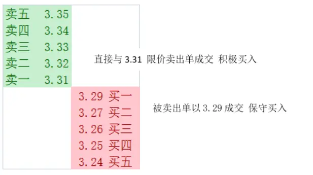
资料来源：长江证券研究所

投资者积极买入的行为往往代表着对于买入该股票的意愿极为强烈，愿意以高于当前成交价的价格买入个股，容易推高股价；

保守买入行为则代表着投资者对于某只个股买入价格敏感度较高，只愿意以自己认定的价格成交，因此只有股价下调至该买入价格时才能成交。

两种交易行为普遍存在，对于每一只个股而言何种交易行为占优是不尽相同的。在本篇报告中，我们根据 tick 级别的盘口数据进行分析，依据两类投资者比例建立选股因子，分析何种投资者占优的股票表现更为出色。

## 因子构建

## 构建方法

根据积极买入与保守买入的定义，在 tick 数据上计算积极买入与保守买入量，由于无法获得每笔成交数据，因此依据 tick 级别数据计算得到的结果也只是近似结果。

计算积极买入与保守买入方法：

积极买入：比对每一条 tick 数据，如果当前成交价格大于等于前一条 tick 数据的卖一价，当前 tick上的成交量记为积极买入量；

保守买入：比对每一条 tick 数据，如果当前成交价格小于等于前一条 tick 数据的买一价，当前 tick上的成交量记为保守买入量。

对当日所有 tick 上的积极买入与保守买入量加总得到每日积极买入与保守买入量：PB（positive buy）和 CB（cautious buy）。

构建买入情绪因子：

$$
BM=\frac{\displaystyle\sum_{t=T-N}^{T-1}CB_{t}}{\displaystyle\sum_{t=T-N}^{T-1}PB_{t}}
$$

BM代表着 i 股票过去 N 日保守买入量与积极买入量比。我们在后文中采用某股票过去20个交易日保守买入量与积极买入量比为选股指标。

## 因子影响

我们对BM因子与股票下期收益相关性进行了研究，来观察该因子对于股票收益的影响。

我们对股票每月收益率与当月月初时 BM因子值相关系数进行了计算：

图 2：BM因子与当月股票收益率
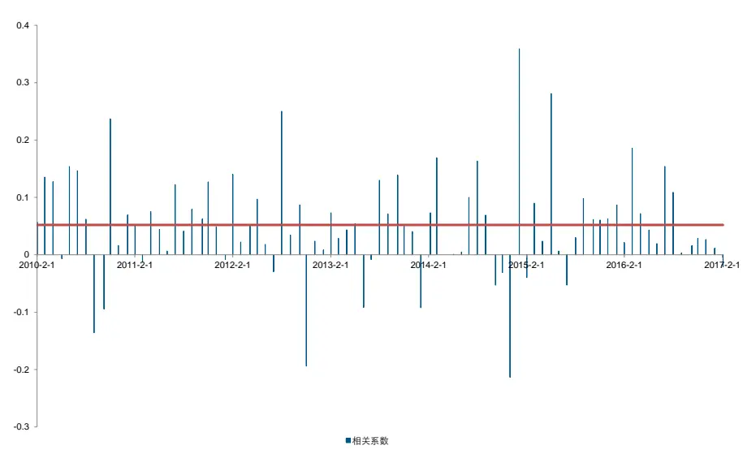
资料来源：天软, 长江证券研究所

图 3 中我们可以看到，总体上看 BM因子值与股票当月收益率是正相关的，平均相关系数为 0.052。因此保守买入与积极买入比越高时，当月股票收益率越高，反之当月股票收益率越低。

事实上，积极买入占比越高，意味着追高该股票的投资者越多。而当保守买入占比越高时，虽然意味着股价前期处于下跌趋势，但是卖单大量被买盘挂单消化，说明股票有足够的的买盘作为支撑。

在下一部分中，我们会对因子的表现进行进一步的回测，来检验该因子的有效性。

## 买入情绪因子回测

## 因子分组

对 2010 年-2017 年 2 月全市场股票计算每个股票的 BM 因子值，每月月初根据此因子由大到小分为十组，按月调仓，考虑行业中性，观察 2010年以来十组表现。

在此部分，我们对 BM 因子进行分组回测，回测规则如下：

1、时间区间：2010 年 1 月至 2017 年 2 月；

2、选股范围：全 A 股票；

3、剔除上市不足一年股票；

4、按月调仓，每月首个交易日调仓；

5、买入时考虑停牌与涨停影响；

6、保持行业中性；

7、为避免换手率对因子分组收益比较的影响，分组回测时不考虑交易成本，单独观察组合时考虑双边千三交易费用。

我们对 BM因子分组回测的表现如下：

图 3：BM因子分组表现
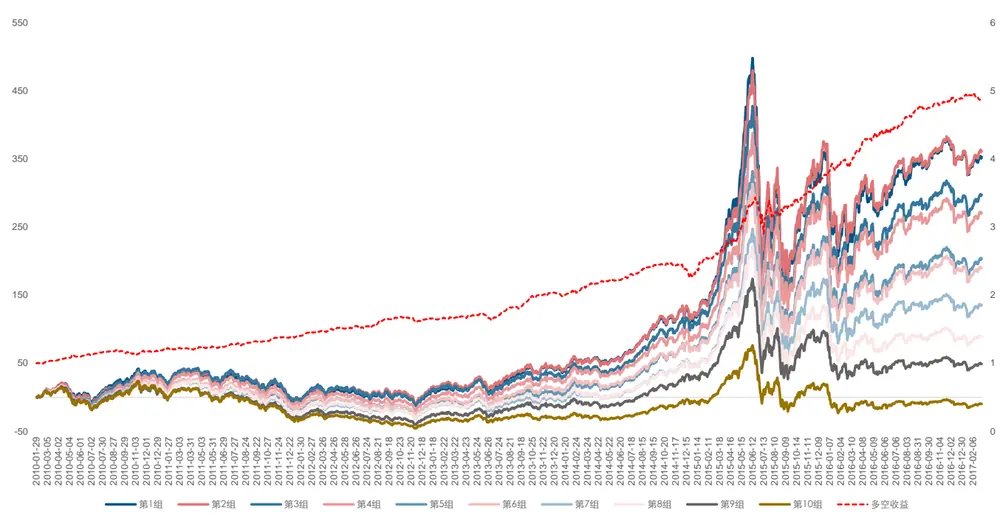
资料来源：天软, 长江证券研究所

表 2：BM因子分组表现（基准为中证 500）

| 从大到小 | 年化收益率 | 年化超额收益率 | 最大回撤 | 最大相对回撤 | 信息比率 | 夏普比率 | 月绝对胜率 | 月超额胜率 | 换手率 |
| --- | --- | --- | --- | --- | --- | --- | --- | --- | --- |
| 第一组 | 24.60% | 18.12% | -55.42% | -17.96% | 2.5358 | 0.70967 | 58.14% | 74.42% | 83.19% |
| 第二组 | 24.96% | 18.73% | -53.55% | -14.55% | 2.8003 | 0.70661 | 60.47% | 79.07% | 86.77% |
| 第三组 | 22.25% | 16.31% | -55.33% | -15.59% | 2.5517 | 0.61251 | 58.14% | 77.91% | 88.48% |
| 第四组 | 21.02% | 15.21% | -53.31% | -12.99% | 2.3335 | 0.56942 | 56.98% | 73.26% | 88.59% |
| 第五组 | 17.58% | 12.01% | -55.39% | -13.29% | 1.9989 | 0.45913 | 55.81% | 73.26% | 88.66% |
| 第六组 | 16.77% | 11.27% | -54.85% | -14.58% | 1.8049 | 0.43195 | 55.81% | 67.44% | 89.27% |
| 第七组 | 13.29% | 7.92% | -53.84% | -13.86% | 1.3056 | 0.32361 | 54.65% | 67.44% | 88.86% |
| 第八组 | 9.75% | 4.49% | -55.04% | -12.86% | 0.7838 | 0.21393 | 54.65% | 55.81% | 88.08% |
| 第九组 | 5.98% | 0.90% | -53.93% | -15.28% | 0.1494 | 0.09451 | 54.65% | 51.16% | 85.83% |
| 第十组 | -1.48% | -6.52% | -56.61% | -41.71% | -1.0766 | -0.14675 | 52.33% | 39.53% | 73.54% |
| 多空组 | 26.01% | ■ | -15.55% | ■ | ■ | 2.7924 | 81.39% | - | ■ |

资料来源：天软，长江证券研究所

根据 BM因子的分组表现，可以看到 BM因子由大到小的十组表现呈现明显的单调性，即随着BM因子的值逐渐增大，分组的年化收益逐渐上升。多空年化收益率达到26.01%，最大回撤为-15.55%，夏普比率为 2.7924，月度胜率达到 81.39%。

在考虑双边千三的交易成本的情形下，我们对 BM因子第一组分年表现进行了分析。

可以看到，2017 年以来年化收益不理想，不过样本数量较少，不具有代表性。从 2010年到 2016 年每年均能稳定跑赢中证 500。最大相对回撤出现在 2015 年大盘大幅下跌时，其他年份相对回撤均在 10%以内，除去 2014、2015 年相对回撤甚至在 5%以内。月度超额胜率也基本在 70%以上。因子表现出色。

表 3：BM因子第一组分年表现（基准为中证 500）

| 从大到小 | 年化收益率 | 年化超额收益率 | 最大回撤 | 最大相对回撤 | 信息比率 | 夏普比率 | 月绝对胜率 | 月超额胜率 |
| --- | --- | --- | --- | --- | --- | --- | --- | --- |
| 2010 | 31.04% | 13.78% | -24.69% | -3.04% | 1.9524 | 1.0423 | 50.00% | 75.00% |
| 2011 | -30.38% | 7.65% | -33.78% | -3.80% | 1.0667 | -1.4214 | 33.33% | 58.33% |
| 2012 | 7.94% | 5.21% | -25.30% | -2.80% | 0.4903 | 0.1970 | 58.33% | 75.00% |
| 2013 | 37.75% | 15.87% | -17.15% | -2.90% | 2.5279 | 1.5856 | 66.67% | 83.33% |
| 2014 | 44.48% | 3.65% | -10.53% | -8.93% | 0.1262 | 2.1132 | 66.67% | 75.00% |
| 2015 | 106.46% | 49.27% | -55.76% | -18.15% | 3.1575 | 1.9985 | 75.00% | 83.33% |
| 2016 | 6.63% | 19.99% | -26.11% | -3.43% | 3.2946 | 0.1151 | 58.33% | 83.33% |
| 2017 | -2.43% | -15.11% | -7.19% | -2.96% | -3.7973 | -0.3500 | 50.00% | 0.00% |

资料来源：天软，长江证券研究所

图 4：BM 因子 RankIC
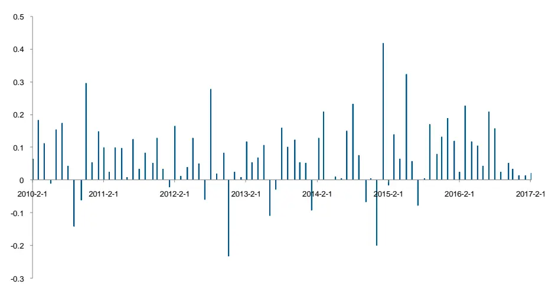
资料来源：天软, 长江证券研究所
BM 因子的平均 RankIC 为 0.0724，说明因子对股票下一期收益有着较强的解释能力。

## 因子剖析

## 反转中性化

通过对单因子分组表现的分析，我们发现该因子表现出色，但是很显然该因子会受到过去 20 个交易日涨跌幅也就是反转因子的影响，因此我们尝试剔除反转因子。

显而易见地，BM 因子越高的组别说明过去 20 个交易日股票下跌的可能性更大，而反转因子在 A 股市场也是一个强有效的因子，因此我们对 BM因子分组股票过去 20 个交易日平均涨跌幅进行了统计：

图 5：BM因子分组过去 20天涨跌幅
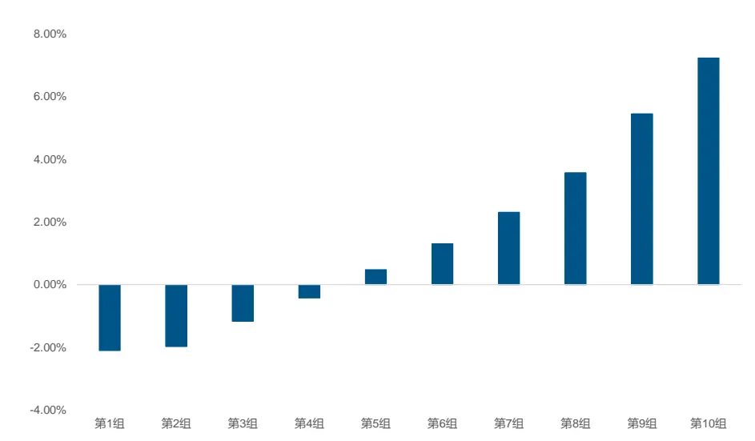
资料来源：天软, 长江证券研究所

可以看到 BM 因子与过去 20 天涨跌幅呈现显著的负相关，因此反转因子的确会影响到BM 因子的表现，因此我们通过回归的方式剔除BM因子与反转因子的相关性：

$$
BM=\alpha+\beta Last_{20t}+\varepsilon_{t}
$$

其中 $Last_{20t}$ 为个股过去 20 个交易日涨跌幅。我们把残差项 $\mathcal{E}_{t}$ 作为新的因子，并根据新的因子重新进行分组，并计算新的分组各组过去 20 个交易日平均涨跌幅。我们看到中性化后，反转因子与 BM 因子的单调性得到降低，不同组别的的反转因子偏离度大大降低，两者的相关性也从-28.03%降低到约等于 0%。据此我们可以根据中心化后的因子观察不同组别的表现。

图 6：中性化后 BM因子分组过去20天涨跌幅
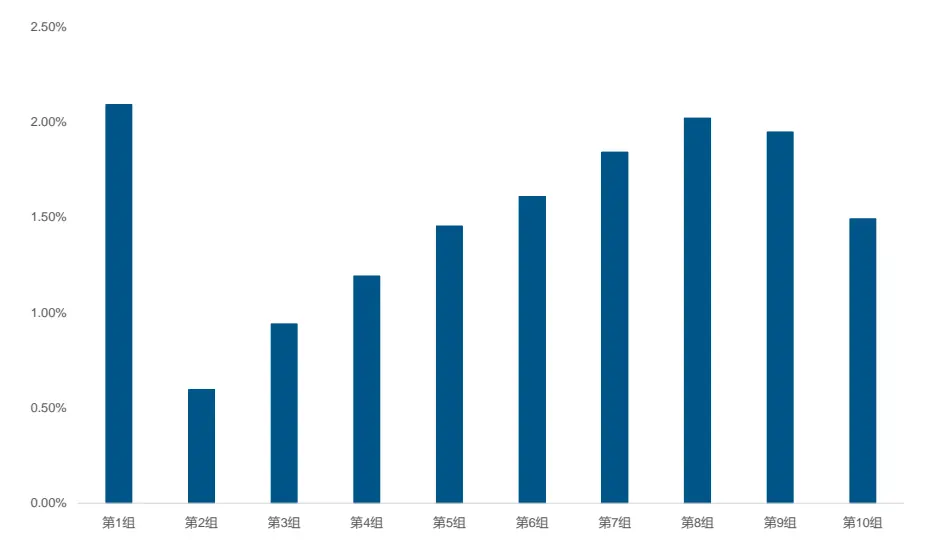
资料来源：天软, 长江证券研究所

我们对经过反转因子中性化后的 BM因子进行分组回测：

图 7：反转中性化 BM因子分组表现
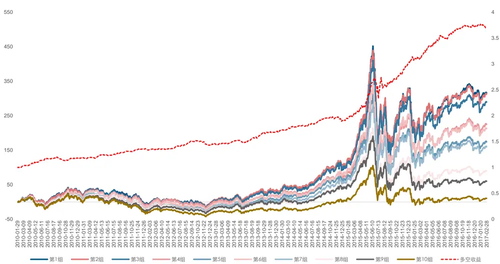
资料来源：天软, 长江证券研究所

表 4：反转因子中性化后 BM因子分组表现（基准为中证 500）

| 从大到小 | 年化收益率 | 年化超额收益率 | 最大回撤 | 最大相对回撤 | 信息比率 | 夏普比率 | 月绝对胜率 | 月超额胜率 | 换手率 |
| --- | --- | --- | --- | --- | --- | --- | --- | --- | --- |
| 第一组 | 23.10% | 16.75% | -55.19% | -17.67% | 2.3753 | 0.6574 | 58.14% | 68.60% | 82.98% |
| 第二组 | 22.95% | 16.77% | -53.72% | -14.07% | 2.6773 | 0.6468 | 59.30% | 72.09% | 86.57% |
| 第三组 | 21.93% | 16.00% | -54.15% | -12.78% | 2.5268 | 0.6025 | 58.14% | 76.74% | 88.49% |
| 第四组 | 18.78% | 13.09% | -54.54% | -14.54% | 2.0249 | 0.4982 | 56.98% | 68.60% | 88.55% |
| 第五组 | 15.85% | 10.33% | -55.70% | -13.88% | 1.6959 | 0.4059 | 54.65% | 67.44% | 88.96% |
| 第六组 | 18.10% | 12.53% | -54.86% | -14.44% | 2.0419 | 0.4740 | 60.47% | 72.09% | 89.57% |
| 第七组 | 14.99% | 9.50% | -53.01% | -11.80% | 1.6132 | 0.3793 | 59.30% | 66.28% | 88.57% |
| 第八组 | 9.78% | 4.58% | -54.93% | -15.61% | 0.7919 | 0.2140 | 52.33% | 56.98% | 87.27% |
| 第九组 | 7.10% | 1.96% | -54.21% | -17.87% | 0.3360 | 0.1302 | 55.81% | 56.98% | 84.94% |
| 第十组 | 1.48% | -3.69% | -55.97% | -32.51% | -0.6331 | -0.0499 | 51.16% | 47.67% | 72.63% |
| 多空组 | 20.98% | ■ | - 14.53% | ■ | ■ | 2.4510 | 80.23% | - | ■ |

资料来源：天软，长江证券研究所

我们可以看到，经过反转因子中性化后的 BM因子十组年化收益仍然呈现单调的特性，而且第一组的年化收益率仅下降了 1.5%。这说明 BM因子得分较高的个股在过去 20 个交易日大概率处于下跌的走势里，但是这个因子筛选得到的不是纯粹下跌的个股，而是在下跌的过程中有足够买盘支撑的股票，因此在剔除了反转因子影响之后，BM 因子仍然能够呈现极强的有效性。

在考虑双边千三的交易成本的情形下，我们对反转中性化 BM因子第一组分年表现进行了分析。可以看到 2010-2016年每年都能够跑赢中证 500，除 2014、2015 年相对最大回撤在 5%以内。

表 5：反转中性化后BM因子第一组分年表现（基准为中证 500）

| 从大到小 | 年化收益率 | 年化超额收益率 | 最大回撤 | 最大相对回撤 | 信息比率 | 夏普比率 | 月绝对胜率 | 月超额胜率 |
| --- | --- | --- | --- | --- | --- | --- | --- | --- |
| 2010 | 31.38% | 14.22% | -24.45% | -3.84% | 3.0003 | 1.1527 | 50.00% | 66.67% |
| 2011 | -30.36% | 7.65% | -33.64% | -3.40% | 1.9357 | -1.3035 | 33.33% | 58.33% |
| 2012 | 2.79% | 0.09% | -26.68% | -4.51% | 0.0199 | 0.1133 | 50.00% | 41.67% |
| 2013 | 32.62% | 11.62% | -16.23% | -3.15% | 2.2972 | 1.4701 | 66.67% | 91.67% |
| 2014 | 43.37% | 2.93% | -9.69% | -7.21% | 0.6263 | 2.1759 | 66.67% | 75.00% |
| 2015 | 110.49% | 52.55% | -55.52% | -17.86% | 3.5415 | 2.1134 | 75.00% | 83.33% |
| 2016 | 4.97% | 18.09% | -26.43% | -3.06% | 3.5767 | 0.1580 | 66.67% | 75.00% |
| 2017 | -4.77% | -17.19% | -6.98% | -3.14% | -4.1076 | -0.3189 | 50.00% | 0.00% |

资料来源：天软，长江证券研究所

反转中性化 BM因子的平均 RankIC 为0.0512，说明剔除反转影响后，因子对股票下一期收益仍有着较强的解释能力。

图 8：反转中性化后BM因子 RankIC
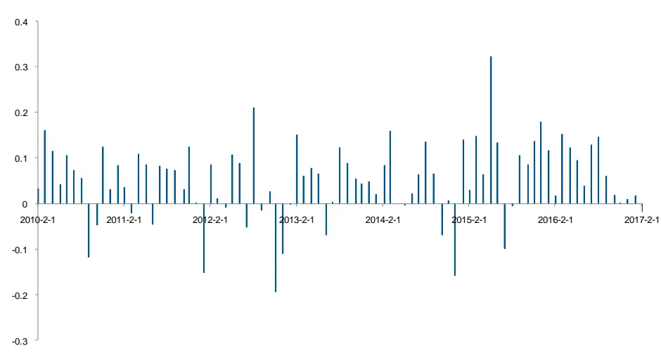
资料来源：天软, 长江证券研究所

## 市值中性化

规模因子近几年呈现显著的 alpha 收益，因此在任何因子的回测中都不得不剔除市值的影响，图 10 为反转中性化 BM 因子各组的市值中位数分布，可以看到，表现较好的第1 组还是呈现了较为明显的小市值效应。

图 9：反转中性化后BM因子市值分布
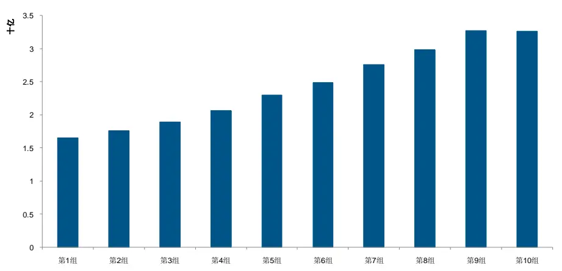
资料来源：天软, 长江证券研究所

所以为了进一步研究因子的有效性，我们尝试用同样的方法剔除市值的影响：

$$
BM=\alpha+\beta_{1}Last_{20t}+\beta_{2}MV_{t}+\varepsilon_{t}
$$

图 10：反转市值中性化BM因子分组表现
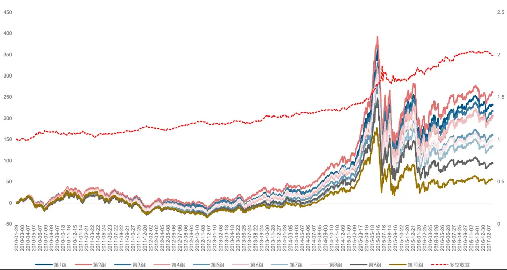
资料来源：天软, 长江证券研究所

表 6：反转市值因子中性化后 BM因子分组表现（基准为中证 500）

| 从大到小 | 年化收益率 | 年化超额收益率 | 最大回撤 | 最大相对回撤 | 信息比率 | 夏普比率 | 月绝对胜率 | 月超额胜率 | 换手率 |
| --- | --- | --- | --- | --- | --- | --- | --- | --- | --- |
| 第一组 | 19.07% | 12.65% | -53.91% | -12.34% | 2.1134 | 0.5439 | 54.65% | 74.42% | 83.93% |
| 第二组 | 20.56% | 14.28% | -53.30% | -11.21% | 2.6304 | 0.5848 | 59.30% | 79.07% | 87.00% |
| 第三组 | 18.27% | 12.33% | -52.44% | -9.50% | 2.2399 | 0.4970 | 55.81% | 72.09% | 88.35% |
| 第四组 | 17.64% | 11.82% | -52.57% | -10.19% | 2.2110 | 0.4733 | 56.98% | 74.42% | 88.77% |
| 第五组 | 14.91% | 9.37% | -54.47% | -13.10% | 1.6584 | 0.3790 | 53.49% | 68.60% | 89.26% |
| 第六组 | 17.44% | 11.84% | -53.87% | -11.63% | 2.0622 | 0.4570 | 59.30% | 72.09% | 89.88% |
| 第七组 | 13.15% | 7.90% | -55.03% | -12.89% | 1.2324 | 0.3158 | 56.98% | 63.95% | 89.07% |
| 第八组 | 14.19% | 8.96% | -56.46% | -18.13% | 1.3354 | 0.3455 | 55.81% | 73.26% | 88.25% |
| 第九组 | 10.13% | 5.09% | -55.73% | -16.65% | 0.7379 | 0.2196 | 56.98% | 65.12% | 86.96% |
| 第十组 | 6.65% | 1.56% | -57.60% | -24.36% | 0.2141 | 0.1143 | 53.49% | 61.63% | 75.85% |
| 多空组 | 10.57% | ■ | ■ | -11.14% | ■ | 1.1433 | 61.62% | ■ | ■ |

资料来源：天软，长江证券研究所

表 7：反转市值中性化后 BM因子第一组分年表现（基准为中证 500）

| 从大到小 | 年化收益率 | 年化超额收益率 | 最大回撤 | 最大相对回撤 | 信息比率 | 夏普比率 | 月绝对胜率 | 月超额胜率 |
| --- | --- | --- | --- | --- | --- | --- | --- | --- |
| 2010 | 25.53% | 8.82% | -23.53% | -3.62% | 1.8487 | 0.9760 | 50.00% | 75.00% |
| 2011 | -31.91% | 5.11% | -34.34% | -5.03% | 1.3244 | -1.4071 | 33.33% | 66.67% |
| 2012 | 1.84% | -1.11% | -26.99% | -4.78% | -0.3053 | 0.0789 | 50.00% | 58.33% |
| 2013 | 28.10% | 7.71% | -15.95% | -2.69% | 1.6670 | 1.2973 | 66.67% | 91.67% |
| 2014 | 42.60% | 2.32% | -9.14% | -5.84% | 0.5499 | 2.1836 | 66.67% | 83.33% |
| 2015 | 91.31% | 37.72% | -54.26% | -12.55% | 3.1410 | 1.8156 | 75.00% | 83.33% |
| 2016 | 1.61% | 14.07% | -26.15% | -2.87% | 3.2468 | 0.0525 | 41.67% | 75.00% |
| 2017 | -6.45% | -18.65% | -7.14% | -3.51% | -4.3555 | -0.4307 | 50.00% | 0.00% |

资料来源：天软，长江证券研究所

通过对反转市值中性化之后因子分组的表现，可以看到整体的超额收益的确下降，但第一组的相对回撤减小。整体而言，市值因子的影响较为显著。不过除 2012 年与 2017年 1-2 月，中性化后的因子仍然能够跑赢中证 500，月度胜率维持在 70%以上。

## 中性化结果对比

图 11：原始因子、反转中性化、反转和市值中性化
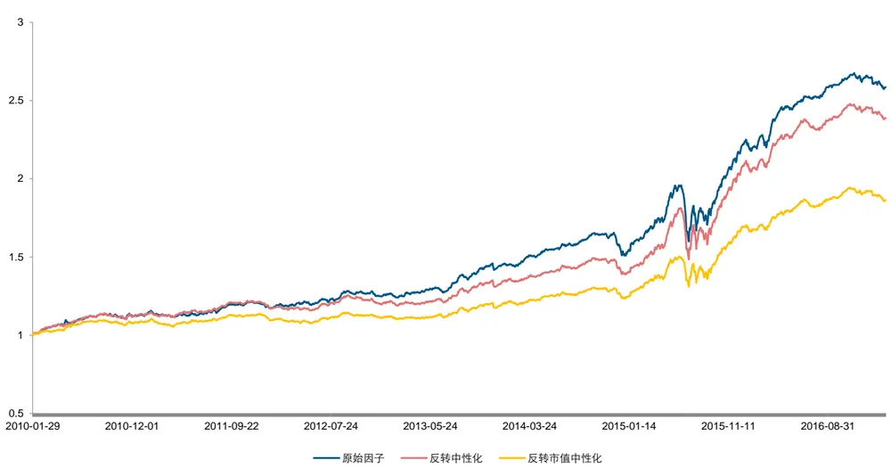
资料来源：天软, 长江证券研究所

经过原始 BM因子、反转中性化、反转市值中性化 BM因子的年化超额中证 500 收益分别为 14.53%，13.24%，9.3%。BM因子受反转因子影响较小，而受市值因子影响较大。

历史上相对收益比较大的回撤主要发生在2014年12月份和2015年6月15日到2015年 7 月 17 日。2014 年12 月份，小市值出现了大幅回撤，我们市值中性化后的组合相较于银行、券商仍然属于偏小市值，因此当时组合出现了 5%左右的相对回撤。而 2015年 6 月 15 日到 2015年 7 月17 日全市场处于大幅下跌的行情下，极端行情可能使得我们对个股买入情绪判断产生了偏差，导致因子期间失效。（附录中我们列出了原始因子两个时间区间内跌幅前 50 个股以作参考）

## 总结

本系列尝试在高频数据中挖掘 alpha 因子，但我们着重点并不在频率本身，而是在于挖掘高频数据中独有的信息，借助盘口信息近似还原投资者的交易行为，据此构建选股因子，辅助选股。

本文中，通过分析买单成交情况，区分积极买入与保守买入，构建买入情绪因子 BM，发现个股保守买入占比越高，其下期收益率越高。分组回测中（考虑千三的双边成本），该因子获得 14.53%的超额中证 500 收益。

通过剔除 BM因子中反转因子的影响，我们发现 BM因子的超额收益受影响较小，中性化因子仍然能够得到 13.24%的超额收益。因此本质上 BM因子带来的 alpha 收益并不是来源于反转因子，而是筛选得到的股价虽然下跌但是存在较大的买盘支撑的个股。

在剔除了反转与市值两方面的影响之后，中性化因子 2010-2016 年年化超额收益率为9.3%。

本篇报告为长江金工高频系列第一篇，后续我们会对投资者在买卖订单上的行为进行分析，探究新的 alpha。

## 附录

表 8：2014年 12月持仓跌幅前 30股票

| 股票代码 | 股票简称 | 当月收益率 | 股票代码 | 股票简称 | 当月收益率 | 股票代码 | 股票简称 | 当月收益率 |
| --- | --- | --- | --- | --- | --- | --- | --- | --- |
| 300264.SZ | 佳创视讯 | -27.09% | 002124.SZ | 天邦股份 | -21.14% | 300016.SZ | 北陆药业 | -16.47% |
| 300354.SZ | 东华测试 | -26.59% | 300260.SZ | 新莱应材 | -19.58% | 600856.SH | 中天能源 | -16.10% |
| 300246.SZ | 宝莱特 | -25.77% | 300121.SZ | 阳谷华泰 | -19.32% | 300234.SZ | 开尔新材 | -15.93% |
| 002382.SZ | 蓝帆医疗 | -24.21% | 002297.SZ | 博云新材 | -18.86% | 002249.SZ | 大洋电机 | -15.93% |
| 300173.SZ | 智慧松德 | -23.28% | 002201.SZ | 九鼎新材 | -18.73% | 300157.SZ | 恒泰艾普 | -15.80% |
| 002417.SZ | 三元达 | -22.74% | 300229.SZ | 拓尔思 | -18.17% | 000536.SZ | 华映科技 | -15.77% |
| 300314.SZ | 戴维医疗 | -22.68% | 300305.SZ | 裕兴股份 | -17.80% | 002619.SZ | 巨龙管业 | -15.71% |
| 000892.SZ | 欢瑞世纪 | -22.53% | 300164.SZ | 通源石油 | -17.13% | 002328.SZ | 新朋股份 | -15.69% |
| 300232.SZ | 洲明科技 | -22.13% | 000502.SZ | 绿景控股 | -17.09% | 300330.SZ | 华虹计通 | -15.59% |
| 002193.SZ | 山东如意 | -21.70% | 002101.SZ | 广东鸿图 | -16.68% | 300062.SZ | 中能电气 | -15.58% |

资料来源：天软，长江证券研究所

表 9：2015年 6月持仓跌幅前 30股票

| 股票代码 | 股票简称 | 当月收益率 | 股票代码 | 股票简称 | 当月收益率 | 股票代码 | 股票简称 | 当月收益率 |
| --- | --- | --- | --- | --- | --- | --- | --- | --- |
| 002584.SZ | 西陇科学 | -51.05% | 300086.SZ | 康芝药业 | -44.18% | 300223.SZ | 北京君正 | -40.00% |
| 000971.SZ | 高升控股 | -47.81% | 300151.SZ | 昌红科技 | -42.86% | 002221.SZ | 东华能源 | -39.98% |
| 000638.SZ | 万方发展 | -47.44% | 300367.SZ | 东方网力 | -42.52% | 300231.SZ | 银信科技 | -39.86% |
| 300300.SZ | 汉鼎宇佑 | -47.37% | 002332.SZ | 仙琚制药 | -42.15% | 300063.SZ | 天龙集团 | -39.79% |
| 002119.SZ | 康强电子 | -47.28% | 600293.SH | 三峡新材 | -41.41% | 600571.SH | 信雅达 | -39.76% |
| 002513.SZ | *ST蓝丰 | -46.95% | 300356.SZ | 光一科技 | -40.82% | 002208.SZ | 合肥城建 | -39.43% |
| 300130.SZ | 新国都 | -46.47% | 300348.SZ | 长亮科技 | -40.79% | 300256.SZ | 星星科技 | -39.42% |
| 000584.SZ | 友利控股 | -44.97% | 002171.SZ | 楚江新材 | -40.71% | 000803.SZ | 金宇车城 | -39.07% |
| 300081.SZ | 恒信移动 | -44.43% | 300338.SZ | 开元仪器 | -40.42% | 300380.SZ | 安硕信息 | -38.77% |
| 000005.SZ | 世纪星源 | -44.38% | 300046.SZ | 台基股份 | -40.10% | 300082.SZ | 奥克股份 | -38.45% |

资料来源：天软，长江证券研究所

表 10：2015年 7月持仓跌幅前 30股票

| 股票代码 | 股票简称 | 当月收益率 | 股票代码 | 股票简称 | 当月收益率 | 股票代码 | 股票简称 | 当月收益率 |
| --- | --- | --- | --- | --- | --- | --- | --- | --- |
| 300378.SZ | 鼎捷软件 | -45.80% | 300152.SZ | 科融环境 | -38.52% | 300382.SZ | 斯莱克 | -35.27% |
| 300165.SZ | 天瑞仪器 | -43.43% | 300331.SZ | 苏大维格 | -37.52% | 002645.SZ | 华宏科技 | -35.02% |
| 300004.SZ | 南风股份 | -40.93% | 300314.SZ | 戴维医疗 | -37.49% | 002318.SZ | 久立特材 | -35.00% |
| 300191.SZ | 潜能恒信 | -40.87% | 002228.SZ | 合兴包装 | -37.16% | 300329.SZ | 海伦钢琴 | -34.98% |
| 300341.SZ | 麦迪电气 | -40.19% | 300295.SZ | 三六五网 | -36.91% | 002587.SZ | 奥拓电子 | -34.97% |
| 002607.SZ | 亚夏汽车 | -39.85% | 000506.SZ | 中润资源 | -36.77% | 300062.SZ | 中能电气 | -34.40% |
| 300333.SZ | 兆日科技 | -39.70% | 300226.SZ | 上海钢联 | -36.72% | 300109.SZ | 新开源 | -34.39% |
| 000409.SZ | 山东地矿 | -39.47% | 300125.SZ | 易世达 | -36.69% | 002552.SZ | 宝鼎科技 | -34.39% |
| 002612.SZ | 朗姿股份 | -39.05% | 002331.SZ | 皖通科技 | -36.36% | 002395.SZ | 双象股份 | -34.38% |
| 000695.SZ | 滨海能源 | -38.82% | 300126.SZ | 锐奇股份 | -35.96% | 300312.SZ | 邦讯技术 | -34.38% |

资料来源：天软，长江证券研究所

## 投资评级说明

| 行业评级 报告发布日后的12个月内行业股票指数的涨跌幅度相对同期沪深300指数的涨跌幅为基准，投资建议的评级标准为： |
| --- |
| 看 好： 相对表现优于市场 |
| 中 性： 相对表现与市场持平 |
| 看 淡： 相对表现弱于市场 |
| 公司评级 报告发布日后的12个月内公司的涨跌幅度相对同期沪深300指数的涨跌幅为基准，投资建议的评级标准为： |
| 买 入： 相对大盘涨幅大于10% |
| 增 持： 相对大盘涨幅在 5%～10%之间 |
| 中 性： 相对大盘涨幅在-5%～5%之间 |
| 减持： 相对大盘涨幅小于-5% |
| 无投资评级：由于我们无法获取必要的资料，或者公司面临无法预见结果的重大不确定性事件，或者其他原因，致使我们无法给出明确的投资评级。 |

## 联系我们

## 上海

浦东新区世纪大道 1589 号长泰国际金融大厦 21 楼（200122）

## 武汉

武汉市新华路特 8 号长江证券大厦 11 楼（430015）

## 北京

西城区金融街 33 号通泰大厦 15 层（100032）

## 深圳

深圳市福田区福华一路 6 号免税商务大厦 18 楼（518000）

## 重要声明

长江证券股份有限公司具有证券投资咨询业务资格，经营证券业务许可证编号：10060000。

本报告的作者是基于独立、客观、公正和审慎的原则制作本研究报告。本报告的信息均来源于公开资料，本公司对这些信息的准确性和完整性不作任何保证，也不保证所包含信息和建议不发生任何变更。本公司已力求报告内容的客观、公正，但文中的观点、结论和建议仅供参考，不包含作者对证券价格涨跌或市场走势的确定性判断。报告中的信息或意见并不构成所述证券的买卖出价或征价，投资者据此做出的任何投资决策与本公司和作者无关。

本报告所载的资料、意见及推测仅反映本公司于发布本报告当日的判断，本报告所指的证券或投资标的的价格、价值及投资收入可升可跌，过往表现不应作为日后的表现依据；在不同时期，本公司可发出与本报告所载资料、意见及推测不一致的报告；本公司不保证本报告所含信息保持在最新状态。同时，本公司对本报告所含信息可在不发出通知的情形下做出修改，投资者应当自行关注相应的更新或修改。

本公司及作者在自身所知情范围内，与本报告中所评价或推荐的证券不存在法律法规要求披露或采取限制、静默措施的利益冲突。

本报告版权仅仅为本公司所有，未经书面许可，任何机构和个人不得以任何形式翻版、复制和发布。如引用须注明出处为长江证券研究所，且不得对本报告进行有悖原意的引用、删节和修改。刊载或者转发本证券研究报告或者摘要的，应当注明本报告的发布人和发布日期，提示使用证券研究报告的风险。未经授权刊载或者转发本报告的，本公司将保留向其追究法律责任的权利。