# 高频因子（二）：结构化反转因子

金融工程┃专题报告

## 报告要点

## 基础反转因子有一定选股能力

以 21 天收益率构建的基础反转因子是目前最常用的反转因子，可以获得年化1.10%的超额收益率和 0.16 的信息比，有一定的选股能力，但波动较大，回撤年份多，且分组线性性不佳。在剥离了流动性和波动率因子的线性影响后，年化超额收益为-0.19%，信息比为0.00。

## 高频反转因子显著增强了反转效应的选股能力

以成交量加权合成的高频反转因子显著提升了基础反转因子的选股能力。其平均 IC 为-0.09，IC_IR 为 1.01，可以获得年化 5.98%的超额收益和 0.98 的信息比，因子的收益能力和稳定性均有显著提高。除第 1、2 组外，净值分布严格以因子分组结果呈线性排列。在剥离了流动性和波动率因子的线性影响后，年化超额收益为 2.84%，信息比为0.46。

## 结构化反转因子进一步增强了反转效应的选股能力

在以高频数据构建结构化反转因子时，同时考虑了个股的动量效应和反转效应，进一步提升了基础反转因子的选股能力。其平均 IC 为-0.09，IC_IR 为 1.00，可以获得年化 7.21%的超额收益和 1.31 的信息比，因子的收益能力和稳定性均有显著提高，且净值分布严格以因子分组结果呈线性排列。在剥离了流动性和波动率因子的线性影响后，年化超额收益为 3.65%，信息比为0.64。

## 个股反转效应和动量效应临界点与市值相关

个股动量效应与反转效应的核心在于哪些变量会影响个股交易时多空双方博弈的激烈程度，市值较大的个股多空博弈的程度较小，投资者更倾向于基本面定价，动量效应阈值较低。

## 反转类因子的收益能力和市场波动相关

反转效应的核心在市场信息传递的滞后性和投资者过度反应的程度，前者保证了反转效应的存在，后者保证了反转效应的收益，而过度反应的表现即为市场波动，在市场波动较大时反转类因子的收益能力增强。

风险提示：1. 模型存在失效风险；2. 本文举例均基于历史数据，不保证未来收益。

## [Table分析师Author覃川桃

（8621）61118766

qinct@cjsc.com.cn

执业证书编号：S0490513030001

## 联系人 郑起

（8621）61118706

zhengqi2@cjsc.com

## [Table相关研究_

《组合优化中的因子动量》2019-5-22

《机构偏好与因子构建》2019-5-13

《构造非线性 ROE 因子——多因子统计学习模型（二）》2019-4-26

## 反转因子启示

反转效应是由投资者的交易行为引发的市场现象，表现为过去上涨较多的股票会在未来一段时间有一定的回调，而过去下跌较多的股票会在未来一段时间呈现一定的反弹。

反转效应的核心逻辑在于市场信息传递的滞后性以及投资者的过度反应，资产的价格围绕其价值波动，在局部时间段存在定价偏差，但资产的价格最终会回归到其价值上，故过去涨幅较大的股票在未来收益会受到一定程度上的限制，而跌幅较大的股票在未来收益则会有一定程度的加强。错误的定价产生投资机会，反转因子的构建即基于反转效应带来的可套利空间。

首先给出本文中的回测规则：

股票池：剔除 ST 及上市不足一年的股票，剔除过去 20 个交易日停牌超过 10 天的股票。

回测区间：2005-01-01 至 2019-05-23（中证 800 为 2007-02-01 至 2019-05-23）。

调仓设置：月度调仓，每个月底根据因子值从低到高（反转因子值越低，股票相对表现越好）将股票分为 10 组（中证800 为5 组），在下一个交易日按收盘价调仓，每组内的股票等权配置，交易成本双边 0.15%。

基准：全 A 范围内为全 A 股票月度等权组合，中证 800 范围内为中证 800 价格指数。

## 反转因子窥探

A 股市场个人投资者多，对市场变化更容易做出过度反应，导致股市波动较大，这也是反转因子在 A 股市场相比于大部分风格因子，过去很长一段时间表现较好的原因。目前反转效应在中期维度更为明显，故本文以个股过去 21 天收益率作为基础反转因子，首先给出因子在全市场和中证 800 范围内分组回测的表现。图 1 和图 2 给出了基础反转因子分组回测的净值曲线，表 1 和表 2 给出了基础反转因子每组分年及整个时间段的年化收益，表 3 给出了基础反转因子选股第 1 组的风险指标，可以得到以下结论：

整体来看，基础反转因子有一定的区分能力，在全 A 股和中证 800 内头部组均可以获得相对稳定的超额收益。

纵向比较，从多空收益的角度，基础反转因子出现明显回撤的年份为 2013 年、2014 年和 2017 年，这一点在全市场和中证 800 内表现相对一致。

横向比较，基础反转因子在全 A 股和中证 800 内均有较好的表现，但从多空比价曲线的平滑性及多空收益风险比的角度看，中证 800 内选股的波动更大。

从分组情况来看，最终净值分布基本以因子的分组结果呈现线性排列，但在头部组存在“U”型情况，即在全 A 股中第 2、3 组表现更好，在中证 800 中第 2 组表现更好。更进一步，除回撤的年份，分组选股收益在全 A 股和中证 800 内基本呈现线性，在中证 800 内第 1 组在 2009、2010、2012 和 2015 年均为全组最高，但在全 A 股内第 1 组仅在 2012 和 2015 年为全组最高。

图 1：全 A股基础反转因子回测净值
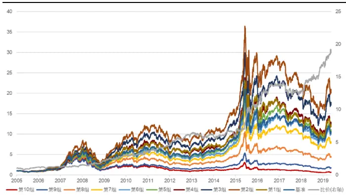
资料来源：天软科技，长江证券研究所

图 2：中证 800基础反转因子回测净值
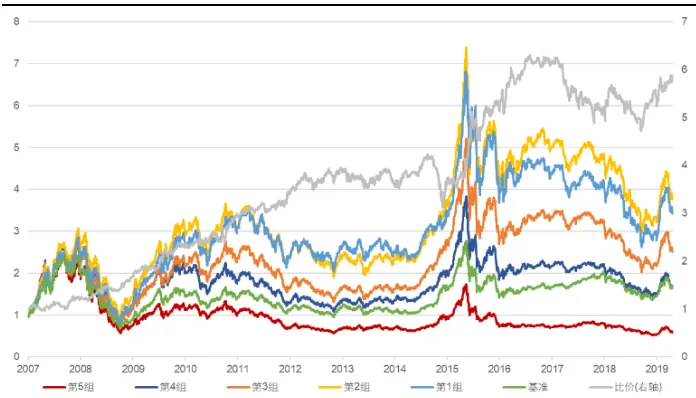
资料来源：天软科技，长江证券研究所

表 1：基础反转因子风险指标

| 全市场 |  |  |  |  | 中证800 |  |  |  |
| --- | --- | --- | --- | --- | --- | --- | --- | --- |
|  | 超额收益(%) | 信息比 | 多空收益(%) | 多空夏普比 | 超额收益(%) | 信息比 | 多空收益(%) | 多空夏普比 |
| 2005 | 5.52 | 0.46 | 19.71 | 0.95 |  |  |  |  |
| 2006 | 0.46 | 0.12 | -1.96 | -0.07 | 1 | - | - | - |
| 2007 | 3.63 | 0.42 | 30.88 | 1.55 | 15.01 | 1.11 | 22.84 | 1.45 |
| 2008 | 2.90 | 0.55 | 38.38 | 2.13 | 16.47 | 1.22 | 29.98 | 2.10 |
| 2009 | 3.99 | 0.65 | 43.35 | 2.85 | 33.34 | 2.86 | 47.31 | 3.17 |
| 2010 | -1.27 | -0.10 | 17.09 | 0.98 | 21.27 | 1.96 | 20.89 | 1.24 |
| 2011 | 1.02 | 0.11 | 29.99 | 2.57 | -1.84 | -0.30 | 14.75 | 1.36 |
| 2012 | 8.33 | 1.31 | 36.27 | 2.67 | 3.15 | 0.47 | 17.66 | 1.46 |
| 2013 | -5.05 | -0.78 | -3.99 | -0.17 | 6.73 | 0.89 | -0.09 | 0.12 |
| 2014 | -14.85 | -2.47 | -3.99 | -0.19 | -20.25 | -2.03 | -18.66 | -1.40 |
| 2015 | 18.21 | 1.72 | 82.39 | 3.17 | 47.62 | 2.60 | 70.98 | 2.86 |
| 2016 | 1.14 | 0.18 | 29.66 | 2.24 | -1.87 | 0.00 | 16.50 | 1.45 |
| 2017 | -12.38 | -2.03 | -7.40 | -0.54 | -21.11 | -2.32 | -16.47 | -1.42 |
| 2018 | 5.75 | 1.02 | 31.42 | 2.49 | -3.94 | -0.24 | 3.32 | 0.41 |
| 2019(至今) | 2.25 | 1.23 | 14.73 | 3.40 | 1.97 | 0.56 | 9.44 | 2.16 |
| 总计 | 1.10 | 0.16 | 23.77 | 1.45 | 6.40 | 0.59 | 16.08 | 1.11 |

资料来源：天软科技，长江证券研究所

表 2：全 A股基础反转因子分组年化收益
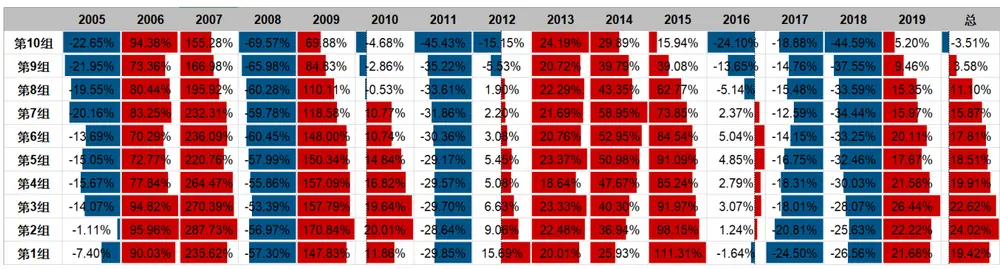
资料来源：天软科技，长江证券研究所

表 3：中证 800基础反转因子分组年化收益
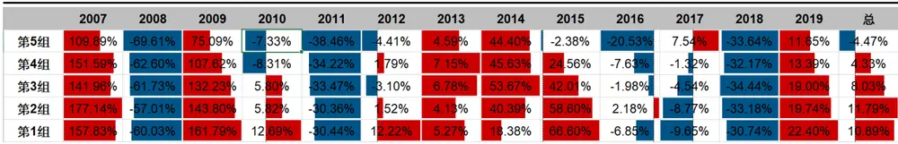
资料来源：天软科技，长江证券研究所

简单以过去 21日收益率构建的基础反转因子有一定的选股能力。

基础反转因子选股波动较大，回撤年份较多，尤其在中证 800 范围内。

反转因子的分组线性性不佳。

针对以上三点，本文从高频数据出发，对基础反转因子给出改进。

## 高频反转因子构建

## 反转的本质

反转因子投资的核心逻辑为均值回归，重点在投资者对市场变化的过度反应导致资产价格的局部错误定价，而什么样的价格变动更容易修复，什么样的价格变动较难回归，会直接影响到构建的反转因子的表现，这一点可以从之前市场中的交易行为寻找有用信息。

## 为何反转

价格的变动伴随着投资者的交易行为，成交的活跃程度影响价格变动的性质。在分析成交活跃度时，将其分为被动成交活跃度和主动成交活跃度：

被动成交活跃度是指当前市场环境下个股的成交水平中枢，主要和当前市场整体水平和个股特质有关，如牛市时个股成交水平会显著提升，大市值股票的成交较小市值股票会更为活跃。从时间维度上看，被动成交活跃度会有阶段性变化，但中短期内变化缓慢。

主动成交活跃度是指在一段时间区间内由于事件、情绪波动等影响，引发个股成交水平在当前中枢上的获得脉冲增量（可以为负），如利好消息带来的放量上涨，股价停滞上行导致的缩量盘整。从时间维度上看，主动成交活跃度构成了局部交易行为的差异。

从交易行为角度出发，市场交易的本质在于多空双方的力量对比，博弈状态会直接影响反转效应的强弱，当一方力量明显压过另一方时，价格变动往往具有较强的不可逆性，直到双方力量再次达到一个动态平衡标志价格进入一个博弈区间。主动成交活跃度（即中短期的相对成交量）可以衡量市场在交易层面多空力量的博弈激烈情况，成交越活跃，双方博弈越强。

图 3 给出了中证 500 指数在 2010-07-07 到 2011-06-17 期间的日 k 线图走势，图中以红色框圈出了指数的上升阶段，并可以根据成交活跃程度分为量段区间：

2010-07-07 至 2010-09-16 为第一阶段，被动成交活跃度在 109 亿以下，且上升的前半段主动成交量小于调整的后半段主动成交量，即上升区间主动成交活跃度较低，双方博弈较弱，指数在到达新的价格中枢后进入了较长时间的盘整，点位没有明显回落。

2010-09-17 至 2010-12-29 为第二阶段，被动成交活跃度在 109 亿以上，且上升的前半段主动成交量小于下降的后半段主动成交量，即上升区间主动成交活跃度较高，双方博弈较强，在到达新的价格中枢后很快回落。

图 3：沪深 300指数 k线图
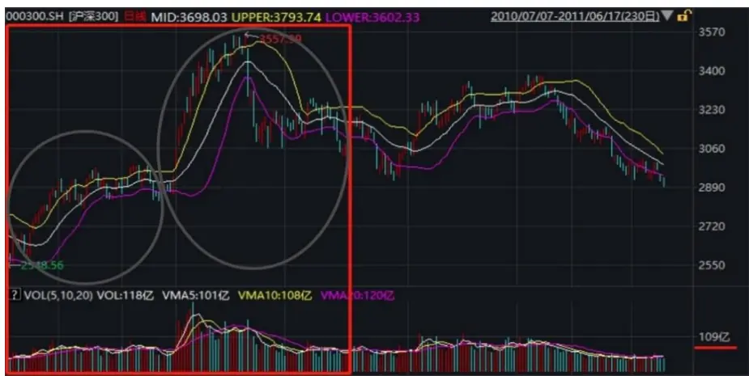
资料来源：Wind, 长江证券研究所

所以一般来说，主动成交活跃度越高，双方博弈越激烈，价格不确定性越强，价格变动具有较强可逆性，即局部成交量越高，价格变动越容易反转。价格在变动时成交量较小，市场的预期相对一致，价格变动往往是不可逆的；而如果价格的变动伴随着较高的换手，市场的多空双方博弈激烈，价格更容易偏离其正常水平，后期更容易反转。针对这一现象，可以从相对高频的数据口径下，以成交量为另一变量对基础反转因子给出改进。

## 反转因子的通式和因子构建

在改进基础反转因子之前，首先要对反转因子在数学上的通用形式给出表达。基础反转因子的计算方式为过去 21 天收益率，本质为 21 天日度累计涨跌幅，表达式如下：

$$
\mathrm{Rev}=\frac{\mathrm{Close}_{t}-\mathrm{Close}_{t-21}}{\mathrm{Close}_{t-21}}\propto\log\frac{\mathrm{Close}_{t}}{\mathrm{Close}_{t-21}}=\sum_{i=1}^{21}\log\frac{\mathrm{Close}_{t-i+1}}{\mathrm{Close}_{t-i}}
$$

可以看出，基础反转因子为综合过去 21 天价格变化信息，给出其对数的等权加和。针对此构造方式，可以给出两个维度的改进：

加权的维度。量价因子最广义的变化即为针对信息综合的形式，给出相应的加权方式，如从时间维度出发，按照时间序列排序加权求和。下式展示了以半衰期的时间尺度加权方式，构造反转因子的表达通式，其中 $w_{i}$ 为每日价格变动的加权方式，τ为半衰期。

$$
\mathrm{Rev}_{time}=\sum_{i=1}^{21}w_i\log\frac{\mathrm{Clos}_{t-i+1}}{\mathrm{Clos}_{t-i}},w_i\propto\frac{1}{e^{-\tau i}}
$$

时间段划分的维度。传统量价因子在构建时多以日度数据为基础，如波动率因子以日度收益率计算标准差，而低频的数据往往损失较多信息。对于基础反转因子来说，简单的使用过去一段时间的总累计收益率只用到了交易的结果数据，并没有利用到交易的过程数据，故可以适当提高数据频率实现信息的表达。下式展示了以更高频的时间段划分方式，构造反转因子表达通式，即为广义上反转因子的通式，其中period为过去一段时间按一定规则划分时间段的总时间段个数， $w_{i}$ 为每个时刻价格变动的加权方式。

$$
\mathbf{Rev}_{per}=\sum_{i=1}^{period}w_i\log\frac{Class_{t-i+1}}{Class_{t-i}}
$$

本文基于反转效应在交易行为上的体现，即成交越活跃价格容易反转，给出按成交量加权的高频反转因子构建方式，如下式：

$$
\mathrm{Rev}_{vol}=\sum_{i=1}^{period}w_i\log\frac{Class_{t-i+1}}{close_{t-i}},w_i\propto volume_i
$$

下面给出 10 分钟频率、30 分钟频率和 60 分钟频率高频反转因子的相关分析，以及 10分钟频率下因子的表现，如无特指，下文中高频反转因子即指 10 分钟频率下的高频反转因子。

## 因子性质

首先从与风格因子相关性、因子 IC 和因子半衰期上，给出因子性质的讨论。

以高频量价数据构建的因子，和传统的风格因子中量价因子相关性较高，这里我们选取了市值、波动率、流动性和基础反转因子，与构建的 3 个高频反转因子做相关性上的展示，结果如表 4 所示。可以得到以下结论：

高频反转因子和基础反转因子相关性较高，且随着数据的频率降低，相关性在增加。

和基础反转因子相比，高频反转因子和波动率及换手率的相关性更高。

反转类因子和市值因子均无明显相关性。

表 4：高频反转因子与量价风格因子相关性

|  | 10分钟线 | 30分钟线 | 60分钟线 | 市值 | 换手率 | 反转 | 波动率 |
| --- | --- | --- | --- | --- | --- | --- | --- |
| 10分钟线 | 1.00 | 0.93 | 0.88 | -0.05 | 0.26 | 0.63 | 0.35 |
| 30分钟线 | 0.93 | 1.00 | 0.96 | -0.03 | 0.25 | 0.70 | 0.35 |
| 60分钟线 | 0.88 | 0.96 | 1.00 | -0.01 | 0.26 | 0.75 | 0.35 |
| 市值 | -0.05 | -0.03 | -0.01 | 1.00 | -0.36 | 0.07 | -0.17 |
| 换手率 | 0.26 | 0.25 | 0.26 | -0.36 | 1.00 | 0.18 | 0.61 |
| 反转 | 0.63 | 0.70 | 0.75 | 0.07 | 0.18 | 1.00 | 0.22 |
| 波动率 | 0.35 | 0.35 | 0.35 | -0.17 | 0.61 | 0.22 | 1.00 |

资料来源：天软科技，长江证券研究所

图 4 和图 5 展示了基础反转因子和高频反转因子（三个频率）自身截面相关性和 IC 时间序列。为检测反转类因子信息衰减的速度，计算了月末因子值与接下来每 10 个交易日收益率的 IC 情况，拟合得到各个因子的半衰期，并根据 Grinold 的理论，将半衰期带入公式 $\begin{array}{r}{IC_{T}=IC_{0}\sqrt{\frac{1}{T}\frac{1-\delta^{T}}{1-\delta}}}\end{array}$ ，其中δ为衰减系数，得到拟合累积 IC 曲线。图 6 和图 7 分别给出了基础反转因子和高频反转因子的半衰期图。最后表 5 给出了因子 IC 和半衰期的相关统计。可以得到以下结论：

不论是自身的截面相关性还是 IC 值，时间序列上基础反转因子的波动均高于高频反转因子（三个频率），这点也可以从因子 IC_IR 的显著差别上体现。

高频反转因子（三个频率）数据频率越高，自身截面相关性越高。

高频反转因子（三个频率）的 IR 在-0.09 之上，比基础反转因子高出近 2 个百分点，IC_IR 在 1 左右，相比基础反转因子得到显著提升。

高频反转因子（三个频率）的测算的半衰期显著高于基础反转因子，但从散点图的分布上可以看出，基础反转因子的 IC 序列不稳定。

图 4：高频反转因子截面相关性
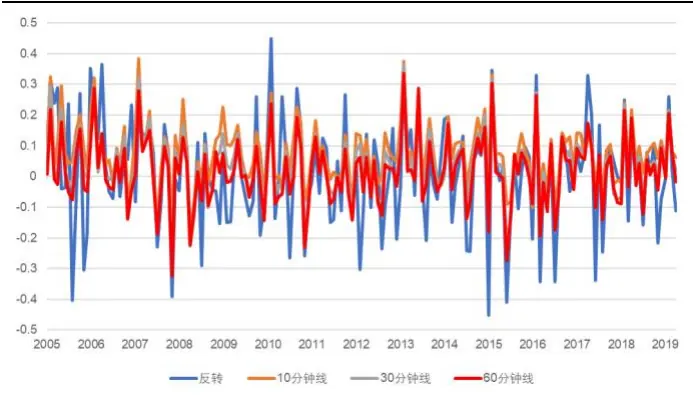
资料来源：天软科技，长江证券研究所

图 5：高频反转因子 IC时间序列
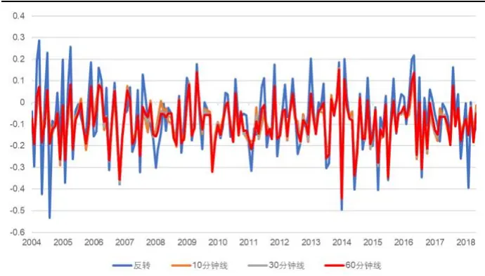
资料来源：天软科技，长江证券研究所

图 6：基础反转因子半衰期
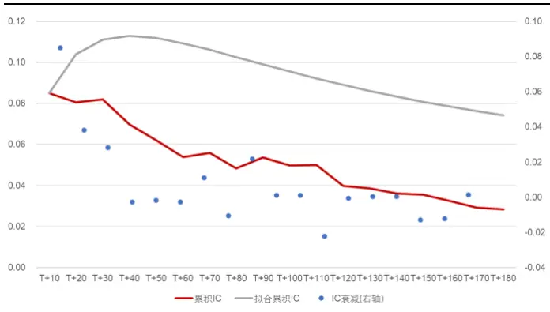
资料来源：天软科技，长江证券研究所

图 7：高频反转因子半衰期
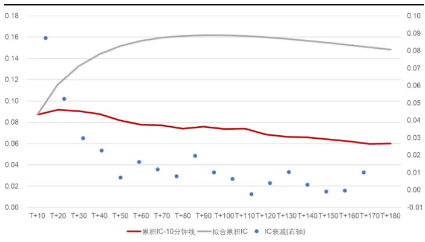
资料来源：天软科技，长江证券研究所

表 5：高频反转因子统计

|  | 反转 | 10分钟线 | 30分钟线 | 60分钟线 |
| --- | --- | --- | --- | --- |
| 平均截面相关性 | 1.06% | 7.69% | 3.70% | 1.66% |
| 平均IC | -7.31% | -9.22% | -9.36% | -9.11% |
| IC_IR | -47.47% | -100.55% | -96.98% | -88.28% |
| 半衰期（天） | 22 | 51 | 50 | 51 |

资料来源：天软科技，长江证券研究所

## 因子回测

本章探讨高频反转因子在全 A 股和中证 800 范围内的表现。

## 全 A 股

图 8 给出了全 A 股高频反转因子分组回测的净值曲线，表 6 给出了高频反转因子每组分年及整个时间段的年化收益，在表 7 中给出了高频反转因子选股第 1 组的风险指标，可以得到以下结论：

整体来看，高频反转因子有较好的区分能力，头部组可以获得相对稳定的超额收益。

从分组情况来看，除第 1、2 组外，最终净值分布严格以因子分组结果呈线性排列。更进一步，除 2014 和 2017 年，分组选股收益基本呈现线性，第 1 组在 2006 年、2008 年、2010 年、2012 年均为全组最高。

和基础反转因子相比，高频反转因子可以获得更高的超额和多空收益表现，且收益风险比更高，多空比价曲线走势更为平缓。高频反转因子在 2013 年未出现回撤，且回撤的年份负超额收益显著减小。

图 8：全 A股高频反转因子回测净值
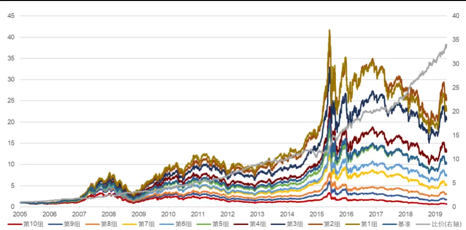
资料来源：天软科技，长江证券研究所

表 6：全 A股高频反转因子风险指标

|  | 年化收益(%)最大回撤(%)夏普比 |  |  | 超额收益(%) | 超额最大回撤(%) 信息比 |  | 多空收益(%) | 多空最大回撤(%) 多空夏普比 |  |
| --- | --- | --- | --- | --- | --- | --- | --- | --- | --- |
| 2005 | -7.29 | 37.11 | -0.24 | 5.64 | 6.75 | 0.87 | 30.98 | 3.79 | 3.04 |
| 2006 | 107.93 | 14.69 | 3.19 | 8.73 | 4.07 | 1.51 | 34.31 | 4.77 | 3.42 |
| 2007 | 277.10 | 21.35 | 3.72 | 16.81 | 8.36 | 1.88 | 39.00 | 7.90 | 2.54 |
| 2008 | -52.06 | 67.24 | -1.23 | 13.61 | 4.63 | 2.04 | 30.06 | 11.09 | 2.14 |
| 2009 | 168.12 | 17.79 | 3.12 | 8.54 | 5.77 | 1.49 | 25.84 | 5.60 | 2.48 |
| 2010 | 23.66 | 26.99 | 0.92 | 8.79 | 4.07 | 1.19 | 31.41 | 7.90 | 2.19 |
| 2011 | -26.75 | 33.73 | -1.30 | 3.15 | 2.63 | 0.75 | 25.09 | 3.26 | 2.84 |
| 2012 | 11.67 | 24.80 | 0.67 | 7.76 | 2.84 | 1.52 | 35.30 | 2.48 | 4.01 |
| 2013 | 28.66 | 15.73 | 1.35 | 2.31 | 3.32 | 0.60 | 12.33 | 7.23 | 1.42 |
| 2014 | 37.50 | 11.22 | 1.75 | -7.37 | 11.32 | -1.46 | 3.88 | 14.18 | 0.49 |
| 2015 | 107.38 | 47.65 | 1.90 | 15.51 | 6.06 | 2.18 | 59.78 | 6.45 | 3.81 |
| 2016 | -6.59 | 24.35 | 0.22 | 4.86 | 5.46 | 0.88 | 22.31 | 5.75 | 2.43 |
| 2017 | -20.74 | 23.77 | -1.38 | -8.55 | 9.48 | -2.10 | 15.24 | 7.07 | 2.16 |
| 2018 | -26.38 | 34.38 | -1.10 | 5.43 | 3.54 | 1.22 | 31.13 | 3.08 | 3.93 |
| 2019(至今) | 19.29 | 15.77 | 1.79 | 1.02 | 2.03 | 1.17 | 11.08 | 2.68 | 3.95 |
| 总计 | 25.20 | 67.24 | 0.87 | 5.98 | 12.20 | 0.98 | 28.98 | 14.83 | 2.54 |

资料来源：天软科技，长江证券研究所

表 7：全 A股高频反转因子分组年化收益

| 2005 2006 |  |  | 2007 2008 2009 |  |  | 2010 | 2011 2012 |  |  | 2013 2014 2015 2016 |  |  |  |  | 2017 2018 2019 总 |  |  |  |  |
| --- | --- | --- | --- | --- | --- | --- | --- | --- | --- | --- | --- | --- | --- | --- | --- | --- | --- | --- | --- |
| 第10组 | -29.22% | 54.51% | 171.2828% | -64.11% | 104.377% | 6.23% | -42.22% | -15 | 05% | 19% | 31.09% | 28.27% | -16.21 | % | -31.85% | -44.39% | 7.13% |  | -2.93% |
| 第9组 | -199.52% | 72.64% | 187.088% | -66.85% | 98.922% | 1.33% | -39.54% | -7.9 | 1% | 15.28% | 46.58% | 48.47% | -18.08 | % | -23.81% | -39.00% | 15.84% |  | 3.82% |
| 第8组 | -183.55% | 79.06% | 203.93% | -66.57% | 105.48% | .95% | -34.36% | 3 | 7% | 16.996% | 41.89% | 55% | -6.799 | % | -13.1 | -35.86% | 15.75% |  | .06% |
| 第7组 | -19.80% | 82.87% | 211.549do | -59.38% | 119.06% | 7.668% | -36.40% | 1.3 | 7% | 19.783% | 52.21% | 63.377% | -4. % | o | -16.37% | -36.44% | 16.17% |  | 12.43% |
| 第6组 | -14.335% | 82.64% | 194.97% | -61.59% | 127.21% | 11.70% | -32.87% | 3.1 | 6% | 25.65% | 38.98% | 85.05% | -2.00 | Yo | -11.05 | 30.98% | 16.66 | % | 15.39% |
| 第5组 | -1716% | 82.60% | 231.74% | -59.59% | 142.51% | 8.556% | -29.23% | 6.5 | 6% | 19.05% | 48.96% | 87.53% | 2.74% |  | -11.51% | -300.73% | 18.50% |  | 18.189 |
| 第4组 | -12.85% | 91.04% | 241.33% | -55.80% | 148.49% | 66% | -23.70% | 7.7 | 6% | 24.95% | 40.47% | 86.87% | 4.80% |  | -13.37% | -283.57% | 18.45% |  | 20.24% |
| 第3组 | -7.13% | 93.54% | 260.73% | -54.02% | 137.10% | 20.05% | -25.75% | 11.9 | 3% | 21.37% | 44.93% | 94.87% | 7.73% |  | -13.08% | -2627% | 22.51% |  | 24.34% |
| 第2组 | -2.82% | 94.25% | 278.23% | -55.77% | 160.85% | 18.22% | -25.77% | 12.2 | 9% | 31.49% | 43.33% | 107.84% | 4.12% |  | -16.11% | -2632% | 23.55% |  | 26.16% |
| 第1组 | -7.29% | 105.61% | 277.57% | 53.39% | 158.71% | 23.28% | -28.15% | 14. | 9% | 29.67% | 36.679do | 106.50% | 2.03% |  | -2.27% | -26.87% | 20.50% |  | 25.19% |

资料来源：天软科技，长江证券研究所

在构建高频反转因子的过程中，用到了成交量进行价格变动的加权求和，故新的因子会受到交易层面如流动性和波动率的影响，在因子统计一节的统计中也可以看到，和基础反转因子相比，高频反转因子与其相关性更高，故为了排除其影响，分别对基础反转因子和高频反转因子做对换手率因子和波动率因子的中性化处理，给出选股结果的比较。图 9 和图 10 分别给出了中性后基础反转因子和高频因子分组回测的净值曲线，表 8 给出了因子选股第 1 组的风险指标，可以得到以下结论：

整体来看，高频反转因子可以获得更高的超额和多空收益，信息比和多空夏普比均有显著提升，且多空比价 10 分钟高频因子更为平滑。

从分组结果上看，高频反转因子仅在第1、2组没有按照因子的分组结果线性顺序，而基础反转因子前五组均存在错位情况。

图 9：全 A股基础反转因子回测净值（中性后）
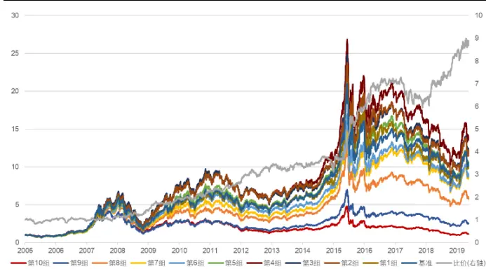
资料来源：天软科技，长江证券研究所

图 10：全 A股高频反转因子回测净值（中性后）
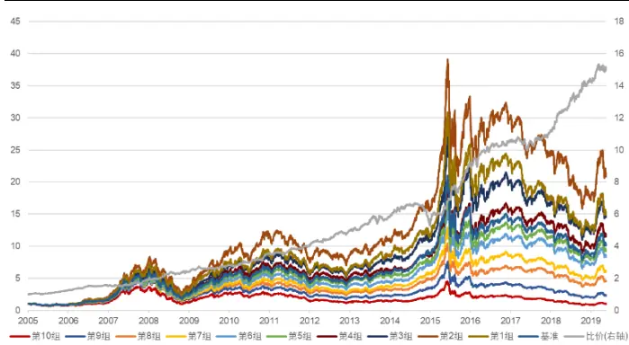
资料来源：天软科技，长江证券研究所

表 8：全 A股基础反转因子、高频反转因子风险指标（中性后）

| 基础反转 |  |  |  |  | 高频反转因子(10分钟) |  |  |  |
| --- | --- | --- | --- | --- | --- | --- | --- | --- |
|  | 超额收益(%) | 信息比 | 多空收益(%) | 多空夏普比 | 超额收益(%) | 信息比 | 多空收益(%) | 多空夏普比 |
| 2005 | 0.19 | -0.11 | 5.29 | 0.30 | 5.58 | 0.92 | 25.50 | 3.13 |
| 2006 | -4.62 | -0.60 | -10.10 | -0.68 | 5.30 | 0.93 | 22.09 | 2.71 |
| 2007 | 7.38 | 0.89 | 22.81 | 1.37 | 9.75 | 1.25 | 25.93 | 1.95 |
| 2008 | -6.89 | -0.64 | 19.97 | 1.26 | 2.86 | 0.50 | 23.84 | 2.05 |
| 2009 | 1.82 | 0.29 | 38.88 | 2.72 | 6.15 | 0.95 | 18.08 | 1.97 |
| 2010 | 0.93 | 0.09 | 16.50 | 1.03 | 4.39 | 0.67 | 25.33 | 2.37 |
| 2011 | -1.51 | -0.35 | 19.53 | 1.82 | -2.21 | -0.61 | 15.10 | 2.14 |
| 2012 | 5.40 | 0.95 | 25.27 | 2.07 | 1.64 | 0.45 | 22.12 | 2.98 |
| 2013 | -1.97 | -0.27 | 0.31 | 0.14 | 5.75 | 1.02 | 17.36 | 1.98 |
| 2014 | -13.13 | -2.18 | -6.85 | -0.52 | -10.70 | -1.79 | -8.31 | -0.81 |
| 2015 | 23.36 | 2.27 | 89.96 | 3.74 | 22.30 | 2.74 | 71.15 | 4.53 |
| 2016 | -1.91 | -0.28 | 18.80 | 1.79 | 2.36 | 0.50 | 15.85 | 2.15 |
| 2017 | -13.02 | -2.01 | -11.18 | -0.88 | -12.37 | -2.55 | 5.11 | 0.83 |
| 2018 | 5.89 | 1.04 | 30.01 | 2.51 | 3.75 | 0.76 | 28.41 | 3.79 |
| 2019(至今) | 0.63 | 0.36 | 8.02 | 1.79 | -0.81 | -0.32 | 5.87 | 2.45 |
| 总计 | -0.19 | 0.00 | 17.06 | 1.19 | 2.84 | 0.46 | 21.66 | 2.19 |

资料来源：天软科技，长江证券研究所

## 中证 800

本节针对高频反转因子，在中证 800 范围内给出回测结果，图 11 和图 12 分别给出了高频反转因子中性前后分组回测的净值曲线，表 9 给出了高频反转因子每组分年及整个时间段的年化收益，表 10 给出了高频反转因子中性前后选股第 1 组的风险指标，可以得到以下结论：

整体来看，中性前后高频反转因子均可获得较为稳定的超额收益，仅 2014 年有多空收益上的回撤；中性后因子的表现有一定下降。

从分组情况来看，最终的净值分布严格按照因子的分组结果呈线性排列，除 2014年和 2017 年，分组选股收益排序基本呈现线性。

和基础反转因子相比，在中证 800 内高频反转因子可以获得更高的超额和多空收益表现，且收益风险比更高，多空比价曲线走势更为平缓。从多空上看，高频反转因子仅在 2014 年出现明显回撤，相比基础反转因子多出的 2013 和 2017 年有显著提升。

图 11：中证 800高频反转因子回测净值
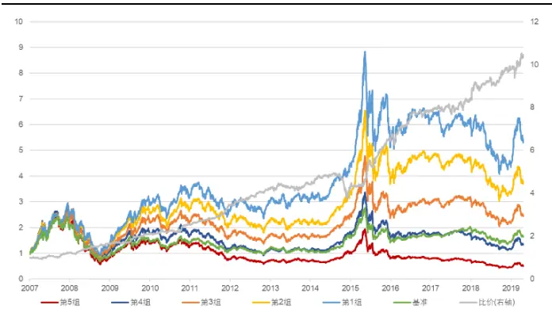
资料来源：天软科技，长江证券研究所

图 12：中证 800高频反转因子回测净值（中性后）
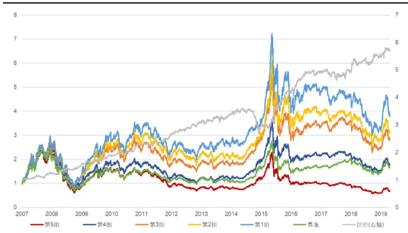
资料来源：天软科技，长江证券研究所

表 9：中证 800高频反转因子分组年化收益

|  | 2007 | 2008 | 2009 | 2010 | 2011 | 2012 | 2013 | 2014 | 2015 | 2016 | 2017 | 2018 | 2019 | 总 |
| --- | --- | --- | --- | --- | --- | --- | --- | --- | --- | --- | --- | --- | --- | --- |
| 第5组 | 123.33% | -69.93% | 103.12% | 725% | -43.42% | -931% | 53% | 48.41% | -0.11% | -19.61% | -10.63% | -39.60% | 15.07% | 5.56% |
| 第4组 | 144.53% | -64.37% | 99.29% | 1.90% | -37.19% | 425% | 4.34% | 51.65% | 22.51% | -12.81% | -1.78% | -34.86% | 18.16% | 243% |
| 第3组 | 139.78% | -60.10% | 124.62% | 10% | 31.29% | 2 2.56% | 3.09% | 41.47% | 33.41% | -0.39% | 3.38% | -31.15% | 14.78% | 7.78% |
| 第2组 | 165.21% | -58.18% | 129.82% | 495% 4 | -27 7.46% | 5 | 4.25% | 36.00% | 61.77% | 0.88% | -3.10% | -29.47% | 14.41 1% | 1.62% |
| 第1组 | 165.18% | -58.11% | 159.75% | .70% 1 | -26.54% | 14 29% | 12.29% | 25.1 12% | 72.49% | -2.50% | -5 .03% | -28.29% | 23.80% | 15.08% |

资料来源：天软科技，长江证券研究所

表 10：中证 800高频反转因子风险指标

| 中证800内 |  |  |  |  | 中证800内(中性后) |  |  |  |
| --- | --- | --- | --- | --- | --- | --- | --- | --- |
|  | 超额收益(%) | 信息比 | 多空收益(%) | 多空夏普比 | 超额收益(%) | 信息比 | 多空收益(%) | 多空夏普比 |
| 2007 | 18.29 | 1.36 | 18.74 | 1.57 | 18.18 | 1.25 | 22.48 | 2.14 |
| 2008 | 23.02 | 1.81 | 39.17 | 3.04 | 15.44 | 1.02 | 19.41 | 1.97 |
| 2009 | 31.79 | 3.14 | 26.50 | 2.57 | 35.48 | 2.85 | 27.66 | 2.85 |
| 2010 | 20.40 | 2.14 | 20.27 | 1.54 | 19.91 | 1.81 | 24.05 | 2.15 |
| 2011 | 3.25 | 0.55 | 30.82 | 3.85 | -5.13 | -0.76 | 10.17 | 1.47 |
| 2012 | 5.45 | 0.78 | 26.36 | 3.17 | 1.06 | 0.28 | 20.25 | 2.77 |
| 2013 | 14.00 | 1.82 | 7.39 | 0.83 | 13.29 | 1.50 | 8.71 | 1.09 |
| 2014 | -15.36 | -1.60 | -15.73 | -1.46 | -17.03 | -1.70 | -18.61 | -2.04 |
| 2015 | 53.12 | 3.10 | 72.53 | 4.02 | 44.65 | 2.70 | 56.77 | 3.97 |
| 2016 | 3.03 | 0.53 | 21.25 | 2.66 | 2.37 | 0.42 | 16.35 | 2.16 |
| 2017 | -17.09 | -2.24 | 5.82 | 0.82 | -18.27 | -2.16 | 0.68 | 0.17 |
| 2018 | -0.46 | 0.06 | 17.92 | 2.02 | -5.18 | -0.44 | 10.06 | 1.20 |
| 2019(至今) | 2.80 | 0.96 | 6.55 | 1.70 | 0.01 | 0.06 | 4.13 | 1.42 |
| 总计 | 10.43 | 1.02 | 21.87 | 1.91 | 7.24 | 0.67 | 15.81 | 1.63 |

资料来源：天软科技，长江证券研究所
请阅读最后评级说明和重要声明

高频反转因子相比于基础反转因子，截面变化更为稳定。

高频反转因子相比于基础反转因子，在全 A股范围内和中证 800 范围内，在相对换手率因子和波动率因子中性前后，均有更好表现。

在全 A股范围内，高频反转因子除第 1、2组外，净值分布严格以因子分组结果呈线性排列，在中证 800范围内，净值分布严格以因子分组结果呈线性排列。

## 结构化反转因子

以成交量加权构建的高频反转因子可以很好的提升反转效应获取超额收益的稳定性，头部组可以获得更高的超额收益，且收益风险比也有较大改善，在分组的线性区分度上也有一定的提升，但在头部组的区分上仍存在第 2 组表现比第1 组表现更好的情况。针对这一问题，本节加入动量效应的讨论，尝试构建结构化反转因子。

## 反转类因子在头部区分的思考

反转效应的关键在于股票价格存在错误定价，所以最终会回归到其内在价值，即要求股价的变动是围绕其真实价值产生的波动。而实际情况股价的变动本身就包含了价值和价格两个部分的变化，其中价格变化由于均值回归的特性，产生了反转效应；而价值的变化由于本身就是正确的定价，存在不可逆性，甚至在信息传递存在滞后的情况下产生了动量效应。

在上文的讨论中，都只考虑了中短期的反转效应，而实际上对于个股来说反转效应和动量效应在短期内皆存在，只是由于 A 股市场波动较大的特点，导致反转效应一直为全市场的主矛盾，即为绝大多数个股的主矛盾，但依然存在动量效应为主矛盾的个股。回到反转因子头部区分的问题，高频反转因子除了第 1、2 组外，分组净值均按照因子值呈线性排列，关键问题在第 1组本质上为股价负向变动程度最大的组，这种价格变动的幅度会同时正向增强个股的反转效应和动量效应：

反转效应的增强即体现在以反转为矛盾的个股在未来有更大幅度的反弹，组合相比于基准可以获得更为显著的超额收益；

动量效应的增强即体现在以动量为矛盾的个股在未来有更强的下跌趋势，最终拖累组合的收益，导致收益能力不如第 2 组。

在“反转的本质”一节中，我们从多空博弈的角度，给出了在一段时间区间内，成交量越高反转效应越强的结论，更进一步，不论是多空双方博弈的力量对比还是成交量的局部差异，本质都是信息在股市中传递展现的结果，核心还在有多少信息伴随着交易行为被市场消化。这里以一字板的特例来推演从信息到多空博弈，最终到价格变动的逻辑。图 13 和图14 分别给出了格力电器和乐视网局部 k 线图：

2019-04-01 格力电器发布了计划股权变更的停牌公告，并在 2019-04-09 重新复牌，复牌当日，利好消息以开盘一字板封板涨停的形式被市场迅速消化，多头力量呈压倒性优势，在成交量很小的情况下价格迅速打到当时的合理价位；随后在

2019-04-10 到 2019-04-19 的时间段，伴随着放量上涨，信息进一步释放，多空双方力量逐渐均衡，并在之后开始回调，到达最初信息释放时的价格中枢。

2018-01-24 乐视网在乐视事件发酵后的首日复牌，在接下来的 11 个交易日，利空消息以开盘一字板封板跌停的形式被市场迅速消化，空头力量呈压倒性优势，在成交量很小的情况下价格迅速打到当时的合理价位；随后在 2018-02-08 到 2018-04-16 的时间段放量调整，进入多空双方博弈期，并在初期仍展现出一定的下跌韧性，直到力量均衡后，达到最初信息释放时的价格中枢。

图 13：格力电器 k线图
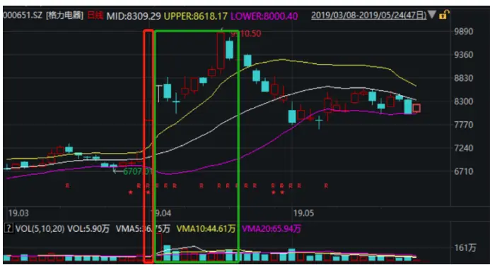
资料来源：天软科技，长江证券研究所

图 14：乐视网 k线图
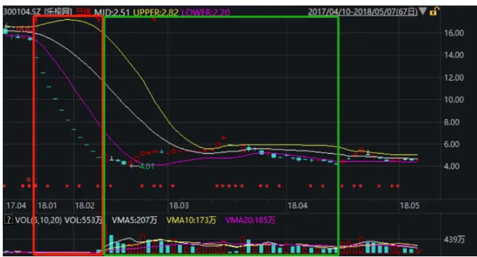
资料来源：天软科技，长江证券研究所

可以看出，不论是上涨还是下跌，在新的信息进入市场时会被迅速消化，多空力量会呈现明显不均衡的状态，导致在成交很低的情况下价格迅速到达相对合理价格中枢，多空双方几乎不存在博弈，价格呈现很强的确定性，不可逆性强，并具有一定的动量效应；直到信息基本被市场消化进入到多空双方博弈期，有一个明显放量的过程，成交量提升到一个新的水平，价格不确定性增强，呈现反转效应。即局部看来，存在一个成交量的阈值，使得小于该阈值时的价格变动呈现动量效应，大于该阈值时的价格变动呈现反转效应。

## 结构化反转因子构建

由上一节的分析中可知，交易层面的反转效应会和成交活跃程度相关，成交量越低反转效应越弱，且到达一定阈值后转变为动量效应。基于此特性，给出了结构化反转因子的构建：

根据一段时间内每个时间段的成交量，从小到大进行排序，以一个比例为临界点，取小于临界点的时间段作为动量时间段，记为 $period_{mom}$ ，大于临界点的时间段作为反转时间段，记为 $period_{rev}$ ，其中period为过去一段时间按一定规则划分时间段的总时间段个数， $period=period_{mom}\cup period_{rev}\text{ 。 }$

以成交量倒数加权的形式，构建动量时间段反转因子：

$$
\mathbf{Rev}_{mom}=\sum_{i=1}^{period_{mom}}w_i\log\frac{Class_{t-i+1}}{Class_{t-i}},w_i\propto\frac{1}{volume_i}
$$

以成交量加权的形式，构建反转时间段反转因子：

$$
\mathrm{Rev}_{rev}=\sum_{i=1}^{period_{rev}}w_i\log\frac{Close_{t-i+1}}{Close_{t-i}},w_i\propto volume_i
$$

以动量时间段反转因子和反转时间段反转因子合成结构化反转因子：

$$
\mathrm{Rev}_{struct}=\mathrm{Rev}_{rev}-\mathrm{Ret}_{mom}
$$

在研究过程中，我们分别从小到大对成交量给出排序，以 10%、15%和 20%为阈值构建结构化反转因子，并在本篇报告中展现 10%的相关结果。下面给出 10 分钟频率、30分钟频率和 60 分钟频率结构化反转因子的相关分析，并给出 10 分钟频率下因子的表现，如无特指，下文中结构化反转因子即指 10 分钟频率下的结构化反转因子。

## 因子性质

表 11 展示了 3 个结构化反转因子和传统量价风格因子的相关性，表 12 展示了结构化反转因子 IC 和半衰期的相关统计，可以得到以下结论：

结构化反转因子和基础反转因子仍有最高的相关性，但和高频反转因子相比，相关性进一步降低。

结构化反转因子和波动率及换手率因子相关性较高，但和高频反转因子相比有所下降。

结构化反转因子和市值因子无明显相关性。

和高频反转因子（三个频率）相比，同频率下的结构化反转因子（三个频率）的截面自相关性有所增加，平均 IC 值有所下降，但 IC_IR 的表现上有一定提升，因子收益的稳定性在增加。

结构化反转因子（三个频率）的测算的半衰期相比同频率下的结构化反转因子（三个频率）均有一定程度的下降，且频率越低，半衰期越低。

表 11：结构化反转因子与量价风格因子相关性

|  | 10分钟线 | 30分钟线 | 60分钟线 | 市值 | 换手率 | 反转 | 波动率 |
| --- | --- | --- | --- | --- | --- | --- | --- |
| 10分钟线 | 1.00 | 0.85 | 0.75 | -0.02 | 0.24 | 0.59 | 0.33 |
| 30分钟线 | 0.85 | 1.00 | 0.85 | 0.01 | 0.23 | 0.63 | 0.33 |
| 60分钟线 | 0.75 | 0.85 | 1.00 | 0.02 | 0.22 | 0.63 | 0.31 |
| 市值 | -0.02 | 0.01 | 0.02 | 1.00 | -0.36 | 0.07 | -0.17 |
| 换手率 | 0.24 | 0.23 | 0.22 | -0.36 | 1.00 | 0.18 | 0.61 |
| 反转 | 0.59 | 0.63 | 0.63 | 0.07 | 0.18 | 1.00 | 0.22 |
| 波动率 | 0.33 | 0.33 | 0.31 | -0.17 | 0.61 | 0.22 | 1.00 |

资料来源：天软科技，长江证券研究所

表 12：结构化反转因子统计

|  | 反转 | 10分钟线 | 30分钟线 | 60分钟线 |
| --- | --- | --- | --- | --- |
| 平均截面相关性 | 1.06% | 8.60% | 5.61% | 4.68% |
| 平均IC | -7.31% | -8.63% | -8.55% | -7.80% |
| IC_IR | -47.47% | -99.72% | -98.26% | -90.19% |
| 半衰期（天） | 22 | 50 | 43 | 35 |

资料来源：天软科技，长江证券研究所

## 因子回测

本章探讨结构化反转因子在全 A 股和中证 800 范围内的表现。

## 全 A 股

本节针对结构化反转因子，在全 A 股范围内给出回测结果，图 15 和图 16 分别给出了结构化反转因子中性前后分组回测的净值曲线，表 13 给出了结构化反转因子每组分年及整个时间段的年化收益，表 14 给出了结构化反转因子中性前后选股第 1 组的风险指标，可以得到以下结论：

整体来看，中性前后结构化反转因子均可获得较为稳定的超额收益，头部组可以获得相对稳定的超额收益，中性前因子仅在2014年和2017年有超额收益上的回撤，中性后因子仅在 2011 年、2014 年和 2017 年有超额收益上的回撤。

从分组的线性情况来看，最终的净值分布严格按照因子的分组结果呈线性排列，除2014和 2017 年，分组选股收益排序基本呈现线性。第 1 组在 2006 年、2008 年、2009 年、2010 年、2012 年、2013 年、2015 年均为全组最高，相比于基础反转因子和高频反转因子有显著提升。

和高频反转因子相比，结构化反转因子可以获得更高的超额和多空收益表现，且收益风险比更高。结构化反转出现明显回撤的年份为 2014 和2017 年，且回撤的年份负超额收益相比高频反转因子显著减小。

图 15：全 A股结构化反转因子回测净值
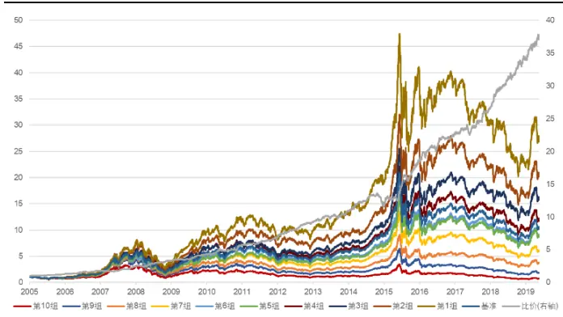
资料来源：天软科技，长江证券研究所

图 16：全 A股结构化反转因子回测净值（中性后）
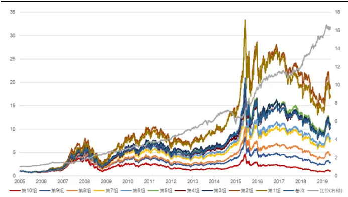
资料来源：天软科技，长江证券研究所
请阅读最后评级说明和重要声明

表 13：全 A股结构化反转因子分组年化收益

| 2005 2006 2007 2008 2009 2010 2011 2012 |  |  |  |  |  |  |  |  |  |  | 2013 |  | 2014 2015 2016 2017 2018 2019 总 |  |  |  |  |  |  |  |
| --- | --- | --- | --- | --- | --- | --- | --- | --- | --- | --- | --- | --- | --- | --- | --- | --- | --- | --- | --- | --- |
| 第10组 | -27.51% | 54.13% | 166.0000% | -65.19% | 102.77% |  | 7.80% | -40.71% | -12 | 15% | 14 | 87% | 31.40% | 1.46% | -15.08% |  | -32.12% | -43.92% | 00.61% | -2.36% |
| 第9组 | -117.94% | 72.51% | 182.772% | -65.39% | 101.224% |  | 53% | -39.53% | .9 | 17% | 15 | .57% | 45.74% | 48.77% | -20.119 | % | -222.37% | -39.53% | 19.34% | 4.44% |
| 第8组 | -20.62% | 82.99% | 213.59% | -64.68% | 115.77% |  | .88% | -37.23% | 1 | 43% | 16.6.09% |  | 47.17% | 48..67% | -4.20% |  | -13.26 | -35.48% | 18.16% | 9.81% |
| 第7组 | -18.08% | 83.45% | 229.66% | -59.78% | 117.36% |  | .62% | 31.59% | -09 | 1% | 21.40% |  | 46.18% | 67.04% | -3.319 |  | -16..64% | 33.69% | 18.26% | 13.66% |
| 第6组 | -14.35% | 78.97% | 207.96% | -57.66% | 134.23% | 2 | 0.58% | 32.72% | 2. | 41% | 20.07% |  | 46.55% | 80.08%% | -0.37% |  | -11.900% | -32.18% | 19.48%6 | 17.09% |
| 第5组 | -19.66% | 85.76% | 234.69% | -61.47% | 122.68% |  | 1.97% | -28.68% | 8. | 55% | 18.81% |  | 42.77% | 84.89% | 0.43% |  | -11.81% | 1.51% | 22.21% | 16.929% |
| 第4组 | -9.70 | 94.25% | 232.53% | -56.69% | 141.44% | 1 | 0.69% | -31.77% | 5. | 06% | 25.65% |  | 41.48% | 85.30% | 2.47% |  | -13.933% | -299.67% | 20.56% | 19.54% |
| 第3组 | -8.49% | 89.47% | 226.94% | -56.23% | 148.32% |  | 1.52% | -29.08% | 12 | 33% | 28.57% |  | 41.17% | 90.39% | 4.96% |  | -12.65 | -25.82% | 22.88% | 22.04% |
| 第2组 | -5.02% | 91.34% | 283.32% | -58.03% | 156.74% | 1 | 4.77% | -23.93% | 9. | 14% | 23.53% |  | 40.25% | 101.11% | 6.50% |  | -16.30% | -2636% | 26.33% | 24.32% |
| 第1组 | -7.46% | 106.29% | 278.04% | -52.65% | 161.64% | 2 | 3.05% | -28.20% | 16 | 12% | 35.18% |  | 41.47% | 112.55% | 2.87% |  | -200.65% | -2741% | 22.81% | 26.86% |

资料来源：天软科技，长江证券研究所

表 14：全 A股结构化反转因子风险指标

| 结构反转因子 |  |  |  |  | 结构反转因子(中性) |  |  |  |
| --- | --- | --- | --- | --- | --- | --- | --- | --- |
|  | 超额收益(%) | 信息比 | 多空收益(%) | 多空夏普比 | 超额收益(%) | 信息比 | 多空收益(%) | 多空夏普比 |
| 2005 | 5.46 | 0.92 | 27.67 | 2.99 | 3.35 | 0.58 | 19.70 | 2.59 |
| 2006 | 9.29 | 1.66 | 35.12 | 3.59 | 5.16 | 0.94 | 20.15 | 2.49 |
| 2007 | 17.00 | 2.03 | 41.96 | 2.81 | 8.21 | 1.13 | 26.65 | 2.12 |
| 2008 | 15.98 | 2.54 | 36.81 | 2.77 | 5.95 | 1.04 | 33.44 | 3.01 |
| 2009 | 9.43 | 2.15 | 27.91 | 3.05 | 8.64 | 1.59 | 23.59 | 2.60 |
| 2010 | 8.64 | 1.49 | 33.51 | 2.67 | 5.40 | 0.99 | 25.29 | 2.57 |
| 2011 | 3.13 | 0.76 | 21.86 | 2.68 | -3.29 | -0.90 | 8.50 | 1.23 |
| 2012 | 9.17 | 2.04 | 32.53 | 3.91 | 6.46 | 1.42 | 28.51 | 3.76 |
| 2013 | 6.76 | 1.72 | 17.43 | 2.10 | 6.83 | 1.31 | 17.07 | 2.16 |
| 2014 | -3.94 | -0.84 | 7.42 | 0.85 | -8.56 | -1.55 | -5.35 | -0.54 |
| 2015 | 18.99 | 2.90 | 60.57 | 4.06 | 23.24 | 3.05 | 66.62 | 4.52 |
| 2016 | 5.81 | 1.19 | 21.80 | 2.60 | 2.70 | 0.65 | 18.71 | 2.75 |
| 2017 | -7.87 | -1.99 | 16.61 | 2.43 | -13.58 | -2.94 | 3.67 | 0.65 |
| 2018 | 4.60 | 1.17 | 29.13 | 3.83 | 4.29 | 0.95 | 28.20 | 3.90 |
| 2019(至今) | 0.83 | 1.00 | 9.91 | 3.84 | 0.48 | 0.28 | 7.02 | 3.04 |
| 总计 | 7.21 | 1.31 | 29.94 | 2.81 | 3.65 | 0.64 | 22.34 | 2.38 |

资料来源：天软科技，长江证券研究所

## 中证 800

本节针对结构化反转因子，在中证 800 范围内给出回测结果，图 17 和图 18 分别给出了结构化反转因子中性前后分组回测的净值曲线，表 15 给出了结构化反转因子每组分年及整个时间段的年化收益，表 16 给出了结构化反转因子中性前后选股第 1 组的风险指标，可以得到以下结论：

整体来看，中性前后结构化反转因子均可获得较为稳定的超额收益，头部组可以获得相对稳定的超额收益，因子仅在 2014 年有多空收益上的回撤。

从分组的线性情况来看，最终的净值分布严格按照因子的分组结果呈线性排列，除2014 年，分组选股收益排序基本呈现线性。

和高频反转因子相比，结构化反转因子的收益能力略有下降，收益风险比有所降低。

图 17：中证 800结构化反转因子回测净值
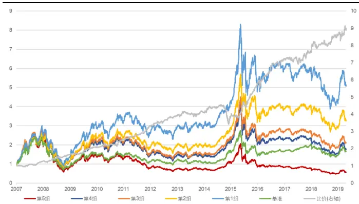
资料来源：天软科技，长江证券研究所

图 18：中证 800结构化反转因子回测净值（中性后）
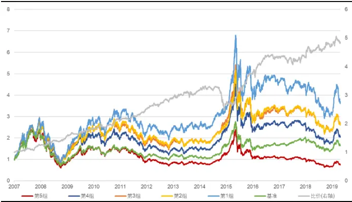
资料来源：天软科技，长江证券研究所

表 15：中证 800结构化反转因子风险指标

| 中证800内 |  |  |  |  | 中证800内(中性后) |  |  |  |
| --- | --- | --- | --- | --- | --- | --- | --- | --- |
|  | 超额收益(%) | 信息比 | 多空收益(%) | 多空夏普比 | 超额收益(%) | 信息比 | 多空收益(%) | 多空夏普比 |
| 2007 | 20.01 | 1.51 | 23.32 | 2.01 | 17.80 | 1.26 | 22.84 | 2.37 |
| 2008 | 22.36 | 1.63 | 33.80 | 2.84 | 14.94 | 0.95 | 20.01 | 2.14 |
| 2009 | 30.34 | 2.92 | 26.49 | 2.91 | 29.88 | 2.49 | 22.93 | 2.82 |
| 2010 | 19.65 | 2.12 | 18.34 | 1.58 | 19.34 | 1.79 | 19.27 | 1.98 |
| 2011 | 3.14 | 0.51 | 30.28 | 3.92 | -2.84 | -0.43 | 12.94 | 1.93 |
| 2012 | 2.84 | 0.46 | 20.33 | 2.68 | -0.08 | 0.15 | 17.84 | 2.56 |
| 2013 | 12.82 | 1.78 | 7.65 | 0.97 | 12.21 | 1.51 | 8.57 | 1.17 |
| 2014 | -15.50 | -1.59 | -17.80 | -1.64 | -16.72 | -1.62 | -19.61 | -2.11 |
| 2015 | 49.04 | 2.85 | 62.74 | 3.78 | 44.81 | 2.62 | 50.38 | 3.71 |
| 2016 | 6.63 | 0.96 | 28.50 | 3.65 | 2.64 | 0.46 | 15.60 | 2.20 |
| 2017 | -16.18 | -2.11 | 6.27 | 0.89 | -18.07 | -2.15 | 0.57 | 0.18 |
| 2018 | -2.32 | -0.15 | 12.78 | 1.57 | -5.06 | -0.44 | 7.99 | 1.03 |
| 2019(至今) | 1.99 | 0.73 | 4.98 | 1.38 | 0.23 | 0.10 | 2.50 | 1.01 |
| 总计 | 9.92 | 0.97 | 20.36 | 1.91 | 6.89 | 0.64 | 14.24 | 1.56 |

资料来源：天软科技，长江证券研究所
请阅读最后评级说明和重要声明

表 16：中证 800结构化反转因子分组年化收益
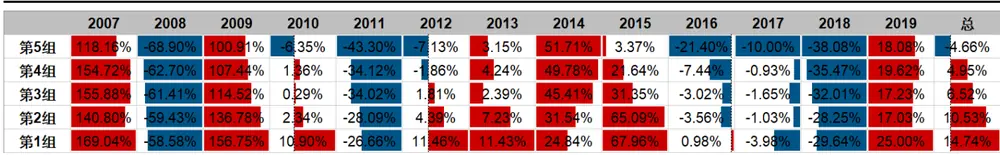
资料来源：天软科技，长江证券研究所

结构化反转因子相比于高频反转因子，平均 IC 有所降低，但因子收益更为稳定。

结构化反转因子相比于高频反转因子，在全 A 股范围内，相对换手率因子和波动率因子中性前后，均有更好表现，但在中证 800范围内结果相反。

在全 A股和中证 800范围内，结构化反转因子严格以因子分组结果呈线性排列。

## 思考

在回测的过程中，我们注意到两点更高维度影响反转类因子表现的变量，第一个是在构建结构化反转因子时讨论的，反转类因子的选股结果往往会有第 1 组表现不如第2 组表现的情况，是因为动量效应的存在以及极端价格变动对其的增强。但是还有一个值得注意的点，反转因子分组的头部和尾部均为极端价格变动，为何在只在反转的头部组存在分组非线性的现象？为何结构化反转因子在全市场表现有一个明显的提升，但在中证800中的收益能力反而下降？

为此，我们统计了回测区间内，将全市场的个股分别按照反转因子和市值因子分成十组，并统计每一个市值组内股票落在各个反转组内的频率，即条件频率p(反转 = i|市值 =j)，其中j为行数，i为列数，结果如表 17 所示，其中市值第 1 组和反转第 1 组均为最小值组。可以看到在市值最小组，个股多聚集在反转因子的头部组，即跌的最多的部分，在尾部组即涨的最多的部分比例较少，而市值最大组则相反。

表 17：以市值分组落入反转分组条件频率

| 反转市值 | 第1组 | 第2组 | 第3组 | 第4组 | 第5组 | 第6组 | 第7组 | 第8组 | 第9组 | 第10组 |
| --- | --- | --- | --- | --- | --- | --- | --- | --- | --- | --- |
| 第1组 | 12.19% | 10.88% | 10.74% | 10.59% | 10.21% | 9.95% | 9.80% | 9.44% | 8.71% | 7.49% |
| 第2组 | 10.99% | 10.33% | 10.37% | 10.71% | 10.64% | 10.41% | 9.90% | 9.72% | 8.83% | 8.09% |
| 第3组 | 10.41% | 9.97% | 10.28% | 10.38% | 10.69% | 10.62% | 10.51% | 9.56% | 8.98% | 8.61% |
| 第4组 | 10.24% | 9.90% | 10.03% | 10.29% | 10.68% | 10.37% | 9.87% | 9.80% | 9.47% | 9.37% |
| 第5组 | 9.21% | 9.81% | 10.41% | 10.61% | 10.43% | 10.43% | 10.14% | 9.48% | 9.65% | 9.84% |
| 第6组 | 9.12% | 9.82% | 10.32% | 10.32% | 10.33% | 10.34% | 10.02% | 9.73% | 9.53% | 10.47% |
| 第7组 | 9.35% | 10.03% | 10.01% | 10.12% | 9.87% | 9.71% | 9.82% | 10.07% | 10.39% | 10.64% |
| 第8组 | 9.24% | 9.85% | 9.76% | 9.45% | 9.53% | 9.54% | 9.94% | 10.48% | 10.51% | 11.71% |
| 第9组 | 9.40% | 9.84% | 9.21% | 8.96% | 9.14% | 9.51% | 9.89% | 10.65% | 11.16% | 12.22% |
| 第10组 | 9.63% | 9.36% | 8.68% | 8.37% | 8.31% | 8.91% | 9.88% | 10.83% | 12.49% | 13.53% |

资料来源：天软科技，长江证券研究所

仍然从多空博弈的角度看，小市值组更容易针对价格进行投机套利交易，而大市值则更倾向从公司基本面角度给出定价，故同样水平的成交活跃程度，小市值股票价格不确定性更强，也更容易反转。故在针对动量效应和反转效应的最优阈值确定时，或许和市值相关。

除此之外，我们还发现对于反转因子，在特定的 2014 年和 2017 年相比于基准均存在明显回撤。反转因子的收益基于反转效应，在“反转因子启示”一章中我们指出反转效应的两点核心逻辑，其中市场信息传递的滞后性保证了反转效应的存在，投资者的过度反应保证了反转效应的收益，所以对于个人投资者居多、市场交易活跃的 A 股市场，反转因子才有较好的选股表现。故我们计算了中证全指每年的波动率作为市场波动的代理变量，并和反转类因子收益分年情况在表 18 中给出展示，并以绿色标注了市场波动较小的年份，以红色标注了市场波动较大的年份。可以看到，在市场波动率最低的两年，高频反转因子和结构化反转因子的收益为历史最低，在市场波动率最高的三年，高频反转因子和结构化反转因子的收益为历史最高。

表 18：市场分年波动率及反转类因子表现（单位：%）

|  | 2005 | 2006 | 2007 | 2008 | 2009 | 2010 | 2011 | 2012 | 2013 | 2014 | 2015 | 2016 | 2017 | 2018 | 2019 |
| --- | --- | --- | --- | --- | --- | --- | --- | --- | --- | --- | --- | --- | --- | --- | --- |
| 波动率 | 1.42 | 1.43 | 2.35 | 3.10 | 2.06 | 1.59 | 1.36 | 1.36 | 1.35 | 1.12 | 2.53 | 1.68 | 0.71 | 1.36 | 1.73 |
| 基础反转因子 | 5.52 | 0.46 | 3.63 | 2.90 | 3.99 | -1.27 | 1.02 | 8.33 | -5.05 | -14.85 | 18.21 | 1.14 | -12.38 | 5.75 | 2.25 |
| 高频反转因子 | 5.64 | 8.73 | 16.81 | 13.61 | 8.54 | 8.79 | 3.15 | 7.76 | 2.31 | -7.37 | 15.51 | 4.86 | -8.55 | 5.43 | 1.02 |
| 结构化反转因子 | 5.46 | 9.29 | 17.00 | 15.98 | 9.43 | 8.64 | 3.13 | 9.17 | 6.76 | -3.94 | 18.99 | 5.81 | -7.87 | 4.60 | 0.83 |

资料来源：天软科技，长江证券研究所

为得到更偏统计的结果，在图 19 中我们以市场波动率为自变量，以反转类因子收益为因变量，给出线性回归结果，其中高频反转因子和结构化反转因子的拟合优度高达 65%和 70%。

图 19：波动率与因子收益（单位：%）
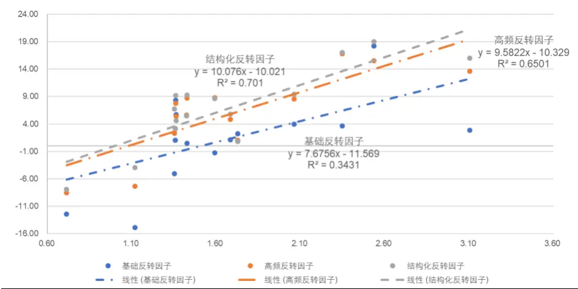
资料来源：天软科技，长江证券研究所
基于以上统计结果：

结构化反转因子的阈值设定和市值相关。

反转类因子收益的核心来源在市场波动，相比基础反转因子，高频反转因子和结构化反转因子更能体现反转效应的核心逻辑。

## 总结

本文基于反转效应的深层逻辑，以高频数据改进了基础反转因子，在全 A 股范围内及等权组合及基准的标准下，得到以下结论：

以 21 天收益率构建的基础反转因子是目前最常用的反转因子，可以获得年化 1.10%的超额收益率和 0.16 的信息比，有一定的选股能力，但波动较大，回撤年份多，且分组线性性不佳。在剥离了流动性和波动率因子的线性影响后，年化超额收益为-0.19%，信息比为 0.00。

以成交量加权合成的高频反转因子显著提升了基础反转因子的选股能力。其平均 IC 为-0.09，IC_IR 为 1.01，可以获得年化 5.98%的超额收益和 0.98 的信息比，因子的收益能力和稳定性均有显著提高。除第 1、2 组外，净值分布严格以因子分组结果呈线性排列。在剥离了流动性和波动率因子的线性影响后，年化超额收益为 2.84%，信息比为 0.46。

同时考虑个股的动量效应和反转效应构建的结构化反转因子进一步提升了基础反转因子的选股能力。其平均 IC 为-0.09，IC_IR 为1.00，可以获得年化 7.21%的超额收益和1.31 的信息比，因子的收益能力和稳定性均有显著提高，且净值分布严格以因子分组结果呈线性排列。在剥离了流动性和波动率因子的线性影响后，年化超额收益为 3.65%，信息比为 0.64。

个股的反转效应和动量效应临界点和个股性质相关，核心在于哪些变量会影响个股交易时多空双方博弈的激烈程度，如市值较大的个股多空博弈的程度较小，投资者更倾向于基本面定价，动量效应阈值较低。

反转类因子的收益能力和市场波动相关，核心在于投资者过度反应的程度，在市场波动较大时反转类因子的收益能力增强。

| 上海 | 武汉 |
| --- | --- |
| 浦东新区世纪大道1198号世纪汇广场一座29层(200122) | 武汉市新华路特8号长江证券大厦11楼(430015) |
| 北京 | 深圳 |
| 西城区金融街33号通泰大厦15层（100032) | 深圳市福田区中心四路1号嘉里建设广场 3期36 楼(518048) |

## 投资评级说明

| 行业评级 | 报告发布日后的12个月内行业股票指数的涨跌幅相对同期相关证券市场代表性指数的涨跌幅为基准，投资建议的评 |  |
| --- | --- | --- |
|  | 级标准为： |  |
|  | 看 好： | 相对表现优于同期相关证券市场代表性指数 |
|  | 中 性： | 相对表现与同期相关证券市场代表性指数持平 |
|  | 看 淡： | 相对表现弱于同期相关证券市场代表性指数 |
| 公司评级 |  | 报告发布日后的12个月内公司的涨跌幅相对同期相关证券市场代表性指数的涨跌幅为基准，投资建议的评级标准为： |
|  | 买 入： | 相对同期相关证券市场代表性指数涨幅大于10% |
|  | 增 持： | 相对同期相关证券市场代表性指数涨幅在5%～10%之间 |
|  | 中 性： | 相对同期相关证券市场代表性指数涨幅在-5%～5%之间 |
|  | 减持： 相对同期相关证券市场代表性指数涨幅小于-5% |  |
|  |  | 无投资评级：由于我们无法获取必要的资料，或者公司面临无法预见结果的重大不确定性事件，或者其他原因，致使 我们无法给出明确的投资评级。 |
| 相关证券市场代表性指数说明：A股市场以沪深300指数为基准；新三板市场以三板成指（针对协议转让标的）或三板做市指数 (针对做市转让标的)为基准；香港市场以恒生指数为基准。 |  |  |

## 联系我们

## 分析师声明

作者具有中国证券业协会授予的证券投资咨询执业资格并注册为证券分析师，以勤勉的职业态度，独立、客观地出具本报告。分析逻辑基于作者的职业理解，本报告清晰准确地反映了作者的研究观点。作者所得报酬的任何部分不曾与，不与，也不将与本报告中的具体推荐意见或观点而有直接或间接联系，特此声明。

## 重要声明

长江证券股份有限公司具有证券投资咨询业务资格，经营证券业务许可证编号：10060000。

本报告仅限中国大陆地区发行，仅供长江证券股份有限公司（以下简称：本公司）的客户使用。本公司不会因接收人收到本报告而视其为客户。本报告的信息均来源于公开资料，本公司对这些信息的准确性和完整性不作任何保证，也不保证所包含信息和建议不发生任何变更。本公司已力求报告内容的客观、公正，但文中的观点、结论和建议仅供参考，不包含作者对证券价格涨跌或市场走势的确定性判断。报告中的信息或意见并不构成所述证券的买卖出价或征价，投资者据此做出的任何投资决策与本公司和作者无关。

本报告所载的资料、意见及推测仅反映本公司于发布本报告当日的判断，本报告所指的证券或投资标的的价格、价值及投资收入可升可跌，过往表现不应作为日后的表现依据；在不同时期，本公司可以发出其他与本报告所载信息不一致及有不同结论的报告；本报告所反映研究人员的不同观点、见解及分析方法，并不代表本公司或其他附属机构的立场；本公司不保证本报告所含信息保持在最新状态。同时，本公司对本报告所含信息可在不发出通知的情形下做出修改，投资者应当自行关注相应的更新或修改。

本公司及作者在自身所知情范围内，与本报告中所评价或推荐的证券不存在法律法规要求披露或采取限制、静默措施的利益冲突。

本报告版权仅为本公司所有，未经书面许可，任何机构和个人不得以任何形式翻版、复制和发布。如引用须注明出处为长江证券研究所，且不得对本报告进行有悖原意的引用、删节和修改。刊载或者转发本证券研究报告或者摘要的，应当注明本报告的发布人和发布日期，提示使用证券研究报告的风险。未经授权刊载或者转发本报告的，本公司将保留向其追究法律责任的权利。

“慧博资讯”是中国领先的投资研究大数据分享平台