# 高频因子（三）：高频因子研究框架

金融工程┃专题报告

## 报告要点

## 高频因子研究框架

高频因子需要考虑的核心问题在信息增量，除此之外，因子表现的细节问题，如行为交易逻辑、收益来源，也需要从特定角度进行考虑。研究方法以线性模型为基础，从因子统计和因子回测两个方面出发，给出统计意义和选股表现上最直接的展示。

## 以个股日度成交额为锚，改进流动性溢价参数

本文以个股日度成交额为锚，对流动性溢价因子中的交易金额给出改进，并将溢价估计频率提高至 2 分钟频率，可以提供信息上的增量。Fama-MacBeth 回归 t 值为 1.98，因子 IC 为 8.10%，IC_IR 为 53.59%，相比全市场等权基准年化超额收益 7.24%，净值曲线排列完全呈现线性；完全剥离风格和行业的线性影响后仍有一定选股能力，因子 IC 为 1.96%，IC_IR 为 29.37%，相比全市场等权基准年化超额收益 0.92%，净值曲线排列基本呈现线性。

## 高频反转因子结构窥探

高频率的时间区间划分和成交量加权的方式均可对反转因子给出改进；价格上的动量效应并不稳定；开盘时间段仍体现反转效应，且信息增益较为明显；市场波动率是反转类因子择时的重要代理变量，且在市场环境有持续性的前提下，当期市场波动率对下期因子收益在月度和季度上均有预测作用。

## 全局类高频反转因子可以提供信息收益

从统计维度上看，剥离了 Fama 因子（剔除反转因子）线性影响后，回归 t 值在-6 左右，剥离了 Fama 因子线性影响后，回归 t 值在-5 左右。从回测角度上看，全局类反转因子在剥离风格因子和行业因子的线性影响后，仍具有一定的选股能力，全市场内多空年化收益为 8.88%，中证 800 内多空年化收益为 3.95%，因子仅在 2014 年有明显回撤。

风险提示：1. 模型存在失效风险；2. 本文举例均基于历史数据，不保证未来收益。

## [Table分析师Author覃川桃

（8621）61118766

qinct@cjsc.com.cn

执业证书编号：S0490513030001

## 联系人 郑起

（8621）61118706

zhengqi2@cjsc.com

## [Table相关研究_

《消费白马何时休？》2019-7-13

《基本面指导大类资产配置系列二之股票风格配置（上）》2019-7-10

《量化视角下的宏观经济与消费》2019-6-28

## 高频因子研究框架

高频数据是在较短的时间尺度上（一般为分钟级别或以下）搜集的时间序列数据，如日内量价数据、tick 数据等，在量化中一般有三种用法：

1. 高频交易，如以量价信息所做的日内交易策略，日频因子的构建等，是一种高频数据高频使用的方式。

2. 新因子的构建，如在《高频因子（一）：流动性溢价因子》中，以盘口挂单数据给出溢价能力的刻画，是一种高频数据低频使用的方式。

3. 风格因子的结构改进，如在《高频因子（二）：结构化反转因子》中，以高频的数据得到更为细致反转效应的刻画，是一种高频数据低频使用的方式。

因为高频数据包含更多的信息，高频数据的低频使用仍有其价值，但是如何去衡量这种价值，高频数据的使用是否给予了我们更多的信息增量，也需要从统计的角度给出验证。本文重点从问题研究的维度和与之匹配的方法两个方面，给出框架的搭建，并在后文中以流动性溢价因子和高频类反转因子中未解决的问题为例，给出方法上的展示。

## 研究维度

从因子表现出发，高频数据低频使用的两种方法，需要考虑的问题略有不同：

对于新因子的构建，高频数据可以更精确的刻画交易行为，从行为金融学的逻辑中找到市场中错误定价的可能或溢价能力的来源，进而获得超额收益。由于这种交易层面的刻画和传统风格因子逻辑上有着较为本质的区别，故相关性上本身相对较低，需要验证的核心问题是新因子是否有新的信息增量。如在《高频因子（一）：流动性溢价因子》中，我们以平均价衡量市场实际成交情况，以买单数据衡量市场需求方定价情况，以两者之间的差距估计每只个股的局部资产持有方可以获得的溢价水平构建新因子，找出和新因子线性相关性最高的因子，进行回归取残差的中性方式，从超额收益和多空收益的角度观察新的因子是否有新的信息增量。

而对于风格因子的结构改进，因其构建基于已存在的因子，相关性较高，故需要分别从替代的改进效果角度和是否有新的信息增量两个角度，给出讨论。如在《高频因子（二）：结构化反转因子》，我们基于反转因子的核心收益来源——市场的过度反应，给出了其改进的逻辑，即当市场对信息有过度反应时，价格会呈现反转效应，而局部上成交量越高，市场多空双方对价格博弈越激烈，过度反应越明显，反转效应越强，以成交量加权的形式给出每段反转收益的加和构建改进因子，以控制变量的方式，比较了改进前后因子的直接表现以及剥离相关量价因子后的表现。

从因子收益角度出发，需要考虑影响其强弱的因素。在《高频因子（一）：流动性溢价因子》中，通过全市场、沪深 300 和中证 500 中因子表现的比较，提出了因子收益的强弱或与市值有关，其本质为其他因子暴露对当前因子收益的影响，即因子之间的相互作用，这一点在报告《构造非线性 ROE 因子：多因子统计学习模型》中，我们从市值暴露对ROE 因子收益的影响出发，给出了更加深刻的探讨。而在《高频因子（二）：结构化反转因子》中，我们以市场波动率作为整体过度反应程度的一种侧面刻画，从因子收益与市场波动率的回归的结果上侧面说明，因子收益的来源过度反应的本质，其本质为市场环境对当前因子收益的影响，即因子择时问题。

从行为金融出发，需要考虑因子和交易行为的相互佐证。由于高频因子以量价数据为基础，多为刻画局部的交易行为，不同的参数影响因子表现，内在是行为交易刻画的精确程度。在《高频因子（二）：结构化反转因子》中，我们从高频反转因子和结构化反转因子在全 A 股和中证 800 中表现的差异中间接表明，在小市值股票中存在更多下跌不可逆个股，而大市值股票多为正常超跌反弹或跟随补涨，本质为思考参数改变带来因子表现变化背后反应的逻辑（高频数据构建的低频因子从微观结构上给出个股特性（风格）上的描述，构建因子的参数会影响这种特性的刻画，进而影响因子表现）；在同篇报告中，通过市场波动率与因子超额收益的回归效果，来印证反转因子收益来源于市场过度反应的强度，本质为思考交易行为的代理变量与因子收益的关系，并验证构建因子时的逻辑合理性。

## 故总结需要覆盖的维度：

信息增量维度：在改进因子时，和原风格因子相比，是否可以改进表现；剥离了风格因子的线性影响后，是否有新的信息增量。

因子收益维度：构建的因子收益会受到风格因子怎样的影响；因子择时和哪些因素相关。

交易逻辑维度：高频参数对因子表现的影响；交易行为代理变量与因子收益的关系。

## 研究方法

新因子的研究方法要和研究维度中的问题相匹配，这一点又以新因子是否有信息增量为重。高频因子系列我们仍然以 barra 风险模型为基础，主要考虑因子的线性分组能力及剥离了相关风格因子后的表现，并和研究维度中的细节保持统一，本节介绍因子统计中用到的模型、回测的细节及比较层面的方法。

## 因子统计

因子统计的方法主要体现统计上的意义，在介绍构成之前，首先介绍 Fama-MacBeth 回归。Fama-MacBeth 回归由 Fama 和 MacBeth 在 1973 年为验证 CAPM 模型时提出，现在被广泛用来估计各类资产定价模型中的因子暴露和因子收益（即风险溢价）。其本质在于将每个截面上的回归结果作为一个独立的样本，通过不同的截面回归得到的时间序列对参数进行估计。Fama-MacBeth 回归可以消除残差在截面上的相关性对标准误差的影响，但是无法解决残差时间序列上自相关性的问题，需要通过如 Newey-West 等方法对自相关异方差进行一致性估计。一般来说 Fama-MacBeth 回归和参数估计可由三个步骤构成：

记{Ri}为第i只股票第t个时间点上的收益率， $\{f_{t}^{j}\}$ 为第j个因子第t个时间点上的收益率。对每只个股，由时间序列回归得到个股i在因子j上的暴露 $\mathbf{\Delta}:\beta_{i}^{j}$ ：

$$
R_{t}^{i}=a_{i}+\beta_{i}^{j}f_{t}^{j}+\varepsilon_{t}^{i}
$$

通常回归会取全样本的数据，默认个股的因子暴露不变，但也可以取较近一段时间的数据以体现个股随市场的变化。

对所有个股，由截面回归得到因子j在每个时间点上的收益序列 $\{\lambda_{t}^{j}\}$ ：

$$
R_{t}^{i}=\gamma_{t}+\beta_{i}^{1}\lambda_{t}^{1}+\cdots+\beta_{i}^{j}\lambda_{t}^{j}+\cdots+\alpha_{t}^{i}
$$

进行参数估计（因子收益、波动等），记 ${\hat{\alpha}}_{i}$ 为残差均值， $\hat{\lambda}_{j}$ 为因子收益均值， $\mathrm{Var}(\hat{\alpha}_{i})$ 为残差方差， $\mathrm{Var}(\hat{\lambda}_{j})$ 为因子方差，则：

$$
\widehat{\alpha}_{i}=\frac{1}{T}\sum_{t=1}^{T}\alpha_{t}^{i}
$$

$$
\widehat{\lambda}_{j}=\frac{1}{T}\sum_{t=1}^{T}\lambda_{t}^{j}
$$

$$
\operatorname{Var}({\hat{\alpha}}_{i})={\frac{1}{T}}Var{\big(}\alpha_{t}^{i}{\big)}={\frac{1}{T^{2}}}\sum_{t=1}^{T}(\alpha_{t}^{i}-{\hat{\alpha}}_{i})^{2}
$$

$$
\mathrm{Var}\bigl(\hat{\lambda}_{j}\bigr)=\frac{1}{T}Var\bigl(\lambda_{t}^{j}\bigr)=\frac{1}{T^{2}}\sum_{t=1}^{T}(\lambda_{t}^{j}-\hat{\lambda}_{j})^{2}
$$

在以后使用 Fama-MacBeth 回归时，有两点需要指出：

个股在因子上的暴露，有两种情况：以 Beta 因子为例，已知因子收益率（即市场的平均收益），通过时间序列回归得到个股暴露值；以市值因子为例，可以通过市场大小市值的多空组合求得因子收益率，回归得到个股暴露值，或直接根据市值数据得到个股暴露。在以后的 Fama-MacBeth 回归中除 Beta 因子外，全部直接以因子值得到个股暴露。

Fama-MacBeth 回归是为了验证因子对个股的收益是否有解释力度，故在第二步截面线性回归时，以当期因子暴露对下期收益做回归。

记每期因子暴露和下期因子暴露相关性的时间序列为 $\{AutoCor_{t}\}$ ，每期因子暴露和下期收益率秩相关性的时间 $\left|\overline{{\beta}}\widehat{\hat{g}}\right|\left\{IC_{t}\right\}$ ，通过 Fama-MacBeth 回归得到各个因子的收益率时间序列和t值时间序列，分别记为 $\{beta_{t}\}$ 和 $\{tvalues_{t}\}$ ，mean为均值函数，std为方差函数，count为计数函数，sum为求和函数，I为示性函数。表 1 展示了因子统计的组成部分。

表 1：因子统计组成部分

| 统计指标 | 计算方法 | 统计含义 |
| --- | --- | --- |
| 因子截面相关性 | $\mathrm{mean}(AutoCor_{t})$ | 因子变化的速度 |
| 因子IC | ${\mathrm{mean}}(IC_{t})$ | 个股因子排名和收益率排名的相关性 |
| 因子IC_IR | $\mathrm{mean}(IC_{t})/\mathrm{std}(IC_{t})$ | 个股因子排名和收益率排名的相关性的稳定性 |
| 因子年化收益 | $\mathrm{mean}(beta_{t})\times12$ | 因子的收益能力 |
| 因子年化波动率 | $\mathrm{std}(beta_{t})\times\sqrt{12},$ | 因子收益的稳定性 |
| 因子夏普比 | $(\mathrm{mean}(beta_{t})\times12)/(\mathrm{std}(beta_{t})\times\sqrt{12})$ | 因子收益的收益风险比 |
| 因子t值 | $\mathrm{mean}(beta_{t})/\mathrm{std}(beta_{t})\times\sqrt{\mathrm{count}(beta_{t})}$ | 因子的收益能力在统计意义的显著性 |
| 平均†值 | $\mathrm{mean}(tvalues_{t})$ | 因子收益在时间序列上的稳定性 |
| 平均绝对†值 | $\mathrm{mean}(abs(tvalues_{t}))$ | 因子对收益率解释的显著性 |
| †值>2百分比 | $s\mathrm{um}(I(beta_{t}>0))/\mathrm{count}(beta_{t})$ | 因子对收益率解释的稳定性 |

资料来源：长江证券研究所

## 因子回测

因子回测直接从选股表现上，对因子给出评价，其细节如下：

板块上：全 A 股与中证 800 内回测，分别体现因子在全市场和宽基中的表现。

线性剥离上：考虑和新构建因子相关性较高的风格因子，分别对剥离其线性影响前后的因子给出回测，验证因子是否有新的信息增量。

股票池：剔除 ST 及上市不足一年的股票，剔除过去 20 个交易日停牌超过 10 天的股票。

回测起始时间：2005-01-01（中证 800 为 2007-02-01）。

调仓设置：月度调仓，月底得到因子值，在下一个交易日按收盘价调仓，交易成本双边 0.15%。

分组情况：根据因子值和因子收益率方向排序，将股票分为 10 组（中证800为 5组），每组内的股票等权配置，仅从收益上看因子表现。

基准：全 A 范围内为全 A 股票月度等权组合，中证 800 范围内为中证 800 价格指数，并加入空头组的等权组合，进行多空收益的刻画。

## 比较方法

新因子的研究不论是在讨论信息增益还是改进效果上，都会有不同维度的比较，表 2 列出了在以后会涉及到的比较方法， 其中控制变量、参数递进和全中性回测分别在《高频因子（二）：结构化反转因子》给出了方法上的展示，如高频数据构建的反转因子和基础反转因子相比是否有改进，不同参数因子表现的差异等。

Forward 因子方法即以逐渐添加信息的方式，构建多个子类因子，以回归或回测的方法，逐步向方法中添加新的变量，是从正面直接验证是否有新信息的方法；

Backward 因子方法即逐渐从全信息因子中剔除部分信息，构建子信息因子，以取残差回归或回测的方法，比较方法中是否包含信息结构之间的差异，是从反面间接验证是否有信息的方法。

本文将在中因子有效性验证和开盘因子部分给出两个方法的相关展示。

表 2：因子探究比较方法

| 比较方法 | 研究目的 | 针对维度 | 案例 |
| --- | --- | --- | --- |
| 控制变量 | 不同因子的表现 | 因子是否改进 | 对改进前后的因子进行相同条件的的回测 |
| 参数递进 | 不同参数对因子的影响 | 参数对因子的影响 | 以单调形式改变参数构建因子，回测因子表现 |
| Forward因子 | 构建因子中的信息剥离 | 是否有信息增量(正面验证） | 统计新构建的因子在风格中性后的表现 |
| Backward因子 | 构建因子中的信息剥离 | 是否有信息增量（反面验证） | 统计忽略特定信息的因子和全信息因子的表现 |
| 全中性回测 | 线性下因子选股效果 | 是否有信息增量 | 回测新构建的因子在风格中性后的表现 |

资料来源：长江证券研究所

## 风格因子定义

表 3 展示了由 Fama 五因子模型衍生而来的因子，也是在后续研究中应用到 Fama-MacBeth 回归中的参考因子。

表 3：Fama五因子模型衍生因子

| 大类因子 | 子类因子 | 方向 |
| --- | --- | --- |
| Beta | 过去一年与上证综指回归得到的 beta | 1 |
| 规模 | 流通市值的对数 | -1 |
| 价值 | EP_TTM | 1 |
| 盈利 | ROE_TTM | 1 |
| 投资 | 净资产同比 | 1 |
| 流动性 | 近 21 日日均换手率 | -1 |
| 波动率 | 近 21 日残差收益率标准差 | -1 |
| 反转 | 近21 日收益率 | -1 |

资料来源：长江证券研究所

其中 Beta、规模、EP、ROE 和净资产增长率为 Fama 五因子模型中的因子，流动性、波动率和反转因子是 A 股市场较为有效的量价因子。表 4 给出因子间的平均截面相关性。可以看出 ROE 和净资产增长率与 EP 的线性相关性较高，故在之后做 Fama-MacBeth 回归时，以 Fama 三因子模型为基础。波动率因子和换手率因子相关性较高，故在之后进行回归时，首先对波动率因子做流动性因子的中性化处理。最后回归用到的模型为 Beta、规模、EP、流动性、波动率和反转因子，之后简称为 Fama因子。

表 4：Fama五因子模型衍生因子相关性

|  | Beta | 规模 | 价值 | 盈利 | 投资 | 流动性 | 波动率 | 反转 |
| --- | --- | --- | --- | --- | --- | --- | --- | --- |
| Beta | 100.00% | -9.18% | -4.49% | -11.40% | -7.18% | 19.90% | 5.51% | -4.91% |
| 规模 | -9.18% | 100.00% | 34.66% | 32.84% | 21.32% | -36.30% | -16.43% | 7.12% |
| 价值 | -4.49% | 34.66% | 100.00% | 78.74% | 48.11% | -19.73% | -26.56% | -2.47% |
| 盈利 | -11.40% | 32.84% | 78.74% | 100.00% | 59.60% | -11.46% | -10.47% | 3.46% |
| 投资 | -7.18% | 21.32% | 48.11% | 59.60% | 100.00% | -3.56% | -3.95% | 1.53% |
| 流动性 | 19.90% | -36.30% | -19.73% | -11.46% | -3.56% | 100.00% | 60.11% | 18.36% |
| 波动率 | 5.51% | -16.43% | -26.56% | -10.47% | -3.95% | 60.11% | 100.00% | 30.63% |
| 反转 | -4.91% | 7.12% | -2.47% | 3.46% | 1.53% | 18.36% | 30.63% | 100.00% |

资料来源：天软科技，长江证券研究所

在因子回测时的中性化处理，以 Barra China Equity Model 中的 10 个风格因子为基础，忽略非线性市值因子以及预期数据，并加入在 A 股市场表现较好的反转因子，组成 9 大类风格因子，之后简称为 Barra 因子，如表 5 所示，并在之后中性时，以中信一级行业为行业因子，对新因子进行线性回归取残差处理。

表 5：Barra风格因子的定义

| 大类因子 | 子类因子 | 方向 |
| --- | --- | --- |
| Beta | 过去一年与上证综指回归得到的 beta | 1 |
| 规模 | 流通市值的对数 | -1 |
| 估值 | PE | -1 |
| 流动性 | 近 21 日日均换手率 | -1 |
| 波动率 | 近 21 日残差收益率标准差 | -1 |
| 反转 | 近 21 日收益率 | -1 |
| 盈利 | ROE_TTM | 1 |
| 成长 | 归属净利润增速 | 1 |
| 动量 | 过去一年扣除近一个月收益率 | 1 |

资料来源：长江证券研究所

## 流动性溢价因子

## 因子思考

在《高频因子（一）：流动性溢价因子》中，我们以平均价衡量市场实际成交情况，以买单数据衡量市场需求方定价情况，以两者之间的差距估计每只个股的局部资产持有方可以获得的溢价水平，并在月底时汇总成因子数据进行选股，其流程如图 1 所示。

图 1：原流动性溢价因子构建流程
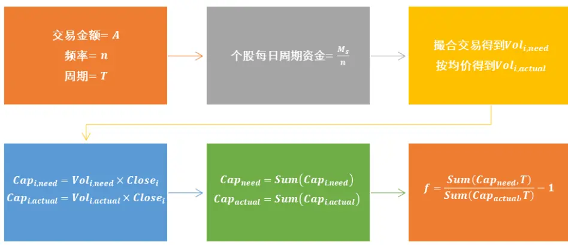
资料来源：长江证券研究所

而在构建因子时，有两个问题需要给出进一步讨论。

## 因子参数

因子的计算过程涉及三个参数：

周期T：回溯过去多少天构建因子，影响因子包含的信息量。其最优值和市场对于流动性溢价消化的速度有关。

频率n：每天以何种频率获取模拟撮合的订单，和交易金额A一同影响模拟订单的数量，进而影响流动性溢价的精确程度。在一定范围内，频率越高越好。

交易金额A：每天以多少资金对全市场进行测试，和频率n一同影响模拟订单的数量，进而影响流动性溢价的精确程度。

其中周期T和频率n均可以通过超参数遍历回测的方式，得到相对合理的范围，而交易金额在之前构建的过程中由于忽略了市场交易金额对撮合交易过程产生的影响，在各个历史时期以一个同样额度进行撮合，导致溢价水平在流动性充裕时估计不足，而在流动性不足时估计过大，即参数本身就会和时间序列相关，超参数遍历回测也不能得到合理的参数。故本文以每只个股当日成交额为锚得到每日个股资金M ：分别以当日成交金额的1%和当日金额的开方（以万为单位，保证和前一方法量纲相对一致），配置个股资金。

## 市场假设

从溢价水平的刻画上，以过去一段时间的实际成交水平和当前截面的买单数据分别刻画市场成交水平和买方需求水平时存在一个假设，即短期内市场的价格不产生变动。而实际上市场价格始终在变化，在之前的报告中，我们忽略了这一前提，但有两个原因可以使得估计的误差在一定范围内：

市场价格的变动存在正向负向皆有的情况，在一定时间内正负可以相互抵消，从而消除价格变动对溢价估计方向上的扰动；但在特定的历史时期仍会产生较大误差，如在震荡市场中价格变动的正负可以相对抵消，而单边上升或下跌的市场价格变动有明显方向性。

对于所有股票，价格的变动往往和市场变动方向一致，故个股在估计溢价的误差上具有同步性，截面上有可比性；但这样刻画的溢价短期内和个股 beta 有较大关系，长期来看 Beta较高的股票其溢价水平的刻画稳定性越差。

针对这一情况，本文通过缩短估计溢价的周期，来尽可能消除价格变动带来的影响，当所取时间间隔∆t很短时，可以认为短期内个股的价格不产生剧烈变化。本文将估计溢价的频率 n 提高至一天 120、48 次，即 2 分钟 k 线和 5 分钟线，给出更精细化的流动性溢价刻画。

下面从因子统计和回测方面，对表 6 中参数改进后的流动性溢价因子的表现给出展示。

表 6：流动性溢价因子参数及简称

|  | 10 分钟线 | 5分钟线 | 2分钟线 |
| --- | --- | --- | --- |
| 成交金额1% | 10 分钟(%1) | 5 分钟(%1) | 2 分钟(%1) |
| 成交金额开方 | 10 分钟(开方) | 5 分钟(开方) | 2 分钟(开方) |

资料来源：长江证券研究所

## 因子统计

流动性溢价因子的构造虽然用到了盘口挂单数据，但最终根据模拟交易的结果汇总构建为因子，在月度调仓的频率下使用，本质是股票风格的微观描述，和传统风格因子之间仍有一定关系，且不同的参数的因子表现不同，需要从所有因子的整体表现和每个因子表现的差异上给出探讨。故本文首先从和风格因子的关系、因子 IC 和 Fama-MacBeth回归结果方面，从统计层面对因子进行剖析。

表 7 中给出了6 个流动性溢价因子和 Barra 因子的相关性，表 8 给出了因子在全市场和中证 800 内 IC 的相关信息，表 9 展示了流动性溢价因子 Fama-MacBeth 回归的结果，即分别将流动性溢价因子剥离 Fama 因子线性影响后加入回归，得到风格因子和流动性溢价因子统计结果，可以得到以下结论：

流动性溢价因子和常见风格因子的相关性较低，绝对值基本在 0.3 以下。

从 IC 上看，全 A 股中流动性溢价因子的平均 IC 均在 8%附近，IC_IR 在 55%附近，中证 800 内流动性溢价因子的平均 IC 均在 6%附近，IC_IR 在 45%附近；

板块间比较，对比中性前后的因子 IC 和 IC_IR，因子选股在全市场中比在中证 800内更为有效；横向比较，在全A 股和中证 800 范围内，中性前，因子 IC 经历了从大到小的变化，IC_IR 则经历了逐渐减小的过程，而中性后，IC 和 IC_IR 均为频率越高值越大，因子提供的信息增量越多。

从 Fama-MacBeth 回归的结果看，因子 t 值基本在 2 左右，能够额外贡献收益上的解释，且随着频率的提高，t 值在增加，这一点和 IC 的统计结果一致；从时间序列上绝对 t 值大于 2 的百分比上看，因子有一定波动，但相对较为稳定。

表 7：流动性溢价因子与风格因子相关性

|  | Beta | 规模 | 流动性 | ROE | 反转 | 动量 | 成长 | 波动率 | PE | 10分钟(%1) | 5分钟(%1) | 2分钟(%1) | 10分钟(开方) | 5分钟(开方) | 2分钟(开方) |
| --- | --- | --- | --- | --- | --- | --- | --- | --- | --- | --- | --- | --- | --- | --- | --- |
| 10分钟(%1) | -7.46% | -21.75% | -24.49% | -23.86% | -29.53% | -18.47% | -11.88% | -27.83% | -3.50% | 100.00% | 90.01% 81.11% |  | 98.13% | 88.41% | 80.02% |
| 5分钟(%1) | -11.96% | -25.15% | -28.21% | -27.45% | -18.12% | -20.31% | -14.03% | -25.00% | -3.59% | 90.01% | 100.00% 93.80% |  | 90.59% | 98.75% | 92.99% |
| 2分钟(%1) | -14.17% | -27.37% | -28.77% | -30.01% | -8.09% | -21.24% | -15.39% | -19.96% | -3.33% | 81.11% | 93.80% 100.00% |  | 82.77% | 94.07% | 98.87% |
| 10分钟(开方 | -8.05%) | -22.46% | -26.12% | -24.20% | -31.40% | -18.86% | -12.21% | -30.50% | -3.76% | 98.13% | 90.59% 82.77 |  | % 100.00% | 90.78% 82.63% |  |
| 5分钟(开方) | -12.30% | -25.80% | -28.98% | -27.61% | -18.77% | -20.50% | -14.23% | -26.22% | -3.68% | 88.41% | 98.75% 94.07% |  | 90.78% | 100.00% 94.18% |  |
| 2分钟(开方) | -14.34% | -27.98% | -29.01% | -30.04% | -8.34% | -21.30% | -15.48% | -20.43% | -3.29% | 80.02% | 92.99% 98.87% |  | 82.63% 94.18% 100.00% |  |  |

资料来源：天软科技，长江证券研究所

表 8：流动性溢价因子统计

|  | 10分钟(%1) | 5分钟(%1) | 2分钟(%1) | 10分钟(开方) | 5分钟(开方) | 2分钟(开方) |
| --- | --- | --- | --- | --- | --- | --- |
| 平均IC(全市场) | 7.69% | 8.26% | 8.10% | 8.31% | 8.62% | 8.24% |
| 平均IC(全市场中性) | 1.19% | 1.67% | 1.96% | 1.39% | 1.78% | 1.97% |
| 平均IC(中证 800) | 6.25% | 6.51% | 6.21% | 6.74% | 6.81% | 6.32% |
| 平均 IC(中证 800 中性) | 1.06% | 1.19% | 1.42% | 1.27% | 1.30% | 1.42% |
| IC_IR(全市场) | 57.16% | 56.94% | 53.59% | 60.37% | 58.75% | 54.51% |
| IC_IR(全市场中性) | 21.23% | 26.56% | 29.37% | 24.19% | 28.13% | 29.41% |
| IC_IR(中证800) | 45.73% | 43.68% | 39.83% | 47.87% | 45.08% | 40.27% |
| IC_IR(中证 800 中性) | 18.39% | 18.36% | 20.53% | 21.53% | 20.01% | 20.46% |

资料来源：天软科技，长江证券研究所

表 9：流动性溢价因子 Fama-MacBeth 回归统计

|  | 因子IC | 因子IC_IR | 因子年化收益 | 因子年化标准差 | 因子夏普比 | 因子t值 | 平均t值 | 平均绝对t值 | 绝对t值>2百分比 |
| --- | --- | --- | --- | --- | --- | --- | --- | --- | --- |
| Beta | -2.65% | -17.13% | 0.74 | 4.40 | 0.17 | 0.64 | 0.09 | 3.71 | 64.37 |
| 规模 | -4.75% | -23.83% | -8.68 | 6.58 | -1.32 | -5.02 | -2.42 | 5.28 | 77.59 |
| EP | 3.11% | 19.92% | 1.70 | 3.39 | 0.50 | 1.91 | 0.64 | 2.89 | 55.75 |
| 流动性 | -7.28% | -44.54% | -9.78 | 4.86 | -2.01 | -7.66 | -2.99 | 4.78 | 76.44 |
| 波动率 | -7.78% | -54.79% | -1.49 | 3.78 | -0.39 | -1.50 | -0.38 | 2.44 | 45.98 |
| 反转 | -7.58% | -48.69% | -4.06 | 5.02 | -0.81 | -3.08 | -1.50 | 4.02 | 69.54 |
| 10分钟(%1) | 7.69% | 57.16% | 1.54 | 3.45 | 0.45 | 1.70 | 0.49 | 2.54 | 49.43 |
| 5分钟(%1) | 8.26% | 56.94% | 1.83 | 3.80 | 0.48 | 1.84 | 0.61 | 2.85 | 51.15 |
| 2分钟(%1) | 8.10% | 53.59% | 2.20 | 4.08 | 0.54 | 2.06 | 0.71 | 3.06 | 54.60 |
| 10 分钟(开方) | 8.31% | 60.37% | 1.86 | 3.57 | 0.52 | 1.98 | 0.60 | 2.59 | 50.57 |
| 5 分钟(开方) | 8.62% | 58.75% | 2.03 | 3.83 | 0.53 | 2.01 | 0.68 | 2.83 | 50.00 |
| 2 分钟(开方) | 8.24% | 54.51% | 2.25 | 4.07 | 0.55 | 2.10 | 0.73 | 3.05 | 52.87 |

资料来源：天软科技，长江证券研究所

## 因子回测

## 全市场

本节以%1 方式分配资金、2 分钟频率构建的流动性溢价因子为例，给出全 A 股范围内的回测结果，表 10 给出了不同参数流动性溢价因子整体风险指标，图 2 和图 3 分别给出了流动性溢价因子中性前后分组回测的净值曲线，表 11 给出了流动性溢价因子中性前后选股第 1 组的分年风险指标，可以得到以下结论：

从收益上看，5 分钟频率下的因子在中性前表现最好，2 分钟频率的在中性后表现最好，这一点和因子 IC 及 IC_IR 的统计结果一致。

从净值曲线的排序上看，中性前后在全 A 股范围内均有一定的选股区分度，中性前净值曲线按照因子值从大到小严格按照线性排序，中性后基本呈现线性。

从分年表现上看，中性前因子仅在 2006 年、2010 年和 2013 年获得负的超额收益，中性后因子仅在 2005 年、2006 年和 2010 年获得负的多空收益。

表 10：全 A股不同参数下流动性溢价因子风险指标

| 中性前 |  |  |  |  |  |  | 中性后 |  |  |  |  |  |
| --- | --- | --- | --- | --- | --- | --- | --- | --- | --- | --- | --- | --- |
|  | 年化收益 | 夏普比 | 超额收益 | 信息比 | 多空收益 | 多空夏普比 | 年化收益 | 夏普比 | 超额收益 | 信息比 | 多空收益 | 多空夏普比 |
| 10 分钟(%1) | 26.96% | 0.96 | 7.19% | 1.00 | 29.63% | 2.13 | 16.59% | 0.67 | -1.50% | -0.23 | 7.90% | 1.15 |
| 5 分钟(%1) | 27.19% | 0.98 | 7.39% | 0.96 | 32.10% | 2.23 | 17.62% | 0.71 | -0.63% | -0.06 | 8.48% | 1.15 |
| 2 分钟(%1) | 27.02% | 0.98 | 7.24% | 0.92 | 30.45% | 2.08 | 19.45% | 0.77 | 0.92% | 0.17 | 8.76% | 1.12 |
| 10 分钟(开方) | 27.82% | 0.98 | 7.92% | 1.08 | 32.00% | 2.22 | 16.99% | 0.68 | -1.16% | -0.16 | 7.90% | 1.14 |
| 5 分钟(开方) | 28.25% | 1.01 | 8.28% | 1.05 | 33.33% | 2.26 | 18.00% | 0.72 | -0.31% | -0.01 | 7.51% | 1.01 |
| 2 分钟(开方) | 26.82% | 0.97 | 7.07% | 0.90 | 30.34% | 2.06 | 19.07% | 0.76 | 0.59% | 0.12 | 8.96% | 1.15 |

资料来源：天软科技，长江证券研究所

图 2：全 A股流动性溢价因子回测净值（中性前）
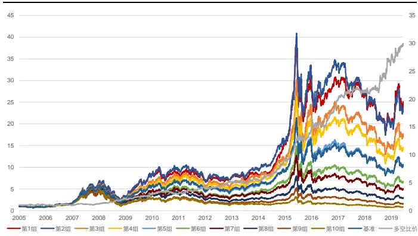
资料来源：天软科技，长江证券研究所

图 3：全 A股流动性溢价因子回测净值（中性后）
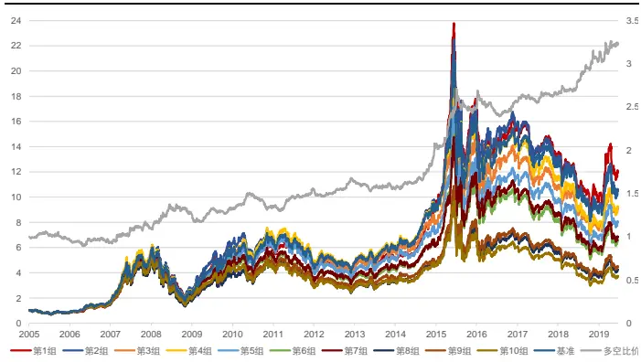
资料来源：天软科技，长江证券研究所

表 11：全 A股流动性溢价因子分年风险指标

| 中性前 |  |  |  |  | 中性后 |  |  |  |
| --- | --- | --- | --- | --- | --- | --- | --- | --- |
|  | 超额收益(%) | 信息比 | 多空收益(%) | 多空夏普比 | 超额收益(%) | 信息比 | 多空收益(%) | 多空夏普比 |
| 2005 | 0.28 | 0.17 | 7.84 | 0.63 | -3.75 | -0.58 | -3.20 | -0.36 |
| 2006 | -3.90 | -0.40 | -5.26 | -0.23 | -9.11 | -1.62 | -3.56 | -0.38 |
| 2007 | 22.32 | 1.84 | 43.56 | 2.26 | 14.04 | 1.12 | 18.37 | 1.48 |
| 2008 | 14.19 | 1.38 | 66.56 | 2.96 | 4.56 | 0.54 | 14.03 | 1.25 |
| 2009 | 15.34 | 2.63 | 44.39 | 3.02 | -3.21 | -0.36 | 4.46 | 0.84 |
| 2010 | -11.11 | -1.61 | 2.35 | 0.23 | -8.96 | -1.54 | 2.75 | 0.44 |
| 2011 | 15.65 | 2.62 | 38.77 | 3.26 | 7.92 | 1.58 | 14.43 | 2.44 |
| 2012 | 6.35 | 1.03 | 20.82 | 1.85 | -1.03 | -0.23 | 5.94 | 1.14 |
| 2013 | -14.46 | -1.99 | 6.66 | 0.57 | -11.43 | -2.23 | -5.30 | -1.04 |
| 2014 | 24.93 | 2.63 | 68.74 | 4.55 | 20.66 | 2.63 | 32.94 | 3.81 |
| 2015 | 11.42 | 1.22 | 68.57 | 4.44 | 3.37 | 0.34 | 21.20 | 2.21 |
| 2016 | 9.97 | 1.10 | 36.27 | 2.84 | -1.89 | -0.30 | 2.71 | 0.42 |
| 2017 | 3.23 | 0.79 | 9.36 | 1.32 | -0.05 | 0.06 | 3.31 | 0.98 |
| 2018 | 8.68 | 1.42 | 27.27 | 2.03 | 4.01 | 0.80 | 14.21 | 2.41 |
| 2019(至今) | 6.33 | 1.92 | 16.91 | 2.66 | 2.74 | 1.01 | 6.52 | 1.80 |
| 总计 | 7.24 | 0.92 | 30.45 | 2.08 | 0.92 | 0.17 | 8.76 | 1.12 |

资料来源：天软科技，长江证券研究所

## 中证 800

本节以%1 方式分配资金、2 分钟频率构建的流动性溢价因子为例，给出中证 800 范围内的回测结果，表 12 给出了不同参数流动性溢价因子整体风险指标，图 4 和图 5 分别给出了流动性溢价因子中性前后分组回测的净值曲线，表 13 给出了流动性溢价因子中性前后选股第 1 组的分年风险指标，可以得到以下结论：

从收益上看，10 分钟频率下的因子在中性前表现最好，2 分钟频率的在中性后表现最好，这一点和因子 IC 及 IC_IR 的展现一致。

从净值曲线的排序上看，中性前后在中证 800 范围内均有一定的选股区分度，中性前净值曲线按照因子值从大到小严格按照线性排序，中性后基本呈现线性。

从分年表现上看，中性前因子仅在 2010 年和 2017 年获得负的多空收益，中性后因子仅在 2013 年有负的多空收益。

表 12：中证 800不同参数下流动性溢价因子风险指标

| 中性前 |  |  |  |  |  |  | 中性后 |  |  |  |  |  |
| --- | --- | --- | --- | --- | --- | --- | --- | --- | --- | --- | --- | --- |
|  | 年化收益 | 夏普比 | 超额收益 | 信息比 | 多空收益 | 多空夏普比 | 年化收益 | 夏普比 | 超额收益 | 信息比 | 多空收益 | 多空夏普比 |
| 10 分钟(%1) | 15.20% | 0.62 | 10.03% | 0.96 | 20.23% | 1.70 | 9.01% | 0.44 | 4.12% | 0.48 | 6.83% | 1.19 |
| 5 分钟(%1) | 14.30% | 0.60 | 9.16% | 0.90 | 19.52% | 1.60 | 9.58% | 0.46 | 4.66% | 0.55 | 5.69% | 0.95 |
| 2分钟(%1) | 14.69% | 0.61 | 9.54% | 0.93 | 19.26% | 1.54 | 10.82% | 0.50 | 5.85% | 0.67 | 7.23% | 1.15 |
| 10 分钟(开方) | 15.51% | 0.63 | 10.32% | 0.99 | 21.18% | 1.73 | 8.60% | 0.43 | 3.74% | 0.44 | 5.80% | 1.00 |
| 5 分钟(开方) | 14.95% | 0.62 | 9.79% | 0.95 | 20.66% | 1.66 | 9.70% | 0.47 | 4.79% | 0.56 | 5.79% | 0.97 |
| 2 分钟(开方) | 15.15% | 0.63 | 9.98% | 0.96 | 19.69% | 1.56 | 10.50% | 0.49 | 5.55% | 0.64 | 6.73% | 1.07 |

资料来源：天软科技，长江证券研究所

图 4：中证 800流动性溢价因子回测净值（中性前）
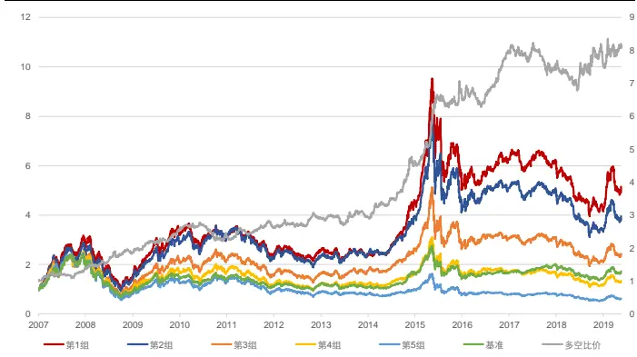
资料来源：天软科技，长江证券研究所

图 5：中证 800流动性溢价因子回测净值（中性后）
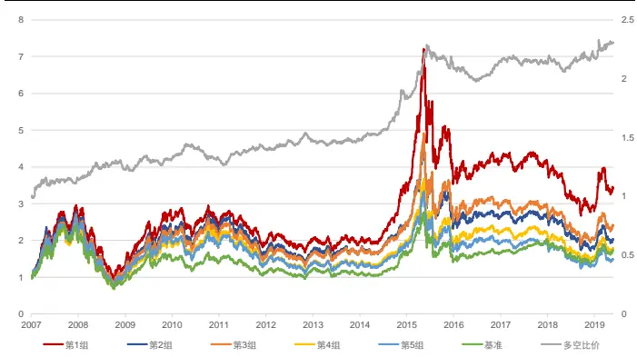
资料来源：天软科技，长江证券研究所

表 13：中证 800流动性溢价因子分年风险指标

| 中性前 |  |  |  |  | 中性后 |  |  |  |
| --- | --- | --- | --- | --- | --- | --- | --- | --- |
|  | 超额收益(%) | 信息比 | 多空收益(%) | 多空夏普比 | 超额收益(%) | 信息比 | 多空收益(%) | 多空夏普比 |
| 2007 | 27.91 | 1.80 | 26.82 | 1.71 | 21.20 | 1.53 | 11.51 | 1.20 |
| 2008 | 27.47 | 1.64 | 50.18 | 2.93 | 20.63 | 1.51 | 14.60 | 1.94 |
| 2009 | 29.31 | 2.23 | 26.69 | 2.15 | 15.78 | 1.55 | 2.79 | 0.59 |
| 2010 | 1.03 | 0.08 | -8.00 | -0.69 | 3.55 | 0.45 | 0.86 | 0.21 |
| 2011 | 4.73 | 0.86 | 24.80 | 2.25 | 1.41 | 0.35 | 7.92 | 1.71 |
| 2012 | -2.53 | -0.37 | 5.75 | 0.55 | -3.55 | -0.59 | 4.26 | 0.94 |
| 2013 | 2.32 | 0.39 | 3.86 | 0.34 | 3.87 | 0.73 | -2.42 | -0.57 |
| 2014 | 19.44 | 2.28 | 55.18 | 4.06 | 14.77 | 2.01 | 30.08 | 4.32 |
| 2015 | 31.84 | 2.53 | 35.01 | 2.55 | 25.00 | 2.32 | 10.68 | 1.42 |
| 2016 | 7.08 | 1.03 | 21.44 | 1.98 | -1.54 | -0.12 | 0.94 | 0.29 |
| 2017 | -15.62 | -2.30 | -3.79 | -0.53 | -15.43 | -2.46 | 1.15 | 0.39 |
| 2018 | -4.81 | -0.40 | 4.74 | 0.45 | -4.83 | -0.47 | 1.38 | 0.41 |
| 2019(至今) | -1.41 | -0.25 | 5.15 | 0.76 | -2.46 | -0.46 | 6.28 | 1.84 |
| 总计 | 9.54 | 0.93 | 19.26 | 1.54 | 5.85 | 0.67 | 7.23 | 1.15 |

资料来源：天软科技，长江证券研究所
总结本章节统计结果：

在全 A股和中证 800范围内，流动性溢价因子中性前后均有一定的选股能力，且线性排序性较好。

剥离风格和行业的线性影响后，估计溢价频率越高，因子表现越好。

## 高频类反转因子

在《高频因子（二）：结构化反转因子》中，依据局部成交量越高反转效应越强的假设，给出了高频反转因子和结构化反转因子的构建。本文主要针对特定问题，给出讨论。表14 给出了本文涉及到的反转类因子。

表 14：反转类因子整理

| 大类 | 子类 | 构建方式 |
| --- | --- | --- |
| 基础类 | 基础反转因子 | 日度对数收益等权求和 |
|  | 高频反转因子 | 高频k线对数收益成交量加权求和 |
| 全局类 | 结构反转因子 | 高频k线成交量划分动量和反转区间，以反转区间对数收益成交量加权减去动量区间对数收益成交量倒数加权 |
|  | 动量区间反转因子 | 高频k线成交量划分动量区间和反转区间，动量区间对数收益成交量倒数加权 |
| 分割类 | 反转区间反转因子 | 高频k线成交量划分动量区间和反转区间，反转区间对数收益成交量加权 |
|  | 开盘反转因子 | 高频k线每日开盘对数收益率等权（成交量加权）求和 |
| 开盘类 | 去开盘反转因子 |  |
|  |  | 高频k线去每日开盘数据，对数收益率等权（成交量加权)求和 |

资料来源：天软科技，长江证券研究所

## 因子的有效性

本节从统计的角度，以 10 分钟频率为例，重点展示 Fama-MacBeth 的回归结果，说明全局类反转因子相比基础反转因子有更稳定的表现，且可以提供额外的信息。在回归时保证新加入的因子和 Fama 因子正交：

反转类因子部分，对反转类因子做与 Fama 因子（剔除反转因子）的正交化处理，再进行回归。

新加入因子部分，对全局类反转因子剥离 Fama 因子的线性影响后进行统计，具体采取 Forward 因子的做法：首先对反转因子做 Fama 因子（剔除反转因子）的正交化处理；再对新加入的全局类反转因子做 Fama 因子的正交化互处理，最后进行回归。

新加入因子部分从基础反转因子开始做线性剥离，目的在于和反转类因子部分的统计结果保持一致。在《资金流因子全面测试正交化方法详解中》，我们证明了，在与股票收益率做截面回归时，新加入的正交因子不改变原式中其他因子的因子收益，若新因子显著，则说明其能从残差中提取额外信息，故以上述方法进行回归，可以保证剔除反转因子的Fama 因子部分回归结果不变，之间有可比性。后文中在进行反转类因子的回归时，还将使用这一方法。

表 15 给出了回归结果，可以得到以下结论：

从反转类因子部分的回归结果看，全局类反转因子的表现比基础反转因子更好，其因子收益和夏普比更高，t 值更为显著，高频数据可以改进反转因子的收益。

从新加入因子部分的回归结果看，全局类反转因子可以提供额外的收益解释，t 值均在显著范围内。

纵向比较，从因子 t 值上看，高频反转因子的结果最为显著；从平均绝对 t 值和 t值>2 百分比上看，统计意义上更为稳定的是基础反转因子。

表 15：全局类反转因子 Fama-MacBeth 回归统计

|  |  | 因子IC | 因子IC_IR | 因子年化收益 | 因子年化标准差 | 因子夏普比 | 因子t值 | 平均t值 |  | 平均绝对t值 t值>2百分比 |
| --- | --- | --- | --- | --- | --- | --- | --- | --- | --- | --- |
| 原风格因子 | Beta | -2.67% | -17.23% | 1.19 | 4.65 | 0.26 | 0.97 | 0.24 | 3.95 | 64.37 |
|  | 规模 | -4.68% | -23.32% | -9.73 | 6.92 | -1.41 | -5.36 | -2.84 | 5.68 | 81.03 |
|  | EP | 3.21% | 20.47% | 1.91 | 3.50 | 0.54 | 2.07 | 0.68 | 3.00 | 59.20 |
|  | 流动性 | -7.30% | -44.63% | -10.06 | 4.89 | -2.06 | -7.83 | -3.29 | 5.07 | 78.16 |
|  | 波动率 | -7.77% | -54.72% | -1.70 | 3.64 | -0.47 | -1.78 | -0.46 | 2.51 | 47.70 |
| 反转类因子 | 反转 | -7.54% | -48.34% | -4.06 | 5.02 | -0.81 | -3.08 | -1.50 | 4.02 | 67.82 |
|  | 高频反转 | -9.35% | -101.32% | -5.48 | 3.00 | -1.83 | -6.97 | -1.91 | 2.96 | 54.02 |
|  | 结构反转 | -8.72% | -99.93% | -4.66 | 2.84 | -1.64 | -6.24 | -1.65 | 2.73 | 50.00 |
|  | 高频反转 | -9.35% | -101.32% | -4.43 | 2.83 | -1.56 | -5.95 | -1.20 | 2.15 | 47.13 |
| 新加入因子 | 结构反转 | -8.72% | -99.93% | -3.34 | 2.50 | -1.34 | -5.09 | -0.96 | 1.96 | 43.10 |

资料来源：天软科技，长江证券研究所

## 反转效应的结构思考

## 信息来源

以高频数据构建因子时，给出了反转类（动量类）因子的通式，主要从时间划分和加权方式两个维度进行改进：

$$
\mathbf{Rev}_{per}=\sum_{i=1}^{period}w_{i}\mathbf{log}\frac{Close_{t-i+1}}{Close_{t-i}}
$$

故因子改进的效果来源可以分为两部分：高频 k线上体现的行情微观结构，加权方式上体现的反转效应侧重。为探究两者是否均可以带来因子表现上的改进，表 16 和表 17 分别给出了全 A 股和中证 800 范围内，不同参数不同反转类因子的表现，其中高频表示高频反转因子，结构表示以结构反转因子，后跟的数字表示确定动量反转区间的阈值。从风险指标的展示结果可以得到以下结论：

日度频率上看，在全 A 股和中证 800 内，不使用高频 k 线数据，仅以成交量对日度对数收益率进行加权求和得到的高频反转因子，在超额收益和多空收益上均获得了一定的提高，即加权方式可以加强反转效应，提高因子收益。

以高频反转因子为观察标的，在全 A 股和中证 800 内，频率越高，反转因子的收益越高，即更精细化的时间划分可以提高反转因子的表现。

从高频反转因子到结构反转因子，精确到日内的 k 线均可对因子表现给出改进，而日度频率的因子表现均在下降，说明从日度收益率上看，价格均呈现反转变化，价格变动的动量效应仅存在于微观局部的结构中。

比较高频 k 线数据，在全 A 股内，结构反转因子对 60 分钟、30 分钟和 10 分钟均有所改进，而对 5 分钟线则改进有限，有两种可能：（1）5 分钟级别的价格变动可以直接通过强弱反转效应概括，而略低频率的则需要区分适当的动量；（2）细化到5 分钟级别成交量已经有时间维度上的波动，导致局部对过渡反应的刻画产生误差。

在中证 800 内，结构反转因子表现普遍不如高频反转因子，说明在大市值内，个股短期动量效应较弱。

表 16：全 A股基础类反转因子、全局类反转因子风险指标（单位：%）

| 超额收益 |  |  |  |  |  |  | 多空收益 |  |  |  |  |  |
| --- | --- | --- | --- | --- | --- | --- | --- | --- | --- | --- | --- | --- |
|  | 基础反转 | 日线 | 60分钟线 | 30分钟线 | 10分钟线 | 5分钟线 | 基础反转 | 日线 | 60分钟线 | 30分钟线 | 10分钟线 | 5分钟线 |
| 高频 | 0.89 | 2.86 | 4.51 | 5.77 | 5.99 | 6.41 | 23.31 | 25.90 | 27.93 | 29.77 | 28.77 | 28.08 |
| 结构5 |  | 1.33 | 3.86 | 5.52 | 6.94 | 5.57 | - | 13.20 | 24.27 | 28.16 | 29.02 | 26.80 |
| 结构10 | - | -0.31 | 4.95 | 5.85 | 7.18 | 6.08 | - | 12.91 | 26.75 | 29.13 | 29.75 | 28.14 |
| 结构15 | 1 | 0.79 | 4.47 | 6.53 | 6.36 | 6.80 | - | 16.21 | 27.01 | 30.14 | 28.44 | 29.08 |
| 结构20 |  | 1.74 | 5.34 | 6.42 | 6.85 | 6.73 |  | 19.27 | 29.46 | 30.36 | 28.90 | 29.20 |

资料来源：天软科技，长江证券研究所

表 17：中证 800基础类反转因子、全局类反转因子风险指标（单位：%）

| 超额收益 |  |  |  |  |  |  | 多空收益 |  |  |  |  |  |
| --- | --- | --- | --- | --- | --- | --- | --- | --- | --- | --- | --- | --- |
|  | 基础反转 | 日线 | 60分钟线 | 30分钟线 | 10分钟线 | 5分钟线 | 基础反转 | 日线 | 60分钟线 | 30分钟线 | 10分钟线 | 5分钟线 |
| 高频 | 6.02 | 7.79 | 8.87 | 9.82 | 10.10 | 9.90 | 15.92 | 18.00 | 19.09 | 20.50 | 21.59 | 20.17 |
| 结构5 |  | 4.37 | 7.24 | 8.31 | 9.61 | 8.72 | - | 6.93 | 14.00 | 15.60 | 19.49 | 18.12 |
| 结构10 |  | 3.80 | 7.24 | 8.72 | 9.69 | 9.57 | - | 6.70 | 15.38 | 17.00 | 20.27 | 19.11 |
| 结构15 |  | 4.86 | 7.58 | 8.87 | 9.38 | 9.62 | - | 8.91 | 15.84 | 18.35 | 20.15 | 19.85 |
| 结构20 |  | 5.28 | 7.86 | 9.58 | 9.63 | 10.13 |  | 10.21 | 17.07 | 18.94 | 20.73 | 19.93 |

资料来源：天软科技，长江证券研究所

## 价格的动量与反转效应

在结构反转因子的构建过程中，以局部成交量进行动量区间和反转区间的划分，以反转区间收益减去动量区间收益得到最后的因子，本质上是反转区间的反转因子和动量区间的动量因子等权合成。在本节将两个因子拆开，结构上看价格变动是否动量效应和反转效应兼具。下文以“正”表示反转区间反转因子，以“负”表示动量区间反转因子，以“总”表示结构反转因子。

表 18 展示了分割类反转因子和结构反转因子之间的相关性，可以看出结构反转因子和反转区间反转因子有很高的相关性，而和动量区间反转因子的相关性较低，反转区间反转因子为结构反转因子中的主要矛盾。此外不同参数下动量区间反转因子差别也较大，同一频率下有一定的相关性，而不同频率下的相关性则大幅降低，这一现象或与动量区间反转因子以成交量倒数的加权方式相关。

表 18：分割类反转因子相关性

| 方向 |  |  | 正 |  |  |  | 负 |  |  |  | 总 |  |  |  |
| --- | --- | --- | --- | --- | --- | --- | --- | --- | --- | --- | --- | --- | --- | --- |
|  | k线 |  | 5分钟线 |  | 10分钟线 |  | 5分钟线 |  | 10分钟线 |  | 5分钟线 |  | 10分钟线 |  |
|  |  | 阈值 | 5 | 10 | 5 | 10 | 5 | 10 | 5 | 10 | 5 | 10 | 5 | 10 |
| 正 | 5分钟线 | 5 | 100.00% | 100.00% | 96.63% | 96.61% | 1.75% | 2.24% | 1.61% | 2.26% | 98.54% | 99.07% | 94.09% | 95.09% |
|  |  | 10 | 100.00% | 100.00% | 96.65% | 96.62% | 1.75% | 2.30% | 1.64% | 2.31% | 98.54% | 99.08% | 94.11% | 95.11% |
|  | 10分钟线 | 5 | 96.63% | 96.65% | 100.00% | 100.00% | 1.85% | 2.33% | 1.90% | 2.60% | 95.26% | 95.77% | 97.41% | 98.46% |
|  |  | 10 | 96.61% | 96.62% | 100.00% | 100.00% | 1.87% | 2.37% | 1.90% | 2.72% | 95.25% | 95.76% | 97.41% | 98.48% |
| 负 | 5分钟线 | 5 | 1.75% | 1.75% | 1.85% | 1.87% | 100.00% | 91.48% | 28.59% | 25.57% | 16.52% | 12.57% | 7.17% | 5.63% |
|  |  | 10 | 2.24% | 2.30% | 2.33% | 2.37% | 91.48% | 100.00% | 30.06% | 29.82% | 15.89% | 13.99% | 7.97% | 6.69% |
|  | 10分钟线 | 5 | 1.61% | 1.64% | 1.90% | 1.90% | 28.59% | 30.06% | 100.00% | 84.52% | 5.68% | 5.04% | 21.87% | 15.27% |
|  |  | 10 | 2.26% | 2.31% | 2.60% | 2.72% | 25.57% | 29.82% | 84.52% | 100.00% | 6.04% | 5.72% | 19.96% | 18.03% |
| 总 | 5分钟线 | 5 | 98.54% | 98.54% | 95.26% | 95.25% | 16.52% | 15.89% | 5.68% | 6.04% | 100.00% | 99.76% | 93.81% | 94.49% |
|  |  | 10 | 99.07% | 99.08% | 95.77% 95.76% |  | 12.57% | 13.99% | 5.04% | 5.72% | 99.76% | 100.00% | 94.13% | 94.92% |
|  | 10分钟线 | 5 | 94.09% 94.11% |  | 97.41% | 97.41% | 7.17% | 7.97% | 21.87% | 19.96% | 93.81% | 94.13% | 100.00% | 99.37% |
|  |  | 10 | 95.09% 95.11% |  | 98.46% | 98.48% | 5.63% | 6.69% | 15.27% | 18.03% | 94.49% | 94.92% | 99.37% | 100.00% |

资料来源：天软科技，长江证券研究所

进一步从回测角度，展示动量和反转区间的选股能力。在表 19给出了全 A 股和中证 800范围内，反转区间反转因子、动量区间反转因子和结构反转因子的风险指标，可以得到以下结论：

在全 A 股范围内，从多空收益上看，动量区间反转因子本身会包含一定的选股能力，且比较结构反转因子和反转区间反转因子的信息比和多空夏普比，也可以看到合成的因子包含更多的信息。

在中证 800 范围内，从多空收益上看，动量区间反转因子本身并不包含动量效应的选股能力，且比较结构反转因子和反转区间反转因子的多空夏普比，也可以看到反转时间段因子有更高的信息。

表 19：分割类反转因子风险指标

| 结构反转因子 |  |  |  |  |  |  |  | 反转区间反转因子 |  |  |  | 动量区间反转因子 |  |  |  |
| --- | --- | --- | --- | --- | --- | --- | --- | --- | --- | --- | --- | --- | --- | --- | --- |
|  | k线 | 阈值 超额收益 信息比 多空收益 多空夏普比 |  |  |  |  |  | 超额收益 | 信息比 多空收益 | 多空夏普比 | 超额收益 | 信息比 | 多空收益 |  | 多空夏普比 |
| 全 A | 5分钟 | 5 | 5.73% | 1.10 | 27.44% | 2.74 | 6.54% | 1.11 | 28.73% |  | 2.63 | -1.00% | -0.21 | 1.91% | 0.38 |
|  | 5分钟 | 10 | 6.25% | 1.16 | 28.81% | 2.78 | 6.50% | 1.10 | 28.62% | 2.62 | -1.40% | -0.29 | 1.47% |  | 0.29 |
|  | 10分钟 |  | 5 6.95% | 1.31 | 29.40% | 2.81 | 6.02% | 0.99 | 29.18% |  | 2.56 | 1.11% | 0.29 | 1.69% | 0.35 |
| 股 | 10分钟 | 10 | 7.18% | 1.31 | 30.10% | 2.83 | 5.96% | 0.98 | 29.22% |  | 2.56 | -0.42% | -0.07 | 2.20% | 0.42 |
| 中 | 5分钟 | 5 | 8.80% | 0.88 | 18.55% | 1.88 | 9.95% | 0.97 | 20.61% |  | 1.89 | 2.16% | 0.26 | -0.60% | -0.10 |
| 证 8 | 5分钟 | 10 | 9.68% | 0.95 | 19.52% | 1.93 | 10.11% | 0.99 | 20.83% |  | 1.90 | 1.84% | 0.22 | -1.09% | -0.18 |
| 0 | 10分钟 | 5 | 9.69% | 0.96 | 19.92% | 1.93 | 10.20% | 1.00 | 22.13% |  | 1.94 | 2.39% | 0.28 | -0.05% | 0.01 |
| 0 | 10分钟 | 10 | 9.71% | 0.96 | 20.57% | 1.93 | 10.11% | 0.99 | 22.06% |  | 1.93 | 1.77% | 0.22 | -0.45% | -0.06 |

资料来源：天软科技，长江证券研究所

总结来看，动量区间反转因子的动量效应有限，且表现并不稳定，这一现象或与成交量倒数的加权方式有关，导致不同频率下动量区间内因子波动较大。

## 开盘的反转效应

在一天的交易中，开盘和收盘往往占据全天成交相对较高的比重，尤以开盘为重，则从构建全局类反转因子的逻辑出发，开盘应具备较高的反转效应；由于隔夜的原因，开盘一般集中较多的知情者交易，或包含较多需要消化的市场信息，故开盘可能存在较强的动量效应，如果这一现象存在，则会影响整个全局类反转因子的构建。本节针对这两个角度，给出开盘时间段动量或反转效应的相关验证：（1）开盘是否包含增量信息；（2）开盘是否存在动量效应。

表 20 给出了开盘类反转因子的相关性，表 21 给出了采用 Forward 因子和 Backward 因子方法 Fama-MacBeth 回归的统计结果，以 5 分钟为例：

对去开盘反转因子做 Fama 因子（剔除反转因子）的正交化处理；

Forward 因子方法对新加入的开盘反转因子做 Fama 因子（剔除反转因子）和去开盘反转因子的正交化互处理，并进行回归，即两步加入的因子构建时所用到的信息不存在交集；

Backward 因子方法对新加入的高频反转因子做 Fama 因子（剔除反转因子）和去开盘反转因子的正交化互处理，并进行回归，即两步加入的因子构建时所用到的信息存在交集，在线性模型以正交化的方式进行信息剥离。

由统计结果可以得到以下结论：

开盘反转因子之间相关性较高，且和全局类反转因子呈现一定的正相关，但和去开盘反转因子呈现一定程度上的负相关。

从去开盘部分看，IC 和 IC_IR 显示因子有选股能力，回归的因子 t 值呈现显著。

从开盘部分看，IC 和 IC_IR 显示未加权的开盘因子不具备选股效果，而加权后的因子则有一定信息量，这一点和回归的 t 值保持一致。

对比 Forward因子方法和 Backward因子方法对开盘信息的引进，均可得到开盘中包含信息且为反转效应的结论，但检验 t 值有一定差别，以高频反转因子剔除线性影响得到的因子 t 值更为显著，或与因子权重有关，开盘部分为每日开盘的加权平均，而后者展示的为整体中的加权，即放在全时间段相比，开盘部分由于成交量较高的原因，可以放大其对于反转效应的影响。

表 20：开盘类反转因子相关性

|  | 开盘5分钟线 | 开盘5分钟线(加权) | 开盘10分钟线 | 开盘10分钟线(加权) | 高频反转 | 结构反转 | 去开盘高频反转 | 去开盘结构反转 |
| --- | --- | --- | --- | --- | --- | --- | --- | --- |
| 开盘5分钟线 | 100.00% | 71.29% | 67.69% | 88.07% | 30.68% | 29.82% | -17.84% | -15.46% |
| 开盘5分钟线(加权) | 71.29% | 100.00% | 90.77% | 63.58% | 56.61% | 54.28% | -4.70% | -3.73% |
| 开盘10分钟线 | 67.69% | 90.77% | 100.00% | 72.96% | 61.79% | 59.16% | -4.76% | -3.79% |
| 开盘10分钟线(加权) | 88.07% | 63.58% | 72.96% | 100.00% | 34.48% | 33.27% | -15.60% | -13.36% |
| 高频反转 | 30.68% | 56.61% | 61.79% | 34.48% | 100.00% | 95.11% | 68.06% | 63.47% |
| 结构反转 | 29.82% | 54.28% | 59.16% | 33.27% | 95.11% | 100.00% | 64.24% | 70.67% |
| 去开盘高频反转 | -17.84% | -4.70% | -4.76% | -15.60% | 68.06% | 64.24% | 100.00% | 92.44% |
| 去开盘结构反转 | -15.46% | -3.73% | -3.79% | -13.36% | 63.47% | 70.67% | 92.44% | 100.00% |

资料来源：天软科技，长江证券研究所

表 21：开盘类反转因子 Fama-MacBeth 回归统计

|  |  | 因子IC | 因子IC_IR | 因子年化收益 | 因子年化标准差 | 因子夏普比 | 因子t值 | 平均t值 | 平均绝对t值 t值>2百分比 |  |
| --- | --- | --- | --- | --- | --- | --- | --- | --- | --- | --- |
| 原风格因子 | Beta | -2.66% | -17.20% | 1.17 | 4.65 | 0.25 | 0.96 | 0.22 | 3.94 | 65.52 |
|  | 规模 | -4.68% | -23.30% | -9.72 | 6.91 | -1.41 | -5.35 | -2.84 | 5.67 | 81.03 |
|  | EP | 3.21% | 20.53% | 1.91 | 3.50 | 0.55 | 2.08 | 0.68 | 3.00 | 59.20 |
|  | 流动性 | -7.29% | -44.56% | -10.05 | 4.90 | -2.05 | -7.81 | -3.28 | 5.07 | 78.74 |
|  | 波动率 | -7.76% | -54.60% | -1.69 | 3.65 | -0.46 | -1.76 | -0.45 | 2.51 | 45.98 |
| 5分钟线 | 去开盘部分 | -9.04% | -99.05% | -6.07 | 3.22 | -1.89 | -7.18 | -2.17 | 3.19 | 59.77 |
|  | 开盘部分 | -0.10% | -1.10% | -0.16 | 2.50 | -0.07 | -0.25 | -0.07 | 2.17 | 44.83 |
|  | 开盘部分(加权) | -2.19% | -33.37% | -1.47 | 1.96 | -0.75 | -2.86 | -0.51 | 1.81 | 35.63 |
|  | 高频部分(中性) | -9.35% | -101.37% | -3.41 | 2.67 | -1.27 | -4.85 | -0.83 | 1.88 | 37.93 |
| 10分钟线 | 去开盘部分 | -9.02% | -99.66% | -6.18 | 3.24 | -1.91 | -7.27 | -2.17 | 3.24 | 60.34 |
|  | 开盘部分 | -0.28% | -3.02% | 0.12 | 2.69 | 0.05 | 0.18 | 0.02 | 2.32 | 50.57 |
|  | 开盘部分(加权) | -2.54% | -36.39% | -1.53 | 1.98 | -0.77 | -2.94 | -0.52 | 1.89 | 40.80 |
|  | 高频部分(中性) | -9.35% | -101.37% | -3.41 | 2.67 | -1.27 | -4.85 | -0.83 | 1.88 | 37.93 |

资料来源：天软科技，长江证券研究所

下面以加权 10 分钟频率为例，从回测角度直接给出开盘反转因子的表现情况。图 6 和图 7 分别给出了因子在全 A 股和中证 800 范围内的净值图，表 22 给出了不同参数因子的风险指标。最后从 Backward 因子方法出发，在表23 给出了全局类反转因子和去开盘反转因子的对比表现，可以得到以下结论：

回测结果上看，各个参数的开盘反转因子均呈现一定的反转性。加权 10 分钟因子除 2014 年和 2017 年，多空比价曲线整体向上。但从净值的分组性上看，包含的信息量有限，分组效果并不明显，全 A 股的头部组相对于基准不能获得超额收益。

横向比较，单从开盘时间段看，加权的开盘反转因子收益能力比非加权的开盘反转因子强，说明在开盘阶段仍然存在成交量越高反转效应越强的现象。

以去开盘反转因子和全局类反转因子相比，各个参数均为全局类反转因子的回测效果更好，侧面说明开盘的价格变动多以反转效应为主，且可以提供信息增量。

图 6：全 A股开盘反转因子回测净值
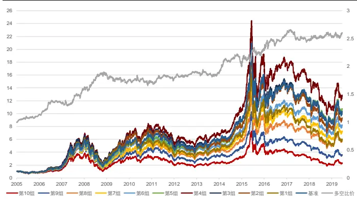
资料来源：天软科技，长江证券研究所

图 7：中证 800开盘反转因子回测净值
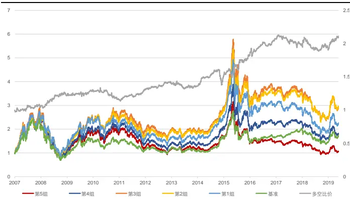
资料来源：天软科技，长江证券研究所

表 22：开盘类反转因子风险指标

| 全A股 |  |  |  |  |  |  | 中证800 |  |  |
| --- | --- | --- | --- | --- | --- | --- | --- | --- | --- |
| k线 | 是否加权 | 超额收益 | 信息比 | 多空收益 | 多空夏普比 | 超额收益 | 信息比 | 多空收益 | 多空夏普比 |
| 5分钟线 | 否 | -8.31% | -1.40 | 1.97% | 0.25 | 1.65% | 0.21 | 5.26% | 0.63 |
| 5分钟线 | 是 | -3.79% | -0.72 | 7.10% | 1.00 | 2.26% | 0.27 | 6.45% | 0.86 |
| 10分钟线 | 否 | -7.49% | -1.26 | 2.58% | 0.30 | 0.41% | 0.08 | 3.41% | 0.40 |
| 10分钟线 | 是 | -3.49% | -0.65 | 8.38% | 1.11 | 2.36% | 0.28 | 6.09% | 0.77 |

资料来源：天软科技，长江证券研究所

表 23：全局类反转因子对比去开盘反转因子风险指标

| 全A股 |  |  |  |  |  |  | 中证800 |  |  |  |
| --- | --- | --- | --- | --- | --- | --- | --- | --- | --- | --- |
|  |  | 整体 |  | 去开盘 |  |  | 整体 |  | 去开盘 |  |
| k线 | 阈值 | 超额收益 | 信息比 |  | 超额收益 | 信息比 | 多空收益 | 多空夏普比 | 多空收益 | 多空夏普比 |
| 5分钟线 | 高频 | 6.41% | 1.08 | 4.25% | 0.77 | 20.17% |  | 1.85 | 17.88% | 1.68 |
| 5分钟线 | 10 | 6.08% | 1.13 | 4.25% | 0.85 |  | 19.11% | 1.89 | 16.52% | 1.70 |
| 10分钟线 | 高频 | 5.99% | 0.98 | 4.92% | 0.88 |  | 21.59% | 1.89 | 20.28% | 1.87 |
| 10分钟线 | 10 | 7.18% | 1.30 | 5.85% | 1.15 | 20.27% |  | 1.90 | 16.82% | 1.70 |

资料来源：天软科技，长江证券研究所

## 市场波动与反转

在《高频因子（二）：结构性反转因子》中，我们从反转因子的收益来源——市场的过度反应，思考了反转因子的收益和市场环境的关系：以中证全指日度收益率标准差计算的年度波动率为市场过度反应的代理变量，以反转类因子的年度超额收益作为因子收益，以线性回归的结果讨论反转因子收益来源。下面从更高的频率给出进一步的讨论。图 8到图 13 分别展示了月度频率、季度频率和年度频率下，波动率和同期因子超额收益及下期因子超额收益的回归结果，可以得到以下结论：

频率上比较，从月度到年度，除年度错期外，回归的效果均有显著提升；波动率可以对反转因子收益有一定解释，但短期的因子收益波动较大，信噪比较高，而年度频率下的统计可以有效剔除噪音的影响，回归效果最好。

同期和错期比较，月度和季度都有一定的回归效果，且同期表现优于错期，即同期市场过度反应和反转因子收益最为相关，而市场环境有一定的持续性，使得错期仍有一定效果。年度上看错期没有效果，和市场状态的持续长度有关。

参数上比较，回归效果可以体现反转类因子受市场过度反应的程度，回归的效果以结构反转因子最佳，高频反转因子次之，基础反转的效果较差，即结构反转因子可以更好的反应反转因子的逻辑。截距可以反应因子收益的能力，回归上看，高频反转因子和结构反转因子可以本质上提高反转效应的收益来源。

图 8：月频同期波动率与因子收益
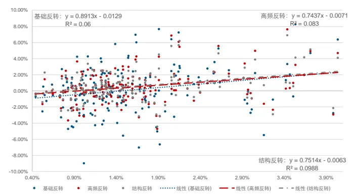
资料来源：天软科技，长江证券研究所
请阅读最后评级说明和重要声明

图 9：月频错期波动率与因子收益
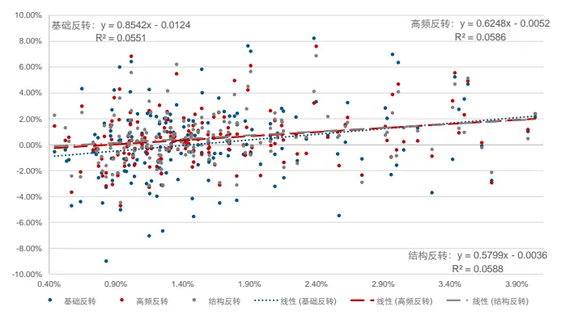
资料来源：天软科技，长江证券研究所

图 10：季频同期波动率与因子收益
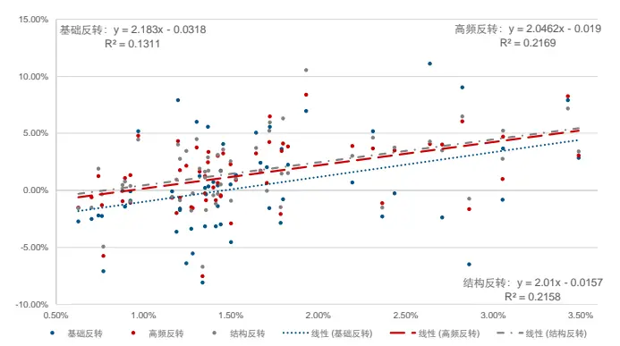
资料来源：天软科技，长江证券研究所

图 11：季频错期波动率与因子收益
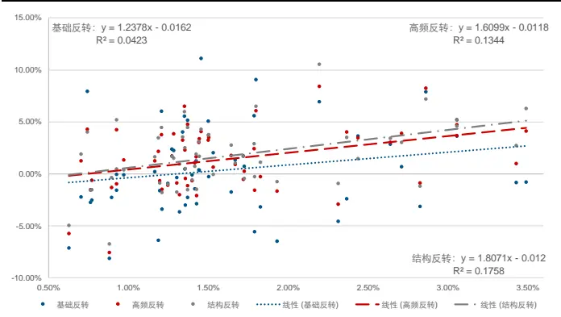
资料来源：天软科技，长江证券研究所

图 12：年频同期波动率与因子收益
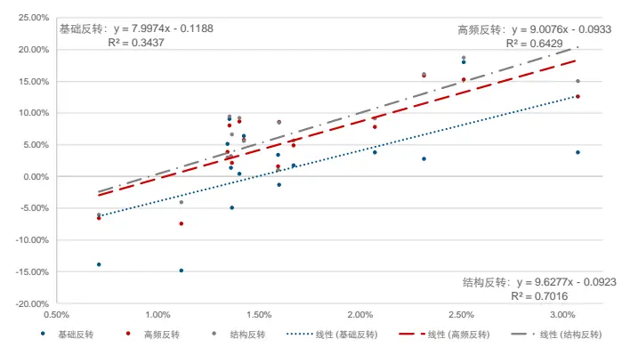
资料来源：天软科技，长江证券研究所

图 13：年频错期波动率与因子收益
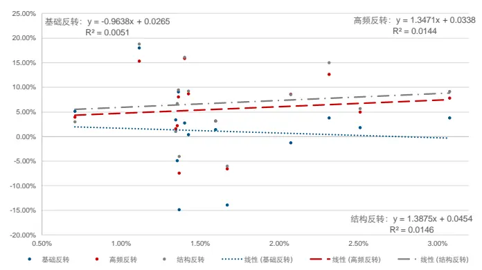
资料来源：天软科技，长江证券研究所

## 全中性回测结果

最后，以 10 分钟线 10 阈值的结构反转因子为例，在剔除了 9 大类风格因子和中信一级行业的线性影响后，给出其回测表现。图 14 和图 15 分别给出了全 A 股和中证 800范围内回测净值图，表 24 给出了因子分年风险指标，可以得到以下结论：

中性后的因子仍有一定的选股能力，但效果有所下降，且分组不再呈现线性，选股的收益来源主要来自空头组。

从多空收益上看，中性后的因子回撤的年份主要在 2014 年，2019 年有所走平。

图 14：全 A股全局类反转因子回测净值（中性后）
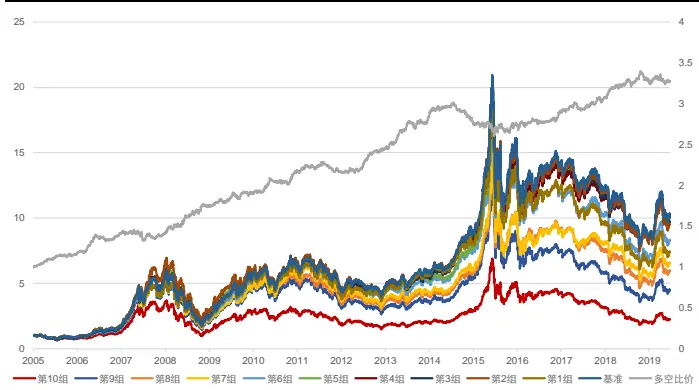
资料来源：天软科技，长江证券研究所

图 15：中证 800全局类反转因子回测净值（中性后）
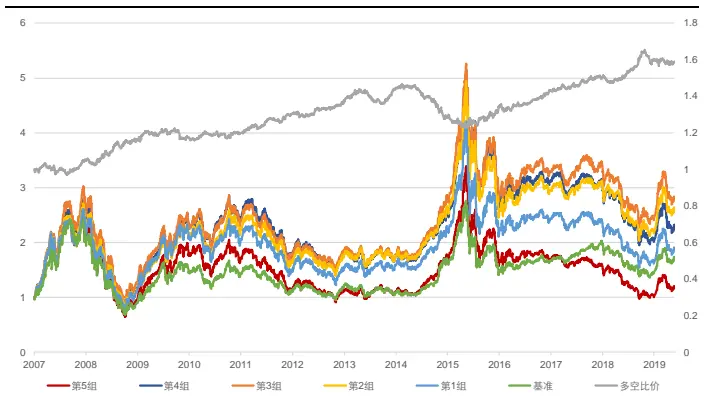
资料来源：天软科技，长江证券研究所

表 24：全中性后结构反转因子风险指标

| 全市场 |  |  |  |  | 中证800 |  |  |  |
| --- | --- | --- | --- | --- | --- | --- | --- | --- |
|  | 超额收益(%) | 信息比 | 多空收益(%) | 多空夏普比 | 超额收益(%) | 信息比 | 多空收益(%) | 多空夏普比 |
| 2005 | 1.24 | 0.37 | 16.52 | 3.16 |  |  |  |  |
| 2006 | 1.86 | 0.42 | 20.68 | 3.02 | - | - | - | 1 |
| 2007 | -14.32 | -2.38 | 0.01 | 0.01 | 5.55 | 0.42 | 2.50 | 0.60 |
| 2008 | 8.19 | 1.48 | 25.08 | 2.48 | 13.65 | 0.93 | 13.21 | 1.84 |
| 2009 | -0.09 | 0.12 | 7.91 | 1.43 | 15.21 | 1.47 | 0.37 | 0.18 |
| 2010 | -0.40 | -0.03 | 14.57 | 2.63 | 5.65 | 0.61 | 2.96 | 0.71 |
| 2011 | -6.08 | -2.10 | -0.22 | -0.08 | -5.53 | -0.98 | 8.63 | 2.15 |
| 2012 | 2.48 | 0.83 | 12.85 | 2.90 | -7.02 | -0.93 | 3.79 | 1.08 |
| 2013 | 5.20 | 1.48 | 15.44 | 3.00 | 10.22 | 1.45 | 4.02 | 1.03 |
| 2014 | -5.77 | -1.86 | -1.64 | -0.44 | -8.09 | -1.14 | -7.90 | -1.91 |
| 2015 | -4.45 | -0.49 | -1.12 | 0.02 | 14.22 | 1.21 | 0.11 | 0.16 |
| 2016 | 0.44 | 0.20 | 6.11 | 1.35 | 0.27 | 0.21 | 9.43 | 2.13 |
| 2017 | -10.02 | -3.72 | 5.31 | 1.52 | -16.13 | -2.20 | 6.11 | 1.74 |
| 2018 | -4.08 | -1.25 | 6.97 | 1.69 | -6.52 | -0.72 | 6.33 | 1.50 |
| 2019(至今) | -3.96 | -2.47 | -0.33 | -0.13 | -5.77 | -1.31 | -0.74 | -0.06 |
| 总计 | -2.31 | -0.50 | 8.88 | 1.51 | 0.79 | 0.12 | 3.95 | 0.81 |

资料来源：天软科技，长江证券研究所

总结本章节统计结果：

从统计角度看，全局类高频反转因子可以提供信息增益。

全局类反转因子的改进在高频区间的划分及加权方式上均有改进。

价格上动量效应并不明显，主要体现在三个维度：日度价格变动均为反转效应；在中证 800内，各个参数的动量区间反转因子均未提供选股信息增益；全 A股范围内动量区间的反转因子可以提供信息增益，但成交量倒数加权的构造方式使因子有较大波动。

开盘时间段的价格变动仍体现为反转效应，且能提供较为明显的信息增益。

市场波动率是反转类因子择时的重要代理变量，月度和季度上的错期回归均有较好的效果。

在对 9 大类风格因子和中信一级行业因子做正交化处理后，全局类高频类反转因子仍有一定的选股能力。

## 总结

本篇报告是高频因子系列的第三篇，主要对之前未说明的方法给出了一个系统的梳理，同时解决了前两篇报告中遗留的细节问题，作为方法运用上的一个展示：

高频因子需要考虑的核心问题在信息增量，除此之外，因子表现的细节问题，如行为交易逻辑、收益来源，也需要从特定角度进行考虑。研究方法以线性模型为基础，从因子统计和因子回测两个方面出发，给出统计意义和选股表现上最直接的展示。

以个股日度成交额为锚，对流动性溢价因子中的交易金额给出改进，并将溢价估计频率提高至 2 分钟频率，可以提供信息上的增量。Fama-MacBeth 回归 t 值为1.98，因子 IC为 8.10%，IC_IR 为 53.59%，相比全市场等权基准年化超额收益 7.24%，净值曲线排列完全呈现线性；完全剥离风格和行业的线性影响后仍有一定选股能力，因子 IC 为1.96%，IC_IR为 29.37%，相比全市场等权基准年化超额收益 0.92%，净值曲线排列基本呈现线性。

我们得到了以下微观结构上的高频反转因子的结论：高频率的时间区间划分和成交量加权的方式均可对反转因子给出改进；价格上的动量效应并不稳定；开盘时间段仍体现反转效应，且信息增益较为明显；市场波动率是反转类因子择时的重要代理变量，且在市场环境有持续性的前提下，当期市场波动率对下期因子收益在月度和季度上均有预测作用。

从统计维度上看，全局类高频反转因子可以提供信息增益，剥离了 Fama 因子（剔除反转因子）线性影响后，回归 t 值在-6 左右，剥离了 Fama 因子线性影响后，回归 t 值在-5 左右。

从回测角度上看，全局类高频反转因子可以提供信息增益，全局类反转因子在剥离风格因子和行业因子的线性影响后，仍具有一定的选股能力，全市场内多空年化收益为 8，88%，中证 800 内多空年化收益为 3.95%，因子仅在 2014 年有明显回撤。

| 上海 | 武汉 |
| --- | --- |
| 浦东新区世纪大道1198号世纪汇广场一座29层(200122) | 武汉市新华路特8号长江证券大厦11楼(430015) |
| 北京 | 深圳 |
| 西城区金融街33号通泰大厦15层（100032) | 深圳市福田区中心四路1号嘉里建设广场 3期36 楼(518048) |

## 投资评级说明

| 行业评级 | 报告发布日后的12个月内行业股票指数的涨跌幅相对同期相关证券市场代表性指数的涨跌幅为基准，投资建议的评 |  |
| --- | --- | --- |
|  | 级标准为： |  |
|  | 看 好： | 相对表现优于同期相关证券市场代表性指数 |
|  | 中 性： | 相对表现与同期相关证券市场代表性指数持平 |
|  | 看 淡： | 相对表现弱于同期相关证券市场代表性指数 |
| 公司评级 |  | 报告发布日后的12个月内公司的涨跌幅相对同期相关证券市场代表性指数的涨跌幅为基准，投资建议的评级标准为： |
|  | 买 入： | 相对同期相关证券市场代表性指数涨幅大于10% |
|  | 增 持： | 相对同期相关证券市场代表性指数涨幅在5%～10%之间 |
|  | 中 性： | 相对同期相关证券市场代表性指数涨幅在-5%～5%之间 |
|  | 减持： 相对同期相关证券市场代表性指数涨幅小于-5% |  |
|  |  | 无投资评级：由于我们无法获取必要的资料，或者公司面临无法预见结果的重大不确定性事件，或者其他原因，致使 我们无法给出明确的投资评级。 |
| 相关证券市场代表性指数说明：A股市场以沪深300指数为基准；新三板市场以三板成指（针对协议转让标的）或三板做市指数 (针对做市转让标的)为基准；香港市场以恒生指数为基准。 |  |  |

## 联系我们

## 分析师声明

作者具有中国证券业协会授予的证券投资咨询执业资格并注册为证券分析师，以勤勉的职业态度，独立、客观地出具本报告。分析逻辑基于作者的职业理解，本报告清晰准确地反映了作者的研究观点。作者所得报酬的任何部分不曾与，不与，也不将与本报告中的具体推荐意见或观点而有直接或间接联系，特此声明。

## 重要声明

长江证券股份有限公司具有证券投资咨询业务资格，经营证券业务许可证编号：10060000。

本报告仅限中国大陆地区发行，仅供长江证券股份有限公司（以下简称：本公司）的客户使用。本公司不会因接收人收到本报告而视其为客户。本报告的信息均来源于公开资料，本公司对这些信息的准确性和完整性不作任何保证，也不保证所包含信息和建议不发生任何变更。本公司已力求报告内容的客观、公正，但文中的观点、结论和建议仅供参考，不包含作者对证券价格涨跌或市场走势的确定性判断。报告中的信息或意见并不构成所述证券的买卖出价或征价，投资者据此做出的任何投资决策与本公司和作者无关。

本报告所载的资料、意见及推测仅反映本公司于发布本报告当日的判断，本报告所指的证券或投资标的的价格、价值及投资收入可升可跌，过往表现不应作为日后的表现依据；在不同时期，本公司可以发出其他与本报告所载信息不一致及有不同结论的报告；本报告所反映研究人员的不同观点、见解及分析方法，并不代表本公司或其他附属机构的立场；本公司不保证本报告所含信息保持在最新状态。同时，本公司对本报告所含信息可在不发出通知的情形下做出修改，投资者应当自行关注相应的更新或修改。

本公司及作者在自身所知情范围内，与本报告中所评价或推荐的证券不存在法律法规要求披露或采取限制、静默措施的利益冲突。

本报告版权仅为本公司所有，未经书面许可，任何机构和个人不得以任何形式翻版、复制和发布。如引用须注明出处为长江证券研究所，且不得对本报告进行有悖原意的引用、删节和修改。刊载或者转发本证券研究报告或者摘要的，应当注明本报告的发布人和发布日期，提示使用证券研究报告的风险。未经授权刊载或者转发本报告的，本公司将保留向其追究法律责任的权利。