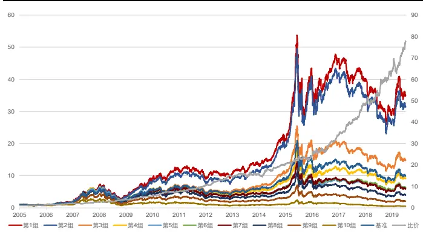
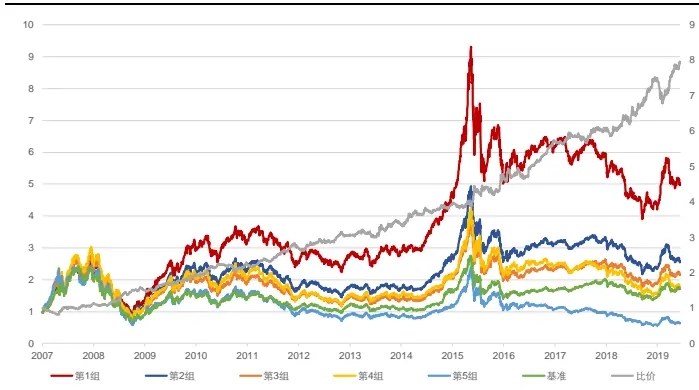
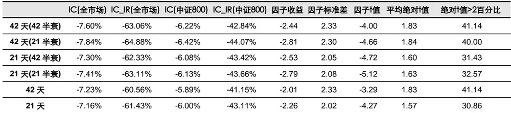
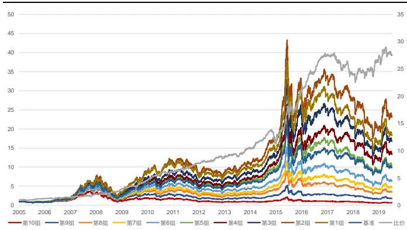
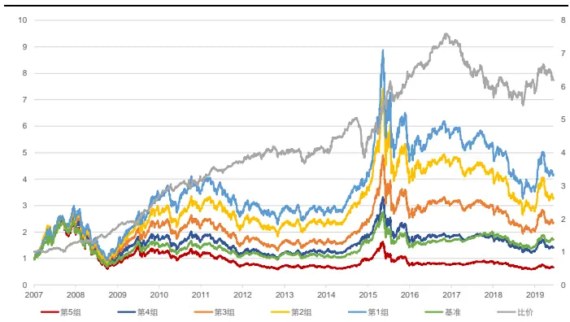
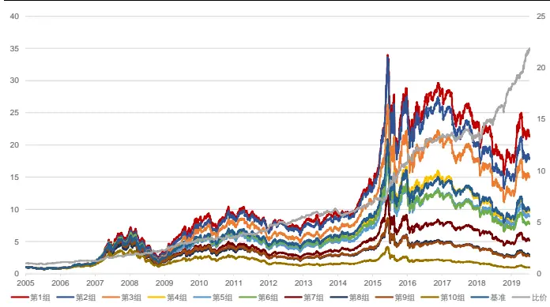
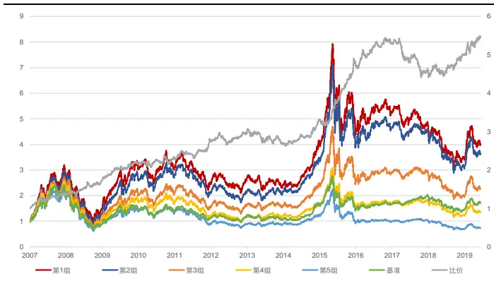
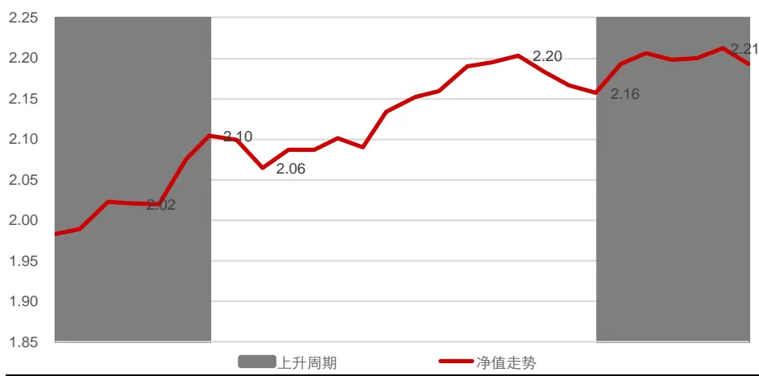
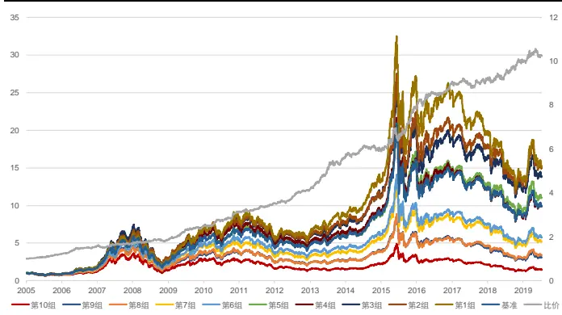
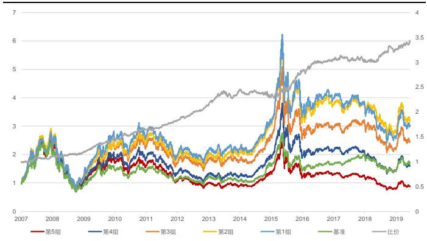

# 高频因子（五）：高频因子和交易行为

金融工程┃专题报告

## 报告要点

## 量价组合构建高频因子往往可以带来信息增量

量价组合构建因子构建过程相对复杂，和传统量价风格因子和高阶矩因子均有一定相关性，但相关性不高，往往可以带来新的信息增量。本文给出两种量价组合构建因子的案例，其中以价格轨迹变动改进的非流动性因子在剥离了规模因子的线性影响后，全 A 股范围内超额收益 9.70%，信息比 1.55，多空收益38.19%，多空夏普比 2.90。以主动买卖单构建的博弈因子，在全 A 股范围内超7额收益 4.47%，信息比 0.77，多空收益 26.67%，多空夏普比 2.10。

## 高频因子刻画交易行为，获得经验收益

高频因子的局限可以从三个维度给出刻画：从因子信息上看，各个高频因子的相关性有限，以特异率刻画交易异常行为，加入新的高频因子仍有显著的信息增量；从因子收益上看，因子彼此之间相互影响，加入新的因子回测收益有限；从因子风险上看，下行风险相关性高，尾部风险集中。

## 高频因子挖掘可以提高整体策略稳定性

高频因子收益的相关性有限，组合多个因子可以有效提高策略收益能力，降低风险。在剥离 barra 因子后，等权加总高频因子构建合成因子，在全 A 股范围内超额收益 3.07%，信息比 0.67，多空收益 18.07%，多空夏普比 2.39，每项风险指标均高于单个高频因子。

风险提示：1. 模型存在失效风险；2. 本文举例均基于历史数据，不保证未来收益。

## [Table分析师Author覃川桃

（8621）61118766

qinct@cjsc.com.cn

执业证书编号：S0490513030001

## 联系人 郑起

（8621）61118706

zhengqi2@cjsc.com

## [Table相关研究_

《从二季度配置看内外资机构偏好》2019-7-22

《负面事件指数增强策略》2019-7-21

《高频因子（三）：高频因子研究框架》2019-7-20

## 量价组合因子

综合量、价数据构建因子有两种方式：多维度单层次，即综合量、价维度中各自的单一数据；多维度多层次，即综合量、价维度中多个数据。量价数据的结合，并非从分布上粗略给出交易行为上的特点，而是直接从交易行为的逻辑出发，找出具有短期超额收益的个股。这种方式构建因子的过程相对复杂，所以和传统的量价风格因子及高阶矩因子均有一定的相关性，但相关性不高，故往往可以提供新的信息增量。

本文针对上述两种量价结合方式，给出量价组合因子构建的案例，窥探其内在逻辑及特点。

## 非流动性因子的改进

多维度单层次构建因子，最简单的案例就是 Amihud（2003）以价类数据中的收益率和量类数据中的成交额，构建的非流动性因子：

$$
illiq=mean(\cfrac{|Return_{t}|}{Amount_{t}})
$$

其中 $Return_{t}$ 为个股收益率序列， $Amount_{t}$ 为个股成交额序列，即综合过去一段时间每单位成交额带来的价格变动，以衡量个股受冲击层面的影响，同等价格变动需要的成交额越大，个股流动性越好，所以因子值越大，个股非流动性越强。一般来说个股流动性越差，风险越高，可以从中获取流动性溢价。

非流动性因子的逻辑简单明了，但是在计算时有一个前提，即成交额对应该时间段带来的价格变动。Amihud 给出的非流动性估计以日度为周期，而日成交额和收益率并不总是匹配，尤其在日内价格变动较大但收益率变动较小时，成交额对于价格变动的影响不能得到完全的体现。故本文以轨迹变动的方式，改进非流动性因子：

$$
illiq_{guiji}=\frac{\log\prod(1+|Return_{t}|)}{\sum Amount_{t}}
$$

上式的含义为在一段时间内，按照一定方式划分区间作为价格变动估计周期，累积得到价格变动及成交额，以整体衡量单位成交额对于价格的影响，其中分子体现了过去一段时间价格变动的全轨迹，并取对数转换为收益率，分母为过去一段时间总成交额。理论上越高频的区间划分得到的价格的变动更精细，路径估计更精确，故本文以 5 分钟和日线频率为例，展示了绝对收益率、残差收益率（以上证综指为市场收益率，对个股收益率做回归去残差的过程）构建的非流动性因子和以轨迹变动改进的流动性因子的表现情况，在本文中我们统称为非流动性类因子，在表 1 中列出了后文中因子简称。

表 1：非流动性类因子参数及简称

|  | 5分钟频率 | 日频率 |
| --- | --- | --- |
| 绝对收益率 | 收益5分 | 收益日线 |
| 残差收益率 | 残差收益5分 | 残差收益日线 |
| 轨迹 | 轨迹5分 | 轨迹日线 |

资料来源：长江证券研究所

表 2 给出了非流动性类因子和风格因子相关性及同类因子间的相关性。其中非流动性类因子和规模因子呈现明显的负相关，这是因为市值较大的个股成交额也为较大量级，所以在考虑非流动性因子表现时需要剥离规模因子的影响，故下文中的非流动性类因子的相关结果，均展示了线性剥离规模因子前后的情况。同时非流动性类因子和流动性因子呈现一定程度的负相关，逻辑上相匹配。

表 2：非流动性类因子与风格因子相关性

|  | Beta | 规模 | 流动性 | ROE | 反转 | 动量 | 成长 | 波动率 | 估值 | 收益5分 | 收益日线 | 残差收益5分 | 残差收益日线 | 轨迹5分 | 轨迹日线 |
| --- | --- | --- | --- | --- | --- | --- | --- | --- | --- | --- | --- | --- | --- | --- | --- |
| 收益5分 | -14.48% | -63.92% | -25.09%-22.24% |  | -3.05% | -14.66%-12.29% -11.24% |  |  | 6.10% | 100.00% | 90.05% | 96.72% | 88.86% | 94.39% | 91.22% |
| 收益日线 | -4.92% | -72.40% | -14.72% | -26.26% | -4.88% | -17.82% | -13.30% | -0.46% | 7.69% | 90.05% | 100.00% | 90.12% | 96.73% | 93.56% | 97.09% |
| 残差收益5分 | -15.89% | -62.13% | -22.80% -22.78% |  | -1.41% | -12.91% -12.27% |  | -6.34% | 6.62% | 96.72% | 90.12% | 100.00% | 89.58% | 90.99% | 88.62% |
| 残差收益日线 | -9.42% | -72.53% | -10.48% | -26.02% | -2.09% | -13.93% -13.14% |  | 9.36% | 9.21% | 88.86% | 96.73% | 89.58% | 100.00% | 91.21% | 93.98% |
| 轨迹5分 | -8.11% | -70.23% | -23.81%-26.33% |  | -8.17% | -18.15%-13.36% -14.07% |  |  | 6.30% | 94.39% | 93.56% | 90.99% | 91.21% | 100.00% | 97.11% |
| 轨迹日线 | -4.77% | -72.33% |  | -19.28%-25.57% | -7.65% | -18.01%-13.05% |  | -5.53% | 6.80% | 91.22% | 97.09% | 88.62% | 93.98% | 97.11% | 100.00% |

资料来源：天软科技，长江证券研究所

表 3 给出了非流动性类因子统计的相关结果，在表 4 中给出了非流动性类因子的风险指标，图 1 和图 2 以轨迹 5 分非流动性因子为例，给出了其在全市场和中证 800 内的回测净值曲线，并在表 5 中给出了其分年风险指标。可以得到以下结论：

从因子 IC和 IC_IR上看，全 A股和中证 800 内，规模中性前后非流动性因子均有较好收益率预测能力，且有较好的稳定性，中性后稳定性有所提高；从参数比较上看，因子的收益率预测能力，轨迹类非流动性因子>绝对收益率类非流动性因子>残差收益率类非流动性因子。从 Fama-Macbeth回归的结果看，非流动性类因子t 值均显著，可以提供增益信息，且轨迹类流动性因子收益更为明显。

从回测结果看，在全 A 股和中证 800 内，规模中性前后非流动性类因子均可以获得较为显著的超额收益和多空收益，但中性后收益能力均有所下降，其中轨迹类非流动性因子下降幅度较小；轨迹5分非流动性因子分组结果呈现较为明显的线性，从多空净值上看几乎不存在回撤，全 A 股范围内仅在 2017年有负超额收益。

表 3：非流动性类因子 Fama-MacBeth回归统计（规模中性前/规模中性后）

|  | IC(全市场) | IC_IR(全市场) | IC(中证800) | IC_IR(中证800) | 因子收益 | 因子标准差 |  | 因子t值 平均绝对†值 绝对†值>2百分比 |
| --- | --- | --- | --- | --- | --- | --- | --- | --- |
| 收益5分 | 8.73% / 7.26% | 54.69% / 61.20% | 6.44% / 5.71% | 40.37% / 42.38% | 1.97 | 3.80 | 1.98 | 1.61 30.29 |
| 收益日线 | 8.14% / /6.84% | 47.80% / 68.94% | 5.98% / 5.13% | 36.41% / 46.47% | 3.29 | 3.62 | 3.47 1.44 | 27.43 |
| 残差收益 5 分 8.10% / | /6.40% | 51.16% / 54.26% | 5.99% / 5.01% | 37.11% / 36.57% | 2.22 | 3.80 | 2.23 1.68 | 36.00 |
| 残差收益日线 7.11%/ | /5.29% | 40.92% / 53.29% | 5.13% / 4.00% | 30.11% / 35.82% | 2.12 | 3.67 | 2.20 1.40 | 22.86 |
| 轨迹5分 | 9.54% / 8.79% | 56.17% / 76.25% | 7.09% / 6.61% | 44.12% / 51.85% | 6.16 | 4.06 | 5.80 1.70 | 36.00 |
| 轨迹日线 | 9.30% / 8.51% | 54.34% / 81.04% | 6.89% / 6.35% | 42.01% / 55.17% | 7.55 | 3.92 | 7.36 1.73 | 37.14 |

资料来源：天软科技，长江证券研究所

表 4：非流动性类因子风险指标（规模中性前/规模中性后）

| 全A股 |  |  |  |  | 中证800 |  |  |  |
| --- | --- | --- | --- | --- | --- | --- | --- | --- |
|  | 超额收益(%) | 信息比 | 多空收益(%) | 多空夏普比 | 超额收益(%) | 信息比 | 多空收益(%) | 多空夏普比 |
| 收益5分 | 11.12/3.20 | 1.76/ 0.47 | 31.56 /23.36 | 1.95 / 1.62 | 9.17/7.17 | 0.82 / 0.72 | 16.97 / 15.01 | 1.33 / 1.36 |
| 收益日线 | 12.79/5.55 | 1.95/ 0.94 | 33.26/28.94 | 1.25 /2.45 | 10.42 / 7.90 | 0.88 / 0.77 | 18.39/ 15.92 | 1.39 / 1.70 |
| 残差收益5分 | 9.24 / 1.33 | 1.44 / 0.22 | 29.24/20.13 | 2.60 / 1.44 | 8.19/6.15 | 0.72 / 0.61 | 16.10/ 13.00 | 1.22 / 1.19 |
| 残差收益日线 | 10.79/ 4.06 | 1.63 / 0.67 | 28.71 /22.62 | 2.93 / 1.92 | 9.24 / 6.65 | 0.79 / 0.66 | 16.07/ 12.76 | 1.22 / 1.34 |
| 轨迹5分 | 15.57/ 9,38 | 2.35 / 1.44 | 37.20/36.43 | 3.80 /2.57 | 11.87/9.36 | 1.00 / 0.92 | 20.46/18.81 | 1.55 / 1.73 |
| 轨迹日线 | 16.00 /9.70 | 2.42 / 1.55 | 37.91 / 38.19 | 2.10/2.90 | 12.06/9.50 | 1.00 / 0.93 | 21.31 / 19.62 | 1.60 / 1.94 |

资料来源：天软科技，长江证券研究所

表 5：轨迹 5分非流动性因子分年风险指标（规模中性后）

| 全A股 |  |  |  |  | 中证800 |  |  |  |
| --- | --- | --- | --- | --- | --- | --- | --- | --- |
|  | 超额收益(%) | 信息比 | 多空收益(%) | 多空夏普比 | 超额收益(%) | 信息比 | 多空收益(%) | 多空夏普比 |
| 2005 | 2.18 | 0.53 | 26.53 | 2.61 |  |  |  |  |
| 2006 | 13.89 | 2.28 | 61.27 | 4.50 |  | 1 |  | 1 |
| 2007 | 5.64 | 0.56 | 30.80 | 1.68 | 5.67 | 0.43 | 5.81 | 0.47 |
| 2008 | 21.73 | 2.49 | 49.50 | 2.62 | 42.80 | 2.65 | 50.28 | 3.33 |
| 2009 | 8.66 | 1.72 | 40.47 | 4.05 | 26.13 | 2.34 | 18.91 | 2.23 |
| 2010 | 13.38 | 2.44 | 36.08 | 3.51 | 18.69 | 1.83 | 13.08 | 1.44 |
| 2011 | 11.97 | 2.71 | 37.43 | 3.13 | 5.09 | 0.94 | 30.66 | 3.41 |
| 2012 | 9.43 | 1.93 | 39.01 | 2.99 | -2.79 | -0.34 | 9.11 | 1.04 |
| 2013 | 2.54 | 0.43 | 7.51 | 0.58 | 14.43 | 1.93 | 13.32 | 1.24 |
| 2014 | 3.50 | 0.75 | 30.96 | 2.25 | -2.39 | -0.22 | 10.61 | 1.33 |
| 2015 | 13.43 | 2.49 | 17.83 | 1.79 | 36.10 | 2.29 | 13.03 | 1.17 |
| 2016 | 18.80 | 3.11 | 40.89 | 2.88 | 7.45 | 1.27 | 29.64 | 2.64 |
| 2017 | 0.35 | 0.22 | 41.94 | 3.89 | -18.32 | -2.54 | 7.70 | 1.06 |
| 2018 | 4.47 | 0.91 | 30.76 | 2.18 | 0.23 | 0.15 | 23.73 | 2.40 |
| 2019 | 3.72 | 1.38 | 22.80 | 3.50 | -5.10 | -1.03 | 6.26 | 1.34 |
| 总计 | 9.38 | 1.44 | 36.43 | 2.57 | 9.36 | 0.92 | 18.81 | 1.73 |

资料来源：天软科技，长江证券研究所

图 1：全 A股轨迹 5分非流动性因子回测净值（规模中性后）

资料来源：天软科技，长江证券研究所

图 2：中证 800轨迹 5分非流动性因子回测净值（规模中性后）

资料来源：天软科技，长江证券研究所

## 博弈因子

成交量相关的数据除了可以衡量成交的活约、异常情况，还可以从方向上看整个市场的博弈水平，在《资金流因子全面测试兼正交化方法详解》中，针对大单和小单的流入情况，对“聪敏钱”的收益能力给出探讨，如正交化后的小单流入额有负的因子收益，大单流入额有正的因子收益。本文以多空双方博弈相对力量的刻画为例，构建博弈因子，对多维度多层次构建的高频因子的方法给出展示。

主动买卖盘，分别以价类数据中的成交价、价类数据中的挂单价和量类数据中的成交量给出构造。从每日逐笔成交来看，当前成交价大于上一笔买一价时，交易以买方为主导，记成交量为vol_buyi；反之当前成交价小于上一笔卖一价时，交易以卖方为主导，记成交量为 $vol_{-}sell_{i}。$ 。则主买量为 $Vol\_Buy_{t}=\sum vol\_buy_{i}$ ，以衡量多空博弈双方多头力量，主卖量为 $Vol\_Sell_{t}=\sum vol\_sell_{i}$ ，以衡量多空博弈双方空头力量。

一般情况下买卖双方的短期博弈均存在过度反应的现象，当个股过去一段时间主买量大于主卖量时，买方力量强于卖方力量，多头筹码量增价，个股价格容易被高估；反之当个股过去一段时间主卖量大于主买量时，卖方力量强于买方力量，个股价格容易被低估。本文以主买卖量比值，构建博弈因子：

$$
Stren=\frac{\sum weight_{t}\times Vol_{-}Buy_{t}}{\sum weight_{t}\times Vol_{-}Sell_{t}}
$$

其中weigℎt 为加权权重，本文分别展示了 21 天半衰期、42 天半衰期和等权的加权方式下，过去 21 天、42 天主买卖量的汇总构建的博弈因子表现情况，在本文中我们统称为博弈类因子，在表 6 中列出了后文中因子代称。

表 6：博弈类因子参数及简称

|  | 21天时间段 | 42天时间段 |
| --- | --- | --- |
| 21天半衰期 | 21天（21 天半衰） | 42 天（21 天半衰） |
| 42天半衰期 | 21天（42天半衰） | 42天（42天半衰） |
| 等权 | 21天 | 42天 |

资料来源：长江证券研究所

表 7 给出了博弈类因子和风格因子相关性及同类因子间的相关性，表 8 给出了因子统计的相关结果，在表 9 中给出了博弈类因子的风险指标，图 3 和图 4 以 42 天（21 半衰）博弈因子为例，给出了在全市场和中证 800 内的回测净值曲线，并在表 10 中给出了其分年风险指标。可以得到以下结论：

从相关性上看，博弈因子和反转因子及反转规模呈现较为明显的正相关，多头力量占优有大量主动买入的行为，股票价格容易被高估，同时在大市值股票中，更容易存在多头力量压倒空头的情况。博弈因子之间的相关性较高，但 21 天时间段和42天时间段的因子相关性有所下降。

从因子 IC 和 IC_IR 上看，博弈类因子均有一定的收益率预测能力，且较为稳定，整体差别不大，42 天时间段的因子略高于 21 天时间段。从 Fama-Macbeth回归的结果看，因子 t 值均显著，其中 21 天时间段的因子收益更为显著，结合 IC 部分的统计结果， 42 天时间段的博弈类因子中残留较多风格因子信息。

从回测结果看，在全 A 股和中证 800 中，博弈因子均可以获得较为显著的超额收益和多空收益，42 天时间段表现略好于 21 天时间段，21 天半衰期效果最好；42天（21 半衰期）博弈因子分组结果呈现较为明显的线性，全 A 股范围内仅在 2017年有负多空收益。

表 7：博弈类因子与风格因子相关性

|  | Beta | 规模 | 流动性 | ROE | 反转 | 动量 | 成长 | 波动率 | 估值 42天(42半衰) | 42天(21半衰) | 21天(42半衰) | 21天(21半衰) | 42天 | 21天 |
| --- | --- | --- | --- | --- | --- | --- | --- | --- | --- | --- | --- | --- | --- | --- |
| 42 天(42 半衰) | 5.07% |  | 36.99%14.14%11.15%24.94%15.50% |  |  |  | 7.25% | 11.06% 2.56% | 100.00% | 99.10% | 85.37% | 85.00% | 99.00% | 85.30% |
| 42 天(21 半衰) | 4.71% |  | 36.50%14.13%11.06%28.60%14.60% |  |  |  | 7.15% | 11.35% 2.57% | 99.10% | 100.00% | 90.30% | 90.36% | 96.31% | 89.77% |
| 21 天(42 半衰) | 3.05% |  | 31.53%13.40% | 9.84% | 38.81% | 10.00% | 6.27% | 12.14% 2.43% | 85.37% | 90.30% | 100.00% | 99.72% | 78.68% | 99.71% |
| 21 天(21 半衰) | 2.95% |  | 31.53%13.01%9.89% |  | 39.04% | 10.08% | 6.27% | 11.88% 2.41% | 85.00% | 90.36% | 99.72% | 100.00% | 77.98% | 98.89% |
| 42天 | 5.31% |  | 37.00%13.74%11.16%20.66%16.32% |  |  |  | 7.28% | 10.48% 2.50% | 99.00% | 96.31% | 78.68% | 77.98% | 100.00% | 78.99% |
| 21天 | 3.12% |  | 31.41%13.70%9.75% |  | 38.40% | 9.89% | 6.24% | 12.34% 2.44% | 85.30% | 89.77% | 99.71% | 98.89% | 78.99% | 100.00% |

资料来源：天软科技，长江证券研究所

表 8：博弈类因子 Fama-MacBeth 回归统计

资料来源：天软科技，长江证券研究所

表 9：博弈类因子风险指标

| 全A股 |  |  |  |  | 中证800 |  |  |  |
| --- | --- | --- | --- | --- | --- | --- | --- | --- |
|  | 超额收益(%) | 信息比 | 多空收益(%) | 多空夏普比 | 超额收益(%) | 信息比 | 多空收益(%) | 多空夏普比 |
| 42天(42半衰期) | 4.10 | 0.71 | 25.93 | 2.07 | 7.98 | 0.76 | 16.52 | 1.45 |
| 42天(21半衰期) | 4.47 | 0.77 | 26.67 | 2.10 | 7.65 | 0.73 | 16.39 | 1.43 |
| 21天(42半衰期) | 3.78 | 0.65 | 24.40 | 2.03 | 7.30 | 0.71 | 16.59 | 1.51 |
| 21天(21半衰期) | 3.99 | 0.68 | 25.80 | 2.10 | 7.54 | 0.73 | 16.59 | 1.50 |
| 42天 | 4.47 | 0.79 | 24.81 | 2.00 | 6.89 | 0.67 | 14.43 | 1.30 |
| 21天 | 3.38 | 0.59 | 23.67 | 1.97 | 7.62 | 0.74 | 16.21 | 1.49 |

资料来源：天软科技，长江证券研究所

表 10：42天（21半衰）博弈因子分年风险指标

| 全A股 |  |  |  |  | 中证800 |  |  |  |
| --- | --- | --- | --- | --- | --- | --- | --- | --- |
|  | 超额收益(%) | 信息比 | 多空收益(%) | 多空夏普比 | 超额收益(%) | 信息比 | 多空收益(%) | 多空夏普比 |
| 2005 | 5.35 | 1.08 | 23.06 | 1.95 |  |  |  |  |
| 2006 | 4.22 | 0.88 | 13.86 | 1.25 |  |  |  |  |
| 2007 | 9.95 | 1.14 | 44.22 | 2.60 | 19.35 | 1.42 | 22.89 | 1.93 |
| 2008 | 15.47 | 2.02 | 46.63 | 2.93 | 27.87 | 1.84 | 36.46 | 3.08 |
| 2009 | 10.02 | 2.03 | 53.54 | 3.80 | 36.82 | 3.03 | 51.38 | 4.14 |
| 2010 | 8.15 | 1.63 | 32.41 | 2.92 | 17.57 | 1.88 | 18.35 | 1.55 |
| 2011 | 2.56 | 0.69 | 28.40 | 3.42 | 2.82 | 0.52 | 23.86 | 2.80 |
| 2012 | -2.61 | -0.77 | 13.01 | 1.64 | -4.70 | -0.56 | 6.47 | 0.84 |
| 2013 | 0.37 | 0.16 | 19.88 | 2.38 | 6.06 | 0.92 | 4.38 | 0.56 |
| 2014 | -3.05 | -0.56 | 8.08 | 0.78 | -10.31 | -1.01 | -7.11 | -0.56 |
| 2015 | 17.39 | 1.99 | 85.60 | 3.46 | 45.41 | 2.54 | 59.55 | 2.94 |
| 2016 | 7.76 | 1.51 | 30.85 | 3.94 | 6.14 | 1.04 | 23.50 | 3.13 |
| 2017 | -8.62 | -2.64 | -12.41 | -1.54 | -22.40 | -2.87 | -20.92 | -2.33 |
| 2018 | 0.78 | 0.30 | 8.64 | 0.85 | -6.16 | -0.45 | -0.46 | 0.07 |
| 2019 | -1.79 | -1.04 | 4.80 | 0.63 | -5.71 | -1.07 | 3.95 | 0.60 |
| 总计 | 4.47 | 0.77 | 26.67 | 2.10 | 7.65 | 0.73 | 16.39 | 1.43 |

资料来源：天软科技，长江证券研究所

图 3：全 A股 42天（21半衰）博弈因子回测净值

资料来源：天软科技，长江证券研究所

图 4：中证 800内 42天（21半衰）博弈因子回测净值

资料来源：天软科技，长江证券研究所

## 高频因子的本质

高频数据虽然带给了构建因子的无数可能，但是实际上用到的信息本质上只有价和量，刻画的是交易行为，获得的是经验收益，即市场中存在的交易的规律会在未来重复表现，故不论如何组合这些信息，以多少维度多少层面去挖掘信息，本质都是在寻找交易行为中包含的可重复收益，这就使得在其在多因子选股的体系下存在一个上限。

在《高频因子（四）：高频因子本质（上）》中，总结了单维度单层次角度下，以高阶矩方式构建的因子收益核心逻辑为“反常”，即个股交易中呈现异常情况时收益有较大不确定性，而交易行为正常的个股则可以提供稳定收益。本文组合因子构建中的博弈类因子，逻辑也在于此，即短期内多头力量压倒空头导致交易异常，不论从过度反应角度还是行为不可持续角度，均可以解释其收益来源。而非流动性因子的逻辑却略有不同，是为了寻找流动性低的个股，从而获取流动性溢价收益。其实在单维度单层次的高阶矩因子中也有类似逻辑的因子，即成交量一阶矩因子，换手率均值本质上即为流动性因子，收益来源和非流动性类因子类似。所以总结起来，目前我们讨论到的高频因子的收益来源分为两种：低风险确定性收益，高风险高溢价收益。

为了去探究高频数据低频使用的局限，本文“反常”出发，从收益和风险两个维度给出讨论，并思考在有局限的情况下高频因子构建的意义。

## 特异率的引入

个股表现反常的原因多种多样，如市场多空双方博弈力量的局部改变、公司出现突发事件，但从结果上看，价格可以反应消化所有信息，故从资产定价模型出发，个股的收益可以被市场中共同因素解释，所以个股表现是否“反常”，可以以个股和市场表现的一致性进行刻画。根据 Fama 三因子模型，个股的收益率可以由市场收益、大小市值相对收益和高低估值相对收益解释：

$$
r_{t}=\alpha_{t}+\beta_{mkt}MKT_{t}+\beta_{smb}SMB_{t}+\beta_{hml}HML_{t}+\varepsilon_{t}
$$

当个股收益可以被上述模型较好解释时，其与市场表现趋同性较强，而解释度偏弱时，则局部看来模型之外的因素占较大比重。故本文分别 21 天和42 天的时间长度，以上述回归方程的 R 方作为特异率因子，本文统称为特异率类因子，衡量个股的表现异常情况，特异率因子值越小，个股存在更多的交易异常行为。

表 11 给出了特异率类因子和风格因子相关性及同类因子间的相关性，表 12 给出了因子统计的相关结果，在表 13 中给出了特异率类因子的风险指标，图 5 和图 6 以 21 天特异率因子为例，给出了因子在全市场和中证 800 内的回测净值曲线，并在表 14 中给出了其分年风险指标，可以得到以下结论：

从相关性上看，特异率因子和各个量价类风格因子均有一定的相关性，其中和波动率因子呈现较为明显的负相关，特异率越高的个股，其和市场整体表现一致性越高，异常交易行为少，特质波动率更低。不同周期的特异率之间的相关性也较高。

从因子 IC和 IC_IR上看，全 A股和中证 800 内，特异率类因子均有一定的收益率预测能力，且在全 A 股中稳定性较好，21 天因子的预测能力比 42 天略高；从Fama-Macbeth回归的结果看，特异率类因子 t 值均显著，可以提供增益信息。

从回测结果看，在全 A 股和中证 800 内，特异率因子均可获得超额收益和多空收益，21 天频率表现略好于 42 天频率。21 天频率的特异率因子分组结果基本呈现线性，从多空收益角度看，每年均可获得正多空收益。

表 11：特异率类因子与风格因子相关性

|  | Beta | 规模 | 流动性 | ROE | 反转 | 动量 | 成长 | 波动率 | 估值 | 特异率21 | 特异率42 |
| --- | --- | --- | --- | --- | --- | --- | --- | --- | --- | --- | --- |
| 21 天特异率 | 25.68% | -2.92% | -20.72% | -3.23% | -29.13% | -17.65% | -2.20% | -51.72% | -6.27% | 100.00% | 74.16% |
| 42 天特异率 | 32.73% | -2.45% | -21.85% | -3.12% | -15.59% | -26.33% | -2.35% | -47.38% | -7.49% | 74.16% | 100.00% |

资料来源：天软科技，长江证券研究所

表 12：特异率类因子 Fama-MacBeth 回归统计

| IC(全市场)IC_IR(全市场)IC(中证800) IC_IR(中证800) |  |  |  |  | 因子收益 因子标准差 |  |  | 因子t值 平均绝对†值 | 绝对†值>2百分比 44.57 |
| --- | --- | --- | --- | --- | --- | --- | --- | --- | --- |
| 21 天特异率 | 7.33% | 73.75% | 5.98% | 50.92% | 5.58 | 3.19 | 6.68 |  |  |
| 42 天特异率 | 6.34% | 60.63% | 5.02% | 39.16% | 4.02 | 2.83 | 5.43 | 2.34 2.11 | 41.71 |

资料来源：天软科技，长江证券研究所

表 13：特异率类因子风险指标

| 全A股 |  |  |  |  | 中证800 |  |  |  |
| --- | --- | --- | --- | --- | --- | --- | --- | --- |
|  | 超额收益(%) | 信息比 | 多空收益(%) | 多空夏普比 | 超额收益(%) | 信息比 | 多空收益(%) | 多空夏普比 |
| 21天特异率 | 5.64 | 0.92 | 24.66 | 1.84 | 7.31 | 0.78 | 15.21 | 0.81 |
| 42天特异率 | 4.67 | 0.70 | 21.36 | 1.27 | 6.67 | 0.73 | 13.01 | 0.66 |

资料来源：天软科技，长江证券研究所

表 14：21天特异率因子分年风险指标

| 全A股 |  |  |  |  | 中证800 |  |  |  |
| --- | --- | --- | --- | --- | --- | --- | --- | --- |
|  | 超额收益(%) | 信息比 | 多空收益(%) | 多空夏普比 | 超额收益(%) | 信息比 | 多空收益(%) | 多空夏普比 |
| 2005 | 1.41 | 0.19 | 8.25 | 0.67 |  | 1 |  |  |
| 2006 | -1.46 | -0.33 | 15.10 | 1.53 |  | - |  |  |
| 2007 | 19.49 | 2.10 | 47.50 | 2.59 | 26.68 | 1.67 | 35.54 | 2.83 |
| 2008 | 10.47 | 1.54 | 22.02 | 1.58 | 24.17 | 1.61 | 18.51 | 1.56 |
| 2009 | 13.18 | 2.21 | 48.49 | 3.61 | 28.17 | 2.62 | 36.94 | 3.30 |
| 2010 | -5.13 | -0.60 | 4.94 | 0.50 | 7.55 | 1.30 | 1.91 | 0.23 |
| 2011 | 5.88 | 1.24 | 24.74 | 2.87 | 0.57 | 0.15 | 14.27 | 1.69 |
| 2012 | 7.49 | 1.87 | 25.51 | 2.98 | 1.07 | 0.23 | 15.47 | 1.68 |
| 2013 | -2.47 | -0.42 | 12.00 | 1.35 | 1.52 | 0.35 | -5.85 | -0.59 |
| 2014 | -0.67 | 0.06 | 12.33 | 1.98 | 0.96 | 0.22 | 13.11 | 1.96 |
| 2015 | 14.54 | 1.73 | 56.62 | 3.58 | 36.39 | 3.14 | 44.43 | 3.21 |
| 2016 | 11.31 | 1.81 | 23.77 | 2.76 | 5.84 | 0.98 | 17.54 | 2.21 |
| 2017 | -5.18 | -1.31 | 0.11 | -0.01 | -24.33 | -2.85 | -14.51 | -1.94 |
| 2018 | 7.54 | 1.42 | 34.15 | 3.03 | -2.12 | -0.12 | 7.23 | 0.88 |
| 2019 | 6.28 | 3.01 | 22.31 | 5.01 | -3.36 | -0.78 | 11.74 | 2.28 |
| 总计 | 5.64 | 0.92 | 24.66 | 2.14 | 7.31 | 0.78 | 15.21 | 1.46 |

资料来源：天软科技，长江证券研究所

图 5：全 A股 21天特异率因子回测净值

资料来源：天软科技，长江证券研究所

图 6：中证 800内 21天特异率因子回测净值

资料来源：天软科技，长江证券研究所

## 高频因子的局限

我们选取了高频因子中较为有效的因子，如表 15 所示，从因子统计、因子回测和因子风险的角度，对高频因子的局限给出探讨。

表 15：有效高频因子

| 构建方法 | 大类因子 | 使用子类因子 |
| --- | --- | --- |
| 单维度单层次 | 收益率均值类 | 5 分钟高频反转 |
|  | 收益率标准差类 | 30分钟（残差）收益率标准差 |
|  | 收益率偏度类 | 30分钟（残差）收益率偏度 |
|  | 收益率峰度类 | 5 分钟残差收益率峰度 |
|  | 成交量标准差类 | 60 分钟成交量占比标准差 |
|  | 成交量偏度类 | 10 分钟成交量偏度 |
| 多维度单层次 | 非流动性类 | 日线轨迹 |
| 多维度多层次 | 博弈类 | 21 加权 42 天博弈 |
|  | 特异率类 | 21 天特异率 |

资料来源：长江证券研究所

特异率的引入可以从表现异常方面，对个股给出定量，而高频因子中低风险确定性收益获取的超额收益来源便为异常现象，故首先以特异率因子为标准，探究高频因子中包含的多少异常交易信息及其他信息。

## 因子统计

表 16 给出了高频因子间相关性，表 17 给出了因子统计的相关结果，其中在 Fama-Macbeth 回归的部分，对比将特异率因子加入 Fama 因子前后，每个因子的回归结果，可以得到以下结论：

从相关性上看，除成交量偏度因子外，特异率因子和高阶矩因子均呈现一定负相关性，即高频因子中包含异常交易信息；高阶矩因子同类间相关性显著，非同类间呈一定相关性，即高阶矩因子间信息重合度较高；多维度构建的因子和高阶矩因子整体相关性不高，即高阶矩因子和组合因子信息重合度较低。成交量占比标准差和大部分因子具有较高的相关性。

从因子统计结果上看，除收益率标准差、残差收益率标准差和收益率偏度因子无显著 t 值外，其余因子都可以提供一定的信息增益；加入特异率因子前后，因子的检验结果差别不大，高频因子可以提供风格和异常交易外的信息。

表 16：高频因子与风格因子相关性

|  | 特异率 | 博弈 | 非流动性 | 高频反转 | 成交量偏度 | 成交量占比标准差 | 收益率标准差 | 残差收益率标准差 | 收益率偏度 | 残差收益率偏度 | 残差收益率峰度 |
| --- | --- | --- | --- | --- | --- | --- | --- | --- | --- | --- | --- |
| 特异率 | 100.00% | -12.46% | 14.43% | -28.82% | -6.42% | -33.07% | -37.27% | -48.62% | -22.27% | -14.04% | -21.88% |
| 博弈 | -12.46% | 100.00% | -22.73% | 20.91% | 29.84% | -2.44% | 13.86% | 12.57% | 4.88% | 2.01% | -7.55% |
| 非流动性 | 14.43% | -22.73% | 100.00% | -9.25% | -36.30% | -2.16% | -26.62% | -23.59% | -2.32% | -3.47% | -9.68% |
| 高频反转 | -28.82% | 20.91% | -9.25% | 100.00% | 16.55% | 52.40% | 42.20% | 45.60% | 62.94% | 59.99% | 38.20% |
| 成交量偏度 | -6.42% | 29.84% | -36.30% | 16.55% | 100.00% | 16.96% | 8.58% | 6.00% | 11.57% | 14.86% | 14.30% |
| 成交量占比标准差 | -33.07% | -2.44% | -2.16% | 52.40% | 16.96% | 100.00% | 38.20% | 44.08% | 37.20% | 34.49% | 47.82% |
| 收益率标准差 | -37.27% | 13.86% | -26.62% | 42.20% | 8.58% | 38.20% | 100.00% | 96.02% | 27.63% | 20.96% | 35.50% |
| 残差收益率标准差 | -48.62% | 12.57% | -23.59% | 45.60% | 6.00% | 44.08% | 96.02% | 100.00% | 31.00% | 22.85% | 38.45% |
| 收益率偏度 | -22.27% | 4.88% | -2.32% | 62.94% | 11.57% | 37.20% | 27.63% | 31.00% | 100.00% | 88.05% | 30.91% |
| 残差收益率偏度 | -14.04% | 2.01% | -3.47% | 59.99% | 14.86% | 34.49% | 20.96% | 22.85% | 88.05% | 100.00% | 33.86% |
| 残差收益率峰度 | -21.88% | -7.55% | -9.68% | 38.20% | 14.30% | 47.82% | 35.50% | 38.45% | 30.91% | 33.86% | 100.00% |

资料来源：天软科技，长江证券研究所

表 17：高频因子 Fama-MacBeth回归统计（加入特异率因子前后）

|  | IC(全市场) | IC_IR(全市场) | 因子收益 | 因子标准差 | 因子t值 | 平均绝对†值 | 绝对†值>2百分比 |
| --- | --- | --- | --- | --- | --- | --- | --- |
| 特异率 | 7.71% | 75.84% | 5.58 / - | 3.19 / - | 6.68 / - | 2.34 / - | 44.57 / - |
| 博弈 | -7.52% | -64.35% | -2.81 / -2.68 | 2.30 / 2.25 | -4.66 / -4.56 | 1.84 / 1.80 | 40.00 / 40.00 |
| 非流动性 | 8.93% | 53.75% | 7.55 / 6.23 | 3.92 / 3.78 | 7.36 / 6.30 | 1.73 / 1.58 | 37.14/31.43 |
| 高频反转 | -9.22% | -101.68% | -4.56 / -4.29 | 2.64 / 2.59 | -6.60 / -6.33 | 2.16/2.10 | 46.86 / 44.57 |
| 成交量偏度 | -8.12% | -70.98% | -5.08 / -4.87 | 2.88 / 2.75 | -6.72 / -6.77 | 2.55 / 2.47 | 59.43 / 56.57 |
| 成交量占比标准差 | -6.33% | -85.46% | -4.65 / -4.18 | 2.64 / 2.52 | -6.74 /-6.34 | 2.51 / 2.40 | 51.43 /53.14 |
| 收益率标准差 | -8.07% | -51.41% | 1.28 / 0.66 | 4.71 / 4.61 | 1.04 / 0.55 | 1.99 / 1.91 | 42.29 / 41.14 |
| 残差收益率标准差 | -8.29% | -58.20% | -0.51 / 0.28 | 4.33 / 4.27 | -0.45 / 0.25 | 1.68 / 1.68 | 33.14 /32.57 |
| 收益率偏度 | -5.85% | -77.90% | -0.69 / -0.40 | 2.05 / 2.01 | -1.29 /-0.75 | 1.64 / 1.60 | 30.29 / 29.71 |
| 残差收益率偏度 | -5.35% | -74.44% | -1.10 / -0.96 | 1.82 / 1.80 | -2.30 / -2.03 | 1.61 / 1.58 | 32.57 / 31.43 |
| 残差收益率峰度 | -5.37% | -76.54% | -3.08 / -2.74 | 1.81 / 1.74 | -6.47 / -6.01 | 1.72 / 1.65 | 33.14/33.14 |

资料来源：天软科技，长江证券研究所

结合以上的统计结果，在下文的回测中，剔除了不提供信息增益的因子（收益率标准差类因子和收益率偏度因子）以及和其他因子相关性较高的因子（成交量占比因子）。

## 因子回测

本节直接从因子回测角度，探究高频因子收益中包含多少异常交易信息。为剥离因子与因子间选股的相互影响，表 18 展示了高频因子以另一因子为标准分十层后，分组回测的信息比，其中行表示分层因子，列表示分组因子，对角线部分表示因子直接分组的回测结果，如以表中加粗单元数据为例，展示了以非流动性因子分十层后，在每一层内按照特异率因子大小分组，合并分组情况后的回测信息比。进一步，在表 19 中给出了高频因子在对特异率因子中性前后，在全 A 股中回测的风险指标，可以得到以下结论：

除博弈和成交量偏度因子外，经过特异率因子分层后的因子表现均有所下降，即特异率因子可以解释其他因子一部分收益来源。

所有因子在经过其他特定因子分层后，均有表现下降的现象，即高频因子间会相互解释因子收益来源。

残差收益率偏度和残差收益率峰度的收益来源大部分可以由高频反转因子解释，而高频反转因子收益却不能被反向解释。

除成交量偏度因子外，分层回测后的其他因子收益能力均有一定程度的下降。

表 18：高频因子分层分组回测信息比

|  | 特异率 | 博弈 | 非流动性 | 高频反转 | 成交量偏度 | 残差收益率偏度 | 残差收益率峰度 |
| --- | --- | --- | --- | --- | --- | --- | --- |
| 特异率 | 0.92 | 0.91 | 1.42 | 0.94 | 0.84 | 0.53 | 0.19 |
| 博弈 | 0.81 | 0.77 | 0.94 | 0.93 | 0.42 | 0.32 | 0.97 |
| 非流动性 | 0.60 | 0.38 | 2.42 | 0.97 | 0.22 | 0.65 | 0.26 |
| 高频反转 | 0.31 | 0.72 | 1.40 | 1.11 | 0.71 | -1.03 | -0.46 |
| 成交量偏度 | 0.69 | 0.24 | 0.41 | 0.76 | 0.64 | 0.38 | 0.11 |
| 残差收益率偏度 | 0.66 | 0.75 | 1.47 | 0.77 | 0.49 | 0.68 | 0.16 |
| 残差收益率峰度 | 0.65 | 0.93 | 1.42 | 1.01 | 0.76 | 0.74 | 0.80 |

资料来源：天软科技，长江证券研究所

表 19：特异率中性前后高频因子风险指标

| 中性前 |  |  |  |  | 中性后 |  |  |  |
| --- | --- | --- | --- | --- | --- | --- | --- | --- |
|  | 超额收益(%) | 信息比 | 多空收益(%) | 多空夏普比 | 超额收益(%) | 信息比 | 多空收益(%) | 多空夏普比 |
| 博弈 | 4.47 | 0.77 | 26.67 | 2.10 | 3.56 | 0.63 | 24.91 | 2.06 |
| 非流动性 | 16.00 | 2.42 | 37.91 | 2.24 | 8.50 | 1.38 | 32.23 | 2.51 |
| 高频反转 | 6.56 | 1.11 | 28.67 | 2.65 | 3.56 | 0.62 | 19.21 | 1.89 |
| 成交量偏度 | 3.61 | 0.64 | 28.98 | 2.41 | 3.99 | 0.71 | 28.74 | 2.45 |
| 残差收益率偏度 | 3.40 | 0.68 | 14.68 | 1.87 | 1.86 | 0.38 | 11.11 | 1.46 |
| 残差收益率峰度 | 3.97 | 0.80 | 12.09 | 1.62 | -2.95 | -0.47 | -0.30 | 0.02 |

资料来源：天软科技，长江证券研究所

## 因子风险

高频因子基于市场交易行为，同时还要求统计的结果有可重复的特性，当市场交易行为发生变化时，高频量价因子往往也开始回撤。以反转因子为例，统计上看过去表现好的个股有更强的均值回归，本质上是市场对信息的消化存在过度反应，如果该规律不再成立，市场对信息的消化反应不足，则短期动量因子会取代反转因子。故本节从因子产生回撤，即风险角度，探究市场发生变化时因子表现的相关程度。

本节以因子选股第 1 组相比基准的对冲净值为标准，以局部窗口高低点方法，划分净值走势上升和下降区间，确定因子产生回撤的区间：

1. 确定窗口最大最小值。对于给定时间序列 $x_{t},t=1{,}2{,}3,\ldots N$ ，遍历所有点，对于任何一个时间点t，考察时间序列x 在t为中心的前后各j个时间段内的最大值或最小值，具体为

$$
Status_{t,m}=\left\{\begin{matrix}1&x_{t}\geq x_{t+i},i=-m,-m+1,\ldots,m-1,m\\-1&x_{t}\leq x_{t+i},i=-m,-m+1,\ldots,m-1,m\end{matrix}\right.
$$

m为参数，代表趋势状态的周期长短。

2. 去连续高点低点。在得到局部极值点后，会存在高低点连续出现的情况，需要有倾向性的剔除其中的点，保证高低点的交替出现。对于每一个连续出现高点的区间，选择相对位置较高的点进行保留；对于每一个连续出现低点的区间，选择相对位置较低的点进行保留。

3. 高低点确定。局部窗口法划分的高低点会存在局部高点低于低点的情况，如图 7 为在划分高频反转因子趋势的过程中确定的高点（2.10）和低点（2.16），根本原因在于对于局部低点 2.06，在按窗口长度和 2.02 比较后无法确定为极小值点，但因之前确认了高点，比较点应从高点后开始。针对这一情况，将局部高点低于低点的极值点剔除，认为不存在趋势的转变。

图 7：局部窗口高低点判断特殊情况

资料来源：Wind，长江证券研究所

4.首尾端动量处理。首尾两端存在无法判断局部高低点的情况，此处采取的方式同最近的局部极值点同向处理。

5. 确定趋势。在低点到高点之间的时间段定义为上升趋势，高点到低点之间的时间段定义为下降趋势。

本节从两个角度刻画风险：回撤区间对应下行风险，最大回撤区间对应尾部风险。

表 20 给出了各个因子回撤区间和其他因子回撤区间的重合率，每个数据代表处在当前行因子回撤的区间之内，当前列因子产生回撤的频率，如以表中加粗单元数据为例，展示了在博弈因子产生回撤的区间内，特异率因子产生回撤的频率。同时在表中括号内将因子间的相关性再次给出展示以作对比，可以得到以下结论：

整体来看，因子之间回撤的区间有较高的重合比率。

特异率因子的风险可以被大部分高频因子所解释，在每个高频因子产生回撤的区间内，特异率因子产生回撤的频率均超过 40%。

除高频反转因子外，高频因子的风险可被特异率因子所解释，在特异率因子产生回撤的区间内，高频因子产生回撤的频率均超过 45%。

相关性并不能从风险的同步性上给出刻画，相关性高的因子产生回撤的区间重合率可能不高（以高频反转和残差收益率峰度为例），而相关性低的因子回撤也可能集中爆发（以博弈因子和残差收益率偏度因子为例）。

表 20：高频因子回撤区间重合比例

|  | 特异率 | 博弈 | 非流动性 | 高频反转 | 成交量偏度 | 残差收益率偏度 | 残差收益率峰度 |
| --- | --- | --- | --- | --- | --- | --- | --- |
| 特异率 | 100.00% | 58.82% (-12.46%) | 50.98% (14.43%) | 27.45% (-28.82%) | 45.10% (-6.42%) | 58.82% (-14.04%) | 47.06% (-21.88%) |
| 博弈 | 51.72% (-12.46%) | 100.00% | 43.10% (-22.73%) | 41.38% (20.91%) | 70.69% (29.84%) | 67.24% (2.01%) | 27.59% (-7.55%) |
| 非流动性 | 76.47% (14.43%) | 73.53% (-22.73%) | 100.00% | 29.41% (-9.25%) | 67.65% (-36.30%) | 79.41% (-3.47%) | 47.06% (-9.68%) |
| 高频反转 | 43.75% (-28.82%) | 75.00% (20.91%) | 31.25% (-9.25%) | 100.00% | 75.00% (16.55%) | 68.75% (59.99%) | 15.63% (38.20%) |
| 成交量偏度 | 41.07% (-6.42%) | 73.21% (29.84%) | 41.07% (-36.30%) | 42.86% (16.55%) | 100.00% | 60.71% (14.86%) | 23.21% (14.30%) |
| 残差收益率偏度 | 47.62% (-14.04%) | 61.90% (2.01%) | 42.86% (-3.47%) | 34.92% (59.99%) | 53.97% (14.86%) | 100.00% | 39.68% (33.86%) |
| 残差收益率峰度 | 43.64% (-21.88%) | 29.09% (-7.55%) | 29.09% (-9.68%) | 9.09% (38.20%) | 23.64% (14.30%) | 45.45% (33.86%) | 100.00% |

资料来源：天软科技，长江证券研究所

下行风险刻画了整体风险，但是在因子投资中，极端情况（即黑天鹅事件）往往更值得关注，如 2014 年底规模因子的回撤，在短时间内产生了巨大回撤。故下面以每个因子产生最大回撤的时间段为其历史上尾部风险的刻画，在表 21 中列出每个因子产生尾部风险的具体时间段及回撤幅度，同时列出相近时间内产生回撤的因子相关信息。表中每列红色标注部分为该因子的尾部风险区间，可以得到以下结论：

高频类因子在历史上大致有四个区间：2006 年四季度到 2007 年一季度，2013 年三季度到 2013 年四季度，2014 年四季度，2017 年。

## 各个高频因子的尾部风险基本集中爆发。

因子的回撤对于市场有一定的启示意义，其中第一次回撤（2006 年底）和第三次回撤（2014 年底）是 A 股两轮大牛市的开端，第四次回撤是长期结构性牛市。

表 21：高频因子尾部风险时间段

| 特异率 | 博弈 | 非流动性 | 高频反转 | 成交量偏度 | 残差收益率偏度 | 残差收益率峰度 |
| --- | --- | --- | --- | --- | --- | --- |
| 2006-09-29 至 | 2006-11-30 至 | 2006-10-31 至 |  | 2006-11-30 至 | 2006-12-29 至 | 2006-09-29 至 |
| 2007-01-31 | 2007-04-30 | 2007-04-30 |  | 2007-05-31 | 2007-04-30 | 2007-02-28 |
| (5.97%) | (7.36%) | (11.30%) |  | (10.37%) | (5.17%) | (3.75%) |
| 2013-05-31 至 | 2013-05-31 至 | 2013-09-30 至 |  |  | 2013-07-31 至 | 2012-12-31 至 2015-01-30 (7.76%) |
| 2014-02-28 | 2013-07-31 | 2014-01-30 |  |  | 2013-11-29 |  |
| (9.28%) | (2.61%) | (3.11%) |  |  | (1.91%) |  |
|  | 2014-10-31 至 | 2014-10-31 至 | 2014-09-30 至 | 2014-07-31 至 | 2014-03-31 至 |  |
|  | 2014-12-31 | 2014-12-31 | 2014-12-31 | 2014-12-31 | 2014-12-31 |  |
|  | (6.85%) | (3.22%) | (7.29%) | (7.29%) | (9.16%) |  |
| 2016-09-30 至 | 2016-10-31 至 | 2017-01-26 至 | 2016-08-31 至 | 2016-07-29 至 | 2016-09-30 至 |  |
| 2018-02-28 | 2018-08-31 | 2018-02-28 | 2017-07-31 | 2018-02-28 | 2018-08-31 |  |
| (4.56%) | (11.10%) | (4.39%) | (11.45%) | (6.86%) | (12.88%) |  |

资料来源：天软科技，长江证券研究所

## 总结高频因子的局限，可以概括为以下三个部分：

1． 信息增益方面，因子间相关性整体来看较低，且以特异率为个股交易异常行为的代理变量，Fama回归的结果显示仍有增益信息。

2． 因子收益方面，因子间的选股效果会相互干扰，且在剥离特异率的线性影响后，各个因子的回测表现均有较为显著的下降。

3． 因子风险方面，因子间下行风险相关性较高，且这种风险并不能通过相关性或是因子收益体现；因子间的尾部风险高度相关。

## 高频因子的意义

从收益上看，高频因子存在一部分信息相互解释，从风险上看，高频因子黑天鹅事件往往集中爆发，但是在线性选股的体系下还有很多信息可以挖掘。从上文的统计结果，剥离了特异率因子的影响后，因子 t 值仍显著，因子可以贡献信息增益。不仅如此，构建因子的出发点不同，在面对市场环境发生变化时，因子的表现也会发生不同的变化。如果把每个因子选股的策略看作是一个子风险产品，分散投资配置这些因子本身就可以做到降低风险、提高收益的效果。表 22 列出了月度各个因子超额收益的相关性， 同时在括号内将因子间的相关性再次给出展示以作对比可以得到以下结论：

## 因子收益整体相关性并不高，基本在 50%以下。

因子相关性并不能对因子收益相关性给出刻画，相关性高的因子收益相关性可能不高（以残差收益率峰度因子和高频反转因子为例），而相关性低的因子收益相关性可能较高（以残差收益率偏度因子和非流动性因子为例）。这意味着通过正交化的方法使得因子间正交后再加权，在选股上也无法分散风险。

表 22：高频因子收益相关性

|  | 特异率 博弈 非流动性 高频反转 成交量偏度 残差收益率偏度 残差收益率峰度 |  |  |  |  |  |  |  |  |  |
| --- | --- | --- | --- | --- | --- | --- | --- | --- | --- | --- |
| 特异率 | 100.00% | 17.94% (-12.46%) 21.57% (14.43%) 20.93% (-28.82%) |  |  | -12.69% (-6.42%) | 12.48% (-14.04%) | 27.28% (-21.88%) |  |  |  |
| 博弈 |  |  |  |  |  |  |  |  |  |  |
|  |  |  | 17.94% (-12.46%) | 100.00% | 68.99% (-22.73%) | 37.10% (20.91%) | 55.84% (29.84%) | 38.86% (2.01%) | 2.96% (-7.55%) |  |
| 非流动性 | 21.57% (14.43%) | 68.99% (-22.73%) | 100.00% | 59.65% (-9.25%) | 51.70% (-36.30%) | 55.02% (-3.47%) | 21.93% (-9.68%) |  |  |  |
| 高频反转 | 20.93% (-28.82%) | 37.10% (20.91%) | 59.65% (-9.25%) | 100.00% | 29.25% (16.55%) | 74.62% (59.99%) | 2.75% (38.20%) |  |  |  |
| 成交量偏度残差收益率偏度 | -12.69% (-6.42%) | 55.84% (29.84%) | 51.70% (-36.30%) | 29.25% (16.55%) | 100.00% | 30.18% (14.86%) | 4.93% (14.30%) |  |  |  |
|  | 残差收益率 |  | 率偏度 | 12.48% (-14.04%) | 38.86% (2.01%) | 55.02% (-3.47%) | 74.62% (59.99%) | 30.18% (14.86%) | 100.00% | -0.35% (33.86%) |
| 残差收益率峰度 | 27.28% (-21.88%) | 2.96% (-7.55%) | 21.93% (-9.68%) | 2.75% (38.20%) 4.93% (14.30%) -0.35% (33.86%) |  |  | 100.00% |  |  |  |

资料来源：天软科技，长江证券研究所

因为整体因子收益的相关性不高，可以通过综合各个因子，得到更好的表现。这里等权对上述高频因子给出合成，在表 23 给出了各个因子在剥离了 barra 风格因子后，在全A 股和中证 800 的回测风险指标，在图 8 和图9 中给出了合成因子的回测净值，并在表24 中给出其分年风险指标，可以得到以下结论：

合成因子相比于任何一个高频因子，在全 A 股和中证 800 内，超额收益和多空收益能力及稳定性均有提升。

从回测净值曲线上看，合成因子在全 A 股和中证 800 内分组线性均较好。

2017 年以来，市场交易行为发生较大变化，合成因子回撤明显。

表 23：高频因子 barra因子中性后风险指标

| 全A股 |  |  |  |  | 中证800 |  |  |  |
| --- | --- | --- | --- | --- | --- | --- | --- | --- |
|  | 超额收益(%) | 信息比 | 多空收益(%) | 多空夏普比 | 超额收益(%) | 信息比 | 多空收益(%) | 多空夏普比 |
| 特异率 | -1.26 | -0.21 | 9.60 | 1.18 | 3.75 | 0.42 | 9.43 | 1.42 |
| 博弈 | -4.09 | -0.80 | 4.51 | 0.77 | 2.24 | 0.29 | 2.23 | 0.42 |
| 非流动性 | 2.63 | 0.61 | 12.99 | 2.19 | 3.44 | 0.41 | 3.95 | 0.78 |
| 高频反转 | 0.27 | 0.09 | 8.70 | 1.35 | 2.42 | 0.28 | 6.21 | 1.06 |
| 成交量偏度 | -1.26 | -0.24 | 14.72 | 1.96 | 4.58 | 0.52 | 9.86 | 1.50 |
| 残差收益率偏度 | -1.55 | -0.36 | 3.71 | 0.66 | 2.82 | 0.36 | 2.82 | 0.54 |
| 残差收益率峰度 | -3.35 | -0.62 | 2.36 | 0.34 | 2.30 | 0.28 | 4.92 | 0.87 |
| 合成因子 | 3.07 | 0.67 | 18.07 | 2.39 | 4.81 | 0.54 | 10.77 | 1.71 |

资料来源：天软科技，长江证券研究所

图 8：全 A股合成因子回测净值（barra因子中性后）

资料来源：天软科技，长江证券研究所

图 9：中证 800合成因子因子回测净值（barra因子中性后）

资料来源：天软科技，长江证券研究所

表 24：barra因子中性后合成因子分年风险指标

| 全A股 |  |  |  |  | 中证800 |  |  |  |
| --- | --- | --- | --- | --- | --- | --- | --- | --- |
|  | 超额收益(%) | 信息比 | 多空收益(%) | 多空夏普比 | 超额收益(%) | 信息比 | 多空收益(%) | 多空夏普比 |
| 2005 | 2.50 | 0.80 | 21.90 | 3.88 |  | 1 |  |  |
| 2006 | 7.47 | 1.47 | 28.80 | 3.50 |  | - | - |  |
| 2007 | -5.14 | -0.78 | 7.80 | 0.95 | 10.81 | 0.98 | 6.68 | 1.14 |
| 2008 | 2.00 | 0.36 | 10.10 | 1.13 | 15.89 | 1.05 | 8.70 | 1.12 |
| 2009 | 15.18 | 3.27 | 33.08 | 3.79 | 29.13 | 2.70 | 24.44 | 3.47 |
| 2010 | 6.63 | 1.45 | 27.10 | 3.53 | 13.30 | 1.41 | 15.48 | 2.44 |
| 2011 | -1.95 | -0.65 | 11.99 | 2.45 | -4.33 | -0.76 | 8.96 | 1.94 |
| 2012 | 4.79 | 1.74 | 17.60 | 3.85 | -1.16 | -0.05 | 16.48 | 4.20 |
| 2013 | 10.47 | 2.26 | 35.44 | 3.83 | 11.06 | 1.47 | 11.43 | 1.71 |
| 2014 | 1.16 | 0.46 | 6.37 | 1.08 | -7.00 | -0.88 | -1.01 | -0.15 |
| 2015 | 12.22 | 1.73 | 32.05 | 2.80 | 28.59 | 2.16 | 17.86 | 2.07 |
| 2016 | 4.06 | 0.99 | 14.38 | 2.54 | 3.69 | 0.67 | 10.39 | 2.27 |
| 2017 | -8.69 | -3.12 | 1.72 | 0.33 | -18.59 | -2.60 | 1.94 | 0.42 |
| 2018 | -2.51 | -0.65 | 8.88 | 1.58 | -7.03 | -0.72 | 5.18 | 1.06 |
| 2019 | -2.19 | -1.13 | 2.44 | 0.90 | -5.02 | -1.08 | 5.01 | 1.97 |
| 总计 | 3.07 | 0.67 | 18.07 | 2.39 | 4.81 | 0.54 | 10.77 | 1.71 |

资料来源：天软科技，长江证券研究所

## 总结

本文从高频因子构建本质出发，探究了其局限和挖掘信息的意义，得到了以下结论：

量价组合构建因子和传统量价风格因子和高阶矩因子均有一定相关性，但相关性不高，往往可以带来新的信息增量。本文共给出两种量价组合构建因子的案例，其中以价格轨迹变动改进的非流动性因子在剥离了规模因子的线性影响后，全 A 股范围内超额收益9.70%，信息比 1.55，多空收益 38.19%，多空夏普比 2.90。以主动买卖单构建的博弈因子，在全 A 股范围内超额收益 4.47%，信息比 0.77，多空收益 26.67%，多空夏普比2.10。

高频因子刻画的是交易行为，获得的是经验收益，收益核心逻辑有两点：低风险确定性收益和高风险高溢价收益。特异率因子可以直接从价格变动的结果，对个股的交易异常给出刻画，本身也具有一定的选股能力，在全A股范围内超额收益5.64%，信息比0.92，多空收益 24.66，多空夏普比 2.14。

高频因子的局限可以从三个维度给出刻画：从因子信息上看，各个高频因子的相关性有限，以特异率刻画交易异常行为，加入新的高频因子仍有显著的信息增量；从因子收益上看，因子彼此之间相互影响，加入新的因子回测收益有限；从因子风险上看，下行风险相关性高，尾部风险集中。

高频因子挖掘仍具有一定意义。因子收益的相关性有限，组合多个因子可以有效提高策略收益能力，降低风险。在剥离 barra 因子后，等权加总高频因子构建合成因子，在全A 股范围内超额收益 3.07%，信息比 0.67，多空收益 18.07%，多空夏普比 2.39，每项风险指标均高于单个高频因子。

| 上海 | 武汉 |
| --- | --- |
| 浦东新区世纪大道1198号世纪汇广场一座29层(200122) | 武汉市新华路特8号长江证券大厦11楼(430015) |
| 北京 | 深圳 |
| 西城区金融街33号通泰大厦15层（100032) | 深圳市福田区中心四路1号嘉里建设广场3期36楼(518048) |

## 投资评级说明

| 行业评级 | 报告发布日后的12个月内行业股票指数的涨跌幅相对同期相关证券市场代表性指数的涨跌幅为基准，投资建议的评 |  |
| --- | --- | --- |
|  | 级标准为： |  |
|  | 看 好： | 相对表现优于同期相关证券市场代表性指数 |
|  | 中 性： | 相对表现与同期相关证券市场代表性指数持平 |
|  | 看 淡： | 相对表现弱于同期相关证券市场代表性指数 |
| 公司评级 |  | 报告发布日后的12个月内公司的涨跌幅相对同期相关证券市场代表性指数的涨跌幅为基准，投资建议的评级标准为： |
|  | 买 入： | 相对同期相关证券市场代表性指数涨幅大于10% |
|  | 增 持： | 相对同期相关证券市场代表性指数涨幅在5%～10%之间 |
|  | 中 性： | 相对同期相关证券市场代表性指数涨幅在-5%～5%之间 |
|  | 减持： 相对同期相关证券市场代表性指数涨幅小于-5% |  |
|  |  | 无投资评级：由于我们无法获取必要的资料，或者公司面临无法预见结果的重大不确定性事件，或者其他原因，致使 我们无法给出明确的投资评级。 |
| 相关证券市场代表性指数说明：A股市场以沪深300指数为基准；新三板市场以三板成指（针对协议转让标的）或三板做市指数 (针对做市转让标的)为基准；香港市场以恒生指数为基准。 |  |  |

## 联系我们

## 分析师声明

作者具有中国证券业协会授予的证券投资咨询执业资格并注册为证券分析师，以勤勉的职业态度，独立、客观地出具本报告。分析逻辑基于作者的职业理解，本报告清晰准确地反映了作者的研究观点。作者所得报酬的任何部分不曾与，不与，也不将与本报告中的具体推荐意见或观点而有直接或间接联系，特此声明。

## 重要声明

长江证券股份有限公司具有证券投资咨询业务资格，经营证券业务许可证编号：10060000。

本报告仅限中国大陆地区发行，仅供长江证券股份有限公司（以下简称：本公司）的客户使用。本公司不会因接收人收到本报告而视其为客户。本报告的信息均来源于公开资料，本公司对这些信息的准确性和完整性不作任何保证，也不保证所包含信息和建议不发生任何变更。本公司已力求报告内容的客观、公正，但文中的观点、结论和建议仅供参考，不包含作者对证券价格涨跌或市场走势的确定性判断。报告中的信息或意见并不构成所述证券的买卖出价或征价，投资者据此做出的任何投资决策与本公司和作者无关。

本报告所载的资料、意见及推测仅反映本公司于发布本报告当日的判断，本报告所指的证券或投资标的的价格、价值及投资收入可升可跌，过往表现不应作为日后的表现依据；在不同时期，本公司可以发出其他与本报告所载信息不一致及有不同结论的报告；本报告所反映研究人员的不同观点、见解及分析方法，并不代表本公司或其他附属机构的立场；本公司不保证本报告所含信息保持在最新状态。同时，本公司对本报告所含信息可在不发出通知的情形下做出修改，投资者应当自行关注相应的更新或修改。

本公司及作者在自身所知情范围内，与本报告中所评价或推荐的证券不存在法律法规要求披露或采取限制、静默措施的利益冲突。

本报告版权仅为本公司所有，未经书面许可，任何机构和个人不得以任何形式翻版、复制和发布。如引用须注明出处为长江证券研究所，且不得对本报告进行有悖原意的引用、删节和修改。刊载或者转发本证券研究报告或者摘要的，应当注明本报告的发布人和发布日期，提示使用证券研究报告的风险。未经授权刊载或者转发本报告的，本公司将保留向其追究法律责任的权利。

“慧博资讯”专业的投资研究大数据分享平台

点击进入http://www.hibor.com.cn