# 基础因子研究（十一）

# 高频因子（六）：特异视角下的波动率因子

2019-10-13

金融工程┃专题报告

## 报告要点

## 特异波动率因子更接近低波效应逻辑

低波效应的核心逻辑为股价变动相对于市场异常现象的均值回归，刻画相对价格变动的特异波动率更符合其逻辑；数学形式上看，特异波动率由波动率和特异率两个部分信息共同组成；表现上看特异波动率因子表现较好，全 A 股中超额收益 2.22%，信息比 0.32，多空收益 26.21%，多空夏普比 1.71。

## 特异波动率以非线性的方式综合个股特异和个股波动的信息

波动率因子表现出的选股能力主要来源于绝对量上的价格变动和相对量上的价格变动的正向相关。特异波动率表现出的选股能力是通过个股特异和个股波动的正向关系，杠杆性地加强了个股股价变动的异常信息。故本文从细化个股特异和个股波动两个维度出发改进因子。在 fama 三因子的基础上，考虑和波动率类因子相关性较高的流动性和反转因子构建的新特异波动率因子，在全 A 股中超额收益 2.89%，信息比 0.42，多空收益 26.32%，信息比 1.80。以高频数据进行细化构建高频波动率因子，在全 A 股中超额收益 3.37%，信息比 0.49，多空收益 29.27%，信息比 1.99。

## 非线性波动率可以较为明显的提升特异波动率的选股能力

特异波动率因个股波动的头部区分能力较弱导致选股线性较差，以非线性的方式改进个股波动部分乘数，可以保留其空头端的区分能力，同时淡化头部组的分组信息，构建非线性波动率因子，在全 A 股中超额收益 7.19%，信息比 1.18，多空收益 31.25%，信息比 2.46。

## 低波效应和资产定价模型并不矛盾

低波效应为滞后一期的风险，但个股风险不具有持续性，同期风险的回测显示个股波动越大收益越高。而在剥离了风格因子的影响后，除去头尾组波动率类因子的排序也为波动越大收益越高。

风险提示：1. 模型存在失效风险；2. 本文举例均基于历史数据，不保证未来收益。

## [Table分析师Author覃川桃

（8621）61118766

qinct@cjsc.com.cn

执业证书编号：S0490513030001

## 联系人 郑起

（8621）61118706

zhengqi2@cjsc.com

## [Table相关研究_

《什么行业应该做 beta？什么行业应该做alpha？》2019-9-26

《科技 100 ETF：科技势起，当智慧龙头遇上智慧 Beta》2019-9-2

《创新 100指数投资价值分析：科技投资，创新发展》2019-8-27

## 波动率启示

低波效应是由投资者的交易行为引发的市场现象，表现为过去波动较大的股票会在未来有较大回调的风险，从而相比全市场有较为显著的负超额收益。

低波效应的核心逻辑在于由投资者的过度反应带来的股价变动相对于市场异常现象的均值回归，当投资者对于个股在短期内存在非理性“追捧”时，个股波动迅速上升，相比于市场的价格变动也呈现同步性的异常，但这种非理性不可长期持续，最终个股价格会随着交易行为回归正常而回落至合理价格区间，波动率因子的构建即基于低波效应带来的确定性收益。A 股市场个人投资者较多，非理性交易行为普遍存在，局部上存在特定个股的价格变动偏离市场变动，并在未来随交易行为理性而回归，且这种现象在不同规模、不同行业下均存在，这也是波动率因子成为 A 股市场中在各个宽基指数、行业指数下选股均有一定效果的少数量价因子的一个原因。

本文中将介绍多种波动率因子构建方式，统称为波动率类因子。

## 基础波动率因子

本文以过去 21 天收益率标准差作为基础波动率因子1，首先给出因子在全市场和中证800 范围内分组回测的表现。图 1 和图 2 给出了基础波动率因子分组回测的净值曲线，表 1 和表2 给出了基础波动率因子每组分年及整个时间段的年化收益，表 3 给出了基础反转因子选股第 1 组的风险指标，可以得到以下结论：

从净值曲线上看，基础波动率因子在空头组区分能力显著，而多头组并无明显区分能力，且多空比价曲线波动较大。

从分年分组情况上看，空头组表现稳定，在全 A 股中除 2013、2015 和 2019 年外，在中证 800 中除2012、2013 和 2019 年外，最高波动率组表现基本均为收益率最低组，但因子分组的整体线性并不明显。

从最终风险指标上看，基础波动率因子在全 A 股和中证 800 内均可以获得相对稳定的多空收益，但无超额收益。

图 1：全 A股基础波动率因子回测净值
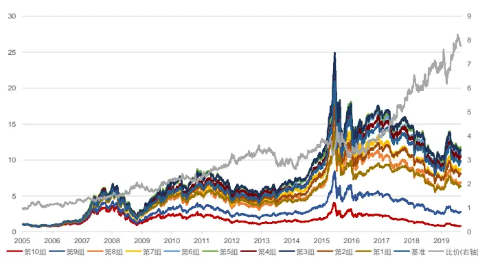
资料来源：天软科技，长江证券研究所

图 2：中证 800基础波动率因子回测净值
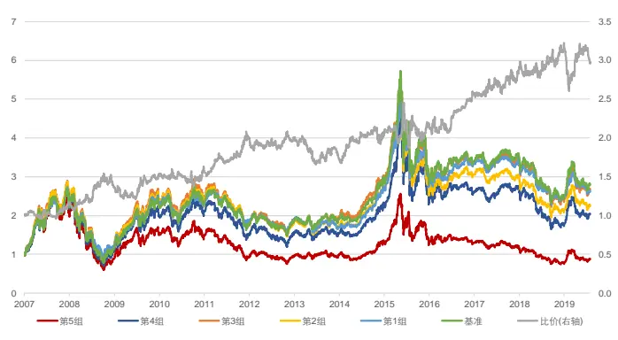
资料来源：天软科技，长江证券研究所

1 在《高频因子（四）：高阶矩高频因子》中，测试了不同 k线频率下的波动率因子，本文中统称为基本波动率类因子，这里以日线展示因子回测结果。

表 1：全 A股基础波动率因子分组年化收益

| 2005 2006 |  |  | 2007 | 2008 | 2009 2010 |  | 2011 | 2012 |  | 2013 | 2014 | 2015 | 2016 | 2017 | 2018 | 2019 | 总计 |
| --- | --- | --- | --- | --- | --- | --- | --- | --- | --- | --- | --- | --- | --- | --- | --- | --- | --- |
| 第10组 | -25.49% | 62.19% | 178.48% | -65.61% | 103.88% | -2.07% | -42.83% | -11.4 | 4% | 25.44% | 17.46% | 76.89% | -25.49% | -36.43% | -42.39% | -3.03% | -1.51% |
| 第9组 | -19.94% | 76.01% | 177.86% | -63.40% | 129.84% | 7.40% | -38.69% | -0.33 | % | 16.50% | 39.71% | 79.56% | -17.44% | -24.63% | -35.69% | 9.01% | 7.43% |
| 第8组 | -13.22% | 93.60%2 | 27.68% | -63.53% | 138.46% | 11.21% | -33.65% | 1.49 | % | 26.43% | 36.76% | 95.90% | -13.00% | -16.81% | -32.58% | 14.55% | 14.50% |
| 第7组 | -13.92% | 98.92% | 210.55% | -60.62% | 153.03% | 14.57% | -35.56% | 6.79 | % | 30.50% | 38.65% | 82.04% | -10.34%- | 14.83% | -29.64% | 16.77% | 16.46% |
| 第6组 | -12.22% | 79.48% | 231.55% | -57.31% | 163.16% | 15.11% | -30.22% | 2.98 | % | 27.75% | 49.22% | 89.01% | -9.65% | -16.20% | -29.69% | 15.81% | 18.31% |
| 第5组 | -13.41% | 96.60% | 258.97% | -56.13% | 159.52% | 14.67% | -30.78% | 0.48 | % | 22.27% | 48.38% | 77.40% | -8.75% | -12.55% | -30.48% | 17.45% | 18.94% |
| 第4组 | -10.51% | 87.46% | 254.05% | -58.03% | 141.50% | 13.79% | -26.25% | 3.13 | % | 15.79% | 51.03% | 77.33% | -6.88% | -13.82% | -30.32% | 15.03% | 18.00% |
| 第3组 | -15.04% | 88.84% | 272.07% | -55.30% | 154.95% | 12.99% | -26.80% | 0.49 | % | 23.80% | 49.61% | 67.10% | -5.88% | -11.92% | -30.94% | 12.52% | 18.68% |
| 第2组 | -14.54% | 88.94% | 221.62% | -53.61% | 134.13% | 8.24% | -27.67% | 0.52 | % | 12.98% | 54.78% | 58.90% | -5.88% | -9.93% | -30.71% | 11.29% | 15.90% |
| 第1组 | -14.54% | 82.09% | 217.64% | -52.58% | 116.04% | 1.25% | -19.95% | -3.62 | % | 10.34% | 49.30% | 50.18% | -7.62% | -6.59% | -30.52% | 7.69% | 13.92% |

资料来源：天软科技，长江证券研究所

表 2：中证 800基础波动率因子分组年化收益

| 2007 2008 2009 2010 2011 2012 |  |  |  |  |  |  |  | 2013 2014 2015 2016 2017 2018 2019 总计 |  |  |  |  |  |  |  |  |
| --- | --- | --- | --- | --- | --- | --- | --- | --- | --- | --- | --- | --- | --- | --- | --- | --- |
| 第5组 | 127.15% | -67.47% | 119.48% | -0 | .71% | -43.22% | 0.22% |  | 4.63% | 37.05% | 34.15% | -24.81% | -10.18% | -36.35% | 15.85% | -1.07% |
| 第4组 1 | 43.42% | -63.14% | 136.63% | 6. | 98% | -34.92% | -1.06 | % | 7.99% | 39.18% | 46.07% | -17.02% | 1.00% | -36.20% | 18.18% | 6.00% |
| 第3组 | 160.45% | -60.59% | 149.76% | 2 | 248% | -32.48% | 1.22% |  | 9.58% | 42.99% | 36.39% | -12.26% | 0.35% | -31.36% | 14.42% | 8.36% |
| 第2组 | 159.78% | -60.08% | 138.06% | 2 | 218% | -28.00% | -4.85% |  | 3.85% | 41.33% | 34.47% | -10.15% | -3.71% | -29.76% | 8.60% | 6.90% |
| 第1组 | 145.63% | -54.13% | 114.40% | -3 | .05% | -21.75% | -1.42 | % | -1.07% | 41.22% | 45.25% | -9.57% | -1.32% | -26.62% | 9.12% | 8.25% |

资料来源：天软科技，长江证券研究所

表 3：基础波动率因子风险指标

|  | 年化收益(%) | 夏普比 | 超额收益(%) | 信息比 | 多空收益(%) | 多空夏普比 |
| --- | --- | --- | --- | --- | --- | --- |
| 全A股 | 13.92 | 0.64 | -3.00 | -0.22 | 15.66 | 0.91 |
| 中证800 | 8.25 | 0.44 | -0.52 | -0.02 | 9.42 | 0.66 |

资料来源：天软科技，长江证券研究所

## 特异波动率因子

基础波动率因子的选股区分能力有限，原因在于构建因子时仅刻画了个股自身价格的异常变动，并非刻画个股价格相对于市场的异常变动。故目前市场上对低波效应的研究也多转向特异波动率，即以 fama 三因子模型为基础，对过去 21 天个股收益率做市场收益率、规模因子收益率和价值因子收益率的线性回归，取残差计算标准差作为特异波动率因子，首先给出因子在全市场和中证 800 范围内分组回测的表现。图 3 和图 4 给出了特异波动率因子分组回测的净值曲线，表 4 和表5 给出了特异波动率因子每组分年及整个时间段的年化收益，表 6给出了特异波动率因子选股第 1 组的风险指标，可以得到以下结论：

从净值曲线上看，特异波动率因子在多头和空头组均有一定的区分能力，空头组更 为显著，相比基础波动率因子多空比价曲线稳定性有明显改善。

从分年分组情况上看，全 A 股和中证 800 范围内选股收益率的最终结果基本以因子的分组结果呈现线性排列，但在头部组存在“U”型情况，即在全 A 股中第 2、3 组表现更好，在中证 800 中第 2 组表现更好。分年上看，仍存在较多时间段因子的排序线性较差，如 2010、2012和 2013 年。

从最终风险指标上看，特异波动率因子在全 A 股和中证 800 内均可以获得相对稳定的超额和多空收益。

图 3：全 A股特异波动率因子回测净值
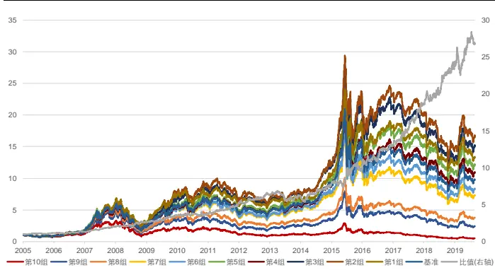
资料来源：天软科技，长江证券研究所

图 4：中证 800特异波动率因子回测净值
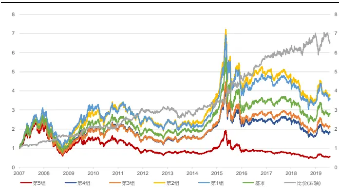
资料来源：天软科技，长江证券研究所

表 4：全 A股特异波动率因子分组年化收益

| 2005 |  | 2006 | 2007 | 2008 | 2009 | 2010 | 2011 | 2012 |  | 2013 | 2014 | 2015 | 2016 | 2017 | 2018 | 2019 | 总计 |
| --- | --- | --- | --- | --- | --- | --- | --- | --- | --- | --- | --- | --- | --- | --- | --- | --- | --- |
| 第10组 | -25.29% | 60.93% | 156.87% | -64.78% | 93.63% | 5.09% | -43.30% | -15.76% |  | 17.40% | 19.41% | 40.76% | -26.68% | -36.01% | -43.32% | -1.64% | 4.88% |
| 第9组 | -20.12% | 80.58% | 200.19% | -62.73% | 114.47% | 2.27% | -41.54% | -2.65% |  | 24.69% | 36.59% | 61.82% | -18.34% | -20.55% | -36.32% | 4.05% | 6.34% |
| 第8组 | -13.52% | 84.68% | 199.77% | -63.25% | 126.89% | 7.06% | -35.93% | -1.53% |  | 23.35% | 30.58% | 60.69% | -15.51% | -16.89% | -33.96% | 15.91% | 9.79% |
| 第7组 | -10.80% | 88.43% | 230.67% | -60.73% | 137.80% | 11.22% | -31.78% | 2.39% |  | 24.02% | 43.72% | 76.83% | -13.79% | -15.24% | -32.26% | 15.11% | 15.02% |
| 第6组 | -15.11% | 108.62%2 | 10.31% | -61.33% | 141.79% | 17.80% | -31.83% | 0.25% |  | 26.32% | 47.86% | 81.24% | -9.60% | -14.79% | -32.76% | 13.72% | 16.08% |
| 第5组 | -8.63% | 91.75% | 233.95% | -58.84% | 142.74% | 17.28% | -28.47% | 5.58 | % | 24.24% | 49.82% | 96.52% | -9.55% | -11.84% | -29.73% | 12.95% | 19.19% |
| 第4组 | -10.96% | 83.47% | 218.38% | -56.68% | 145.53% | 17.33% | -28.55% | 2.96 | % | 21.19% | 50.60% | 86.10% | -7.43% | -13.46% | -28.69% | 16.51% | 18.31% |
| 第3组 | -17.32% | 84.68% | 269.77% | -54.40% | 162.78% | 21.02% | -26.81% | 5.46 | % | 21.52% | 52.79% | 88.94% | -4.46% | -13.42% | -29.89% | 16.30% | 21.07% |
| 第2组 | -14.33% | 87.90% | 250.76% | -50.44% | 179.96% | 11.78% | -23.01% | 0.51 | % | 16.33% | 54.08% | 92.60% | -1.30% | -13.17% | -28.43% | 14.88% | 21.91% |
| 第1组 | -14.09% | 83.03% | 288.35% | -52.14% | 154.55% | 1.22% | -20.37% | 4.49 | % | 12.59% | 50.93% | 78.21% | -2.51% | -8.71% | -26.66% | 9.62% | 20.04% |

资料来源：天软科技，长江证券研究所

表 5：中证 800特异波动率因子分组年化收益

| 2007 |  | 2008 2009 2010 2011 2012 2013 |  |  |  |  |  |  |  |  | 2014 | 2015 |  | 2016 2017 2018 |  |  | 2019 总计 |  |  |
| --- | --- | --- | --- | --- | --- | --- | --- | --- | --- | --- | --- | --- | --- | --- | --- | --- | --- | --- | --- |
| 第5组 | 111.91% | -64.37% | 99.10% | -5. | 31% | -44 | 49% | -6.10% | 3.9 | 0% | 32.39% | 10. | 59% | -27.69% | -9.81% | 35.18% | 14.91 | % | -4.83% |
| 第4组 | 148.28% | -64.93% | 131.00% | 6.0 | 2% | -33 | 44% | -1.29% | 10. | 80% | 38.60% | 35. | 21% | -17.29% | 4.91% | 36.85% | 15.18 | % | 5.13% |
| 第3组 | 134.60% | -64.20% | 134.63% | 5.29% |  | -32 | 37% | 2.48% | 8.05% |  | 40.39% | 46. | 57% | -14.01% | 1.14% | -34.60% | 16.60 | % | 6.38% |
| 第2组 | 168.57% | -56.74% | 144.60% | 9.53% |  | -28 | 25% | 1.14% | 3.65% |  | 48.42% | 52. | 69% | -7.15% | -4.67% | -27.43% | 10.59 | % | 11.54% |
| 第1组 | 176.65% | -54.82% | 151.82% | -6.74% |  | -21 | 35% | -1.65% | -1.5 | 0% | 43.35% | 55. | 32% | -6.86% | -4.80% | -25.87% | 9.04% |  | 11.04% |

资料来源：天软科技，长江证券研究所

表 6：特异波动率因子风险指标

|  | 年化收益(%) | 夏普比 | 超额收益(%) | 信息比 | 多空收益(%) | 多空夏普比 |
| --- | --- | --- | --- | --- | --- | --- |
| 全A股 | 20.05 | 0.78 | 2.22 | 0.32 | 26.21 | 1.71 |
| 中证800 | 11.04 | 0.51 | 2.04 | 0.31 | 16.67 | 1.26 |

资料来源：天软科技，长江证券研究所

## 基础波动率与特异波动率的关系

波动率从绝对量上刻画个股价格变动的异常，构建方式简单但较为粗糙；特异波动率从相对量上刻画个股价格变动的异常，也更符合低波效应的逻辑，故本文也将基于特异波动率的构建方式，改进波动率类因子。基础波动率和特异波动率的相关性高，即绝对量上价格变动和相对量上价格变动存在较为密切的联系，为了窥探两者的联系，并进一步改善低波效应的表现，寻找更精确的因子构建方式，本节从特异率入手，探究波动与异常。

在《高频因子（五）：高频因子和交易行为》中，我们以特异率因子作为简单衡量个股交易行为异常的描述，其构建方式为对过去 21 天个股收益率做市场收益率、规模收益率和价值收益率的线性回归，取回归的拟合优度，以 1-拟合优度作为特异率因子，特异率因子值越大，个股存在更多的交易异常行为。首先给出因子在全市场和中证 800 范围内分组回测的表现。图 5 和图6给出了特异率因子分组回测的净值曲线，表 7 和表8 给出了特异波率因子每组分年及整个时间段的年化收益，表 9 给出了特异率因子选股第 1 组的风险指标，可以得到以下结论：

从净值曲线上看，特异波动率因子在多头和空头组均有一定的区分能力，多空比价净值曲线在全 A 股范围内较为稳定，在中证 800 范围内除 2017 年经历了较大回撤外，其余时间段较为稳定。

从分年分组情况上看，全 A 股和中证 800 范围内选股收益率最终结果严格按照因子的分组结果呈现线性排列，且除少数年份如 2010、2017年排序线性不佳外，大部分时间段排序线性较好。

从最终风险指标上看，特异波动率因子在全 A 股和中证 800 内均可以获得相对稳定的超额和多空收益。

图 5：全 A股特异率因子回测净值
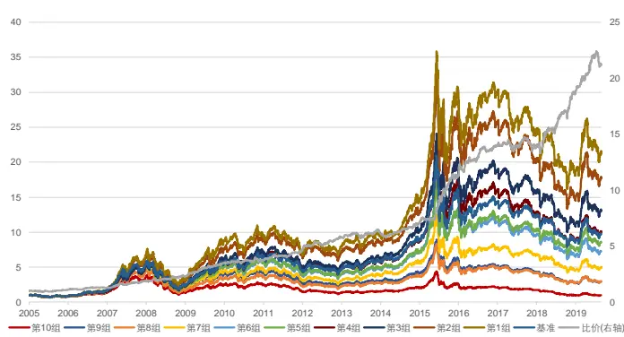
资料来源：天软科技，长江证券研究所
请阅读最后评级说明和重要声明

图 6：中证 800特异率因子回测净值
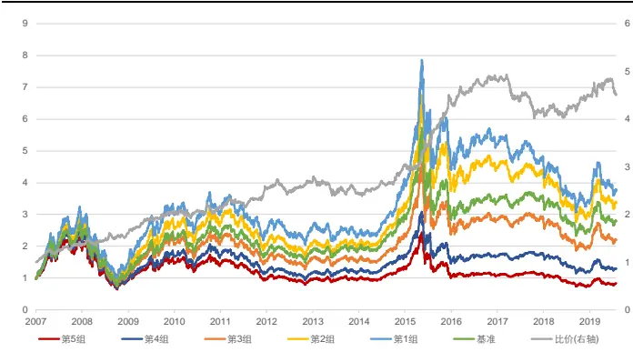
资料来源：天软科技，长江证券研究所

表 7：全 A股特异率因子分组年化收益

| 2005 |  | 2006 2007 |  | 2008 | 2009 | 2010 | 2011 2012 |  |  | 2013 | 2014 | 2015 | 2016 | 2017 | 2018 | 2019 | 总计 |
| --- | --- | --- | --- | --- | --- | --- | --- | --- | --- | --- | --- | --- | --- | --- | --- | --- | --- |
| 第10组 | -18.11% | 63.62% | 164.70%- | 62.16% | 86.77% | 1.79% | -39.44% | -10. | 53% | 11.94% | 31.58% | 30.93% | -20.34% | -17.94% | -44.11% | 2.49% | -0.01% |
| 第9组 | -16.01% | 96.62% | 205.52% | -61.01% | 106.44% | 5.71% | -35.80% | -7.5 | 1% | 19.48% | 36.95% | 48.89% | -17.77% | -15.46% | -36.59% | 5.95% | 7.82% |
| 第8组 | -19.77% | 82.30% | 199.71% | -63.17% | 114.08% | 6.37% | -36.19% | -3.29% |  | 21.56% | 34.41% | 53.33% | -13.07% | -15.79% | -33.62% | 6.83% | 7.95% |
| 第7组 | -14.40% | 80.68% | 219.92% | -59.55% | 122.40% | 4.81% | -31.73% | -2.64% |  | 26.68% | 44.14% | 61.06% | -16.04% | -12.32% | -32.77% | 8.39% | 11.88% |
| 第6组 | -14.78% | 90.05% | 228.52% | -60.09% | 142.74% | 11.31% | -31.89% | 1.83% |  | 21.91% | 46.48% | 84.36% | -12.64% | -16.65%- | 31.09% | 10.02% | 15.01% |
| 第5组 | -14.56% | 96.37% | 208.11% | -60.04% | 150.33% | 11.01% | -29.57% | 1.1 | 6% | 22.07% | 42.37% | 84.30% | -7.70% | -15.00% | -27.96% | 14.88% | 16.34% |
| 第4组 | -12.56% | 83.98% | 223.27% | -57.85% | 160.05% | 17.99% | -30.61% | 1.3 | 7% | 24.38% | 47.18% | 98.47% | -8.13% | -19.43% | -31.38% | 13.74% | 17.62% |
| 第3组 | -15.66% | 76.84% | 238.13% | -54.23% | 171.90% | 13.58% | -28.83% | 3.98% |  | 21.97% | 57.14% | 99.23% | -7.25% | -15.74% | -30.77% | 18.98% | 19.86% |
| 第2组 | -14.50% | 92.26% | 279.86% | -54.19% | 166.02% | 17.16% | -24.60% | 5.9 | 6% | 21.71% | 45.95% | 112.67% | -5.67% | -20.74% | -27.34% | 20.44% | 22.48% |
| 第1组 | -10.30% | 92.08% | 286.49% | -53.97% | 187.05% | 7.50% | -24.27% | 11. | 59% | 21.27% | 48.80% | 109.70% | -1.90% | -18.29% | -25.16% | 16.42% | 24.06% |

资料来源：天软科技，长江证券研究所

表 8：中证 800特异率因子分组年化收益
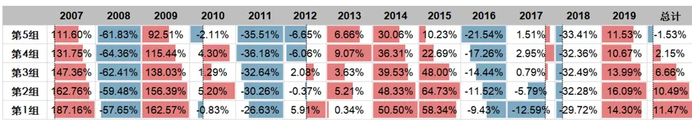
资料来源：天软科技，长江证券研究所

表 9：特异率因子风险指标

|  | 年化收益(%) | 夏普比 | 超额收益(%) | 信息比 | 多空收益(%) | 多空夏普比 |
| --- | --- | --- | --- | --- | --- | --- |
| 全A股 | 24.07 | 0.83 | 5.65 | 0.91 | 24.09 | 2.12 |
| 中证800 | 11.47 | 0.51 | 2.44 | 0.45 | 13.21 | 1.30 |

资料来源：天软科技，长江证券研究所

特异波动率因子和特异率因子的构建方式均用到了 fama 三因子模型的回归方程，而特异率因子也是搭建基础波动率因子和特异波动率因子的桥梁。令 fama 回归的表现形式如下：

$$
r_{t}=\alpha_{t}+\beta_{mkt}MKT_{t}+\beta_{smb}SMB_{t}+\beta_{hml}HML_{t}+\varepsilon_{t}
$$

则：

$$
\varXi\equiv\sqrt{\mathop{\mathrm{II}}\mathrm{II}\mathrm{I}\mathrm{J}}\bar{\Chi}\bar{\jmath}\bar{\mathcal{Z}}\bar{\mathrm{I}}=\sqrt{\frac{1}{n-1}\sum(r_{t})^{2}}=\sqrt{\frac{1}{n-1}\sum(r_{t}-\bar{r}_{t})^{2}}
$$

$$
\frac{\mu\pm}{\sqrt{\pi}+\lambda}\sqrt{\mathcal{X}}\overline{{\mathcal{Z}}}\overline{{\mathcal{Y}}}=\sqrt{\frac{1}{n-1}\sum(\varepsilon_{t})^{2}}=\sqrt{\frac{1}{n-1}\sum(r_{t}-\widehat{r_{t}})^{2}}
$$

$$
\mathbb{\frac{\mu\pm}{1+2}}\mathbb{\frac{\mu\mp}{1+2}}=1-\frac{\sum(\widehat{r_{t}}-\widehat{r_{t}})^{2}}{\sum(r_{t}-\widehat{r_{t}})^{2}}=\frac{\sum(r_{t}-\widehat{r_{t}})^{2}}{\sum(r_{t}-\widehat{r_{t}})^{2}}=\frac{\mathbb{\frac{\mu+}{1+2}}\mathbb{\sum}\mathbb{\frac{\mu\leq}{1+2}}\mathbb{\widehat{x}}\mathbb{\frac{\mu\leq}{2}}{\sum(r_{t}-\widehat{r_{t}})^{2}}}{\mathbb{\frac{\mu\pm}{\pm1}}\mathbb{\frac{\mu\leq}{1+2}}\mathbb{\frac{\mu\leq}{2}}{\mathbb{\frac{\mu\leq}{1+2}}}^{2}}
$$

故从数学形式上看，波动率、特异波动率和特异率之间存在以下关系：

$$
A\pm\equiv\sum\limits_{i=1}\sum\limits_{j=1}\sp{i}\sum\limits_{\overrightarrow{i}}\overrightarrow{I_{j}}\max=\sqrt{4\pm\sum\limits_{i=1}\sp{j}\sum\limits_{p=1}\sp{i}}\times\pm\infty\exp\{\int\limits_{\overrightarrow{i}\cdot\overrightarrow{j}}\sum\limits_{j=1}\sp{i}\sum\limits_{\overrightarrow{i}}\int\frac{\ dz}{d\cdot p}\}\stackrel{\infty}{=}
$$

即特异波动率综合了特异率（个股特异）和波动率（个股波动）信息，使得因子在表现上兼具两个因子的共同特点：不论在全 A 股范围内还是中证 800 范围内，特异波动率继承了波动率对空头组的区分，得到了比特异率因子更高的多空收益率；同时继承了特异率对多头组的区分，得到了比波动率因子更高的超额收益率。需要指出的是这种综合为非线性组合，故在线性多因子选股模型中其余两个因子可能仍存在增量信息。

事实上，特异波动率比基础波动率在统计意义下包含更多的信息增量，在表 10 中列举了，分别对以波动率因子建立的风格因子空间及以特异波动率因子建立的风格因子空间进行 Fama-Macbeth 回归2的统计结果，从统计结果上看：

1. 特异波动率因子的 t 值显著，而波动率因子 t 值并未通过检验，特异波动率因子可以更好融入风格因子体系以解释个股收益率。

2. 动量因子在两个风格因子空间回归 t 值均不显著，可以考虑将其从中剔除。

表 10：风格因子空间 Fama-Macbeth 回归结果

| 因子年化收益 因子年化标准差 因子t值 |  |  |  | 平均绝对t值 | 因子年化收益 因子年化标准差 |  | 因子t值 | 平均绝对t值 3.75 |
| --- | --- | --- | --- | --- | --- | --- | --- | --- |
| 反转 | -4.05 | 4.68 | -3.31 |  | 3.77 反转 | -3.64 4.76 |  |  |
| 流动性 | -10.26 | 4.54 | -8.66 | 4.52 | 流动性 -10.31 | 4.49 | -2.93 -8.79 | 4.49 |
| 市值 | -8.36 | 6.51 | -4.91 | 5.07 | 市值 -8.35 | 6.57 | -4.87 | 5.06 |
| 波动率 | -1.05 | 3.55 | -1.13 | 2.27 | 特异波动率 -2.51 | 3.02 | -3.18 | 2.10 |
| 成长 | 1.65 | 2.06 | 3.07 | 1.54 | 成长 1.58 | 2.06 | 2.93 | 1.55 |
| 盈利 | 1.71 | 3.35 | 1.96 | 2.80 | 盈利 1.65 | 3.38 | 1.87 | 2.80 |
| 估值 | -0.91 | 1.77 | -1.96 | 1.62 | 估值 -0.84 | 1.83 | -1.76 | 1.64 |
| 动量 | -0.13 | 4.03 | -0.12 | 3.14 | 动量 0.17 | 4.07 | 0.16 | 3.21 |
| Beta | 4.04 | 3.25 | 4.75 | 2.79 | Beta 3.91 | 3.25 | 4.60 | 2.79 |

资料来源：天软科技，长江证券研究所

低波效应的核心逻辑为股价变动相对于市场异常现象的均值回归，刻画相对价格变动的特异波动率更符合其逻辑，表现效果也更好。

数学形式上看，特异波动率由波动率和特异率两个部分信息共同组成。

故下文中针对波动率类因子的改进将基于特异波动率因子。

## 波动率改进

本节主要从特异波动率的核心逻辑出发，以数学形式为突破口，改进因子表现：

从逻辑上看，个股的波动和个股特异密切相关，高波动的个股往往也包含更多的异常表现，而特异波动率正是通过以波动率为基础，叠加特异率信息，增强了个股股价变动异常的表现，但改善效果并不显著，其超额表现和多空表现仍介于波动率和特异率之间。如果单独将两个部分拆分细化，更精确的表述个股波动和个股特异，就能提高波动率类因子的选股能力。

从数学形式上看，特异波动率以非线性的方式综合个股特异和个股波动，保留了波动率因子空头组区分能力，保留了特异率因子多头组的区分能力，但由于波动率因子在多头组几乎无选股区分能力，使得特异波动率分组表现并非线性排序，如果通过函数变换的方式对这一现象给出改善，就能提升波动率因子分组的线性性。

## 新量价特异

特异率衡量在剥离了可以对个股收益解释的因素后个股的异动情况，目前多以 fama 三因子模型为基础（市场 beta、规模和估值），以线性回归剔除线性影响的方式，以拟合优度为异常程度的评价标准。这种构建特异率的方式可以较好的体现个股价格变动相对市场主要矛盾的异常，但针对波动率类因子描述的价格变动，则需尽可能的考虑更多可以解释个股收益的因素。从表 11 中可知波动率类因子和流动性因子、反转因子线性相关性较高，故本文在 fama 三因子的基础上加入流动性和反转因子，构建新的特异信息，则回归方程如下：

$$
r_{t}=\alpha_{t}+\beta_{mkt}MKT_{t}+\beta_{smb}SMB_{t}+\beta_{hml}HML_{t}+\beta_{ret}RET_{t}+\beta_{liq}LIQ_{t}+\varepsilon_{t}
$$

并取上述方程回归结果的残差标准差及拟合优度，构建特异波动率及特异率因子，在下文中统称为新特异波动率和新特异率，本文中将特异率因子和新特异率因子统称为特异率类因子，将特异波动率因子和新特异波动率因子统称为特异波动率类因子。

表 11：波动率类因子与风格因子相关性

|  | Beta | 市值 | 估值 | 盈利 | 流动性 | 反转 | 成长 |
| --- | --- | --- | --- | --- | --- | --- | --- |
| 特异波动率 | 0.02 | -0.11 | 0.11 | -0.07 | 0.57 | 0.35 | 0.00 |
| 波动率(5分钟线) | 0.16 | -0.23 | 0.14 | -0.20 | 0.59 | 0.29 | -0.05 |
| 波动率(30分钟线) | 0.20 | -0.16 | 0.13 | -0.14 | 0.62 | 0.30 | -0.02 |
| 波动率(日线) | 0.40 | -0.16 | 0.12 | -0.11 | 0.61 | 0.24 | -0.01 |

资料来源：天软科技，长江证券研究所

首先给出新特异波动率因子在全市场和中证 800 范围内分组回测的表现。图 7 和图 8 给出了新特异波动率因子分组回测的净值曲线，表 12 给出了新特异波动率因子选股第 1组的分年风险指标，可以得到以下结论：

从净值曲线上看，新特异波动率因子在多头和空头组均有一定的区分能力，相比特异波动率因子中间组和多头组的分组区分度有一定改善，在中证 800 范围内因子分组的净值曲线已按照因子的分组结果呈线性排列。

从分年风险指标上看，全 A 股和中证 800 范围内因子在多头端的表现仍不稳定，超额收益在较多年份产生回撤，而空头端表现较好，多空收益在全 A 股范围内仅在 2013 年产生回撤，在中证 800 范围内仅 2013 年和 2019年产生回撤。

相比特异波动率因子，新特异波动率不论在全 A 股范围还是中证 800 范围，表现均略有提升，体现在超额收益和多空收益两方面的综合提高。

图 7：全 A股新特异波动率因子回测净值
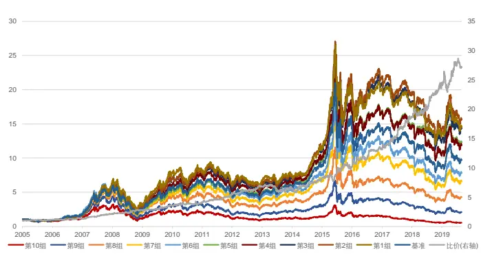
资料来源：天软科技，长江证券研究所

图 8：中证 800新特异波动率因子回测净值
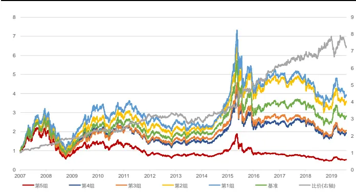
资料来源：天软科技，长江证券研究所

表 12：新特异波动率因子风险指标

| 全市场 |  |  |  | 中证800 |  |  |  |
| --- | --- | --- | --- | --- | --- | --- | --- |
|  | 超额收益(%) | 信息比 | 多空收益(%) | 多空夏普比 | 超额收益(%) | 信息比 多空收益(%) | 多空夏普比 |
| 2005 | -3.33 | -0.49 | 14.01 | 1.35 |  | 1 |  |
| 2006 | -3.85 | -0.55 | 16.02 | 1.45 | - - | - | 1 |
| 2007 | 22.84 | 2.55 | 56.53 | 3.49 | 17.61 2.52 | 42.28 | 3.25 |
| 2008 | 16.39 | 2.24 | 34.61 | 2.42 | 12.28 2.04 | 30.23 | 2.56 |
| 2009 | 4.84 | 0.89 | 28.83 | 2.55 | 5.74 | 1.08 23.56 | 2.16 |
| 2010 | -9.88 | -1.02 | 11.02 | 0.85 | -10.00 | -1.19 0.06 | 0.13 |
| 2011 | 10.95 | 1.68 | 37.16 | 2.64 | 11.83 | 2.10 37.64 | 3.18 |
| 2012 | 2.13 | 0.34 | 25.17 | 2.08 | -4.07 | -0.96 3.52 | 0.35 |
| 2013 | -9.58 | -1.24 | -4.53 | -0.18 | -9.23 | -1.46 -6.09 | -0.44 |
| 2014 | 0.08 | 0.17 | 24.15 | 1.77 | -1.32 -0.11 | 7.03 | 0.72 |
| 2015 | 0.73 | 0.06 | 24.57 | 1.23 | 11.25 0.96 | 45.26 | 2.22 |
| 2016 | 8.36 | 0.96 | 31.43 | 2.09 | 7.60 | 1.17 27.65 | 2.58 |
| 2017 | 3.15 | 0.73 | 40.46 | 3.19 | -5.18 -1.01 | 7.63 | 0.81 |
| 2018 | 6.48 | 1.20 | 30.68 | 2.30 | 8.33 | 1.50 17.30 | 1.53 |
| 2019(至今) | -3.08 | -0.61 | 11.77 | 1.52 | -6.27 | -1.48 -5.67 | -0.61 |
| 总计 | 2.89 | 0.42 | 26.32 | 1.80 | 2.76 | 0.42 17.71 | 1.39 |

资料来源：天软科技，长江证券研究所

从因子表现的增量角度看，新特异波动率仍由新特异率和基础波动率两部分构成，在回归过程中波动率部分并未改变，表 13 中给出了不同构建方式特异类因子和特异波动率类因子的回测风险指标，新特异率因子相比特异率因子在中证 800 范围内有较大改进，超额收益和多空收益提升显著，而在全 A 股范围内差别不大。故新特异波动率的增强不仅在于个股特异上的增强，也与个股特异和个股波动间的共振形式相关。

表 13：特异率因子风险指标

| 全市场 | 超额收益 | 超额最大回撤 | 信息比 | 多空收益 | 多空最大回撤多空夏普比 |  |
| --- | --- | --- | --- | --- | --- | --- |
| 特异波动率 | 2.22% | 21.34% | 0.32 | 26.21% | 21.26% | 1.71 |
| 新特异波动率 | 2.89% | 19.42% | 0.42 | 26.32% | 19.23% | 1.80 |
| 特异率 | 5.65% | 12.12% | 0.91 | 24.09% | 13.01% | 2.12 |
| 新特异率 | 5.30% | 13.30% | 0.89 | 22.66% | 11.63% | 2.11 |
| 中证800 | 超额收益 | 超额最大回撤 | 信息比 | 多空收益 | 多空最大回撤 | 多空夏普比 |
| 特异波动率 | 2.04% | 20.06% | 0.31 | 16.67% | 19.07% | 1.26 |
| 新特异波动率 | 2.76% | 20.18% | 0.42 | 17.71% | 19.46% | 1.39 |
| 特异率 | 2.44% | 18.84% | 0.45 | 13.21% | 18.58% | 1.3 |
| 新特异率 | 3.40% | 14.69% | 0.62 | 15.53% | 13.61% | 1.55 |

资料来源：天软科技，长江证券研究所

为窥探个股特异和个股波动间的共振，表 14 中给出了部分波动率类因子和特异率类因子的相关性，可以看到基础波动率类因子、特异波动率类因子和特异率类因子均呈一定程度的正相关，即个股绝对量上的价格变动（个股波动）、个股特异和个股相对量上的价格变动彼此密切相关：

绝对量上的价格变动和相对量上的价格变动的正向相关，使得在表现上基础波动率类因子和特异波动率类因子相近，但低波效应的核心仍在价格的相对变动，故特异波动率类因子表现更好。

个股波动和个股特异的正向关系，在特异波动率类因子的构建过程中，杠杆性地加强了个股股价变动的异常信息，从拆分关系上看，这也是特异波动率表现应比3两个因子都更好的原因。

表 14：波动率类因子、特异率类因子和特异波动率类因子相关性

|  | 特异波动率 | 新特异波动率 | 特异率 | 新特异率 波动率(5 分钟线) 波动率(30 分钟线)波动率(日线) |  |  |  |
| --- | --- | --- | --- | --- | --- | --- | --- |
| 特异波动率 | 1.00 | 0.97 | 0.66 | 0.60 | 0.80 | 0.84 | 0.85 |
| 新特异波动率 | 0.97 | 1.00 | 0.65 | 0.68 | 0.78 | 0.82 | 0.82 |
| 特异率 | 0.66 | 0.65 | 1.00 | 0.92 | 0.38 | 0.38 | 0.24 |
| 新特异率 | 0.60 | 0.68 | 0.92 | 1.00 | 0.35 | 0.35 | 0.21 |
| 波动率(5分钟线) | 0.80 | 0.78 | 0.38 | 0.35 | 1.00 | 0.94 | 0.82 |
| 波动率(30分钟线) | 0.84 | 0.82 | 0.38 | 0.35 | 0.94 | 1.00 | 0.88 |
| 波动率(日线) | 0.85 | 0.82 | 0.24 | 0.21 | 0.82 | 0.88 | 1.00 |

资料来源：天软科技，长江证券研究所

## 高频波动率因子

个股波动的细化，仍从最简单的高频数据出发。高频信息在于以更加精细的量价数据刻画交易行为，精确描述个股波动。故本文分别以过去 21天 5分钟线、30分钟线和日线个股收益率标准差作为波动率因子部分，与新特异率因子开方相乘得到高频波动率类因子，首先以 30 分钟线为例给出因子在全市场和中证 800 范围内分组回测的表现。图 9和图 10 给出了高频波动率因子分组回测的净值曲线，表 15 给出了高频波动率因子选股第 1 组的风险指标，可以得到以下结论：

从净值曲线上看，在全 A 股范围内高频波动率因子相比新特异波动率头部组的排序进一步提升。

从分年风险指标上看，相比新特异波动率因子，高频波动率因子并未提高因子表现的稳定性，超额收益和多空收益仍存在较多回撤的年份，但整体有所改善。

图 9：全 A股高频波动率因子回测净值
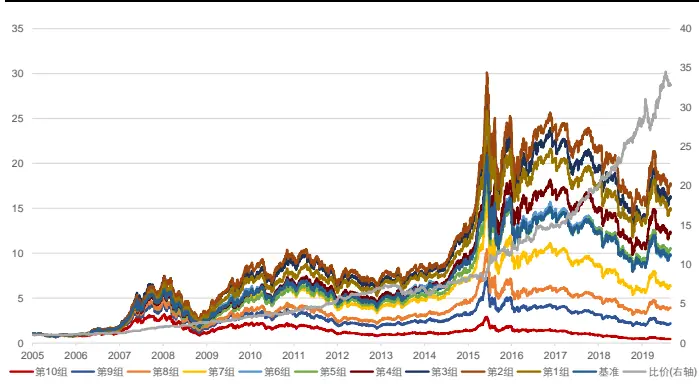
资料来源：天软科技，长江证券研究所

图 10：中证 800高频波动率因子回测净值
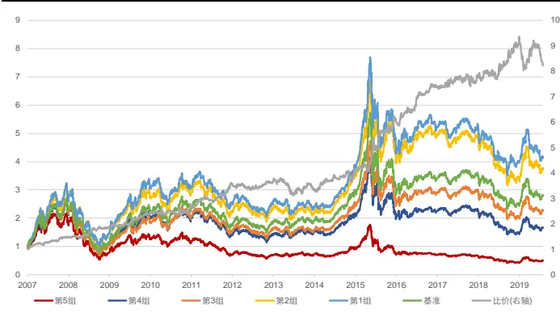
资料来源：天软科技，长江证券研究所

表 15：高频波动率因子风险指标

| 全市场 |  |  |  |  | 中证800 |  |  |  |
| --- | --- | --- | --- | --- | --- | --- | --- | --- |
|  | 超额收益(%) | 信息比 | 多空收益(%) | 多空夏普比 | 超额收益(%) |  | 信息比 多空收益(%) | 多空夏普比 |
| 2005 | -5.61 | -1.23 | 14.35 | 1.47 | - | - | - | - |
| 2006 | -5.23 | -0.84 | 21.18 | 1.84 | = | - | - | - |
| 2007 | 24.82 | 2.65 | 56.88 | 3.39 | 18.13 | 2.48 | 44.81 | 3.48 |
| 2008 | 9.65 | 1.38 | 34.68 | 2.32 | 7.55 | 1.30 | 27.86 | 2.31 |
| 2009 | 6.09 | 1.10 | 32.21 | 2.86 | 8.90 | 1.68 | 28.54 | 2.66 |
| 2010 | -6.77 | -0.67 | 12.73 | 0.93 | -8.22 | -0.99 | 2.97 | 0.31 |
| 2011 | 11.56 | 1.87 | 40.13 | 2.89 | 10.10 | 1.84 | 37.45 | 3.23 |
| 2012 | 2.34 | 0.44 | 28.31 | 2.53 | -1.76 | -0.51 | 7.70 | 0.83 |
| 2013 | -6.32 | -0.87 | -1.60 | -0.02 | -5.94 | -0.94 | -2.31 | -0.14 |
| 2014 | -0.53 | 0.08 | 20.69 | 1.48 | -2.75 | -0.38 | 3.07 | 0.39 |
| 2015 | 6.53 | 0.50 | 44.22 | 1.90 | 15.00 | 1.22 | 59.86 | 2.72 |
| 2016 | 8.34 | 1.03 | 32.14 | 2.25 | 8.15 | 1.40 | 27.71 | 2.85 |
| 2017 | -0.20 | 0.06 | 32.27 | 3.06 | -6.60 | -1.52 | 1.63 | 0.25 |
| 2018 | 9.86 | 2.14 | 39.45 | 3.29 | 9.36 | 1.79 | 19.96 | 1.86 |
| 2019(至今) | -2.00 | -0.37 | 15.23 | 1.81 | -7.37 | -1.83 | -9.20 | -1.14 |
| 总计 | 3.37 | 0.49 | 29.27 | 1.99 | 3.27 | 0.51 | 18.98 | 1.50 |

资料来源：天软科技，长江证券研究所

## 非线性波动

精确计算个股波动率对特异波动率因子的提升有限，根本原因在于其空头组区分个股能力显著，而多头组区分个股能力较差，整体上拖累了杠杆加强个股股价变动异常信息时的头部组表现。从数学形式上看，特异波动率综合个股特异和个股波动的方式是非线性的：

$$
A\pm\equiv\sum\limits_{i=1}\sum\limits_{j=1}\sp{i}\sum\limits_{\overrightarrow{i}}\overrightarrow{I_{j}}\max=\sqrt{4\pm\sum\limits_{i=1}\sp{j}\sum\limits_{p=1}\sp{i}}\times\pm\infty\exp\{\int\limits_{\overrightarrow{i}\cdot\overrightarrow{j}}\sum\limits_{j=1}\sp{i}\sum\limits_{\overrightarrow{i}}\int\frac{\ dz}{d\cdot p}\}\stackrel{\infty}{=}
$$

如果可以保留这种信息综合方式，同时在数学形式上给出一定改善，以保留波动率因子空头组信息，同时模糊头部组选股区分度，便可以改善特异波动率因子选股的线性。

如图 11 所示，特异波动率因子在基础波动率在进行截面归一化后，以线性关系均匀分布，作为乘数加强特异率体现的个股特异信息。高个股波动区域确实存在更多价格变动异常，而在低波动区域个股之间的价格变动差别不大，局部的扰动误差会干扰杠杆在尾端的加强。为了加强空头组区分，模糊多头组区分，首先对基础波动率做如截面归一化：

$$
norm_{i}=\frac{std_{i}-\operatorname*{min}(\{std_{i}\})}{\operatorname*{max}(\{std_{i}\})-\operatorname*{min}(\{std_{i}\})}
$$

对得到的归一化值进行非线性变换，得到基础波动率乘数部分：

$$
std_{i}^{non\_linear}=e^{norm_{i}}
$$

上述非线性变换以 0.54 为临界点，高于 0.54 的部分为高波动区域，函数斜率大于线性斜率，加强了区分度，低于 0.54 的部分为低波动区域，函数斜率小于线性斜率，减弱了区分度，做到了高波动和低波动的区别对待。

图 11：波动率非线性变换
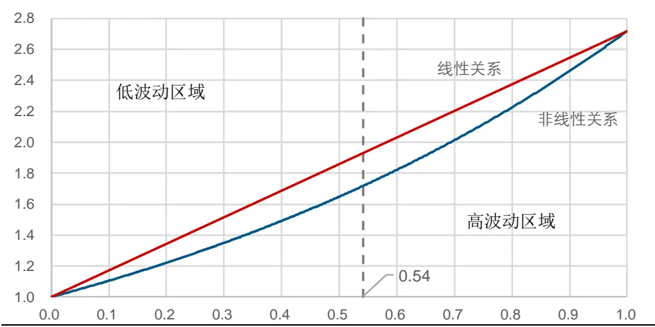
资料来源：长江证券研究所

故本文分别以过去 21天 5分钟线、30分钟线和日线个股收益率标准差出发，进行截面归一化，以对波动率非线性变换得到的部分作为波动率因子乘数部分，与特异率因子开方相乘得到非线性波动率类因子，首先以 30 分钟线为例给出因子在全市场和中证 800范围内分组回测的表现，图 11 和图 12 给出了非线性波动率因子分组回测的净值曲线，表 16 给出了非线性波动率因子选股第 1 组的风险指标，可以得到以下结论：

从净值曲线上看，非线性波动率因子的多空比价净值曲线得到了较为明显的改善，在全 A 股范围内 2019 年 2 月的回撤基本避免，在中证 800 范围内 2018 年以来的波动也有所降低。多头组区分能力改善显著，全 A 股和中证 800 范围内因子分组的净值曲线严格按照因子大小呈现线性排列。

从分年风险指标上看，非线性波动率因子显著提高了波动率类因子在全 A 股范围内表现的稳定性，多头端上超额收益仅在 2017 年有较明显的回撤，空头端上无多空收益回撤。

整体来看，非线性波动率因子在全 A 股范围和中证 800 范围内，对波动率类因子 多头端获得超额收益的能力和空头端获得多空收益的能力均有一定提升。

图 12：全 A股非线性波动率因子回测净值
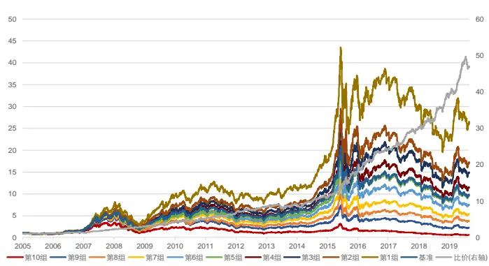
资料来源：天软科技，长江证券研究所

图 13：中证 800非线性波动率因子回测净值
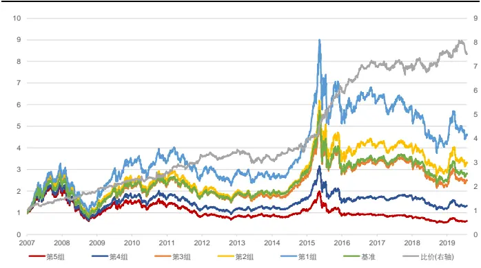
资料来源：天软科技，长江证券研究所

表 16：非线性波动率因子风险指标

| 全市场 |  |  |  |  | 中证800 |  |  |  |
| --- | --- | --- | --- | --- | --- | --- | --- | --- |
|  | 超额收益(%) | 信息比 | 多空收益(%) | 多空夏普比 | 超额收益(%) | 信息比 | 多空收益(%) | 多空夏普比 |
| 2005 | -0.41 | -0.11 | 10.02 | 1.27 |  | 1 |  |  |
| 2006 | 3.12 | 0.70 | 17.78 | 1.78 | - | - | - | - |
| 2007 | 28.09 | 2.94 | 69.55 | 3.84 | 18.49 | 2.54 | 41.33 | 3.11 |
| 2008 | 13.74 | 2.04 | 35.05 | 2.51 | 10.36 | 1.80 | 22.04 | 1.94 |
| 2009 | 14.10 | 2.64 | 43.13 | 3.95 | 9.86 | 2.07 | 28.93 | 3.09 |
| 2010 | -0.42 | 0.03 | 19.87 | 1.57 | -2.46 | -0.31 | 8.63 | 0.72 |
| 2011 | 7.80 | 1.61 | 31.94 | 2.96 | 6.69 | 1.47 | 26.80 | 2.88 |
| 2012 | 6.08 | 1.57 | 25.87 | 3.02 | 1.12 | 0.25 | 10.26 | 1.30 |
| 2013 | -0.16 | 0.00 | 7.84 | 0.70 | -5.52 | -0.93 | -3.99 | -0.35 |
| 2014 | 1.10 | 0.37 | 18.20 | 1.77 | -1.10 | -0.11 | 5.34 | 0.69 |
| 2015 | 16.91 | 1.79 | 67.89 | 2.79 | 23.21 | 2.53 | 72.19 | 3.76 |
| 2016 | 10.85 | 1.69 | 34.02 | 3.03 | 7.09 | 1.61 | 21.28 | 2.98 |
| 2017 | -4.66 | -1.30 | 23.90 | 3.27 | -11.71 | -2.95 | -2.52 | -0.30 |
| 2018 | 7.25 | 1.41 | 29.92 | 2.95 | 2.77 | 0.59 | 8.44 | 0.92 |
| 2019(至今) | 2.69 | 1.04 | 19.96 | 3.28 | -2.93 | -1.04 | -0.43 | -0.05 |
| 总计 | 7.19 | 1.18 | 31.25 | 2.46 | 4.17 | 0.74 | 18.05 | 1.64 |

资料来源：天软科技，长江证券研究所
请阅读最后评级说明和重要声明

特异率衡量在剥离了可以对个股收益解释的因素后个股的异动情况，本文在 fama三因子的基础上，考虑和波动率类因子相关性较高的流动性和反转因子，可以更纯粹的剥离价格变动相对市场的偏离情况，构建的新特异率和新特异波动率因子均有一定提升。

波动率因子表现出的选股能力主要来源于绝对量上的价格变动和相对量上的价格变动的正向相关。特异波动率表现出的选股能力是通过个股波动和个股特异的正向关系，杠杆性地加强了个股股价变动的异常信息。

- 个股波动部分可以以高频数据进行细化，提升波动率类因子表现。

特异波动率因个股波动的头部区分能力较弱导致选股线性较差，以非线性的方式改进个股波动部分乘数，可以保留其空头端的区分能力，同时淡化头部组的分组信息，改进特异波动率因子的表现。

## 波动率思考

## 剥离特异率及风格影响

在改进波动率的过程中，以拆分的方式分步细化，非线性波动率类因子和之前的三类因子（基础波动率类、特异率类和特异波动率类）均有较大联系，从表 17 中展现的相关性上看，高频波动率类4作为过渡因子，和基础波动率因子和非线性波动率类因子间的相关性均较高，而非线性波动率构建过程中由于对基础波动率类因子进行了非线性变换，线性相关性有所下降，但三类因子整体相关性较高。

表 17：波动率类因子相关性

|  | 波动率率(5 波动(30分 分钟线) | 钟线) | 波动率(日 线) | (5分钟线) | (30分钟线) | (日线) | 高频波动率 高频波动率 高频波动率 非线性波动 率(5分钟线) | 非线性波动率 非线性波动 (30分钟线) | 率(日线) |
| --- | --- | --- | --- | --- | --- | --- | --- | --- | --- |
| 基础波动率(5分钟线) | 1.00 | 0.94 | 0.83 | 0.86 | 0.83 | 0.80 | 0.61 | 0.60 | 0.60 |
| 基础波动率(30分钟线) | 0.94 | 1.00 | 0.89 | 0.82 | 0.87 | 0.84 | 0.59 | 0.63 | 0.62 |
| 基础波动率(日线) | 0.83 | 0.89 | 1.00 | 0.67 | 0.73 | 0.84 | 0.46 | 0.49 | 0.58 |
| 高频波动率(5分钟线) | 0.86 | 0.82 | 0.67 | 1.00 | 0.97 | 0.91 | 0.87 | 0.86 | 0.85 |
| 高频波动率(30分钟线) | 0.83 | 0.87 | 0.73 | 0.97 | 1.00 | 0.94 | 0.85 | 0.87 | 0.86 |
| 高频波动率(日线) | 0.80 | 0.84 | 0.84 | 0.91 | 0.94 | 1.00 | 0.79 | 0.81 | 0.87 |
| 非线性波动率(5分钟线) | 0.61 | 0.59 | 0.46 | 0.87 | 0.85 | 0.79 | 1.00 | 0.98 | 0.95 |
| 非线性波动率(30分钟线) | 0.60 | 0.63 | 0.49 | 0.86 | 0.87 | 0.81 | 0.98 | 1.00 | 0.96 |
| 非线性波动率(日线) | 0.60 | 0.62 | 0.58 | 0.85 | 0.86 | 0.87 | 0.95 | 0.96 | 1.00 |

资料来源：天软科技，长江证券研究所

进一步，表 18 展现了波动率类因子和风格因子的相关性上，改进后的高频波动率类因子和非线性波动率因子与特异率类因子的相关性显著提高，且以非线性更为明显，但改进后的因子也在一定程度上降低了流动性因子的线性影响。

表 18：波动率类因子与风格因子相关性

|  | 特异波动率 | 特异率 | Beta | 市值 | 估值 | 盈利 | 流动性 | 反转 | 波动率 |
| --- | --- | --- | --- | --- | --- | --- | --- | --- | --- |
| 基础波动率(5分钟线) | 0.78 | 0.36 | 0.14 | -0.22 | 0.02 | -0.08 | 0.56 | 0.35 | -0.02 |
| 基础波动率(30分钟线) | 0.82 | 0.36 | 0.18 | -0.16 | 0.01 | -0.06 | 0.58 | 0.35 | -0.01 |
| 基础波动率(日线) | 0.84 | 0.24 | 0.37 | -0.16 | 0.01 | -0.05 | 0.57 | 0.29 | -0.01 |
| 高频波动率(5分钟线) | 0.85 | 0.70 | -0.17 | -0.14 | 0.02 | -0.05 | 0.48 | 0.40 | -0.01 |
| 高频波动率(30分钟线) | 0.89 | 0.69 | -0.12 | -0.10 | 0.01 | -0.04 | 0.50 | 0.41 | -0.01 |
| 高频波动率(日线) | 0.95 | 0.63 | 0.00 | -0.11 | 0.01 | -0.04 | 0.52 | 0.38 | -0.01 |
| 非线性波动率(5分钟线) | 0.76 | 0.83 | -0.30 | -0.03 | 0.01 | -0.02 | 0.36 | 0.35 | -0.01 |
| 非线性波动率(30分钟线) | 0.78 | 0.82 | -0.28 | -0.01 | 0.00 | -0.02 | 0.37 | 0.35 | -0.01 |
| 非线性波动率(日线) | 0.84 | 0.80 | -0.20 | -0.02 | 0.00 | -0.02 | 0.40 | 0.35 | -0.01 |

资料来源：天软科技，长江证券研究所

由于改进后的因子和特异率类因子线性相关性更高，在线性选股的体系下，需剥离线性影响，观察因子表现。在表 19中列出了在剥离了特异率因子后各个波动率因子的 IC 和IC_IR，以及将特异率因子加入风格因子体系后进行 fama 回归的结果，从结果上看：

基础波动率因子和高频波动率因子均有更高的因子 IC 绝对值，而非线性波动率因子有更高的 IC_IR 绝对值，即其预测收益率的稳定性更高。

非线性波动率因子 t 值较高，通过统计检验，说明在现存的风格因子体系下，非线性波动率因子仍有信息增量。

表 19：全中性波动率类因子统计

|  | IC(全市场) | IC_IR(全市场) | IC(中证800) | IC_IR(中证800) | 年化收益 | 年化标准差 | t值 | 平均绝对t值 |
| --- | --- | --- | --- | --- | --- | --- | --- | --- |
| 基础波动率 | -5.48% | -33.19% | -5.40% | -30.84% | 0.20 | 4.89 | 0.15 | 2.73 |
| 特异波动率 | -4.94% | -33.69% | -5.02% | -32.09% | 0.20 | 5.66 | 0.14 | 2.47 |
| 高频波动率 | -5.50% | -37.35% | -5.41% | -34.97% | -1.62 | 5.41 | -1.15 | 2.44 |
| 非线性波动率 | -4.32% | -43.71% | -3.80% | -35.77% | -2.04 | 4.11 | -1.90 | 1.82 |

资料来源：天软科技，长江证券研究所

## 与资产定价的背离

从因子回测的结果上看，波动率类因子越大，预期收益越低；而从资产定价模型的角度，以个股波动率作为个股风险的衡量，风险与收益对应，高收益应当来源于高风险暴露，即波动率越大，预期收益越高。低波效应的现象和资产定价模型相背离。

资产定价模型的核心在以风险和收益相对应，衡量风险时用到了个股收益的波动率，是一种同期的对应。但低波动选股并非用对应收益的同期波动率，而是滞后一期的波动率，错期的波动率并不一定能体现个股的真实风险。为了探究资产定价模型风险与收益是否相匹配的问题，在表 20 和表 21 中给出了以未来 21 天个股收益率标准差作为真实波动率因子选股收益率分组排序的结果，分组按照因子大小从高到低排列，即第 1 组为波动率最大组。可以看到不论在全 A 股范围还是中证 800 范围内，真实波动率因子的表现均为最大组表现最好，同期的真实风险仍然为高风险对应高收益，资产定价模型成立。

表 20：全 A股真实波动率类因子分组收益率

| 特异率 基础波动率 特异波动率 高频波动率 非线性波动率 |  |  |  |  |  |
| --- | --- | --- | --- | --- | --- |
| 第10组 | -27.06% | -14.22% | -23.34% | -26.75% | -29.47% |
| 第9组 | -18.71% | -14.52% | -20.26% | -22.63% | -23.24% |
| 第8组 | -11.47% | -12.31% | -15.87% | -17.35% | -16.36% |
| 第7组 | -2.81% | -8.47% | -9.53% | -10.62% | -9.75% |
| 第6组 | 5.64% | -3.41% | -3.37% | -3.33% | -0.13% |
| 第5组 | 15.77% | 3.49% | 4.84% | 6.96% | 11.01% |
| 第4组 | 27.89% | 13.20% | 17.86% | 19.12% | 22.57% |
| 第3组 | 44.58% | 26.32% | 32.88% | 36.05% | 39.91% |
| 第2组 | 59.85% | 50.53% | 63.85% | 64.61% | 66.83% |
| 第1组 | 84.72% | 172.47% | 176.25% | 184.45% | 152.73% |
| 基准 | 17.85% | 17.81% | 17.81% | 17.81% | 17.81% |

资料来源：天软科技，长江证券研究所

表 21：中证 800真实波动率类因子分组收益率

| 特异率 基础波动率 |  |  |  |  | 特异波动率 | 高频波动率 非线性波动率 |  |  |
| --- | --- | --- | --- | --- | --- | --- | --- | --- |
| 第5组 | -2 | 5.84% | -19.26% |  | -26.38% |  | -28.12% | -29.63% |
| 第4组 | -1 | 1.77% | -17.07% | – | -19.12% |  | -20.21% | -18.07% |
| 第3组 |  | 2.67% | -6.41% |  | -5.41% |  | -4.59% | -2.30% |
| 第2组 | 2 | 4.92% | 11.04% |  | 17.66% |  | 18.25% | 21.63% |
| 第1组 | 5 | 3.35% | 85.17% |  | 92.45% |  | 95.85% | 85.03% |
| 基准 |  | 9.26% | 9.26% |  | 9.26% |  | 9.26% | 9.26% |

资料来源：天软科技，长江证券研究所

同期和错期波动率回测上的表现结果截然相反，主要因为短期（21 天）的波动率在个股上并无高持续性，在表 23 中给出的截面相关性上看，波动率类因子中最高的为基础波动率因子为 0.56，而非线性波动率因子仅为 0.34。

波动率类的核心逻辑在于个股价格变动的异常，而个股异常和个股波动呈现正相关，故波动率中包含的个股异常会影响个股波动端的表现。故这里对波动率类因子，作加入特异率因子的风格因子空间的线性中性化处理，尽可能控制风格的因素相同，剥离特异率因子的影响，观察因子的表现。中性后的因子称为纯波动率类因子，其中第 1 组为纯波动率最小组。表 23 和表 24 中分别给出了纯基础波动率因子和纯非线性波动率因子的隔月组间转移矩阵，整体上因子在组内的持续新不强，但两头持续性强、中间续性弱，即大概率纯波动率高的个股下一阶段仍属于较高纯波动率组。

进一步，在表22中给出了纯波动率类因子在全A股和中证800的因子IC和因子IC_IR，在表 25 和表 26 中给出了因子在全 A 股和中证 800 范围内分组回测的收益率。由于纯波动率类因子头部组和尾部组仍保留了较多个股特异信息（非线性残留），故这里的回测为去头尾各 20%的个股。可以得到以下结论：

除波动率因子外，其余波动率类因子方向为正，即剥离了风格后，表现出波动越大个股表现越好的特性。

从分组收益率的表现上看，因子分组的收益率结果在全 A 股范围和中证 800 范围内也均表现出和纯波动率类因子大小正向匹配的关系。

表 22：去头尾全中性波动率类因子统计

|  | 截面相关性 | IC(全市场) | IC_IR(全市场) | IC(中证 800) | IC_IR(中证 800) |
| --- | --- | --- | --- | --- | --- |
| 基础波动率 | 0.56 | -0.08% | -1.27% | -0.27% | -4.02% |
| 特异波动率 | 0.41 | 1.36% | 23.80% | 1.19% | 18.12% |
| 高频波动率 | 0.41 | 0.61% | 11.70% | 0.27% | 4.25% |
| 非线性波动率 | 0.34 | 1.49% | 32.27% | 1.20% | 20.51% |

资料来源：天软科技，长江证券研究所

表 23：去头尾全中性波动率因子隔月组间转移矩阵

|  | 第1组 | 第2组 | 第3组 | 第4组 | 第5组 | 第6组 | 第7组 | 第8组 | 第9组 | 第10组 |
| --- | --- | --- | --- | --- | --- | --- | --- | --- | --- | --- |
| 第1组 | 48.74% | 18.37% | 9.98% | 6.70% | 4.68% | 3.63% | 2.75% | 2.18% | 1.59% | 1.38% |
| 第2组 | 20.70% | 21.55% | 15.68% | 11.66% | 8.55% | 6.43% | 5.12% | 4.24% | 3.43% | 2.64% |
| 第3组 | 11.48% | 17.65% | 16.64% | 13.43% | 11.18% | 8.57% | 6.94% | 6.00% | 4.58% | 3.53% |
| 第4组 | 7.01% | 13.38% | 14.94% | 14.33% | 12.58% | 10.82% | 9.09% | 7.35% | 6.15% | 4.36% |
| 第5组 | 4.64% | 9.88% | 12.69% | 14.02% | 13.68% | 12.19% | 10.88% | 9.20% | 7.53% | 5.27% |
| 第6组 | 2.90% | 7.34% | 10.28% | 12.33% | 13.04% | 13.57% | 12.61% | 11.10% | 9.55% | 7.29% |
| 第7组 | 2.01% | 5.11% | 8.05% | 10.43% | 12.74% | 13.67% | 14.05% | 13.36% | 11.61% | 8.95% |
| 第8组 | 1.43% | 3.44% | 5.78% | 8.36% | 10.87% | 13.36% | 14.80% | 15.21% | 14.97% | 11.77% |
| 第9组 | 0.77% | 2.27% | 3.97% | 5.88% | 8.38% | 11.14% | 13.85% | 17.15% | 19.22% | 17.37% |
| 第10组 | 0.33% | 1.03% | 2.04% | 2.93% | 4.42% | 6.79% | 10.19% | 14.61% | 21.94% | 35.72% |

资料来源：天软科技，长江证券研究所

表 24：去头尾全中性非线性波动率因子隔月组间转移矩阵

|  | 第1组 | 第2组 | 第3组 | 第4组 | 第5组 | 第6组 | 第7组 | 第8组 | 第9组 | 第10组 |
| --- | --- | --- | --- | --- | --- | --- | --- | --- | --- | --- |
| 第1组 | 23.58% | 16.13% | 12.44% | 10.29% | 8.92% | 7.64% | 6.22% | 5.63% | 5.03% | 4.12% |
| 第2组 | 17.19% | 14.63% | 12.98% | 11.22% | 9.89% | 8.62% | 7.68% | 6.83% | 6.03% | 4.94% |
| 第3组 | 13.38% | 13.06% | 12.63% | 11.60% | 10.53% | 9.87% | 8.83% | 7.74% | 6.81% | 5.55% |
| 第4组 | 11.09% | 11.68% | 11.57% | 11.88% | 10.87% | 10.38% | 9.43% | 9.05% | 7.83% | 6.22% |
| 第5组 | 8.90% | 10.64% | 10.76% | 10.85% | 10.82% | 10.84% | 10.65% | 10.25% | 9.14% | 7.16% |
| 第6组 | 7.63% | 9.21% | 10.18% | 10.63% | 11.13% | 11.40% | 11.26% | 10.70% | 9.89% | 7.97% |
| 第7组 | 6.38% | 7.76% | 9.00% | 10.13% | 11.01% | 11.01% | 11.94% | 11.99% | 11.37% | 9.42% |
| 第8组 | 5.17% | 6.84% | 8.17% | 9.06% | 10.18% | 11.49% | 12.09% | 12.52% | 13.11% | 11.36% |
| 第9组 | 4.03% | 5.93% | 6.95% | 8.18% | 9.74% | 10.24% | 11.71% | 13.26% | 14.88% | 15.09% |
| 第10组 | 2.74% | 4.26% | 5.48% | 6.37% | 7.14% | 8.80% | 10.53% | 12.42% | 16.41% | 25.86% |

资料来源：天软科技，长江证券研究所
请阅读最后评级说明和重要声明

表 25：全 A股去头尾全中性波动率类因子分组收益率

|  | 基础波动率 | 特异波动率 | 高频波动率 | 非线性波动率 |
| --- | --- | --- | --- | --- |
| 第10组 | 15.65% | 17.22% | 15.19% | 17.80% |
| 第9组 | 18.28% | 20.69% | 16.91% | 18.32% |
| 第8组 | 18.22% | 19.68% | 18.20% | 18.19% |
| 第7组 | 18.11% | 18.41% | 17.16% | 18.14% |
| 第6组 | 16.41% | 18.78% | 20.12% | 17.21% |
| 第5组 | 17.81% | 18.66% | 18.11% | 18.20% |
| 第4组 | 15.65% | 16.51% | 17.11% | 16.32% |
| 第3组 | 15.16% | 16.63% | 16.23% | 16.67% |
| 第2组 | 15.79% | 14.24% | 13.65% | 13.79% |
| 第1组 | 15.51% | 13.45% | 14.62% | 13.95% |

资料来源：天软科技，长江证券研究所

表 26：中证 800去头尾全中性波动率类因子分组收益率

| 基础波动率 |  | 特异波动率 高频波动率 非线性波动率 |  |  |
| --- | --- | --- | --- | --- |
| 第5组 | 7.36% | 8.92% | 8.70% | 9.02% |
| 第4组 | 9.41% | 8.95% | 8.26% | 9.73% |
| 第3组 | 6.02% | 10.07% | 9.20% | 7.30% |
| 第2组 | 8.01% | 6.55% | 8.23% | 7.36% |
| 第1组 | 6.67% | 5.04% | 6.10% | 6.12% |

资料来源：天软科技，长江证券研究所

非线性波动率因子和特异率因子线性相关性最高，但在剥离了加入特异率因子的风格因子影响后，其仍有最高的因子年化收益和统计 t值。

低波效应和资产定价模型并不矛盾，低波效应为滞后一期的风险，但个股风险不具有持续性，同期风险的回测显示个股波动越大收益越高。而在剥离了风格因子的影响后，除去头尾组波动率类因子的排序为波动越大收益越高。

## 因子思考

## 对参数的思考

高频因子系列，目的在于以高频率的数据、精细的构建方法刻画因子，获得线性信息增量。表 27 中列出了不同频率下不同波动率类因子回测的风险指标，从特异波动率到非线性波动率，共经历三步，且从风险指标上看看每步均有一定的信息增量：

以加入流动性因子收益和反转因子收益的 5 因子模型代替 fama3 因子模型得到新特异率因子，以新特异率因子的开方和日频波动率相乘得到新特异率因子，也就是日线下的高频波动率因子。和特异波动率因子相比，在全 A 股和中证 800 范围内，超额和多空收益能力均有一定提升。

以更高频率的收益率数据计算得到高频波动率，以新特异率开方和高频波动率相乘得到更为精细的高频波动率因子。5 分钟线和 30 分钟线下的高频波动率因子在全 A 股和中证 800 范围内，超额和多空收益能力均有一定提升。

以非线性函数对截面归一化后的高频波动率因子作变换得到分线性波动率，以非线性波动率和新特异率开方相乘得到非线性波动率因子。不同频率下的非线性波动率相比高频波动率，在全 A 股和中证 800范围内，超额收益和多空收益能力均有显著提升。

表 27：波动率类因子回测风险指标

|  |  |  |  | 中证800 |  |  |  |
| --- | --- | --- | --- | --- | --- | --- | --- |
|  | 超额收益(%) | 信息比 | 多空收益(%) 多空夏普比 |  | 超额收益(%) 信息比 | 多空收益(%) | 多空夏普比 |
| 波动率(5分钟线) | -1.71 | -0.11 | 20.69 | 1.18 | 1.09 0.16 | 14.6 | 0.97 |
| 波动率(30分钟线) | -1.81 | -0.12 | 21.61 | 1.19 | 1.52 0.21 | 14.36 | 0.95 |
| 波动率(日线) | -3 | -0.22 | 15.66 | 0.91 | -0.52 -0.02 | 9.42 | 0.66 |
| 高频波动率(5分钟线) | 2.99 | 0.45 | 28.02 | 1.99 | 3.15 0.5 | 19.48 | 1.57 |
| 高频波动率(30分钟线) | 3.37 | 0.49 | 29.27 | 1.99 | 3.27 0.51 | 18.98 | 1.5 |
| 高频波动率(日线) | 2.64 | 0.39 | 25.69 | 1.77 | 2.82 0.43 | 17.56 | 1.38 |
| 非线性波动率(5分钟线) | 6.23 | 1.01 | 28.83 | 2.25 | 3.91 0.68 | 17.59 | 1.57 |
| 非线性波动率(30分钟线) | 7.19 | 1.18 | 31.25 | 2.46 | 4.17 0.74 | 18.05 | 1.64 |
| 非线性波动率(日线) | 6.47 | 1.07 | 27.76 | 2.24 | 3.4 | 0.61 16.19 | 1.5 |

资料来源：天软科技，长江证券研究所

但数据频率却并非越高越好，需要根据因子的构建逻辑及计算因子时的数学表达形式具体分析。在以上三步改进波动率因子的过程中，表现上看各个波动率因子均以 30 分钟频率为最佳，高频率数据对波动率因子的提升有限，更大的提升还是由波动率因子的构建方法决定。而之所以数据方面对波动率类因子的提升有限，和其特性有关：

从单维度数据上看，频率越高噪音越大。因为下放到高频主要矛盾淡化，信息量更多，很难通过单维度信息描述事物全貌，故高频数据在使用时不仅在深度上有要求，在广度上也有一定要求，以规避噪音带来的局部偏移，提高预测能力。

对应到波动率因子上，二阶矩计算的对精确度要求较高。计算收益率时按照一定频率截取，会受到截取方式带来的局部偏移影响，假设局部上价格变动由截面收益率和局部偏移共同构成，其中局部偏移服从白噪音分布，与截面收益率独立：

$$
\mathrm{r}_{t}^{real}=r_{t}+\varepsilon_{t}
$$

截面的截取存在的局部偏移并不会影响一阶矩的计算：

$$
{\mathrm{Return}}=\operatorname{E}\left(\operatorname{r}_{t}^{real}\right)=\operatorname{E}\left({r}_{t}+\varepsilon_{t}\right)=\operatorname{E}\left({r}_{t}\right)
$$

但会影响二阶矩的计算：

$$
\mathrm{Vol}=\mathrm{Var}\big(\mathrm{r}_{t}^{real}\big)=\mathrm{Var}(r_{t}+\varepsilon_{t})=\mathrm{Var}(r_{t})+\mathrm{Var}(\varepsilon_{t})
$$

当 k 线频率较高时，截面收益率本身有较大偏差，但偏移量级较小，对波动计算造成的误差小；反之当 k 线频率较低时，截面收益率较为精确，但短期偏移影响较大。故对于波动率的计算，在频率上存在一个相对合理的区间。

实际上参数的影响不仅体现在波动率类因子自身的表现上，还体现在特异率类因子的表现上。在改进波动率因子的过程中，我们也尝试了以不同频率计算的收益率进行 fama三因子回归的特异率，其风险指标如表 28 所示5，在频率提高至 10 分钟以上的频率后，特异率因子开始失效。而之所以数据方面对特异率类因子无提升，和其特性有关：

特异率因子的构建要求个股的价格变动和市场价格变动在时间段上能够相互匹配，且为不同标的的匹配，不同标的的匹配误差较大。一般来说市场存在领涨（跌）的个股和补涨（跌）的个股，不同标的减价格变动不能做到完美的匹配。当计算收益的 k 线频率较高时，匹配上在领先或滞后上收益的偏差量级接近个股收益，导致计算特异率误差较大。

高频反转因子的构建要求个股的价格变动和成交量在时间段上能够相互匹配，但为相同标的的匹配，相同标的的匹配误差较小。一般来说，个股量追随价格的变动，量体现的交易行为和价格体现的变动结果时间误差较小，局部价量不匹配的状况要下降到非常高频的级别才会有较大影响。

不同阶矩和不同匹配条件对误差的敏感性不同，不同的量价因子的高频量级也因此而异。如对高频反转因子来说，两种敏感性均较低，造就了其构建时呈现频率越高因子表现越显著的现象，如表 28 所示。

表 28：特异率类因子及高频反转类因子回测风险指标

| 全市场 |  |  |  | 中证800 |  |  |  |
| --- | --- | --- | --- | --- | --- | --- | --- |
|  | 超额收益(%) | 信息比 | 多空收益(%) 多空夏普比 |  | 超额收益(%) 信息比 |  | 多空收益(%) 多空夏普比 |
| 特异率(日线) | 5.64 | 0.92 | 24.66 | 2.14 | 7.31 | 0.78 15.21 | 1.46 |
| 特异率(60分钟线) | 4.33 | 0.66 | 22.46 | 1.72 | 7.22 0.77 | 13.61 | 1.13 |
| 特异率(30分钟线) | 1.45 | 0.23 | 16.23 | 1.23 | 5.98 | 0.66 11.14 | 0.91 |
| 特异率(10分钟线) | -3.88 | -0.41 | 5.34 | 0.42 | 2.37 | 0.29 4.68 | 0.4 |
| 特异率(5分钟线) | -7.49 | -0.82 | -0.43 | 0.04 | -0.26 | 0.01 -0.48 | 0.04 |
| 高频反转(5分钟线) | 6.41 | 1.08 | 28.08 | 2.58 | 9.9 | 0.97 20.17 | 1.85 |
| 高频反转(10分钟线) | 5.99 | 0.98 | 28.77 | 2.53 | 10.1 | 0.99 21.59 | 1.89 |
| 高频反转(30分钟线) | 5.77 | 0.91 | 29.77 | 2.46 | 9.82 | 0.93 20.5 | 1.72 |
| 高频反转(60分钟线) | 4.51 | 0.71 | 27.93 | 2.24 | 8.87 | 0.85 19.09 | 1.56 |
| 高频反转(日线) | 2.86 | 0.43 | 25.9 | 1.89 | 7.79 | 0.75 18 | 1.39 |

资料来源：天软科技，长江证券研究所

## 非线性存在于因子中

在波动率改进的第二部分，对基础波动率因子进行非线性变换的方式，加强头部（高波动）波动率区分，淡化尾部（低波动）波动率区分。实际上在之前的报告《结构化反转因子》中，已经有了通过非线性变换改进因子的初步思想，报告中展现的结构化反转因子构建方式如下

以成交量倒数加权的形式，构建动量时间段反转因子：

$$
\mathrm{Rev}_{mom}=\sum_{i=1}^{period_{mom}}w_{i}\log\frac{Close_{t-i+1}}{Close_{t-i}},w_{i}\propto\frac{1}{volume_{i}}
$$

以成交量加权的形式，构建反转时间段反转因子：

$$
\mathrm{Rev}_{rev}=\sum_{i=1}^{period_{rev}}w_{i}\log\frac{Close_{t-i+1}}{Close_{t-i}},w_{i}\propto volume_{i}
$$

以动量时间段反转因子和反转时间段反转因子合成结构化反转因子：

$$
\mathrm{Rev}_{struct}=\mathrm{Rev}_{rev}-\mathrm{Ret}_{mom}
$$

该构建方式本质上为对成交量较小的尾端部分以非线性加权的方式增强其对价格变动的影响：以一个成交量临界点划分反转效应区间和动量效应区间，在大于临界点的反转效应部分，以成交量线性方式加权，小于临界点的动量效应部分，以成交量倒数方式加权，考虑到最终收益率相减的目的，动量效应区间和反转效应区间各自归一化，权重虽随成交量的变化如 13 图所示。可以看到这种非线性变换有两个缺点：

在动量效应和反转效应之间存在“断层”，权重间点的相连并非连续，即除动量反转区间外仍有两个不连续的拐点。

动量部分尾部权重被不合理放大。成交量倒数加权的目的在于体现成交量越小，动量效应越强的思想，但这种非线性变换会极大增加成交量极小部分的权重。

结构化反转因子的思想为量变引起质变，但在数学形式上却有更合理的非线性变换函数避免上述缺点且满足构建逻辑，这里借鉴波动率通过指数函数非线性变换的形式构建因子：

给定一个成交量临界点，记以成交量线性归一化的初始权重为：

$$
\left\{weight_{i}|weight_{i}=\frac{volume_{i}}{Sum(volume_{i})}\right\}
$$

并以一个权重作为临界点，记为 $weight_{gap}$

对权重做如下非线性变换：

$$
weight_{i}^{non\_linear}=\log(1+weight_{i}-weight_{gap})
$$

其中权重为正的部分为动量时间段，归一化后构建动量时间段因子：

$$
\mathrm{Rev}_{mom}=\sum_{i=1}^{period_{mom}}w_{i}\log\frac{Close_{t-i+1}}{Close_{t-i}},w_{i}\in\{\frac{weight_{i}^{non_{linear}}}{Sum(weight_{i}^{non_{linear}})}|weight_{i}^{non_{linear}}<0\}
$$

其中权重为负的部分为反转时间段，归一化后构建反转时间段因子：

$$
\mathrm{Rev}_{rev}=\sum_{i=1}^{period_{mom}}w_{i}\log\frac{Close_{t-i+1}}{Close_{t-i}},w_{i}\in\{\frac{weight_{i}^{non_{linear}}}{Sum(weight_{i}^{non_{linear}})}|weight_{i}^{non_{linear}}\geq0\}
$$

合并动量时间段反转因子和反转时间段反转因子合成结构化反转因子：

$$
\mathrm{Rev}_{struct}=\mathrm{Rev}_{rev}+\mathrm{Ret}_{mom}
$$

该方式构建的权重随成交量的变化如图 14 所示。可以看到在动量到反转间的点除了断点非连续外，其余部分均连续，且由对数函数的泰勒展开可知，变量值在 0 附近时接近线性变换。

图 14：原结构化反转因子权重与成交量关系
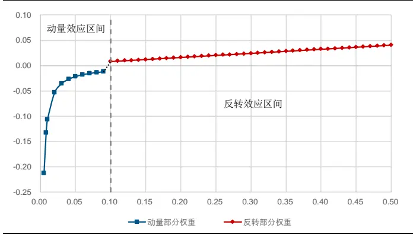
资料来源：长江证券研究所

图 15：结构化反转因子权重与成交量关系
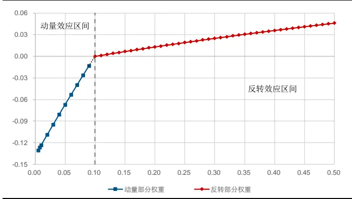
资料来源：长江证券研究所

表 29 中给出了反转类因子的风险指标，以上述方式构建的结构化反转因子，在全 A 股和中证 800 范围内，均可提升因子选股能力，在超额收益和多空收益上均有一定改善。

表 29：反转类因子风险指标

| 全市场 |  |  |  | 中证800 |  |  |  |
| --- | --- | --- | --- | --- | --- | --- | --- |
|  | 超额收益(%) | 信息比 | 多空收益(%) | 多空夏普比 | 超额收益(%) | 信息比 多空收益(%) | 多空夏普比 |
| 高频反转 | 5.41 | 0.91 | 27.41 | 2.56 | 4.68 | 0.84 20.03 | 1.86 |
| 非线性反转 | 6.48 | 1.13 | 28.70 | 2.88 | 5.04 0.96 | 19.88 | 1.94 |

资料来源：天软科技，长江证券研究所

## 小节

二阶矩计算会受到局部误差的影响，在个股波动角度对高频数据的级别有所制约；个股之间的匹配存在时间上的误差，在个股特异角度对高频数据级别有所制约。结果上看波动率类因子在30分钟级别下表现较好。而一阶矩计算不受局部误差影响，且个股自身不同维度数据匹配误差较小，使得高频反转因子在 5 分钟级别下仍有提升。

很多因子在头部或尾部的区分中存在异常逻辑，故非线性逻辑存在于因子的方方面面。如果在测试上发现了因子的非线性效应，并可以通过逻辑的检验及数学形式的改进，就可以对非线性效应给出改进，更好的融入线性选股体系。

## 总结

特异波动率因子更接近低波效应逻辑。低波效应的核心逻辑为股价变动相对于市场异常现象的均值回归，刻画相对价格变动的特异波动率更符合其逻辑；数学形式上看，特异波动率由波动率和特异率两个部分信息共同组成。表现上看特异波动率因子表现较好，全 A 股中超额收益 2.22%，信息比 0.32，多空收益26.21%，多空夏普比 1.71。

特异波动率以非线性的方式综合个股特异和个股波动的信息。波动率因子表现出的选股能力主要来源于绝对量上的价格变动和相对量上的价格变动的正向相关。特异波动率表现出的选股能力是通过个股特异和个股波动的正向关系，杠杆性地加强了个股股价变动的异常信息。故本文从细化个股特异和个股波动两个维度出发改进因子。在 fama 三因子的基础上，考虑和波动率类因子相关性较高的流动性和反转因子构建的新特异波动率因子，在全 A 股中超额收益 2.89%，信息比 0.42，多空收益26.32%，信息比1.80。以高频数据进行细化构建高频波动率因子，在全 A 股中超额收益 3.37%，信息比 0.49，多空收益 29.27%，信息比 1.99。

非线性波动率可以较为明显的提升特异波动率的选股能力。特异波动率因个股波动的头部区分能力较弱导致选股线性较差，以非线性的方式改进个股波动部分乘数，可以保留其空头端的区分能力，同时淡化头部组的分组信息，构建非线性波动率因子，在全 A 股中超额收益 7.19%，信息比 1.18，多空收益 31.25%，信息比 2.46。

低波效应和资产定价模型并不矛盾。低波效应为滞后一期的风险，但个股风险不具有持续性，同期风险的回测显示个股波动越大收益越高。而在剥离了风格因子的影响后，除去头尾组波动率类因子的排序为波动越大收益越高。

不同量价因子对高频数据的级别敏感程度不同。二阶矩计算会受到局部误差的影响，在个股波动角度对高频数据的级别有所制约；个股之间的匹配存在时间上的误差，在个股特异角度对高频数据级别有所制约。结果上看波动率类因子在 30 分钟级别下表现较好。而一阶矩计算不受局部误差影响，且个股自身不同维度数据匹配误差较小，使得高频反转因子在 5 分钟级别下仍有提升。

| 上海 | 武汉 |
| --- | --- |
| 浦东新区世纪大道1198号世纪汇广场一座29层（200122) | 武汉市新华路特8号长江证券大厦11楼(430015) |
| 北京 | 深圳 |
| 西城区金融街33号通泰大厦15层（100032) | 深圳市福田区中心四路1号嘉里建设广场 3期36 楼(518048) |

## 投资评级说明

| 行业评级 | 报告发布日后的12个月内行业股票指数的涨跌幅相对同期相关证券市场代表性指数的涨跌幅为基准，投资建议的评 |  |
| --- | --- | --- |
|  | 级标准为： |  |
|  | 看 好： | 相对表现优于同期相关证券市场代表性指数 |
|  | 中 性： | 相对表现与同期相关证券市场代表性指数持平 |
|  | 看 淡： | 相对表现弱于同期相关证券市场代表性指数 |
| 公司评级 |  | 报告发布日后的12个月内公司的涨跌幅相对同期相关证券市场代表性指数的涨跌幅为基准，投资建议的评级标准为： |
|  | 买 入： | 相对同期相关证券市场代表性指数涨幅大于10% |
|  | 增 持： | 相对同期相关证券市场代表性指数涨幅在5%～10%之间 |
|  | 中 性： | 相对同期相关证券市场代表性指数涨幅在-5%～5%之间 |
|  | 减持： 相对同期相关证券市场代表性指数涨幅小于-5% |  |
|  |  | 无投资评级：由于我们无法获取必要的资料，或者公司面临无法预见结果的重大不确定性事件，或者其他原因，致使 我们无法给出明确的投资评级。 |
| 相关证券市场代表性指数说明：A股市场以沪深300指数为基准；新三板市场以三板成指（针对协议转让标的）或三板做市指数 (针对做市转让标的)为基准；香港市场以恒生指数为基准。 |  |  |

## 联系我们

## 分析师声明

作者具有中国证券业协会授予的证券投资咨询执业资格并注册为证券分析师，以勤勉的职业态度，独立、客观地出具本报告。分析逻辑基于作者的职业理解，本报告清晰准确地反映了作者的研究观点。作者所得报酬的任何部分不曾与，不与，也不将与本报告中的具体推荐意见或观点而有直接或间接联系，特此声明。

## 重要声明

长江证券股份有限公司具有证券投资咨询业务资格，经营证券业务许可证编号：10060000。

本报告仅限中国大陆地区发行，仅供长江证券股份有限公司（以下简称：本公司）的客户使用。本公司不会因接收人收到本报告而视其为客户。本报告的信息均来源于公开资料，本公司对这些信息的准确性和完整性不作任何保证，也不保证所包含信息和建议不发生任何变更。本公司已力求报告内容的客观、公正，但文中的观点、结论和建议仅供参考，不包含作者对证券价格涨跌或市场走势的确定性判断。报告中的信息或意见并不构成所述证券的买卖出价或征价，投资者据此做出的任何投资决策与本公司和作者无关。

本报告所载的资料、意见及推测仅反映本公司于发布本报告当日的判断，本报告所指的证券或投资标的的价格、价值及投资收入可升可跌，过往表现不应作为日后的表现依据；在不同时期，本公司可以发出其他与本报告所载信息不一致及有不同结论的报告；本报告所反映研究人员的不同观点、见解及分析方法，并不代表本公司或其他附属机构的立场；本公司不保证本报告所含信息保持在最新状态。同时，本公司对本报告所含信息可在不发出通知的情形下做出修改，投资者应当自行关注相应的更新或修改。

本公司及作者在自身所知情范围内，与本报告中所评价或推荐的证券不存在法律法规要求披露或采取限制、静默措施的利益冲突。

本报告版权仅为本公司所有，未经书面许可，任何机构和个人不得以任何形式翻版、复制和发布。如引用须注明出处为长江证券研究所，且不得对本报告进行有悖原意的引用、删节和修改。刊载或者转发本证券研究报告或者摘要的，应当注明本报告的发布人和发布日期，提示使用证券研究报告的风险。未经授权刊载或者转发本报告的，本公司将保留向其追究法律责任的权利。

“慧博资讯”专业的投资研究大数据分享平台

点击进入http://www.hibor.com.cn