# 高频因子（七）：分布估计下的主动成交占比

分析师及联系人

[Table_A● 覃川桃

(8621)61118766

qinct@cjsc.com.cn

执业证书编号：

S0490513030001 ● 郑起 (8621)61118706 zhengqi2@cjsc.com 执业证书编号： S0490520060001报告要点

报告日期 2020-08-10

金融工程专题报告

## 相关研究

- 《险资特征及跟踪策略》2020-07-28

- 《基于状态变量的因子模型》2020-07- 27

- 《资金流跟踪系列十九：从资金维度看行业定价权》2020-07-25

## 基础因子研究（十二）

## 高频因子（七）：分布估计下的主动成交占比

## 主动成交买卖的划分多以价格变动方向为基础[Table_Summary]

当价格增加时，市场为卖方市场，买方不得不提高价格以促成交易，此时成交由买方驱动，反之当价格降低时，成交由卖方驱动。博弈因子以逐笔成交数据为基础，从挂单数据出发，当前成交价大于上一笔买一价时，成交量划分为主动买入，当前成交价小于上一笔卖一价时，成交量划分为主动卖出。资金流向因子以时间聚合 k 线数据为基础，从收盘价数据出发，当前收盘价大于上一期收盘价时，成交量划分为主动买入，当前收盘价小于上一期收盘价时，成交量划分为主动卖出。博弈因子和资金流向因子均有一定的选股能力。

## 批量成交划分法是一种以时间聚合k线数据为基础的主动买卖划分方法

批量成交划分法继承了以价格变动方向划分主动买卖的思想，并引入价格变动幅度对买卖占比的影响，即价格变动越大，买卖驱动力量越大，主动买卖所占比例越高，在每个时段做价格变动到主买占比的映射。以批量成交法构建的主动占比因子有一定选股能力。

## 满足价格变动幅度越大主动买卖占比越大的函数均可以估计主动买卖

以标准化收益率、收益率分位为自变量，以t分布、正态分布和均匀分布为对应法则估计主动买入量，以主动买入量占总成交量比例，构建主动成交占比因子，在全市场和中证 800 内均有较强的选股能力，其中以收益率分位为自变量、以正态分布和均匀分布为对应法则构建的因子表现更为稳定，全市场因子 IC 和 ICIR 分别达到-7.22%、-78.64%和-7.30%、-81.53%，中证 800 内 IC 和 ICIR 分别达到-6.43%、-55.49%和-6.51%、-57.31%。

## 主动成交占比因子头部排序有一定的非线性效应

在个股价格接近价值的情况下，截面上主动成交占比越低其未来价格将受到更大压制，分别以分段线性函数和对勾函数非线性映射改进因子，全市场因子 IC 和 ICIR 进一步达到-8.15%、-100/58%和-8.19%、-103.28%，中证 800 内 IC 和 ICIR 达到-7.26%、-66.27%和-7.31%、-67.94%。

## 主动成交占比因子在剔除风格因子线性影响后，信息主要集中在空头组

主动成交占比因子收益来源仍然为市场中存在的交易行为，和反转因子、波动率因子的相关性较高，在做风格因子中性后，失去超额收益能力，但仍然可以获得多空收益。

## 风险提示：[Table_

1. 模型存在失效风险；

2. 本文举例均基于历史数据，不保证未来收益。

A 股量价因子的收益来源往往是局部交易行为下个股定价对其价值的偏离。反转因子从价格变动的幅度上来刻画个股价格和其价值的偏离程度，是以表现结果导向其内在可能，而量的维度也可以刻画市场是否对个股定价产生偏离，博弈因子的构建即基于这一思路。

## 从博弈因子说起

在《高频因子（五）：高频因子和交易行为》中，我们提出了根据主动买入卖出在总成交量中的结构情况，构建的博弈因子，构建方法如下：

以逐笔成交数据估计主动买卖成交量。当前成交价大于上一笔买一价时，交易以买方为主导，记成交量为vol_buy ；反之当前成交价小于上一笔卖一价时，交易以卖方为主导，记成交量为vol_selli。则当天主买量为 $\begin{array}{r}{Vol\_Buy_{t}=\sum vol\_buy_{i}}\end{array}$ ，以衡量多空博弈双方多头力量，当天主卖量为 $\begin{array}{r}{Vol\_Sell_{t}=\sum vol\_sell_{i}}\end{array}$ ，以衡量多空博弈双方空头力量。

- 以一段时间总主动买入和总主动卖出的比例，构建博弈因子：

$$
\mathbb{\Psi}\mathbb{\Xi}\mathbb{\Xi}=\frac{\sum Vol\_Buy_{t}}{\sum Vol\_Sell_{t}}
$$

博弈因子构建的思路在于，主动买入量刻画了买方（多头）力量，主动卖出量刻画了卖方（空头）力量，买方力量相比于卖方力量越强，个股价格越容易被多头力量推升，也越容易被市场高估。所以从博弈因子的构建过程上看，关键在于如何准确的刻画市场的主动买卖。

下图分别展示了该因子自 2005 年以来在全市场及中证 800 内表现，并在下表中给出了其分年风险指标，可以看到：

全历史时间段，博弈因子在全市场和中证 800 内均可以获得一定的超额收益和多空收益，因子选股的分组线性较好；

分年来看，博弈因子在 2015 年超额收益和多空收益能力显著，在近些年不论是多空收益还是超额收益，均产生波动。

图 1：全市场博弈因子回测净值
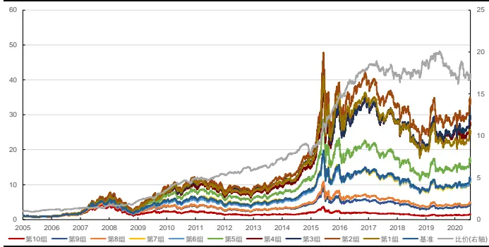
资料来源：天软科技，长江证券研究所

图 2：中证 800博弈因子回测净值
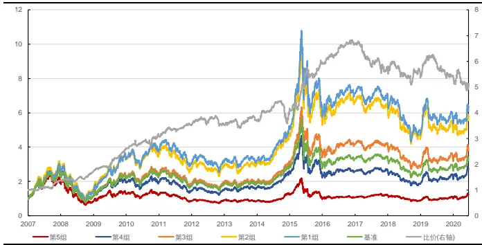
资料来源：天软科技，长江证券研究所

表 1：博弈因子分年风险指标

| 全A股 |  |  |  |  |  |  |  |
| --- | --- | --- | --- | --- | --- | --- | --- |
| 超额收益(%) | 信息比 | 多空收益(%) | 多空夏普比 | 超额收益(%) | 信息比 | 中证800 多空收益(%) | 多空夏普比 |
| 2005 | 8.64 | 1.65 20.54 | 1.79 |  |  |  |  |
| 2006 | 5.13 0.97 | 8.82 | 0.93 |  |  |  |  |
| 2007 | 3.64 | 0.43 | 26.57 | 1.72 | 12.51 1.90 | 31.91 | 2.61 |
| 2008 | 10.89 | 1.38 | 33.57 | 2.32 | 9.83 | 1.81 24.35 | 2.26 |
| 2009 | 14.97 | 2.69 | 56.96 | 4.18 | 19.71 4.36 | 50.81 | 4.58 |
| 2010 | 16.07 | 3.00 | 38.94 | 3.55 | 9.56 | 1.59 20.42 | 1.72 |
| 2011 | 0.07 | -0.01 | 11.79 | 1.51 | 9.18 2.43 | 20.06 | 2.47 |
| 2012 | 1.52 | 0.43 | 9.38 | 1.21 | -2.00 | -0.66 -1.64 | -0.25 |
| 2013 | 8.05 | 2.12 | 23.95 | 3.23 | 0.89 | 0.24 8.99 | 1.13 |
| 2014 | -1.10 | -0.18 | 5.07 | 0.58 | -4.03 | -0.85 -6.74 | -0.58 |
| 2015 | 20.88 | 2.68 | 90.07 | 4.40 | 20.04 | 2.46 62.34 | 3.26 |
| 2016 | 6.58 | 1.10 | 24.38 | 3.13 | 7.57 | 1.66 17.18 | 2.47 |
| 2017 | -4.62 | -1.27 | -5.68 | -0.70 | -6.51 | -1.63 -17.06 | -1.99 |
| 2018 | 1.18 | 0.37 | 6.51 | 0.74 | 0.35 | 0.17 -2.49 | -0.12 |
| 2019 | -4.59 | -1.23 | -4.72 | -0.56 | 0.10 | 0.01 -0.83 | -0.08 |
| 2020 | -4.59 | -0.65 | -2.35 | -0.18 | -6.71 | -1.40 -7.76 | -0.75 |
| 总计 | 5.25 | 0.87 | 20.82 | 1.78 | 5.06 | 0.94 13.24 | 1.21 |

资料来源：天软科技，长江证券研究所

## 如何刻画主动买卖

主动买卖，是为了衡量成交是受买方驱动还是卖方驱动，在博弈因子的构建中，根据当前价格和上一时刻的买一卖一数据做对比，衡量成交背后的驱动力，背后隐含的逻辑为当价格增加时，市场为卖方市场，买方不得不提高价格以促成交易，此时成交由买方驱动，反之当价格降低时，成交由卖方驱动。所以对于主动买卖估计的主要方法是以价格的变动方向作为买卖驱动的划分。

## 资金流向因子

在《如何利用负面因子做指数增强？——高频因子篇》中，便按照上述思路对资金流入方向给出划分，即股价上涨时资金呈流入状态，股价下跌资金呈流出状态，提出了资金流向因子的构建方法，即时间段内价格上升成交额归为资金流入，时间段内价格下降成交额归为资金流出，计算主动流入资金占比，具体如下：

$$
\frac{\gamma\sf R}{\sf R}\frac{\sf R}{\sf t}\dot{\sf z}\frac{\sf r}{/\eta\sf R}\boldsymbol{\|}_{i}=Amount_{i}\times\frac{Close_{i}-Close_{i-1}}{|Close_{i}-Close_{i-1}|}
$$

$$
\Xi\sum_{\Xi}^{\infty}{\widehat{\ddagger}}{\widehat{\ddagger}}{\widehat{\ddagger}}{\widehat{\boxplus}}{\widehat{\boxplus}}{\widehat{\boxplus}}={\frac{\sum_{i=1}^{N}{\overset{\ddots}{\operatorname{A}}}{\widehat{\operatorname*{A}}}\widehat{\ddagger}{\widehat{\operatorname*{A}}}{\widehat{\operatorname*{A}}}}_{i}}{\sum_{i=1}^{N}Amount_{i}}_{i}
$$

其中i为每个时间段标注，Closei为时间段末复权收盘价，Amounti为时间段成交额，N为因子构建时所包含的全部时间段。

资金流向仍然以价格的变动方向作为区别买卖驱动的标准，但是提供了区别于挂单比较的另一种思路，即以收盘价的变动方向为标准，挂单比较是成交数据在量（即成交笔数）维度的划分，收盘价比较是成交数据在时间维度的划分，是主动买卖另一个维度的理解。下图分别展示了自 2010 年以来资金流向因子在中证 500 内分组净值表现，以及在沪深300 和中证500 整体分组超额收益情况，可以看到：

从分组净值上看，资金流因子中证 500 内可以获取一定超额收益和多空收益，但稳定性一般；

全时间段上看，资金流向因子分组结果在中证 500 内线性排序性较好，在沪深 300内排序无线性性。

图 3：中证 500 资金流向因子回测净值
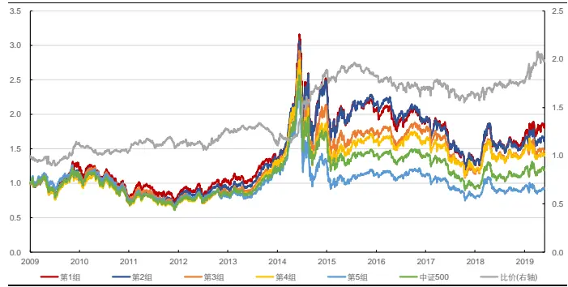
资料来源：天软科技，长江证券研究所

图 4：资金流向因子分组超额收益（沪深 300、中证 500 内）
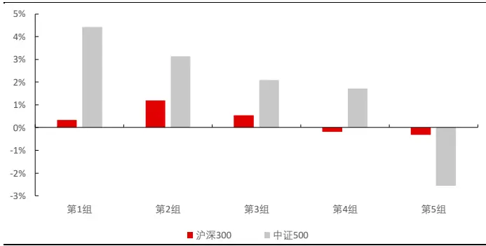
资料来源：天软科技，长江证券研究所

## 批量成交划分法

资金流向因子根据每个时间段价格变动方向，对成交量给出 1 或-1 的绝对划分，即整个时间段的成交量全部为主动买入或主动卖出，当时间段的划分足够细致时，如精确到 1秒级别，其划分结果和博弈因子中根据挂单的划分结果将较为相近，但当时间段划分频繁较低时，非主买即主卖的划分方式会有较大误差，相同划分频率不同划分路径，也会导致估计的主买卖量估计有较大不同。究其原因，因为绝大部分时间段的成交几乎均有买卖双方各自驱动成交的部分，非此即彼的指示性划分方式有较大误差，而将指示性值转化为连续性值则可以提升估计的准确程度。

批量成交划分法即根据上述思路，提出了在时间段上对成交量从指示性划分到连续性划分的解决方法，方法如下：

$$
\pm\frac{\mp}{\Xi}\mathbf{j}\mathbf{\jmath}_{\Xi^{\prime}\setminus\widehat{\Sigma}}^{\mp}\land\widehat{\pmb{\Sigma}}\widehat{\pmb{\Xi}}\mathbf{\jmath}_{i}^{\mp}=Amount_{i}\times t(\frac{Close_{i}-Close_{i-1}}{\sigma_{\Delta close}},df)
$$

$$
\pm\nexists\exists\div\sqcup\qquad e\ggg\exists\div\emptyset.
$$

和资金流向因子中的资金流向相比，式子的变化主要在成交额所乘的系数上，其中t()为t分布的累计分布函数，函数值在 0 到 1 之间，保证了每期估计的主动流入金额在 0到该期总成交额之间； $\sigma_{\Delta close}$ 为在整个时间区间内，每段时间末截面收盘价的标准差，保证每段时间价格变动相对可比；df为自由度，针对相同的股价变动，自由度越小，则根据t分布得到的主动买入金额占比越小。

批量成交划分法通过连续函数，将价格变动映射至主动买入所占比例，从方法上看仍然遵从价格变动方向对买卖驱动的划分，并加入了新的原则，即价格变动越大，买卖驱动力量越大，主动买卖所占比例越高。

## 朴素主动占比因子

本节根据批量成交划分法，对资金流向因子给出改进，构建朴素主动占比因子：

$$
\arrows hee\pm\infty\pm\infty\rfloor\downarrow\downarrow\downarrow\downarrow EtE\downarrow\mp=\frac{\sum_{i=1}^{N}\pm\overline{{\Xi}}\mathrm{j})\overline{{\vec{s}_{\mathrm{\uparrow}}^{\prime}}}\wedge\underline{{\hat{\mathrm{g}}}}\overline{{\vec{\mathrm{g}}}}\mathrm{j}\mathrm{\downarrow}}{\sum_{i=1}^{N}Amount_{i}}
$$

下图分别展示了该因子自 2005 年以来在全市场及中证 800内表现，并在下表中给出了其分年风险指标，可以看到：

全历史时间段，朴素主动占比因子在全市场和中证 800 内均可以获得一定的多空收益，在中证 800 内稳定性较差，但均无获得超额收益能力；

分年来看，因子近些年在全市场和中证 800 中，不论是多空收益还是超额收益，均产生一定回撤。

图 5：全市场朴素主动占比因子回测净值
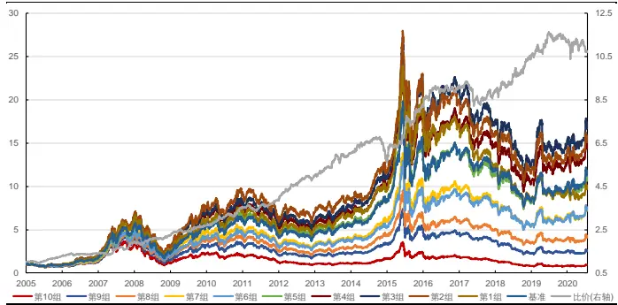
资料来源：天软科技，长江证券研究所

图 6：中证 800 朴素主动占比因子回测净值
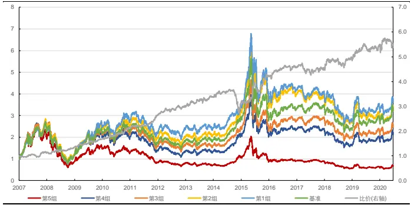
资料来源：天软科技，长江证券研究所

表 2：朴素主动占比因子分年风险指标

| 全A股 |  |  |  |  | 中证800 |  |  |  |
| --- | --- | --- | --- | --- | --- | --- | --- | --- |
|  | 超额收益(%) | 信息比 | 多空收益(%) | 多空夏普比 | 超额收益(%) | 信息比 | 多空收益(%) | 多空夏普比 |
| 2005 | 9.89 | 1.79 | 28.22 | 2.80 |  |  |  |  |
| 2006 | -1.49 | -0.21 | 8.41 | 1.08 |  |  |  |  |
| 2007 | 6.22 | 0.79 | 37.69 | 2.72 | 1.22 | 0.33 | 14.05 | 1.41 |
| 2008 | -3.75 | -0.59 | 15.70 | 1.53 | -0.85 | -0.03 | 12.70 | 1.35 |
| 2009 | 0.73 | 0.19 | 21.51 | 2.47 | 11.97 | 2.28 | 29.30 | 3.49 |
| 2010 | 4.34 | 0.85 | 30.18 | 3.11 | 6.39 | 0.96 | 25.42 | 2.02 |
| 2011 | -1.70 | -0.60 | 11.70 | 1.73 | 5.35 | 1.35 | 22.40 | 2.86 |
| 2012 | 2.02 | 0.60 | 27.47 | 3.63 | 3.38 | 0.87 | 16.50 | 2.16 |
| 2013 | 3.01 | 0.75 | 21.05 | 2.72 | 0.48 | 0.20 | 14.13 | 1.79 |
| 2014 | -4.69 | -1.06 | -6.23 | -0.72 | -14.65 | -3.01 | -19.28 | -1.95 |
| 2015 | 11.41 | 1.56 | 46.44 | 3.31 | 17.55 | 2.27 | 56.30 | 3.47 |
| 2016 | -4.77 | -1.19 | 10.47 | 1.67 | -2.54 | -0.68 | 8.40 | 1.43 |
| 2017 | -14.08 | -3.52 | -3.06 | -0.33 | -7.45 | -1.89 | -2.31 | -0.23 |
| 2018 | -3.08 | -0.72 | 16.92 | 2.14 | -1.55 | -0.24 | 8.14 | 0.98 |
| 2019 | -7.88 | -2.15 | 7.76 | 1.21 | 0.72 | 0.31 | 7.51 | 1.08 |
| 2020 | -9.06 | -1.58 | -5.41 | -0.78 | -4.30 | -0.92 | 2.57 | 0.46 |
| 总计 | -1.09 | -0.17 | 17.00 | 1.81 | 0.90 | 0.20 | 13.83 | 1.39 |

资料来源：天软科技，长江证券研究所

## 主动占比因子构建

## 再看批量成交划分法

从上文中对批量成交划分法的描述中，我们可以概括出在时间划分维度，对主动买卖估计的原则：

价格变动方向决定了该时间段主动买卖的主要驱动界定，价格正向变动以买方驱动为主，价格负向变动以卖方驱动为主；

价格变动幅度决定了该时间段主要驱动力量的占比情况，价格变动越大，主要驱动力量占比越大，价格变动越小，主要驱动力量占比越小。

在实现上述刻画时，批量成交划分法以t分布累计函数做价格变动到主动买卖占比的映射，因为t分布累计函数具有三个特点：

函数值在 0 到 1 之间，保证主动买入占比在 0 到 1 之间；

函数为单调递增函数，保证价格正向变动越大，主动买入占比越高，价格负向变动越大，主动卖出占比越高；

函数f(x)和1−f(x)为关于y轴的对称函数，保证从主动买入和主动卖出上刻画的买卖驱动力量结果一致。

故从实现角度看，只要有函数可以满足上述条件，就可以作为一个合理的映射函数。

此外，在考虑函数时，可以从两个维度入手，即函数自变量取值和对应法则（函数三要素定义域、值域和对应法则，确定定义域取值和对应法则，则确定值域函数值）：

批量成交划分法以价格变动作为自变量，为了防止不同个股价格水平不同而在函数对应法则的适用性上产生变化，做价格变化相对于价格标准差的标准化处理。但值得注意的是价格变化是指数级别上的变动，以价格上升的过程为例，价格变动将呈指数级增加，后期价格变动更大，估计主动买入占比更大，但实际从变动幅度上来看应和之前价格变动稍小的占比水平一致。

为解决价格指数变动的问题，可以以价格一阶导，即收益率作为自变量，一方面其保留了价格变动方向和变动幅度上对主动买卖占比的刻画，另一方面在时间序列上不会存在受价格高低影响的占比估计误差。

批量成交划分法以t分布累计函数作为对应法则，保证价格变动幅度和主动买卖占比估计大小呈正向关系，并且这种正向关系和t分布相关，最直观的特点就是对相同价格变动单位，在价格正向或负向变动初始对主动买卖占比影响更大，而在涨跌停的附近的价格变动对主动买卖占比影响较小。

真实的价格变动和主动买卖强弱的对应关系是否真的为t分布的刻画，是否有其他函数可以更好地表现随价格变动幅度主动买卖力度的变化，下文中分别尝试t分布、正态分布和均匀分布。

## T分布主动占比因子

本节以t分布累计函数为对应法则，以收益率为自变量，构建 T 分布主动占比因子。在将价格变动以收益率替代时，仍存在不同个股因波动率不同在同一函数对应法则下不适用的情况，故作收益率对波动率的标准化处理，因子构建过程如下：

$$
\mathbb{T}\not\mathcal{H}\not\equiv\equiv\mathbb{\bar{z}}\not\exists)\overline{{\vec{\geqslant}\cdot}}\bigwedge\bigoplus_{i\in\mathcal{B}}\mathbb{\bar{z}}\not\equiv Amount_{i}\times t(\frac{ret_{i}}{\sigma_{ret}},df)
$$

$$
\mathrm{~T~}\mathcal{G}\mathcal{F}\equiv\Xi\mathcal{J}\Xi\mathcal{k}\mathcal{E}\Xi\mathcal{F}=\frac\sum_{i=1}^{N}\mathrm{{T}}\mathbf{\Xi}\mathbf{\mathcal{G}}\mathbf{\Xi}\mathbf{\Xi}\mp\Xi\mathbf{\Xi}\mathbf{\Xi}\mathbf{\Xi}\mathbf{\Xi}\mathbf{\Xi}\mathbf{\Xi}\mathbf{\Xi}\mathbf{\Xi}\mathbf{\Xi}\mathbf{\Xi}\mathbf{\Xi}\mathbf{\Xi}\mathbf{\Xi}\mathbf{\Xi}\mathbf{\Xi}\mathbf{\Xi}\mathbf{\Xi}\mathbf{\Xi}\mathbf{\Xi}\mathbf{\Xi}\mathbf{\Xi}\mathbf{\Xi}\mathbf{\Xi}\mathbf{\Xi}\mathbf{\Xi}\mathbf{\Xi}\mathbf{\Xi}\mathbf{\Xi}\mathbf{\Xi}\mathbf{\Xi}\mathbf{\Xi}\mathbf{\Xi}\mathbf{\Xi}\mathbf{\Xi}\mathbf{\Xi}\mathbf{\Xi}\mathbf{\Xi}\mathbf{\Xi}\mathbf{\Xi}\mathbf{\Xi}\mathbf{\Xi}\mathbf{\Xi}\mathbf{\Xi}\mathbf{\Xi}\mathbf{\Xi}\mathbf{\Xi}\mathbf{\Xi}\mathbf{\Xi}\mathbf{\Xi}\mathbf{\Xi}\mathbf{\Xi}\mathbf{\Xi}\mathbf{\Xi}\mathbf{\Xi}\mathbf{\Xi}\mathbf{\Xi}\mathbf{\Xi}\mathbf{\Xi}\mathbf{\Xi}\mathbf{\Xi}\mathbf{\Xi}\mathbf{\Xi}\mathbf{\Xi}\mathbf{\Xi}\mathbf{\Xi}\mathbf{\Xi}\mathbf{\Xi}\mathbf{\Xi}\mathbf{\Xi}\mathbf{\Xi}\mathbf{\Xi}\mathbf{\Xi}\mathbf{\Xi}\mathbf{\Xi}\mathbf{\Xi}\mathbf{\Xi}\mathbf{\Xi}\mathbf{\Xi}\mathbf{\Xi}\mathbf{\Xi}\mathbf{\Xi}\mathbf{\Xi}\mathbf{\Xi}\mathbf{\Xi}\mathbf{\Xi}\mathbf{\Xi}\mathbf{\Xi}\mathbf{\Xi}\mathbf{\Xi}\mathbf{\Xi}\mathbf{\Xi}\mathbf{\Xi}\mathbf{\Xi}\mathbf{\Xi}\mathbf{\Xi}\mathbf{\Xi}\mathbf{\Xi}\mathbf{\Xi\Xi}\mathbf
$$

其中 $ret_{i}$ 为每个时间段收益率， $\sigma_{ret}$ 为全部时间段收益率标准差。

下图分别展示了该因子自 2005 年以来在全市场及中证 800内表现，并在下表中给出了其分年风险指标，可以看到：

全历史时间段，T 分布主动占比因子在全市场和中证 800 内均可以获得一定的多空收益，在中证 800 内稳定性较差，但均无获得超额收益能力；

分年来看，因子近些年在全市场和中证 800 中，不论是多空收益还是超额收益，均产生一定回撤。

图 7：全市场T 分布主动占比因子回测净值
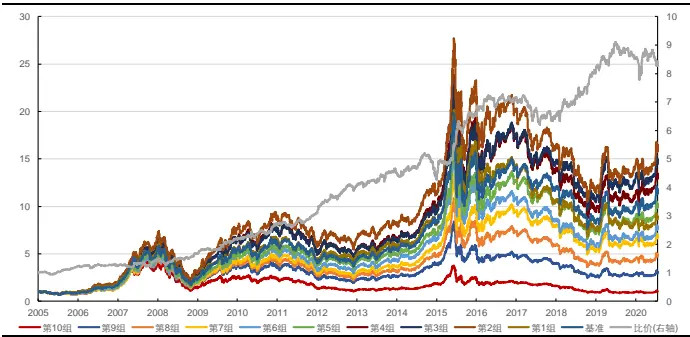
资料来源：天软科技，长江证券研究所

图 8：中证 800T分布主动占比因子回测净值
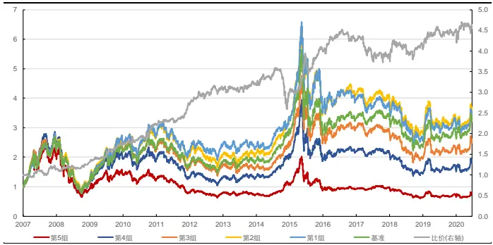
资料来源：天软科技，长江证券研究所

表 3：T 分布主动占比因子分年风险指标

| 全A股 |  |  |  |  |  |  |  |
| --- | --- | --- | --- | --- | --- | --- | --- |
| 超额收益(%) | 信息比 | 多空收益(%) | 多空夏普比 | 超额收益(%) | 中证800 信息比 | 多空收益(%) | 多空夏普比 |
| 2005 | 7.46 1.12 | 22.86 | 2.00 |  |  |  |  |
| 2006 | -1.29 -0.17 | 1.28 | 0.10 |  |  |  |  |
| 2007 | -1.64 | -0.11 16.54 | 1.20 | 3.32 | 0.61 | 18.29 | 1.58 |
| 2008 | -0.75 | 0.02 14.71 | 1.35 | -1.33 | -0.11 | 5.22 | 0.60 |
| 2009 | -1.27 | -0.13 31.36 | 2.76 | 10.45 | 1.98 | 39.51 | 3.59 |
| 2010 | 2.54 | 0.39 22.50 | 1.67 | 5.65 | 0.78 | 25.58 | 1.73 |
| 2011 | -1.56 | -0.47 16.25 | 1.92 | 3.56 | 0.77 | 18.42 | 2.11 |
| 2012 | 5.81 | 1.35 30.35 | 3.26 | 6.72 | 1.49 | 18.78 | 2.07 |
| 2013 | -1.59 | -0.30 12.16 | 1.43 | -2.94 | -0.55 | 5.37 | 0.70 |
| 2014 | -9.00 -1.97 | -5.63 | -0.50 | -14.75 | -2.91 | -19.64 | -1.70 |
| 2015 | 9.61 1.31 | 53.95 | 3.39 | 15.69 | 2.00 | 57.50 | 3.26 |
| 2016 | -5.03 -1.13 | 8.19 | 1.07 | -3.46 | -0.86 | 6.90 | 1.07 |
| 2017 | -12.94 | -2.88 -8.91 | -0.88 | -9.31 | -2.12 | -10.85 | -1.13 |
| 2018 | 2.28 | 0.59 22.83 | 2.37 | -0.04 | 0.08 | 4.88 | 0.57 |
| 2019 | -8.61 | -2.34 | 6.70 | 0.84 | 0.10 0.16 | 7.34 | 0.97 |
| 2020 | -8.75 | -1.51 -4.84 | -0.56 | -4.08 | -0.85 | 3.68 | 0.58 |
| 总计 | -1.85 | -0.28 | 14.96 | 1.37 | 0.43 | 0.11 | 12.33 1.11 |

资料来源：天软科技，长江证券研究所

## 正态分布主动占比因子

本节以正态分布累计函数为对应法则，以收益率为自变量，构建正态分布主动占比因子，并提出两种方法。

第一种方法和 T分布主动占比因子类似，以标准化的收益率作为自变量，并认为其服从标准正态分布，做其以标准正态分布累计函数到主动买入占比的映射：

$$
1\div\frac{1}{17}\times\frac{1}{18}=\frac{1}{15}\times\frac{1}{3}+\frac{1}{17}\frac{1}{3}=\frac{1}{18}\times\frac{1}{3}=\frac{1}{18}=1000011\times11\times\frac{11}{(\frac{11}{\sigma_{ret}})}
$$

$$
\frac{1}{17\times16}\mathbb{1}\mathbb{E}\mathbb{\frac{\eta\mathbb{\hat{\times}}\mathcal{A}}{8\times4}}\mathbb{1}\mathbb{\hat{\eta}}\mathbb{\pm\frac{\mathbb{-j}}{8}}\mathbb{j}\mathbb{E}\mathbb{k}\mathbb{E}\mathbb{E}\mathbb{1}\mathbb\mp\frac{\mathbb{-j}\mathbb{\hat{\times}}\mathbb{\hat{\times}}\mathbb{\hat{\times}}\mathbb{\hat{\times}}\mathbb{\hat{\times}}\mathbb{\hat{\times}}\mathbb{\hat{\times}}\mathbb{\hat{\times}}\mathbb{\hat{\times}}\mathbb{\hat{\times}}\mathbb{\hat{\times}}\mathbb{\hat{\times}}\mathbb{\hat{\times}}\mathbb{\hat{\times}}\mathbb{\hat{\times}}\mathbb{\hat{\times}}\mathbb{\hat{\times}}\mathbb{\hat{\times}}\mathbb{\hat{\times}}\mathbb{\hat{\times}}\mathbb{\hat{\times}}\mathbb{\hat{\times}}\mathbb{\hat{\times}}\mathbb{\hat{\times}}\mathbb{\hat{\times}}\mathbb{\hat\hat{\times}}\mathbb{\hat\hat{\times}}\mathbb{\hat\hat{\times}}}{\sum_{i=1}^{N}Amount_{i}}
$$

其中N()为标准正态分布累计函数。

下图分别展示了该因子自 2005 年以来在全市场及中证 800 内表现，并在下表中给出了其分年风险指标，可以看到：

全历史时间段，标准正态分布主动占比因子在全市场和中证 800 内均可以获得一定的多空收益，在中证 800 内稳定性较差，但是有一定超额收益，在全市场稳定性较好，但无超额收益能力；

分年来看，因子近些年在全市场和中证 800 中，不论是多空收益还是超额收益，均产生一定回撤。

图 9：全市场标准正态分布主动占比因子回测净值
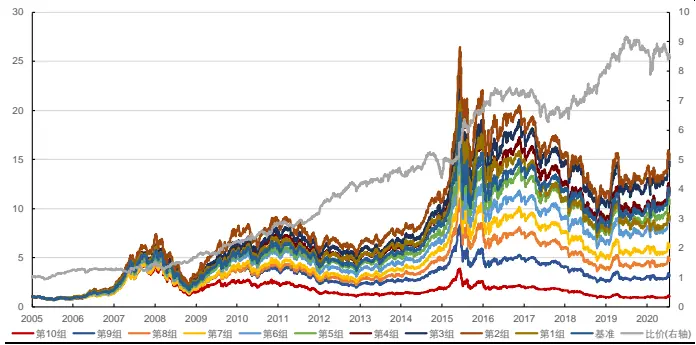
资料来源：天软科技，长江证券研究所

图 10：中证 800标准正态分布主动占比因子回测净值
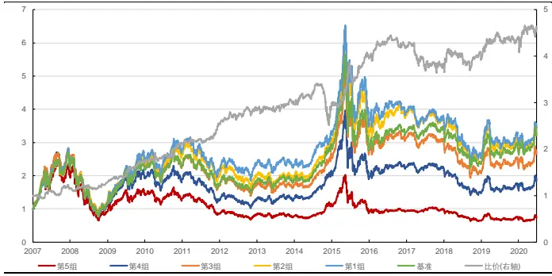
资料来源：天软科技，长江证券研究所

表 4：标准正态分布主动占比因子分年风险指标

| 全A股 |  |  |  |  |  | 中证800 |  |  |
| --- | --- | --- | --- | --- | --- | --- | --- | --- |
|  | 超额收益(%) | 信息比 | 多空收益(%) | 多空夏普比 | 超额收益(%) | 信息比 | 多空收益(%) | 多空夏普比 |
| 2005 | 9.34 | 1.41 | 25.31 | 2.14 |  |  |  |  |
| 2006 | -0.71 | -0.08 | -1.42 | -0.18 |  |  |  |  |
| 2007 | -2.17 | -0.17 | 16.71 | 1.23 | 4.19 | 0.73 | 19.02 | 1.64 |
| 2008 | -0.27 | 0.10 | 15.77 | 1.45 | -2.30 | -0.27 | 3.33 | 0.43 |
| 2009 | -1.24 | -0.12 | 31.66 | 2.79 | 11.53 | 2.22 | 40.54 | 3.69 |
| 2010 | 4.20 | 0.59 | 26.04 | 1.86 | 4.27 | 0.61 | 19.67 | 1.35 |
| 2011 | -1.56 | -0.48 | 14.98 | 1.77 | 3.27 | 0.71 | 16.51 | 1.92 |
| 2012 | 6.51 | 1.49 | 29.73 | 3.18 | 5.15 | 1.19 | 17.25 | 1.94 |
| 2013 | -1.41 | -0.25 | 11.26 | 1.31 | -1.75 | -0.29 | 7.63 | 0.94 |
| 2014 | -9.21 | -1.99 | -4.46 | -0.36 | -14.48 | -2.79 | -17.10 | -1.45 |
| 2015 | 9.16 | 1.26 | 52.87 | 3.25 | 16.17 | 2.02 | 60.35 | 3.32 |
| 2016 | -4.84 | -1.07 | 9.09 | 1.17 | -3.97 | -0.96 | 6.16 | 0.97 |
| 2017 | -13.14 | -2.92 | -9.89 | -0.98 | -9.21 | -2.14 | -10.93 | -1.11 |
| 2018 | 1.19 | 0.35 | 19.92 | 2.04 | 0.37 | 0.17 | 4.47 | 0.53 |
| 2019 | -8.14 | -2.23 | 9.47 | 1.17 | -0.16 | 0.09 | 7.47 | 0.96 |
| 2020 | -9.38 | -1.65 | -4.44 | -0.51 | -3.53 | -0.72 | 5.76 | 0.82 |
| 总计 | -1.66 | -0.25 | 15.11 | 1.37 | 0.43 | 0.11 | 12.31 | 1.10 |

资料来源：天软科技，长江证券研究所

第二种方法承认个股波动天然存在差异，但是价格变动可以在各个时间段直接反应当时的主动买卖强弱，故个股波动的存在实际上是市场投资者对于该个股在交易上的直接体现，而反之波动率并不影响主动买卖力量，故可以直接以收益率作为自变量。A 股存在涨跌停限制，个股价格变动幅度一般在-10%到 10%之间，当价格变动到达涨跌停限制甚至溢出时，可以认为是统计上的一次异常变动，以统计下标准正态分布 95%置信水平系数 1.96 为标准，做收益率线性变换后的值到主动买入占比的映射：

$$
\frac{\cos}{\mathbb{E}}\langle\Xi\operatorname{I}\mathbb{E}\langle\Xi\rangle\mathcal{I}\dag\mathbb{1}\pm\frac{-}{\alpha}\mathcal{I}\dag\overline{{\tilde{s}^{\prime}}}\wedge\overbrace{\pmb{\mathscr{E}}\frac{\varkappa}{\alpha}\mathcal{U}}^{\Xi\star\Xi}\mathcal{\Lambda}_{i}=Amount_{i}\times N(\frac{ret_{t}}{0.1}\times1.96)
$$

$$
\frac\sum_{i=1}^{n}\sum_{j=1}^{m}\sum_{i=1}^{j}\mathcal{I}_{ij}^{j}\sum_{k=1}^{m}\sum_{j=1}^{k}\mathrm{t}_{k}^{\mathrm{t}_{k}}\mathrm{E}_{i}^{j}=\frac\sum_{i=1}^{N}\frac\sum_{i=1}^{m}\big\langle\frac{-2}{2}\mathrm{t}_{i}\mathrm{E}_{i}^{j}\Sigma_{k}^{i}\big\rangle+\mathrm{t}_{i}^{\mathrm{t}}\pm\frac{1}{2}\mathrm{j}\frac{\partial^{2}}{\partial\mathrm{t}_{i}}\wedge\frac{\displaystyle{\widehat{\mathrm{tan}}_{i}^{\mathrm{t}}}}{\displaystyle{\sum_{i=1}^{N}Amount_{i}}}\mathrm{t}_{i}
$$

下图分别展示了该因子自 2005 年以来在全市场及中证 800内表现，并在下表中给出了其分年风险指标，可以看到：

全历史时间段，置信正态分布主动占比因子在全市场和中证 800 内均可以获得一定的多空收益和超额收益，其中多空收益稳定性均较好；

- 分年来看，因子近些年在全市场和中证 800 中，超额收益产生一定回撤。

图 11：全市场置信正态分布主动占比因子回测净值
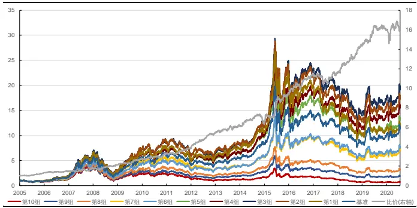
资料来源：天软科技，长江证券研究所

图 12：中证 800置信正态分布主动占比因子回测净值
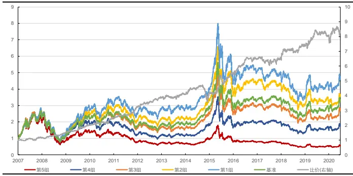
资料来源：天软科技，长江证券研究所

表 5：置信正态分布主动占比因子分年风险指标

| 全A股 中证800 |  |  |  |  |  |  |
| --- | --- | --- | --- | --- | --- | --- |
| 超额收益(%) | 信息比 | 多空收益(%) | 多空夏普比 | 超额收益(%) | 信息比 | 多空收益(%) 多空夏普比 |
| 2005 | 9.78 1.50 | 31.06 | 3.00 |  |  |  |
| 2006 | 0.60 0.15 | 10.66 | 1.10 |  |  |  |
| 2007 | 6.63 0.79 | 21.70 | 1.53 | 5.98 | 0.89 | 16.96 1.38 |
| 2008 | 0.05 0.15 | 21.39 | 1.79 | 5.05 | 0.93 24.64 | 2.26 |
| 2009 | 1.92 0.46 | 27.49 | 2.73 | 11.60 | 2.11 35.86 | 3.37 |
| 2010 | 2.04 0.36 | 19.23 | 1.59 | 5.52 | 0.83 22.22 | 1.61 |
| 2011 | 0.16 -0.10 | 19.23 | 2.27 | 7.79 | 1.81 28.58 | 3.32 |
| 2012 | 8.57 1.75 | 39.93 | 4.34 | 7.48 | 1.50 23.09 | 2.62 |
| 2013 | 1.02 0.29 | 13.14 | 1.57 | -0.44 | 0.00 8.07 | 0.90 |
| 2014 | -5.27 -1.09 | 2.58 | 0.37 | -13.25 | -2.70 -13.55 | -1.14 |
| 2015 | 11.88 1.61 | 50.89 | 2.98 | 17.84 | 2.21 54.89 | 3.09 |
| 2016 | -0.65 -0.18 | 20.86 | 2.54 | 0.79 | 0.26 18.82 | 2.48 |
| 2017 | -14.62 -2.49 | 0.90 | 0.19 | -7.35 | -1.75 -1.82 | -0.11 |
| 2018 | 0.34 0.14 | 23.46 | 3.07 | 1.08 | 0.31 14.67 | 1.63 |
| 2019 | -7.18 -1.86 | 11.98 | 1.72 | 2.01 | 0.64 | 9.11 1.22 |
| 2020 | -7.50 -1.41 | -2.08 | -0.17 | -5.14 | -1.13 | 0.57 0.18 |
| 总计 | 0.28 0.07 | 20.12 | 1.84 | 2.68 | 0.48 | 17.46 1.53 |

资料来源：天软科技，长江证券研究所

## 均匀分布主动占比因子

不论是t分布还是正态分布，从分布刻画上看，对相同价格变动单位，均认为在价格正向或负向变动初始对主动买卖占比影响更大，即价格变动对主动买卖力量衰退式影响，但真实的分布还存在均匀影响、递增式影响的可能，故本节以均匀分布为例，展示均匀影响下的估计情况。由于 A 股存在涨跌停限制，个股价格变动幅度一般在-0.1 到 0.1 之间，做原收益率从-0.1 至 0.1到 0 至1 之间的线性变换：

$$
\pm\overleftrightarrow{\sf z}\ \overleftrightarrow{\sf z}\ \sum\mathrm{\large~\frac{~1~}{~2~}~}\ I\mathrm{\large~\frac{~1~}{~2~}~}\overbrace{\sf z}^{\mathrm{~\large~\frac{~1~}{~2~}~}}\lambda\overbrace{\pm\frac{~1}{~2~}\mathrm{\large~\frac{~1~}{~2~}~}}^{\mathrm{~\large~\frac{~1~}{~2~}~}}=Amount_{i}\times\frac{ret_{t}-0.1}{0.2}
$$

$$
\pm5){\mathcal{G}}\supset{\mathcal{F}}{\mathcal{F}}\oplus{\pm}{\pm}{\vec{\mathfrak{a}}}{\mathfrak{j}}{\vert}{\pm}{\mathrm{E}}{\mathsf{k}}{\vert}{\Xi}{\vert}=\frac\sum_{i=1}^{N}{{\pm}{\bf{\dot{5}}}{\bf{\dot{7}}}}{\bf{\dot{7}}}{\pm}{\bf{\dot{7}}}{\pm}{\bf{\dot{7}}}{\pm}{\bf{\dot{7}}}{\vert}{\pm}{\bf{\dot{5}}}{\bf{)}}{\vert}\widehat{\bf{\dot{\xi}}}{\bf{\dot{\xi}}}{\bf{\dot{\times}}}\bf{\dot{\Xi}}{\bf{\dot{\Xi}}}{\bf{\dot{\Xi}}}{\bf{\dot{\Xi}}}{\bf{\dot{\Xi}}}{\bf{\dot{\Xi}}}{\bf{\dot{\Xi}}}{\bf{\dot{\Xi}}}{\bf{\dot{\Xi}}}{\bf{\dot\Xi}}{\bf{\Xi}}{\bf{\dot\Xi}}{\bf{\Xi}}{\bf{\dot\Xi}}{\bf{\Xi}}{\bf{\dot\Xi}}{\bf{\Xi}}{\bf{\Xi}}{\bf{\Xi}}{\bf{\dot\Xi}{\Xi}}{\bf{\Xi}}{\bf{\Xi}}{\bf{\Xi}}{\bf{\Xi}}{\bf{\Xi}}{\bf{\Xi}}{\bf{\Xi}}{\bf{\Xi}}{\bf{\Xi}}{\bf{\Xi}}{\bf{\Xi}}{\bf{\Xi}}{\bf{\Xi}}{\bf{\Xi}}{\bf{\Xi}}{\bf{\Xi}}{\bf{\Xi}}{\bf{\Xi}}{\bf{\Xi}}{\bf{\Xi}}{\bf{\Xi}}{\bf{\Xi}}{\bf{\Xi}}\bf
$$

下图分别展示了该因子自 2005 年以来在全市场及中证 800内表现，并在下表中给出了其分年风险指标，可以看到：

全历史时间段，均匀分布主动占比因子在全市场和中证 800 内均可以获得一定的多空收益和超额收益，其中多空收益稳定性均较好；

分年来看，因子近些年在全市场和中证 800 中，超额收益产生一定回撤。

图 13：全市场均匀分布主动占比因子回测净值
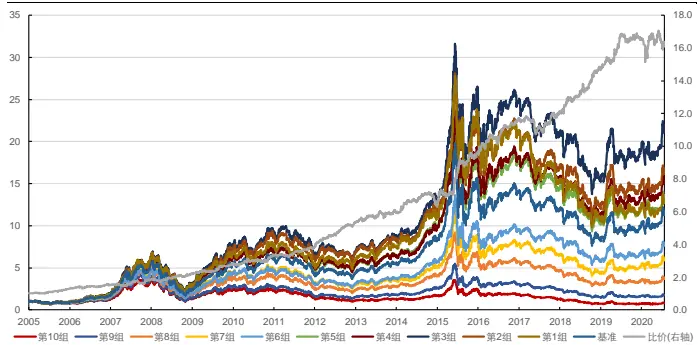
资料来源：天软科技，长江证券研究所

图 14：中证 800 均匀分布主动占比因子回测净值
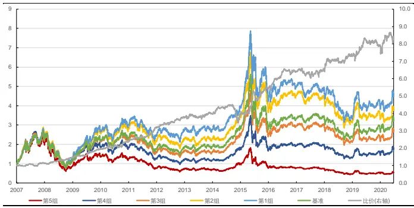
资料来源：天软科技，长江证券研究所

表 6：均匀分布主动占比因子分年风险指标

| 全A股 |  |  |  |  |  | 中证800 |  |  |
| --- | --- | --- | --- | --- | --- | --- | --- | --- |
|  | 超额收益(%) | 信息比 | 多空收益(%) | 多空夏普比 | 超额收益(%) | 信息比 | 多空收益(%) | 多空夏普比 |
| 2005 | 8.21 | 1.29 | 29.67 | 3.00 |  |  |  |  |
| 2006 | 0.71 | 0.16 | 15.81 | 1.67 |  |  |  |  |
| 2007 | 8.46 | 0.95 | 23.57 | 1.62 | 4.34 | 0.69 | 14.39 | 1.23 |
| 2008 | 2.52 | 0.54 | 19.04 | 1.68 | 5.15 | 0.97 | 26.42 | 2.42 |
| 2009 | 1.73 | 0.45 | 25.54 | 2.66 | 11.05 | 2.03 | 33.34 | 3.23 |
| 2010 | 0.77 | 0.15 | 18.72 | 1.56 | 4.87 | 0.75 | 21.84 | 1.61 |
| 2011 | -0.29 | -0.21 | 17.36 | 2.10 | 7.83 | 1.85 | 30.07 | 3.57 |
| 2012 | 8.91 | 1.83 | 38.27 | 4.32 | 7.96 | 1.60 | 22.36 | 2.55 |
| 2013 | 1.50 | 0.39 | 11.85 | 1.44 | -0.23 | 0.05 | 7.89 | 0.88 |
| 2014 | -4.10 | -0.82 | 6.29 | 0.78 | -13.47 | -2.76 | -14.68 | -1.31 |
| 2015 | 15.19 | 2.04 | 51.67 | 3.14 | 18.23 | 2.27 | 60.49 | 3.38 |
| 2016 | -0.66 | -0.18 | 21.73 | 2.65 | 0.78 | 0.25 | 17.65 | 2.34 |
| 2017 | -14.36 | -2.44 | 2.76 | 0.43 | -7.22 | -1.71 | -0.75 | 0.03 |
| 2018 | -0.15 | 0.04 | 21.76 | 2.99 | -0.02 | 0.09 | 14.03 | 1.57 |
| 2019 | -5.63 | -1.47 | 13.21 | 1.93 | 2.15 | 0.68 | 8.13 | 1.06 |
| 2020 | -8.71 | -1.66 | -5.05 | -0.60 | -4.96 | -1.09 | 2.42 | 0.42 |
| 总计 | 0.68 | 0.13 | 20.15 | 1.90 | 2.49 | 0.45 | 17.47 | 1.55 |

资料来源：天软科技，长江证券研究所

## 各分布下主动占比因子整体风险指标

下表中给出了各个分布因子全时间段的风险指标：

从因子 IC 和 ICIR 上看，置信正态和均匀占比因子对收益率预测能力最强，朴素占比因子次之，标准正态和 T 分布占比因子预测能力较弱；

从超额收益和多空收益的获取上看，各个分布因子的排序和IC及ICIR相对一致。

表 7：各分布占比因子整体风险指标

| 全A股 |  |  |  |  |  |  | 中证800 |  |  |  |
| --- | --- | --- | --- | --- | --- | --- | --- | --- | --- | --- |
|  | 朴素 | T分布 | 标准正态 | 置信正态 | 均匀 | 朴素 | T分布 | 标准正态 | 置信正态 | 均匀 |
| IC | -5.78% | -5.35% | -5.27% | -7.22% | -7.30% | -5.17% | -4.68% | -4.50% | -6.43% | -6.51% |
| ICIR | -63.35% | -50.71% | -49.63% | -78.64% | -81.53% | -45.45% | -35.84% | -34.22% | -55.49% | -57.31% |
| 超额收益(%) | -1.09 | -1.85 | -1.66 | 0.28 | 0.68 | 0.90 | 0.43 | 0.43 | 2.68 | 2.49 |
| 信息比 | -0.17 | -0.28 | -0.25 | 0.07 | 0.13 | 0.20 | 0.11 | 0.11 | 0.48 | 0.45 |
| 多空收益(%) | 17.00 | 14.96 | 15.11 | 20.12 | 20.15 | 13.83 | 12.33 | 12.31 | 17.46 | 17.47 |
| 多空夏普比 | 1.81 | 1.37 | 1.37 | 1.84 | 1.90 | 1.39 | 1.11 | 1.10 | 1.53 | 1.55 |

资料来源：天软科技，长江证券研究所

## 主动买卖的思考

## 主动买卖的非线性

从上述分布因子的回测中可以发现，选股可以获得较为稳定的多空收益，但超额收益获取能力有限，主要问题在于因子选股的头部组排序非线性，全市场中第 2 组表现最好，在中证 800 中第 1 组和第 2 组无明显区分，原因和反转因子回测分组净值排序类似，即股票的价格变动往往可分为两种属性：

市场过度反应，个股价格偏离价值，存在超跌反弹或补涨逻辑；

- 市场未过度反应，个股价格接近价值，价格变动空间较小。

头部组的个股是过去空头力量明显占优的部分，对于组内价格接近价值的个股，相比于后几组其未来价格将受到更大压制，这也是为什么因子分组在头部排序非线性的原因。

在《高频因子（二）：结构化反转因子》中，我们从每个个股自身出发，以某个成交量阈值划分价格变动的动量及反转效应，给出因子分组排序的头部组线性改进，这是因为以价为主、量为辅衡量价格偏离价值时，价格变动从结果上展示了个股价格偏离价值的幅度，量侧面衡量价格变动的特性，且量在局部存在自身时间序列上的可比性。

而主动成交占比因子以总量中买卖相对比例衡量价格偏离价值的幅度，以价格变动幅度估计每个时间段主动买卖占比结构，即量的确认本身即用到了价格的变动信息，很难对个股在自身维度给出改进。但在截面上仍然可以从主动买入占比越低其未来价格将受到更大压制的角度，以非线性映射的角度改进因子。

线性分段函数假设头部组的因子排序变化存在等距效应，故以 10%分位数为临界点，大于临界点的因子保持原值，小于临界点的因子值反向排序，即函数表达式如下，曲线如下图所示：

$$
y=\bigl\{\begin{array}{ll}{x}&{\qquad x\geq0.1}\\{0.2-x}&{\quad x<0.1}\end{array}\bigr.
$$

图 15：线性分段函数变换
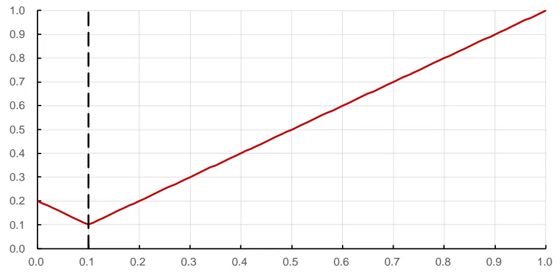
资料来源：长江证券研究所

下图分别以置信正态因子为例，展示了改进后的因子 2005 年以来在全市场及中证 800内表现，并在下表中给出了不同分布映射下因子回测的风险指标，可以看到：

- 在全市场和中证 800 内，因子的分组基本呈现线性；

- 各个因子在超额收益和多空收益上均有一定增强。

图 16：全市场线性分段置信正态分布主动占比因子回测净值
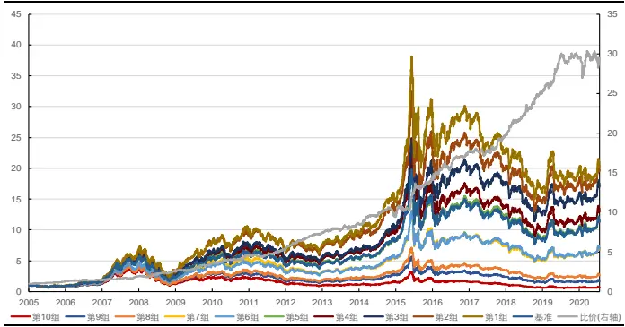
资料来源：天软科技，长江证券研究所

图 17：中证 800线性分段置信正态分布主动占比因子回测净值
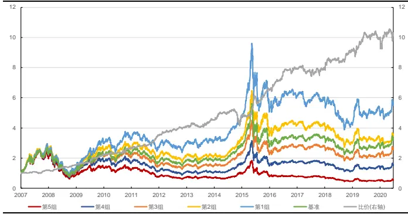
资料来源：天软科技，长江证券研究所

表 8：线性分段置信正态分布主动占比因子分年风险指标

| 全A股 |  |  |  |  |  |  | 中证800 |  |  |  |
| --- | --- | --- | --- | --- | --- | --- | --- | --- | --- | --- |
|  | 朴素 | T分布 | 标准正态 | 置信正态 | 均匀 | 朴素 | T分布 | 标准正态 | 置信正态 | 均匀 |
| IC | -6.60% | -6.14% | -6.04% | -8.15% | -8.19% | -5.94% | -5.40% | -5.20% | -7.26% | -7.31% |
| ICIR | -84.03% | -67.11% | -65.15% | -100.58% | -103.28% | -56.02% | -44.31% | -42.19% | -66.27% | -67.94% |
| 超额收益(%) | 1.57 | 0.86 | 0.87 | 3.92 | 3.68 | 2.63 | 2.03 | 1.70 | 4.13 | 4.06 |
| 信息比 | 0.34 | 0.19 | 0.19 | 0.81 | 0.77 | 0.56 | 0.43 | 0.36 | 0.83 | 0.83 |
| 多空收益(%) | 21.14 | 18.84 | 18.84 | 24.97 | 24.38 | 16.61 | 14.57 | 13.79 | 19.28 | 19.45 |
| 多空夏普比 | 2.42 | 1.84 | 1.83 | 2.35 | 2.35 | 1.74 | 1.38 | 1.30 | 1.76 | 1.80 |

资料来源：天软科技，长江证券研究所

对勾函数是一种较为常见的非线性函数，并且可以很好地适应主动成交占比因子的头部非线性排序，本文以 10%作为对勾函数的极小值点，并保证大于 10%的部分和原因子尽量保持一致。函数表达式如下，曲线如下图所示：

$$
y=\frac{0.01}{0.99x+0.01}+0.99x+0.01
$$

图 18：对勾函数变换
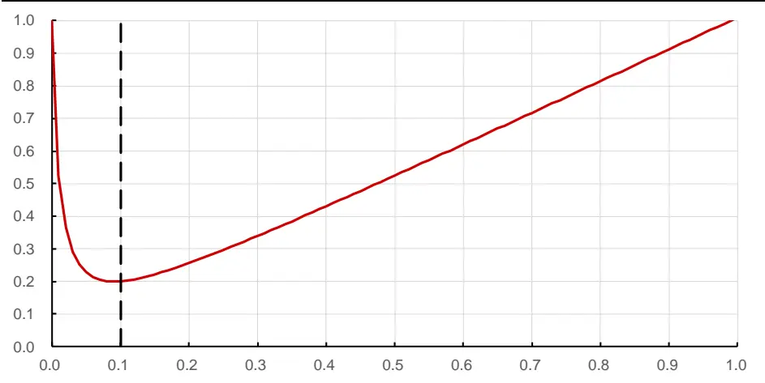
资料来源：长江证券研究所

下图分别以置信正态因子为例，展示了改进后的因子 2005 年以来在全市场及中证 800内表现，并在下表中给出了不同分布映射下因子回测的风险指标，可以看到，各个因子在超额收益和多空收益上改进效果不大。

图 19：全市场对勾置信正态分布主动占比因子回测净值
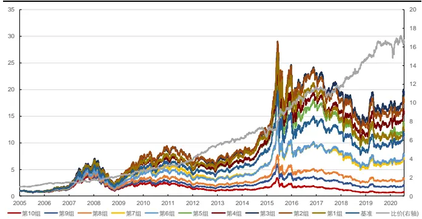
资料来源：天软科技，长江证券研究所

图 20：中证 800对勾置信正态分布主动占比因子回测净值
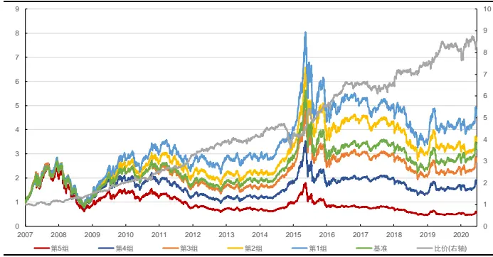
资料来源：天软科技，长江证券研究所

表 9：对勾置信正态分布主动占比因子分年风险指标

| 全A股 |  |  |  |  |  |  | 中证800 |  |  |  |
| --- | --- | --- | --- | --- | --- | --- | --- | --- | --- | --- |
|  | 朴素 | T分布 | 标准正态 | 置信正态 | 均匀 | 朴素 | T分布 | 标准正态 | 置信正态 | 均匀 |
| IC | -5.59% | -5.35% | -5.27% | -7.30% | -7.37% | -4.99% | -4.73% | -4.54% | -6.47% | -6.53% |
| ICIR | -60.75% | -50.78% | -49.63% | -79.49% | -82.18% | -43.79% | -36.25% | -34.62% | -55.99% | -57.45% |
| 超额收益(%) | -1.54 | -1.76 | -1.62 | 0.38 | 0.78 | 0.65 | 0.51 | 0.48 | 2.73 | 2.40 |
| 信息比 | -0.25 | -0.26 | -0.24 | 0.09 | 0.15 | 0.15 | 0.12 | 0.12 | 0.49 | 0.44 |
| 多空收益(%) | 15.83 | 15.14 | 15.12 | 20.32 | 20.31 | 13.15 | 12.41 | 12.36 | 17.53 | 17.35 |
| 多空夏普比 | 1.70 | 1.38 | 1.37 | 1.86 | 1.92 | 1.33 | 1.12 | 1.11 | 1.54 | 1.54 |

资料来源：天软科技，长江证券研究所

## 风格中性后表现

主动成交占比因子仍从价格偏离价值的角度出发，收益来源仍然为市场中存在的交易行为，故其和量价因子相关性较高，下表以置信正态和均匀因子为例，展示了其和风格因子的相关性，可以看到其和反转因子、波动率因子的相关性较高。

表 10：主动成交占比因子和风格因子相关性

|  | 分红 | 盈利 | 价值 | 成长 | 规模 | 非线性市值 | 反转 | 流动性 | 波动率 |
| --- | --- | --- | --- | --- | --- | --- | --- | --- | --- |
| 置信正态 | -12.67% | -8.27% | -16.83% | -2.34% | -1.21% | -4.94% | 41.63% | -8.01% | 30.01% |
| 均匀 | -12.85% | -8.66% | -17.22% | -2.62% | -1.80% | -4.89% | 41.81% | -7.92% | 30.44% |
| 置信正态分段 | -15.03% | -10.29% | -20.05% | -3.84% | -1.85% | -4.67% | 43.95% | -9.81% | 34.53% |
| 均匀分段 | -14.99% | -10.54% | -20.14% | -4.01% | -2.41% | -4.63% | 43.87% | -9.59% | 34.64% |
| 置信正态对勾 | -12.74% | -8.35% | -16.98% | -2.41% | -1.22% | -4.85% | 41.72% | -8.04% | 30.38% |
| 均匀对勾 | -12.94% | -8.78% | -17.39% | -2.70% | -1.83% | -4.82% | 41.88% | -7.97% | 30.83% |

资料来源：天软科技，长江证券研究所

下图分别以置信正态因子为例，展示了和风格因子中性后，2005 年以来在全市场及中证 800 内表现，并在下表中给出了不同分布映射下因子回测的风险指标，可以看到：

- 因子在超额收益和多空收益上有较大衰减；

因子在空头端仍有较高信息保留，在全市场和中证800内多空净值曲线相对稳定。

图 21：全市场置信正态分布主动占比因子中性后回测净值
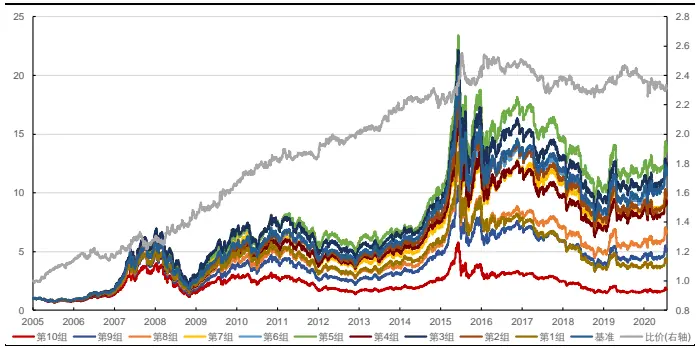
资料来源：天软科技，长江证券研究所

图 22：中证 800置信正态分布主动占比因子中性后回测净值
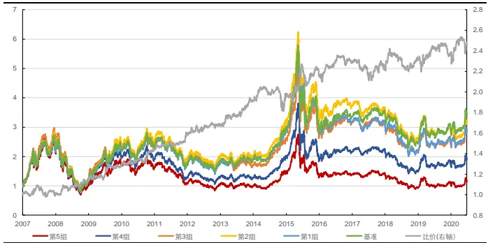
资料来源：天软科技，长江证券研究所

表 11：分布主动占比因子中性分年风险指标

| 全A股 |  |  |  |  |  |  |  |  |  |  |  |
| --- | --- | --- | --- | --- | --- | --- | --- | --- | --- | --- | --- |
| 置信正态 |  | 置信正态分段 置信正态对勾 |  | 均匀 | 均匀分段 | 均匀对勾 | 置信正态 置信正态分段 | 置信正态对勾 | 中证800 均匀 | 均匀分段 | 均匀对勾 |
| IC | -2.70% | -2.71% | -2.67% | -2.41% | -2.43% | -2.39% | -2.91% | -2.92% -2.87% | -2.66% | -2.66% | -2.61% |
| ICIR | -56.53% | -56.71% | -56.34% | -55.09% | -55.20% | -54.89% | -41.62% -41.73% | -41.28% | -40.38% | -40.47% | -39.82% |
| 超额收益 | -6.68 | -6.61 | -7.00 | -7.49 | -7.46 | -7.80 | -1.23 -1.20 | -1.37 | -1.44 | -1.50 | -1.61 |
| 信息比 | -1.49 | -1.47 | -1.56 | -1.67 | -1.66 | -1.72 | -0.26 -0.26 | -0.29 | -0.31 | -0.33 | -0.35 |
| 多空收益 | 5.63 | 5.60 | 5.48 | 3.31 | 3.39 | 3.13 | 7.17 7.30 | 7.19 | 6.44 | 6.39 | 6.19 |
| 多空夏普比 | 0.87 | 0.86 | 0.85 | 0.55 | 0.57 | 0.52 | 0.92 0.94 | 0.93 | 0.86 | 0.85 | 0.83 |

资料来源：天软科技，长江证券研究所

## 总结

主动成交买卖的划分多以价格变动方向为基础。当价格增加时，市场为卖方市场，买方不得不提高价格以促成交易，此时成交由买方驱动，反之当价格降低时，成交由卖方驱动。博弈因子以逐笔成交数据为基础，从挂单数据出发，当前成交价大于上一笔买一价时，成交量划分为主动买入，当前成交价小于上一笔卖一价时，成交量划分为主动卖出。资金流向因子以时间聚合 k 线数据为基础，从收盘价数据出发，当前收盘价大于上一期收盘价时，成交量划分为主动买入，当前收盘价小于上一期收盘价时，成交量划分为主动卖出。博弈因子和资金流向因子均有一定的选股能力。

批量成交划分法是一种以时间聚合 k线数据为基础的主动买卖划分方法。批量成交划分法继承了以价格变动方向划分主动买卖的思想，并引入价格变动幅度对买卖占比的影响，即价格变动越大，买卖驱动力量越大，主动买卖所占比例越高，在每个时段做价格变动到主买占比的映射。以批量成交法构建的主动占比因子有一定选股能力。

满足价格变动幅度越大主动买卖占比越大的函数均可以估计主动买卖。以标准化收益率、收益率分位为自变量，以t分布、正态分布和均匀分布为对应法则估计主动买入量，以主动买入量占总成交量比例，构建主动成交占比因子，在全市场和中证 800 内均有较强的选股能力，其中以收益率分位为自变量、以正态分布和均匀分布为对应法则构建的因子表现更为稳定，全市场因子 IC 和 ICIR 分别达到-7.22%、-78.64%和-7.30%、-81.53%，中证 800 内 IC 和 ICIR 分别达到-6.43%、-55.49%和-6.51%、-57.31%。

主动成交占比因子头部排序有一定的非线性效应。截面上主动买入占比越低其未来价格将受到更大压制，分别以分段线性函数和对勾函数非线性映射改进因子，在全市场因子·IC 和 ICIR 进一步达到-8.15%、-100/58%和-8.19%、-103.28%，中证 800 内 IC 和ICIR 达到-7.26%、-66.27%和-7.31%、-67.94%。

主动成交占比因子在剔除风格因子线性影响后，信息主要集中在空头组。主动成交占比因子收益来源仍然为市场中存在的交易行为，和反转因子、波动率因子的相关性较高，在做风格因子中性后，失去超额收益能力，但仍然可以获得多空收益。

## 投资评级说明

行业评级 报告发布日后的 12 个月内行业股票指数的涨跌幅相对同期沪深 300 指数的涨跌幅为基准，投资建议的评级标准为：

好： 相对表现优于市场

中性： 相对表现与市场持平

看 淡： 相对表现弱于市场

公司评级 报告发布日后的 12 个月内公司的涨跌幅相对同期沪深 300 指数的涨跌幅为基准，投资建议的评级标准为：

买 入： 相对大盘涨幅大于 10%

增 持： 相对大盘涨幅在 5%～10%之间

中 性： 相对大盘涨幅在-5%～5%之间

减 持： 相对大盘涨幅小于-5%

无投资评级： 由于我们无法获取必要的资料，或者公司面临无法预见结果的重大不确定性事件，或者其他原因，致使我们无法给出明确的投资评级。

相关证券市场代表性指数说明：A 股市场以沪深 300 指数为基准；新三板市场以三板成指（针对协议转让标的）或三板做市指数（针对做市转让标的）为基准；香港市场以恒生指数为基准。

## 办公地址:

[Tab上海

Add /浦东新区世纪大道 1198号世纪汇广场一座 29 层P.C /（200122）

武汉

Add /武汉市新华路特8 号长江证券大厦 11 楼P.C /（430015）

北京

Add /西城区金融街 33 号通泰大厦 15 层

深圳

P.C /（100032）

Add /深圳市福田区中心四路1号嘉里建设广场 3 期 36 楼P.C /（518048）

## 分析师声明：

作者具有中国证券业协会授予的证券投资咨询执业资格并注册为证券分析师，以勤勉的职业态度，独立、客观地出具本报告。分析逻辑基于作者的职业理解，本报告清晰准确地反映了作者的研究观点。作者所得报酬的任何部分不曾与，不与，也不将与本报告中的具体推荐意见或观点而有直接或间接联系，特此声明。

## 重要声明：

长江证券股份有限公司具有证券投资咨询业务资格，经营证券业务许可证编号：10060000。

本报告仅限中国大陆地区发行，仅供长江证券股份有限公司（以下简称：本公司）的客户使用。本公司不会因接收人收到本报告而视其为客户。本报告的信息均来源于公开资料，本公司对这些信息的准确性和完整性不作任何保证，也不保证所包含信息和建议不发生任何变更。本公司已力求报告内容的客观、公正，但文中的观点、结论和建议仅供参考，不包含作者对证券价格涨跌或市场走势的确定性判断。报告中的信息或意见并不构成所述证券的买卖出价或征价，投资者据此做出的任何投资决策与本公司和作者无关。

本报告所载的资料、意见及推测仅反映本公司于发布本报告当日的判断，本报告所指的证券或投资标的的价格、价值及投资收入可升可跌，过往表现不应作为日后的表现依据；在不同时期，本公司可以发出其他与本报告所载信息不一致及有不同结论的报告；本报告所反映研究人员的不同观点、见解及分析方法，并不代表本公司或其他附属机构的立场；本公司不保证本报告所含信息保持在最新状态。同时，本公司对本报告所含信息可在不发出通知的情形下做出修改，投资者应当自行关注相应的更新或修改。

本公司及作者在自身所知情范围内，与本报告中所评价或推荐的证券不存在法律法规要求披露或采取限制、静默措施的利益冲突。

本报告版权仅为本公司所有，未经书面许可，任何机构和个人不得以任何形式翻版、复制和发布。如引用须注明出处为长江证券研究所，且不得对本报告进行有悖原意的引用、删节和修改。刊载或者转发本证券研究报告或者摘要的，应当注明本报告的发布人和发布日期，提示使用证券研究报告的风险。未经授权刊载或者转发本报告的，本公司将保留向其追究法律责任的权利。