# 高频因子（八）：高位成交因子一从量价匹配说起

分析师及联系人

[Table_● 覃川桃 (8621)61118766 qinct@cjsc.com.cn 执业证书编号： S0490513030001 ● 郑起 (8621)61118706 zhengqi2@cjsc.com 执业证书编号： S0490520060001报告日期 2020-09-16

金融工程专题报告

## 相关研究

《• 机构重仓行业偏好及因子暴露》2020-08-21

- 《行业选择（三）：如何通过量化手段向优秀的行业配置型基金学习》2020-08-15

- 《高频因子（七）：分布估计下的主动成交占比》2020-08-03

基础因子研究（十三）

# 高频因子（八）：高位成交因子——从量价匹配说起

## 高位成交因子目的在于刻画个股在高位和低位成交的密集水平[Table_Summary]

高位成交较多的个股，交易行为中存在羊群效应，导致局部价格高估而在未来呈现反转效应，反之如果个股低位成交较多，存在低位加仓的现象，未来价格有较大相对上行空间。以时间序列上成交量和收盘价相关性构建量价相关性因子，衡量成交量和股价之间的趋同或背离程度，趋同程度高则高位成交多，因子在全市场和中证 800 内，剥离风格因子线性影响前后均有一定选股能力。

## 加权收盘价比从成交量加权平均价格偏离平均价格的角度刻画成交密集

当价格高位成交多于价格低位成交时，成交量加权平均价格大于平均价格，且成交在高位越集中，差距越大，故以成交量加权平均收盘价同平均收盘价的比值构建加权收盘价比因子，因子在全市场和中证 800 内，均有一定的选股能力，剥离风格因子线性影响后选股能力有所下降。

## 加权偏度从考虑成交量对价格分布的影响得到的偏度刻画成交密集

假设每个时间段成交量相等，则价格的偏度刻画了价格分布相对平均值不对称的程度，偏度大于 0 意味着大于价格均值的价格比小于价格均值的价格少，成交集中在价格低位。但成交量在每个时刻并非完全相等，成交量较高的时间段本身应该在计算偏度时占有更大比例，故以成交量加权的价格偏度构建加权偏度因子，因子在全市场和中证800 内，剥离风格因子线性影响前后均有一定选股能力。

## 成交额熵从不同时间段成交额状态描述的体系混乱程度刻画成交密集

加权收盘价比其实是将成交量和收盘价做权重化处理后，从排序不等式的角度刻画成交体系的混乱程度，成交量和收盘价相乘即为成交额，故以成交额为状态描述，以信息熵为标准刻画体系混乱程度，构建成交额熵因子。其中单位一成交额占比熵因子在全市场和中证 800 内，剥离风格因子线性影响前后均有一定选股能力。成交额占比熵因子在全市场和中证 800 内，均有一定的选股能力，剥离风格因子线性影响后选股能力有所下降。

## 合成后的高位成交因子在风格中性前后均有较强的选股能力

本文以风格中性后仍保留较多信息的因子，即量价相关性、加权偏度和单位一成交额占比熵因子等权求和作为合成因子，在全市场和中证 800 内，剥离风格因子线性影响前后均有一定选股能力。

## 风险提示：[Table_

1. 模型存在失效风险；

2. 本文举例均基于历史数据，不保证未来收益。

成交上看，个股的价格变动和成交量往往存在联动的特点，放量时往往上涨，缩量时往往下跌，量价匹配的一致性可以衡量个股交易上的异常情况或交易特点，以此对个股给出区分。

## 量价相关性因子

在负向 alpha 系列报告《如何利用负面因子做指数增强？——高频因子篇》中，我们提出了以每个时间段内成交量和收盘价的相关性构建量价相关性因子，衡量成交量和股价之间的趋同或背离程度，趋同程度高（即价格高时成交量高，价格低时成交量低）反映了股票交易行为中存在着羊群效应，从而进一步导致了短期的过度反应和随后的收益反转效应，因子构建方法如下：

$$
量价相关性因子=Corr(\{vol_t\},\{close_t\})
$$

其中vol 为每个时间段的成交量，close 为每个时间段的收盘价。

下图分别展示了该因子自 2005 年以来在全市场及中证 800 内表现，并在下表中给出了其分年风险指标，可以看到：

全历史时间段，因子在全市场和中证 800 内均可以获得一定的超额收益和多空收益，因子选股的分组线性较好，从多空净值曲线上看，因子在全 A 中表现稳定，中证 800 内有一段时间的回撤，但近些年仍有一定的多空收益；

- 分年来看，因子在近些年超额收益产生一定波动，多空收益仍较稳定。

图 1：全市场量价相关性因子回测净值
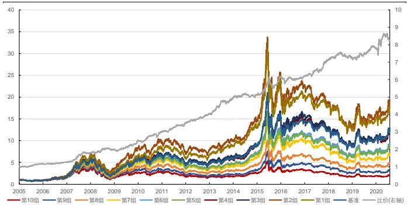
资料来源：天软科技，长江证券研究所

图 2：中证 800 量价相关性因子回测净值
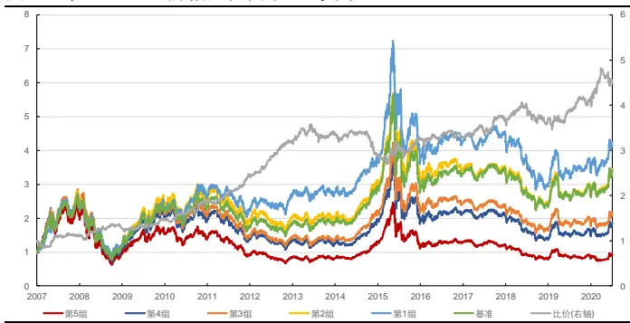
资料来源：天软科技，长江证券研究所

表 1：量价相关性因子分年风险指标

| 全市场 |  |  |  |  |  | 中证800 |  |  |
| --- | --- | --- | --- | --- | --- | --- | --- | --- |
|  | 超额收益(%) | 信息比 | 多空收益(%) | 多空夏普比 | 超额收益(%) | 信息比 | 多空收益(%) | 多空夏普比 |
| 2005 | 15.26 | 2.30 | 41.32 | 3.63 |  |  |  |  |
| 2006 | -0.01 | 0.40 | 9.90 | 1.43 |  |  |  |  |
| 2007 | 5.93 | 0.56 | 21.75 | 1.30 | 1.49 | 0.33 | 12.74 | 1.12 |
| 2008 | 7.20 | 0.86 | 18.18 | 1.39 | 9.65 | 1.35 | 21.13 | 1.80 |
| 2009 | -9.64 | -1.11 | 4.67 | 0.56 | -5.56 | -0.74 | 9.11 | 0.93 |
| 2010 | 8.93 | 1.22 | 26.66 | 2.40 | 10.48 | 1.49 | 25.81 | 2.35 |
| 2011 | 4.67 | 0.91 | 21.97 | 2.45 | 9.05 | 2.07 | 26.11 | 3.42 |
| 2012 | 7.87 | 1.90 | 24.78 | 3.16 | 16.37 | 4.27 | 35.20 | 4.67 |
| 2013 | 5.09 | 0.98 | 19.65 | 1.97 | -0.15 | 0.09 | 5.25 | 0.70 |
| 2014 | -7.52 | -1.73 | -3.75 | -0.42 | -11.42 | -2.73 | -11.72 | -1.45 |
| 2015 | -3.73 | -0.21 | 7.19 | 0.66 | -0.87 | 0.04 | 9.03 | 0.81 |
| 2016 | -6.56 | -1.42 | -1.26 | -0.23 | 0.67 | 0.23 | 4.58 | 0.68 |
| 2017 | 2.90 | 0.78 | 17.63 | 2.16 | 1.89 | 0.58 | 11.36 | 1.56 |
| 2018 | 1.47 | 0.40 | 14.78 | 1.98 | -5.47 | -0.94 | -2.90 | -0.19 |
| 2019 | -1.10 | 0.00 | 15.32 | 2.32 | 0.03 | 0.15 | 9.62 | 1.28 |
| 2020 | 1.17 | 0.31 | 14.87 | 1.75 | -1.02 | -0.11 | 11.83 | 1.52 |
| 总计 | 1.91 | 0.29 | 16.43 | 1.48 | 1.67 | 0.30 | 12.22 | 1.19 |

资料来源：天软科技，长江证券研究所

## 高位成交因子

从量价相关性因子的回测结果上看，两者相关性越高的个股未来表现越差，即高位成交较多的个股会因交易中羊群效应的影响，存在高估的可能，所以如何刻画个股在高位和低位成交的密集水平，是构建高位成交这一类因子的核心问题。

## 加权收盘价比

当成交在价格高位较为活跃时，成交量较高，则在成交量相等聚集的量价 k 线下，价格平均水平将高于在时间相等聚集量价 k 线下的价格平均水平，所以一种最直接刻画个股在高位成交密度的方法，即通过时间相等聚集的 k 线下成交量加权的收盘价占比：

如果各个时间段个股的成交量均相等，个股在各个价位的成交量较为均匀，则收盘价成交量加权求和与收盘价等权求和相等；

当收盘价较高的区间内成交量较高时，个股成交集中在价格高位，成交量加权的收盘价求和将大于收盘价等权求和，且成交量和收盘价的趋同程度越高，这种差距越大。

故可以将成交量加权的收盘价求和同收盘价等权求和的比值，作为个股在高位成交密集水平的刻画，构建加权收盘价比因子：

$$
加权收盘价比=\frac{\sum_{t=1}^{T}\frac{vol_{t}}{VolL}close_{t}}{\frac{\sum_{t=1}^{T}close_{t}}{T}}
$$

其中 $\begin{array}{r}{VOL=\sum_{t=1}^{T}vol_{t}}\end{array}$ 为整个时间段总成交量，T为划分时间段个数。

下图分别展示了该因子自 2005 年以来在全市场及中证 800内表现，并在下表中给出了其分年风险指标，可以看到：

全历史时间段，因子在全市场和中证 800 内均可以获得一定的超额收益和多空收益，因子选股的分组线性较好，从多空净值曲线上看，因子在全市场和中证 800 内表现均较稳定；

分年来看，因子超额收益能力在全市场范围内近些年较为稳定，在中证 800 范围内产生一定波动，多空收益全时间段均较为稳定。

图 3：全市场加权收盘价比因子回测净值
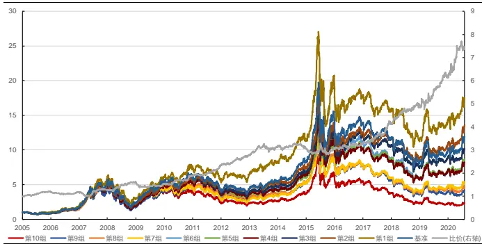
资料来源：天软科技，长江证券研究所

图 4：中证 800 加权收盘价比因子回测净值
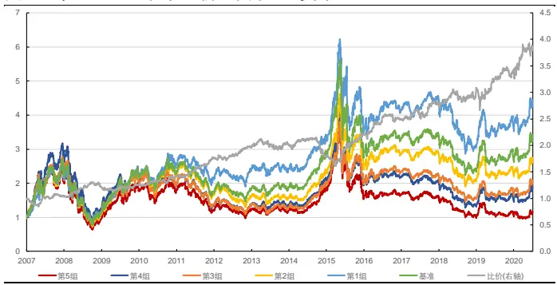
资料来源：天软科技，长江证券研究所

表 2：加权收盘价比因子分年风险指标

| 全市场 |  |  |  |  |  | 中证800 |  |  |
| --- | --- | --- | --- | --- | --- | --- | --- | --- |
|  | 超额收益(%) | 信息比 | 多空收益(%) | 多空夏普比 | 超额收益(%) | 信息比 | 多空收益(%) | 多空夏普比 |
| 2005 | 16.33 | 2.52 | 20.29 | 2.55 |  |  |  |  |
| 2006 | -4.66 | -0.52 | -2.64 | -0.11 |  |  |  |  |
| 2007 | 0.07 | 0.10 | 7.55 | 0.68 | -4.45 | -0.41 | 4.17 | 0.53 |
| 2008 | 16.38 | 1.95 | 30.02 | 2.62 | 12.62 | 1.82 | 25.11 | 2.82 |
| 2009 | -12.27 | -1.53 | -5.66 | -0.41 | -4.79 | -0.63 | -3.54 | -0.29 |
| 2010 | 7.96 | 1.18 | 22.84 | 2.50 | 6.96 | 1.19 | 11.47 | 1.48 |
| 2011 | 8.55 | 1.73 | 22.90 | 3.16 | 10.33 | 2.41 | 23.01 | 3.70 |
| 2012 | 10.73 | 2.34 | 19.60 | 2.55 | 9.70 | 2.32 | 14.53 | 2.11 |
| 2013 | 2.24 | 0.52 | 12.47 | 1.46 | -2.55 | -0.37 | 2.54 | 0.38 |
| 2014 | -8.54 | -1.98 | -1.88 | -0.17 | -9.91 | -2.14 | -10.72 | -1.09 |
| 2015 | -2.57 | -0.11 | 1.25 | 0.24 | 5.23 | 0.66 | 22.03 | 1.75 |
| 2016 | -3.96 | -0.85 | 4.57 | 0.69 | 3.19 | 0.65 | 14.49 | 1.63 |
| 2017 | 5.02 | 1.23 | 26.73 | 2.57 | 4.56 | 1.08 | 11.16 | 1.25 |
| 2018 | 4.55 | 0.97 | 21.16 | 2.32 | -1.62 | -0.17 | 6.62 | 0.85 |
| 2019 | 1.78 | 0.53 | 24.33 | 2.16 | 1.33 | 0.37 | 11.15 | 1.04 |
| 2020 | 2.11 | 0.45 | 18.10 | 2.36 | -1.62 | -0.21 | 13.94 | 1.81 |
| 总计 | 2.59 | 0.39 | 14.20 | 1.45 | 2.02 | 0.35 | 10.77 | 1.10 |

资料来源：天软科技，长江证券研究所

## 加权偏度

偏度是一种直接刻画数据分布偏斜方向和程度的度量，是统计数据分布非对称程度的数字特征。假设每个时间段成交量均相等，则价格的偏度即刻画了整个时间段价格相比平均值不对称的程度，当偏度大于 0 时，大于价格均值的价格比小于价格均值的价格少，个股成交集中在价格相对较低的水平，反之当偏度小于 0 时，个股成交集中在价格相对较高水平。问题在于每个时刻的成交量并非完全相等，成交量较高的时间段本身应该在计算偏度时占有更大比例。故本节以成交量加权的方式计算过去一段时间价格分布的偏离程度，如果负偏态越明显，则个股在价格高位成交越多：

$$
加权偏度=\frac{\sum_{t=1}^{T}w_{t}(close_{t}-\overline{close})^{3}}{close_{\sigma}^{3}}
$$

其中 $\begin{array}{r}{w_{t}=\frac{vol_{t}}{VOL}.}\end{array}$ 为正比于成交量的权重，close̅̅̅̅̅̅̅为个股收盘价均值， $close_{\sigma}$ 为个股收盘价标准差。

下图分别展示了该因子自 2005 年以来在全市场及中证 800内表现，并在下表中给出了其分年风险指标，可以看到：

全历史时间段，因子在全市场和中证 800 内均可以获得一定的超额收益和多空收益，因子选股的分组线性较好，从多空净值曲线上看，因子在全市场和中证 800 内表现均较稳定；

分年来看，因子超额收益能力在全市场和中证 800 范围内近些年均产生了一定回撤，多空收益全时间段均较为稳定。

图 5：全市场加权偏度因子回测净值
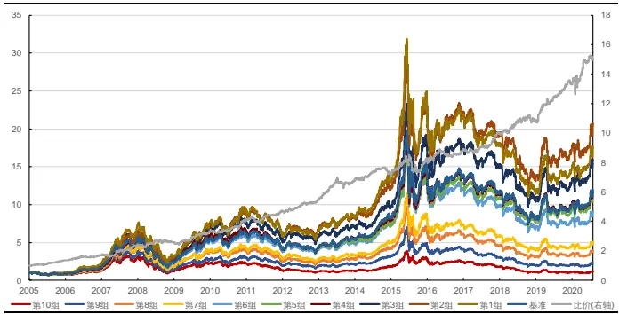
资料来源：天软科技，长江证券研究所

图 6：中证 800加权偏度因子回测净值
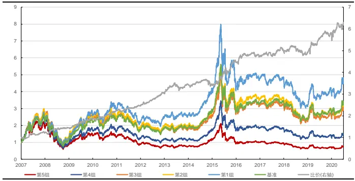
资料来源：天软科技，长江证券研究所

表 3：加权偏度因子分年风险指标

| 全市场 中证800 |  |  |  |  |  |  |
| --- | --- | --- | --- | --- | --- | --- |
| 超额收益(%) | 信息比 | 多空收益(%) | 多空夏普比 | 超额收益(%) | 信息比 | 多空收益(%) 多空夏普比 |
| 2005 | 14.68 2.59 | 38.12 | 3.95 |  |  |  |
| 2006 9.92 | 2.08 | 23.30 | 2.99 |  |  |  |
| 2007 4.94 | 0.60 | 38.44 | 2.46 | 3.57 | 0.67 23.87 | 2.29 |
| 2008 2.43 | 0.33 | 9.34 | 0.80 | 6.83 | 1.16 16.17 | 1.68 |
| 2009 2.94 | 0.53 | 29.49 | 2.97 | 7.68 | 1.39 30.32 | 3.26 |
| 2010 7.70 | 1.25 | 23.30 | 2.45 | 8.02 | 1.54 17.46 | 2.11 |
| 2011 -2.16 | -0.42 | 14.95 | 2.11 | 0.41 | 0.24 12.90 | 2.15 |
| 2012 0.58 | 0.23 | 16.15 | 2.64 | 5.76 | 1.78 23.40 | 3.71 |
| 2013 4.90 | 1.24 | 23.09 | 2.60 | 1.72 | 0.54 11.40 | 1.48 |
| 2014 1.72 | 0.58 | 4.97 | 0.80 | 1.22 | 0.39 -0.95 | -0.06 |
| 2015 | 1.93 0.28 | 16.72 | 1.35 | 5.54 | 0.74 34.23 | 2.76 |
| 2016 -2.40 | -0.52 | 7.13 | 1.22 | -2.42 | -0.61 5.78 | 0.95 |
| 2017 | -1.64 -0.33 | 12.70 | 2.38 | -2.66 | -0.74 6.53 | 1.23 |
| 2018 | -7.04 -1.45 | 8.29 | 1.22 | -5.82 | -1.26 -5.55 | -0.64 |
| 2019 | 4.17 1.34 | 23.16 | 3.49 | 5.56 | 1.38 17.26 | 2.20 |
| 2020 | -0.72 -0.06 | 12.27 | 1.55 | 0.33 | 0.15 | 1.50 |
| 总计 | 2.66 0.44 | 19.74 | 2.02 | 2.66 | 0.52 | 10.92 15.16 1.71 |

资料来源：天软科技，长江证券研究所

## 成交额熵

加权收盘价比可以进行如下变换：

$$
\frac{\sum_{t=1}^{T}\frac{vol_{t}}{VOL}close_{t}}{\sum_{t=1}^{T}\frac{close_{t}}{T}}=T\times\sum_{t=1}^{T}\frac{vol_{t}}{VOL}\frac{close_{t}}{CLOSE}
$$

其中 $\begin{array}{r}{CLOSE=\sum_{t=1}^{T}close_{t}}\end{array}$ 为整个时间段总收盘价。从量纲上看相当于每个时刻的成交量占比和收盘价占比的乘积求和，是一种量纲单位 1 化后的成交额，后文中称为单位一成交额占比。由排序不等式性质：

设两组数列 $\{a_{i}\},\{b_{i}$ }满足 $\left|a_{1}\leq a_{2}\leq\cdots\leq a_{n},b_{1}\leq b_{2}\leq\cdots\leq b_{n}\right.,\left\{c_{i}\right\}$ 为{bi}的乱序排列， 则有 $\left[a_{1}b_{n}+a_{2}b_{n-1}+\cdots+a_{n}b_{1}\leq a_{1}c_{1}+a_{2}c_{2}+\cdots+a_{n}c_{n}\leq a_{1}b_{1}+a_{2}b_{2}+\cdots+a_{n}b_{n}\right.。$

可知如果成交量和价格匹配度较高时，成交量占比和收盘价占比排序相对一致，加权收盘价比较大，反之当两者匹配度较低时，加权收盘价较小。所以加权收盘价因子相当于将成交量和收盘价做权重化处理后，以排序不等式的角度刻画成交体系的混乱程度：

当成交在价格高位较为密集时，成交量和价格排序高度一致，有明显正相关性，单位一成交额占比彼此之间存在较大分歧，加权收盘价占比大，体系混乱；

当成交在价格各个位置较为均匀时，成交量和价格无联动关系，相关性较低，单位一成交额占比彼此之间存在一定分歧，加权收盘价占比较大，体系较为混乱；

当成交在价格低位较为密集时，成交量和价格排序高度反向，有明显负相关性，单位一成交额占比分歧较小，加权收盘价占比较小，体系较为稳定。

而在衡量体系混乱程度时，信息熵的定义也可以参考：

$$
\mathrm{H}(p_{1},p_{2},\ldots,p_{n})=-\sum_{i=1}^{N}p_{i}\ln(p_{i}),
$$

其中 $1p_{i}$ 为每个状态的发生概率， $\textstyle\sum_{i=1}^{N}p_{i}=1$ ，信息熵越大则体系越稳定。信息熵有如下重要性质：

$$
\mathrm{H}(p_{1},p_{2},\ldots,p_{n})\leq\mathrm{H}\left({\frac{1}{n}},{\frac{1}{n}},\ldots,{\frac{1}{n}}\right)
$$

即在相同状态个数的情况下，所有状态发生的概率相同时，体系最为稳定，每个状态发生的概率差距越小，体系越稳定，状态发生概率差距越大，体系越混乱。故沿着加权成交价比的思路，以单位一成交额占比作为每一个时间段状态的发生概率，以熵的定义刻画成交的混乱程度，构建单位一成交额占比熵因子：

$$
\mathrm{H}(\frac{vol_{1}}{VOL}\frac{close_{1}}{CLOSE},\frac{vol_{2}}{VOL}\frac{close_{2}}{CLOSE},\ldots,\frac{vol_{N}}{VOL}\frac{close_{N}}{CLOSE})
$$

下图分别展示了该因子自 2005 年以来在全市场及中证 800内表现，并在下表中给出了其分年风险指标，可以看到：

全历史时间段，因子在全市场和中证 800 内均可以获得一定的超额收益和多空收益，因子选股的分组线性一般，空头组区分能力较强，多头组的区分不明显。从多空净值曲线上看，因子在全市场和中证 800 内表现均较稳定。

分年来看，因子超额收益能力在全市场和中证 800 范围内近些年均产生了一定回撤，多空收益全时间段均较为稳定。

图 7：全市场单位一成交额占比熵因子回测净值
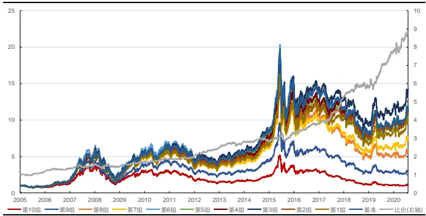
资料来源：天软科技，长江证券研究所

图 8：中证 800单位一成交额占比熵因子回测净值
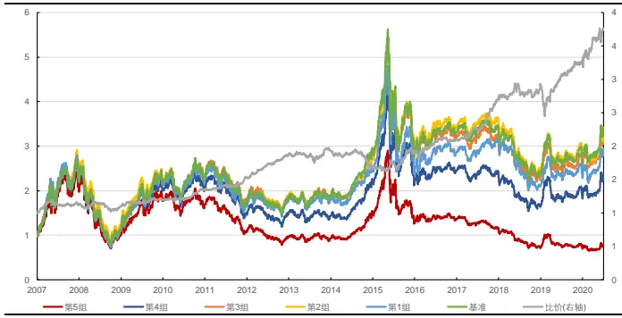
资料来源：天软科技，长江证券研究所

表 4：单位一成交额占比熵因子分年风险指标

| 全市场 中证800 |  |  |  |  |  |  |
| --- | --- | --- | --- | --- | --- | --- |
| 超额收益(%) | 信息比 | 多空收益(%) | 多空夏普比 | 超额收益(%) | 信息比 | 多空收益(%) 多空夏普比 |
| 2005 | 1.96 0.38 | 17.03 | 1.96 |  |  |  |
| 2006 | -0.49 -0.04 | 14.70 | 1.65 |  |  |  |
| 2007 | 0.12 0.08 | 14.31 | 1.42 | 3.57 | 0.85 | 13.92 1.75 |
| 2008 | -7.60 -1.54 | -6.87 | -0.72 | -8.32 | -1.93 -7.99 | -0.94 |
| 2009 | 0.40 0.07 | 21.26 | 2.49 | 3.72 | 0.93 15.57 | 2.17 |
| 2010 | -6.68 -1.66 | 8.23 | 1.27 | -1.01 | -0.31 12.20 | 2.08 |
| 2011 | -6.25 -2.33 | 5.72 | 1.14 | -3.40 | -1.55 | 7.80 1.57 |
| 2012 | 1.33 0.59 | 25.90 | 4.28 | 3.78 | 1.52 | 26.68 4.77 |
| 2013 | 0.21 0.08 | 12.58 | 1.73 | -0.99 | -0.22 | 5.03 0.75 |
| 2014 | -6.61 -1.87 | 0.50 | 0.14 | -10.87 | -3.25 | -14.99 -2.11 |
| 2015 | 2.54 0.52 | 17.00 | 1.84 | 0.29 | 0.12 | 18.57 1.77 |
| 2016 | 3.46 0.81 | 15.77 | 2.66 | 0.24 | 0.14 | 5.89 0.96 |
| 2017 | 4.40 1.55 | 36.79 | 5.16 | 4.46 | 1.36 | 26.24 4.15 |
| 2018 | -4.99 -1.24 | 12.51 | 1.57 | -2.09 | -0.49 | 8.51 1.13 |
| 2019 | 4.89 1.05 | 32.40 | 3.31 | -1.27 | -0.11 | 13.68 1.33 |
| 2020 | -1.03 -0.09 | 11.94 | 1.83 | -1.54 | -0.30 | 15.28 2.31 |
| 总计 | -1.04 -0.19 | 15.51 | 1.85 | -1.13 | -0.24 | 10.64 1.33 |

资料来源：天软科技，长江证券研究所

除此之外，还可以直接成交额占比作为每一个时间段状态的发生概率，构建成交额占比熵因子：

$$
\mathrm{H}(\frac{amount_{1}}{AMOUNT},\frac{amount_{2}}{AMOUNT},\ldots,\frac{amount_{N}}{AMOUNT})
$$

其中 $\begin{array}{r}{\verb|amount_{t}=close_{t}\times vol_{t},\quad AMOUNT=\sum_{t=1}^{T}amount_{t}}\end{array}$ 。下图分别展示了该因子自2005 年以来在全市场及中证 800 内表现，并在下表中给出了其分年风险指标，可以看到：

全历史时间段，因子在全市场和中证 800 内均可以获得一定的超额收益和多空收益，因子选股的分组线性较好，从多空净值曲线上看，因子在全市场和中证 800 内表现均较稳定；

分年来看，因子超额收益能力在中证 800 范围内近些年均产生了一定回撤，全市场范围则较为稳定，多空收益全时间段均较为稳定。

图 9：全市场成交额占比熵因子回测净值
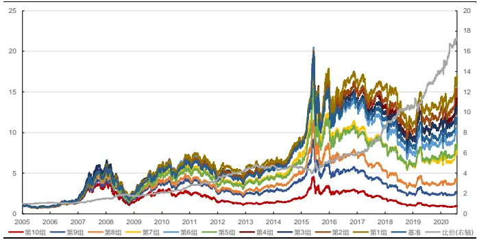
资料来源：天软科技，长江证券研究所

图 10：中证 800 成交额占比熵因子回测净值
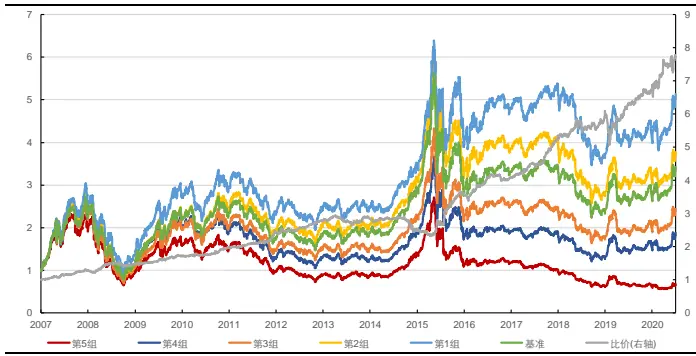
资料来源：天软科技，长江证券研究所

表 5：成交额占比熵因子分年风险指标

| 全市场 |  |  |  |  |  | 中证800 |  |  |
| --- | --- | --- | --- | --- | --- | --- | --- | --- |
|  | 超额收益(%) | 信息比 | 多空收益(%) | 多空夏普比 | 超额收益(%) | 信息比 | 多空收益(%) | 多空夏普比 |
| 2005 | -1.41 | -0.34 | 8.47 | 1.05 |  |  |  |  |
| 2006 | -8.41 | -2.11 | 2.12 | 0.23 |  |  |  |  |
| 2007 | 13.52 | 1.95 | 32.70 | 2.63 | 10.99 | 2.35 | 25.40 | 3.12 |
| 2008 | 4.24 | 0.59 | 19.87 | 1.62 | 7.57 | 1.30 | 14.79 | 1.46 |
| 2009 | 3.94 | 0.69 | 20.31 | 2.24 | 4.65 | 1.12 | 19.63 | 2.73 |
| 2010 | 1.38 | 0.31 | 28.30 | 2.93 | -0.03 | 0.02 | 12.58 | 1.69 |
| 2011 | 4.29 | 1.20 | 22.49 | 3.53 | 4.00 | 1.30 | 16.47 | 2.86 |
| 2012 | 5.46 | 1.31 | 30.11 | 3.81 | 3.52 | 1.02 | 22.15 | 3.27 |
| 2013 | -5.03 | -1.20 | 9.83 | 1.26 | -0.84 | -0.18 | 4.40 | 0.60 |
| 2014 | -10.12 | -2.77 | -3.66 | -0.54 | -11.79 | -2.82 | -15.08 | -1.86 |
| 2015 | 8.83 | 0.75 | 14.60 | 1.02 | 19.69 | 1.90 | 50.22 | 3.04 |
| 2016 | 3.18 | 0.91 | 11.44 | 1.55 | 2.73 | 0.73 | 9.17 | 1.43 |
| 2017 | 12.34 | 2.98 | 44.16 | 4.53 | 6.21 | 1.85 | 27.79 | 4.29 |
| 2018 | 1.24 | 0.29 | 26.50 | 2.74 | 0.24 | 0.11 | 14.02 | 1.75 |
| 2019 | 4.75 | 0.93 | 31.81 | 2.92 | -1.20 | -0.10 | 13.84 | 1.25 |
| 2020 | 0.89 | 0.26 | 21.49 | 2.79 | -1.25 | -0.20 | 15.78 | 2.19 |
| 总计 | 2.39 | 0.41 | 20.80 | 2.05 | 3.17 | 0.61 | 16.97 | 1.81 |

资料来源：天软科技，长江证券研究所

## 高位成交因子整体风险指标

下表给出了上述高位成交因子的整体风险指标：

从因子 IC 和 ICIR 上看，加权偏度和成交额占比熵对收益率的预测能力最强，量价相关性、加权收盘价比和单位一成交额占比熵对收益率预测能力较为相近；

从超额收益和多空收益的获取上看，各个分布因子的排序和IC及ICIR相对一致，其中成交额占比熵和加权偏度的超额收益和多空收益能力较强，加权收盘价比的超额收益能力较强，多空收益能力较弱，单位一成交额占比熵多空收益能力较强，超额收益能力较弱，量价相关性有一定的超额收益和多空收益能力。

表 6：高位成交因子整体风险指标

| 全市场 中证800 |  |  |  |  |  |  |  |  |  |
| --- | --- | --- | --- | --- | --- | --- | --- | --- | --- |
| 量价相关性 | 加权收盘价 比 | 加权偏度 | 额占比熵 | 单位一成交 成交额占比 熵 | 量价相关性 | 加权收盘价 比 | 加权偏度 | 单位一成交 成交额占比 额占比熵 | 熵 |
| IC | -5.29% | -5.09% | -5.98% | -4.42% | -6.23% | -4.41% -5.04% | -4.98% | -4.31% | -6.86% |
| ICIR | -55.92% | -62.15% | -81.23% | -58.40% | -77.53% | -37.56% -48.69% | -52.43% | -44.15% | 68.52% |
| 超额收益(%) | 1.91 | 2.59 | 2.66 | -0.93 | 2.36 | 1.67 2.02 | 2.66 | -1.13 | 3.17 |
| 信息比 | 0.29 | 0.39 | 0.44 | -0.17 | 0.41 | 0.30 | 0.35 0.52 | -0.24 | 0.61 |
| 多空收益(%) | 16.43 | 13.02 | 19.74 | 15.64 | 20.80 | 12.22 | 10.91 15.16 | 10.64 | 16.97 |
| 多空夏普比 | 1.48 | 1.35 | 2.02 | 1.87 | 2.05 | 1.19 | 1.13 1.71 | 1.33 | 1.81 |

资料来源：天软科技，长江证券研究所

## 高位成交因子的思考

## 中性后表现

高位成交占比以成交量和价格为输入构建因子，并没有用到收益率数据，故整体上和传统风格因子的线性相关性较低，下表给出了各个高位成交因子和风格因子的相关性，可以看到除成交额占比熵和反转及波动率因子相关性较高、单位一成交额占比熵和反转因子相关性较高外，其他因子相关性均在相对可控的范围内。

表 7：高位成交因子与风格因子相关性

| 分红 盈利 价值 成长 规模 非线性市值 反转 流动性 波动率 |  |  |  |  |  |  |  |  |
| --- | --- | --- | --- | --- | --- | --- | --- | --- |
| 量价相关性 | -5.76%-12.01% | 2.43%-4.29%- |  | 14.73% | -0.22% | 20.90% | -15.63% | -1.52% |
| 加权收盘价比 | -7.37%-10.49%-8.52%-4.51% |  |  | -9.82% | -0.75% | 33.01% | -11.91%34.29% |  |
| 加权偏度 | -4.38%-8.63%-0.95%-4.04% |  |  | -9.81% | 2.11% | 27.24% | -6.13% | 11.46% |
| 单位一成交额占比熵 | -6.51%-10.32%-9.16%-5.84% |  |  | -15.39% | 3.27% | 39.39% | 0.13% | 25.78% |
| 成交额占比熵- | 11.00%-13.37%-15.68% |  | -6.93%- | 17.26% | 1.99% | 52.19% | -5.33% | 50.45% |

资料来源：天软科技，长江证券研究所

下表中给出了各个高位成交因子全时间段的风险指标：

- 各个因子在中性前后的相对表现差距较大；

从因子IC和ICIR上看，中性后量价相关性和加权偏度对收益率的预测能力最强，单位一成交额占比熵保留了较为稳定的收益率预测能力，加权收盘价比和成交额占比熵的收益率预测能力有较大程度的下降；

从超额收益和多空收益的获取上看，各个分布因子的排序和IC及ICIR相对一致，其中加权收盘价比和成交额占比熵基本失去了多头和空头端的收益，量价相关性和加权偏度则仍然保留了超额收益和多空收益能力，单位一成交熵占比在空头端仍有信息。

表 8：高位成交因子中性后整体风险指标

| 全市场 中证800 |  |  |  |  |  |  |  |  |
| --- | --- | --- | --- | --- | --- | --- | --- | --- |
| 量价相关性 | 加权收盘价 比 | 加权偏度 | 额占比熵 | 单位一成交 成交额占比 熵 | 量价相关性 | 加权收盘价 比 | 加权偏度 | 单位一成交 成交额占比 额占比熵 熵 |
| IC | -4.34% | -0.75% -4.34% | -3.24% | -1.69% | -4.48% | -0.94% -3.91% | -2.60% | -1.60% |
| ICIR | -73.79% -14.55% | -86.17% | -66.24% | -30.67% | -56.24% -14.21% | -58.23% | -38.78% | -23.63% |
| 超额收益(%) | 2.21 -5.59 | -1.05 | -0.42 | -6.27 | 1.36 -4.57 | 1.21 | -1.75 | -3.75 |
| 信息比 | 0.40 -0.98 | -0.17 | -0.07 | -1.04 | 0.29 | -0.94 0.29 | -0.39 | -0.76 |
| 多空收益(%) | 15.06 -4.02 | 14.37 | 12.70 | 3.22 | 12.44 | 0.29 12.39 | 6.25 | 4.35 |
| 多空夏普比 | 1.95 | -0.56 1.96 | 1.75 | 0.44 | 1.62 | 0.07 1.77 | 0.95 | 0.61 |

资料来源：天软科技，长江证券研究所

## 合成因子表现

下图展示了各个高位成交因子的相关性，可以看到除加权收盘价占比和单位一成交额占比熵因子呈现一定负相关之外，各个因子间均有一定的正相关性，单位一成交额占比熵因子和其他因子相关性均较低。由上节中各个因子在传统风格因子中性后的表现，我们保留仍然具有一定信息增量的因子，即量价相关性、加权偏度和单位一成交额占比熵因子，并以三个因子等权求和作为合成因子，合成后的因子和各个因子均有较强的正相关性。

表 9：高位成交因子相关性

| 量价相关性 加权收盘价比 加权偏度 单位一成交额占比熵成交额占比熵 |  |  |  |  |  | 合并因子 |
| --- | --- | --- | --- | --- | --- | --- |
| 量价相关性 | 100.00% | 37.32% | 69.94% | 11.14% | 18.53% | 80.27% |
| 加权收盘价比 | 37.32% | 100.00% | 36.37% | -18.81% | 64.79% | 23.22% |
| 加权偏度 | 69.94% | 36.37% | 100.00% | 23.65% | 37.33% | 85.79% |
| 单位一成交额占比熵 | 11.14% | -18.81% | 23.65% | 100.00% | 31.89% | 59.39% |
| 成交额占比熵 | 18.53% | 64.79% | 37.33% | 31.89% | 100.00% | 38.28% |
| 合成因子 | 80.27% | 23.22% | 85.79% | 59.39% | 38.28% | 100.00% |

资料来源：天软科技，长江证券研究所

下图分别展示了该因子自 2005 年以来在全市场及中证 800 内表现，并在下表中给出了其分年风险指标，可以看到：

全历史时间段，因子在全市场和中证 800 内均可以获得一定的超额收益和多空收益，因子选股的分组线性较好，从多空净值曲线上看，因子在全市场和中证 800 内表现均较稳定；

分年来看，在全市场和中证 800 范围内，因子超额收益于特定年份产生回撤，多空收益全时间段均较为稳定。

图 11：全市场合成因子回测净值
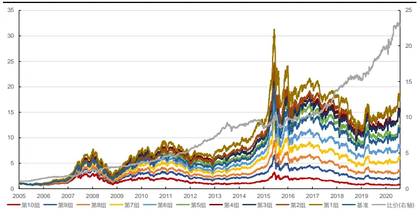
资料来源：天软科技，长江证券研究所

图 12：中证 800合成因子回测净值
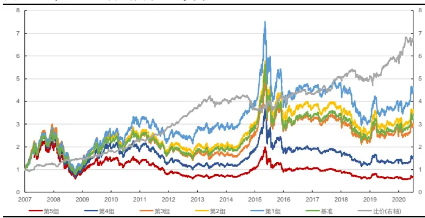
资料来源：天软科技，长江证券研究所

表 10：合成因子分年风险指标

| 全市场 |  |  |  |  |  | 中证800 |  |  |
| --- | --- | --- | --- | --- | --- | --- | --- | --- |
|  | 超额收益(%) | 信息比 | 多空收益(%) | 多空夏普比 | 超额收益(%) | 信息比 | 多空收益(%) | 多空夏普比 |
| 2005 | 16.06 | 2.67 | 46.13 | 4.17 |  |  |  |  |
| 2006 | 7.00 | 1.40 | 21.98 | 2.70 |  |  |  |  |
| 2007 | 8.11 | 0.90 | 45.46 | 2.67 | 6.44 | 0.98 | 25.32 | 2.22 |
| 2008 | 6.23 | 0.88 | 17.10 | 1.42 | 7.84 | 1.35 | 18.29 | 1.76 |
| 2009 | -2.56 | -0.34 | 23.82 | 2.27 | 0.67 | 0.19 | 23.77 | 2.48 |
| 2010 | 3.61 | 0.57 | 22.04 | 2.23 | 11.21 | 2.06 | 25.70 | 2.85 |
| 2011 | 0.03 | 0.06 | 19.39 | 2.45 | 4.61 | 1.25 | 20.41 | 3.09 |
| 2012 | 7.79 | 2.04 | 32.86 | 4.29 | 10.97 | 3.39 | 33.62 | 4.85 |
| 2013 | 2.19 | 0.54 | 20.82 | 2.13 | 2.23 | 0.59 | 8.94 | 1.14 |
| 2014 | -5.39 | -1.24 | -3.76 | -0.41 | -10.32 | -2.44 | -8.74 | -1.06 |
| 2015 | 3.48 | 0.42 | 16.80 | 1.24 | -0.45 | 0.08 | 15.17 | 1.22 |
| 2016 | -4.34 | -0.93 | 6.14 | 1.05 | -0.54 | -0.07 | 3.27 | 0.49 |
| 2017 | 4.98 | 1.33 | 31.12 | 4.08 | 2.80 | 0.84 | 15.97 | 2.36 |
| 2018 | -4.71 | -0.84 | 12.54 | 1.56 | -6.05 | -1.14 | -1.98 | -0.11 |
| 2019 | 4.62 | 1.16 | 27.43 | 3.33 | 2.16 | 0.54 | 15.47 | 1.73 |
| 2020 | 0.61 | 0.21 | 15.44 | 1.86 | 1.76 | 0.48 | 16.52 | 2.15 |
| 总计 | 3.02 | 0.48 | 23.12 | 2.13 | 2.39 | 0.44 | 15.73 | 1.59 |

资料来源：天软科技，长江证券研究所

下图分别展示了该因子和风格因子中性后，自2005年以来在全市场及中证800内表现，并在下表中给出了其分年风险指标，可以看到：

全历史时间段，和风格因子中性后因子在全市场和中证 800 内仍可以获得一定的超额收益和多空收益，因子选股的分组线性较好，从多空净值曲线上看，因子在全市场和中证 800 内表现均较稳定，但在中证 800 内近些年有一定波动；

分年来看，在全市场和中证 800 范围内，和风格因子中性后因子近些年超额收益能力有所下降，但多空收益全时间段均较为稳定。

图 13：全市场合成因子中性后回测净值
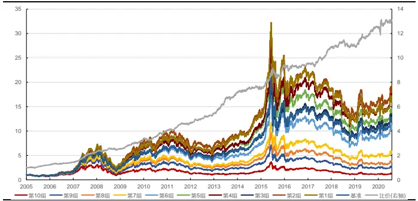
资料来源：天软科技，长江证券研究所

图 14：中证 800 合成因子中性后回测净值
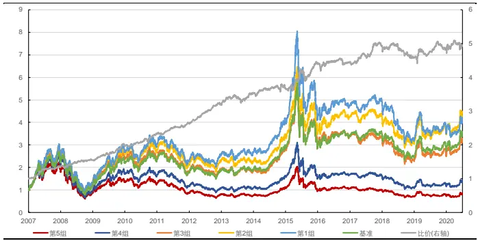
资料来源：天软科技，长江证券研究所

表 11：合成因子中性后分年风险指标

| 全市场 |  |  |  |  |  | 中证800 |  |  |
| --- | --- | --- | --- | --- | --- | --- | --- | --- |
|  | 超额收益(%) | 信息比 | 多空收益(%) | 多空夏普比 | 超额收益(%) | 信息比 | 多空收益(%) | 多空夏普比 |
| 2005 | 3.17 | 0.77 | 22.82 | 3.31 |  |  |  |  |
| 2006 | 0.86 | 0.40 | 16.19 | 2.35 |  |  |  |  |
| 2007 | 16.06 | 2.07 | 58.91 | 4.38 | 10.94 | 2.01 | 34.09 | 4.26 |
| 2008 | 2.68 | 0.48 | 11.85 | 1.38 | 6.63 | 1.35 | 15.74 | 2.09 |
| 2009 | 0.92 | 0.21 | 32.39 | 4.01 | 4.82 | 1.07 | 29.16 | 3.80 |
| 2010 | 4.38 | 0.95 | 20.19 | 2.80 | 3.33 | 0.80 | 14.37 | 2.16 |
| 2011 | -0.56 | -0.17 | 15.67 | 2.95 | 1.46 | 0.43 | 13.60 | 2.61 |
| 2012 | 2.29 | 0.79 | 16.55 | 3.59 | 6.05 | 2.44 | 23.99 | 5.07 |
| 2013 | 10.37 | 2.51 | 31.37 | 4.22 | 0.37 | 0.28 | 8.53 | 1.37 |
| 2014 | -0.85 | -0.13 | 3.85 | 0.78 | 1.23 | 0.48 | 5.95 | 1.01 |
| 2015 | 8.60 | 0.98 | 26.35 | 2.61 | 1.93 | 0.34 | 17.93 | 1.65 |
| 2016 | -3.82 | -0.91 | 1.75 | 0.38 | -2.61 | -0.67 | 0.99 | 0.14 |
| 2017 | -0.94 | -0.27 | 14.07 | 3.65 | 1.83 | 0.64 | 13.71 | 2.82 |
| 2018 | -5.95 | -1.91 | 1.20 | 0.31 | -7.47 | -2.06 | -8.51 | -1.31 |
| 2019 | -1.15 | -0.22 | 12.87 | 2.38 | -2.32 | -0.45 | 5.04 | 0.89 |
| 2020 | -3.89 | -0.68 | 4.72 | 0.77 | -7.96 | -2.00 | 2.62 | 0.50 |
| 总计 | 1.99 | 0.40 | 18.63 | 2.46 | 1.26 | 0.30 | 13.08 | 1.79 |

资料来源：天软科技，长江证券研究所

下表中给出了合成因子和风格因子中性前后全时间段的风险指标：

从 IC 和 ICIR 上看，合成因子在中性后对收益的预测能力有所下降，但稳定性有一定提升；

从收益上看，合成因子在中性后超额收益和多空收益有所下降，但多空夏普比有所增强。

表 12：合成因子中性前后风险指标

| 全市场 |  | 中证800 |  |
| --- | --- | --- | --- |
|  | 中性前 中性后 | 中性前 | 中性后 |
| IC | -6.53% -5.13% | -5.65% | -4.78% |
| ICIR | -75.78% | -94.25% -51.03% | -66.79% |
| 超额收益(%) | 3.02 | 1.99 | 2.39 1.26 |
| 信息比 | 0.48 | 0.40 | 0.44 0.30 |
| 多空收益(%) | 23.12 | 18.63 | 15.73 13.08 |
| 多空夏普比 | 2.13 | 2.46 | 1.59 1.79 |

资料来源：天软科技，长江证券研究所

## 总结

高位成交因子以量价相关性为代表，目的在于刻画个股在高位和低位成交的密集水平。高位成交较多的个股，交易行为中存在羊群效应，导致局部价格高估而在未来呈现反转效应，反之如果个股低位成交较多，存在低位加仓的现象，未来价格有较大相对上行空间。以时间序列上成交量和收盘价相关性构建量价相关性因子，衡量成交量和股价之间的趋同或背离程度，趋同程度高则高位成交多，因子在全市场和中证800内的IC和ICIR分别为-5.29%、-55.92%和-4.41%、-37.56%，在剥离了风格因子线性影响后分别为-4.34%、-73.79%和-4.48%和-56.24%。

加权收盘价比从成交量加权平均价格偏离平均价格的角度刻画成交密集分布。当价格高位成交多于价格低位成交时，成交量加权平均价格大于平均价格，且成交在高位越集中，差距越大，故以成交量加权平均收盘价同平均收盘价的比值构建加权收盘价比因子，因子在全市场和中证 800 内的 IC 和 ICIR 分别为-5.09%、-62.15%和-5.04%、-48.69%，在剥离了风格因子线性影响后分别为-0.75%、-14.55%和-0.94%和-14.21%。

加权偏度从考虑成交量对价格分布的影响得到的偏度刻画成交密集分布。假设每个时间段成交量相等，则价格的偏度刻画了价格分布相对平均值不对称的程度，偏度大于 0 意味着大于价格均值的价格比小于价格均值的价格少，成交集中在价格低位。但成交量在每个时刻并非完全相等，成交量较高的时间段本身应该在计算偏度时占有更大比例，故以成交量加权的价格偏度构建加权偏度因子，因子在全市场和中证 800 内的 IC 和 ICIR分别为-5.98%、-81.23%和-4.98%、-52.43%，在剥离了风格因子线性影响后分别为-4.34%、-86.17%和-3.91%和-58.23%。

成交额熵从不同时间段成交额状态描述的体系混乱程度刻画成交密集分布。加权收盘价比其实是将成交量和收盘价做权重化处理后，从排序不等式的角度刻画成交体系的混乱程度，成交量和收盘价相乘即为成交额，故以成交额为状态描述，以信息熵为标准刻画体系混乱程度，构建成交额熵因子。其中单位一成交额占比熵因子在全市场和中证 800内的 IC 和 ICIR 分别为-4.42%、-58.40%和-4.31%、-44.15%，在剥离了风格因子线性影响后分别为-3.24%、-66.24%和-2.60%和-38.78%。成交额占比熵因子在全市场和中证 800 内的 IC 和 ICIR 分别为-6.23%、-77.53%和-6.86%、-68.52%，在剥离了风格因子线性影响后分别为-1.69%、-30.67%和-1.60%和-23.63%。

合成后的高位成交因子在风格中性前后均有较强的选股能力。本文以风格中性后仍保留较多信息的因子，即量价相关性、加权偏度和单位一成交额占比熵因子等权求和作为合成因子，在全市场和中证 800 内的 IC 和 ICIR 分别为-6.53%、-75.78%和-5.65%、-51.03%，在剥离了风格因子线性影响后分别为-5.13%、-94.25%和-4.78%和-66.79%，从回测的收益上看，中性前超额收益于特定年份产生回撤，多空收益全时间段均较为稳定，中性后近些年超额收益能力有所下降，但多空收益全时间段均较为稳定。

## 投资评级说明

行业评级 报告发布日后的 12 个月内行业股票指数的涨跌幅相对同期沪深 300 指数的涨跌幅为基准，投资建议的评级标准为：

好： 相对表现优于市场

中性： 相对表现与市场持平

看 淡： 相对表现弱于市场

公司评级 报告发布日后的 12 个月内公司的涨跌幅相对同期沪深 300 指数的涨跌幅为基准，投资建议的评级标准为：

买 入： 相对大盘涨幅大于 10%

增 持： 相对大盘涨幅在 5%～10%之间

中 性： 相对大盘涨幅在-5%～5%之间

减 持： 相对大盘涨幅小于-5%

无投资评级： 由于我们无法获取必要的资料，或者公司面临无法预见结果的重大不确定性事件，或者其他原因，致使我们无法给出明确的投资评级。

相关证券市场代表性指数说明：A 股市场以沪深 300 指数为基准；新三板市场以三板成指（针对协议转让标的）或三板做市指数（针对做市转让标的）为基准；香港市场以恒生指数为基准。

## 办公地址:

[Tab上海

Add /浦东新区世纪大道 1198号世纪汇广场一座 29 层P.C /（200122）

武汉

Add /武汉市新华路特8 号长江证券大厦 11 楼P.C /（430015）

北京

Add /西城区金融街 33 号通泰大厦 15 层

深圳

P.C /（100032）

Add /深圳市福田区中心四路1号嘉里建设广场 3 期 36 楼P.C /（518048）

## 分析师声明：

作者具有中国证券业协会授予的证券投资咨询执业资格并注册为证券分析师，以勤勉的职业态度，独立、客观地出具本报告。分析逻辑基于作者的职业理解，本报告清晰准确地反映了作者的研究观点。作者所得报酬的任何部分不曾与，不与，也不将与本报告中的具体推荐意见或观点而有直接或间接联系，特此声明。

## 重要声明：

长江证券股份有限公司具有证券投资咨询业务资格，经营证券业务许可证编号：10060000。

本报告仅限中国大陆地区发行，仅供长江证券股份有限公司（以下简称：本公司）的客户使用。本公司不会因接收人收到本报告而视其为客户。本报告的信息均来源于公开资料，本公司对这些信息的准确性和完整性不作任何保证，也不保证所包含信息和建议不发生任何变更。本公司已力求报告内容的客观、公正，但文中的观点、结论和建议仅供参考，不包含作者对证券价格涨跌或市场走势的确定性判断。报告中的信息或意见并不构成所述证券的买卖出价或征价，投资者据此做出的任何投资决策与本公司和作者无关。

本报告所载的资料、意见及推测仅反映本公司于发布本报告当日的判断，本报告所指的证券或投资标的的价格、价值及投资收入可升可跌，过往表现不应作为日后的表现依据；在不同时期，本公司可以发出其他与本报告所载信息不一致及有不同结论的报告；本报告所反映研究人员的不同观点、见解及分析方法，并不代表本公司或其他附属机构的立场；本公司不保证本报告所含信息保持在最新状态。同时，本公司对本报告所含信息可在不发出通知的情形下做出修改，投资者应当自行关注相应的更新或修改。

本公司及作者在自身所知情范围内，与本报告中所评价或推荐的证券不存在法律法规要求披露或采取限制、静默措施的利益冲突。

本报告版权仅为本公司所有，未经书面许可，任何机构和个人不得以任何形式翻版、复制和发布。如引用须注明出处为长江证券研究所，且不得对本报告进行有悖原意的引用、删节和修改。刊载或者转发本证券研究报告或者摘要的，应当注明本报告的发布人和发布日期，提示使用证券研究报告的风险。未经授权刊载或者转发本报告的，本公司将保留向其追究法律责任的权利。