## 高频因子（九）：高频波动中的时间序列信息

分析师及联系人

覃川桃 (8621)61118766 qinct@cjsc.com.cn 执业证书编号： S0490513030001 • 郑起 (8621)61118706 zhengqi2@cjsc.com 执业证书编号： S0490520060001报告要点

# MAIN POINTS OF REPORT

报告日期 2020-10-12

金融工程专题报告

## 相关研究

- 《资金流跟踪系列二十八：外资行为“散户化”？(II)—“配置型”VS“交易型”谁是“Smarter Money”?》2020-10-10• 《机构重仓因子构建》2020-09-30

- 《资金流跟踪系列二十七：外资行为“散户化”？(I)一如何识别“配置型”和“交易型”资金》2020-09-27

基础因子研究（十四）

# 高频因子（九）：高频波动中的时间序列信息

## 高频波动因子从频率和数据类型两方面对传统波动因子进行了拓展

传统的波动因子以日度收益率数据为基础构建，本文从数据频率和数据类型两方面对其进行了拓展。其中，表现最好的1min频率下的高频成交量波动因子在全市场中取得了年化20.84%的多空收益和6.27%的超额收益，多空夏普比和信息比分别达到2.87和1.62，且在近两年没有出现明显回撤。在波动因子的高频化过程中，采用的因子构建方式对因子表现影响较大；先计算日内标准差再计算日间标准差最后除以均值去量纲被证明是较好的构建方式，其优势在于同时提取了日内波动与日间波动中的信息。

## 差分能提取数据中的时间序列信息，因子表现出正向收益能力

波动类因子传统上都采用计算标准差的方式构建，其只关注数据的截面分布，而实际中数据在时间序列上的顺序中很可能含有信息。先差分再计算标准差是一种提取数据中时间序列信息的方法，此方法下构建的因子表现出因子值越大收益越高的正向收益能力，说明其已经不涉及对波动的表征，而可能是对趋势交易者或知情交易者交易行为的刻画。其中，表现最好的每笔成交量差分标准差因子在全市场中取得了年化24.22%的多空收益和3.00%的超额收益，多空夏普比和信息比分别达到1.76和0.51。

## 标准差改为均值能显著提高差分因子的表现，因子对数据频率较敏感

差分因子表现出正向收益能力，而计算标准差所希望度量的波动表现出负向收益能力，二者相互抵消会降低因子整体的收益能力。因此，将标准差改为均值能显著提高差分因子的表现，其中日内在计算均值前需要先取绝对值。采用这种方式构建的因子中，表现最好的成交量差分绝对值均值因子在全市场中取得了年化34.13%的多空收益和7.95%的超额收益，多空夏普比和信息比分别达到2.12和1.10，风格中性后月度I0和ICIR仍有4.35%和44.70%。差分因子对数据频率的敏感性很高，当数据频率降低到15min时因子已基本失去收益能力。

## 波峰计数因子度量局部峰值的能力更优，缩短调仓频率可提升表现

差分提取时间序列信息的有效性来源于对数据局部峰值的度量，而对波峰计数是度量局部峰值更简单也更有效的方法。本文识别局部峰值的方法分为两个步骤：第一步筛选出大于(均值+1倍标准差)的数据；第二步计算上一步筛选出的每一分钟与前一分钟之间的时间差，保留时间差超过1分钟的分钟数据。因子在全市场中取得了年化39.08%的多空收益和7.10%的超额收益，多空夏普比和信息比分别达到3.41和1.61，风格中性后月度IC和ICIR仍有3.88%和61.60%。调仓频率为5日时，因子在样本区间内取得了年化56.65%的多空收益和9.03%的超额收益，多空夏普比和信息比分别达到4.33 和 1.97。

## 风险提示：

1. 模型存在失效风险；

2. 本文举例均基于历史数据，不保证未来收益。

## 从高频波动因子谈起

## 波动因子的高频拓展

传统的波动因子以日度收益率数据为基础构建，其核心逻辑在于被市场非理性追捧的、短期股价波动迅速上升的个股会随着交易行为回归理性而回落至正常的价格区间。本文从两个方面对传统波动因子进行了拓展：一方面，尝试将数据频率从日度提高到分钟K级别，以此来更好地度量波动；另一方面，被市场非理性追捧的个股在除股价外的其他一些数据和指标上也会呈现出波动上升的特点，故尝试用成交量、成交笔数、振幅等数据度量波动。

以成交量数据为例，本文使用1分钟频率数据构建了高频成交量波动因子，其具体构建方法如下：

$$
\sigma_{day}=std(\{vol_{i}\})
$$

$$
\sigma_{vol}=\frac{std(\{\sigma_{day}\})}{mean(\{\sigma_{day}\})}
$$

其中voli为个股日内240根1分钟K线的成交量，std()为标准差函数，mean()为均值函数， $\sigma_{day}$ 取过去20个交易日数据。得到成交量波动因子时除以其均值是为了去除成交量自身量纲的影响。

下图分别展示了该因子自2010年以来在全市场及中证800内表现，并在下表中给出了其分年风险指标，可以看到：

总体上看，高频成交量波动因子有一定选股能力，其在全市场取得了年化20.84%的多空收益和6.27%的超额收益，多空夏普比和信息比分别达到2.87和1.62，在中证800中收益能力相对较弱但仍能取得一定的多空和超额收益；

分组表现上看，该因子在全市场和中证800中的分组线性均较好，多头与空头强度基本相同，没有表现出传统波动因子空头明显强于多头的性质；

分年度表现上看，全市场中该因子只在2014年出现相对回撤，在传统波动因子表现不佳的2019和2020两年该因子仍能够取得较稳定的多空收益与超额收益，而中证800中该因子近年来收益能力出现一定波动。

图1:全市场高频成交量波动因子回测净值
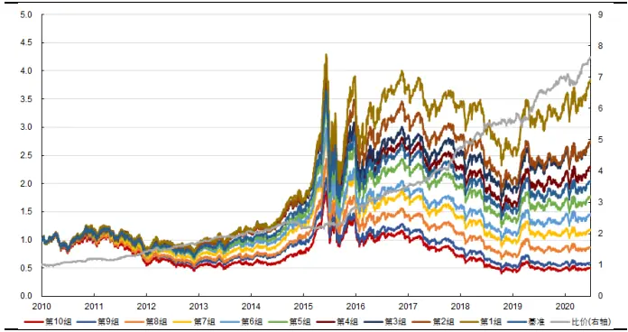
资料来源：天软科技，长江证券研究所

图2：中证800高频成交量波动因子回测净值
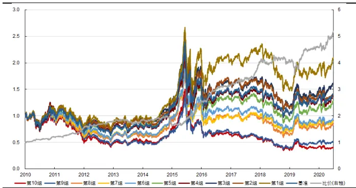
资料来源：天软科技，长江证券研究所

表1：高频成交量波动因子分年风险指标

| 全市场 |  |  |  |  |  | 中证800 |  |  |
| --- | --- | --- | --- | --- | --- | --- | --- | --- |
|  | 超额收益(%) | 信息比 | 多空收益(%) | 多空夏普比 | 超额收益(%) | 信息比 | 多空收益(%) | 多空夏普比 |
| 2010 | 5.48 | 1.19 | 20.22 | 2.68 | 5.73 | 1.16 | 20.51 | 2.55 |
| 2011 | 2.22 | 0.74 | 18.02 | 3.22 | 6.87 | 1.80 | 27.18 | 3.91 |
| 2012 | 3.12 | 0.95 | 19.98 | 3.22 | 2.82 | 0.75 | 15.45 | 2.22 |
| 2013 | 4.37 | 1.39 | 20.49 | 2.89 | 1.51 | 0.34 | 1.94 | 0.25 |
| 2014 | -3.59 | -0.96 | 4.19 | 0.67 | -9.88 | -1.83 | -12.47 | -1.24 |
| 2015 | 23.60 | 3.73 | 31.28 | 2.94 | 25.60 | 2.97 | 54.55 | 3.65 |
| 2016 | 7.78 | 2.31 | 22.66 | 3.92 | 6.51 | 1.38 | 23.74 | 3.38 |
| 2017 | 8.58 | 2.58 | 34.49 | 5.11 | 8.67 | 2.02 | 25.94 | 2.92 |
| 2018 | 5.54 | 1.58 | 17.18 | 2.28 | -6.14 | -1.28 | 1.20 | 0.18 |
| 2019 | 5.88 | 1.46 | 23.19 | 2.98 | -2.99 | -0.52 | 9.78 | 0.95 |
| 2020 | 10.06 | 2.76 | 20.08 | 2.48 | 10.99 | 1.76 | 29.54 | 2.38 |
| 总计 | 6.27 | 1.62 | 20.84 | 2.87 | 3.80 | 0.75 | 16.11 | 1.72 |

资料来源：天软科技，长江证券研究所

事实上，除成交量数据外，使用其他数据构建的高频波动因子也有较好的回测表现。下表对相关因子回测表现进行了汇总(不同因子使用的数据频率略有不同)，并给出了传统波动因子的回测表现作为对比，其中“日度波动”指个股日度收益率标准差，“日度残差波动”指个股日度收益率与全市场等权平均收益率回归后残差的波动率。此外，成交笔数数据由交易所公布，表示区间内买卖双方完成撮合的次数，由于上交所于2017年才开始公布此项数据，本文构建因子过程中涉及到成交笔数(包括其衍生出的每笔成交量)等数据时，回测中2017年之前的股票池由全体A股缩小为深市个股。

表2：高频波动因子收益风险表现汇总

| 全市场 |  |  |  |  |  |  | 中证800 |  |  |  |
| --- | --- | --- | --- | --- | --- | --- | --- | --- | --- | --- |
|  | 日度波动日度残差波动 |  | 动(1 分钟) 波动(1 分钟) | 高频成交量波高频成交笔数 高频振幅波 | )动(5 分钟) | 日度波动日度残差波动 |  | 动(1 分钟) | 高频成交量波 高频成交笔数高频振幅波动 波动(1 分钟) | (5 分钟) |
| IC(%) | -6.99 | -9.62 | -6.82 | -5.95 | -4.75 | -4.82 | -7.03 | -5.95 | -5.36 | -4.89 |
| ICIR(%) | -44.78 | -80.22 | -110.47 | -82.26 | -64.70 | -27.68 | -51.75 | -73.63 | -54.32 | -55.21 |
| 超额收益(%) | -4.93 | 2.09 | 6.27 | 4.57 | 3.13 | -4.46 | 0.04 | 3.80 | 4.49 | 0.42 |
| 信息比 | -0.43 | 0.36 | 1.62 | 0.98 | 0.69 | -0.33 | 0.04 | 0.75 | 0.67 | 0.10 |
| 多空收益(%) | 8.43 | 22.45 | 20.84 | 19.03 | 16.15 | 0.20 | 10.89 | 16.11 | 17.03 | 11.04 |
| 多空夏普比 | 0.51 | 1.44 | 2.87 | 2.24 | 2.00 | 0.11 | 0.76 | 1.72 | 1.48 | 1.11 |

资料来源：天软科技，长江证券研究所

可以看到，表中的三种高频波动因子在样本区间内均表现出了较为稳定的收益能力，说明本文给出的这种波动因子高频化方法适用于多种数据类型。另一方面，三种高频波动因子与传统波动因子相比，多头组收益更强，信息比和多空夏普比更高，这也与其近两年未出现明显回撤的事实一致。因此，虽然这些因子与传统波动因子都以市场的低波动异象为逻辑出发点，但其中可能包含了传统波动因子所不具有的信息，这些增量信息改善了因子的分组情况，并使其避免了近两年的回撤。

## 日内波动与日间波动

在保持信息窗口为20个交易日的情况下，同时考虑到去量纲的需要，构建高频波动因子的方式可分为以下几种：

(1) 直接使用过去20 个交易日的全部分钟K数据计算标准差/均值;

(2) 使用每天的分钟K数据计算日内标准差/均值，取20个交易日平均；

(3) 使用每天的分钟K数据计算日内标准差/均值，取20个交易日标准差；

(4) 使用每天的分钟K数据计算日内标准差，取20个交易日标准差/均值。

从逻辑上看，上述几种方式和传统日度波动因子间的差异主要体现在对日内波动和日间波动的不同对待：

传统的日度波动因子由于没有涉及日内信息而只考虑了日间波动，与之相对地方式(2)构建的因子在日间取均值的过程中忽略了日间波动而只考虑了日内波动；

方式(1)和方式(3)(4)均同时考虑了日内波动与日间波动，其区别在于方式(1)将两者统一计算，而方式(3)(4)分两步分别计算两种波动;

方式(3)与方式(4)的区别在于何时去量纲，即方式(3)在计算完日内波动后去量纲，而方式(4)在计算完日内波动和日间波动后去量纲。

上一小节给出的高频波动因子均使用第(4)种方式构建，而下面的表格中汇总了使用其他三种方式构建的高频波动因子的全市场回测表现，其中各因子均使用5分钟的数据频率。可以看到：

对于三种数据类型而言，采用第(4)种方式，即计算“波动的波动”后再去量纲构造出的波动因子的表现都是最好的。

同时考虑日内波动与日间波动的方式(1)(3)(4)，表现优于只考虑日内波动的方式(2)，说明日内波动与日间波动中含有不同的信息，将二者同时纳入因子构建过程中是较好的提取信息的方法。

方式(1)与方式(3)的表现较为接近，说明在同时考虑了两种波动的前提下，统一计算与分步计算的差别不大。

在第二步计算后去量纲的方式(4)在收益的稳定性上优于在第一步计算后去量纲的方式(3)，这意味着过早的、在每一日的计算结束后去量纲会丢失更多的信息。

表3：不同构建方式下高频波动因子的全市场收益风险表现

|  | 成交量 |  |  |  |  | 成交笔数 |  |  |  |  | 振幅 |  |  |  |
| --- | --- | --- | --- | --- | --- | --- | --- | --- | --- | --- | --- | --- | --- | --- |
|  | 日度 | 方式(1) | 方式(2) | 方式(3) | 方式(4) | 日度 | 方式(1) | 方式(2) | 方式(3) | 方式(4) | 日度 | 方式(1) | 方式(2) | 方式(3) 方式(4) |
| IC(%) | 1.75 | 0.03 | -4.57 | -0.01 | 4.49 | 1.87 | 1.35 | -0.60 | 1.38 | 2.90 | 0.06 | -2.81 | -4.22 | -3.64 3.13 |
| ICIR(%) | 0.42 | 0.03 | -0.57 | 0.03 | 1.14 | 0.38 | 0.24 | -0.03 | 0.29 | 0.59 0.04 | -0.29 | -0.38 | -0.57 | 0.69 |
| 超额收益(%) | 16.16 | 15.40 | 7.30 | 15.75 | 17.05 | 17.63 | 16.72 | 16.70 | 15.46 15.80 | 11.59 | 6.23 | 2.17 | 7.86 | 16.15 |
| 信息比 | 2.08 | 1.56 | 0.66 | 1.60 | 2.49 | 1.96 | 1.54 | 1.27 | 1.51 | 1.84 1.31 | 0.57 | 0.22 | 0.78 | 2.00 |
| 多空收益(%) | -4.25 | -4.11 | -1.54 | -4.41 | -5.44 | -4.48 | -6.02 | -5.81 | -5.12 | -4.30 | -2.48 | -3.20 | -2.11 -3.65 | -4.76 |
| 多空夏普比 | -67.79 | -48.07 | -13.89 | -62.19 | -86.68 | -63.46 | -64.87 | -52.74 | -68.80 | -57.59 | -34.11 | -26.10 | -15.11 -43.37 | -64.70 |

资料来源：天软科技，长江证券研究所

## 数据频率的影响

“波动的波动”这种波动因子高频化方式的优势在于其能够同时刻画日内波动与日间波动，而数据频率的提高很可能改善对日内波动的刻画效果，进而带来因子收益风险表现的进一步提升。当然，数据频率的提高也不是毫无限制的，过高频率的数据(例如快照数据)中的大量噪声会掩盖原有的波动性质而使因子失效。

为了探讨数据频率对高频波动因子表现的影响，下表给出了使用其他频率数据构建的因子在全市场中的回测表现以进行对比。

表4：不同数据频率下高频波动因子的全市场收益风险表现

| 数据频率 IC(%) ICIR(%) 超额收益(%)信息比 多空收益(%)多空夏普比 |  |  |  |  |
| --- | --- | --- | --- | --- |
| 高频成交量波动 5 分钟 | 1分钟 -6.82 | -110.47 | 6.27 1.62 | 20.84 2.87 |
|  | -5.44 | -86.68 4.49 | 1.14 | 17.05 2.49 |
|  | 15分钟 -4.47 | -72.26 3.38 | 0.85 | 15.19 2.18 |
| 高频成交笔数波 动 | 1分钟 -5.95 | -82.26 4.57 | 0.98 | 19.03 2.24 |
|  | 5分钟 -4.30 | -57.59 2.90 | 0.59 | 15.80 1.84 |
|  | 15分钟 -3.62 | -50.04 1.95 | 0.41 | 13.41 1.59 |
| 高频振幅波动 | 1分钟 -5.04 | -63.63 0.75 | 0.17 | 13.46 1.72 |
|  | 5分钟 -4.75 | -64.70 3.13 | 0.69 | 16.15 2.00 |
|  | 15分钟 -3.79 | -51.22 1.95 | 0.44 | 13.85 1.69 |

资料来源：天软科技，长江证券研究所

可以看到，对成交量与成交笔数数据而言，因子表现随数据频率的提高而改善，1分钟频率下的因子表现最佳；而对振幅数据而言，1分钟频率和15分钟频率下的因子表现均不如5分钟频率下的因子，即因子表现随数据频率的提高先上升后下降。由于前者与“量”有关而后者与“价”有关，上述现象说明与“价”相关的高频数据中的噪声相对较多、在数据频率较高时噪声影响较大，而与“量”相关的高频数据中的噪声相对较少、在数据频率较高时噪声影响不大。

## 通过差分提取时间序列信息

## 差分的逻辑起点

波动类因子传统上都采用计算标准差的方式构建，这也是度量一组数据离散性的最常见的统计指标。然而，标准差等统计指标只关注数据的截面分布，而价量数据为时间序列数据，数据出现的顺序中很可能含有信息。

下面两张图可以更好地说明这一点，其中左图是2020年6月30日浦发银行(600000.SH)的分时成交量，而右图是将上午的成交量从大到小排列、下午的成交量从小到大排列后得到的。由于只改变了数据排列而未改变数据大小与分布，用这两张图计算出的日内成交量标准差应当相同。在使用标准差构建波动因子的情况下，我们将认为两张图中的成交量具有相同的波动程度；但在实际情况中，成交量的每一次局部峰值都可能蕴含信息，因而左图中的信息含量远远大于右图。

图3：2020年6月30日浦发银行分时成交量
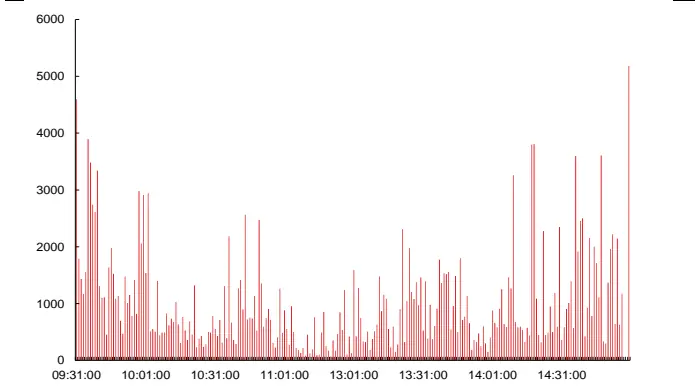
资料来源：天软科技，长江证券研究所

图4：2020年6月30日浦发银行分时成交量(重新排列后)
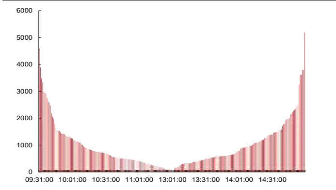
资料来源：天软科技，长江证券研究所

因此，为了在传统波动类因子的基础上进一步提取数据在时间序列上的信息，必须将直接计算标准差更改为一种新的、与数据的时间序列属性相关的计算方式。事实上，对于价格数据而言，构建波动因子的方式也不是直接计算标准差，而是将价格差分变为收益率后再计算标准差，其体现了这样一种逻辑，即价格本身的离散程度无意义，而价格在时间序列上的变动情况的离散程度有意义。

借鉴这种思路，对前文中构建的高频波动因子而言，同样可以采用这种先差分再计算标准差的方法，以此尝试将数据中的时间序列信息纳入因子中。需要注意的是，差分并不能起到去量纲的作用，因此在计算完日内标准差后我们仍需采取标准差/均值(这里的均值仍为差分前序列的均值)的方式剥离数据自身量纲的影响。

## 差分标准差因子

以每笔成交量数据为例，本文依照上述思路构建了每笔成交量差分标准差因子：

$$
\begin{aligned}diff_{i}&=vold_{i}-vold_{i-1}\\diff_{-}std_{day}&=\frac{std(\{diff_{i}\})}{mean(\{vold_{i}\})}\\diff_{-}std_{vold}&=mean(\{diff_{-}std_{day}\})\end{aligned}
$$

其中volbi为个股日内 240 根 1 分钟 K线的每笔成交量(成交量/成交笔数)，diff_stdday取过去20个交易日数据。

下图分别展示了该因子自2010年以来在全市场及中证800内表现，并在下表中给出了其分年风险指标，可以看到：

总体上看，每笔成交量差分标准差因子有一定选股能力，其在全市场取得了年化24.22%的多空收益和 3.00%的超额收益，多空夏普比和信息比分别达到1.76 和0.51，在中证800中收益能力相对较弱但仍能取得一定的多空和超额收益；

分组表现上看，该因子在全市场中的分组线性较好，而在中证800中的分组能力稍弱，且空头明显强于多头；

分年度表现上看，全市场中该因子在2018年之前能够取得稳定的多空收益和一定的超额收益，但在近两年出现了较为明显的回撤，中证800中因子收益的波动更大、近两年的回撤更加明显。

图5:全市场每笔成交量差分标准差因子回测净值
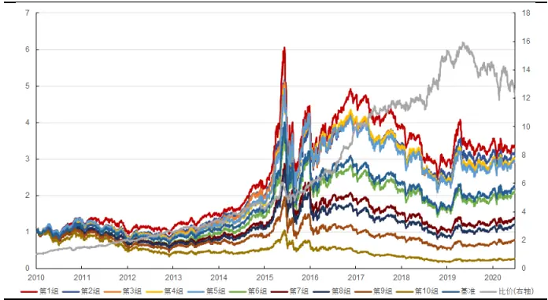
资料来源：天软科技，长江证券研究所

图6:中证800每笔成交量差分标准差因子回测净值
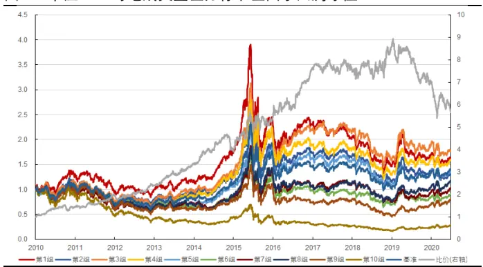
资料来源：天软科技，长江证券研究所

表5:每笔成交量差分标准差因子分年风险指标

| 全市场 |  |  |  |  |  | 中证800 |  |  |  |
| --- | --- | --- | --- | --- | --- | --- | --- | --- | --- |
|  | 超额收益(%) | 信息比 | 多空收益(%) | 多空夏普比 | 超额收益(%) | 信息比 | 多空收益(%) |  | 多空夏普比 |
| 2010 | 11.91 | 2.00 | 45.25 | 3.09 | 19.13 | 1.96 | 38.74 |  | 2.09 |
| 2011 | 13.34 | 2.89 | 33.78 | 2.86 | 11.60 | 1.74 |  | 35.27 | 2.36 |
| 2012 | 5.16 | 1.20 | 25.10 | 2.59 | 0.43 |  | 0.10 | 18.47 | 1.46 |
| 2013 | -0.42 | -0.04 | 29.71 | 2.41 | 4.21 |  | 0.66 | 37.43 | 2.56 |
| 2014 | 3.11 | 0.52 | 21.33 | 1.68 | 9.09 |  | 1.38 | 15.98 | 1.22 |
| 2015 | -2.73 | -0.27 | 38.60 | 1.73 | -9.62 |  | -0.74 | 32.32 | 1.31 |
| 2016 | 18.97 | 3.46 | 63.47 | 4.58 | 11.13 |  | 1.75 | 37.34 | 2.41 |
| 2017 | -0.94 | -0.16 | 13.65 | 1.21 | -11.72 |  | -2.39 | -2.04 | -0.14 |
| 2018 | 2.31 | 0.35 | 25.81 | 1.67 | 1.49 |  | 0.24 | 9.27 | 0.61 |
| 2019 | -5.02 | -0.85 | -5.69 | -0.47 | -12.01 |  | -1.93 | -19.27 | -1.52 |
| 2020 | -20.86 | -2.95 | -31.33 | -2.08 | -18.66 |  | -2.40 | -39.24 | -2.42 |
| 总计 | 3.00 | 0.51 | 24.22 | 1.76 |  | 0.79 | 0.14 | 15.06 | 1.00 |

资料来源：天软科技，长江证券研究所

值得注意的是，该因子表现出正向收益能力，即因子值越大个股未来收益越高。如果仍将该因子看作个股波动性的一种表征，该因子反映出波动越高的股票未来收益越高，这显然与市场上广泛存在的低波动效应相矛盾。对该因子分组表现的一种可能的解释是，通过取差分而从数据中提取出的时间序列信息并不涉及对波动的表征；相反地，数据的这种局部峰值可能是对趋势交易者或知情交易者交易行为的刻画，其参与交易越多的个股在未来一段时间内的收益越高。

由于该因子已经不是在表征个股的波动性，前文中对日内波动与日间波动的探讨也不再适用。构建过程中采用20日均值而不是20日标准差作为最终因子值正是基于这样的考虑，即该因子表现出正向收益能力，而求20日标准差所希望反映的日间波动则表现出负向收益能力，二者相互抵消会造成因子表现下降。进一步地，由于不再求日间波动，去量纲过程也只能在日内信息表达时进行。

## 差分绝对值均值因子

上述差分标准差因子的构建过程在数学上可以作如下变换：

$$
\begin{aligned}diff\_std=\frac{1}{T}\sum_{t=1}^{T}&\frac{\sqrt{\frac{1}{K-2}\sum_{k=1}^{K-1}(x_{k+1}-x_{k}-\overline{x_{k+1}-x_{k}})^{2}}}{\overline{x_{k}}}\\&\approx\frac{1}{T}\sum_{t=1}^{T}\sqrt{\frac{1}{K-2}\sum_{k=1}^{K-1}(\frac{x_{k+1}-x_{k}}{\overline{x_{k}}})^{2}}\end{aligned}
$$

其中 $x_{k}$ 为个股日内 240 根 1 分钟 K 线的数据， $T=20$ 为信息区间的长度(天数)，$\overline{{x_{k}}},\overline{{x_{k+1}-x_{k}}}$ 分别为原序列和差分序列均值， $\begin{array}{r}{\overline{{x_{k+1}-x_{k}}}=\frac{1}{K-1}{\sum_{k=1}^{K}}(x_{k+1}-x_{k})=}\end{array}$ $\textstyle{\frac{1}{K-1}}(x_{K}-x_{1})$ 在K较大时为一个十分接近0的数，因而上式约等号成立。因此，差分标准差因子也可理解为数据差分后先除以原序列均值再求标准差的过程，即由于差分序列均值为一个接近0的数，除以均值去量纲与求标准差的过程可以互换顺序。

上一小节指出，对差分标准差因子而言计算其20日均值要比计算20日标准差构建出的因子更为有效，原因在于计算标准差所度量的日间波动具有的负向收益能力会抵消因子的一部分正向收益能力。而在做完上面的变换后我们发现，在日内求标准差同样是不必要的一步，其度量的日内波动也可能抵消因子的一部分正向收益能力，进而也应该被求均值所替代。与日间的情况稍有不同的是，求日内标准差前差分序列并非全部为正，因此在求均值之前先对序列取绝对值。

仍以每笔成交量数据为例，本文依照上述思路构建了每笔成交量差分绝对值均值因子：

$$
\begin{aligned}&diff_{i}=volb_{i}-volb_{i-1}\\&\\diff_{\_}mean_{day}=mean(abs\left(\frac{diff_{i}}{mean(\{volb_{i}\})}\right))\\&\\diff_{\_}mean_{volb}=mean(\{diff_{\_}mean_{day}\})\\\end{aligned}
$$

其中volbi为个股日内240根1分钟K线的每笔成交量(成交量/成交笔数)，abs()为绝对值函数， $diff\_mean_{day}$ 取过去20个交易日数据。

下图分别展示了该因子自2010年以来在全市场及中证800内表现，并在下表中给出了其分年风险指标，可以看到：

总体上看，每笔成交量差分绝对值均值因子的选股能力明显优于每笔成交量差分标准差因子，其在全市场取得了年化34.13%的多空收益和7.95%的超额收益，多空夏普比和信息比分别达到2.12和1.10，在中证800中收益能力相对较弱但同样有所提升；

分组表现上看，该因子在全市场和中证800中的分组线性均较好，多头虽仍弱于空头但已有明显改善；

分年度表现上看，全市场中该因子在2019年之前的多空收益和超额收益全部为正但在近两年出现了一定的回撤，中证800中因子收益的波动更大、近两年的回撤更加明显。

图7：全市场每笔成交量差分绝对值均值因子回测净值
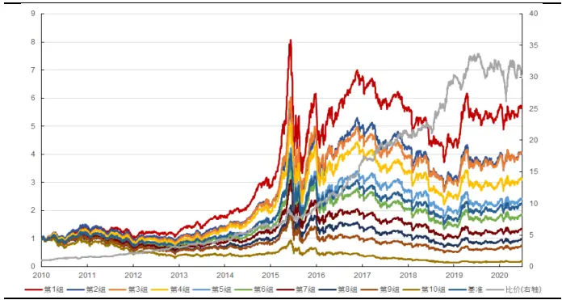
资料来源：天软科技，长江证券研究所

图8:中证800每笔成交量差分绝对值均值因子回测净值
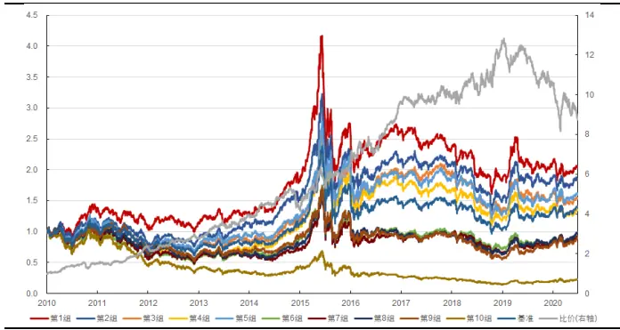
资料来源：天软科技，长江证券研究所

表6:每笔成交量差分绝对值均值因子分年风险指标

| 全市场 |  |  |  |  |  | 中证800 |  |  |
| --- | --- | --- | --- | --- | --- | --- | --- | --- |
|  | 超额收益(%) | 信息比 | 多空收益(%) | 多空夏普比 | 超额收益(%) | 信息比 | 多空收益(%) | 多空夏普比 |
| 2010 | 14.40 | 1.80 | 50.51 | 2.93 | 26.45 | 2.14 | 46.04 | 2.17 |
| 2011 | 15.76 | 2.19 | 36.52 | 2.41 | 16.85 | 1.84 | 48.20 | 2.57 |
| 2012 | 10.70 | 1.69 | 36.26 | 2.64 | 1.52 | 0.24 | 16.63 | 1.16 |
| 2013 | 7.07 | 0.92 | 41.59 | 2.63 | 1.52 | 0.23 | 37.19 | 2.20 |
| 2014 | 10.08 | 1.35 | 30.69 | 1.94 | 1.36 | 0.23 | 5.18 | 0.41 |
| 2015 | 3.98 | 0.45 | 54.66 | 2.27 | -3.21 | -0.23 | 47.21 | 1.85 |
| 2016 | 20.94 | 3.23 | 69.87 | 4.32 | 10.94 | 1.51 | 42.10 | 2.33 |
| 2017 | 0.38 | 0.10 | 21.69 | 1.63 | -10.89 | -2.15 | 0.88 | 0.13 |
| 2018 | 7.34 | 1.00 | 36.88 | 2.19 | 10.30 | 1.35 | 22.46 | 1.31 |
| 2019 | 1.81 | 0.33 | 6.33 | 0.58 | -11.67 | -1.98 | -17.00 | -1.33 |
| 2020 | -12.81 | -1.48 | -18.60 | -0.99 | -17.54 | -1.94 | -36.59 | -2.03 |
| 总计 | 7.95 | 1.10 | 34.13 | 2.12 | 2.60 | 0.35 | 19.07 | 1.15 |

资料来源：天软科技，长江证券研究所

事实上，除每笔成交量数据外，使用其他数据构建的差分绝对值均值因子也有较好的回测表现，下表对相关因子回测表现进行了汇总。可以看到，所有因子均表现出了相同的正向收益能力(IC和ICIR为正)，说明差分提取时间序列信息的方法适用于多种数据。分市场来看，所有因子在中证800中的表现都明显弱于在全市场中的表现。另外，振幅差分绝对值均值因子的超额收益较高而多空收益明显低于其他三个因子，说明该因子的空头收益相对较弱。

表7：差分绝对值均值因子收益风险表现汇总

| 全市场 中证800 |  |  |  |  |  |  |  |
| --- | --- | --- | --- | --- | --- | --- | --- |
| 成交量差分绝对成交笔数差分绝每笔成交量差分振幅差分绝对值成交量差分绝对成交笔数差分绝每笔成交量差分振幅差分绝对值 |  |  |  |  |  |  |  |
|  | 值均值 | 对值均值 | 绝对值均值 | 均值 | 值均值 | 对值均值 | 绝对值均值 均值 |
| IC(%) | 9.96 | 9.17 | 9.39 | 5.97 | 6.57 | 5.67 6.16 | 3.09 |
| ICIR(%) | 70.31 | 68.54 | 69.63 | 39.95 | 39.82 | 35.85 38.72 | 18.76 |
| 超额收益(%) | 8.99 | 5.15 | 7.95 | 8.93 | 2.46 | 2.41 2.60 | 3.75 |
| 信息比 | 1.32 | 0.77 | 1.10 | 1.36 | 0.36 | 0.34 0.35 | 0.56 |
| 多空收益(%) | 33.88 | 27.15 | 34.13 | 19.21 | 15.10 | 12.04 19.07 | 8.46 |
| 多空夏普比 | 2.05 | 1.78 | 2.12 | 1.41 | 0.94 | 0.77 | 1.15 0.67 |

资料来源：天软科技，长江证券研究所

## 数据频率的影响

上述差分绝对值均值因子全部使用1分钟频率的数据构建。由于差分方法旨在度量数据在时间序列上的局部峰值，而这些峰值随着数据频率的降低很容易被平静期的噪声平滑掉，因而可以预见的是因子对数据频率的敏感性较高。下表汇总了不同频率数据下因子的回测表现：

表8：不同数据频率下差分绝对值均值因子的全市场收益风险表现

| 数据频率 IC(%) ICIR(%)超额收益(%)信息比 多空收益(%) 多空夏普比 |  |  |  |  |
| --- | --- | --- | --- | --- |
| 成交量差分绝对 值均值 | 1分钟 | 9.96 70.31 | 8.99 1.32 | 33.88 2.05 |
|  | 5分钟 | 7.28 53.19 | 4.37 | 0.64 20.92 1.43 |
|  | 15分钟 1.72 | 14.45 -4.37 | -0.62 | 0.54 0.11 |
| 成交笔数差分绝 对值均值 | 1分钟 | 9.17 68.54 5.15 | 0.77 | 27.15 1.78 |
|  | 5分钟 | 3.78 29.09 | 0.89 0.16 | 7.47 0.64 |
|  | 15分钟 | -3.58 -30.35 | -1.26 -0.12 | 8.15 0.71 |
| 每笔成交量差分 绝对值均值 | 1分钟 | 9.39 69.63 7.95 | 1.10 | 34.13 2.12 |
|  | 5分钟 | 8.78 66.80 | 5.70 | 0.81 31.98 2.00 |
|  | 15分钟 | 8.27 64.57 | 4.72 0.66 | 29.34 1.85 |
| 振幅差分绝对值 均值 | 1分钟 | 5.97 39.95 8.93 | 1.36 | 19.21 1.41 |
|  | 5分钟 | -0.36 -2.29 | 0.94 | 0.17 3.48 0.31 |
|  | 15分钟 | -2.75 -21.90 -4.30 | -0.47 | 2.57 0.27 |

资料来源：天软科技，长江证券研究所

可以看到，除每笔成交量因子外，其余因子的表现均随数据频率的提高快速下降，15分钟频率下的这些因子已经基本无效，成交笔数因子和振幅因子还表现出了与最初的波动类因子相同的负向收益能力。因此，在数据频率较低时，通过差分提取时间序列信息的做法是无效的。

另一方面，随数据频率的降低，每笔成交量差分绝对值均值因子的表现下降地较为缓慢，这似乎表明该因子与其他因子有所区别。对此现象一个可能的解释是，每笔成交量数据中的信息含量可能超过其他数据，这使得用此数据构造的因子对构造方法与数据频率的敏感性更低。换言之，相对于成交量、成交笔数等数据而言，每笔成交量出现局部峰值更能表征趋势交易者或知情交易者的交易行为。

## 通过波峰计数提取时间序列信息波峰计数的逻辑起点

上一节中指出，差分提取时间序列信息的有效性来源于对数据局部峰值的度量，这种局部峰值可能是对趋势交易者或知情交易者交易行为的刻画。然而，差分后求绝对值均值的方法使用了全部240根K线计算因子值，这有可能使得因子值受到平静期累计扰动的影响而不能反映出局部峰值的性质。

那么，我们能否取差分绝对值较大的数据计算其均值？本文做了这样的尝试，但结果并不理想，其原因在于一旦我们对所有个股设定相同的阈值进行筛选(例如筛选成交量差分绝对值的前20%)，我们便假定了超过该阈值的数据对于该个股而言均为局部峰值，但实际上每只个股出现峰值的情况都不相同。

事实上，在差分方法之外，对局部峰值的度量有一种更原始而简单的方法计数。以成交量为例，成交量波峰计数因子较相应差分因子而言具有更明确的含义，即出现日内“放量”现象次数更多的股票可能有更多的趋势或知情交易者参与交易，进而在未来一段时间内有更高的收益率。然而另一方面，如何定义并识别一次局部峰值，将对该因子的有效性产生非常大的影响。本文所使用的识别局部峰值的方法分为以下两个步骤：

(1) 考虑到只有超过均值一定程度的数据才会被认定为局部峰值，计算全部 240根K线数据的均值与标准差，筛选出大于(均值+1倍标准差)的数据；

(2) 考虑到相邻的分钟数据应当被视作同一个局部峰值，计算上一步筛选出的每一分钟与前一分钟之间的时间差，只有时间差超过1分钟(即相隔超过1根K线)时，该分钟数据才会被保留。

经过两轮筛选后，剩余的数据全部被视作局部峰值，其个数作为当日该个股的因子值，而最终调仓日的因子值仍为过去20个交易日因子值的均值。

下图仍以2020年6月30日浦发银行(600000.SH)的分时成交量为例，对波峰计数因子的构造方法做进一步的说明。左图中用蓝色标记出了第一步筛选后保留的分钟，右图中用蓝色标记出了两步筛选都完成后保留的分钟，可以看到右图中蓝色的连续区间消失了，每根蓝色线之间都相隔较远，它们便是最终被识别出的局部峰值。

图9：2020年6月30日浦发银行成交量局部峰值(第一步筛选后)
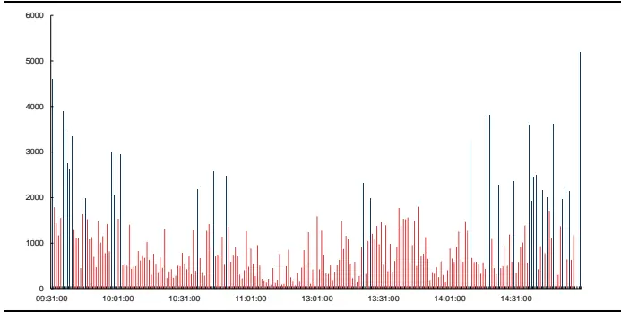
资料来源：天软科技，长江证券研究所

图10：2020年6月30日浦发银行成交量局部峰值(第二步筛选后)
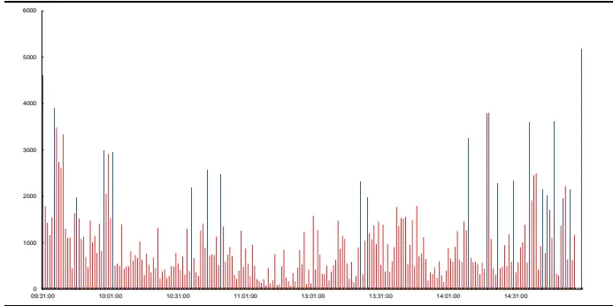
资料来源：天软科技，长江证券研究所

## 成交量波峰计数因子

依照上述步骤，本文构建了成交量波峰计数因子。下图分别展示了该因子自2010年以来在全市场及中证800内表现，并在下表中给出了其分年风险指标，可以看到：

总体上看，与上一节的差分因子相比，成交量波峰计数因子在多空收益能力上略有提升，但收益稳定性大幅提升。样本区间内，其在全市场取得了年化39.08%的多空收益和7.10%的超额收益，多空夏普比和信息比分别达到3.41和1.61，而与之对应的成交量差分绝对值均值因子的多空夏普比和信息比则只有2.05和1.32。在中证800中，因子的收益能力相对较弱，但多空收益和超额收益的水平和稳定性仍有提升；

分组表现上看，该因子在全市场和中证800中的分组线性均较好，空头表现稍强于多头；

分年度表现上看，全市场中该因子所有年度的多空收益都为正而超额收益只在2011年和2014年出现过微小的相对回撤，中证800中该因子在近两年出现了一定的回撤。

图11:全市场成交量波峰计数因子回测净值
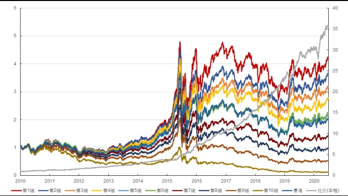
资料来源：天软科技，长江证券研究所

图12:中证800成交量波峰计数因子回测净值
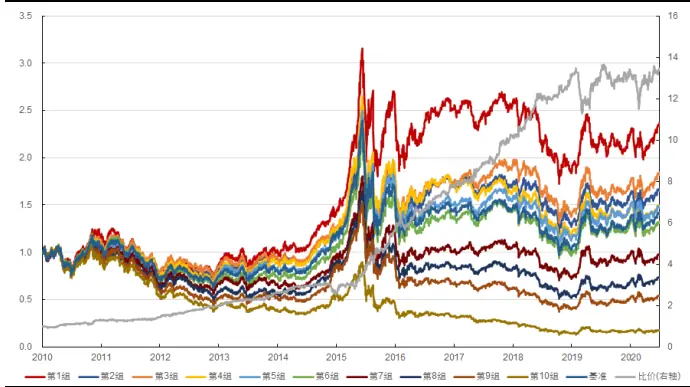
资料来源：天软科技，长江证券研究所

表9：成交量波峰计数因子分年风险指标

| 全市场 |  |  |  |  |  | 中证800 |  |  |  |
| --- | --- | --- | --- | --- | --- | --- | --- | --- | --- |
|  | 超额收益(%) | 信息比 | 多空收益(%) | 多空夏普比 | 超额收益(%) | 信息比 | 多空收益(%) |  | 多空夏普比 |
| 2010 | 8.05 | 1.35 | 32.61 | 2.65 | 11.68 | 1.82 | 27.35 |  | 2.18 |
| 2011 | -2.15 | -0.56 | 17.45 | 2.31 | -5.00 | -1.29 | 10.95 |  | 1.34 |
| 2012 | 6.32 | 1.72 | 33.99 | 4.54 | 8.93 | 2.19 |  | 38.17 | 4.72 |
| 2013 | 7.95 | 2.06 | 39.49 | 3.96 | 7.62 | 1.52 |  | 29.93 | 2.72 |
| 2014 | -0.37 | -0.09 | 11.34 | 1.25 | -5.16 | -0.94 |  | -3.84 | -0.28 |
| 2015 | 32.27 | 4.04 | 116.79 | 5.35 | 31.34 | 2.69 |  | 107.85 | 3.31 |
| 2016 | 11.94 | 3.49 | 45.16 | 4.60 | 10.06 |  | 1.99 | 35.73 | 3.04 |
| 2017 | 2.97 | 0.96 | 43.03 | 4.06 | -0.16 |  | -0.02 | 28.36 | 2.52 |
| 2018 | 9.00 | 2.60 | 47.70 | 4.39 | 2.03 |  | 0.52 | 27.08 | 2.96 |
| 2019 | 0.61 | 0.18 | 29.52 | 2.35 | -7.16 |  | -1.35 | -0.58 | 0.02 |
| 2020 | 3.60 | 0.74 | 31.99 | 2.31 | -0.73 |  | -0.07 | -0.83 | 0.02 |
| 总计 | 7.10 | 1.61 | 39.08 | 3.41 | 4.61 |  | 0.82 | 25.77 | 1.95 |

资料来源：天软科技，长江证券研究所

差分因子与波峰计数因子的构建方法具有明显不同，但二者表现出相似的正向收益能力，证明二者具有相同的逻辑基础。另一方面，波峰计数因子在收益能力的稳定性上明显超过差分因子，这表明相较于差分而言波峰计数是识别局部峰值更有效的手段。

## 相关参数的影响

上一节探讨数据频率对差分因子的影响时曾指出，数据的局部波峰在数据频率降低时会被平滑掉，因而差分因子的有效性对数据频率十分敏感。同样的逻辑也适用于波峰计数因子，因而此处不再讨论数据频率的影响，默认使用1分钟数据构建因子。

然而，在波峰计数因子的构建过程中，仍有两个重要参数的影响是值得探讨的。在第一步筛选中，我们主观地将阈值设定为(均值+1倍标准差)，其中偏离均值的标准差倍数决定了第一步筛选后留下的分钟数量。在第二步筛选中，我们将最小时间间隔设为1分钟，这影响了最终识别出的波峰的数量。换言之，这两个参数决定了我们识别波峰时的苛刻程度，参数的取值越大，则要求波峰的峰值更高、相互之间间隔更大。

为了探讨相关参数对成交量波峰计数因子表现的影响，下表汇总了不同参数下构建的因子在全市场中的回测表现，可以看到：

对于最小时间间隔这一参数而言，参数取值为0分钟时因子基本无效。从逻辑上看，该取值意味着不做第二步筛选，大量连续区间的保留使因子失效，这也从反面证明了添加最小时间间隔这一参数以筛选出真正峰值的重要性。

对于标准差倍数这一参数而言，参数取值为0倍时因子收益能力有所下降。从逻辑上看，该取值意味着第一步筛选中保留所有成交量大于当日均值的分钟，其对波峰的要求过低、筛选出的分钟数过多，进而对因子表现产生了一定影响。

在最小时间间隔取值为1分钟或5分钟、标准差倍数取值为1倍或2倍时，因子的收益能力基本没有变化，表明成交量波峰计数因子对参数的敏感性并不高。

表10：不同参数取值下成交量波峰计数因子的全市场收益风险表现

| 标准差倍数 最小时间间隔 IC(%) ICIR(%) 超额收益(%) 信息比 多空收益(%) 多空夏普比 |  |  |  |  |
| --- | --- | --- | --- | --- |
| 0倍 | 0分钟 | -1.54 -12.99 | -5.48 -0.79 | -1.05 -0.02 |
|  | 1分钟 | 11.19 111.22 | 7.09 | 1.52 38.71 2.81 |
|  | 5分钟 | 9.57 79.75 | 5.48 0.86 | 32.46 2.08 |
| 1倍 | 0分钟 | -0.24 -2.33 | -3.17 -0.47 | 6.33 0.60 |
|  | 1分钟 | 9.16 108.23 | 7.10 1.61 | 39.08 3.41 |
|  | 5分钟 | 10.78 114.73 | 7.42 1.64 | 40.17 3.09 |
| 2倍 | 0分钟 | 1.13 16.48 | 1.13 -0.24 | 10.37 1.27 |
|  | 1分钟 | 8.86 | 101.47 6.18 | 1.41 35.57 3.19 |
|  | 5分钟 | 10.03 108.44 | 7.02 1.56 | 37.83 3.08 |

资料来源：天软科技，长江证券研究所

## 调仓频率的影响

高频因子中信息的时效性比传统价量因子更强，因而缩短调仓频率带来的因子收益能力增强较传统价量因子更为显著。在此情况下，缩短调仓频率后因子扣费后的超额收益能力能否提升取决于因子自身收益能力的增强能否覆盖缩短调仓频率所增加的交易费用。

以成交量数据为例，下表给出了相应差分绝对值均值因子和波峰计数因子在不同调仓频率下的表现(信息区间仍保持在20个交易日不变)，可以看到：

对于成交量差分绝对值均值因子而言，将调仓频率从20日缩短至10日时因子表现略有提升但并不显著，而将调仓频率从10日缩短至5日时因子表现几乎没有变化，即缩短调仓频率带来的因子收益增强与交易成本上升几乎抵消。

对于成交量波峰计数因子而言，调仓频率从20日缩短至5日的过程中，因子的多空收益和超额收益均显著提升，即调仓频率缩短所带来的收益增强显著超过了其带来的交易成本上升，这表明该因子中的信息时效性更强。

表11:不同调仓频率下成交量波峰计数因子的全市场收益风险表现

| 数据频率 IC(%) ICIR(%）超额收益(%)信息比 多空收益(%) 多空夏普比 |  |  |  |  |
| --- | --- | --- | --- | --- |
| 成交量差分绝对 值均值 | 5日 6.12 49.40 | 9.53 | 1.37 38.71 | 2.19 |
|  | 10 日 8.50 | 64.30 9.92 | 1.42 39.29 | 2.24 |
|  | 20 日 9.96 70.31 |  | 8.99 1.32 | 33.88 2.05 |
| 成交量波峰计数 | 5日 7.18 | 89.63 9.03 1.97 | 56.65 | 4.33 |
|  | 10 日 8.60 | 102.30 8.36 1.83 | 49.77 | 4.01 |
|  | 20 日 9.16 | 108.23 7.10 1.61 |  | 39.08 3.41 |

资料来源：天软科技，长江证券研究所

## 风格中性后的因子表现

下表给出了本文中主要因子的风格暴露情况，可以看到：

- 各个因子在盈利、价值、成长三个基本面因子上几乎没有暴露；

三个高频波动因子在波动风格上的正向暴露最大、在反转和流动性风格上也有一定的暴露，差分绝对值因子在Beta、规模、波动、流动性风格上均有一定的负向暴露，而成交量波峰计数因子在反转、波动和流动性因子上有一定的负向暴露；

虽然差分因子和波峰计数因子度量的是数据的局部峰值，但最终多头组选出的、局部峰值出现较多的股票在过去20个交易日的波动却较低，这证明了这些因子与传统波动因子之间的不同。

表12:文中主要因子的风格暴露情况

| 盈利 价值 成长 Beta 规模 反转 波动 流动性 |  |  |  |  |  |  |  |  |
| --- | --- | --- | --- | --- | --- | --- | --- | --- |
| 高频成交量波动 | -0.01 | 0.02 | -0.01 | 0.00 | -0.08 | 0.23 | 0.43 | 0.20 |
| 高频成交笔数波动 | -0.01 | 0.01 | -0.01 | 0.01 | -0.11 | 0.25 | 0.42 | 0.21 |
| 高频振幅波动 | -0.01 | 0.01 | -0.01 | -0.06 | -0.18 | 0.19 | 0.34 | 0.17 |
| 成交量差分绝对值均值 | -0.02 | -0.01 | -0.04 | -0.26 | -0.36 | -0.06 | -0.36 | -0.40 |
| 成交笔数差分绝对值均值 | -0.03 | 0.00 | 0.01 | -0.17 | -0.33 | -0.15 | -0.43 | -0.43 |
| 每笔成交量差分绝对值均值 | -0.03 | 0.02 | 0.00 | -0.23 | -0.33 | -0.07 | -0.33 | -0.42 |
| 振幅差分绝对值均值 | -0.01 | -0.02 | -0.02 | -0.17 | -0.56 | -0.04 | -0.16 | -0.14 |
| 成交量波峰计数 | 0.01 | -0.05 | 0.01 | 0.01 | -0.08 | -0.29 | -0.47 | -0.37 |

资料来源：天软科技，长江证券研究所

下表给出了本文中主要因子风格中性前后的全市场表现，可以看到：

因子在风格中性后表现均有较为明显下降。

三个高频波动因子在中性后基本失去了超额收益能力，但仍保留了一定的多空收益能力;

差分绝对值因子中，成交笔数因子和振幅因子在中性后基本失去选股能力，成交量和每笔成交量因子失去超额收益能力，仍有一定的多空收益能力。

成交量波峰计数因子在中性化后仍有一定选股能力。

表13：文中主要因子风格中性前后的全市场收益风险表现

| IC(%) ICIR(%) 超额收益(%) 信息比 多空收益(%) 多空夏普比 |  |  |  |  |
| --- | --- | --- | --- | --- |
| 高频成交量波动 | 中性前 -6.82 | -110.47 | 6.27 1.62 20.84 | 2.87 |
|  | 中性后 -2.48 | -37.89 -1.63 | -0.24 | 9.42 1.20 |
|  | 中性前 -5.95 高频成交笔数波 | -82.26 | 4.57 0.98 | 19.03 2.24 |
| 动 高频振幅波动 | 中性后 -2.33 | -29.84 -0.56 | -0.05 | 10.88 1.15 |
|  | 中性前 -4.75 | -64.70 | 3.13 0.69 | 16.15 2.00 |
| 成交量差分绝对 | 中性后 -2.61 | -35.99 0.22 | 0.07 | 10.47 1.20 |
|  | 中性前 9.96 | 70.31 | 8.99 1.32 | 33.88 2.05 |
| 值均值 成交笔数差分绝 | 中性后 | 4.31 42.31 -0.06 | 0.02 | 13.49 1.32 |
|  | 中性前 9.17 | 68.54 | 5.15 0.77 | 27.15 1.78 |
| 对值均值 每笔成交量差分 | 中性后 | 2.73 27.62 -5.02 | -0.85 | 3.73 0.43 |
|  | 中性前 9.39 | 69.63 | 7.95 1.10 | 34.13 2.12 |
| 绝对值均值 振幅差分绝对值 | 中性后 4.35 | 44.70 -0.20 | 0.00 15.57 | 1.52 |
|  | 中性前 5.97 | 39.95 8.93 | 1.36 | 19.21 1.41 |
| 均值 | 中性后 0.99 | 11.21 1.14 | 0.22 | 4.91 0.59 |
|  |  |  |  | 39.08 |
| 成交量波峰计数 | 中性前 9.16 | 108.23 7.10 | 1.61 | 3.41 |
|  | 中性后 3.88 | 61.60 1.62 | 0.34 | 18.45 2.04 |

资料来源：天软科技，长江证券研究所

下图分别展示了风格中性后的成交量波峰计数因子自2010年以来在全市场及中证800内表现，并在下表中给出了其分年风险指标，可以看到：

总体上看，风格中性后的成交量波峰计数因子仍然较为有效，其在全市场取得了年化18.45%的多空收益和1.62%的超额收益，多空夏普比和信息比分别达到2.04和0.34,在中证800中收益能力更强；

分组表现上看，该因子在全市场和中证800中的分组能力均较好，空头与多头强度基本相同；

分年度表现上看，全市场中该因子所有年份的多空收益均为正，超额收益在2014、2015以及2019年牛市行情中出现了一定的相对回撤；中证800 中因子在2014年的回撤更加明显，但其余年份基本能够实现稳定的多空收益与超额收益。

图13:全市场成交量波峰计数因子(风格中性后)回测净值
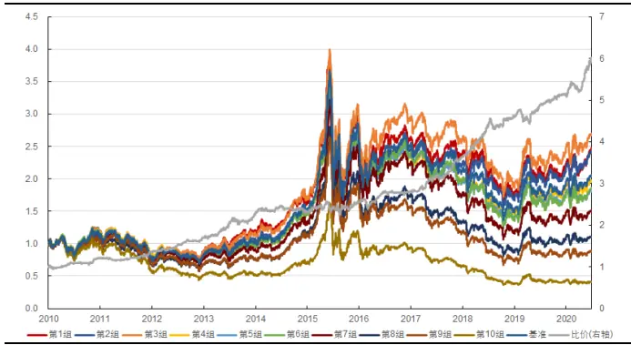
资料来源：天软科技，长江证券研究所

图14:中证800成交量波峰计数因子(风格中性后)回测净值
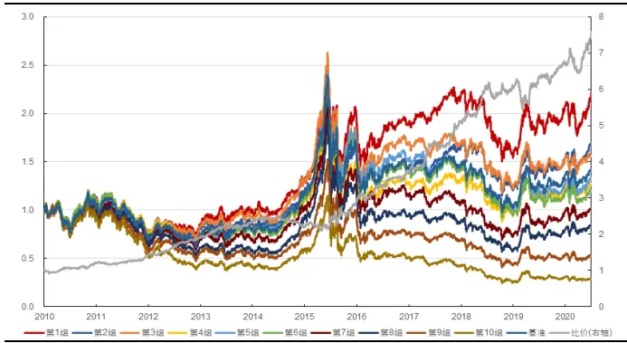
资料来源：天软科技，长江证券研究所

表14：成交量波峰计数因子(风格中性后)分年风险指标

| 全市场 |  |  |  |  |  | 中证800 |  |  |
| --- | --- | --- | --- | --- | --- | --- | --- | --- |
|  | 超额收益(%) | 信息比 | 多空收益(%) | 多空夏普比 | 超额收益(%) | 信息比 | 多空收益(%) | 多空夏普比 |
| 2010 | 2.18 | 0.41 | 22.62 | 2.12 | 6.19 | 0.97 | 21.82 | 2.01 |
| 2011 | -1.60 | -0.45 | 10.60 | 1.75 | -0.91 | -0.19 | 15.22 | 1.98 |
| 2012 | 5.88 | 1.46 | 25.54 | 3.70 | 7.69 | 1.58 | 34.17 | 4.39 |
| 2013 | 9.51 | 1.35 | 34.00 | 2.68 | 7.06 | 1.08 | 21.56 | 2.09 |
| 2014 | -6.95 | -1.53 | 2.88 | 0.40 | -10.07 | -1.96 | -6.04 | -0.75 |
| 2015 | -3.18 | -0.32 | 7.67 | 0.60 | 5.81 | 0.53 | 21.28 | 1.02 |
| 2016 | -1.92 | -0.46 | 10.13 | 1.45 | 7.32 | 1.23 | 26.83 | 2.54 |
| 2017 | 7.90 | 2.02 | 28.96 | 3.97 | 12.63 | 2.04 | 34.84 | 3.31 |
| 2018 | 4.36 | 1.14 | 28.12 | 3.51 | 2.39 | 0.42 | 19.56 | 2.10 |
| 2019 | -2.16 | -0.59 | 10.59 | 1.73 | -0.25 | -0.01 | 8.74 | 0.85 |
| 2020 | 9.86 | 2.01 | 38.09 | 4.18 | 3.10 | 0.46 | 26.28 | 2.00 |
| 总计 | 1.62 | 0.34 | 18.45 | 2.04 | 3.56 | 0.56 | 19.48 | 1.70 |

资料来源：天软科技，长江证券研究所

## 总结

高频波动因子从频率和数据类型两方面对传统波动因子进行了拓展。传统的波动因子以日度收益率数据为基础构建，本文从数据频率和数据类型两方面对其进行了拓展。其中，表现最好的1分钟频率下的高频成交量波动因子在全市场中取得了年化20.84%的多空收益和6.27%的超额收益，多空夏普比和信息比分别达到2.87和1.62，且在近两年没有出现明显回撤。在波动因子的高频化过程中，采用的因子构建方式对因子表现影响较大；先计算日内标准差再计算日间标准差最后除以均值去量纲被证明是较好的构建方式，其优势在于同时提取了日内波动与日间波动中的信息。

差分能提取数据中的时间序列信息，差分标准差因子表现出正向收益能力。波动类因子传统上都采用计算标准差的方式构建，其只关注数据的截面分布，而实际中数据在时间序列上的顺序中很可能含有信息。先差分再计算标准差是一种提取数据中时间序列信息的方法，此方法下构建的因子表现出因子值越大收益越高的正向收益能力，说明其已经不涉及对波动的表征，而可能是对趋势交易者或知情交易者交易行为的刻画。其中，表现最好的每笔成交量差分标准差因子在全市场中取得了年化24.22%的多空收益和3.00%的超额收益，多空夏普比和信息比分别达到1.76和0.51。

将标准差改为均值能显著提高差分因子表现，该因子对数据频率很敏感。差分因子表现出正向收益能力，而计算标准差所希望度量的波动表现出负向收益能力，二者相互抵消会降低因子整体的收益能力。因此，将标准差改为均值能显著提高差分因子的表现，其中日内在计算均值前需要先取绝对值。采用这种方式构建的因子中，表现最好的成交量差分绝对值均值因子在全市场中取得了年化34.13%的多空收益和7.95%的超额收益，多空夏普比和信息比分别达到2.12和1.10，风格中性后月度IC和ICIR仍有4.35%和44.70%。该因子对数据频率的敏感性很高，当数据频率降低到15分钟时因子已基本失去收益能力。

波峰计数因子度量局部峰值能力最强，缩短调仓频率因子表现进一步提升。差分提取时间序列信息的有效性来源于对数据局部峰值的度量，而对波峰计数是度量局部峰值更简单也更有效的方法。本文使用的识别局部峰值的方法分为两个步骤：第一步筛选出大干(均值+1倍标准差)的数据；第二步计算上一步筛选出的每一分钟与前一分钟之间的时间差，保留时间差超过1分钟的分钟数据。使用这种方法构建的成交量波峰计数因子在本文所有因子中回测表现最好，在收益水平和稳定性上均胜过上述差分因子。该因子在全市场中取得了年化39.08%的多空收益和7.10%的超额收益，多空夏普比和信息比分别达到3.41和 1.61，风格中性后月度IC和ICIR仍有3.88%和61.60%。缩短调仓频率能进一步提升该因子的收益表现，当调仓频率为5日时，因子在全市场中取得了年化56.65%的多空收益和9.03%的超额收益，多空夏普比和信息比分别达到4.33和1.97。

## 投资评级说明

行业评级报告发布日后的12个月内行业股票指数的涨跌幅相对同期沪深300指数的涨跌幅为基准，投资建议的评级标准为：

看好：相对表现优于市场

中性：相对表现与市场持平

看淡：相对表现弱于市场

公司评级报告发布日后的12个月内公司的涨跌幅相对同期沪深300指数的涨跌幅为基准，投资建议的评级标准为：

买入：相对大盘涨幅大于10%

增持：相对大盘涨幅在 5%～10%之间

中性：相对大盘涨幅在-5%～5%之间

减持：相对大盘涨幅小于-5%

无投资评级：由于我们无法获取必要的资料，或者公司面临无法预见结果的重大不确定性事件，或者其他原因，致使我们无法给出明确的投资评级。

相关证券市场代表性指数说明：A股市场以沪深300指数为基准；新三板市场以三板成指（针对协议转让标的）或三板做市指数（针对做市转让标的）为基准；香港市场以恒生指数为基准。

## 办公地址：

上海

Add/浦东新区世纪大道1198号世纪汇广场一座29层P.C / (200122)

武汉
Add/武汉市新华路特8号长江证券大厦11楼
P.C /(430015)

北京

Add/西城区金融街33号通泰大厦 15层

P.C /(100032)

深圳

Add/深圳市福田区中心四路1号嘉里建设广场3期36楼P.C / (518048)

## 分析师声明：

作者具有中国证券业协会授予的证券投资咨询执业资格并注册为证券分析师，以勤勉的职业态度，独立、客观地出具本报告。分析逻辑基于作者的职业理解，本报告清晰准确地反映了作者的研究观点。作者所得报酬的任何部分不曾与，不与，也不将与本报告中的具体推荐意见或观点而有直接或间接联系，特此声明。

## 重要声明：

长江证券股份有限公司具有证券投资咨询业务资格，经营证券业务许可证编号：10060000。

本报告仅限中国大陆地区发行，仅供长江证券股份有限公司（以下简称：本公司）的客户使用。本公司不会因接收人收到本报告而视其为客户。本报告的信息均来源于公开资料，本公司对这些信息的准确性和完整性不作任何保证，也不保证所包含信息和建议不发生任何变更。本公司已力求报告内容的客观、公正，但文中的观点、结论和建议仅供参考，不包含作者对证券价格涨跌或市场走势的确定性判断。报告中的信息或意见并不构成所述证券的买卖出价或征价，投资者据此做出的任何投资决策与本公司和作者无关。

本报告所载的资料、意见及推测仅反映本公司于发布本报告当日的判断，本报告所指的证券或投资标的的价格、价值及投资收入可升可跌，过往表现不应作为日后的表现依据；在不同时期，本公司可以发出其他与本报告所载信息不一致及有不同结论的报告；本报告所反映研究人员的不同观点、见解及分析方法，并不代表本公司或其他附属机构的立场；本公司不保证本报告所含信息保持在最新状态。同时，本公司对本报告所含信息可在不发出通知的情形下做出修改，投资者应当自行关注相应的更新或修改。

本公司及作者在自身所知情范围内，与本报告中所评价或推荐的证券不存在法律法规要求披露或采取限制、静默措施的利益冲突。

本报告版权仅为本公司所有，未经书面许可，任何机构和个人不得以任何形式翻版、复制和发布。如引用须注明出处为长江证券研究所，且不得对本报告进行有悖原意的引用、删节和修改。刊载或者转发本证券研究报告或者摘要的，应当注明本报告的发布人和发布日期，提示使用证券研究报告的风险。未经授权刊载或者转发本报告的，本公司将保留向其追究法律责任的权利。