# 高频因子（十）：量价关系中的反转微观结构

分析师及联系人

[Table_A● 覃川桃 (8621)61118766 qinct@cjsc.com.cn 执业证书编号： S0490513030001 ● 郑起 (8621)61118706 zhengqi2@cjsc.com 执业证书编号： S0490520060001

# 报告要点

报告日期 2021-01-28

金融工程专题报告

## 相关研究

- 《2020全年基金净流入额为三轮牛市中最高》2021-01-24

- 《港股“新经济”VS“旧经济”：南向资金流向何方？》2021-01-23

- 《基于北上资金的行业配置（II）：“配置型”VS“交易型”资金净流入的行业轮动策略》2021-01-17

## 基础因子研究（十六）

# [Table_Title] 高频因子（十）：量价关系中的反转微观结构

## [Table_Summary] ⚫ 成交活跃并产生价格变动是反转效应的主要原因

以成交量、收益率绝对值为分组变量对收益率序列进行划分，成交量较大的时间段价格变动呈现强反转，成交量较小的时间段无反转效应，收益率绝对值较大的时间段价格变动呈现强反转，收益率绝对值较小的时间段价格变动呈现弱动量。成交量加权构建的高频反转因子放大了成交量较大时间段的价格变动表达，降低了成交量较小时间段的价格表达，通过“降噪”的方式改进反转因子表现。

## ⚫ 每笔成交量同时衡量了成交活跃和价格变动的确定性

以每笔成交量为分组变量对收益率序列进行划分，每笔成交量较大的时间段价格变动呈现强反转，每笔成交量较小的时间段呈现强动量。每笔成交量筛选的局部反转因子(最大值组)选取了具有反转效应的价格变动，通过“提纯”的方式改进反转因子表现，在全市场获得年化 8.20%的超额收益和 33.08%的多空收益，信息比和多空夏普比分别达到1.88 和 2.93。

## ⚫ 每笔成交量收益率相关性因子整合了全部时间段的价格变动信息

每笔成交量与收益率之间的相关系数，本质为以每笔成交量与自身均值之差为权重对收益率序列进行加权，可以有效地将不同每笔成交量下的价格变动信息进行整合。每笔成交量收益率相关性因子在全市场获得了年化 7.25%的超额收益和 25.74%的多空收益，风格中性后，年化超额收益和多空收益分别为 4.04%和 18.74%。

## 量价相关性因子整合了不同价格分组下的成交量因子信息

量价相关性因子本质上是以价格与自身均值差为权重对成交量序列进行加权，收益来源于不同价格区间中成交量收益能力的不同，即高位成交较多的个股未来收益率较低，而低位成交较多的个股未来收益率较高。量价相关性因子在全市场获得了年化 4.15%的超额收益和 18.13%的多空收益，风格中性后，年化超额收益和多空收益分别为 5.63%和18.55%。

## ⚫ 合成因子在风格中性前后均有较强的选股能力

本文以等权的方式合成每笔成交量筛选的局部反转因子(最大值组)、每笔成交量收益率相关性因子以及量价相关性因子，风格中性后，在全市场获得了年化 7.45%的超额收益和 28.22%的多空收益，信息比和多空夏普比分别为 1.49 和 3.33，中证 800 内获得了年化 6.72%的超额收益和 22.49%的多空收益，信息比和多空夏普比分别为 0.95 和1.85。

## [Table_Ris风险提示：

1. 模型存在失效风险；

2. 本文举例均基于历史数据，不保证未来收益。

## 成交量如何增强反转效应

反转效应源于资产在交易过程中价格和价值的偏离，在 A 股市场中往往表现为过去上涨较多的个股会在未来一段时间内有一定的回调，而过去下跌较多的个股会在未来一段时间内呈现一定的反弹。传统的反转因子通常定义为个股过去一个月的收益率，因子有获取超额收益的能力，但存在波动较大、回撤区间较多、分组线性不佳等问题。

在《高频因子(二)：结构化反转因子》中，我们给出了一种利用高频数据对传统反转因子进行改进的方法，即使用对应时间段内的成交量对收益率进行加权：

$$
\dot{\Xi}\dot{\Xi}\dot{\mathcal{N}}\dot{\Xi}\dot{\Xi}\dot{\Xi}\boxed{\mathcal{D}}\mp\frac{\dot{\Xi}\dot{\Xi}}{\Xi}\boxed{\Xi}\mp\frac{\sum vol_{i}\times ret_{i}}{\sum vol_{i}}
$$

其中 $ret_{i}$ 为每个时间段的对数收益率，vol 为对应时间段的的成交量。

以 5 分钟频率的 k 线数据构建因子为例1，下图对比了高频反转因子和传统反转因子自2010 年以来在全市场内的分组表现，并在下表中给出了其分年风险指标，可以看到：

整体上看，高频反转因子的选股能力优于传统反转因子，表现在多头端和空头端的收益更高，风险收益比更高；

分年度表现上看，高频反转因子的多空收益在所有年份均为正，超额收益在 2014年、2017 年和 2020 年产生相对回撤，与传统反转因子相比时间序列上的表现更为稳定。

图 1：全市场高频反转因子回测净值
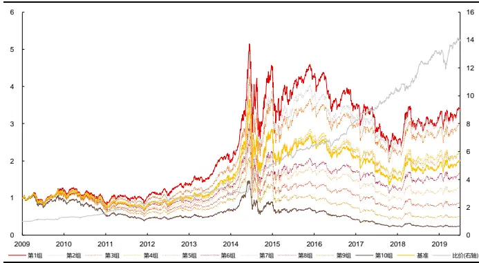
资料来源：天软科技，长江证券研究所

图 2：全市场传统反转因子回测净值
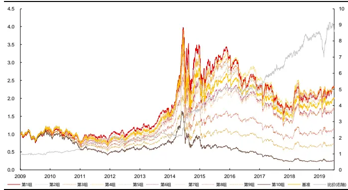
资料来源：天软科技，长江证券研究所

表 1：全市场高频反转因子和传统反转因子分年风险指标

| 高频反转因子 |  |  |  |  | 传统反转因子 |  |  |  |
| --- | --- | --- | --- | --- | --- | --- | --- | --- |
|  | 超额收益(%) | 信息比 | 多空收益(%) | 多空夏普比 | 超额收益(%) | 信息比 | 多空收益(%) | 多空夏普比 |
| 2010 | 6.87 | 1.11 | 27.66 | 2.29 | -3.45 | -0.33 | 8.39 | 0.54 |
| 2011 | 2.93 | 0.68 | 22.01 | 2.53 | 2.98 | 0.57 | 17.98 | 1.65 |
| 2012 | 14.47 | 2.73 | 45.21 | 4.85 | 18.93 | 2.61 | 50.01 | 3.50 |
| 2013 | 6.52 | 1.40 | 20.91 | 2.07 | -4.59 | -0.71 | -3.24 | -0.11 |
| 2014 | -2.61 | -0.48 | 1.99 | 0.26 | -8.17 | -1.33 | -1.21 | -0.03 |
| 2015 | 21.93 | 2.44 | 70.53 | 3.74 | 18.54 | 1.43 | 83.03 | 2.77 |
| 2016 | 6.55 | 1.56 | 25.93 | 2.95 | 3.05 | 0.53 | 35.10 | 2.76 |
| 2017 | -3.23 | -0.59 | 26.11 | 3.15 | -11.34 | -1.43 | 2.37 | 0.25 |
| 2018 | 2.52 | 0.55 | 25.83 | 3.01 | 4.73 | 0.71 | 33.44 | 2.39 |
| 2019 | 0.47 | 0.15 | 24.71 | 2.93 | 1.18 | 0.24 | 21.00 | 1.89 |
| 2020 | -0.98 | -0.14 | 10.86 | 0.98 | -1.70 | -0.14 | -3.63 | -0.09 |
| 总计 | 5.08 | 0.96 | 27.16 | 2.60 | 1.59 | 0.24 | 21.00 | 1.38 |

资料来源：Wind，长江证券研究所

成交量对收益率加权，提升了因子对反转效应刻画的准确程度，我们在《高频因子(二)：结构化反转因子》中，也通过简单的逻辑推演给出一种解释，即成交量较大的时间段内多空博弈更为激烈，价格更容易和价值产生偏离，因而价格的变动更容易反转，而成交量较小时间段的价格变动往往伴随着市场对个股价格预期的一致，反转效应较弱。在本文中，我们尝试使用定量方法对此解释进行检验。

另一方面，使用成交量对收益率进行加权是市场上量价结合构建因子的一种体现，而在价的维度上除了收益率，还可以直接通过价格（如收盘价、最高价、最低价）和量结合，如在《高频因子(八)：高位成交因子——从量价匹配说起》中构建的各种高位成交因子，在报告中我们也给出了该类因子的逻辑，即高位成交存在的羊群效应导致个股相对高估，但因子的收益来源同样值得进一步探讨。

本文着重探讨了以下问题：

1. 成交量加权收益率构建的高频反转因子相对于传统反转因子的优势来源于何处，前期报告中对此做出的解释是否正确？

2. 是否存在其他与“量”相关的数据能够对传统反转因子进行增强？

3. 量价相关性因子的收益来源如何通过的定量方法给出解释？

在回答这些问题的基础上，本文的最后部分给出了一个合成因子。该因子汇总了本文探讨的绝大部分内容，在风格中性前后都有非常不错的表现。

## 基于筛选的局部反转因子成交量筛选与收益率绝对值筛选

总结成交量在加强反转效应的表达上，可分解为以下两个层次：

1. 现象上，成交量较大的时间段价格变动更容易发生反转，而成交量较小的时间段反转效应较弱；

2. 解释上，成交量较大的时间段多空博弈更为激烈，价格更容易和价值产生偏离。对于 1 的检验是较为容易的，按照成交量的大小对收益率进行分组，构建出不同成交量水平下的局部反转因子，其收益能力的差别可以直接对 1 给出证明。

具体而言，我们构建如下的一组局部反转因子：

$$
\begin{array}{r}{\mathbb{H}\overline{{\chi}}\overline{{\chi}}\overline{{\mathbb{L}}}\equiv\mathbb{H}\overline{{\mathbb{P}}}\mathbb{\frac{\nu+1}{2L}}\overline{{\mathbb{H}}}\overline{{\mathbb{H}}}\overline{{\mathbb{H}}}\overline{{\mathbb{H}}}\overline{{\mathbb{H}}}\overline{{\mathbb{H}}}\overline{{\mathbb{H}}}\overline{{\mathbb{H}}}\overline{{\mathbb{H}}}\overline{{\mathbb{H}}}\overline{{\mathbb{H}}}\overline{{\mathbb{H}}}\overline{{\mathbb{H}}}\overline{{\mathbb{H}}}_{\mathrm{i}}=s\mathrm{um}(\{ret_{i}|q_{j}(vol_{i})<vol_{i}<q_{j+1}(vol_{i})\})}\end{array}
$$

其中 $q_{j}(\ u)$ 为分位数函数，本文中按照成交量分为五组，则j = 0,1,2,3,4,5 时 $q_{j}(vol_{i})$ 分别代表vol 序列的 0%、20%、40%、60%、80%、100%分位数。根据j的取值不同，该因子筛选出成交量大小不同的时间段(如j = 0时筛选出过去 20 个交易日的所有 K 线中成交量排名 0%-20%的时间段)，进而计算这些时间段内对数收益率和，作为因子值。

下图汇总了全市场不同成交量区间(即不同j取值)下的局部反转因子自 2010 年以来月度ICIR 和年化多空收益率的情况(计算因子多空收益时按因子值大小分为十组且用因子值最小的一组减因子值最大的一组，下文中同)。可以看到，只有成交量最大组(即位于 80%-100%区间)的因子表现出明显的反转效应，成交量位于 40%-60%和 60%-80%区间内的两个因子表现出微弱的动量效应，而成交量较小组(即位于 0%-20%和 20%-40%区间)的因子几乎没有选股能力。

图 3：成交量筛选的局部反转因子月度 ICIR
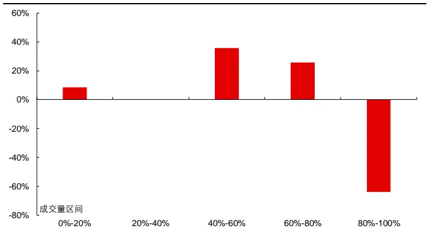
资料来源：天软科技，长江证券研究所

图 4：成交量筛选的局部反转因子年化多空收益率
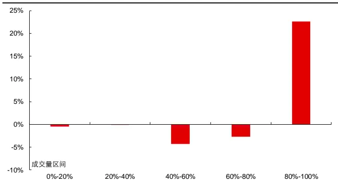
资料来源：天软科技，长江证券研究所

通过上述定量分析我们验证了 1 现象上的客观存在，即传统反转因子的反转效应几乎完全来自成交量较大的时间段，成交量较小的时间段甚至具有弱动量效应，使用成交量对收益率进行加权放大了前者的影响削弱了后者的影响，这种信息的侧重表达是高频反转因子相对于传统反转因子的优势来源。

为了对 2 做统计上的验证，我们需要对“多空博弈激烈”做出定量的定义。市场中通常认为振幅大的个股短期波动较大，进而可将其作为多空博弈激烈程度的表征。然而，除短期波动较大的个股外，单边上行或单边下行的个股也因收益率绝对值大而表现出振幅大的特点，直接使用区间振幅表征多空博弈激烈程度并不恰当。为了解决此问题，本文采用经过处理后的振幅比率来表征多空博弈的激烈程度，即：

$$
\frac{1}{2\pi}\lVert\overline{{\mathbb{E}}}\rVert\dot{\mathbb{E}}\dot{\mathbb{E}}=\frac{\lvert\bigtriangledown\rvert\lVert\dot{\mathbb{X}}\dddot{\mathbb{E}}\ddot{\mathbb{X}}\ddot{\mathbb{X}}\ddot{\mathbb{X}}\ddot{\mathbb{X}}\ddot{\mathbb{X}}\ddot{\mathbb{X}}\ddot{\mathbb{X}}\ddot{\mathbb{X}}\ddot{\mathbb{X}}}\lvert\bigtriangledown\rvert\lVert\overline{{\mathbb{X}}}\mathclose\rVert\ddot{\mathbb{E}}\lVert\overline{{\mathbb{X}}}\mathclose\rVert\dot{\mathbb{X}}\ddot{\mathbb{X}}\ddot{\mathbb{X}}\ddot{\mathbb{X}}\ddot{\mathbb{X}}\ddot{\mathbb{X}}\ddot{\mathbb{X}}-\lvert\bigtriangledown\rvert\overline{{\mathbb{H}}}\dddot{\mathbb{X}}\ddot{\mathbb{H}}\ddot{\mathbb{X}}\ddot{\mathbb{X}}\ddot{\mathbb{X}}\ddot{\mathbb{X}}\ddot{\mathbb{X}}\ddot{\mathbb{X}}\ddot{\mathbb{X}}\ddot{\mathbb{X}}\ddot{\mathbb{X}}\ddot{\mathbb{X}}\ddot{\mathbb{X}}\ddot{\mathbb{X}}\ddot{\mathbb{X}}\ddot{\mathbb{X}}\ddot{\mathbb{X}}\ddot{\mathbb{X}}\ddot{\mathbb{X}}\ddot{\mathbb{X}}\ddot{\mathbb{X}}\ddot{\mathbb{X}}\ddot{\mathbb{X}}\ddot{\mathbb{X}}\ddot{\mathbb{X}}\ddot{\mathbb{X}}\ddot{\mathbb{X}}\ddot{\mathbb{X}}\ddot{\mathbb{X}}\ddot{\mathbb{X}}\ddot{\mathbb{X}}\ddot{\mathbb{X}}\ddot{\mathbb{X}}\ddot{\mathbb{X}}\ddot{\mathbb{X}}\ddot{\mathbb{X}}\ddot{\mathbb{X}}\ddot{\mathbb{X}}\ddot{\mathbb{X}}\ddot{\mathbb{X}}\ddot{\mathbb{X}}\ddot{\mathbb{X}}\ddot{\mathbb{X}}\ddot{\mathbb{X}}\ddot
$$

振幅比率越低，则说明价格确定在整个价格波动中所占比例越小，多空博弈越激烈。下图给出了 2020 年 1 月 1 日至 2020 年 6 月 30 日，全市场范围内成交量与振幅比率和收益率绝对值的分组关系图，其计算方法为每日将每只股票的所有 K 线按成交量大小从低到高分为 5 组，计算组内振幅比率或收益率绝对值的均值，最后每组在时间序列上求均值。可以看到：

一方面，按成交量的大小将 K 线分组后，不同组别之间振幅比率的均值没有显著差异，即成交量与振幅比率之间没有明显关联。如果我们认同振幅比率是对多空博弈激烈程度的表征，那么此结果说明区间成交量并不能反映区间内多空博弈的激烈程度。

另一方面，成交量与收益率绝对值之间呈现出正相关关系，特别是对成交量最大的第 5 组而言其收益率绝对值的均值明显高于其他各组。由于前文已经证明该组是反转效应的主要来源，一种自然产生的推测是，成交量较大的时间段内更容易反转的原因在于这些时间段内的收益率的累计变化较大，即价格变动较大。

图 5：成交量与振幅比率分组关系图
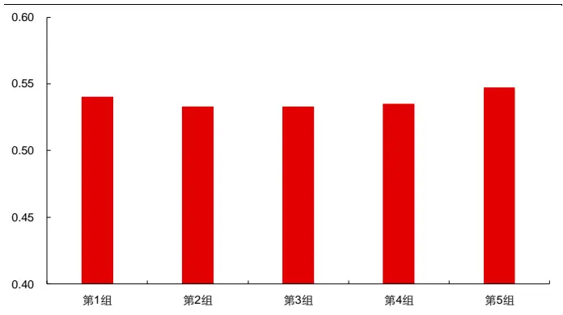
资料来源：天软科技，长江证券研究所

图 6：成交量与收益率绝对值分组关系图
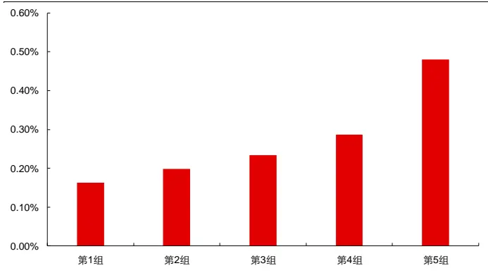
资料来源：天软科技，长江证券研究所

进一步，下图给出了收益率绝对值筛选的局部反转因子自 2010 年以来月度 ICIR 和全市场年化多空收益率的情况，该因子的构建方式与成交量筛选的局部反转因子的方法相同，只是将用于筛选的数据由成交量替换为收益率绝对值，即：

$$
\begin{array}{r}{|\big\{\mathfrak{X}_{\mathfrak{m}}^{\le\le\le\le\le\le\le\le\le\le\le\le\le\le\le\le\le}\big\}|\big|\widehat{\mathbb{H}}^{\gamma\operatorname*{m}\le\mathtt{m}\le\le\le\le\le\le\le\mathtt{m}}\big|\big\{\mathfrak{P}_{\mathtt{m}}^{\le\pm}\big|\big\}\big|_{\infty}\Xi_{\mathtt{m}}^{\pm\pm}\big|\big\}\mathcal{Z}_{\mathtt{m}}^{\pm\pm}\big|\big|\mathfrak{X}_{\mathtt{m}}^{\le\pm}\big|\big|\mathfrak{Z}_{\mathtt{m}}=\operatorname*{sum}\big(\big\{ret_{i}\big|q_{j}(|ret_{i}|)<|ret_{i}|<q_{j+1}(|ret_{i}|)\big\}\big)}\end{array}
$$

其中|ret |为每段时间收益率的绝对值，可以看到，只有收益率绝对值最大组(即位于80%-100%区间)的因子表现出明显的反转效应，收益率绝对值位于 20%-40%、40%-60%和 60%-80%区间内的因子表现出一定的动量效应，而收益率绝对值最小组(即位于 0%-20%区间)的因子几乎没有选股能力，即在价格变动较大的时间段，反转效应较强。

图 7：收益率绝对值筛选的局部反转因子月度 ICIR
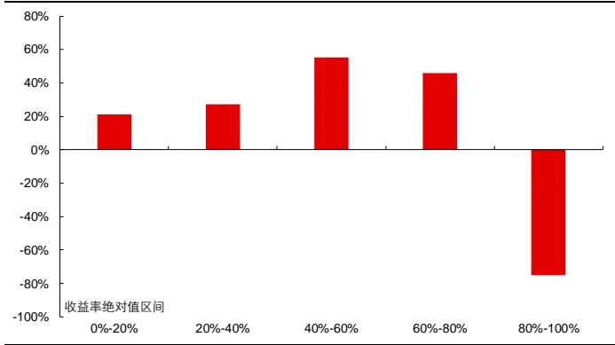
资料来源：天软科技，长江证券研究所

图 8：收益率绝对值筛选的局部反转因子年化多空收益率
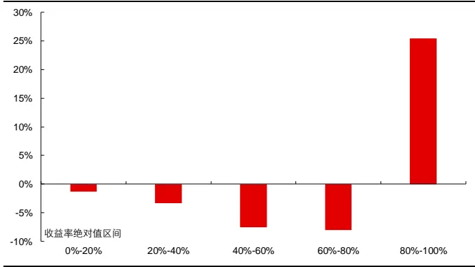
资料来源：天软科技，长江证券研究所

综上所述，我们已经从统计上解决了本文的第一个问题：

成交量较大的时间段的价格变动更容易反转，而成交量较小的时间段几乎不存在反转效应；

多空博弈激烈并不是未来价格反转的主要原因，成交活跃并产生价格变动，是反转效应的主要原因。

## 每笔成交量筛选

上述讨论给出了一种探讨反转因子微观结构的方法，即按照一定指标对收益率进行筛选，寻找可能加强反转效应的指标（如收益率绝对值）。在《高频因子(九)：高频波动中的时间序列信息》中，我们曾指出每笔成交量(=成交量/成交笔数)包含较多信息量，使用该数据能否对传统反转因子进行增强？为了检验这一点，我们尝试用每笔成交量对收益率进行筛选：

$$
\begin{array}{r}{\overleftrightarrow{\underline{{\sf E}}}\overleftrightarrow{\underline{{\sf E}}}\overleftrightarrow{\underline{{\sf E}}}\equiv\overbrace{{\sf I}\boldsymbol{\boldsymbol{\Pi}}}\overleftrightarrow{\boldsymbol{\sf I}}\equiv\overbrace{{\sf I}\boldsymbol{\boldsymbol{\Pi}}}\overleftrightarrow{\boldsymbol{\sf I}}\overleftrightarrow{\boldsymbol{\sf I}}\overleftrightarrow{\boldsymbol{\sf E}}\overleftrightarrow{\boldsymbol{\sf I}}\overline{{\boldsymbol{\mathcal{Z}}}}=\overleftrightarrow{\boldsymbol{\sf E}}\overline{{\boldsymbol{\Xi}}}==\mathrm{sum}\big(\{ret_{i}\big|q_{j}(pvol_{i})<pvol_{i}<q_{j+1}(pvol_{i})\}\big)}\end{array}
$$

其中pvol 为每个时间段每笔成交量2。下图给出了每笔成交量筛选的局部反转因子自2010 年以来月度 ICIR 和全市场年化多空收益率的情况。可以看到，不同每笔成交量区间下该因子的收益能力呈线性排列，每笔成交量最大组(即位于 80%-100%区间)的因子表现出显著的反转效应，随着每笔成交量的降低因子的收益能力逐渐由反转变为动量，直至每笔成交量最小组(即位于 0%-20%区间)的因子表现出显著的动量效应。从分组筛选的这一结果上看，每笔成交量与成交量虽同属“量”的范畴，它们与收益率之间的关系却明显不同。

图 9：每笔成交量筛选的局部反转因子月度 ICIR
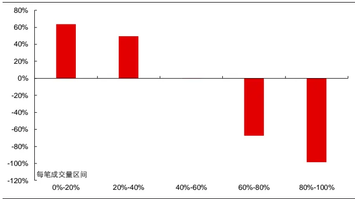
资料来源：天软科技，长江证券研究所

图 10：每笔成交量筛选的局部反转因子年化多空收益率
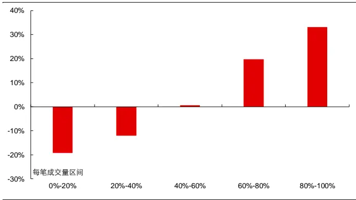
资料来源：天软科技，长江证券研究所

对于呈现显著反转效应的最大值组和呈现显著动量效应的最小值组，下图进一步给出了它们自 2010 年以来在全市场内的表现，并在下表中给出了其分年风险指标。可以看到：

每笔成交量筛选的局部反转因子（最大值组）的选股能力明显超过传统反转因子及高频反转因子，其在全市场获得了年化 8.20%的超额收益和 33.08%的多空收益，信息比和多空夏普比分别为 1.88 和 2.93。分组表现上看，该因子在头部仍有很强的线性分组能力，同时多头和空头强度基本相同；分年度表现上看，该因子的多空收益和超额收益在所有年度均为正值，收益能力在时间序列表现上较为稳定。

每笔成交量筛选的局部反转因子（最小值组）具有一定的选股能力，其在全市场获得了年化 2.47%的超额收益和 19.31%的多空收益，信息比和多空夏普比分别为0.61 和 2.11。分组表现上看，该因子在头部的分组能力较弱，同时空头明显强于多头；分年度表现上看，该因子的多空收益在所有年度均为正值，但超额收益出现相对回撤的年份较多。

图 11：全市场每笔成交量筛选的局部反转因子(最大值组)回测净值
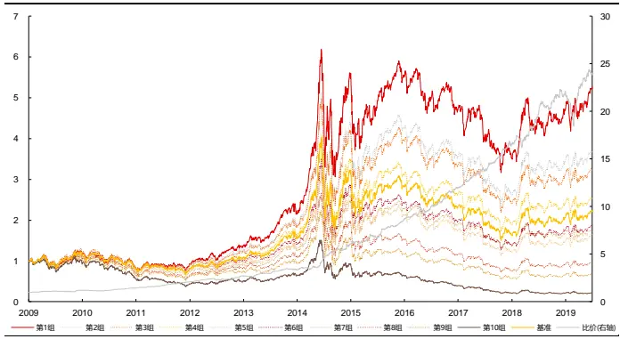
资料来源：天软科技，长江证券研究所

图 12：全市场每笔成交量筛选的局部反转因子(最小值组)回测净值
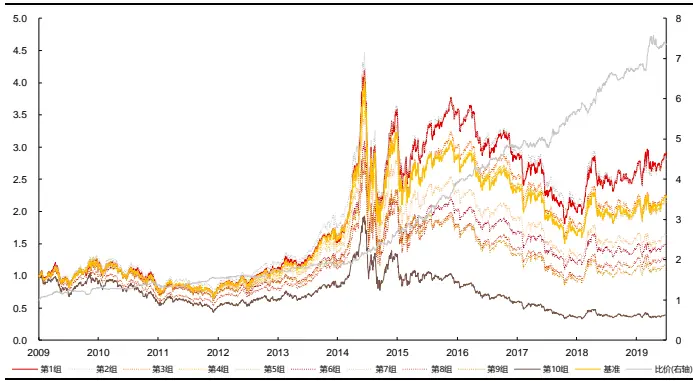
资料来源：天软科技，长江证券研究所

表 2：全市场每笔成交量筛选的局部反转因子分年风险指标

| 最大值组 |  |  |  |  | 最小值组 |  |  |  |
| --- | --- | --- | --- | --- | --- | --- | --- | --- |
|  | 超额收益(%) | 信息比 | 多空收益(%) | 多空夏普比 | 超额收益(%) | 信息比 | 多空收益(%) | 多空夏普比 |
| 2010 | 1.21 | 0.22 | 19.93 | 1.78 | 2.43 | 0.38 | 28.54 | 2.15 |
| 2011 | 0.65 | 0.19 | 17.34 | 2.26 | -1.16 | -0.26 | 4.33 | 0.60 |
| 2012 | 10.93 | 3.07 | 46.24 | 6.46 | -1.25 | -0.36 | 12.06 | 1.98 |
| 2013 | 11.80 | 3.27 | 27.02 | 2.24 | 3.01 | 0.88 | 13.29 | 1.77 |
| 2014 | 9.37 | 2.55 | 22.00 | 2.35 | -4.58 | -1.42 | 4.43 | 0.70 |
| 2015 | 24.26 | 3.38 | 75.82 | 4.01 | 13.25 | 2.05 | 42.84 | 3.16 |
| 2016 | 11.87 | 2.84 | 39.24 | 3.38 | 11.29 | 2.96 | 40.84 | 3.37 |
| 2017 | 3.57 | 1.13 | 35.80 | 3.78 | -2.03 | -0.71 | 19.90 | 2.42 |
| 2018 | 6.17 | 1.95 | 36.72 | 3.72 | -0.23 | -0.07 | 16.91 | 2.04 |
| 2019 | 5.09 | 1.76 | 30.00 | 2.67 | 3.40 | 1.46 | 17.46 | 2.54 |
| 2020 | 6.54 | 1.32 | 13.78 | 0.96 | 6.82 | 1.62 | 17.94 | 1.89 |
| 总计 | 8.20 | 1.88 | 33.08 | 2.93 | 2.47 | 0.61 | 19.31 | 2.11 |

资料来源：Wind，长江证券研究所

如果将高频反转因子对传统反转因子的改进视为一种“降噪”的话，那么利用每笔成交量对反转因子进行筛选更像是一种“提纯”。对于过去 20个交易日的所有时间段，将每笔成交量较小、表现出动量效应的时间段提取出来，剩余的每笔成交量最大的时间段内反转效应最为纯净，因而收益能力较“提纯”前的传统反转因子大幅增强。

进一步，每笔成交量数据的这种“提纯”能力又来源于何处？换言之，为何每笔成交量较小的时间段表现出动量效应，而每笔成交量较大的时间段表现出反转效应？

每笔成交量衡量了成交的密度，具有两个特点：

其他条件相同情况下，每个时间段成交量越大，每笔成交量越大，而成交量越大意味着交易越活跃；

其他条件相同的情况下，成交笔数越小，每笔成交量越大，而成交笔数越小意味着价格变动的确定性越强；

所以每笔成交量实际同时衡量了成交活跃程度以及价格的变动，每笔成交量越大，成交越活跃同时价格变动较为确定，以一个指标粗略衡量了反转效应的产生原因。

综上所述，我们已经解决了本文的第二个问题：

除了成交量，收益率绝对值、每笔成交量也可以通过对收益率筛选加强反转因子表 现。成交量衡量了成交的活跃程度，收益率绝对值衡量了价格的变动，每笔成交量 则同时衡量了成交活跃程度和价格的变动。

表现上看，每笔成交量在收益率的区分上有更好的线性，可以通过“提纯”的方式筛选出具有反转效应的价格变动，加强反转效应表达。

## 基于每笔成交量构建复合反转因子

## 反转与动量效应的结合

在上文中以每笔成交量增强反转因子的过程中，我们直接将每笔成交量筛选后的最大值组作为增强后的因子，而没有像成交量那样对收益率进行加权，这是因为每笔成交量较小的几组呈现一定的动量效应，加权过程将这几组纳入因子的计算中，会对最大值组的反转效应产生一定的抵消。但每笔成交量较小的几组中的动量效应同样存在信息，我们尝试使用其他方法将其纳入因子中。

最直接的方法就是以等权的方式合成不同筛选区间下的因子，以表现出动量效应的最小组和表现出反转效应的最大组为例：

$$
\begin{array}{r}{\overleftrightarrow{\underline{{\sf E}}}\overleftrightarrow{\underline{{\sf E}}}\overleftrightarrow{\underline{{\sf E}}}\overleftrightarrow{\underline{{\sf E}}}\overleftrightarrow{\underline{{\sf E}}}\overleftrightarrow{\underline{{\sf E}}}=\mathsf{sum}(\{ret_{i}|pvol_{i}>q_{4}(pvol_{i})\})-\mathsf{sum}(\{ret_{i}|pvol_{i}<q_{1}(pvol_{i})\})}\end{array}
$$

下图给出了风格中性前后的该因子自 2010 年以来在全市场内的表现，并在下表中给出了其分年风险指标。可以看到：

风格中性前，每笔成交量复合反转因子在收益能力、分组表现及分年度表现上均与每笔成交量筛选的局部反转因子(最大值组)差别不大，其在全市场获得了年化 8.40%的超额收益和 32.90%的多空收益，信息比和多空夏普比分别为 1.86 和 2.78。

风格中性后，该因子仍保留了一定的收益能力，其在全市场获得了年化 0.95%的超额收益和 16.95%的多空收益，信息比和多空夏普比分别为 0.22 和 2.10。分组表现上看，该因子在头部的分组能力较弱，同时空头明显强于多头；分年度表现上看，该因子的多空收益只在 2015 年为负，该年的超额收益也出现了较明显的相对回撤。

图 13：全市场每笔成交量复合反转因子回测净值
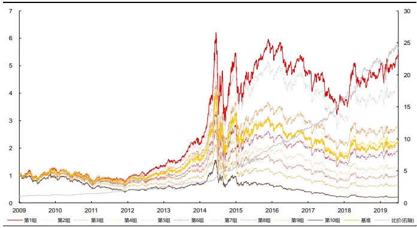
资料来源：天软科技，长江证券研究所

图 14：全市场每笔成交量复合反转因子(风格中性后)回测净值
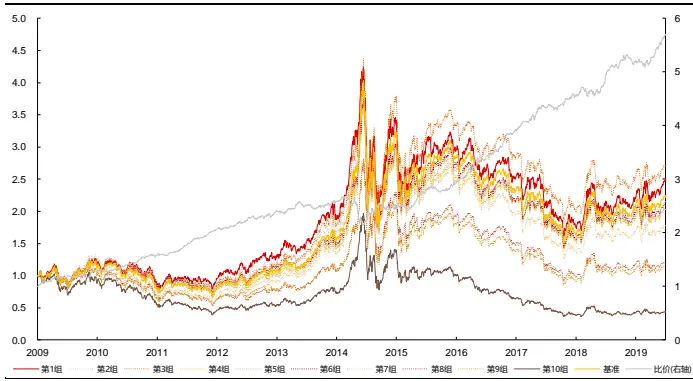
资料来源：天软科技，长江证券研究所

表 3：全市场每笔成交量复合反转因子分年风险指标

| 风格中性前 |  |  |  |  | 风格中性后 |  |  |  |
| --- | --- | --- | --- | --- | --- | --- | --- | --- |
|  | 超额收益(%) | 信息比 | 多空收益(%) | 多空夏普比 | 超额收益(%) | 信息比 | 多空收益(%) | 多空夏普比 |
| 2010 | 4.59 | 0.67 | 27.05 | 2.01 | 2.22 | 0.48 | 26.25 | 2.42 |
| 2011 | -1.40 | -0.30 | 11.03 | 1.41 | 7.30 | 1.85 | 21.70 | 2.58 |
| 2012 | 6.20 | 1.74 | 34.69 | 5.01 | 6.14 | 1.53 | 29.65 | 4.79 |
| 2013 | 14.11 | 3.67 | 28.93 | 2.31 | 2.43 | 0.52 | 15.92 | 2.37 |
| 2014 | 9.08 | 2.39 | 22.49 | 2.40 | 1.11 | 0.25 | 7.85 | 1.29 |
| 2015 | 22.90 | 3.19 | 72.01 | 3.82 | -13.46 | -1.78 | -8.09 | -0.59 |
| 2016 | 16.37 | 3.63 | 50.54 | 3.84 | -1.03 | -0.18 | 19.59 | 2.41 |
| 2017 | 1.90 | 0.64 | 29.63 | 3.08 | 3.97 | 0.91 | 31.16 | 4.07 |
| 2018 | 7.76 | 2.54 | 38.49 | 3.47 | -1.33 | -0.36 | 16.54 | 3.14 |
| 2019 | 7.06 | 2.38 | 33.67 | 2.89 | -0.68 | -0.19 | 13.30 | 2.24 |
| 2020 | 3.74 | 0.86 | 12.92 | 0.93 | 10.79 | 2.50 | 20.24 | 3.23 |
| 总计 | 8.40 | 1.86 | 32.90 | 2.78 | 0.95 | 0.22 | 16.95 | 2.10 |

资料来源：Wind，长江证券研究所

## 相关系数的本质

实际上更为完整利用每笔成交量筛选得到的反转因子，仍可以通过更一般的式子泛化表达，该表达式具有以下性质：

1. 时间段的所有信息均纳入表达；

2. 每笔成交量较大、呈现反转效应的时间段收益率的权重大于 0，每笔成交量较小、呈现动量效应的时间段收益率的权重小于 0；

3. 呈现反转效应的时间段每笔成交量越大权重越大（加强反转效应），呈现动量效应的时间段每笔成交量越小权重越小(绝对值越大，加强动量效应)。

虽然每笔成交量无法满足动量部分的表达，但借鉴《高频因子（六）：特异视角下的波动率因子》中非线性反转因子的构建方式，以每笔成交量减去自身均值后，再按照总每笔成交量进行标准化，即得到了因子的一种构建方式，即：

$$
w_{i}=pvol_{i}-mean(pvol_{i})
$$

$$
\{\varXi\frac{4\div5}{5}\geq\frac{1}{3}\dot{\bar{\lambda}}\geq\frac{\mu}{\equiv}\mathbf{\dot{j}}\mathbf{\mu}\mathbf{\dot{\uparrow}}\}\mathbb{Z}\frac{4\pm\mu}{3}\mathbf{\mu}\geq\frac{\sum w_{i}\times ret_{i}}{\sum pvol_{i}}
$$

但本文将关注另一种方式构建的因子，表达式如下：

$$
\frac{1}{15}\mathbin{\vrule height13.6em104.6em104.7k\vrule height13.6em104.6em10}=\frac{\sum{w}_{i}\times ret_{i}}{std(pvol_{i})\times std(ret_{i})}
$$

$$
=\frac{\sum w_{i}\times ret_{i}-mean(ret_{i})\sum pvol_{i}+\sum mean(pvol_{i})mean(ret_{i})}{std(pvol_{i})\times std(ret_{i})}
$$

$$
=\frac{\sum\bigl(pvol_{i}-mean(pvol_{i})\bigr)\bigl(ret_{i}-mean(ret_{i})\bigr)}{std(pvol_{i})\times std(ret_{i})}=corr(pvol,ret)
$$

即标准化后的每笔成交量加权收益率，和每笔成交量收益率相关性因子一致，后文中统称为每笔成交量收益率相关性因子。下图给出了风格中性前后的该因子自 2010 年以来在全市场内的表现，并在下表中给出了其分年风险指标。可以看到：

风格中性前，每笔成交量收益率相关性因子具有一定的选股能力，其在全市场获得了年化 25.74%的多空收益和 7.25%的超额收益，多空夏普比和信息比分别达到3.01 和 1.48。

风格中性后，该因子仍保留了一定的选股能力，其在全市场获得了年化 4.04%的超额收益和 18.74%的多空收益，信息比和多空夏普比分别为 0.99和 2.96。分组表现上看，该因子的线性分组状况良好，多头和空头强度基本相同；分年度表现上看，该因子的多空收益在所有年度均为正值，超额收益只在 2015 年出现微小的相对回撤，收益能力在时间序列上表现较为稳定。

与每笔成交量复合反转因子相比，每笔成交量收益率相关性因子在风格中性前并未表现出明显的优势，但在风格中性后其表现明显超过前者，特别是多头部分仍然具有显著的超额收益能力，信息的充分利用提高了因子的 alpha 能力。

图 15：全市场每笔成交量收益率相关性因子回测净值
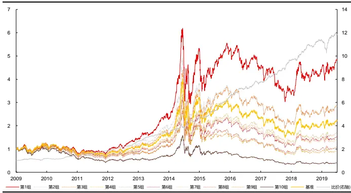
资料来源：天软科技，长江证券研究所

图 16：全市场每笔成交量收益率相关性因子(风格中性后)回测净值
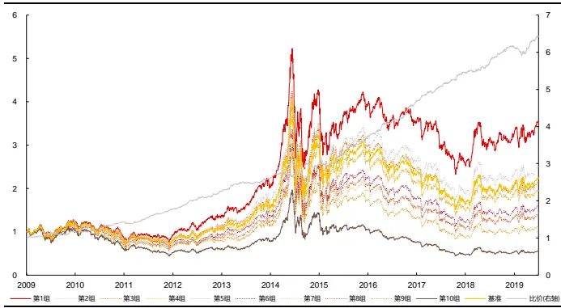
资料来源：天软科技，长江证券研究所

表 4：全市场每笔成交量收益率相关性因子分年风险指标

| 风格中性前 |  |  |  |  | 风格中性后 |  |  |  |
| --- | --- | --- | --- | --- | --- | --- | --- | --- |
|  | 超额收益(%) | 信息比 | 多空收益(%) | 多空夏普比 | 超额收益(%) | 信息比 | 多空收益(%) | 多空夏普比 |
| 2010 | 1.36 | 0.20 | 17.07 | 1.22 | 3.45 | 0.65 | 16.30 | 1.68 |
| 2011 | 4.06 | 0.92 | 18.80 | 2.47 | 3.55 | 0.95 | 19.98 | 3.22 |
| 2012 | 6.79 | 1.85 | 31.30 | 4.97 | 3.93 | 1.07 | 23.87 | 4.20 |
| 2013 | 17.63 | 4.22 | 42.31 | 5.94 | 11.50 | 2.89 | 27.62 | 4.55 |
| 2014 | 9.61 | 2.52 | 26.33 | 4.45 | 3.20 | 0.89 | 15.56 | 2.86 |
| 2015 | 11.11 | 1.43 | 37.62 | 3.00 | -0.60 | -0.07 | 11.04 | 1.34 |
| 2016 | 11.77 | 2.66 | 38.59 | 4.71 | 5.62 | 1.27 | 26.02 | 3.65 |
| 2017 | 4.14 | 1.34 | 17.91 | 2.99 | 8.78 | 2.37 | 24.31 | 4.81 |
| 2018 | 5.99 | 1.83 | 23.65 | 4.19 | 1.73 | 0.55 | 16.55 | 4.54 |
| 2019 | 3.35 | 1.09 | 17.27 | 3.10 | 0.63 | 0.23 | 12.04 | 3.17 |
| 2020 | 3.10 | 0.70 | 7.59 | 0.81 | 2.85 | 0.83 | 10.46 | 2.00 |
| 总计 | 7.25 | 1.48 | 25.74 | 3.01 | 4.04 | 0.99 | 18.74 | 2.96 |

资料来源：Wind，长江证券研究所

综上所述，相关系数本质在于以变量一对变量二进行加权求和，是一种有效整合全样本信息的方式，以每笔成交量与收益率之间的相关系数为例，其本质为以每笔成交量与自身均值之差为权重对收益率序列进行加权。

## 对量价相关性因子的解释

从上文的讨论中我们可以看到，相关系数和对变量加权求和有着密切的关系，顺着这个思路，展开对量价相关性因子的逻辑解释讨论。在《高频因子（八）：高位成交因子——从量价匹配说起》，我们给出了一种量价相关性因子收益来源的解释，即在价格高位成交相对较多的个股交易中存在羊群效应，从而存在高估的可能。故按照前文讨论的方法，按照价格对个股成交量给出划分，构建价格筛选的局部成交量因子：

$$
\textcircled{1}\dot{\textmd f}\ddot{\textmd f}\dddot{\textmu}\ddot{\textmd2}\ddot{\textmd f}\ddot{\textmd B}\ddot{\textmd2}\ddot{\textmd B}\ddot{\textmd B}\ddot{\textmd\textmd\textmd{\textmu}}\ddot{\textmd\textmd{\textmu}}\ddot{\textmd\textmd{\textmu}}\ddot{\textmd{\textmu}}\ddot{\textmd{\textmu}}\ddot{\textmd{\textmu}}\ddot{\textmd{\textmu}}_{j}=\frac{\operatorname*{sum}(\{vol_{i}\}q_{j}(close_{i})<close_{i}<q_{j+1}(close_{i})\})}{\operatorname*{sum}(vol_{i})}
$$

其中，close 为每个时间段的收盘价，为使得不同成交量级的个股具有可比性，因子按照因子总成交量进行去量纲处理。下图给出了价格筛选的局部成交量因子自 2010 年以来月度 ICIR 和全市场年化多空收益率的情况。可以看到，不同价格区间的局部成交量因子的收益能力都呈线性排列，这一点与每笔成交量筛选的局部反转因子非常相似。具体而言，价格最高组(即位于 80%-100%区间)的因子表现出显著的负向收益能力，即在价格高位成交量越大的个股未来的收益率越低。随着价格的降低，因子的收益能力逐渐由负向变为正向，价格最低组(即位于 0%-20%区间)的因子表现出显著的正向收益能力，即在价格低位成交量越大的个股未来的收益率越高。

图 17：价格筛选的局部成交量因子月度 ICIR
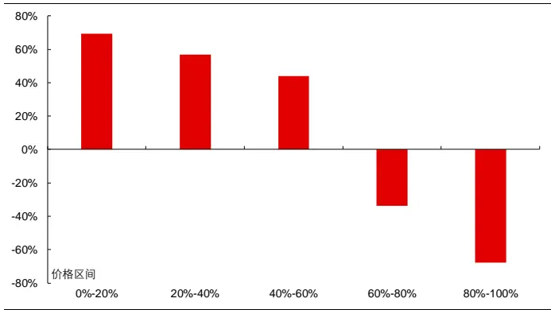
资料来源：天软科技，长江证券研究所

图 18：价格筛选的局部成交量因子年化多空收益率
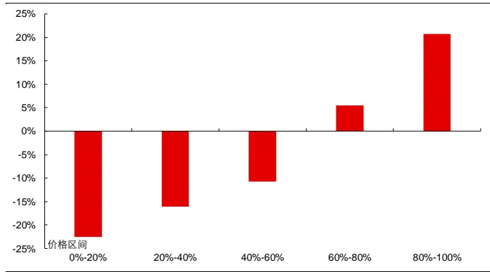
资料来源：天软科技，长江证券研究所

对于呈现显著反转效应的最大值组和呈现显著动量效应的最小值组，下图进一步给出了因子自 2010 年以来在全市场内的表现，并在下表中给出了其分年风险指标。可以看到：

总体上看，价格筛选的局部成交量因子的最大值组和最小值组均具有一定的选股能力。对于最大值组而言，其在全市场获得了年化 4.03%的超额收益和 20.75%的多空收益，信息比和多空夏普比分别为 0.74和 2.20。对于最小值组而言，其在全市场获得了年化 2.79%的超额收益和 22.58%的多空收益，信息比和多空夏普比分别为 0.53 和 2.15。

分组表现上看，最大值组和最小值组均具有良好的线性分组能力，多头强度稍弱于空头。

分年度表现上看，最大值组超额收益上在 2014 年、2016 年和 2019 年出现相对回撤，最小值组在 2013 年、2014 年和 2016 年出现相对回撤，因子收益在时间序列上有一定波动。

图 19：全市场价格筛选的局部成交量因子(最大值组)回测净值
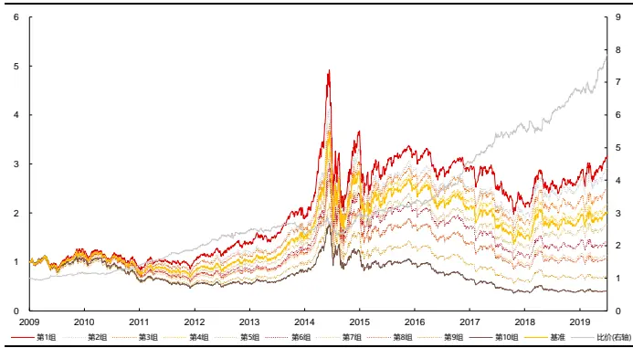
资料来源：天软科技，长江证券研究所

图 20：全市场价格筛选的局部成交量因子(最小值组)回测净值
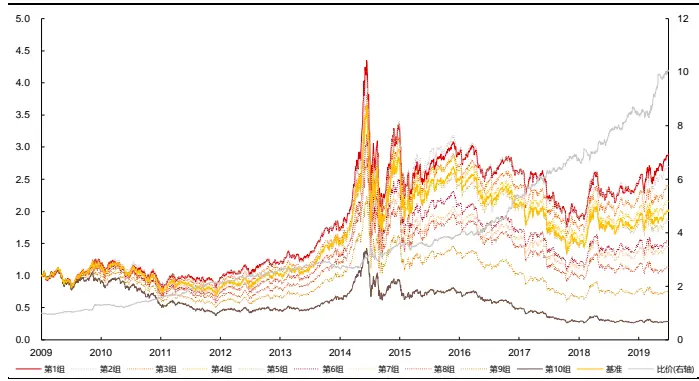
资料来源：天软科技，长江证券研究所

表 5：全市场价格筛选的局部成交量因子分年风险指标

| 最大值组 |  |  |  |  | 最小值组 |  |  |  |
| --- | --- | --- | --- | --- | --- | --- | --- | --- |
|  | 超额收益(%) | 信息比 | 多空收益(%) | 多空夏普比 | 超额收益(%) | 信息比 | 多空收益(%) | 多空夏普比 |
| 2010 | 6.88 | 1.11 | 16.83 | 1.83 | 4.95 | 0.82 | 29.89 | 2.69 |
| 2011 | 3.99 | 0.78 | 17.94 | 2.13 | 4.08 | 0.81 | 20.50 | 2.17 |
| 2012 | 11.96 | 2.62 | 35.35 | 4.30 | 6.64 | 1.61 | 33.19 | 3.78 |
| 2013 | 8.45 | 1.41 | 29.31 | 2.50 | -0.21 | -0.01 | 19.64 | 1.75 |
| 2014 | -8.02 | -1.74 | -5.38 | -0.64 | -4.16 | -1.01 | 1.52 | 0.23 |
| 2015 | 2.86 | 0.37 | 26.35 | 1.89 | 1.61 | 0.22 | 29.45 | 1.86 |
| 2016 | -1.11 | -0.25 | 11.41 | 1.65 | -1.95 | -0.49 | 8.03 | 1.05 |
| 2017 | 6.81 | 1.55 | 33.66 | 3.82 | 5.79 | 1.29 | 32.14 | 2.73 |
| 2018 | 5.80 | 1.15 | 23.52 | 2.80 | 2.74 | 0.55 | 25.97 | 2.67 |
| 2019 | -0.43 | -0.06 | 17.69 | 2.08 | 0.90 | 0.22 | 22.19 | 2.37 |
| 2020 | 14.58 | 2.05 | 36.83 | 3.15 | 21.16 | 3.08 | 40.70 | 3.22 |
| 总计 | 4.03 | 0.74 | 20.75 | 2.20 | 2.79 | 0.53 | 22.58 | 2.15 |

资料来源：Wind，长江证券研究所

所以从上面的讨论中，我们验证了成交集中在价格高位的个股具有反转效应，成交集中在价格低位的个股具有动量效应，类似每笔成交量收益率相关性因子，量价相关性因子实际上整体结合了不同价格分组下的局部成交量因子：

$$
\Xi\{\gamma|\cdot|\exists\neq|\prime|\pm|\mathbb{E}|\mp=corr(vol,close)=\frac{\sum\left(close_{i}-mean(close_{i})\right)vol_{i}}{std(close_{i})\times std(vol_{i})}
$$

下图给出了风格中性前后的量价相关性因子自 2010 年以来在全市场内的表现，并在下表中给出了其分年风险指标。可以看到：

风格中性前，量价相关性因子有一定的选股能力，其在全市场获得了年化 4.15%的超额收益和 18.13%的多空收益，信息比和多空夏普比分别为 0.72 和 1.79。

风格中性后，该因子的收益能力有所提升，其在全市场获得了年化 5.63%的超额收益和 18.55%的多空收益，信息比和多空夏普比分别为 1.10 和 2.21。分组表现上看，该因子的线性分组状况良好，多头和空头强度基本相同；分年度表现上看，该因子的多空收益在所有年度均为正值，超额收益在 2014、2016 年和 2018 年出现相对回撤且回撤幅度很小。

图 21：全市场量价相关性因子回测净值
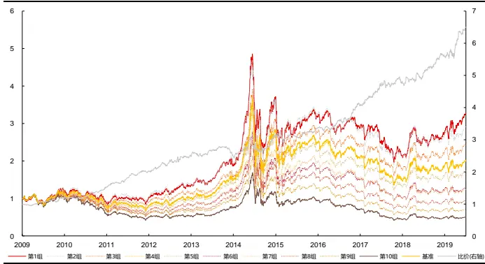
资料来源：天软科技，长江证券研究所

图 22：全市场量价相关性因子(风格中性后)回测净值
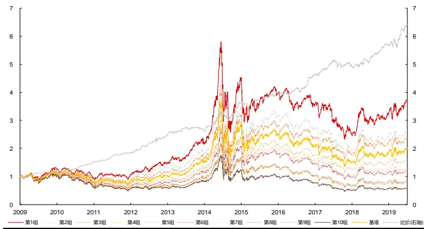
资料来源：天软科技，长江证券研究所

表 6：全市场量价相关性因子分年风险指标

| 风格中性前 |  |  |  |  | 风格中性后 |  |  |  |
| --- | --- | --- | --- | --- | --- | --- | --- | --- |
|  | 超额收益(%) | 信息比 | 多空收益(%) | 多空夏普比 | 超额收益(%) | 信息比 | 多空收益(%) | 多空夏普比 |
| 2010 | 6.39 | 0.97 | 19.40 | 1.84 | 12.08 | 1.93 | 23.48 | 2.38 |
| 2011 | 5.62 | 1.02 | 24.95 | 2.60 | 5.76 | 1.13 | 21.45 | 2.65 |
| 2012 | 10.57 | 2.27 | 31.49 | 3.47 | 9.51 | 2.39 | 20.99 | 3.41 |
| 2013 | 5.29 | 0.90 | 22.55 | 1.86 | 11.31 | 2.16 | 33.16 | 3.14 |
| 2014 | -6.22 | -1.37 | -2.24 | -0.22 | -1.37 | -0.31 | 5.44 | 0.81 |
| 2015 | 3.09 | 0.34 | 23.81 | 1.44 | 9.57 | 1.15 | 36.83 | 2.71 |
| 2016 | -2.69 | -0.64 | 6.62 | 0.99 | -1.14 | -0.26 | 8.84 | 1.35 |
| 2017 | 7.76 | 1.72 | 18.97 | 2.18 | 6.49 | 1.62 | 14.66 | 2.15 |
| 2018 | 3.47 | 0.68 | 17.52 | 2.10 | -0.45 | -0.08 | 7.57 | 1.18 |
| 2019 | 2.05 | 0.45 | 14.61 | 2.01 | 1.98 | 0.46 | 12.61 | 1.98 |
| 2020 | 20.81 | 2.95 | 35.80 | 2.83 | 14.43 | 2.51 | 30.45 | 2.89 |
| 总计 | 4.15 | 0.72 | 18.13 | 1.79 | 5.63 | 1.10 | 18.55 | 2.21 |

资料来源：Wind，长江证券研究所

综上所述，我们已经解决了本文的第三个问题：

量价相关性因子的收益来源同样可以采用以变量分组构建因子的方法给出验证，从价格筛选成交量因子的表现上看，收益来源于不同价格区间中成交量收益能力的不同，即高位成交较多的个股未来收益率较低，而低位成交较多的个股未来收益率较高。

相关系数本质的讨论同样可以解释量价相关性因子，该因子本质上是以价格与自身均值之差为权重对成交量序列进行加权，即整合不同分组下的价格筛选成交量因子信息。

## 因子思考

## 中证800内表现

本文共讨论了两类的因子：

反转因子的改进，其中又分为以每笔成交量筛选的局部反转因子（最大值组）为代表的使用部分信息构建的因子，以及每笔成交量收益率相关性因子为代表的综合不同时间段信息构建的因子。

量价相关性因子，即对不同价格区间下成交量的正向和负向收益能力的结合。

下表汇总了三个因子在全市场和中证 800 内中性前后的回测表现，可以看到：

三个因子在中证 800 中的表现均不如在全市场中的表现，每笔成交量筛选的局部反转因子(最大值组)的表现下降的最为明显。

即使在中证 800 中，风格中性后的每笔成交量收益率相关性因子和量价相关性因子仍保留了一定的收益能力。因此，无论是在全市场还是在中证 800 中，求相关系数都是将筛选后不同组中的信息进行结合的有效方式。

表 7：因子在不同样本空间风格中性前后的收益风险表现汇总

|  | 样本空间 | 是否中性 | IC(%) | ICIR(%) | 超额收益(%) | 信息比 | 多空收益(%) | 多空夏普比 |
| --- | --- | --- | --- | --- | --- | --- | --- | --- |
| 每笔成交量筛选的局部反转 因子(最大值组) | 全市场 | 中性前 | -7.82 | -98.41 | 8.20 | 1.88 | 33.08 | 2.93 |
|  | 中证 800 | 中性前 | -5.71 | -60.18 | 1.94 | 0.36 | 15.53 | 1.18 |
| 每笔成交量收益率相关性因 子 | 全市场 | 中性前 | -5.44 | -77.39 | 7.25 | 1.48 | 25.74 | 3.01 |
|  |  | 中性后 | -3.69 | -82.70 | 4.04 | 0.99 | 18.74 | 2.96 |
|  |  | 中性前 | -4.07 | -47.92 | 2.01 | 0.34 | 16.80 | 1.51 |
|  | 中证 800 全市场 | 中性后 | -3.65 | -51.09 | 0.74 | 0.15 | 12.14 | 1.22 |
|  |  | 中性前 | -5.57 | -67.32 | 4.15 | 0.72 | 18.13 | 1.79 |
| 量价相关性因子 |  | 中性后 | -5.28 | -77.38 | 5.63 | 1.10 | 18.55 | 2.21 |
|  |  | 中性前 | -5.15 | -45.13 | 3.59 | 0.47 | 14.86 | 1.13 |
|  | 中证 800 | 中性后 | -5.21 | -48.76 | 5.12 | 0.70 | 15.12 |  |
|  |  |  |  |  |  |  |  | 1.25 |

资料来源：Wind，长江证券研究所

## 因子合成

由于这三个因子背后的逻辑并不完全相同，我们通过以下步骤合成因子：

1. 去极值：对每个因子而言，将超过(均值±3 倍标准差)范围的因子值替换为(均值±3 倍标准差)；

2. 标准化：对每个因子而言，将因子值减去均值后除以标准差；

3. 因子合成：采用等权组合的方式，即三个因子的权重均为 1/3。

下图给出了合成因子自 2010 年以来在全市场和中证 800 内的表现，并在下表中给出了其分年风险指标。可以看到：

总体上看，合成因子在全市场中有很强的选股能力，其获得了年化 9.15%的超额收益和 36.59%的多空收益，信息比和多空夏普比 1.62和 3.26，在中证 800 内收益能力有一定衰减；

分组表现上看，该因子在全市场和中证 800 中的分组线性均较好，多头与空头强度基本相同；

分年度表现上看，全市场中该因子所有年度的多空收益与超额收益均为正值，中证800 中该因子只在 2014 年出现了较明显的回撤，其余年份的收益能力较为稳定。

图 23：全市场合成因子回测净值
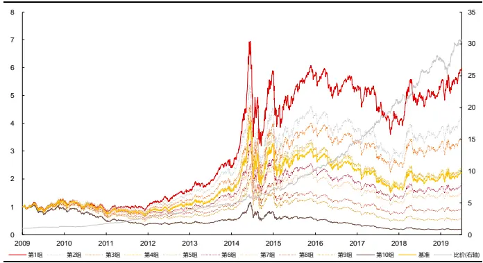
资料来源：天软科技，长江证券研究所

图 24：中证 800 合成因子回测净值
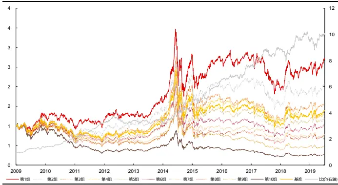
资料来源：天软科技，长江证券研究所

表 8：合成因子分年风险指标

| 全市场 |  |  |  |  | 中证800 |  |  |  |
| --- | --- | --- | --- | --- | --- | --- | --- | --- |
|  | 超额收益(%) | 信息比 | 多空收益(%) | 多空夏普比 | 超额收益(%) | 信息比 | 多空收益(%) | 多空夏普比 |
| 2010 | 2.78 | 0.38 | 27.72 | 1.88 | 17.91 | 1.73 | 37.24 | 2.28 |
| 2011 | 6.57 | 1.22 | 30.91 | 3.05 | 12.92 | 1.91 | 47.15 | 3.67 |
| 2012 | 15.09 | 3.33 | 54.90 | 6.25 | 16.17 | 2.42 | 54.35 | 4.49 |
| 2013 | 15.48 | 3.03 | 44.40 | 4.09 | -0.55 | -0.04 | 3.55 | 0.34 |
| 2014 | 4.71 | 1.09 | 17.31 | 2.06 | -9.75 | -1.48 | -8.68 | -0.70 |
| 2015 | 16.21 | 1.67 | 53.00 | 2.98 | 12.65 | 1.16 | 46.87 | 2.09 |
| 2016 | 9.82 | 2.15 | 40.33 | 4.28 | 11.57 | 1.61 | 32.84 | 2.34 |
| 2017 | 10.31 | 2.58 | 40.83 | 4.51 | 2.01 | 0.40 | 14.35 | 1.35 |
| 2018 | 7.97 | 1.92 | 39.88 | 4.22 | 1.75 | 0.37 | 16.35 | 1.58 |
| 2019 | 4.93 | 1.27 | 30.53 | 3.15 | -0.27 | -0.02 | 5.84 | 0.56 |
| 2020 | 6.83 | 1.22 | 19.94 | 1.70 | 4.43 | 0.61 | 6.15 | 0.50 |
| 总计 | 9.15 | 1.62 | 36.59 | 3.26 | 6.00 | 0.84 | 22.40 | 1.67 |

资料来源：Wind，长江证券研究所

下图给出了风格中性后的合成因子自 2010 年以来在全市场和中证 800 内的表现，并在下表中给出了其分年风险指标。可以看到：

总体上看，风格中性后该合成因子仍保留着很强的选股能力，其在全市场中的收益能力稍有下降，获得了年化 7.45%的超额收益和 28.22%的多空收益，信息比和多空夏普比分别为 1.49和 3.33，在中证 800 中的收益能力有所提升。

分组表现上看，风格中性后该因子在全市场中的分组线性仍较好，多头与空头强度基本相同，在中证 800 中分组能力稍有下降；

分年度表现上看，风格中性后该因子全市场中所有年度的多空收益与超额收益均为正值，中证 800 中仍然只在2014 年出现了较明显的回撤。

图 25：全市场合成因子(风格中性后)回测净值
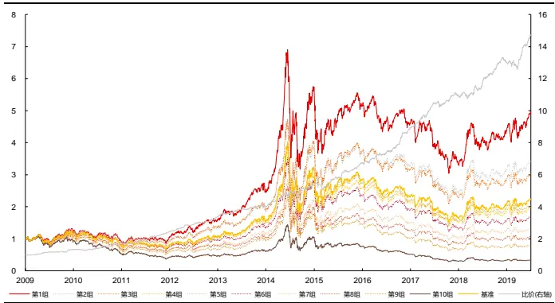
资料来源：天软科技，长江证券研究所

图 26：中证 800合成因子(风格中性后)回测净值
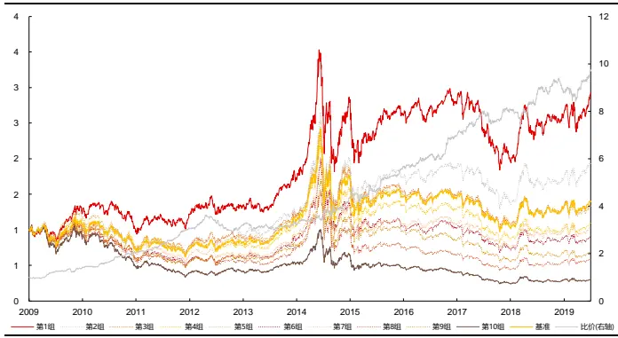
资料来源：天软科技，长江证券研究所

表 9：合成因子(风格中性后)分年风险指标

| 全市场 |  |  |  |  | 中证800 |  |  |  |
| --- | --- | --- | --- | --- | --- | --- | --- | --- |
|  | 超额收益(%) | 信息比 | 多空收益(%) | 多空夏普比 | 超额收益(%) | 信息比 | 多空收益(%) | 多空夏普比 |
| 2010 | 7.53 | 1.20 | 32.69 | 2.77 | 20.20 | 2.13 | 39.48 | 2.66 |
| 2011 | 6.08 | 1.34 | 25.42 | 2.91 | 13.05 | 2.05 | 41.57 | 3.47 |
| 2012 | 12.14 | 2.70 | 42.61 | 6.04 | 19.31 | 2.63 | 48.24 | 4.14 |
| 2013 | 13.54 | 2.68 | 37.99 | 4.75 | -1.59 | -0.19 | 4.71 | 0.48 |
| 2014 | 7.30 | 1.70 | 19.13 | 2.74 | -7.37 | -1.14 | -0.95 | -0.04 |
| 2015 | 11.24 | 1.35 | 31.95 | 2.37 | 6.35 | 0.63 | 30.56 | 1.67 |
| 2016 | 2.24 | 0.56 | 23.86 | 3.36 | 9.48 | 1.33 | 28.02 | 2.08 |
| 2017 | 8.21 | 2.04 | 30.64 | 4.43 | 7.41 | 1.31 | 21.89 | 2.17 |
| 2018 | 2.29 | 0.65 | 22.98 | 4.10 | -0.38 | -0.06 | 15.38 | 1.76 |
| 2019 | 3.02 | 0.82 | 17.60 | 2.86 | 2.67 | 0.48 | 7.66 | 0.77 |
| 2020 | 11.28 | 2.29 | 28.98 | 3.66 | 9.91 | 1.29 | 20.31 | 1.64 |
| 总计 | 7.45 | 1.49 | 28.22 | 3.33 | 6.72 | 0.95 | 22.49 | 1.85 |

资料来源：Wind，长江证券研究所

## 总结

成交活跃并产生价格变动是反转效应的主要原因。以成交量、收益率绝对值为分组变量对收益率序列进行划分，成交量较大的时间段价格变动呈现强反转，成交量较小的时间段无反转效应，收益率绝对值较大的时间段价格变动呈现强反转，收益率绝对值较小的时间段价格变动呈现弱动量。成交量加权构建的高频反转因子放大了成交量较大时间段的价格变动表达，降低了成交量较小时间段的价格表达，通过“降噪”的方式改进反转因子表现。

每笔成交量同时衡量了成交活跃和价格变动的确定性。以每笔成交量为分组变量对收益率序列进行划分，每笔成交量较大的时间段价格变动呈现强反转，每笔成交量较小的时间段呈现强动量。每笔成交量筛选的局部反转因子(最大值组)选取了具有反转效应的价格变动，通过“提纯”的方式改进反转因子表现，在全市场获得年化 8.20%的超额收益和 33.08%的多空收益，信息比和多空夏普比分别达到 1.88和 2.93。

每笔成交量收益率相关性因子整合了全部时间段的价格变动信息。每笔成交量与收益率之间的相关系数，本质为以每笔成交量与自身均值之差为权重对收益率序列进行加权，可以有效地将不同每笔成交量下的价格变动信息进行整合。每笔成交量收益率相关性因子在全市场获得了年化 7.25%的超额收益和 25.74%的多空收益，风格中性后，年化超额收益和多空收益分别为 4.04%和 18.74%。

量价相关性因子整合了不同价格分组下的成交量因子信息。量价相关性因子本质上是以价格与自身均值差为权重对成交量序列进行加权，收益来源于不同价格区间中成交量收益能力的不同，即高位成交较多的个股未来收益率较低，而低位成交较多的个股未来收益率较高。量价相关性因子在全市场获得了年化 4.15%的超额收益和 18.13%的多空收益，风格中性后，年化超额收益和多空收益分别为 5.63%和 18.55%。

合成因子在风格中性前后均有较强的选股能力。本文以等权的方式合成每笔成交量筛选的局部反转因子(最大值组)、每笔成交量收益率相关性因子以及量价相关性因子，风格中性后，在全市场获得了年化 7.45%的超额收益和 28.22%的多空收益，信息比和多空夏普比分别为 1.49 和 3.33，中证 800 内获得了年化 6.72%的超额收益和 22.49%的多空收益，信息比和多空夏普比分别为 0.95和 1.85。

## 投资评级说明

行业评级 报告发布日后的 12 个月内行业股票指数的涨跌幅相对同期沪深 300 指数的涨跌幅为基准，投资建议的评级标准为：

看 好： 相对表现优于市场

中性： 相对表现与市场持平

看 淡： 相对表现弱于市场

公司评级 报告发布日后的 12 个月内公司的涨跌幅相对同期沪深 300 指数的涨跌幅为基准，投资建议的评级标准为：

买 入： 相对大盘涨幅大于 10%

增 持： 相对大盘涨幅在 5%～10%之间

中 性： 相对大盘涨幅在-5%～5%之间

减 持： 相对大盘涨幅小于-5%

无投资评级： 由于我们无法获取必要的资料，或者公司面临无法预见结果的重大不确定性事件，或者其他原因，致使我们无法给出明确的投资评级。

相关证券市场代表性指数说明：A 股市场以沪深 300 指数为基准；新三板市场以三板成指（针对协议转让标的）或三板做市指数（针对做市转让标的）为基准；香港市场以恒生指数为基准。

## 办公地址:

[Tabl上海

Add /浦东新区世纪大道 1198 号世纪汇广场一座 29 层P.C /（200122）

武汉

Add /武汉市新华路特8 号长江证券大厦 11 楼P.C /（430015）

北京

Add /西城区金融街 33 号通泰大厦 15 层P.C /（100032）

深圳

Add /深圳市福田区中心四路1号嘉里建设广场 3 期 36 楼P.C /（518048）

## 分析师声明：

作者具有中国证券业协会授予的证券投资咨询执业资格并注册为证券分析师，以勤勉的职业态度，独立、客观地出具本报告。分析逻辑基于作者的职业理解，本报告清晰准确地反映了作者的研究观点。作者所得报酬的任何部分不曾与，不与，也不将与本报告中的具体推荐意见或观点而有直接或间接联系，特此声明。

## 重要声明：

长江证券股份有限公司具有证券投资咨询业务资格，经营证券业务许可证编号：10060000。

本报告仅限中国大陆地区发行，仅供长江证券股份有限公司（以下简称：本公司）的客户使用。本公司不会因接收人收到本报告而视其为客户。本报告的信息均来源于公开资料，本公司对这些信息的准确性和完整性不作任何保证，也不保证所包含信息和建议不发生任何变更。本公司已力求报告内容的客观、公正，但文中的观点、结论和建议仅供参考，不包含作者对证券价格涨跌或市场走势的确定性判断。报告中的信息或意见并不构成所述证券的买卖出价或征价，投资者据此做出的任何投资决策与本公司和作者无关。

本报告所载的资料、意见及推测仅反映本公司于发布本报告当日的判断，本报告所指的证券或投资标的的价格、价值及投资收入可升可跌，过往表现不应作为日后的表现依据；在不同时期，本公司可以发出其他与本报告所载信息不一致及有不同结论的报告；本报告所反映研究人员的不同观点、见解及分析方法，并不代表本公司或其他附属机构的立场；本公司不保证本报告所含信息保持在最新状态。同时，本公司对本报告所含信息可在不发出通知的情形下做出修改，投资者应当自行关注相应的更新或修改。

本公司及作者在自身所知情范围内，与本报告中所评价或推荐的证券不存在法律法规要求披露或采取限制、静默措施的利益冲突。

本报告版权仅为本公司所有，未经书面许可，任何机构和个人不得以任何形式翻版、复制和发布。如引用须注明出处为长江证券研究所，且不得对本报告进行有悖原意的引用、删节和修改。刊载或者转发本证券研究报告或者摘要的，应当注明本报告的发布人和发布日期，提示使用证券研究报告的风险。未经授权刊载或者转发本报告的，本公司将保留向其追究法律责任的权利。