# 高频因子（十一）：高频数据的微观划分

分析师及联系人

[Table_A● 覃川桃 (8621)61118766 qinct@cjsc.com.cn 执业证书编号： S0490513030001

请阅读最后评级说明和重要声明● 郑起(8621)61118706zhengqi2@cjsc.com执业证书编号：S0490520060001

# 报告要点

报告日期 2021-03-22

金融工程专题报告

## 相关研究

- 《CJSC债券系列指数（1）：区域利差指数定价区域信用风险》2021-03-07

- 《北上资金结构跟踪(V)：北上资金近期波动加大的背后》2021-03-06

- 《科创板打新图鉴》2021-03-05

## 基础因子研究（十七）

## [Table_Title] 高频因子（十一）：高频数据的微观划分

## e_Summary] 交易微观结构，即通过高频量价数据的刻画，区分出不同交易性质的时间段

交易性质不同，使得相同方式构建的因子将呈现不同的逻辑，如每笔成交量较大阶段的价格变动呈现反转效应，每笔成交量较小阶段价格变动呈现动量效应。日度时间窗口下交易行为往往一致，低频量价数据无法给出交易行为的区分，如日度交易往往同时包含知情者交易和非知情者交易，但高频时间窗口下结构却存在差异。

## 交易活跃度不同的区间，价格变动呈现不同的趋势效应，价格波动呈现不同的风险属性

交易显著活跃的时间段价格变动呈现出强反转效应，波动呈现出低波效应，交易相对平缓的时间段价格变动呈现出弱动量效应，波动刻画了风险溢价。交易活跃度不同的区间，均呈现流动性溢价特点，根据交易活跃程度对结构划分在流动性维度没有信息增量。

## 根据因子收益来源直接进行结构划分可以更好的做到信息的提纯，改进因子表现

直接根据交易活跃状态的划分，比通过行情上行或下行和市场整体活跃时间段两种间接的划分方式在对反转和波动率因子表现的增强上效果更好，也侧面佐证了反转因子和波动率因子的收益来源为交易异常中的不确定性。

## 当同划分逻辑在因子改进上呈现相反结果时，说明某种划分下有增量信息可以提取

由于每日开盘时间段的存在，消化信息导致的价格变动呈现出动量效应，全市场交易显著活跃的时间段价格变动反而呈现出弱反转效应，故在根据成交量均值+1 倍标准差划分区间的基础上，从成交活跃区间中剔除每日开盘即 09:31时间段，构建反转因子，进一步改进了反转因子表现。

## [Table_Ris风险提示：

1. 模型存在失效风险；

2. 本文举例均基于历史数据，不保证未来收益。

## 什么是交易微观结构

高频数据在改进、构建量价因子的过程中，最大的优势在于通过高频划分下的微观结构，提高因子在逻辑上的表达，加强因子收益。

## 反转效应的微观结构

在《高频因子（十）：量价关系中的反转微观结构》中，我们通过成交量、收益率绝对值以及每笔成交量，对 k 线下收益率进行了分组筛选，发现在不同的组下个股的价格变动呈现不同的属性，以每笔成交量为例，筛选因子的构建方式如下式所示：

$$
每笔成交量筛选的局部反转因子_{j}=sum\left(\left\{ret_{i}\middle|q_{j}(pvol_{i})<pvol_{i}<q_{j+1}(pvol_{i})\right\}\right)
$$

其中reti为每个时间段的对数收益率，pvoli为每个时间段每笔成交量，qj 为分位数函数。因为从传统反转因子（即过去 21 天个股收益率）上看，个股的价格变动和其未来的预期收益率呈现反向关系，故下文展示各个分组下的每笔成交量筛选的局部反转因子均默认其方向为负。下图分别展示了各个分组下局部反转因子的 ICIR 及多空收益率，从分组的情况，可以看到每笔成交量最小组的价格变动呈现动量效应，每笔成交量最大组的价格变动呈现反转效应，且这种动量和反转间的转换呈现线性变化，即不同成交量属性划分下的价格变动，呈现不同的属性。

图 1：每笔成交量筛选的局部反转因子月度 ICIR
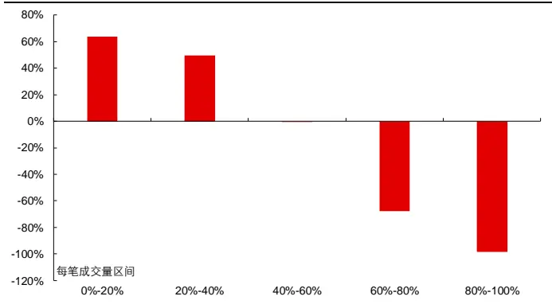
资料来源：天软科技，长江证券研究所

图 2：每笔成交量筛选的局部反转因子年化多空收益率
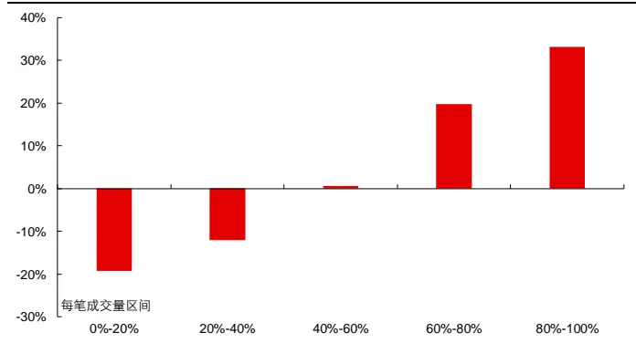
资料来源：天软科技，长江证券研究所

在《高频因子（十）：量价关系中的反转微观结构》中，我们提出了一种解释，即每笔成交量实际同时衡量了成交活跃程度以及价格的变动，而成交活跃度和价格的变动共同反映了交易异常活跃的程度，交易异常活跃的程度是市场过度反应导致价格变动产生反转效应的来源。故通过每笔成交量这一高频数据对数据集的划分，提炼出价格变动具有反转效应的时间段，增强反转因子的表现。

## 成交属性的微观结构

行为经济学中往往将市场上的交易划分为知情者交易和非知情者交易，其中知情者仅在得到对价格产生影响的有效信息后进行交易，而非知情者在任何时候均参与交易，故单从量的维度看，成交量相对整体较为活跃的异常时间段，大概率有知情者参与到交易中。在《高频因子（九）：高频波动中的时间序列信息》中，我们通过均值标准差倍数的方法，区分知情者交易和非知情者交易：以每日一分钟频率划分数据，计算 240 根k 线成交量均值和标准差，则成交量大于均值+1 倍标准差的时间段划分为知情者交易为主的时间段，小于等于均值+1 倍标准差的时间段划分为非知情者交易为主的时间段。下左图中以 2020 年 6月 30 日浦发银行(600000.SH)的分时成交量为例，展示了知情者交易为主时间段和非知情者交易为主时间段的区分情况。

图 3：2020 年 6 月 30 日浦发银行成交量局部峰值
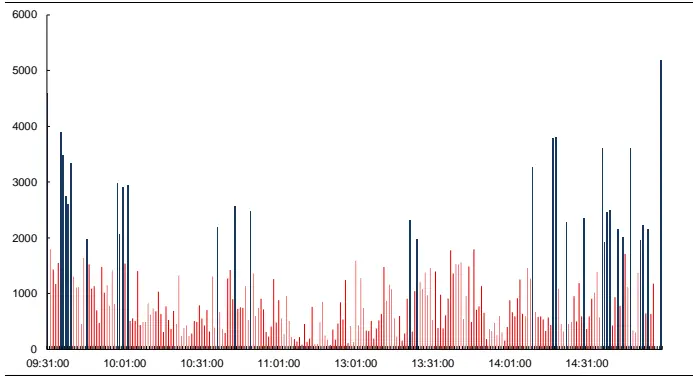
资料来源：天软科技，长江证券研究所

图 4：全市场成交量波峰计数因子回测净值
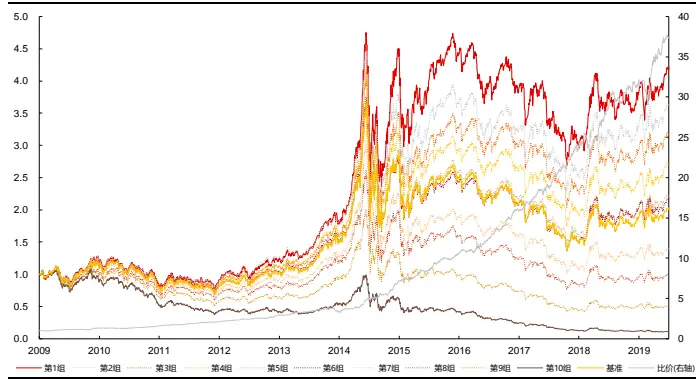
资料来源：天软科技，长江证券研究所

知情者参与交易较多的个股，对市场的其他投资者来说存在信息不对称的情况，个股风险更高，投资者往往要求其具有更高的溢价以补偿风险，基于该逻辑我们在《高频因子（九）：高频波动中的时间序列信息》中构建了波峰计数因子，即过去 20 个交易日过滤波峰的个数，该因子值越大，个股未来期望收益越高。因子在全市场选股的分组净值如右上图所示，分组线性较好，从多空比价上看相对收益较为稳定。

交易微观结构，即通过高频量价数据的刻画，区分出不同交易性质的时间段，具体来说：

高频量价数据的切割下，不同时间段的交易特点不同，因此相同方式构建的因子将呈现不同的逻辑，如每笔成交量较大阶段的价格变动呈现反转效应，每笔成交量较小阶段价格变动呈现动量效应。

日度频率的交易行为往往一致，低频量价数据无法给出交易行为的区分，如日度交易往往同时包含知情者交易和非知情者交易。

## 成交量划分下的微观结构

在《高频因子（九）：高频波动中的时间序列信息》中，我们通过对成交量均值和标准差倍数的筛选，区分了“知情者交易”和“非知情者交易”，实际上直接从结果上看，就是通过区分出哪些时间段相比整个时间段交易异常活跃，交易状态不同，量价刻画的相同交易行为在对价格的影响上也会存在差异。则本节按照以下方式区分微观结构：

以日度频率为窗口期，以一分钟 K 线数据为基础，计算成交量的均值与标准差，以均值+1 倍标准差为阈值，成交量大于阈值的时间段划分为“异常”时间段，成交量小于阈值的时间段划分为“正常”时间段；

以月度频率为窗口期，将过去 21 个交易日日度“异常”时间段的量价数据聚合为“异常”数据集，将日度“正常”时间段的量价数据聚合为“正常”数据集，按照不同数据集计算因子，并在后文中以数据集简称对应因子。

通过这种方式，窥探划分出的不同区间的相同因子表现是否存在差异，下文中以反转、波动率和非流动性因子为例，从整体收益和风险指标上给出相关结果的展示，并从以下维度进行比较：

分组收益的排序情况，包括不同区间因子的排序方向，风格行业线性剥离前后排序方向的变化；

因子选股的信息量，包括不同区间因子的信息含量，因子的信息方向，风格行业线性剥离前后因子的信息含量和信息方向的变化。

## 反转

反转因子参考《高频因子（二）：结构化反转因子》中高频因子的计算方法：

$$
\mathrm{Rev}_{vol}=\sum_{i=1}^{period}w_i\log\frac{Class_{t-i+1}}{close_{t-i}},w_i\propto volume_i
$$

其中Close 为i时间段的收盘价，volume 为i时间段的成交量， $w_{i}$ 为正比于成交量的权重，period为总时间段个数。下图分别展示了在全市场和中证 800 的范围内，风格行业线性剥离前后不同区间计算的反转因子全时间段1的分组2收益。从分组收益的排序情况上看：

不论在全市场还是中证 800 的范围，“异常”区间和“整体”区间计算的反转因子排序方向较为一致，呈现因子越大收益越低的特点，在风格行业线性剥离后排序的有序性有所降低，在因子值较小的尾部组排序不再完全线性，但方向仍然保持一致，整体表现为因子越大收益越低。

“正常”区间计算的反转因子的排序和其他两个区间的因子有较大不同，风格行业线性剥离前，全市场和中证 800 范围内因子的排序较为无序，组与组之间的收益差别不大，而在风格行业线性剥离后，因子有序性有所增加，呈现出因子越大收益越高的特点，且在因子值较小的尾部组这一特点更为显著。

故从分组收益的排序的角度，“正常”区间计算的因子，和“整体”区间及“异常”区间计算的因子在排序方向、排序特点和风格行业线性剥离前后的排序变化上均呈现相反的特点，“整体”区间及“异常”区间计算的因子组间区分较为相近。

图 5：微观结构下反转因子全市场分组收益
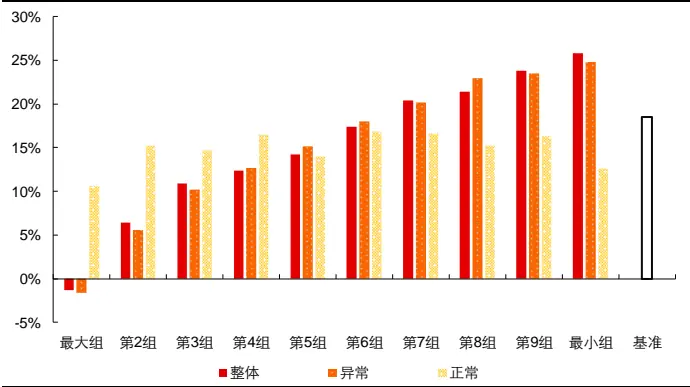
资料来源：天软科技，长江证券研究所

图 6：微观结构下反转因子全市场分组收益（风格行业剥离）
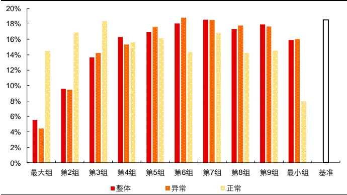
资料来源：天软科技，长江证券研究所

图 7：微观结构下反转因子中证 800 分组收益
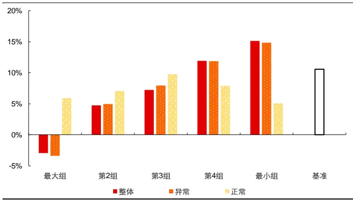
资料来源：天软科技，长江证券研究所

图 8：微观结构下反转因子中证 800 分组收益（风格行业剥离）
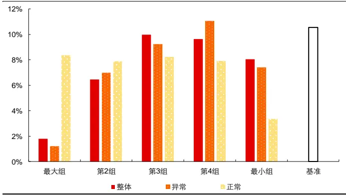
资料来源：天软科技，长江证券研究所

下表展示了不同区间计算的反转因子的 IC 及多头组的风险指标，从因子选股的信息量上看：

如果以负向作为反转因子选股的基础方向，从反转效应角度看，不论在全市场还是中证 800 的范围，是否线性剥离风格和行业的影响，“异常”区间计算的因子均包含相比“整体”区间计算的因子更高的信息量，而“正常”区间计算的因子包含的信息量均小于“整体”区间。

“异常”区间的价格变动是“反转效应”的主要来源，该区间计算的因子 IC 和 ICIR为负，且小于“整体”区间，即交易显著活跃的时间段价格变动呈现出强反转效应；“正常”区间计算的因子实际已经呈现出“动量效应”，因子 IC 和 ICIR 为正，且在线性剥离风格和行业后动量效应更为显著，即交易相对平缓的时间段价格变动呈现出弱动量效应。

从回测中多头组的全区间表现来看，风格行业线性剥离后，“异常”区间计算的反转因子表现优于“整体”区间计算的反转因子，而“正常”区间计算的反转因子也可以从动量效应的角度做到个股的相对区分。

表 1：微观结构下反转因子风险指标

|  | 全市场 |  |  |  |  |  | 中证800 |  |  |  |  |  |
| --- | --- | --- | --- | --- | --- | --- | --- | --- | --- | --- | --- | --- |
|  |  | 中性前 |  |  | 中性后 |  |  | 中性前 |  |  | 中性后 |  |
|  | 整体 | 异常 | 正常 | 整体 | 异常 | 正常 | 整体 | 异常 | 正常 | 整体 | 异常 | 正常 |
| IC | -7.87% | -7.96% | -0.31% | -2.73% | -2.84% | 1.67% | -6.89% | -6.96% | 0.50% | -2.23% | -2.33% | 1.27% |
| ICIR | -94.25% | -99.01% | -4.18% | -77.71% | -81.99% | 59.13% | -64.24% | -66.10% | 5.90% | -53.40% | -56.32% | 32.96% |
| 超额收益 | 6.14% | 5.27% | -5.02% | -2.17% | -2.00% | -3.33% | 4.15% | 3.89% | -4.22% | -2.27% | -2.84% | -1.98% |
| 信息比 | 1.13 | 0.99 | -0.98 | -0.42 | -0.39 | -0.69 | 0.81 | 0.78 | -0.79 | -0.56 | -0.71 | -0.50 |
| 多空收益 | 27.49% | 26.82% | 1.82% | 9.85% | 11.23% | 6.14% | 18.61% | 18.86% | 0.79% | 6.14% | 6.14% | 4.84% |
| 多空夏普比 | 2.99 | 2.93 | 0.27 | 1.78 | 2.00 | 1.21 | 1.91 | 1.94 | 0.14 | 1.27 | 1.24 | 1.02 |

资料来源：天软科技，长江证券研究所

## 波动率

波动率因子直接使用收益率标准差计算3：

$$
Volatility=std(Ret_{i})
$$

其中Ret 为时间段i的收益率，std 为标准差计算函数，下图分别展示了在全市场和中证 800 的范围内，风格行业线性剥离前后不同区间计算的波动率因子全时间段的分组收益，从分组收益的排序情况上看：

线性剥离风格行业前，在全市场和中证 800 范围内，三个区间计算的因子排序均较为一致，其中“正常”区间计算的因子更为无序，组与组之间的收益差距较小，而“异常”区间计算的因子则在较大组部分给出了更强的区分。

线性剥离风格行业后，在全市场和中证 800 范围内，“正常”区间和“整体”区间计算的因子排序较为一致，其中“整体”区间计算的因子组间收益区分较弱，“异常”区间计算的因子在较大组部分给出较强的区分，“正常”区间计算的因子则呈现了一定的正向排序。

故从分组收益的排序的角度，“异常”区间计算的因子和“整体”区间计算的因子在排序方向和风格行业线性剥离前后的排序变化上表现一致，且“异常”区间计算的因子在各个维度下组间收益的区分均更大；“正常”区间计算的因子在风格行业线性剥离后排序方向与其他两个因子相反。

图 9：微观结构下波动率因子全市场分组收益
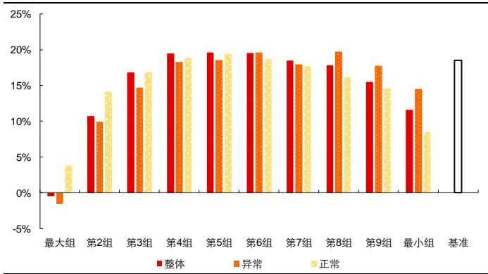
资料来源：天软科技，长江证券研究所

图 10：微观结构下波动率因子全市场分组收益（风格行业剥离）
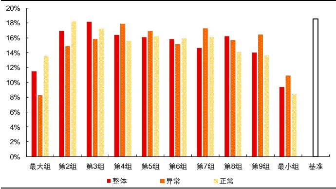
资料来源：天软科技，长江证券研究所

图 11：微观结构下波动率因子中证 800分组收益
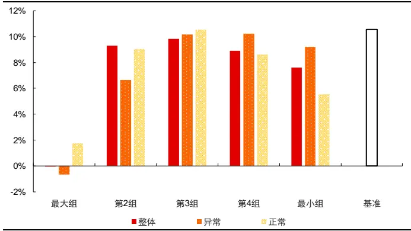
资料来源：天软科技，长江证券研究所

图 12：微观结构下波动率因子中证 800 分组收益（风格行业剥离）
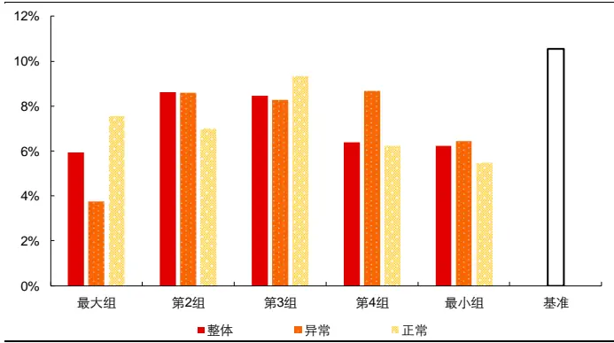
资料来源：天软科技，长江证券研究所

下表展示了不同区间计算的波动率因子的 IC 及多头组的风险指标，从因子选股的信息量上看：

如果以负向作为波动率因子选股的基础方向，从风险刻画角度看，不论在全市场还是中证 800 的范围，是否线性剥离风格和行业的影响，“异常”区间计算的因子均包含相比“整体”区间计算的因子更高的信息量，而“正常”区间计算的因子包含的信息量均小于“整体”区间。

“异常”区间的计算的因子刻画了个股交易中的“过度反应”，该区间计算的因子IC 和 ICIR 为负，且小于“整体”区间，即交易显著活跃的时间段价格波动呈现出低波效应；“正常”区间计算的因子刻画了个股交易中的“固有波动”，IC 在 0 附近，在线性剥离风格和行业后呈现一定的正向，即交易相对平缓的时间段价格波动一定程度上刻画了个股的风险溢价。

从回测中多头组的全区间表现来看，风格行业线性剥离前后，“异常”区间计算的波动率因子表现优于“整体”区间计算的波动率因子，而“正常”区间计算的波动率因子对个股的区分较弱。

表 2：微观结构下波动率因子风险指标

| 全市场 |  |  |  |  |  |  |  | 中证800 |  |  |  |  |  |
| --- | --- | --- | --- | --- | --- | --- | --- | --- | --- | --- | --- | --- | --- |
|  |  | 中性前 |  |  | 中性后 |  |  | 中性前 |  |  |  | 中性后 |  |
|  | 整体 | 异常 | 正常 | 整体 | 异常 | 正常 | 整体 | 异常 |  | 正常 | 整体 | 异常 | 正常 |
| IC | -5.21% | -6.52% | -3.22% | -0.17% | -1.20% | 0.51% | -4.69% | -6.27% | -2.94% |  | -0.61% | -1.48% | 0.01% |
| ICIR | -37.28% | -49.33% | -23.97% | -3.18% | -27.55% | 9.45% | -34.03% | -43.34% |  | -22.65% | -10.65% | -30.51% | 0.12% |
| 超额收益 | -5.89% | -3.42% | -8.51% | -7.64% | -6.40% | -4.10% | -2.68% |  | -1.23% | -4.54% | -3.92% | -3.73% | -2.73% |
| 信息比 | -0.59 | -0.31 | -0.93 | -1.71 | -1.34 | -0.67 | -0.31 | -0.12 |  | -0.60 | -0.97 | -0.93 | -0.59 |
| 多空收益 | 12.10% | 16.29% | 4.47% | -1.95% | 2.36% | 4.78% | 7.66% | 9.93% |  | 3.75% | 0.27% | 2.59% | 1.96% |
| 多空夏普比 | 0.82 | 1.10 | 0.38 | -0.29 | 0.42 | 0.73 | 0.62 | 0.76 | 0.36 |  | 0.08 | 0.52 | 0.36 |

资料来源：天软科技，长江证券研究所

## 流动性

流动性因子参考《高频因子（五）：高频因子和交易行为》中流动性因子的计算方法：

$$
illiq_{guiji}=\frac{\log\prod(1+|Ret_{i}|)}{\sum Amount_{i}}
$$

其中Ret 为时间段i的收益率，∏ 为累乘函数，Amount 为时间段i的成交额，下图分别展示了在全市场和中证 800 的范围内，风格行业线性剥离前后不同区间计算的流动性因子全时间段的分组收益，从分组收益的排序情况上看：

线性剥离风格行业前，在全市场和中证 800 范围内，三个区间计算的因子排序均较为一致，且排序的线性均较好。

线性剥离风格行业后，在全市场和中证 800 范围内，三个区间计算的因子排序均较为一致，但排序的线性有所减弱，以头部组的收益区分为主。

故从分组收益的排序的角度，三个区间计算的因子在排序方向、排序特点和风格行 业线性剥离前后的排序变化上表现一致。

图 13：微观结构下流动性因子全市场分组收益
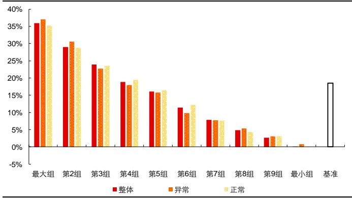
资料来源：天软科技，长江证券研究所

图 14：微观结构下流动性因子全市场分组收益（风格行业剥离）
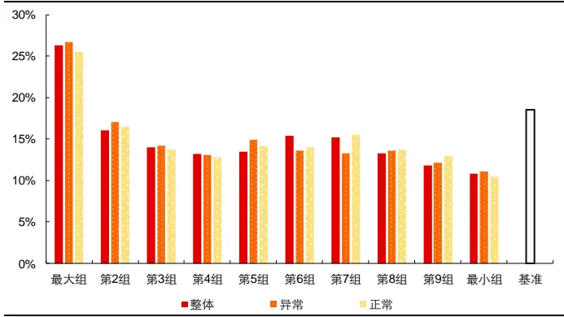
资料来源：天软科技，长江证券研究所

图 15：微观结构下流动性因子中证 800分组收益
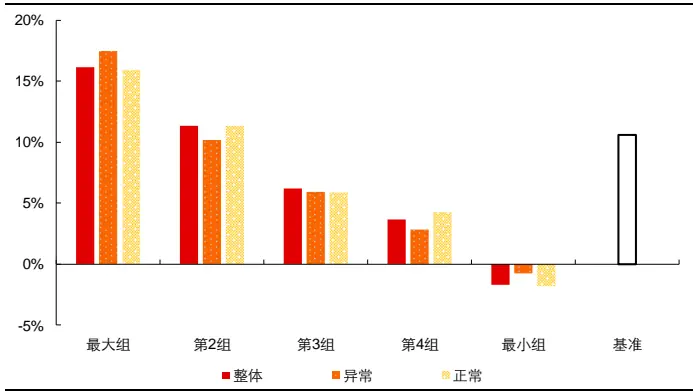
资料来源：天软科技，长江证券研究所

图 16：微观结构下流动性因子中证 800分组收益（风格行业剥离）
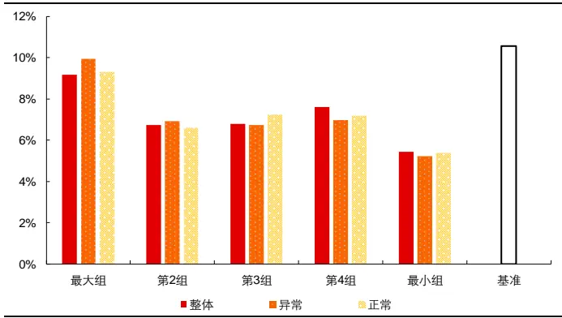
资料来源：天软科技，长江证券研究所

下表展示了不同区间计算的流动性因子的 IC 及多头组的风险指标，从因子选股的信息量上看：

如果以正向作为流动性因子选股的基础方向，从流动性溢价角度看，不论在全市场还是中证 800 的范围，是否线性剥离风格和行业的影响，三个区间计算的因子信息量均相近。

从回测中多头组的全区间表现来看，风格行业线性剥离前后，三个区间计算的因子表现相近。

表 3：微观结构下流动性因子风险指标

| 全市场 |  |  |  |  |  |  |  | 中证800 |  |  |  |  |  |
| --- | --- | --- | --- | --- | --- | --- | --- | --- | --- | --- | --- | --- | --- |
|  |  | 中性前 |  |  | 中性后 |  |  | 中性前 |  |  | 中性后 |  |  |
|  | 整体 | 异常 | 正常 | 整体 | 异常 | 正常 | 整体 | 异常 | 正常 |  | 整体 | 异常 | 正常 |
| IC | 9.00% | 8.71% | 9.01% | 1.83% | 1.98% | 1.75% | 5.89% | 5.58% |  | 5.87% | 0.47% | 0.69% | 0.41% |
| ICIR | 54.42% | 51.81% | 55.45% | 38.12% | 45.70% | 35.63% | 37.87% |  | 35.44% | 37.69% | 9.59% | 16.24% | 7.84% |
| 超额收益 | 14.71% | 15.58% | 14.09% | 6.54% | 6.88% | 5.86% | 5.04% |  | 6.24% | 4.87% | -1.27% | -0.57% | -1.15% |
| 信息比 | 2.08 | 2.23 | 1.96 | 1.24 | 1.37 | 1.08 | 0.85 |  | 1.08 | 0.82 | -0.28 | -0.12 | -0.24 |
| 多空收益 | 35.83% | 35.95% | 35.29% | 13.88% | 14.18% | 13.56% | 18.13% | 18.35% |  | 18.08% | 3.53% | 4.47% | 3.70% |
| 多空夏普比 | 2.15 | 2.10 | 2.14 | 2.30 | 2.46 | 2.18 | 1.39 | 1.39 |  | 1.39 | 0.71 | 0.92 | 0.72 |

资料来源：天软科技，长江证券研究所

## 量价因子的收益来源

在《高频因子（五）：高频因子和交易行为》中，我们定性的讨论了高频因子的本质，刻画的是交易行为，获得的是经验收益，即市场中存在的交易的规律会在未来重复表现，而这种规律又可以根据因子收益的来源，又可以分为：

低风险确定性收益，核心逻辑为“反常”，即个股局部交易中呈现异常情况时收益有较大不确定性，而交易行为正常的个股则可以提供稳定收益，代表因子有反转因子、波动率因子。

高风险高溢价收益，核心逻辑为“风险溢价”，即个股拥有更高的固有风险，投资者会要求其有更高的预期收益率或更低的现价，代表因子有流动性因子、波峰计数因子。

从定性的分析上可以看出，两类因子的最大区别为因子的衰减速度，其中低风险确定性收益基于个股局部交易异常，刻画该行为的因子截面变化速度较快，高风险高溢价收益基于个股的固有风险，刻画该行为的因子截面变化速度较慢。下图从因子截面相关性的角度，展示了上文中不同区间计算的反转因子、波动率因子和流动性因子在线性剥离风格行业影响后，在全市场和中证 800 范围内的衰减速度：

- 全市场和中证 800 范围内，每个因子的截面相关性相对水平较为一致；

- 三个区间计算的反转因子截面相关性均较低，衰减速度较快；

- 三个区间计算的流动性因子截面相关性均较高，衰减速度较慢；

不同区间计算的波动率因子有结构上的变化，其中“异常”区间计算的波动率因子截面相关性较低，衰减速度较快，“正常”区间计算的波动率因子截面相关性较高，衰减速度较慢，而“整体”区间计算的波动率因子截面相关性介于两者之间。

图 17：全市场微观结构下因子截面自相关性
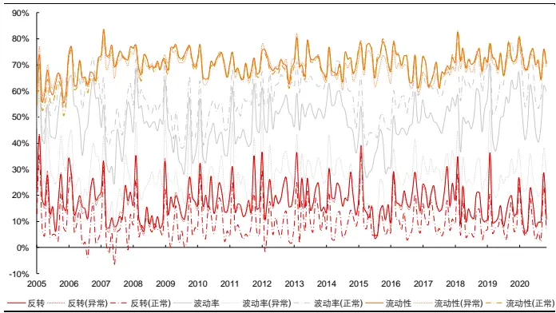
资料来源：天软科技，长江证券研究所

图 18：中证 800微观结构下因子截面自相关性
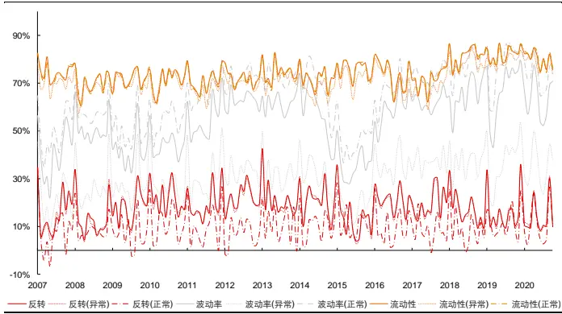
资料来源：天软科技，长江证券研究所

而这一点也从上文中不同区间因子的表现中，也得到了佐证，下表整列了不同区间计算的各个因子的 IC 和 ICIR，并在表中以红色标注出“异常”区间和“正常”区间中 IC 和ICIR 大于“整体”区间的部分，以绿色标注出“异常”区间和“正常”区间中 IC 和 ICIR小于“整体”区间的部分4，从相对“整体”区间计算的因子的变化上来看：

反转因子和波动率因子方向均为负向，故不论在全市场还是中证 800 范围内，不论是否线性剥离风格和行业的影响，“异常”区间计算的反转、波动率因子信息量均高于“整体”区间，“正常”区间计算的反转、波动率信息量均低于“整体”区间5，即成交显著活跃的区间均可以加强两个因子表达的逻辑。

成交显著活跃的区间较大概率存在交易异常，成交较为平稳的区间异常交易较少，低风险确定性收益的因子基于个股局部交易异常，故成交显著活跃区间的部分可以加强该类因子的收益。

流动性因子方向为正向，不论在全市场还是中证 800 范围内，不论是否线性剥离风格和行业的影响，三个区间计算的流动性因子无明显变化规律，数值上看不同区间计算的因子信息量无明显差异，即成交是否显著活跃并不影响流动性因子表达的逻辑。

高风险高溢价收益的因子基于个股的固有风险，故成交是否显著活跃，交易是否存在异常，对这种属性的刻画无明显影响，故该种微观划分方式不能加强该类因子的收益。

表 4：微观结构下因子信息量

|  | 全市场 |  |  |  |  |  |  |  | 全市场 |  |  |  |  |
| --- | --- | --- | --- | --- | --- | --- | --- | --- | --- | --- | --- | --- | --- |
|  |  |  | 中性前 |  |  | 中性后 |  |  | 中性前 |  |  | 中性后 |  |
|  | IC | 整体 | 异常 | 正常 | 整体 | 异常 | 正常 | 整体 | 异常 | 正常 | 整体 | 异常 | 正常 |
| 反转 |  | -7.87% | -7.96% | -0.31% | -2.73% | -2.84% | 1.67% | -6.89% | -6.96% | 0.50% | -2.23% | -2.33% | 1.27% |
|  | ICIR | -94.25% | -99.01% | -4.18% | -77.71% | -81.99% | 59.13% | -64.24% | -66.10% | 5.90% | -53.40% | -56.32% | 32.96% |
| 波动率 | IC | -5.21% | -6.52% | -3.22% | -0.17% | -1.20% | 0.51% | -4.69% | -6.27% | -2.94% | -0.61% | -1.48% | 0.01% |
|  | ICIR | -37.28% | -49.33% | -23.97% | -3.18% | -27.55% | 9.45% | -34.03% | -43.34% | -22.65% | -10.65% | -30.51% | 0.12% |
| 流动性 | IC | 9.00% | 8.71% | 9.01% | 1.83% | 1.98% | 1.75% | 5.89% | 5.58% | 5.87% | 0.47% | 0.69% | 0.41% |
|  | ICIR | 54.42% | 51.81% | 55.45% | 38.12% | 45.70% | 35.63% | 37.87% | 35.44% | 37.69% | 9.59% | 16.24% | 7.84% |

资料来源：天软科技，长江证券研究所

交易活跃度不同的区间，价格变动呈现不同的趋势效应，交易显著活跃的时间段价格变动呈现出强反转效应，交易相对平缓的时间段价格变动呈现出弱动量效应，反转因子可以通过高频数据对结构的微观划分，做到更精细的刻画。

交易活跃度不同的区间，价格波动呈现不同的风险属性，交易显著活跃的时间段价格波动呈现出低波效应，交易相对平缓的时间段价格波动一定程度上刻画了个股的风险溢价，波动率因子可以通过高频数据对结构的微观划分，做到更纯粹低波效应的刻画。

交易活跃度不同的区间，均呈现流动性溢价特点，根据交易活跃程度对结构划分在该维度没有信息增量。

量价因子收益的来源可以按照个股局部交易异常或个股的固有风险，分为低风险确定性收益和高风险高溢价收益，表现上看，低风险确定性收益的因子衰减速度较快，且受到交易是否异常活跃的影响，高风险高溢价收益的因子衰减速度较慢，且不受交易是否异常活跃的影响。

## 划分的合理性

同挖掘高频因子一样，通过高频数据构建指标对数据进行划分也可以产生无限可能，但仍和挖掘高频因子表现一样，不同的划分方式得到的划分结果可能雷同。如何看待微观划分的这种现象，又该如何抓住真正内在的划分的逻辑？本节通过另外两种和交易异常活跃相关的划分方式，讨论划分的合理性。

## 上下行

通过收益的正负给出时间段归类，是一种较为常见的区间划分方法，一方面，上下行区间的市场环境存在差异，下行时间段市场风险更高，另一方面，上行时间段的交易相比全时间段往往更活跃，以中证全指为例，自指数发布6至 2020-11-30：

指数年化上行波动率为 15.10%，下行波动率为 19.57%，即市场上涨时相对市场下跌时更为平稳；

指数日度收益率和日度成交量的相关系数为 10.11%，呈现一定程度的正相关，即市场上行时交易更为活跃。

高频视角下，上下行区间的分化有所减弱，但仍然保持和低频相同的特点：

以一分钟频率数据计算的指数年化上行波动率为 14.02%，下行波动率为 17.60%，相对差距减小，但仍然表现出市场上涨时相对市场下跌时更为平稳的特点；

从成交量上看，以一分钟频率，每日上行区间成交量占比的日度时间序列平均为50.49%，略高于下行区间，从成交活跃上看，以每日成交量的均值+1 倍标准差作为成交是否异常活跃的阈值，上行区间占比的日度时间序列平均为 52.20%，略高于下行区间，仍具有市场上行时交易更活跃的特点。

故上下行区间本身具有特定属性的划分，且主要体现在整体风险的度量上，故本节以波动率因子为例，展示划分回测的结果。下表展示了根据上下行划分区间，波动率因子的IC 及多头组的风险指标，从因子选股的信息量上看：

如果以负向作为波动率因子选股的基础方向，从低波效应体现的过度反应角度看，除线性剥离风格和行业影响前的全市场范围外，其他情况下“异常”区间计算的因子均包含相比“整体”区间计算的因子更高的信息量，而“正常”区间计算的因子包含的信息量均小于“整体”区间，即上行时间段价格波动呈现出更强的低波效应，下行时间段价格波动低波效应减弱；

和上文中根据交易是否异常活跃划分区间后计算的波动率因子相比，上行和下行划分区间在对风险属性的拆解上效果有所下降：

(1) 上行区间的低波效应改进幅度降低，下行区间的刻画的波动未展示出风险溢价的特性，上下行区间计算的波动率因子和整体区间计算的波动率因子比较上看，差异有所收敛。

(2) 从回测中多头组的全区间表现来看，上行区间计算的波动率因子表现相比于整体区间计算的波动率因子改进幅度降低，三个区间计算的因子在线性剥离风格和行业影响后均无对个股的区分能力。

表 5：上下行划分下波动率因子风险指标

|  | 全市场 |  |  |  |  |  | 中证800 |  |  |  |  |  |
| --- | --- | --- | --- | --- | --- | --- | --- | --- | --- | --- | --- | --- |
|  |  | 中性前 |  |  | 中性后 |  |  | 中性前 |  |  | 中性后 |  |
|  | 整体 | 上行 | 下行 | 整体 | 上行 | 下行 | 整体 | 上行 | 下行 | 整体 | 上行 | 下行 |
| IC | -5.21% | -4.52% | -4.40% | -0.17% | -0.72% | -0.06% | -4.69% | -5.65% | -4.04% | -0.61% | -1.18% | -0.55% |
| ICIR | -37.28% | -33.10% | -30.70% | -3.18% | -15.46% | -1.12% | -34.03% | -38.20% | -28.92% | -10.65% | -25.66% | -9.77% |
| 超额收益 | -5.89% | -4.99% | -6.87% | -7.64% | -5.74% | -7.48% | -2.68% | -1.52% | -3.12% | -3.92% | -3.25% | -4.38% |
| 信息比 | -0.59 | -0.49 | -0.70 | -1.71 | -1.21 | -1.63 | -0.31 | -0.16 | -0.37 | -0.97 | -0.79 | -1.09 |
| 多空收益 | 12.10% | 8.23% | 7.72% | -1.95% | 1.36% | -2.90% | 7.66% | 9.35% | 5.60% | 0.27% | 2.23% | -0.23% |
| 多空夏普比 | 0.82 | 0.63 | 0.56 | -0.29 | 0.24 | -0.43 | 0.62 | 0.74 | 0.48 | 0.08 | 0.46 | -0.01 |

资料来源：天软科技，长江证券研究所

## 时间段

A 股市场的交易活跃在日度时间序列上往往表现为两头中间高的“W”型特点，即每日开盘、中午开盘和收盘成交较为活跃，下图分别从个股截面和指数时间序列两个维度，给出了日度每分钟成交活跃的整体刻画：

个股截面，即展示上文中月度频率划分成交活跃个股的整体情况，这里以 2020-11-02 至 2020-11-30 的计算区间为例，以日度频率为窗口期，根据成交量 1 倍标准差筛选出每只个股每日的成交活跃时间段，统计计算区间内各个时间段所有个股交易活跃的次数，于左下图中给出展示。

指数时间序列，即将上文中成交活跃定义的方法用于特定指数，统计其历史时间序列的整体水平，这里以中证全指发布后至 2020-11-30 的计算区间为例，以日度频率为窗口期，根据成交量 1 倍标准差筛选出指数每日的成交活跃时间段，统计时间序列上各个时间段交易活跃的次数，于右下图中给出展示。

从各个时间段的交易活跃情况看，不论是对所有个股在截面上的刻画，还是指数在时间序列上的刻画，均呈现了每日开盘、中午开盘的第一分钟和收盘成交活跃的特点，这种成交在时间序列上的特点使得我们可以根据时间段进行区间划分，故本文将每日 09:31至 09:41 以及 13:01、14:56、14:57、15:00 的时间段划分为交易活跃区间，将其他时间段划分为交易平缓区间。

图 19：个股截面交易活跃度
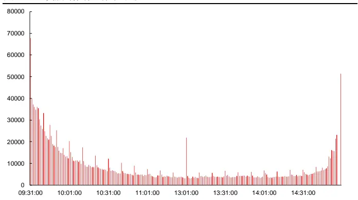
资料来源：天软科技，长江证券研究所

图 20：指数时间序列交易活跃度
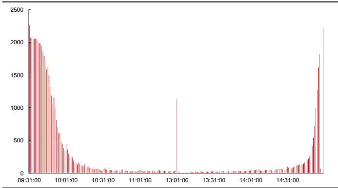
资料来源：天软科技，长江证券研究所

时间段主要对成交活跃度属性给出区分，本节以反转因子为例，展示划分回测的结果。下表展示了根据时间段划分区间，反转因子的 IC 及多头组的风险指标，从因子选股的信息量上看：

如果以负向作为反转因子选股的基础方向，从“反转效应”角度看，除线性剥离风格和行业影响前的中证 800 范围中的 ICIR，其他情况下“平缓”区间计算的因子均包含相比“整体”区间计算的因子更高的信息量，而“活跃”区间计算的因子包含的信息量均小于“整体”区间，即全市场交易显著活跃的时间段价格变动呈现出弱反转效应，全市场交易相对平缓的时间段价格变动呈现出强反转效应，这一点不仅与上文中微观结构划分的反转因子表现相反，且不符合低风险确定性收益的逻辑；

结果一方面说明了以时间段划分的方式无法区分出交易中的异常，另一方面也说明全市场的异常交易和个股自身的异常交易有较大差异，个股自身的交易异常更为重要。

表 6：时间段划分下反转因子风险指标

| 全市场 |  |  |  |  |  |  |  | 中证800 |  |  |  |  |  |
| --- | --- | --- | --- | --- | --- | --- | --- | --- | --- | --- | --- | --- | --- |
|  |  | 中性前 |  |  | 中性后 |  |  | 中性前 |  |  |  | 中性后 |  |
|  | 整体 | 活跃 | 平缓 | 整体 | 活跃 | 平缓 | 整体 | 活跃 | 平缓 |  | 整体 | 活跃 | 平缓 |
| IC | -7.87% | -2.67% | -8.30% | -2.73% | -0.15% | -3.15% | -6.89% | -2.29% |  | -6.93% | -2.23% | 0.34% | -2.54% |
| ICIR | -94.25% | -40.21% | -95.89% | -77.75% | -4.36% | -82.52% | -64.24% |  | -26.44% | -62.08% | -53.40% | 7.88% | -56.07% |
| 超额收益 | 6.14% | -2.35% | 6.66% | -2.27% | -6.36% | -0.04% | 4.15% |  | -1.19% | 2.09% | -2.27% | -4.72% | -2.19% |
| 信息比 | 1.13 | -0.41 | 1.24 | -0.44 | -1.32 | 0.02 | 0.81 |  | -0.22 | 0.42 | -0.56 | -1.19 | -0.57 |
| 多空收益 | 27.49% | 9.79% | 30.06% | 9.77% | 1.49% | 13.59% | 18.61% | 7.67% |  | 16.24% | 6.14% | 0.88% | 6.02% |
| 多空夏普比 | 2.99 | 1.35 | 3.16 | 1.77 | 0.30 | 2.35 | 1.91 | 1.01 |  | 1.66 | 1.27 | 0.18 | 1.14 |

资料来源：天软科技，长江证券研究所

总结上述两种和交易异常活跃相关的划分方式可以看到，直接根据交易活跃状态的划分，比和其相关的划分方式在对因子表现的增强上效果更好，这一方面从统计结果上说明根据成交活跃进行划分比根据行情上行下行和市场整体活跃时间段更为合理，另一方面也侧面佐证了反转因子和波动率因子的收益来源为交易异常中的不确定性，所以直接根据该逻辑实现划分可以对因子信息做到提纯，而间接的划分方式则会降低信息提纯效果。

## 异常现象背后的逻辑

根据全市场交易是否活跃作为划分区间的标准，反转因子的表现呈现了相反的逻辑，即全市场交易显著活跃的时间段价格变动反而呈现出弱反转效应，这说明存在特定的时间段，虽然交易活跃，但价格的变动呈现动量效应，导致整体的反转效应被削弱，而这一时间段就是隔夜开盘的时间段：

开盘需要消化隔夜信息，具有成交活跃的特点；

- 信息带来的价格变动往往表现为动量效应。

故本节在成交量均值+1倍标准差划分区间的基础上，从成交活跃区间中剔除每日开盘，即 09:31 时间段，构建反转因子，在下图中分别展示了因子线性剥离风格行业影响后，因子在全市场和中证 800 内的回测净值，并在下表中给出和未剔除 09:31 时间段的反转因子整体回测风险指标上的对比，表中以红色标注出剔除 09:31 时间段后反转因子表现优于剔除前的部分，以绿色标注出剔除09:31时间段后反转因子表现劣于剔除前的部分：

从回测净值上看，线性剥离风格行业后，反转因子的信息主要集中在空头部分，且时序表现稳定；

从整体风险指标上看，除线性剥离风格行业前，中证 800 内剔除 09:31 时间段前的反转因子在回测收益上优于剔除 09:31 时间段后，其他情况均为剔除 09:31 时间段后的反转因子表现更好，剔除特殊的开盘时间段可以进一步提纯反转效应信息。

图 21：交易活跃及时间划分下反转因子全市场净值(风格行业剥离)
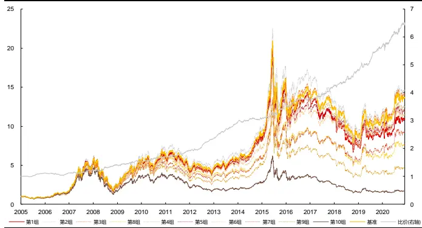
资料来源：天软科技，长江证券研究所

图 22：交易活跃及时间划分下反转因子中证 800 净值(风格行业剥离)
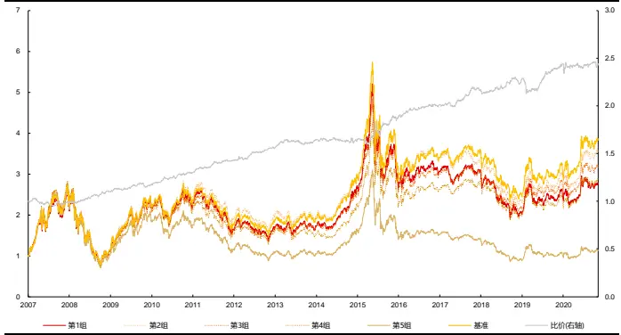
资料来源：天软科技，长江证券研究所

表 7：交易活跃及时间划分下反转因子风险指标

| 全市场 |  |  |  |  | 中证800 |  |  |  |
| --- | --- | --- | --- | --- | --- | --- | --- | --- |
|  | 中性前 |  |  | 中性后 |  | 中性前 |  | 中性后 |
|  | 交易活跃 | 交易活跃及时间段 | 交易活跃 | 交易活跃及时间段 | 交易活跃 | 交易活跃及时间段 | 交易活跃 | 交易活跃及时间段 |
| IC | -7.96% | -8.27% | -2.84% | -3.60% | -6.96% | -7.02% | -2.33% | -2.71% |
| ICIR | -99.01% | -101.00% | -81.99% | -102.12% | -66.10% | -67.13% | -56.32% | -63.86% |
| 超额收益 | 5.27% | 5.28% | -2.00% | -1.48% | 3.89% | 2.44% | -2.84% | -2.45% |
| 信息比 | 0.99 | 0.99 | -0.39 | -0.31 | 0.78 | 0.50 | -0.71 | -0.67 |
| 多空收益 | 26.82% | 28.33% | 11.23% | 12.98% | 18.86% | 17.17% | 6.14% | 6.91% |
| 多空夏普比 | 2.93 | 3.00 | 2.00 | 2.28 | 1.94 | 1.78 | 1.24 | 1.35 |

资料来源：天软科技，长江证券研究所

上行时间段交易相对活跃，但相比下行时间段差异并不显著，所以上下行区间的划分方式可以一定程度上对个股风险属性做出拆解，其中上行时间段低波效应增强，下行时间段低波效应减弱，但效果相比成交异常的划分方式有所下降。

根据全市场整体交易状态，从时间段上给出所有个股统一划分方式，从反转因子的表现上看呈现出和成交异常划分方式相反的特点，全市场交易显著活跃的时间段价格变动呈现出弱反转效应，全市场交易相对平缓的时间段价格变动呈现出强反转效应，该表现和反转因子低风险确定性收益的逻辑相悖，说明全市场交易活跃状态并不是对个股反转微观结构划分的合理方式。

当同划分逻辑在因子改进上呈现相反结果时，说明某种划分下有增量信息可以提取。由于每日开盘时间段的存在，消化信息导致的价格变动呈现出动量效应，全市场交易显著活跃的时间段价格变动反而呈现出弱动量效应，故在根据成交量均值+1 倍标准差划分区间的基础上，从成交活跃区间中剔除每日开盘即 09:31 时间段，构建反转因子，进一步改进了反转因子表现，除线性剥离风格行业前的中证 800范围内，剔除开盘前的反转因子回测风险指标更高，其他情况均为剔除后反转因子风险指标更高。

## 总结

交易微观结构，即通过高频量价数据的刻画，区分出不同交易性质的时间段。交易性质不同，使得相同方式构建的因子将呈现不同的逻辑，如每笔成交量较大阶段的价格变动呈现反转效应，每笔成交量较小阶段价格变动呈现动量效应。日度时间窗口下交易行为往往一致，低频量价数据无法给出交易行为的区分，如日度交易往往同时包含知情者交易和非知情者交易，但高频时间窗口下结构却存在差异。

交易活跃度不同的区间，价格变动呈现不同的趋势效应，价格波动呈现不同的风险属性。交易显著活跃的时间段价格变动呈现出强反转效应，波动呈现出低波效应，交易相对平缓的时间段价格变动呈现出弱动量效应，波动刻画了风险溢价。交易活跃度不同的区间，均呈现流动性溢价特点，根据交易活跃程度对结构划分在流动性维度没有信息增量。

根据因子收益来源直接进行结构划分可以更好的做到信息的提纯，改进因子表现。直接根据交易活跃状态的划分，比通过行情上行或下行和市场整体活跃时间段两种间接的划分方式在对反转和波动率因子表现的增强上效果更好，也侧面佐证了反转因子和波动率因子的收益来源为交易异常中的不确定性。

当同划分逻辑在因子改进上呈现相反结果时，说明某种划分下有增量信息可以提取。由于每日开盘时间段隔夜信息的存在，消化信息导致的价格变动呈现出动量效应，全市场交易显著活跃的时间段价格变动反而呈现出弱反转效应，故在根据成交量均值+1 倍标准差划分区间的基础上，从成交活跃区间中剔除每日开盘即 09:31 时间段，构建反转因子，进一步改进了反转因子表现。

## 投资评级说明

行业评级 报告发布日后的 12 个月内行业股票指数的涨跌幅相对同期沪深 300 指数的涨跌幅为基准，投资建议的评级标准为：

看 好： 相对表现优于市场

中性： 相对表现与市场持平

看 淡： 相对表现弱于市场

公司评级 报告发布日后的 12 个月内公司的涨跌幅相对同期沪深 300 指数的涨跌幅为基准，投资建议的评级标准为：

买 入： 相对大盘涨幅大于 10%

增 持： 相对大盘涨幅在 5%～10%之间

中 性： 相对大盘涨幅在-5%～5%之间

减 持： 相对大盘涨幅小于-5%

无投资评级： 由于我们无法获取必要的资料，或者公司面临无法预见结果的重大不确定性事件，或者其他原因，致使我们无法给出明确的投资评级。

相关证券市场代表性指数说明：A 股市场以沪深 300 指数为基准；新三板市场以三板成指（针对协议转让标的）或三板做市指数（针对做市转让标的）为基准；香港市场以恒生指数为基准。

## 办公地址:

[Tabl上海

Add /浦东新区世纪大道 1198 号世纪汇广场一座 29 层P.C /（200122）

武汉

Add /武汉市新华路特8 号长江证券大厦 11 楼P.C /（430015）

北京

Add /西城区金融街 33 号通泰大厦 15 层P.C /（100032）

深圳

Add /深圳市福田区中心四路1号嘉里建设广场 3 期 36 楼P.C /（518048）

## 分析师声明：

作者具有中国证券业协会授予的证券投资咨询执业资格并注册为证券分析师，以勤勉的职业态度，独立、客观地出具本报告。分析逻辑基于作者的职业理解，本报告清晰准确地反映了作者的研究观点。作者所得报酬的任何部分不曾与，不与，也不将与本报告中的具体推荐意见或观点而有直接或间接联系，特此声明。

## 重要声明：

长江证券股份有限公司具有证券投资咨询业务资格，经营证券业务许可证编号：10060000。

本报告仅限中国大陆地区发行，仅供长江证券股份有限公司（以下简称：本公司）的客户使用。本公司不会因接收人收到本报告而视其为客户。本报告的信息均来源于公开资料，本公司对这些信息的准确性和完整性不作任何保证，也不保证所包含信息和建议不发生任何变更。本公司已力求报告内容的客观、公正，但文中的观点、结论和建议仅供参考，不包含作者对证券价格涨跌或市场走势的确定性判断。报告中的信息或意见并不构成所述证券的买卖出价或征价，投资者据此做出的任何投资决策与本公司和作者无关。

本报告所载的资料、意见及推测仅反映本公司于发布本报告当日的判断，本报告所指的证券或投资标的的价格、价值及投资收入可升可跌，过往表现不应作为日后的表现依据；在不同时期，本公司可以发出其他与本报告所载信息不一致及有不同结论的报告；本报告所反映研究人员的不同观点、见解及分析方法，并不代表本公司或其他附属机构的立场；本公司不保证本报告所含信息保持在最新状态。同时，本公司对本报告所含信息可在不发出通知的情形下做出修改，投资者应当自行关注相应的更新或修改。

本公司及作者在自身所知情范围内，与本报告中所评价或推荐的证券不存在法律法规要求披露或采取限制、静默措施的利益冲突。

本报告版权仅为本公司所有，未经书面许可，任何机构和个人不得以任何形式翻版、复制和发布。如引用须注明出处为长江证券研究所，且不得对本报告进行有悖原意的引用、删节和修改。刊载或者转发本证券研究报告或者摘要的，应当注明本报告的发布人和发布日期，提示使用证券研究报告的风险。未经授权刊载或者转发本报告的，本公司将保留向其追究法律责任的权利。