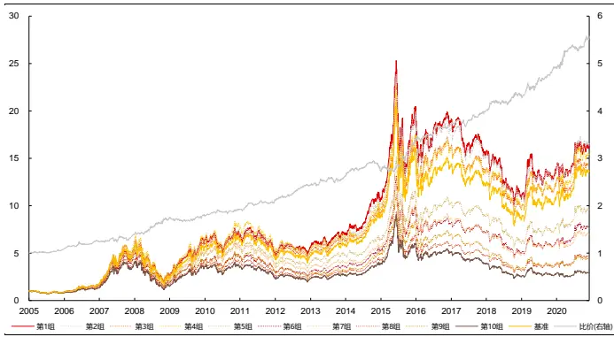
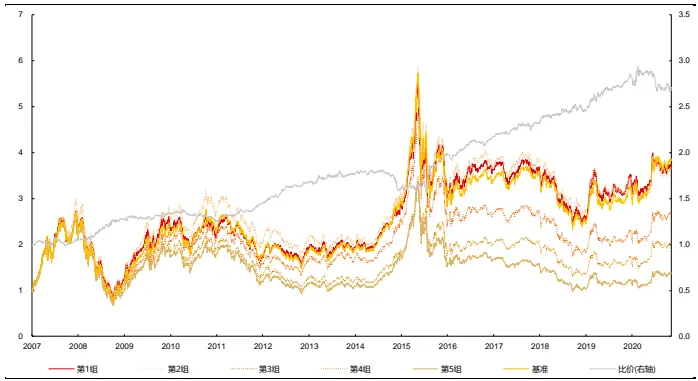
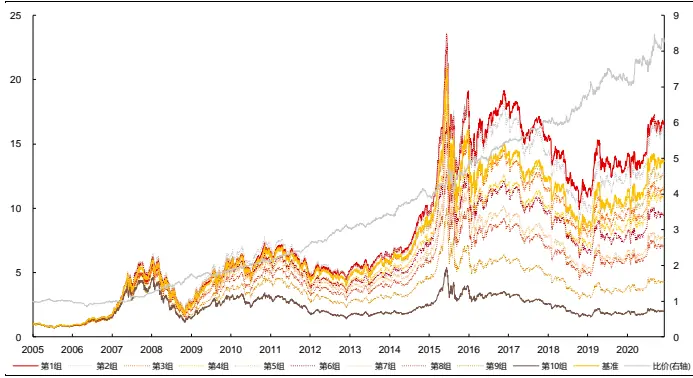
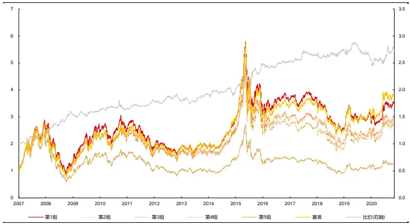
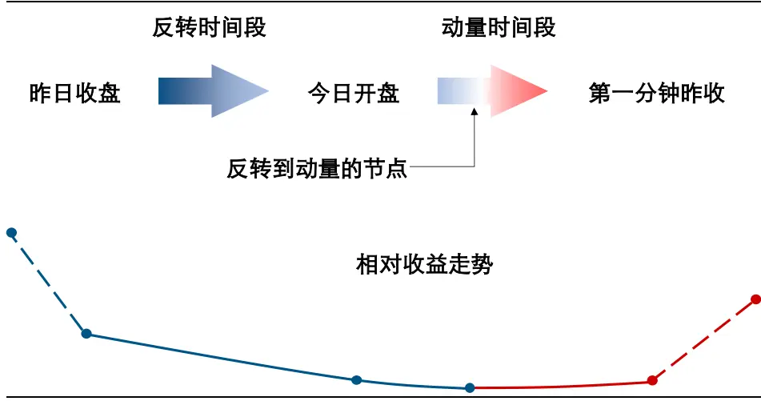
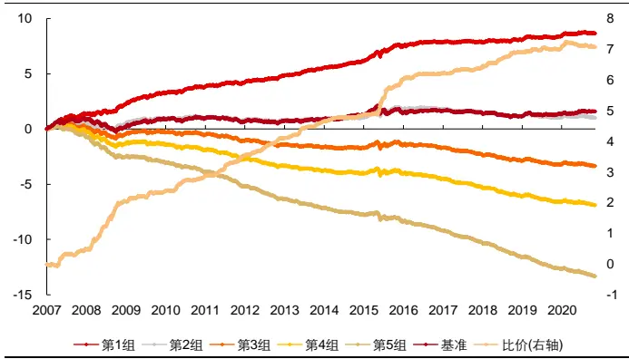
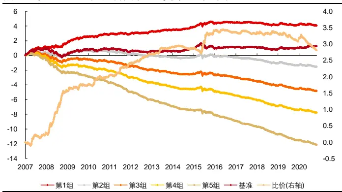

# 高频因子（十二）：日内与日间

## 分析师及联系人

[Table_A● 覃川桃 (8621)61118766 qinct@cjsc.com.cn 执业证书编号： S0490513030001

请阅读最后评级说明和重要声明● 郑起(8621)61118706zhengqi2@cjsc.com执业证书编号：S0490520060001

# 报告要点

报告日期 2021-06-06

金融工程专题报告

## 相关研究

- 《北上单日净流入创新高，历史资金活跃阶段大盘后劲如何？》2021-05-29

- 《规模魔咒初现——长江金工2021年度中期投资策略》2021-05-21

《• ESG系列二：ESG评级体系深剖——海外篇之MSCI，从理念到实践》2021-05-16

## 基础因子研究（十八）

# [Table_Title] 高频因子（十二）：日内与日间

## e_Summary] 高频数据在构建因子中计算方式的选择，取决于两个逻辑：不同交易周期量价信息的表达是否一致，微观结构是否有信息增量

以高频反转因子为例，因子构建涉及收盘价和成交量两个维度数据，其中价格变动为核心逻辑，成交量占比为逻辑加强。不同交易周期价格变动均体现反转效应，短期成交量具有可比性，信息表达一致且日间有可比性，微观结构可以更细致区分不同时间段价格变动特征，有信息增量，故整体法构建的因子表现最好。

## 当微观结构有信息增量时，整体法是计算高频因子更广适的方式

因为一般在短期的计算时间窗口内信息表达一致，且表达上日间更有可比性，如波峰因子微观结构有显著信息增量且信息表达一致，以整体法和日内法构建的因子表现较好；量价相关性因子信息表达一致但微观结构信息增量不显著，以整体法和日间法构建因子表现较好，但整体法对两个因子的计算均适用。

## 综合过去一段时间个股日内属性的信息的方法是日内法的拓展

日内计算的因子衡量了个股属性，日内法则是采取求平均值的计算方式，对个股的日度属性信息进行综合，以其他计算方式代替平均值，是日内计算方法拓展下的构建因子方式，如量价相关性标准差因子是对个股的日度交易分布属性，给出波动上的刻画，具有一定的选股能力。

## 不同频率相对未来不同时间窗口，价格变动呈现不同的动量反转效应

如昨日收盘至集合竞价的价格变动于日内表现出反转效应，短期价格变动相对未来短期价格变动为反转效应，短期价格变动相对未来 5 日价格变动为动量效应，日频以上短期价格变动相对未来中期价格变动为反转效应，利用这些现象可以从月度至日内频率构建选股策略。

## [Table_Ris风险提示：

1. 模型存在失效风险；

2. 本文举例均基于历史数据，不保证未来收益。

在高频因子系列报告中，我们通过高频数据构建月度调仓的低频因子，实现高频数据的低频化使用，而和低频数据相比，高频数据在使用时存在“时间非连续”的情况，即每日数据可以分为从昨日收盘至今日开盘的隔日时间段和今日开盘至今日收盘的交易时间段，其中隔日时间段的量价数据则仅存在于集合竞价一个时间段，其余时间段为非交易时间段，交易时间段则是数据高频化的主要区间。隔日时间段不仅使得信息的表达上产生了断点，也在信息处理上天然和交易时间段存在差别，和低频数据的使用相比涉及到了以下问题：

微观结构是否有信息增量：如相同构建方法但提高数据频率是否可以加强因子表现，构建因子逻辑是否仅在高频数据下得到刻画。如果微观信息没有信息增量，则将低频提至高频无法改进因子表现，交易时间段不需要进行数据高频化处理，也就不用区分隔日时间段和交易时间段。

低频数据直接将一轮隔日时间段和交易时间段作为一个交易周期，而高频数据使用时则涉及到如何合并多个隔日时间段和交易时间段的信息：如隔日时间段和交易时间段的信息表达是否存在差异，如量价变动对个股预期收益率的影响方式、影响程度；如果不存在差异，那么将一个隔日时间段和交易时间段作为一个交易周期（如以前一日收盘至下一日收盘为一个完整的交易周期），不同交易周期的信息表达是否存在差异。

本文将从上述两个问题展开讨论。

## 日内与日间的计算方式

微观结构是否有信息增量，关键在于细分的时间段量价信息反映的逻辑是否存在差别，如上行波动率和下行波动率对收益率预测是否一致，以及量价变动轨迹对逻辑刻画是否有影响，如日间波动和日内波动。而从表现上看，可以从因子在不同频率下的构建选股效果是否有显著差别得到结论。

当隔日时间段和交易时间段信息表达一致时，不同交易周期的信息表达是否存在差异，关键在于相同时间窗口内的交易水平是否可比，如时间序列上是否有明显放量或缩量导致成交活跃度发生变化，而从表现上看，可以从在相同时间窗口内，对每个交易周期单独计算因子后汇总和所有交易周期合并后再计算因子的选股效果是否有显著差别得到结论。

故三种在处理高频数据构建因子的计算方式，可以从结果上回答上述问题。

## 三种计算方式

涉及高频数据构建因子，往往有以下三种计算方式：

整体法：将计算因子时间窗口内的所有交易周期的高频数据合并为一个完整的时间序列数据，统一计算因子。在我们推出的“高频因子系列”报告中，绝大部分因子构建均采用此方式。整体法认为不同交易周期信息表达一致，且微观结构包含更多信息。

日内法：根据每个交易周期内的高频数据分别计算出周期内因子，然后将计算因子的时间窗口内的所有周期内因子合并。在《高频因子（九）：高频波动中的时间序列信息》中计算的波峰因子，即采取此计算方式。日内法认为不同交易周期信息表达不一致，但微观结构包含更多信息。

日间法：将计算因子时间窗口内的所有交易周期的数据合并为一个完整的时间序列数据，统一计算因子。基础量价因子如反转、波动率因子均采用此方式。日间法认为不同交易周期信息表达一致，且微观结构并不包含更多信息。

从信息拆分来看，日内法集中包含日内信息，日间法集中包含日间信息，整体法包含全时间段信息，当计算窗口内信息表达一致时，整体法的信息由日内法和日间法共同构成。三种计算方式的区别如下表所示：

表 1：三种因子计算方式

| 计算方法 |  |  | 计算假设 |  |
| --- | --- | --- | --- | --- |
|  | 是否统一计算 是否使用高频数据 |  | 信息表达是否一致 | 微观结构是否有信息增量 |
| 整体法 | 是 | 是 | 是 | 是 |
| 日内法 | 否 | 是 | 否 | 是 |
| 日间法 | 是 | 否 | 是 | 否 |

资料来源：长江证券研究所

可以看到，因子的计算应该采取何种计算方法，和因子构建逻辑中展现的信息表达和微观结构相关，本节以高频反转因子、波峰因子和量价相关性因子为例，展示三种计算方式适用的因子构建逻辑，因子的计算时间窗口均为 21个交易日。

## 高频反转因子

高频反转因子的计算方式如下，即对时间窗口内划分的所有 k 线量价数据，做价格变动的成交量加权求和：

$$
\mathrm{Rev}_{vol}=\sum_{i=1}^{period}w_i\log\frac{close_{t-i+1}}{close_{t-i}},w_i\propto volume_i
$$

其中period为计算因子的时间窗口长度，close为每个时间段收盘价，w 为汇总价格变动的权重，正比于每个时间段的成交量volume。本文中整体法和日内法的因子计算均采用5 分钟频率划分的 k 线。

价格变动呈现的反转效应，本质是信息的过度反应，故在《高频因子（十）：量价关系中的反转微观结构》中我们发现价格变动呈现的反转效应仅体现在成交量最高的前 20%时间段（成交越活跃市场越容易过度反应）以及价格变动幅度最大的前 20%时间段（价格变动越大信息消化越多）。故从微观结构上考虑，将数据提至高频，可以有效区分不同时间段价格变动信息表达，可以认为高频数据在反转因子构建上具有信息增量。

高频反转因子以成交量作为价格变动的权重，所以不同交易周期的信息表达是否一致在于时间窗口内的成交量水平是否相对可比，当市场或个股未出现重大事件驱动时，短期市场成交活跃度相对一致，具有可比性，可以认为计算窗口内信息表达相对一致，而一般来说日间成交活跃程度也会影响价格变动的反转程度，故整个时间区间可比性更强。

故在计算高频反转因子时，整体法更符合计算假设，下表则展示了三种计算方式下，高频反转因子在全市场和中证 800 内的风险指标，从信息量和选股收益上看，结果基本保持一致，其中：

从整体法和日内法的比较上看，整体法因子选股能力较强，说明价格变动体现的反转效应在 21 个交易日的时间窗口信息表达相对一致，且整个时间窗口的成交水平相比日内更具可比性，在计算窗口内整体比较会比日内比较更能体现不同时间段价格变动中反转的强弱。

从整体法和日间法的比较上看，将数据提至高频，可以通过成交量对每个区间价格变动的反转效应给出强弱上的区分，提高反转效应的表达，改进因子的整体表现。

整体来看，反转效应的表达，以整体法计算高频反转因子选股能力最强，和逻辑分析的结果一致。

表 2：高频反转因子不同计算方式风险指标

|  | 全市场 整体 |  | 日间 | 中证800 整体 | 日内 | 日间 |
| --- | --- | --- | --- | --- | --- | --- |
| IC | -9.03% | 日内 -8.49% | -8.18% | -7.57% | -7.03% | -6.19% |
| ICIR | -99.56% | -85.45% | -68.17% | -65.27% | -58.38% | -44.64% |
| 超额收益(%) | 5.84 | 4.63 | 2.56 | 4.30 | 4.53 | 2.52 |
| 信息比 | 0.98 | 0.77 | 0.38 | 0.77 | 0.78 | 0.42 |
| 多空收益(%) | 28.55 | 29.23 | 25.46 | 19.24 | 20.23 | 16.62 |
| 多空夏普比 | 2.62 | 2.48 | 1.85 | 1.77 | 1.71 | 1.29 |

资料来源：天软科技，长江证券研究所

## 波峰因子

波峰因子的计算方式如下，即对时间窗口内划分的所有 k 线量价数据，通过均值外倍数标准差筛选出交易异常的时间段：

1. 计算时间窗口内 K 线数据成交量的均值与标准差，筛选出成交量大于(均值+1 倍标准差)的 K 线；

2. 设定筛选时间间隔，对筛选出的不超过时间间隔的 K 线，仅保留第一根，其余 K线剔除，则 K 线的个数，即为波峰。

本文中整体和日内高频因子计算均采用 1 分钟频率划分的k线，并设定筛选时间间隔为1 分钟。

一方面，波峰因子从知情交易成交发生频率的角度出发刻画风险溢价，而知情交易存在于每日特定的局部时间段，而非具体的某一个交易日，需要切割时间段后给出区分；另一方面波峰因子通过标准差倍数的方法区分成交是否异常活跃，并以此作为知情交易发生的时间段，而短期市场成交量较为相近，日度计算的标准差相比均值处在较低水平，如果个股未出现重大事件驱动，该方法无法区分出成交异常活跃交易日。故从微观结构上考虑，将数据提至高频，可以通过区分异常成交区间刻画知情交易的分布，高频数据在波峰因子构建上具有信息增量。

波峰因子以成交量为基础作为是否存在知情交易的标准，所以不同交易周期的信息表达是否一致在于时间窗口内的成交量水平是否相对可比，当市场或个股未出现重大事件驱动时，短期市场成交活跃度相对一致，具有可比性，可以认为计算窗口内信息表达相对一致，但个股的日内成交水平往往和当日市场成交活跃高度相关，交易行为也会有较强的每日特性，故日内可比性更强。

故在计算波峰因子时，日内法更符合计算假设，下表则展示了整体法和日内法计算方式下，波峰因子在全市场和中证800 内的风险指标，从信息量和选股收益上看，结果基本保持一致，其中：

日间法计算波峰因子时，由于日度成交量基本均小于（均值+1 倍标准差），个股截面因子值基本全部为 0，失去选股能力。

从整体法和日内法的比较上看，表现较为相近，除全市场范围内日内法因子的多空收益能力高于整体法，其余情况整体法均略优于日内法，说明通过标准差倍数阈值的方式区分成交是否异常在 21个交易日的时间窗口信息表达相对一致，且整个时间窗口的成交水平相比日内更具可比性，在计算窗口内整体比较会比日内比较更能区分知情交易存在的时间段。

整体来看，知情交易区分的逻辑下，整体法和日内法计算波峰因子选股能力相近，和逻辑分析结果不一样的地方在于，每日交易特性对区分成交异常活跃时间段不产生影响，日间成交量在整体比较时也可以对日内的异常交易给出较好区分。

表 3：波峰因子不同计算方式风险指标

|  | 全市场 整体 | 中证800 日内 整体 |  | 日内 |
| --- | --- | --- | --- | --- |
| IC | 8.88% | 9.14% | 7.15% | 6.71% |
| ICIR | 109.78% | 110.27% | 69.95% | 66.30% |
| 超额收益(%) | 8.92 | 6.38 | 5.13 | 3.78 |
| 信息比 | 1.54 | 1.24 | 0.96 | 0.78 |
| 多空收益(%) | 25.86 | 31.36 | 18.24 | 17.36 |
| 多空夏普比 | 2.80 | 2.89 | 2.01 | 1.83 |

资料来源：天软科技，长江证券研究所

## 量价相关性

量价相关性因子的计算方式如下，即计算时间段内对应成交量和价格相关性：

$$
量价相关性因子=Corr(volume,close)=\frac{\sum_{i=1}^{period}(close_i-mean(close_i))volume_i}{std(close_i)\times std(volume_i)}
$$

其中变量含义如上文。本文中整体和日内量价相关性因子计算均采用 5 分钟频率划分的k 线。

量价相关性因子的逻辑在于刻画个股在不同价格水平成交密集程度，故价格档位的划分情况对因子表现影响较大，如果价格自身分布偏度较小，则不同轨迹截取的时间段刻画的量价相关性差别较小，交易分布的偏离更具有代表性，反之如果价格偏度较大，量价相关性刻画的分布则有较大误差。故从微观结构上考虑，在截取时间段时将数据提至高频，可以相对避免不同轨迹带来的影响，高频数据在量价相关性因子构建上具有信息增量。

量价相关性因子通过相关系数将不同价格水平下成交量占比信息进行综合，所以不同交易周期的信息表达是否一致在于划分的价格档位是否属于同一分布随机变量的范围，而短期市场价格变动范围较小，可以认为计算窗口内信息表达相对一致，而一般来说日间成交分布也可以反映交易中的羊群效应，故整个时间区间可比性更强。

故在计算量价相关性因子时，整体法更符合计算假设，下表则展示了三种计算方式下，量价相关性因子在全市场和中证 800 内的风险指标，从信息量和选股收益上看，结果基本保持一致，其中：

从整体法和日内法的比较上看，整体法因子选股能力较强，说明在 21 个交易日的时间窗口下价格分布相对一致，且为了衡量计算周期内交易的整体分布，不同交易周期间的价格也需要比较，故整体法可以更好的综合信息。

从整体法和日间法的比较上看，因子的整体表现差别不大，每个交易日的收盘价格作为当日结算价格，都具有当日定价的特点，日度的价格划分具有较强代表性，降低量价低轨迹变动的影响，故将数据提至高频并没有显著加强信息表达。

整体来看，交易在不同价位的分布，以整体法和日内法计算量价相关性因子选股能力较强，和逻辑分析结果不一样的地方在于，日度结算的收盘价有较强代表性，在时间区间的划分上降低轨迹变动带来的影响。

表 4：量价相关性因子不同计算方式风险指标

| 全市场 |  |  | 中证800 |  |  |  |
| --- | --- | --- | --- | --- | --- | --- |
|  | 整体 | 日内 | 日间 | 整体 | 日内 | 日间 |
| IC | -5.58% | -4.45% | -5.24% | -4.84% | -3.77% | -4.50% |
| ICIR | -51.64% | -45.27% | -51.04% | -38.34% | -35.21% | -37.10% |
| 超额收益(%) | 1.40 | -1.02 | 1.67 | 1.62 | -0.54 | 2.27 |
| 信息比 | 0.22 | -0.14 | 0.26 | 0.29 | -0.06 | 0.39 |
| 多空收益(%) | 19.39 | 15.49 | 18.56 | 13.24 | 10.40 | 13.87 |
| 多空夏普比 | 1.61 | 1.51 | 1.61 | 1.23 | 1.16 | 1.30 |

资料来源：天软科技，长江证券研究所

## 从整体到日内

从上文中因子的选股结果可以看到，由于短期个股交易状态的一致性，不同交易周期的信息表达几乎不存在差异，整体法计算的因子表现均不弱于日内法计算的因子，使得日内法的计算方式“显得有些多余”，但实际上日内法得到的日度因子还描述了个股的某种属性。

以收益率为例，日度收益率反映了价格变动这一属性，在此之上可以衍生出其他描述个股属性的因子，如收益率高阶矩。成交量加权求和的收益率同样反映了价格变动这一属性，所以用其替换日度收益率计算高阶矩因子，也将具有相似的表现。下图则分别展示了通过计算日度高频反转因子的偏度得到的高频反转偏度因子在全市场和中证 800 内的回测净值，并在表中给出了其风险指标，可以看到通过成交量加权的收益率，其日度偏度仍有一定的选股能力，这一点和收益率偏度因子相同。

图 1：全市场高频反转偏度因子回测净值

资料来源：天软科技，长江证券研究所

图 2：中证 800高频反转偏度因子回测净值

资料来源：天软科技，长江证券研究所

表 5：高频反转偏度因子风险指标

| 风格行业剥离前 |  | 风格行业剥离后 |  |  |
| --- | --- | --- | --- | --- |
|  | 全市场 | 中证800 | 全市场 | 中证800 |
| IC | -4.31% | -3.47% | -1.53% | -0.95% |
| ICIR | -79.99% | -51.36% | -48.18% | -24.97% |
| 超额收益(%) | 1.13 | -0.25 | -2.02 | -3.10 |
| 信息比 | 0.26 | -0.03 | -0.42 | -0.79 |
| 多空收益(%) | 11.83 | 7.75 | 4.60 | 2.15 |
| 多空夏普比 | 1.80 | 1.16 | 0.92 | 0.48 |

资料来源：天软科技，长江证券研究所

而和收益率偏度因子不同的是，构建因子的逻辑产生了细微变化。成交量加权的收益率虽然反映价格变动，但是更为强调价格变动中反转效应的强弱，得到的高阶矩更偏重描述反转效应在日度频率上的分布情况，和原收益率偏度存在差别。所以当我们跳出传统收益率高阶矩的理解方式，每日计算高频反转因子后再求偏度，本质是以日内法计算的因子为个股属性，综合考虑时间窗口内该属性变化、分布等情况构建对个股收益有预测性的因子，日内法只是采取求平均的计算方式，而其他综合信息的方法都可以看作是日内法的拓展。

所以本节以量价相关性为例，以二阶矩的处理方式，得到量价相关性标准差因子。量价相关性衡量了交易中成交在不同价格区间的分布情况，故其标准差则衡量了交易分布在日间的波动，属于因子风险特征的刻画，下图展示了其回测净值，并在下表中给出了其整体风险指标，因子在风格行业中性前，在全市场和中证 800 内均有一定的选股能力，且在全市场中表现更为稳定。

图 3：全市场量价相关性标准差因子回测净值

资料来源：天软科技，长江证券研究所

图 4：中证 800量价相关性标准差因子回测净值

资料来源：天软科技，长江证券研究所

表 6：量价相关性标准差因子风险指标

| 风格行业剥离前 |  | 风格行业剥离后 |  |  |
| --- | --- | --- | --- | --- |
|  | 全市场 | 中证800 | 全市场 | 中证800 |
| IC | -4.02% | -2.28% | -1.30% | -0.99% |
| ICIR | -59.53% | -29.41% | -40.31% | -26.52% |
| 超额收益(%) | 1.25 | -0.71 | -3.40 | -2.33 |
| 信息比 | 0.27 | -0.14 | -0.78 | -0.65 |
| 多空收益(%) | 14.73 | 7.75 | 4.69 | 3.81 |
| 多空夏普比 | 1.80 | 1.04 | 0.96 | 0.82 |

资料来源：天软科技，长江证券研究所

## 小节

高频数据构在构建因子中计算方式的选择，在于构建因子中涉及的两个逻辑：不同交易周期量价信息的表达是否一致，微观结构是否有信息增量。本文以三个量价因子的构建说明了其对构建因子的影响：

对高频反转因子来说，因子构建涉及收盘价和成交量两个维度数据，其中价格变动为核心逻辑，成交量占比为逻辑加强。不同交易周期价格变动均体现反转效应，短期成交量具有可比性，信息表达一致且日间有可比性，微观结构可以更细致区分不同时间段价格变动特征，有信息增量，故整体法构建的因子表现最好；

对波峰因子来说，因子构建涉及成交量一个维度，成交异常为核心逻辑，短期个股成交水平较为一致，使得低频下无法给出成交异常属性的区分，微观结构有显著信息增量，不同交易周期的异常成交区间长度均反映风险溢价，信息表达一致，故日间法无法计算出波峰因子，而整体法和日内法构建的因子表现较好；

对量价相关性因子来说，因子构建涉及收盘价和成交量两个维度数据，成交量在不同价格档位的分布为核心逻辑。不同交易周期均表现为高位成交的羊群效应，短期价格为同一分布变量取值，信息表达一致，日度收盘价的价格划分有较强代表性，有效降低了轨迹变动带来的影响，微观结构信息增量不显著，故整体法和日间法构建因子表现较好，日内法构建因子表现较弱。

当微观结构有信息增量时，整体法是计算高频因子更适用的方式，因为一般在短期的计算时间窗口内信息表达一致，且表达上日间更有可比性。

日内计算的因子衡量了个股属性，日内法则是采取求平均值的计算方式，对个股的日度属性信息进行综合，故其他综合过去一段时间个股日内属性的信息的方法都可以看作是日内法的拓展，如量价相关性标准差因子则是对个股的日度交易分布属性，给出波动上的刻画，具有一定的选股效果。

## 日内与日间的剥离

前文在考虑第二个问题，即如何合并多个隔日时间段和交易时间段时，前提假设两个时间段信息表达方式一致，但实际上却可能存在差别，而此时就需要在合并时间段时，对两者分别做符合其逻辑的处理。实际上在《高频因子（十一）：高频数据的微观划分》中，我们发现每日开盘时间段（即从前一日收盘至开盘第一分钟）价格变动呈现出动量效应，这和其他时间段价格变动呈现出的反转效应逻辑完全相反，这一现象给出了隔日时间段和交易时间段信息表达存在差异的一个例子。故本文从该现象出发，以高频反转因子为例，探究合并时间段的方式。

## 日内与日间价格变动的异同

每日开盘的头部时间段是市场消化隔日信息的区间，从而导致的价格变动呈现出动量效应，关键问题在于信息消化的时间段，即价格变动开始呈现动量效应从什么时候开始，时间长度为多少，这决定了分割隔日时间段和交易时间段的方式。开盘前后的关键时间点有三个：

- 上一交易日收盘，价格含义为市场隔日结算价，作为隔日时间段价格变动的起点；

当日开盘，价格含义为集合竞价收盘价，是当日最早市场定价，作为隔日时间段价格变动的过渡点（即可以作为起点或终点）；

当日开盘后较近收盘（本文以第 1 分钟收盘为例），价格含义为交易相对稳定后的市场定价，作为隔日时间段价格变动的终点。

则对应到计算因子的时间段：

开盘价相对昨收，即从上一日结算价至当日最早结算价，表明信息在集合竞价阶段消化完成；

第一分钟收盘相对昨收，即从上一日结算价至交易相对稳定后结算价，表明信息在市场经过多方充分博弈后消化完成；

第一分钟收盘相对开盘，即当日最早结算价至交易相对稳定后结算价，表明信息从当日全面交易开始至市场经过多方充分博弈后消化完成。

故本文选取过去 21 个交易日上述三个时间段的数据，计算对数收益率之和作为因子，下表展示了不同时间段因子的风险指标，因为这里验证开盘后消化信息的动量效应，因子值越大预期收益越高，故对每个回测板块和中性前后的值，选择值最大的时间段，进行标红：

从整体信息上看，仅有第一分钟收盘相对昨收的价格变动在全市场和中证 800 于中性前后均呈现动量效应，开盘相对昨收则全部表现为反转效应，第一分钟收盘相对开盘则在中性后表现为动量效应，说明隔日信息的消化存在于集合竞价和市场全面交易之后，且主要集中在市场全面交易之后，而集合竞价多为市场继续对昨日收盘的价格信息做过度反应，以反转效应为主。

选股的多空收益和因子信息相对一致，但是多头端表现较好的为第一分钟收盘相对昨收时间段的动量因子，即动量的信息在多头端和空头端的信息分布在不同的时间段。

虽然开盘时间段包含了价格变动具有的动量信息，但从表现上看，仅用其价格变动数据不足以对个股预期收益率给出区分，不足以单独作为因子进行选股。

表 7：动量时间段因子风险指标

| 开盘相对昨收 |  |  |  | 第一分钟收盘相对昨收 |  |  |  | 第一分钟收盘相对开盘 中性后 |  |  |
| --- | --- | --- | --- | --- | --- | --- | --- | --- | --- | --- |
|  | 中性前 |  | 中性后 |  | 中性前 |  | 中性后 |  | 中性前 |  |
| 全市场 | 中证800 | 全市场 | 中证800 | 全市场 | 中证800 | 全市场 | 中证800 | 全市场 | 中证800 全市场 | 中证800 |
| IC | -0.47% | -0.72% | -0.46% | -0.59% | 1.39% 0.92% | 1.81% | 1.60% | 0.51% | -0.25% | 0.69% 0.44% |
| ICIR | -14.04% | -14.76% | -18.48% | -16.82% 17.47% | 10.25% | 45.55% | 35.40% | 10.73% | -3.93% 28.13% | 12.19% |
| 超额收益(%) | -5.85% | -5.06% -5.76% | -5.32% | -8.92% | -5.61% | -5.79% | -3.42% -2.78% | -4.92% | -2.67% | -2.61% |
| 信息比 | -1.27 | -1.26 -1.27 | -1.44 | -1.53 | -1.04 | -1.14 | -0.84 -0.50 | -1.07 | -0.53 | -0.67 |
| 多空收益(%) | -1.20% | -2.33% | -1.28% -3.06% | -0.17% | -1.06% | 4.41% | 2.65% | 3.54% -2.37% | 4.11% | 1.86% |
| 多空夏普比 | -0.21 | -0.41 | -0.26 | -0.68 0.03 | -0.08 | 0.78 | 0.53 | 0.58 | -0.34 0.83 | 0.43 |

资料来源：天软科技，长江证券研究所

与价格变动产生动量效应相对的是其他以反转效应为主的时间段，为了验证是否剔除了具有动量效应的时间段再构建高频反转因子会增强整体表现，这里以今收相对开盘（剔除了昨收至开盘时间段）和今收相对第一分钟收盘（剔除第一分钟收盘相对昨收）两个时间段为例，在下表展示了不同时间段因子的风险指标，因为这里验证剔除开盘后消化信息后的反转效应，因子值越小预期收益越高，故对每个回测板块和中性前后的值，选择值最小的时间段，进行标红：

从整体信息上看，中性前全时间段构建的因子信息量较大，而中性后则为今收相对第一分钟收盘时间段构建的因子信息量较大。

选股收益和因子信息相对一致，从选股结果上看，除在中证 800 范围内中性前整体时间段因子选股能力较强，其他均为今收相对第一分钟收盘时间段因子选股能力较强，剔除具有动量效应的时间段数据，可以在构建因子时达到去噪效果。

三个时间段因子整体比较，今收相对第一分钟收盘所刻画的反转效应最强，今收相对开盘则弱于全时间段，也从侧面印证了隔日时间段中动量效应集中在昨收至第一分钟收盘，而集合竞价部分仍以反转效应为主。

当隔日时间段和交易时间段信息表达不一致时，仅保留逻辑一致的时间段，并根据不同交易周期量价信息的表达是否一致、微观结构是否有信息增量的特点选择合适的计算因子方法，可以避免逻辑不一致对量价信息的影响，提升因子表现。

表 8：反转时间段因子风险指标

|  | 全时间段 |  |  |  | 今收相对开盘 |  |  |  | 今收相对第一分钟收盘 |  |  |  |
| --- | --- | --- | --- | --- | --- | --- | --- | --- | --- | --- | --- | --- |
|  | 中性前 |  | 中性后 |  | 中性前 |  | 中性后 |  | 中性前 |  | 中性后 |  |
|  | 全市场 | 中证800 | 全市场 | 中证800 | 全市场 | 中证800 | 全市场 | 中证800 | 全市场 | 中证800 | 全市场 | 中证800 |
| IC | -9.03% | -7.57% | -3.18% | -2.16% | -7.13% | -5.60% | -2.19% | -1.85% | -8.31% | -7.00% | -3.55% | -2.64% |
| ICIR | -99.56% | -65.27% | -80.79% | -48.96% | -69.61% | -43.72% | -56.20% | -42.36% | -94.78% | -63.53% | -95.35% | -59.59% |
| 超额收益(%) | 5.84 | 4.30 | -3.13 | -3.02 | 2.51 | 2.06 | -2.37 | -2.86 | 6.56 | 2.55 | -0.06 | -2.17 |
| 信息比 | 0.98 | 0.77 | -0.62 | -0.72 | 0.42 | 0.36 | -0.48 | -0.75 | 1.21 | 0.51 | 0.01 | -0.59 |
| 多空收益(%) | 28.55 | 19.24 | 8.80 | 4.97 | 23.51 | 15.31 | 5.23 | 4.23 | 28.94 | 17.21 | 13.68 | 6.72 |
| 多空夏普比 | 2.62 | 1.77 | 1.54 | 0.96 | 1.95 | 1.28 | 0.97 | 0.87 | 3.05 | 1.74 | 2.43 | 1.32 |

资料来源：天软科技，长江证券研究所

## 日内的反转效应

从上一节的测试中我们发现，相悖于逻辑上的认识：

集合竞价后信息不仅没有完全消化，且昨日收盘至集合竞价的价格变动仍表现为反转，市场在集合竞价阶段仍在过度反应信息；

而从今日收盘到今日第一分钟收盘的价格变动表现为相比于整个时间段价格变动更强的反转效应，这意味着价格变动在昨日收盘至今日第一分钟收盘表现为弱动

量，剔除昨日收盘至集合竞价部分，集合竞价至今日第一分钟收盘表现为弱动量。

月度调仓的因子将这种反转效应信息累积计算，获取因子在月度频率上衰减带来的超额收益，如果现在将这种价格变动的信息直接应用到日内， A 股的这种开盘反转效应是否可以用来构建日内的交易策略，以获取更高的收益呢？故本文构建如下回测：

- 每日以个股今日开盘价相对昨日收盘价收益率作为反转因子。

按照因子值分为 5 组，开盘后买入个股，并于当日收盘价卖出，构建日内策略；买入价格分别以开盘价（理论最快交易价格）和第一分钟收盘价、第一分钟均价（两个最快可交易的代表性价格）进行测试。

股票池范围分别测试全市场和中证 800 成分股，以等权方式构建组合；交易费率按单边 3‰计算，平仓时收取。

下图则分别展示了以第一分钟平均价作为调仓价格，该策略在全市场和中证 800 内的分组回测净值，并在下表中给出了每种价格调仓下其第一组分年收益：

整体来看，日内反转因子有显著的分组能力。

从比价曲线上看，分组选股的第一组相比基准表现，在全市场范围内近期有所回撤，在中证 800 范围内于 2016 年以来开始回撤；从分年收益上看，今收相对第一分钟均价相比基准，在全市场范围内每年均有超额收益，而在中证800范围内则在2014、2017、2019 和 2020 年有相对回撤。

从三种价格的建仓回测的整体结果上看，以开盘建仓效果最好，以第一分钟平均价建仓效果次之，第一分钟收盘价效果最差（从分年收益上看，除在中证 800 范围内，2013 年和 2014 年，今收第一分钟均价调仓相比开盘收益更高），说明昨收至今日开盘的价格变动在今日表现为反转效应，而在今日第一分钟内存在一个价格变动由反转转向动量的节点，使得第一分钟平均价调仓效果介于今日开盘和今日第一分钟收盘之间，故昨日至今日的相对收益走势如下图所示：

图 5：隔日相对收益走势

资料来源：长江证券研究所

图 6：全市场日内反转因子回测净值（取对数）

资料来源：天软科技，长江证券研究所

图 7：中证 800日内反转因子回测净值（取对数）

资料来源：天软科技，长江证券研究所

表 9：日内反转因子分年收益率

| 全市场 中证800 |  |  |  |  |  |  |
| --- | --- | --- | --- | --- | --- | --- |
| 今收相对开盘 | 钟收盘 | 今收相对第一分 今收相对第一分 钟均价 | 基准 | 今收相对开盘 | 今收相对第一分 今收相对第一分 钟收盘 | 基准 钟均价 |
| 2007 | 75.21% | 63.85% 74.01% | 60.12% | 67.47% | 55.74% 66.91% | 59.13% |
| 2008 | 58.40% 12.36% | 49.96% | -146.00% | 40.02% | -15.07% 31.54% | -159.13% |
| 2009 | 71.48% 59.24% | 70.36% | 59.45% | 65.34% | 54.19% 65.18% | 58.35% |
| 2010 | 47.35% 23.02% | 44.04% | 10.32% | 27.17% | 3.40% 26.64% | 3.89% |
| 2011 | 33.22% | 2.60% 27.89% | -42.54% | 5.17% | -28.39% 1.75% | -44.40% |
| 2012 | 51.53% | 30.25% 46.94% | 1.32% | 32.63% | 9.77% 29.02% | 1.60% |
| 2013 | 51.26% | 34.92% 49.38% | 17.68% | 19.77% | 5.52% 21.58% | 6.63% |
| 2014 | 45.66% | 32.05% 45.24% | 30.53% | 25.04% | 16.02% 28.46% | 29.80% |
| 2015 | 82.45% | 57.97% 79.31% | 43.68% | 53.82% | 23.41% 52.82% | 27.79% |
| 2016 | 37.39% | -30.66% 21.42% | -14.52% | 2.90% | -62.18% -8.72% | -17.39% |
| 2017 | 12.57% | -32.77% 1.49% | -17.11% | -0.44% | -29.85% -3.21% | 0.77% |
| 2018 | 32.60% | -27.55% 15.25% | -45.11% | -19.78% | -85.25% -35.54% | -39.95% |
| 2019 | 39.10% | -2.32% 25.76% | 18.34% | 7.54% | -25.66% -0.01% | 22.03% |
| 2020 | 41.79% | -6.93% 27.29% | 22.41% | 1.87% | -40.52% | -6.64% 20.95% |
| 整体 | 117.77% | 29.89% 91.69% | 12.83% | 41.96% | -0.66% | 35.46% 9.81% |

资料来源：天软科技，长江证券研究所

下表给出了今日开盘和今日第一分钟平均价调仓的各组分年收益情况，两种调仓下因子选股的分组每年均呈现线性排序，即因子选股能力仍在，但是在计算交易成本后近些年均有相对回撤，即因子选股能力有较大下降。

表 10：日内反转因子中证 800内分组分年收益率

| 今收相对开盘 |  |  |  |  |  |  | 今收相对第一分钟均价 |  |  |  |  |
| --- | --- | --- | --- | --- | --- | --- | --- | --- | --- | --- | --- |
|  | 第1组 | 第2组 | 第3组 | 第4组 | 第5组 | 第1组 | 第2组 | 第3组 | 第4组 | 第5组 | 基准 |
| 2007 | 67.47% | 32.75% | 17.45% | -3.98% | -44.57% | 66.91% | 35.64% | 16.42% | -10.48% | -49.13% | 59.13% |
| 2008 | 40.02% | -67.57% | -238.35% | -474.81% | -994.73% | 31.54% | -50.23% | -169.83% | -332.39% | -665.09% | -159.13% |
| 2009 | 65.34% | 41.90% | 22.69% | 2.21% | -39.12% | 65.18% | 45.30% | 26.74% | 5.34% | -40.75% | 58.35% |
| 2010 | 27.17% | -22.41% | -52.25% | -83.28% | -127.66% | 26.64% | -11.61% | -40.81% | -72.90% | -126.94% | 3.89% |
| 2011 | 5.17% | -58.72% | -109.42% | -178.31% | -308.62% | 1.75% | -48.45% | -90.10% | -152.92% | -273.99% | -44.40% |
| 2012 | 32.63% | -20.83% | -67.03% | -112.41% | -220.54% | 29.02% | -16.11% | -54.01% | -94.33% | -192.59% | 1.60% |
| 2013 | 19.77% | -34.38% | -65.32% | -90.16% | -137.20% | 21.58% | -23.58% | -52.07% | -79.52% | -136.94% | 6.63% |
| 2014 | 25.04% | -20.51% | -40.35% | -53.51% | -77.32% | 28.46% | -6.70% | -24.92% | -44.67% | -79.10% | 29.80% |
| 2015 | 53.82% | 20.83% | -1.86% | -18.40% | -70.48% | 52.82% | 30.04% | 11.93% | -5.69% | -51.23% | 27.79% |
| 2016 | 2.90% | -44.16% | -86.87% | -135.24% | -202.20% | -8.72% | -39.94% | -72.56% | -111.01% | -170.97% | -17.39% |
| 2017 | -0.44% | -44.97% | -83.75% | -99.10% | -132.98% | -3.21% | -31.12% | -60.48% | -80.89% | -118.15% | 0.77% |
| 2018 | -19.78% | -71.72% | -108.41% | -168.22% | -247.59% | -35.54% | -71.12% | -91.88% | -137.11% | -190.10% | -39.95% |
| 2019 | 7.54% | -33.66% | -64.08% | -91.07% | -167.42% | -0.01% | -30.68% | -52.85% | -69.59% | -123.42% | 22.03% |
| 2020 | 1.87% | -22.02% | -45.68% | -65.23% | -121.23% | -6.64% | -22.21% | -37.08% | -47.71% | -92.08% | 20.95% |
| 整体 | 41.96% | -16.72% | -36.85% | -49.27% | -63.41% | 35.46% | -10.95% | -30.41% | -44.14% | -59.71% | 9.81% |

资料来源：天软科技，长江证券研究所

日内建仓平仓策略调仓频率高，收益水平受交易费率影响较大，下表展示了在不同交易成本下（单边买入），不同策略的年化收益率，收益对交易费率较为敏感，以第一分钟平均价作为建仓标准，全市场中在单边 5‰的费率下可以获得相比基准的超额收益，中证800 内在单边3‰的费率下可以获得相比基准的超额收益。

表 11：日内反转因子不同成本年化收益率

| 全市场 |  |  |  |  | 中证800 |  |  |  |
| --- | --- | --- | --- | --- | --- | --- | --- | --- |
|  | 今收相对开盘 | 钟收盘 | 今收相对第一分 今收相对第一分 钟均价 | 基准 | 今收相对开盘 | 今收相对第一分 今收相对第一分 钟收盘 | 钟均价 | 基准 |
| 无手续费 | 462.68% | 276.34% | 407.41% | 112.93% | 301.96% | 211.50% | 288.18% | 109.89% |
| 1% | 360.10% | 214.96% | 317.04% | 87.77% | 234.91% | 164.48% | 224.19% | 85.41% |
| 2% | 280.19% | 167.18% | 246.66% | 68.20% | 182.71% | 127.88% | 174.36% | 66.36% |
| 3% | 217.96% | 129.98% | 191.85% | 52.98% | 142.07% | 99.40% | 135.57% | 51.55% |
| 4% | 169.51% | 101.04% | 149.19% | 41.14% | 110.44% | 77.25% | 105.38% | 40.03% |
| 5% | 131.80% | 78.52% | 115.98% | 31.94% | 85.83% | 60.01% | 81.90% | 31.08% |
| 6% | 102.45% | 61.00% | 90.14% | 24.79% | 66.69% | 46.61% | 63.63% | 24.12% |

资料来源：天软科技，长江证券研究所

## 高频下的动量与反转

日内的反转效应以当日开盘时间段收益作为因子对个股分组，是一种偏高频交易的反转策略，那么就引入了另一个问题，下放至高频交易中，个股过去的价格变动和其未来预期收益率的关系如何？本文从不同时间长度的因子对不同时间长度的收益率的预测角度出发，通过计算 IC 的方式展示信息的变化：

当计算因子的时间长度小于 240 分钟时，以该时间长度对每日时间段划分（如 1分钟则划分为 240 个区间，8 分钟则划分为 30 个区间），以每个区间的收益率和该时间段后一定时间的收益率做相关性，即为该因子 IC。时间长度小于 240 分钟计算的因子 IC 在时间序列上信息不重复。

当计算因子的时间长度大于 240 分钟时，以该时间长度为频率、日度收盘为时间点，对时间段划分（如 480 分钟则每日回滚过去 2 个交易日作为当前时间区间），以每个区间的收益率和该时间段后一定时间的收益率做相关性，即为该因子 IC。时间长度大于 240 分钟计算的因子 IC 在时间序列上信息均为日度频率，存在日度重复。

- 对每个因子得到的 IC 时间序列，计算其平均值。

下表给出了不同时间长度的收益率和不同长度预期收益率的相关性，即不同频率下计算的反转因子对不同长度个股区分的 IC 矩阵，其中每列为不同频率（单位为分钟）的反转因子，每行为该列因子在未来不同时间长度（单位为分钟）下的 IC，从 IC 值的方向和大小上看，可以大致分为四个区间：

左上角部分，即以 120 分钟以内时间长度的收益率为因子，和 120 分钟以内未来收益率呈现较为明显的负向关系，且绝对值水平较高的集中在 12 分钟之内的因子和 12 分钟之内收益率关系的部分，即微观结构下，短期的价格变动呈现强反转效应。

右上角靠左的部分，即以 240分钟、480 分钟、1200 分钟时间长度的收益率为因子，和 120 分钟以内未来收益率呈现较为明显的正向关系，且绝对值水平集中在240 分钟的因子和 120 分钟之内收益率关系的部分，即微观结构下，前几日的价格变动对当日价格变动有较强的动量影响。

右下角靠右的部分，即以 5040分钟时间长度的收益率为因子，和 240 分钟以上收益率呈现较为明显的反向关系，且绝对值水平较高的集中在因子和 1200 分钟之上收益率关系的部分，即日频下短期价格变动对未来中期价格变动有较强的反转影响，这也是月度频率调仓的选股策略反转因子基于的统计现象。

左下角部分和右上角靠右的部分，即以 1200 分钟以内时间长度的收益率为因子，和 240 分钟以上未来收益率的关系，以及以 2400 分钟以外时间长度的收益率为因子，和 120 分钟以内未来收益率的关系，IC 值接近 0，因子对该时间段的收益无明显的预测能力。

表 12：不同频率下计算的反转因子对不同长度个股区分的 IC矩阵（行名、列名单位：分钟）

| 2 3 4 5 6 8 10 12 |  | 15 20 30 | 60 | 120 | 240 | 480 | 1200 | 2400 | 5040 |
| --- | --- | --- | --- | --- | --- | --- | --- | --- | --- |
| 1 | -10.55%-11.02% -11.73% -11.94% -12.04% -11.51%-10.70%-10.17% -9.18% -8.63% -7.63% | -6.41% | -4.92% | -2.91% | 10.22% 5.90% |  | 2.11% | -1.36% | -4.54% |
| 2 | -11.06%-12.77%-13.75% -14.05% -14.08% -13.57%-12.63% -11.93%-10.96%-10.24% | -9.14% -7.80% | -6.15% | -3.30% | 10.17% | 5.87% | 2.23% | -1.01% | -4.00% |
| 3 | -11.88%-13.84%-14.95% -15.18% -15.09% -14.60%-13.57% -12.79%-11.93% -11.16% | -9.96% -8.71% | -7.09% | -3.72% | 10.53% | 6.22% | 2.66% | -0.41% | -3.29% |
| 4 | -12.13%-14.24%-15.21%-15.46% -15.32%-14.84%-13.80%-13.04%-12.24%-11.49%-10.30% | -9.19% | -7.72% | -4.09% | 10.74% | 6.48% | 2.98% | 0.00% | -2.79% |
| 5 | -12.07%-14.17%-15.14% -15.24% -15.13%-14.68%-13.64%-12.95%-12.22%-11.51%-10.33% | -9.38% | -8.09% | -4.34% | 10.85% | 6.64% | 3.16% | 0.24% | -2.46% |
| 6 | -11.80%-13.89% -14.82% -14.91% -14.64% -14.29%-13.38% -12.71% -12.01% -11.37% -10.22% | -9.44% | -8.33% | -4.54% | 10.85% | 6.66% | 3.18% | 0.34% | -2.31% |
| 8 | -11.05%-13.03%-13.84% -14.00% -13.79% -13.34%-12.66% -12.05% -11.41% -10.83% | -9.80% -9.20% | -8.38% | -4.66% | 10.87% | 6.71% | 3.20% | 0.45% | -2.13% |
| 10 | -10.27%-12.13%-12.90% -13.06% -13.00% -12.64% -11.85% -11.35% -10.78% -10.24% | -9.31% -8.80% | -8.24% | -4.68% | 10.82% | 6.65% | 3.13% | 0.51% | -2.02% |
| 12 | -9.64% -11.44% -12.24% -12.42% -12.27% -12.03% -11.32% -10.64% -10.21% -9.71% | -8.86% -8.42% | -8.06% | -4.70% | 10.72% | 6.53% | 3.04% | 0.51% | -1.93% |
| 15 | -8.92% -10.58% -11.35% -11.51% -11.45% -11.10% -10.56%-10.00% -9.45% -8.97% | -8.27% -7.88% | -7.76% | -4.73% | 10.66% | 6.43% | 2.96% | 0.58% | -1.79% |
| 20 | -7.92% -9.41% -10.07% -10.24% -10.18% -9.89% -9.41% -9.03% -8.59% -8.15% | -7.44% -7.22% | -7.37% | -4.78% | 10.48% | 6.23% | 2.81% | 0.59% | -1.69% |
| 30 | -6.66% -7.93% -8.50% -8.63% -8.62% -8.44% -8.04% -7.73% -7.41% -7.12% | -6.73% -6.36% | -6.93% | -5.02% | 10.26% | 5.97% | 2.62% | 0.70% | -1.44% |
| 60 | -4.90% -5.89% -6.36% -6.52% -6.55% -6.48% -6.29% -6.19% -6.06% -5.98% | -5.85% -5.97% | -6.36% | -5.21% | 10.01% | 5.77% | 2.45% | 1.00% | -0.96% |
| 120 | -3.50% -4.23% -4.59% -4.73% -4.77% -4.74% -4.66% -4.59% -4.53% -4.49% | -4.43% -4.56% | -4.91% | -4.41% | 9.89% | 5.87% | 2.64% | 1.33% | -0.59% |
| 240 | -2.16% -2.54% -2.69% -2.71% -2.66% -2.56% -2.36% -2.19% -2.04% -1.84% | -1.55% -1.22% | -0.51% | 1.30% | 7.01% | 3.61% | 0.88% | -0.09% | -1.65% |
| 480 | -1.67% -2.00% -2.16% -2.21% -2.20% -2.18% -2.09% -2.02% -1.96% -1.87% | -1.73% -1.58% | -1.10% | 0.49% | 5.09% | 2.50% | -0.57% | -1.21% | -3.02% |
| 1200 | -1.15% -1.41% -1.53% -1.59% -1.61% -1.62% -1.60% -1.59% -1.57% -1.54% | -1.49% -1.43% | -1.14% | 0.04% | 3.44% | 0.28% | -1.69% | -2.39% | -4.86% |
| 2400 | -0.85% -1.04% -1.14% -1.19% -1.21% -1.21% -1.20% -1.20% -1.19% -1.16% | -1.13% -1.07% | -0.75% | 0.42% | 3.53% | 0.80% | -0.96% | -2.52% | -5.67% |
| 5040 | -0.63% -0.78% -0.86% -0.90% -0.93% -0.94% -0.95% -0.96% -0.96% -0.97% -0.97% -0.96% |  |  |  | 2.28% | -0.39% | -2.55% | -4.55% | -7.06% |

资料来源：天软科技，长江证券研究所

## 小节

由于隔日时间段中开盘区间需要反映上一交易日至今日开盘这一非交易时间段的信息，和交易时间段或会产生信息表达上的不同：

前一日收盘至开盘第一分钟价格变动呈现出动量效应，从分时间段构建因子回测的结果上看，隔日信息的消化存在于集合竞价和市场全面交易之后，且主要集中在市场全面交易之后，而集合竞价多为市场继续对昨日收盘的价格信息做过度反应，以反转效应为主。

构建因子时仅保留逻辑一致的时间段（即从开盘后第一分钟收盘至当日收盘），根据不同交易周期量价信息的表达是否一致、微观结构是否有信息增量的特点选择合适的计算因子方法（整体法计算），有效增加因子信息增量。

昨日收盘至集合竞价的价格变动所表现出的反转效应，在日内仍有体现，以该因子在开盘时构建组合并于当日收盘平仓构建日内高频策略，可以获得超额收益；该策略在 2016 年后于中证 800 内相对失效。

将隔日的高频进一步细化到每分钟至月度频率，微观结构下的短期价格变动相对未来短期价格变动为反转效应，直至未来价格变动上升至日度频率，短期价格变动相对未来 5日价格变动为动量效应；伴随频率进一步上升，日频以上短期价格变动相对未来中期价格变动为反转效应。

## 总结

高频数据构在构建因子中计算方式的选择，在于构建因子中涉及的两个逻辑：不同交易周期量价信息的表达是否一致，微观结构是否有信息增量。以高频反转因子为例，因子构建涉及收盘价和成交量两个维度数据，其中价格变动为核心逻辑，成交量占比为逻辑加强。不同交易周期价格变动均体现反转效应，短期成交量具有可比性，信息表达一致且日间有可比性，微观结构可以更细致区分不同时间段价格变动特征，有信息增量，故整体法构建的因子表现最好。

当微观结构有信息增量时，整体法是计算高频因子更广适的方式。因为一般在短期的计算时间窗口内信息表达一致，且表达上日间更有可比性，如波峰因子微观结构有显著信息增量且信息表达一致，以整体法和日内法构建的因子表现较好；量价相关性因子信息表达一致但微观结构信息增量不显著，以整体法和日间法构建因子表现较好，但整体法对两个因子的计算均适用。

综合过去一段时间个股日内属性的信息的方法都可以看作是日内法的拓展。日内计算的因子衡量了个股属性，日内法则是采取求平均值的计算方式，对个股的日度属性信息进行综合，以其他计算方式代替平均值，是日内计算方法拓展下的构建因子方式，如量价相关性标准差因子是对个股的日度交易分布属性，给出波动上的刻画，具有一定的选股能力。

不同频率相对未来不同时间窗口，价格变动呈现不同的动量反转效应。如昨日收盘至集合竞价的价格变动于日内表现出反转效应，短期价格变动相对未来短期价格变动为反转效应，短期价格变动相对未来 5 日价格变动为动量效应，日频以上短期价格变动相对未来中期价格变动为反转效应，利用这些现象可以从月度至日内频率构建选股策略。

## 投资评级说明

行业评级 报告发布日后的 12 个月内行业股票指数的涨跌幅相对同期沪深 300 指数的涨跌幅为基准，投资建议的评级标准为：

看 好： 相对表现优于市场

中 性： 相对表现与市场持平

看 淡： 相对表现弱于市场

公司评级 报告发布日后的 12 个月内公司的涨跌幅相对同期沪深 300 指数的涨跌幅为基准，投资建议的评级标准为：

买 入： 相对大盘涨幅大于 10%

增 持： 相对大盘涨幅在 5%～10%之间

中 性： 相对大盘涨幅在-5%～5%之间

减 持： 相对大盘涨幅小于-5%

无投资评级： 由于我们无法获取必要的资料，或者公司面临无法预见结果的重大不确定性事件，或者其他原因，致使我们无法给出明确的投资评级。

相关证券市场代表性指数说明：A 股市场以沪深 300 指数为基准；新三板市场以三板成指（针对协议转让标的）或三板做市指数（针对做市转让标的）为基准；香港市场以恒生指数为基准。

## 办公地址:

[Tabl上海

Add /浦东新区世纪大道 1198 号世纪汇广场一座 29 层P.C /（200122）

武汉

Add /武汉市新华路特8 号长江证券大厦 11 楼P.C /（430015）

北京

Add /西城区金融街 33 号通泰大厦 15 层P.C /（100032）

深圳

Add /深圳市福田区中心四路1号嘉里建设广场 3 期 36 楼P.C /（518048）

## 分析师声明：

作者具有中国证券业协会授予的证券投资咨询执业资格并注册为证券分析师，以勤勉的职业态度，独立、客观地出具本报告。分析逻辑基于作者的职业理解，本报告清晰准确地反映了作者的研究观点。作者所得报酬的任何部分不曾与，不与，也不将与本报告中的具体推荐意见或观点而有直接或间接联系，特此声明。

## 重要声明：

长江证券股份有限公司具有证券投资咨询业务资格，经营证券业务许可证编号：10060000。

本报告仅限中国大陆地区发行，仅供长江证券股份有限公司（以下简称：本公司）的客户使用。本公司不会因接收人收到本报告而视其为客户。本报告的信息均来源于公开资料，本公司对这些信息的准确性和完整性不作任何保证，也不保证所包含信息和建议不发生任何变更。本公司已力求报告内容的客观、公正，但文中的观点、结论和建议仅供参考，不包含作者对证券价格涨跌或市场走势的确定性判断。报告中的信息或意见并不构成所述证券的买卖出价或征价，投资者据此做出的任何投资决策与本公司和作者无关。

本报告所载的资料、意见及推测仅反映本公司于发布本报告当日的判断，本报告所指的证券或投资标的的价格、价值及投资收入可升可跌，过往表现不应作为日后的表现依据；在不同时期，本公司可以发出其他与本报告所载信息不一致及有不同结论的报告；本报告所反映研究人员的不同观点、见解及分析方法，并不代表本公司或其他附属机构的立场；本公司不保证本报告所含信息保持在最新状态。同时，本公司对本报告所含信息可在不发出通知的情形下做出修改，投资者应当自行关注相应的更新或修改。

本公司及作者在自身所知情范围内，与本报告中所评价或推荐的证券不存在法律法规要求披露或采取限制、静默措施的利益冲突。

本报告版权仅为本公司所有，未经书面许可，任何机构和个人不得以任何形式翻版、复制和发布。如引用须注明出处为长江证券研究所，且不得对本报告进行有悖原意的引用、删节和修改。刊载或者转发本证券研究报告或者摘要的，应当注明本报告的发布人和发布日期，提示使用证券研究报告的风险。未经授权刊载或者转发本报告的，本公司将保留向其追究法律责任的权利。