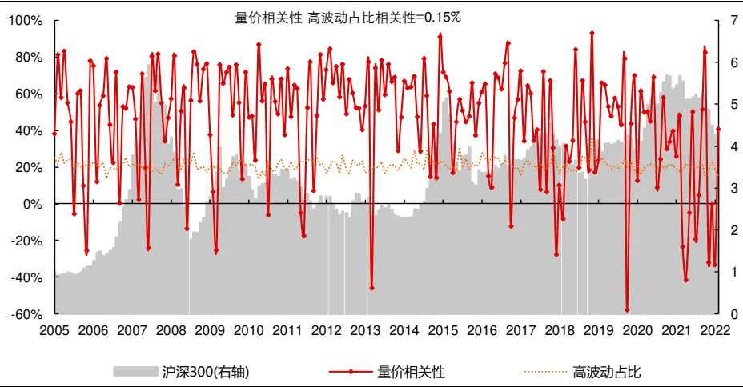
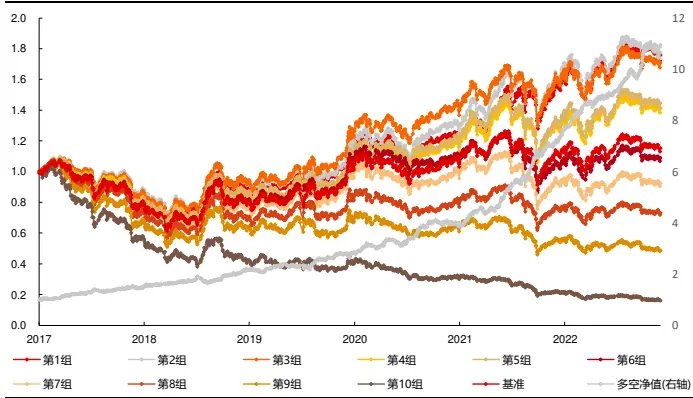
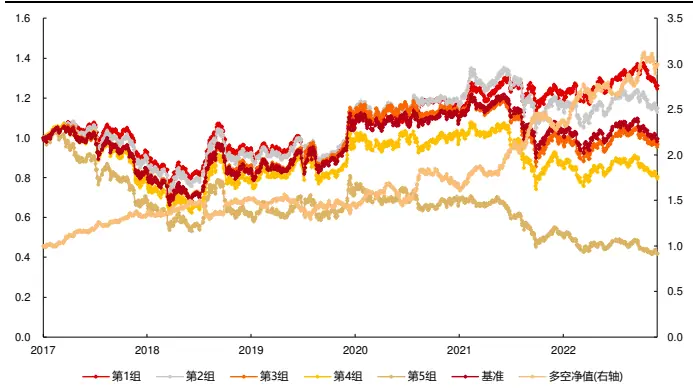
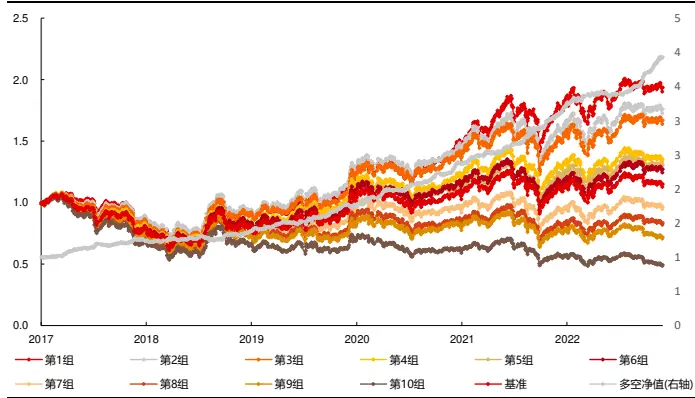
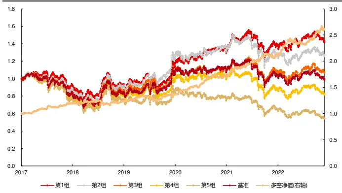

## 金融工程丨深度报告[Table_Title] 高频因子（十三）：广义拥挤度

## 报告要点

[Table_Summary] 广义拥挤度为某成交属性在某维度属性上的情况，本质为刻画维度属性和成交属性的匹配情况，其中维度属性以交易行为区分数据，成交属性刻画交易行为。本文共整理 17 个选股较为有效的代表性因子，因子和传统量价因子有较高相关性，剔除风格和行业线性影响后，仍有大量因子具有选股能力。

分析师及联系人

郑起SAC：S0490520060001

# 高频因子（十三）：广义拥挤度

## [Table_Summary2] 广义拥挤度为某成交属性在某维度属性上的情况

狭义拥挤度的定义为成交在某个属性上的分布情况，广义拥挤度对成交分布情况这一概念给出扩展，定义为成交属性的情况，如价格变动结果（收益率）、成交成本（均价）等，所以广义拥挤度的定义为某成交属性在某维度属性上的情况。

## 广义拥挤度本质为刻画维度属性和成交属性的匹配情况

在广义拥挤度成交属性的刻画上，有如下三种计算方法，均能体现维度属性和成交属性的匹配情况：

局部维度属性成交属性实现情况，如均价局部区间成交量占比，刻画均价尺度上局部成交量分布，本质为给定 VaR 下的置信度；

维度属性加权成交属性实现情况，如以均价为权重对成交量占比求和，本质为维度属性平均相对时间平均的偏移；

维度属性和成交属性相关性，如均价成交量相关性，刻画均价和成交量的线性匹配程度，本质为以正负处理的均价为权重对成交量占比求和。

维度属性和成交维度的组合需要有逻辑意义，如维度属性和成交属性衡量的交易行为有重复含义时，匹配结果天然正向匹配，呈现交易行为外的固有属性，往往无选股能力。

## 维度属性以交易行为区分数据，成交属性刻画交易行为

相同成交属性下的因子刻画的交易行为一致，不同维度属性相当于截取了数据的一个局部分布，因子往往会有较高相关性，但表现仍有差别。

维度属性和成交属性互为交叉时，因子本质相同。

## 本文共整理 17个选股较为有效的代表性因子

本文选取了时间、均价、波动率、成交量、每笔成交量和方向作为维度属性，以成交占比、均价、收益率、主买资金流入和每笔成交量作为成交属性，构建广义拥挤度因子。最后整理了如波动价相关性、高成交量每笔成交，共计 17 个选股较为有效的代表性因子，因子和传统量价因子有较高相关性，剔除风格和行业线性影响后，仍有大量因子具有选股能力。

[Table_Report] •《减量市场下规模头部集中趋势或逆转——长江金工 2023 年度中期投资策略》2023-06-30

## 相关研究

- 《财务质量风格标签赋能基金筛选》2023-06-21

- 《量化角度看可转债（六）：转债基金归因与重仓策略》2023-06-02

## 风险提示

1、模型存在失效风险；

2、本文举例均基于历史数据，不保证未来收益。

更多研报请访问长江研究小程序

## 广义拥挤度的定义

## 交易拥挤度

在报告《行业轮动（六）：风险篇》中，我们给出了交易拥挤的定义：成交在某个属性上的分布情况1。其中成交的代理变量通常会有成交量、成交额换手率等，分布通常可以以成交占比刻画，属性需要根据描述的交易行为具体定义，不同的属性定义侧重不同的交易维度，从而交易拥挤的刻画不同。在报告《行业轮动（六）：风险篇》中给出了两个不同交易属性刻画的交易拥挤度：

量价相关性，以价格高低作区间属性划分，统计区间价格和成交量相关性，刻画了在价格高位的交易拥挤度。

高波动占比，以波动高低作为区间属性划分，统计不同区间成交占比，刻画了在市场风险偏好（这里构建的交易拥挤度指标本质即为前文中的交易行为上刻画的风险偏好，两者时间序列相关性为 68.01%）。

图 1：不同属性刻画的交易拥挤度

资料来源：天软科技，Wind，长江证券研究所

## 拥挤度定义拓展

量价是刻画交易的两个维度，量侧重交易过程，价侧重交易结果，所以从上述思路出发，可以将交易分布拓展至价格路径，如在报告《行业轮动（六）：风险篇》中，我们给出了如下两个因子的定义：

活跃相对换手：以全市场成交额作为属性，以头部成交量占比刻画尾部分布，计算市场成交最活跃区间的相对换手率，该值越大，情绪驱动交易占比越高；

活跃动量：以全市场成交额作为属性，以收益率刻画价格变动结果，计算市场成交最活跃区间的收益率，该值越大，情绪驱动交易价格变动越大。

因为两个因子的属性定义一致，所以因子逻辑相似，因为 A股市场的交易习惯，短期情绪驱动的交易往往为过度反应，从而呈现为反转效应，所以因子方向均为负，只不过活跃相对换手从交易过程上衡量情绪驱动交易的占比，活跃动量从交易结果上衡量情绪驱动价格的变动，因而因子相关性较低。

所以从该思路出发，给出广义拥挤度定义：某成交属性在某维度属性上的情况。

## 小结

狭义拥挤度的定义为成交在某个属性上的分布情况，广义拥挤度对成交分布情况这一概念给出扩展，定义为成交属性的情况，如价格变动结果，广义拥挤度的定义为某成交属性在某维度属性上的情况。

## 广义拥挤度因子

广义拥挤度定义中的属性上从量价等方面考虑，维度属性还可以是非量价维度，下图给出了一些广义拥挤度的组合及其含义，以其中特定因子为例：

维度属性均价，成交属性成交量占比，衡量成交集中在价格高位或价格低位，反映市场交易中的羊群效应；

维度属性波动率，成交属性收益率，衡量已实现收益集中在高波动区间还是低波动区间，反映市场局部风险溢价；

维度属性均价，成交属性收益率，局部上价格上升收益率为正，所以有着高收益集中在高价区间、低收益集中在低价区间的固定规律。

表 1：广义拥挤度组合

| 维度属性 成交属性 | 时间（开盘、收盘） | 均价 | 波动率 | 成交量（非流动性） | 每笔成交量 | 方向 (主买卖) |
| --- | --- | --- | --- | --- | --- | --- |
| 成交占比（成交活跃度） | 成交偏移 | 高位拥挤度 | 风险偏好 | ×(验证无效) | 交易属性偏移 | 资金流入 |
| 均价（成交成本） | 时间段成本 | X | 风险一致性 | 市场交易成本 | 交易属性交易成本 | X |
| 收益率（价格变动结果） | 区间交易结果 | X | 风险溢价 | 活跃交易结果 | 交易属性交易结果 | × （验证无效) |
| 主买资金流入(多空强度) | 区间流入强度 | 高位流入强度 | 风险偏好 | X | 交易属性流入 | X |
| 每笔成交量 | 区间成交属性 | 高位成交属性 |  | 交易属性成交密度 | X | X |

资料来源：长江证券研究所

## 成交属性的刻画

上文中对于成交属性的情况这一概念未给出明确定义，实际上这种“情况”和需要具体刻画的交易行为有关：

1. 第一个涉及到的是成交属性的绝对或相对属性，以成交属性均价为例，各个区间直接计算的均价为绝对属性，区间均价相对全区间均价为相对属性；

2. 第二个涉及到的是计算方法，这一点需要结合维度属性与成交属性的特点，以维度属性均价、成交属性成交量为例：

局部维度属性成交属性实现情况，简称局部计算，如均价局部区间成交量占比，刻画均价尺度上局部成交量分布，本质为给定 VaR 下的置信度；

维度属性加权成交属性实现情况，简称加权计算，如以均价为权重对成交量占比求和，本质为维度属性平均相对时间平均的偏移；

维度属性和成交属性相关性，简称相关性计算，如均价成交量相关性，刻画均价和成交量的线性匹配程度，本质为以正负处理的均价为权重对成交量占比求和（见报告《高频因子（十）：量价关系中的反转微观结构》，也可以理解成线性回归的拟合优度，在变量均标准化的前提下还可以理解为回归方程的回归系数）。

下表展示了以成交量、每笔成交量和波动率为维度属性，以收益率、均价为成交属性，按照上述三种方法得到因子的相关性，同维度属性、成交属性下计算的因子有较高的相关性。当维度属性和成交属性线性匹配时，三种计算方法均刻画了两者之间的匹配程度，但有以下不同：

局部计算可以根据高、低维度属性计算出两个因子，因高区间和低区间交易行为的不同，往往有较大差别，且往往为负相关或边际递减；

加权计算和相关性计算的结果，与局部计算结果中维度属性影响较大的因子相关性较高，以维度属性成交量为例，成交量加权更多受高成交区间的影响，后两种计算方法的因子和高成交量区间因子相关性更高。

表 2：不同计算方法下因子相关性

|  | 低成交量高成交量 |  | 成交量加益成交量高每笔收低每笔收 |  |  |  | 每笔加权益每笔相低波动收高波动收波动率加 |  |  |  |  | 益波动相低波动交 |  | 高波动交波动率加 |  | 价波动相 |
| --- | --- | --- | --- | --- | --- | --- | --- | --- | --- | --- | --- | --- | --- | --- | --- | --- |
|  | 收益率 收益率 |  | 权收益率 相关性 |  | 益率 | 益率 | 收益率 | 关性 | 益率 益率 |  | 权收益率 | 关性 | 易成本 | 易成本 | 权均价 | 关性 |
| 低成交量收益率 | 100.00% | -13.74% | -0.57% | -39.29% | 35.81% | -14.62% | -2.11% | -33.66% | 4.56% 4.15% |  |  | -2.30% | 1.75% | -8.70% | -11.22% | -3.97% |
|  |  |  |  |  |  |  |  |  |  |  | 7.38% |  |  |  |  |  |
| 高成交量收益率 | -13.74% | 100.00% | 46.22% | 60.21% | -7.12% | 59.24% | 50.98% | 34.63% | 10.32% | 60.39% | 47.04% | 40.36% | -30.82% | 7.30% | 14.72% | 16.92% |
| 成交量加权收益率 | -0.57% | 46.22% | 100.00% | 25.53% | 7.45% | 32.28% | 72.59% | 6.85% | 7.38% | 53.35% | 72.79% | 26.64% | -21.28% | -3.44% | 9.16% | 7.39% |
| 益成交量相关性 | -39.29% | 60.21% | 25.53% | 100.00% | -21.15% | 33.38% | 34.77% | 54.20% | 16.47% | 21.35% | 24.44% | 16.18% | -7.98% | -2.65% | -2.72% | -0.44% |
| 高每笔收益率 | 35.81% | -7.12% | 7.45% | -21.15% | 100.00% | -25.83% | -1.72% | -53.79% | 5.40% | 11.11% | 17.95% | -3.11% | 6.96% | -9.60% | -4.50% | -7.93% |
| 低每笔收益率 | -14.62% | 59.24% | 32.28% | 33.38% | -25.83% | 100.00% | 42.38% | 57.10% | 1.68% | 41.03% | 21.66% | 32.59% | -40.62% | 19.56% | 25.07% | 27.50% |
| 每笔加权收益率 | -2.11% | 50.98% | 72.59% | 34.77% | -1.72% | 42.38% | 100.00% | 21.43% | 15.11% | 49.26% | 63.02% | 30.94% | -29.60% | -6.14% | 2.32% | 6.82% |
| 益每笔相关性 | -33.66% | 34.63% | 6.85% | 54.20% | -53.79% | 57.10% | 21.43% | 100.00% | 2.08% | 10.96% | 3.48% | 12.50% | -14.28% | 7.29% | 7.97% | 11.31% |
| 低波动收益率 | 4.56% | 10.32% | 7.38% | 16.47% | 5.40% | 1.68% | 15.11% | 2.08% | 100.00% | -5.04% | 5.11% | -42.33% | -2.36% | -5.79% | -3.17% | -3.75% |
| 高波动收益率 | 4.15% | 60.39% | 53.35% | 21.35% | 11.11% | 41.03% | 49.26% | 10.96% | -5.04% | 100.00% | 70.25% | 59.47% | -27.28% | 3.07% | 8.17% | 16.44% |
| 波动率加权收益率 | 7.38% | 47.04% | 72.79% | 24.44% | 17.95% | 21.66% | 63.02% | 3.48% | 5.11% | 70.25% | 100.00% | 30.18% | -16.99% | -10.46% | -0.99% | 2.04% |
| 益波动相关性 | -2.30% | 40.36% | 26.64% | 16.18% | -3.11% | 32.59% | 30.94% | 12.50% | -42.33% | 59.47% | 30.18% | 100.00% | -17.73% | 5.83% 4.16% |  | 16.14% |
| 低波动交易成本 | 1.75% | -30.82% | -21.28% |  |  |  |  |  |  |  |  |  |  |  |  |  |
|  |  |  |  | -7.98% | 6.96% | -40.62% | -29.60% |  |  |  |  |  |  |  |  |  |
|  |  |  |  |  |  |  |  | -14.28% | -2.36% | -27.28% | -16.99% | -17.73% | 100.00% | -45.76% | -60.02% | -68.80% |
| 高波动交易成本 | -8.70% | 7.30% | -3.44% | -2.65% | -9.60% | 19.56% | -6.14% 7.29% |  | -5.79% | 3.07% | -10.46% 5.83% |  | -45.76% | 100.00% | 74.03% | 60.97% |
| 波动率加权均价 | -11.22% | 14.72% | 9.16% | -2.72% -4.50% |  | 25.07% | 2.32% 7.97% -3.17% |  |  | 8.17% | -0.99% 4.16% |  | -60.02% | 74.03% | 100.00% | 56.99% |
| 价波动相关性 | -3.97% | 16.92% | 7.39% | -0.44% -7.93% |  | 27.50% | 6.82% | 11.31% -3.75% |  | 16.44% | 2.04% | 16.14% | -68.80% | 60.97% 56.99% |  | 100.00% |

资料来源：天软科技，长江证券研究所

同样，在维度属性和成交属性线性匹配的前提下，而在计算方法的选择上（即使用什么思路得到最终选股因子），本质为信息在维度属性上的分布：

高低维度计算出的因子均有效，且两者负相关性水平较高，说明信息分布均匀，以维度属性波动率、成交属性均价为代表，此时考虑相关性计算。（维度属性每笔成交量、成交属性收益率也符合该情况，但信息并不完全线性对称，相关性的正负加权权重不合理）

高低维度计算出的因子均有效，但两者负相关性水平较低，信息分布边际递减，以维度属性成交量、成交属性收益率为代表，此时考虑加权计算。

单一维度计算出的因子有效，以维度属性波动率、成交属性收益率为代表，此时考虑维度计算。

表 3：不同计算方法下因子风险指标

|  | 全市场 | 中证 800 |  |  |  |  |  |  |  |  |  |  | 超额最大 |  |  | 多空最大 多空夏普 |  |
| --- | --- | --- | --- | --- | --- | --- | --- | --- | --- | --- | --- | --- | --- | --- | --- | --- | --- |
|  | IC | ICIR | 超额收益 | 超额最大 回撤 | 信息比 | 多空收益 | 回撤 | 多空最大 多空夏普 比 | IC | ICIR |  | 超额收益 | 回撤 | 信息比 | 多空收益 | 回撤 | 比 |
| 低成交量 收益率 | 1.07% | 18.36% | -2.90% | 33.64% | -0.65 | 1.95% | 22.06% | 0.32 | 0.57% | 8.13% |  | -3.48% | 39.22% | -0.86 | 0.66% | 26.32% | 0.13 |
| 高成交量 收益率 | -7.52% | -63.15% | 0.42% | 26.35% | 0.11 | 25.31% | 23.99% | 1.80 | -4.86% |  | -34.84% | 0.12% | 28.99% | 0.06 | 10.57% | 28.24% | 0.86 |
| 成交量加 权收益率 | -8.68% | -93.78% | 2.55% | 19.01% | 0.47 | 26.81% | 15.10% | 2.48 |  | -6.86% | -58.46% | 2.87% | 16.13% | 0.51 | 15.55% | 24.27% | 1.40 |
| 益成交量 相关性 高每笔收 | -2.22% | -19.76% | -2.33% | 38.23% | -0.39 | 5.40% | 39.20% | 0.51 |  | -0.73% | -5.27% | -3.46% | 43.77% | -0.61 | 0.48% | 47.58% | 0.10 |
| 益率 低每笔收 | 3.12% | 57.59% | -0.85% | 19.70% | -0.14 | 16.49% | 7.75% | 2.17 |  | 2.29% | 28.67% | -0.77% | 13.57% | -0.17 | 6.71% | 9.20% | 0.84 |
| 益率 每笔加权 | -8.52% | -94.08% | 4.04% | 10.21% | 0.78 | 33.15% | 17.00% | 2.32 |  | -4.55% | -40.16% | -1.33% | 20.40% | -0.20 | 6.74% | 28.58% | 0.56 |
| 收益率 益每笔相 | -7.52% | -65.19% | 0.15% | 18.82% | 0.05 | 23.15% | 24.17% | 1.48 |  | -3.04% | -22.39% | -1.94% | 21.34% | -0.23 | 4.97% | 27.79% | 0.39 |
| 关性 低波动收 | -5.41% | -67.61% | 3.16% | 9.64% | 0.58 | 20.32% | 14.93% | 1.88 |  | -2.92% | -26.63% | 0.96% | 15.76% | 0.21 | 8.22% | 18.53% | 0.81 |
| 益率 高波动收 | 1.69% | 26.37% | -1.96% | 31.01% | -0.29 | 5.93% | 18.73% | 0.79 |  | 1.18% | 14.70% | -0.87% | 22.17% | -0.15 | 4.18% | 22.25% | 0.55 |
| 益率 波动率加 | -7.47% | -83.47% | 3.58% | 14.90% | 0.65 | 25.41% | 16.80% | 2.31 |  | -4.97% | -44.72% | 0.81% | 19.10% | 0.18 | 11.33% | 21.32% | 1.09 |
| 权收益率 益波动相 | -8.21% | -65.94% | 2.38% | 17.81% | 0.37 | 29.08% | 18.05% | 2.00 |  | -5.58% | -37.61% | 0.98% | 18.64% | 0.18 | 14.07% | 24.18% | 1.03 |
| 关性 低波动交 | -6.34% | -84.68% | 4.68% | 10.40% | 1.04 | 21.18% | 16.79% | 2.41 |  | -4.07% | -42.62% | 1.82% | 15.00% | 0.43 | 9.69% | 20.60% | 1.14 |
| 易成本 高波动交 | 7.97% | 92.04% | 4.70% | 11.08% | 0.82 | 25.61% | 12.26% | 2.23 |  | 5.74% | 53.43% | 2.07% | 16.38% | 0.39 | 13.10% | 17.42% | 1.19 |
| 易成本 波动率加 | -7.86% | -99.72% | 4.60% | 9.95% | 0.84 | 25.02% | 10.73% | 2.42 |  | -6.26% | -62.59% | 2.58% | 12.04% | 0.51 | 14.78% | 12.94% | 1.45 |
| 权均价 | -8.85% | -97.32% | 3.61% | 10.60% | 0.61 | 29.82% | 10.55% | 2.58 |  | -6.93% | -59.96% | 2.58% | 10.46% | 0.46 | 16.47% | 15.28% | 1.46 |
| 价波动相 关性 | -8.13% | -93.72% | 4.48% | 10.55% | 0.87 |  | 28.39% 13.15% | 2.69 |  | -5.79% | -53.66% | 2.43% | 11.45% | 0.50 | 14.00% | 14.78% | 1.41 |

资料来源：天软科技，长江证券研究所

## 成交属性和维度属性

广义拥挤度本质为衡量两种属性的匹配情况，故在拥挤度组合时，维度属性和成交维度的组合需要有逻辑意义，因为一些属性可以同为维度属性和成交属性，如成交量、均价，所以会存在维度属性和成交属性相同的拥挤度，也会有维度属性和成交属性对称的拥挤度，这里给出上述两种情况的讨论。

## 同属性拥挤度

在维度属性和成交属性衡量的交易行为有重复含义时，匹配结果天然正向匹配，呈现交易行为外的固有属性，因而无选股能力，下表以如下两个因子为例，展示这一现象：

维度属性成交量、成交属性 Amihud 非流动性，两者均衡量了时间维度上的个股流动情况，因而量流动性相关性因子无选股能力；

维度属性收益率、成交属性主买占比，因为主买的定义中，用到了价格方向这一信息，和收益率有重复含义，因而益整主买占比相关性因子无选股能力。

表 4：同属性拥挤度风险指标

|  |  | IC | ICIR | 超额收益 | 超额最大回撤 | 信息比 | 多空收益 | 多空最大回撤 | 多空夏普比 |
| --- | --- | --- | --- | --- | --- | --- | --- | --- | --- |
| 全市场 | 量流动性相关性 | 2.41% | 17.16% | -3.11% | 47.63% | -0.44 | 5.51% | 53.96% | 0.48 |
|  | 益整主买占比相关性 | -2.05% | -15.18% | -4.17% | 49.79% | -0.70 | 5.75% | 62.42% | 0.50 |
| 中证 800 | 量流动性相关性 | 0.84% | 5.05% | -2.08% | 48.24% | -0.29 | 0.40% | 63.68% | 0.10 |
|  | 益整主买占比相关性 | -0.17% | -1.09% | -2.63% | 46.45% | -0.45 | 1.34% | 61.45% | 0.17 |

资料来源：天软科技，长江证券研究所

## 拥挤度的交叉属性

维度属性和成交属性对称的拥挤度，两个属性互为交叉属性，两个拥挤度衡量的为交叉属性的匹配情况，因子本质相同，应表现相近，下表以成交量和均价两个交叉属性为例，展示了不同计算方法下各个因子的相关性。

表 5：交叉属性拥挤度相关性

| 低成交量交易成本 |  | 高成交量交易成本 | 成交量加权均价 | 低价成交占比 | 高价成交占比 | 成交量价相关性 |
| --- | --- | --- | --- | --- | --- | --- |
| 低成交量交易成本 | 100.00% | -76.14% | -93.16% | 69.36% | -61.55% | -75.65% |
| 高成交量交易成本 | -76.14% | 100.00% | 82.45% | -68.79% | 69.98% 68.68% |  |
| 成交量加权均价 | -93.16% | 82.45% | 100.00% | -68.89% | 69.47% | 67.58% |
| 低价成交占比 | 69.36% | -68.79% -68.89% |  | 100.00% | -62.67% | -81.19% |
| 高价成交占比 | -61.55% | 69.98% 69.47% |  | -62.67% | 100.00% | 73.94% |
| 成交量价相关性 | -75.65% | 68.68% 67.58% |  | -81.19% | 73.94% | 100.00% |

资料来源：天软科技，长江证券研究所

## 成交量和每笔成交量

成交量和成交笔数均为成交活跃的衡量维度，每笔成交量为两者相除，由成交活跃属性转为成交密度属性，从而作为区分交易特征的标准（如从大单小单角度，作为区分机构投资者和个人投资者的标准）。实际上，以成交量和每笔成交量作为维度属性，构建成交属性均价的因子，可以从表现上看到两者之间的差别：

成交量作为维度属性构建的因子有选股能力，即成交价格在不同成交活跃上的差异有个股风险上的区分，市场交易成本（高位拥挤）逻辑有效；

每笔成交量作为维度属性构建的因子无选股能力，即成交价格在不同的成交密度上的差异无个股风险上的区分，交易属性交易成本逻辑无效。

表 6：维度成交量、每笔成交量拥挤度因子差异

|  | 全市场 | 中证 800 |  |  |  |  |  |  |  |  |  |  |  |  |  |  |  |
| --- | --- | --- | --- | --- | --- | --- | --- | --- | --- | --- | --- | --- | --- | --- | --- | --- | --- |
|  | IC | ICIR | 超额收益 | 超额最大 回撤 | 信息比 | 多空收益 | 回撤 | 多空最大 多空夏普 比 | IC | ICIR | 超额收益 |  | 超额最大 回撤 | 信息比 | 多空收益 | 多空最大 多空夏普 回撤 | 比 |
| 低成交量 交易成本 | 7.89% | 78.81% | 3.06% | 20.59% | 0.49 | 23.56% | 15.91% | 1.87 | 6.32% | 51.26% |  | 2.83% | 18.49% | 0.47 | 13.01% | 25.76% | 1.14 |
| 高成交量 交易成本 | -8.34% | -84.48% | 3.90% | 16.94% | 0.62 | 25.53% | 15.49% | 2.09 | -6.81% |  | -56.83% | 3.28% | 17.00% | 0.57 | 14.91% | 21.09% | 1.30 |
| 成交量加 权均价 | -7.91% | -81.85% | 3.96% | 16.99% | 0.62 | 23.38% | 15.54% | 1.93 | -6.49% |  | -53.71% | 3.28% | 17.09% | 0.55 | 13.83% | 24.69% | 1.23 |
| 低价成交 占比 | 6.90% | 75.68% | 1.61% | 19.87% | 0.29 | 24.86% | 12.94% | 2.26 | 5.37% |  | 45.81% | 1.28% | 18.93% | 0.25 | 12.87% | 25.09% | 1.21 |
| 高价成交 占比 | -6.46% | -70.75% | 3.78% | 17.72% | 0.63 | 20.28% | 17.44% | 2.03 | -4.97% |  | -42.64% | 2.62% | 21.31% | 0.47 | 11.89% | 25.42% | 1.21 |
| 成交量价 相关性 | -7.03% | -71.67% | 1.91% | 21.60% | 0.33 | 23.94% | 23.51% | 2.03 | -5.24% |  | -43.08% | 2.03% | 20.89% | 0.36 | 13.81% | 25.98% | 1.28 |
| 低每笔交 易成本 | 4.56% | 59.51% | -3.11% | 23.02% | -0.51 | 9.56% | 14.72% | 0.99 | 3.16% |  | 32.21% | -2.14% | 22.42% | -0.35 | 5.59% | 18.98% | 0.60 |
| 高每笔交 易成本 | 0.29% | 5.02% | -8.01% | 41.57% | -1.21 | 4.39% | 14.57% | 0.68 | -0.45% |  | -5.53% | -6.36% | 32.35% | -1.16 | -2.11% | 25.71% | -0.24 |
| 每笔加权 均价 | -1.83% | -27.37% | -4.32% | 23.70% | -0.80 | 1.76% | 11.33% | 0.27 | -1.53% |  | -17.67% | -3.26% | 19.37% | -0.62 | 0.27% | 19.50% | 0.09 |
| 低价每笔 成交 | 1.38% | 23.17% | -1.20% | 14.39% | -0.23 | 4.32% | 7.89% | 0.63 | 1.37% |  | 14.77% | -1.80% | 18.13% | -0.37 | 1.76% | 19.97% | 0.24 |
| 高价每笔 成交 | 1.04% | 15.89% | 0.20% | 17.61% | 0.06 | 1.90% | 17.73% | 0.33 | 0.52% |  | 5.65% | -1.91% | 20.55% | -0.36 | 2.19% | 22.05% | 0.33 |
| 价每笔相 关性 | -1.84% | -27.96% | -5.34% | 28.93% | -1.05 | 2.27% | 12.10% | 0.31 | -1.81% |  | -18.92% | -2.87% | 19.47% | -0.54 | 4.37% | 17.35% | 0.54 |

资料来源：天软科技，长江证券研究所

## 相同成交属性下的因子表现

当成交属性相同时，维度属性的选取会影响拥挤度的含义，但刻画的交易行为一致，只是截取了数据的一个局部分布，这里以成交属性收益率为例，下表给出了不同维度属性下拥挤度因子的相关性及表现情况，并和普通收益率的差异作为交易行为一致性程度的衡量：

不同维度属性下的拥挤度因子均和普通反转有一定的相关性，开盘反转因子相关性高达 66.83%；

从因子表现上看，因子方向均为反向，除开盘反转因子外，均有一定的选股能力；

虽然成交属性相同使得拥挤度因子较为相似，但仍有一定差别。

表 7：成交属性收益率拥挤度因子相关性

| 成交量加权收益率 低每笔收益率 益波动相关性 开盘反转 普通反转 |  |  |  |  |  |
| --- | --- | --- | --- | --- | --- |
| 成交量加权收益率 | 100.00% | 32.28% | 26.64% | 55.23% 53.58% |  |
| 低每笔收益率 | 32.28% | 100.00% | 32.59% | 23.00% | 47.37% |
| 益波动相关性 | 26.64% | 32.59% | 100.00% | 23.98% | 37.61% |
| 开盘反转 | 55.23% | 23.00% | 23.98% | 100.00% | 66.83% |
| 普通反转 | 53.58% | 47.37% | 37.61% | 66.83% | 100.00% |

资料来源：天软科技，长江证券研究所

表 8：成交属性收益率拥挤度因子风险指标

|  | 全市场 | 中证 800 |  |  |  |  |  |  |  |  |  |  |  |  |  |  |  |
| --- | --- | --- | --- | --- | --- | --- | --- | --- | --- | --- | --- | --- | --- | --- | --- | --- | --- |
|  | IC | ICIR | 超额收益 | 超额最大 回撤 | 信息比 | 多空收益 | 回撤 | 多空最大 多空夏普 比 | IC | ICIR | 超额收益 |  | 超额最大 回撤 | 信息比 | 多空收益 | 多空最大 多空夏普 回撤 | 比 |
| 成交量加 权收益率 | -8.68% | -93.78% | 2.55% | 19.01% | 0.47 | 26.81% | 15.10% | 2.48 | -6.86% | -58.46% |  | 2.87% | 16.13% | 0.51 | 15.55% | 24.27% | 1.40 |
| 低每笔收 益率 | -8.52% | -94.08% | 4.04% | 10.21% | 0.78 | 33.15% | 17.00% | 2.32 | -4.55% | -40.16% |  | -1.33% | 20.40% | -0.20 | 6.74% | 28.58% | 0.56 |
| 益波动相 关性 | -6.34% | -84.68% | 4.68% | 10.40% | 1.04 | 21.18% | 16.79% | 2.41 | -4.07% | -42.62% |  | 1.82% | 15.00% | 0.43 | 9.69% | 20.60% | 1.14 |
| 普通反转 | -6.93% | -48.88% | -0.31% | 23.97% | 0.01 | 25.14% | 21.75% | 1.56 | -4.42% | -26.96% |  | -0.46% | 25.89% | -0.01 | 9.45% | 26.14% | 0.68 |
| 开盘反转 | -0.04% | -0.47% | -8.50% | 69.20% | -1.56 | 0.52% | 40.07% | 0.11 | -0.74% |  | -6.97% | -2.92% | 33.02% | -0.53 | 2.90% | 24.62% | 0.35 |

资料来源：天软科技，长江证券研究所

## 广义拥挤度因子

基于前广义拥挤度组合，本文测试了有逻辑含义的因子，并结合计算方法合理性和回测表现，确定以下有效的选股因子：

表 9：广义拥挤度因子定义

| 维度属性 | 成交属性情况 | 因子名称 | 计算方法 | 因子逻辑 | 理论方向 |
| --- | --- | --- | --- | --- | --- |
| 时间 | 成交量 | 开盘成交占比 | 开盘5 分钟成交占比 | 过度交易 | -1 |
| 价格 | 成交量 | 高价成交占比 | 价格最高20%区间成交量占比 | 羊群效应 | -1 |
|  |  | 低价成交占比 | 价格最低 20%区间成交量占比 | 羊群效应 | 1 |
|  | 资金流入 | 价主买相关性 | 价格和主动流入资金占比相关性 | 羊群效应 | -1 |
| 波动率 | 成交量 | 波动加权成交占比 | 以日度波动率加权的成交量占比 | 风险偏好 | -1 |
|  | 均价 | 波动价相关性 | 日度波动率和均价相关性 | 风险一致性 | -1 |
|  | 收益率 | 高波动收益率 | 日度波动率最高的20%区间收益率 | 风险溢价 | -1 |
|  | 资金流入 | 高波动资金流入 | 日度波动率最高的20%区间主动流入资金占比 | 风险偏好 | -1 |
| 量 | 均价 | 高成交量交易成本 | 成交量最高20%区间均价/全区间均价 | 羊群效应 | -1 |
|  |  | 低成交量交易成本 | 成交量最低20%区间均价/全区间均价 | 羊群效应 | 1 |
|  | 收益率 | 成交量加权收益率 | 以成交量为权重做对数收益率求和 | 过度交易 | -1 |
|  | 每笔成交量 | 高成交量每笔成交 | 成交量最高20%区间每笔成交量/全区间每笔成交量 | 交易属性成交密度 | 1 |
|  |  | 低成交量每笔成交 | 成交量最低20%区间每笔成交量/全区间每笔成交量 | 交易属性成交密度 | -1 |
| 每笔成交量 | 收益率 | 高每笔收益率 | 每笔成交量最高20%区间收益率 | 过度交易 | -1 |
|  |  | 低每笔收益率 | 每笔成交量最低20%区间收益率 | 过度交易 | 1 |
|  | 资金流入 | 每笔主买相关性 | 每笔成交量和主动资金流入相关性 | 多空力量 | 1 |
| 方向 | 成交量 | 主动资金流入 | 主动资金流入占比 | 多空力量 | -1 |

资料来源：长江证券研究所

## 下表展示了拥挤度因子之间的相关性：

成交量和均价互为交叉属性的拥挤度因子相关性较高，此外和开盘成交占比、成交量加权收益率、高每笔收益率相关性较高；

维度属性为波动率的拥挤度因子和大部分拥挤度因子相关性较高，即拥挤度因子大多有风险溢价和风险偏好的逻辑；

开盘作为成交最为活跃的时间段，很多交易特征的刻画都受到开盘区间的影响，如成交量和每笔成交量均有成交活跃部分的影响，成交量加权收益率、高每笔收益率和开盘成交占比有较高相关性；

高成交量每笔成交、低成交量每笔成交和每笔主买相关性有较高相关性。

表 10：广义拥挤度因子相关性

| 高价成交低价成交价主买相占比 占比 关性 |  |  |  | 高成交量低成交量每笔主买 |  |  | 开盘成交成交量加 |  | 高每笔收 | 低每笔收 | 波动率加 | 波动价相 | 高波动收 | 高波动资 | 主动资金 | 高成交量 | 低成交量 |
| --- | --- | --- | --- | --- | --- | --- | --- | --- | --- | --- | --- | --- | --- | --- | --- | --- | --- |
|  |  |  |  | 交易成本 | 交易成本 | 相关性 | 占比 权收益率 |  | 益率 | 益率 | 权成交量 | 关性 | 益率 | 金流入 | 流入 | 每笔成交 | 每笔成交 |
| 高价成交占比 | 100.00% | -64.32% | 50.18% | 72.70% | -64.00% | 2.20% 37.66% 37.99% |  |  | 23.73% | 2.33% | 44.12% 45.14% |  | 23.82% | 49.45% | 3.78% | -26.71% | -7.19% |
| 低价成交占比 | -64.32% | 100.00% | -60.72% | -71.96% | 71.83% | 10.29% | -31.05%-34.86%-30.77% |  |  | 1.54% | -25.65% | -48.20% | -29.33% | -36.92% | -9.03% | 29.68% | -3.71% |
| 价主买相关性 | 50.18% | -60.72% | 100.00% | 54.73% | -65.28% | -18.04% | 14.42% 16.15% 18.69% |  |  | -4.69% | 19.39% | 50.19% | 20.24% | 36.38% | 28.04% | -29.33% | 17.60% |
| 高成交量交易成本 | 72.70% | -71.96% | 54.73% | 100.00% | -83.02% | -22.02% | 41.54% 39.61% 39.27% |  |  | -7.88% | 37.39% | 55.72% | 30.87% | 51.36% | 22.85% | -38.64% | 17.86% |
| 低成交量交易成本 | -64.00% | 71.83% | -65.28% | -83.02% | 100.00% | 18.26% | -42.89%-44.23%-42.66% |  |  | 6.43% | -35.61% | -47.48% | -35.97% | -46.40% | -22.23% | 34.60% | -11.84% |
| 每笔主买相关性 | 2.20% | 10.29% | -18.04%-22.02% |  | 18.26% | 100.00% | -12.95% | -2.90% | -21.64% | 17.25% | 4.54% | -25.25% | -11.16% | -12.84% | -27.25% | 62.49% | -84.29% |
| 开盘成交占比 | 37.66% | -31.05% | 14.42% | 41.54% | -42.89% | -12.95% | 100.00% | 55.43% | 39.46% | -10.88% | 49.16% | 31.56% | 30.69% | 41.51% | 17.72% | -37.76% | 7.24% |
| 成交量加权收益率 | 37.99% | -34.86% | 16.15% | 39.61% | -44.23% | -2.90% | 55.43% | 100.00% | 54.54% | -6.20% | 37.17% | 27.40% | 58.03% | 47.02% | 28.83% | -17.63% | -0.87% |
| 高每笔收益率 | 23.73% | -30.77% | 18.69% | 39.27% | -42.66% | -21.64% | 39.46% | 54.54% | 100.00% | -30.66% | 22.29% | 30.81% | 49.93% | 39.52% | 36.52% | -28.89% | 21.22% |
| 低每笔收益率 | 2.33% | 1.54% | -4.69% -7.88% |  | 6.43% | 17.25% | -10.88% -6.20% |  | -30.66% | 100.00% | -1.04% | -8.18% | -4.21% | -8.26% | -18.03% | 21.73% | -21.19% |
| 波动率加权成交量 | 44.12% | -25.65% | 19.39% | 37.39% | -35.61% | 4.54% | 49.16% | 37.17% | 22.29% | -1.04% | 100.00% | 35.50% | 22.29% | 60.84% | 14.94% | -23.92% | -3.13% |
| 波动价相关性 | 45.14% | -48.20% | 50.19% | 55.72% | -47.48% | -25.25% | 31.56% 27.40% |  | 30.81% | -8.18% | 35.50% | 100.00% | 26.17% | 54.90% | 26.13% | -36.34% | 24.09% |
| 高波动收益率 | 23.82% | -29.33% | 20.24%30.87% |  | -35.97% | -11.16% | 30.69% | 58.03% | 49.93% | -4.21% | 22.29% | 26.17% | 100.00% | 50.26% | 27.20% | -16.06% | 8.33% |
| 高波动资金流入 | 49.45% | -36.92% | 36.38% | 51.36% | -46.40% | -12.84% | 41.51%47.02% |  | 39.52% | -8.26% | 60.84% | 54.90% | 50.26% | 100.00% | 49.02% | -34.11% | 20.43% |
| 主动资金流入 | 3.78% | -9.03% | 28.04% 22.85% |  | -22.23%-27.25% |  | 17.72% | 28.83% | 36.52% | -18.03% | 14.94% | 26.13%27.20% |  | 49.02% | 100.00% | -28.98% | 52.17% |
| 高成交量每笔成交 | -26.71% | 29.68% | -29.33% | -38.64% | 34.60% | 62.49% | -37.76% | -17.63% | -28.89% | 21.73% | -23.92% | -36.34% | -16.06% | -34.11% | -28.98% | 100.00% | -67.23% |
| 低成交量每笔成交 | -7.19% -3.71% |  | 17.60% 17.86% |  | -11.84% | -84.29% | 7.24% | -0.87% | 21.22% | -21.19% | -3.13% | 24.09% 8.33% |  | 20.43% | 52.17% | -67.23% | 100.00% |

资料来源：天软科技，长江证券研究所

下表展示了拥挤度因子的风险指标：

从多空收益上看，全市场范围和中证 800 范围内，因子均有选股能力；

全市场范围内，除低每笔收益率，均可获得超额收益，中证 800 范围内；除价主买相关性、每笔主买相关性、高每笔收益率、低每笔收益率，均可获得超额收益。

表 11：广义拥挤度因子风险指标

|  | 全市场 | 中证 |  |  |  |  |  |  |  |  |  |  |  |  |  |  |  |
| --- | --- | --- | --- | --- | --- | --- | --- | --- | --- | --- | --- | --- | --- | --- | --- | --- | --- |
|  |  | IC | ICIR 超额收益 | 超额最大 回撤 | 信息比 | 多空收益 | 多空最大 回撤 | 多空夏普比 | 800 IC | ICIR | 超额收益 | 超额最大 回撤 |  | 信息比 | 多空收益 | 多空最大 回撤 | 多空夏普比 |
| 高价成交 占比 | -6.46% | -70.75% | 3.78% | 17.72% | 0.63 | 20.28% | 17.44% | 2.03 | -4.97% | -42.64% | 2.62% |  | 21.31% | 0.47 | 11.89% | 25.42% | 1.21 |
| 低价成交 占比 | 6.90% | 75.68% | 1.61% | 19.87% | 0.29 | 24.86% | 12.94% | 2.26 | 5.37% | 45.81% |  | 1.28% | 18.93% | 0.25 | 12.87% | 25.09% | 1.21 |
| 价主买相 关性 | -5.94% | -71.12% | 0.04% | 26.27% | 0.04 | 20.04% | 18.98% | 2.03 | -4.80% | -45.88% |  | -0.51% | 30.13% | -0.06 | 9.04% | 19.88% | 0.93 |
| 高成交量 交易成本 | -8.34% | -84.48% | 3.90% | 16.94% | 0.62 | 25.53% | 15.49% | 2.09 | -6.81% |  | -56.83% | 3.28% | 17.00% | 0.57 | 14.91% | 21.09% | 1.30 |
| 低成交量 交易成本 | 7.89% | 78.81% | 3.06% | 20.59% | 0.49 | 23.56% | 15.91% | 1.87 | 6.32% |  | 51.26% | 2.83% | 18.49% | 0.47 | 13.01% | 25.76% | 1.14 |
| 每笔主买 相关性 | 7.55% | 66.24% | 3.09% | 12.83% | 0.46 | 30.54% | 13.70% | 2.07 | 3.81% |  | 33.37% | -2.60% | 23.30% | -0.41 | 7.04% | 19.86% | 0.69 |
| 开盘成交 占比 | -6.63% | -69.76% | 2.32% | 11.24% | 0.41 | 17.96% | 15.44% | 1.72 | -5.11% |  | -43.41% | 1.86% | 14.16% | 0.36 | 11.19% | 21.25% | 1.16 |
| 成交量加 权收益率 | -8.68% | -93.78% | 2.55% | 19.01% | 0.47 | 26.81% | 15.10% | 2.48 | -6.86% |  | -58.46% | 2.87% | 16.13% | 0.51 | 15.55% | 24.27% | 1.40 |
| 高每笔收 益率 | -8.52% | -94.08% | 4.04% | 10.21% | 0.78 | 33.15% | 17.00% | 2.32 | -4.55% |  | -40.16% | -1.33% | 20.40% | -0.20 | 6.74% | 28.58% | 0.56 |
| 低每笔收 益率 | 3.12% | 57.59% | -0.85% | 19.70% | -0.14 | 16.49% | 7.75% | 2.17 | 2.29% |  | 28.67% | -0.77% | 13.57% | -0.17 | 6.71% | 9.20% | 0.84 |
| 波动率加 权成交量 | -7.56% | -97.92% | 5.64% | 9.00% | 1.08 | 22.78% | 7.42% | 2.77 | -5.58% |  | -61.78% | 1.79% | 17.83% | 0.38 | 12.56% | 11.31% | 1.51 |
| 波动价相 关性 | -8.13% | -93.72% | 4.48% | 10.55% | 0.87 | 28.39% | 13.15% | 2.69 | -5.79% |  | -53.66% | 2.43% | 11.45% | 0.50 | 14.00% | 14.78% | 1.41 |
| 高波动收 益率 | -7.47% | -83.47% | 3.58% | 14.90% | 0.65 | 25.41% | 16.80% | 2.31 | -4.97% |  | -44.72% | 0.81% | 19.10% | 0.18 | 11.33% | 21.32% | 1.09 |
| 高波动资 金流入 | -8.91% | -104.41% | 5.89% | 15.35% | 1.03 | 31.44% | 8.61% | 3.17 | -6.54% |  | -61.31% | 2.66% | 24.65% | 0.48 | 15.77% | 21.19% | 1.54 |
| 主动资金 流入 | -7.76% | -50.63% | 3.57% | 23.62% | 0.46 | 22.32% | 34.00% | 1.32 | -4.85% |  | -26.95% | 2.02% | 32.82% | 0.31 | 9.83% | 54.48% | 0.70 |
| 高成交量 | 11.79% | 98.54% | 7.70% | 10.08% | 1.09 | 52.27% | 14.13% | 3.15 | 8.07% |  | 51.13% | 4.29% | 16.25% | 0.65 | 21.30% | 17.30% | 1.48 |
| 每笔成交 低成交量 每笔成交 | -8.11% | -59.43% | 5.20% | 13.62% | 0.67 | 32.87% | 16.63% | 1.81 |  | -4.51% | -25.50% | 0.35% | 25.82% | 0.08 | 10.50% | 37.35% | 0.70 |

资料来源：天软科技，长江证券研究所

下图以高成交量每笔成交为例，展示了分组回测净值，其中各组净值为每个月按照因子从大到小，构建等权组合：

图 2：高成交量每笔成交全市场分组回测净值

资料来源：天软科技，长江证券研究所

图 3：高成交量每笔成交中证 800分组回测净值

资料来源：天软科技，长江证券研究所

下表展示了拥挤度因子和传统风格因子相关性，拥挤度因子和风格中的量价因子，反转、换手率和波动率相关性较高。

表 12：拥挤度因子和传统风格相关性

|  | 规模 | 价值 盈利 |  | 成长 | 动量 反转 换手率 波动率 |  |  |  |
| --- | --- | --- | --- | --- | --- | --- | --- | --- |
| 高价成交占比 | -10.75% | 4.79% -3.67% -0.78% |  |  | -10.00% | 15.25% 14.75% 18.32% |  |  |
| 低价成交占比 | 10.76% | -3.33% 3.09% 0.41% |  |  | 8.64% | -23.66% -23.29% -19.87% |  |  |
| 价主买相关性 | -5.90% | -9.97% | -0.39% | 0.40% | 1.88% | 18.22% | 25.95% 23.00% |  |
| 高成交量交易成本 | -7.07% | -6.64% | -2.75% | -0.21% | 0.55% | 26.92% | 35.93% | 38.19% |
| 低成交量交易成本 | 7.81% | 5.96% | 2.83% | 0.22% | 1.28% | -37.40% -36.75% |  | -40.27% |
| 每笔主买相关性 | -35.04% | 12.79% | -2.24% | -0.91% | -23.29% | -8.05% | -43.77% | -34.23% |
| 开盘成交占比 | -6.46% | -4.67% | -4.01% | -1.12% | 3.47% | 26.07% | 40.89% | 51.68% |
| 成交量加权收益率 | -4.61% | -7.78% | -2.43% | -0.60% | -3.95% | 57.14% | 24.12% | 37.31% |
| 高每笔收益率 | 10.94% | -14.31% | -1.96% | -0.40% | 11.19% | 54.92% | 42.70% | 49.02% |
| 低每笔收益率 | -12.64% | 11.90% | 1.15% | 0.58% | -16.25% | -2.07% | -23.10% | -21.06% |
| 波动率加权成交量 | -4.63% | -5.72% | -1.75% | -0.73% | -1.07% | 15.00% | 19.09% | 35.79% |
| 波动价相关性 | 7.01% | -6.10% | -0.95% | -0.48% | 4.62% | 20.79% | 28.60% | 35.11% |
| 高波动收益率 | 5.68% | -6.62% | -0.37% | -0.06% | -3.27% | 62.84% | 21.82% | 32.53% |
| 高波动资金流入 | 3.96% | -17.43% | 0.07% | 0.08% | 4.44% | 31.92% | 29.41% | 45.31% |
| 主动资金流入 | 5.87% | -51.60% | 5.75% | 1.90% | 25.43% | 39.24% | 38.61% | 52.39% |
| 高成交量每笔成交 | -12.68% | 23.87% | 0.82% | -0.27% | -13.61% | -6.45% | -49.99% | -47.99% |
| 低成交量每笔成交 | 41.95% | -27.74% | 5.66% | 1.75% | 29.09% | 3.90% | 37.96% | 34.70% |

资料来源：天软科技，长江证券研究所

故为了观察因子在剥离传统量价因子影响后的表现，下表给出了因子在风格、行业性后的风险指标：

从多空收益上看，全市场范围和中证 800 范围内，大部分因子仍有选股能力；

从超额收益上看，全市场范围内失效的因子较多，而中证 800 范围内大部分因子仍可以获得一定的超额收益；

开盘成交占比和主动资金流入是两个较为传统的高频因子，在剥离风格和行业影响后，无选股能力。

表 13：行业风格中性拥挤度因子风险指标

|  | 全市场 | 中证 800 |  |  |  |  |  |  |  |  |  |  |  |  |  |  |  |
| --- | --- | --- | --- | --- | --- | --- | --- | --- | --- | --- | --- | --- | --- | --- | --- | --- | --- |
|  | IC | ICIR | 超额收益 | 超额最大 回撤 | 信息比 | 多空收益 | 多空最大 回撤 | 多空夏普比 | IC | ICIR |  | 超额收益 | 超额最大 回撤 | 信息比 | 多空收益 | 多空最大 回撤 | 多空夏普比 |
| 高价成交 占比 | -3.92% | -64.19% | 2.76% | 13.90% | 0.57 | 12.36% | 18.44% | 1.74 | -2.93% | -36.07% |  | 2.98% | 16.54% | 0.66 | 7.29% | 26.64% | 1.03 |
| 低价成交 占比 | 3.58% | 65.69% | 2.38% | 16.49% | 0.47 | 10.29% | 15.03% | 1.53 | 2.72% |  | 34.69% | 1.43% | 15.73% | 0.33 | 5.26% | 24.60% | 0.78 |
| 价主买相 关性 | -2.87% | -65.93% | -0.83% | 29.97% | -0.15 | 9.42% | 12.61% | 1.67 | -2.56% |  | -41.21% | 0.16% | 21.34% | 0.06 | 5.19% | 15.75% | 0.86 |
| 高成交量 交易成本 | -3.68% | -65.71% | 0.59% | 23.30% | 0.13 | 9.10% | 20.62% | 1.27 | -3.26% |  | -43.13% | 2.78% | 19.52% | 0.54 | 6.74% | 17.87% | 0.91 |
| 低成交量 交易成本 | 3.31% | 60.76% | 0.80% | 22.39% | 0.17 | 7.44% | 23.40% | 1.03 | 2.48% |  | 32.69% | 2.01% | 20.23% | 0.39 | 5.83% | 22.37% | 0.78 |
| 每笔主买 相关性 | 2.08% | 45.08% | -2.30% | 18.67% | -0.48 | 7.42% | 6.20% | 1.22 | 1.08% |  | 14.04% | 0.21% | 14.71% | 0.06 | 3.86% | 20.55% | 0.53 |
| 开盘成交 占比 | -0.40% | -7.54% | -4.31% | 44.63% | -0.80 | -1.09% | 27.62% | -0.13 | -0.26% |  | -3.32% | -1.81% | 23.41% | -0.35 | 0.79% | 22.34% | 0.15 |
| 成交量加 权收益率 | -3.21% | -64.16% | -1.04% | 26.55% | -0.19 | 5.47% | 21.06% | 0.92 | -2.58% |  | -35.95% | 1.29% | 14.70% | 0.29 | 6.45% | 21.21% | 0.96 |
| 高每笔收 益率 | -1.90% | -50.47% | -0.97% | 19.58% | -0.16 | 8.52% | 9.51% | 1.73 | -2.03% |  | -35.59% | 0.98% | 7.36% | 0.28 | 3.00% | 12.51% | 0.52 |
| 低每笔收 益率 | 0.73% | 28.07% | -1.04% | 19.94% | -0.16 | 7.64% | 6.19% | 1.64 | 1.42% |  | 27.93% | 0.52% | 10.74% | 0.14 | 4.56% | 7.06% | 0.81 |
| 波动率加 权成交量 | -2.30% | -42.42% | -1.48% | 26.62% | -0.22 | 5.38% | 23.28% | 0.78 | -1.67% |  | -25.12% | 0.26% | 19.07% | 0.08 | 4.71% | 23.17% | 0.72 |
| 波动价相 关性 高波动收 | -2.78% | -63.69% | 0.63% | 16.82% | 0.18 | 6.02% | 11.55% | 1.19 | -2.09% |  | -35.07% | 2.08% | 10.93% | 0.58 | 4.72% | 10.06% | 0.83 |
| 益率 高波动资 | -2.21% | -55.73% | 0.31% | 16.74% | 0.08 | 6.14% | 8.46% | 1.16 | -1.74% |  | -29.06% | 0.87% | 15.67% | 0.22 | 4.05% | 13.49% | 0.73 |
| 金流入 | -2.57% | -61.55% | 0.37% | 17.24% | 0.11 | 9.31% | 10.23% | 1.75 | -2.48% |  | -40.44% | 1.10% | 15.88% | 0.29 | 5.66% | 13.83% | 0.96 |
| 主动资金 流入 | 0.01% | 0.15% | -2.04% | 36.63% | -0.36 |  | -1.30% 42.91% | -0.10 | -0.16% |  | -1.22% | -0.32% | 42.24% | -0.02 | 0.07% | 62.13% | 0.06 |
| 高成交量 每笔成交 | 6.10% | 109.35% | 9.60% | 6.80% | 1.90 | 27.23% | 5.41% | 3.71 | 5.75% |  | 71.95% | 6.61% | 8.56% | 1.49 | 18.44% | 8.08% | 2.30 |
| 低成交量 每笔成交 | -2.34% | -38.21% | 2.26% | 11.85% | 0.38 |  | 9.11% 9.32% | 1.08 |  | -1.01% | -11.66% | 1.69% | 11.24% | 0.33 | 5.20% | 11.71% | 0.62 |

资料来源：天软科技，长江证券研究所

下图以高成交量每笔成交为例，展示了中性后因子分组回测净值，其中各组净值为每个月按照因子从大到小，构建等权组合：

图 4：行业风格中性高成交量每笔成交全市场分组回测净值

资料来源：天软科技，长江证券研究所

图 5：行业风格中性高成交量每笔成交中证 800 分组回测净值

资料来源：天软科技，长江证券研究所

## 小结

广义拥挤度中成交属性的刻画，有如下三种计算方法：

局部维度属性成交属性实现情况，如均价局部区间成交量占比，刻画均价尺度上局部成交量分布，本质为给定 VaR 下的置信度；

维度属性加权成交属性实现情况，如以均价为权重对成交量占比求和，本质为维度属性平均相对时间平均的偏移；

维度属性和成交属性相关性，如均价成交量相关性，刻画均价和成交量的线性匹配程度，本质为以正负处理的均价为权重对成交量占比求和。

三种计算方法本质都在刻画维度属性和成交属性的匹配情况。

维度属性以交易行为区分数据，成交属性刻画交易行为：

维度属性和成交维度的组合需要有逻辑意义，如维度属性和成交属性衡量的交易行为有重复含义时，匹配结果天然正向匹配，呈现交易行为外的固有属性，往往无选股能力。

- 维度属性和成交属性互为交叉时，因子本质相同。

相同成交属性下的因子刻画的交易行为一致，不同维度属性相当于截取了数据的一个局部分布，因子往往会有较高相关性，但表现仍有差别。

本文选取了时间、均价、波动率、成交量、每笔成交量和方向作为维度属性，以成交占比、均价、收益率、主买资金流入和每笔成交量作为成交属性，构建广义拥挤度因子。最后整理了如波动价相关性、高成交量每笔成交，共计 17 个选股较为有效的代表性因子，因子和传统量价因子有较高相关性，剔除风格和行业线性影响后，仍有大量因子具有选股能力。

## 总结

广义拥挤度为某成交属性在某维度属性上的情况：狭义拥挤度的定义为成交在某个属性上的分布情况，广义拥挤度对成交分布情况这一概念给出扩展，定义为成交属性的情况，如价格变动结果（收益率）、成交成本（均价）等，所以广义拥挤度的定义为某成交属性在某维度属性上的情况。

广义拥挤度本质为刻画维度属性和成交属性的匹配情况，故在广义拥挤度成交属性的刻画上，有如下三种常用计算方法：

局部维度属性成交属性实现情况，如均价局部区间成交量占比，刻画均价尺度上局部成交量分布，本质为给定 VaR 下的置信度；

维度属性加权成交属性实现情况，如以均价为权重对成交量占比求和，本质为维度属性平均相对时间平均的偏移；

维度属性和成交属性相关性，如均价成交量相关性，刻画均价和成交量的线性匹配程度，本质为以正负处理的均价为权重对成交量占比求和。

维度属性以交易行为区分数据，成交属性刻画交易行为：

维度属性和成交维度的组合需要有逻辑意义，如维度属性和成交属性衡量的交易行为有重复含义时，匹配结果天然正向匹配，呈现交易行为外的固有属性，往往无选股能力。

维度属性和成交属性互为交叉时，因子本质相同。

相同成交属性下的因子刻画的交易行为一致，不同维度属性相当于截取了数据的一个局部分布，因子往往会有较高相关性，但表现仍有差别。

本文共整理 17 个选股较为有效的代表性因子：本文选取了时间、均价、波动率、成交量、每笔成交量和方向作为维度属性，以成交占比、均价、收益率、主买资金流入和每笔成交量作为成交属性，构建广义拥挤度因子。最后整理了如波动价相关性、高成交量每笔成交，共计 17 个选股较为有效的代表性因子，因子和传统量价因子有较高相关性，剔除风格和行业线性影响后，仍有大量因子具有选股能力。

## 风险提示

1、模型存在失效风险：市场的宏观环境会随经济运行发生变化，投资者的交易行为也会因市场的发展、局部博弈发生变化，因而市场的定价模式发生改变，导致模型的失效。

2、本文举例均基于历史数据，不保证未来收益：量化模型均基于历史数据的回测，但样本外数据的分布和样本内或有较大变化，使预测收益和实际收益的对应关系产生波动。

## 投资评级说明

| 行业评级 | 报告发布日后的12个月内行业股票指数的涨跌幅相对同期相关证券市场代表性指数的涨跌幅为基准，投资建议的评 |  |  |
| --- | --- | --- | --- |
|  | 级标准为： |  |  |
|  | 看 好： |  | 相对表现优于同期相关证券市场代表性指数 |
|  | 中 看 淡： | 性： | 相对表现与同期相关证券市场代表性指数持平 |
|  |  |  | 相对表现弱于同期相关证券市场代表性指数 |
| 公司评级 |  | 报告发布日后的12个月内公司的涨跌幅相对同期相关证券市场代表性指数的涨跌幅为基准，投资建议的评级标准为： |  |
|  | 买 入： | 相对同期相关证券市场代表性指数涨幅大于10% |  |
|  | 增 持： | 相对同期相关证券市场代表性指数涨幅在5%～10%之间 |  |
|  | 中 性： | 相对同期相关证券市场代表性指数涨幅在-5%～5%之间 |  |
|  | 减持： | 相对同期相关证券市场代表性指数涨幅小于-5% |  |
|  | 无投资评级：由于我们无法获取必要的资料，或者公司面临无法预见结果的重大不确定性事件，或者其他原因，致使 |  |  |
| 相关证券市场代表性指数说明：A股市场以沪深300指数为基准；新三板市场以三板成指（针对协议转让标的）或三板做市指数 (针对做市转让标的）为基准；香港市场以恒生指数为基准。 |  | 我们无法给出明确的投资评级。 |  |

## 办公地址

[Tabl上海
Add /浦东新区世纪大道 1198号世纪汇广场一座 29 层
P.C /（200122）
北京
Add /西城区金融街 33 号通泰大厦 15 层
P.C /（100032）
武汉
Add /武汉市江汉区淮海路 88号长江证券大厦 37 楼
P.C /（430015）
深圳
Add /深圳市福田区中心四路1号嘉里建设广场 3 期 36 楼
P.C /（518048）

## 分析师声明

作者具有中国证券业协会授予的证券投资咨询执业资格并注册为证券分析师，以勤勉的职业态度，独立、客观地出具本报告。分析逻辑基于作者的职业理解，本报告清晰准确地反映了作者的研究观点。作者所得报酬的任何部分不曾与，不与，也不将与本报告中的具体推荐意见或观点而有直接或间接联系，特此声明。

## 重要声明

长江证券股份有限公司具有证券投资咨询业务资格，经营证券业务许可证编号：10060000。

本报告仅限中国大陆地区发行，仅供长江证券股份有限公司（以下简称：本公司）的客户使用。本公司不会因接收人收到本报告而视其为客户。本报告的信息均来源于公开资料，本公司对这些信息的准确性和完整性不作任何保证，也不保证所包含信息和建议不发生任何变更。本公司已力求报告内容的客观、公正，但文中的观点、结论和建议仅供参考，不包含作者对证券价格涨跌或市场走势的确定性判断。报告中的信息或意见并不构成所述证券的买卖出价或征价，投资者据此做出的任何投资决策与本公司和作者无关。

本报告所载的资料、意见及推测仅反映本公司于发布本报告当日的判断，本报告所指的证券或投资标的的价格、价值及投资收入可升可跌，过往表现不应作为日后的表现依据；在不同时期，本公司可以发出其他与本报告所载信息不一致及有不同结论的报告；本报告所反映研究人员的不同观点、见解及分析方法，并不代表本公司或其他附属机构的立场；本公司不保证本报告所含信息保持在最新状态。同时，本公司对本报告所含信息可在不发出通知的情形下做出修改，投资者应当自行关注相应的更新或修改。

本公司及作者在自身所知情范围内，与本报告中所评价或推荐的证券不存在法律法规要求披露或采取限制、静默措施的利益冲突。

本报告版权仅为本公司所有，未经书面许可，任何机构和个人不得以任何形式翻版、复制和发布。如引用须注明出处为长江证券研究所，且不得对本报告进行有悖原意的引用、删节和修改。刊载或者转发本证券研究报告或者摘要的，应当注明本报告的发布人和发布日期，提示使用证券研究报告的风险。未经授权刊载或者转发本报告的，本公司将保留向其追究法律责任的权利。