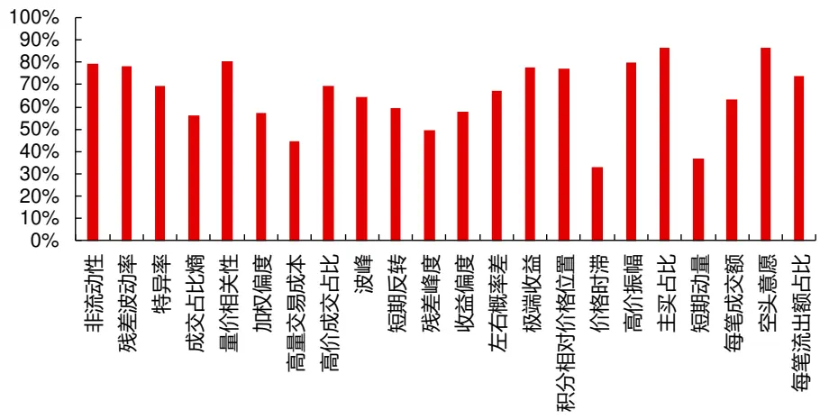
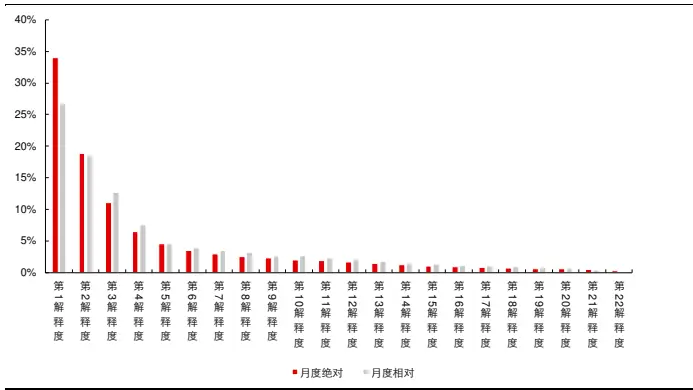
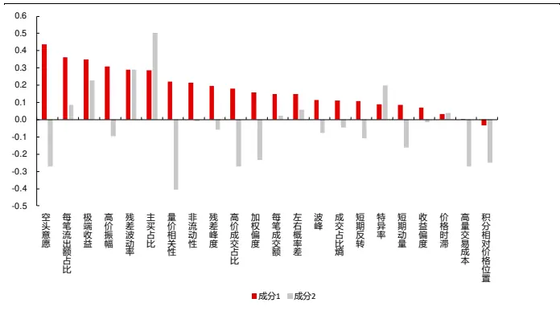
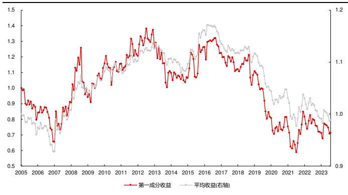
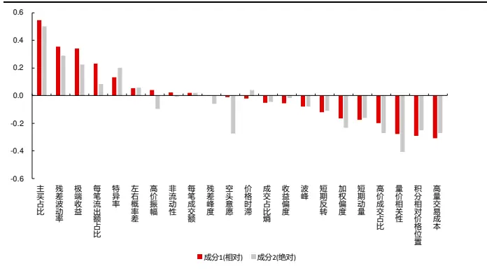
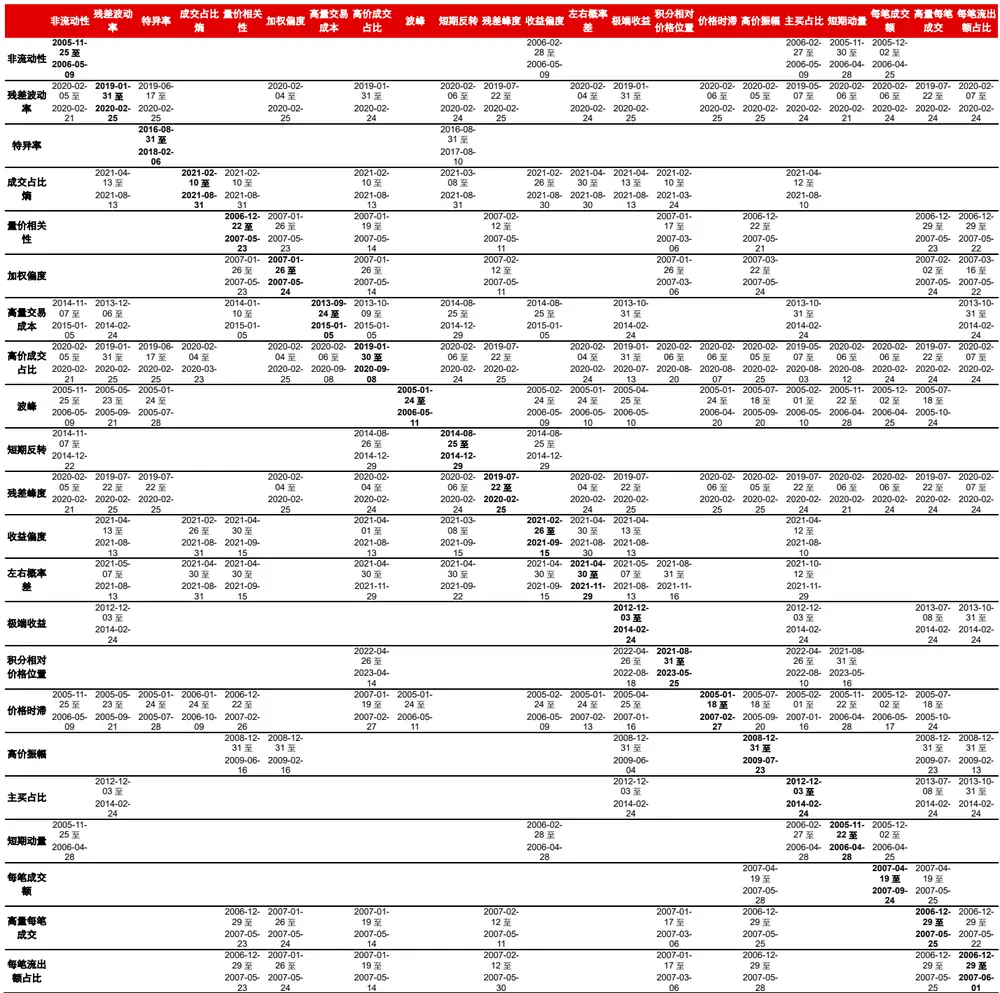
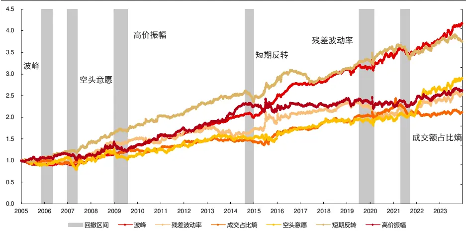

金融工程丨深度报告

[Table_Title] 高频因子（十四）：交易行情高频因子收益来源

## 报告要点

[Table_Summary] 交易行情高频数据是一类重要的高频数据，数据可以用于刻画特定的交易行为，具体到选股领域则可以构建多种收益来源的高频因子。高频因子的收益来源可以分为体系整体共有的“系统性”风险和体系内特有的“特质”风险，“特质”风险又可以大致分为流动性溢价、空头意愿、交易平稳、高位拥挤、反转、动量六个维度。

分析师及联系人

郑起SAC：S0490520060001

# 高频因子（十四）：交易行情高频因子收益来源

## [Table_Summary2] 收益来源的分析应从因子收益入手

因子暴露无法完全衡量因子彼此在收益层面的影响。因子暴露相关性虽然可以一定程度上反映因子之间对彼此收益的影响，即高相关性因子中性后收益变弱，低相关性因子中性后收益不变，负相关性因子中性后收益变强，但这种影响存在局部偏差，存在高相关性因子中性后收益变弱、低相关性因子中性后收益变强的情况，更重要的是因子间的影响具有单向性，因子暴露相关性无法体现这一点。

因子暴露无法完全对应收益来源。高因子暴露相关性一般意味着因子的收益来源较为相似，但也会存在局部偏差，尤其体现因子风险端的衡量上。

## 高频因子收益来源可以分为体系整体共有和体系内差异

第一收益来源为所有因子共有，即该体系的“系统性”风险，是因子体系波动最大的方向，即风险聚集的主要所在，可以以所有因子的平均收益来衡量；

其余收益来源在体系内产生分化，即因子的“特质”风险，形成局部收益相似的聚类，可以通过聚类因子的平均收益来衡量。

## 每种收益来源的交易行情高频因子都存在固有构建逻辑

收益来源和构建因子是相互结合的，通过已知的收益来源寻找构建因子的逻辑，通过多角度描述这种构建逻辑更全面的获得该收益来源，因此构建的大量高频因子均有其存在的意义。

收益来源的分析可以从风险聚集度和收益相似度两个角度入手，也对应了分析上的两种统计方法——主成分分析和聚类。

交易行情数据为对市场交易数据按照一定频率的切片统计后的截面数据，字段包括开盘价、收盘价、最高价、最低价、成交量、成交额、成交笔数等字段信息，可以刻画部分市场交易行为。本文共总结了六种交易行情数据可以刻画的收益来源，分别为流动性溢价、空头意愿、交易平稳、高位拥挤、反转、动量六个维度，展示了 34 个有选股能力的交易行情高频因子。

[Table_Report] •《风格切换需要什么条件—金融工程 2024 年度投资策略》2023-12-25

- 《机构持仓（十五）：机构持仓补全与分域增强策略》2023-11-16

## 相关研究

- 《量化角度看可转债（七）：转债冲击成本与高频因子》2023-12-13

## 风险提示

1、模型存在失效风险；

2、本文举例均基于历史数据，不保证未来收益。

更多研报请访问长江研究小程序

## 高频收益来源

## 高频数据类型

交易的高频数据可以分为 tick数据和快照数据，tick 数据完整记录了市场每一笔交易以及新增的订单情况，是最原始的交易数据，快照数据则是对 tick 数据按照一定频率切片后的统计数据，即以特定频率统计该时间区间数据并于截面展示，属于处理后的交易数据。level1 数据仅有快照数据，而 level2 的数据包含了tick数据和快照数据。快照数据又可以分为交易行情数据和订单委托行情数据：

交易行情数据包括开盘价、收盘价、最高价、最低价、成交量、成交额、成交笔数等字段信息；

订单委托行情数据包括买卖报价和委托量，其中 level1 数据可得五档数据，level2数据可得十档数据。

本文将聚焦于交易行情数据，对因子收益来源（指通过暴露某种风险获得对应收益）给出分析，并在后文中给出具体因子的构建方式及回测表现。

## 因子暴露和因子收益的差异

本文因子暴露特指截面标准化后的因子，因子收益指通过因子构建组合获得的相对收益，具体有两种：

“纯”因子收益，以当期因子暴露对下一期收益率做回归得到斜率项作为收益，本质为多空组合收益；

超额收益，以因子大小排序得到分组组合，取头部组合相对全股票组合的超额收益，本质为多头组合收益。

下图展示了各个因子上述两种收益的相关性，绝大部分因子的两种收益较为相似，考虑到在 A 股市场投资更多集中在多头端，本文以超额收益作为因子收益的代表。

图 1：因子不同收益相关性

资料来源：天软科技，长江证券研究所

## 因子暴露无法完全衡量因子彼此在收益层面的影响

高频因子刻画交易行为，所以很多因子的收益来源有重复的部分，而相关性的高低体现了因子收益来源重叠程度，因子彼此的线性影响则可以通过中性前后因子表现差异来衡量，具体来说：

- 中性后因子表现变强，说明剔除了噪音（即收益获取能力较低的风险）部分；

中性后因子表现变弱，说明因子收益率来源有相同的部分；

中性后因子表现不变，说明因子收益来源不同，或该收益来源的收益与风险匹配。中性后因子表现不变，说明因子收益来源不同，或该收益来源的收益与风险匹配。

下表展示了因子彼此之间的影响程度，括号中的值为因子暴露相关性，括号外的值为该列的因子对该行的因子做回归取残差后的因子收益信息比，其中对角线的值为该行列的因子收益信息比。

表 1：因子影响度

|  | 非流动性 | 残差波动 | 特异率 | 成交占比 | 量价相关 |  | 高量交易 | 高价成交 | 波峰 | 短期反转 | 残差峰度 | 收益偏度 | 左右概率 | 极端收益 | 积分对 | 价格时滞 | 高价振幅 | 主买占比 | 短期动量 | 每笔成交 | 高量每笔 | 每笔流出 |
| --- | --- | --- | --- | --- | --- | --- | --- | --- | --- | --- | --- | --- | --- | --- | --- | --- | --- | --- | --- | --- | --- | --- |
|  |  |  |  | 熵 | 性 | 加收偏度 | 成本 | 占比 |  |  |  |  |  |  |  |  |  |  |  | 额 | 成交 | 额占比 |
| 非流动性( | 2.49100.00%) | 0.03(22.00%) | 0.85(15.37%) | 1.03(-2.40%) | 0.44(4.14%) | 0.86(1.55%) | 0.35(9.44%) | 0.23(-2.93%) | 0.80(23.36%) | 1.00(12.72%) | 0.41(6.52%) | 0.36(4.09%) | 0.08(13.90%) | -0.00(10.17%) | 0.09(2.53%) | -0.96(7.50%) | -0.22(39.86%) | -0.14(19.64%) | 0.02(19.67%) | 0.78(40.12%) | 0.15(40.50%) | 0.81(45.14%) |
| 残差波动率 | 2.41(22.00%) | 0.70(100.00%) | -0.27(66.80%) | -1.01(48.08%) | 0.49(6.13%) | 0.55(16.15%) | 0.04(27.66%) | -0.01(8.14%) | 0.83(43.76%) | 0.20(44.89%) | -0.81(31.24%) | -0.29(20.18%) | 0.32(16.53%) | -0.75(60.57%) | 0.37(-6.19%) | -1.72(31.99%) | 0.04(49.99%) | -0.30(34.74%) | 0.26(15.61%) | 1.57(18.23%) | 0.53(29.56%) | 1.15(39.37%) |
| 特异率 | 2.46(15.37%) | -0.32(66.80%) | 1.45(100.00%) | -0.79(40.04%) | 0.48(0.81%) | 0.45(13.42%) | 0.31(17.48%) | -0.07(12.46%) | 1.04(31.50%) | 0.60(29.08%) | -0.53(23.92%) | -0.01(16.50%) | 0.42(10.16%) | -0.02(27.55%) | 0.05(5.07%) | -1.79(48.68%) | 0.43(20.25%) | -0.06(16.21%) | 0.59(7.91%) | 1.71(16.37%) | 0.63(4.84%) | 1.13(17.92%) |
| 成交占比熵 | 2.52(-2.40%) | 0.22(48.08%) | 1.09(40.04%) | 0.74(100.00%) | 0.41(27.63%) | 0.31(42.30%) | 0.21(39.53%) | -0.35(24.48%) | 1.25(42.31%) | 0.81(45.68%) | -0.92(47.49%) | -0.14(34.06%) | 0.74(6.70%) | 0.03(38.57%) | 0.12(3.26%) | -1.47(19.68%) | 0.73(9.43%) | 0.17(-4.77%) | 0.65(2.15%) | 2.10(2.93%) | 0.60(8.04%) | 1.20(16.43%) |
| 量价相关性 | 2.49(4.14%) | 0.69(6.13%) | 1.38(0.81%) | 0.63(27.63%) | 0.52(100.00%) | 0.34(55.18%) | 0.42(18.98%) | -0.25(25.18%) | 1.69(11.24%) | 1.12(20.49%) | 0.79(12.81%) | 0.19(17.31%) | 0.58(8.04%) | 0.24(10.47%) | 0.13(0.02%) | -0.06(-0.93%) | 0.70(7.61%)( | 0.09-10.42%) | 0.63(1.35%) | 2.15(-4.27%) | 0.50(28.45%) | 1.33(6.23%) |
| 加权偏度 | 2.48(1.55%) | 0.55(16.15%) | 1.32(13.42%) | 0.02(42.30%) | 0.03(55.18%) | 0.85(100.00%) | 0.19(38.50%) | -0.30(19.14%) | 1.52(13.84%) | 0.94(24.49%) | 0.39(21.42%) | 0.16(21.38%) | 0.62(4.79%) | 0.24(14.78%) | 0.13(2.02%) | -0.73(5.26%) | 0.73(6.45%) | 0.14(-7.42%) | 0.61(1.29%) | 2.16(-1.74%) | 0.51(18.82%) | 1.36(7.58%) |
| 高量交易成本 | 2.43(9.44%) | 0.37(27.66%) | 1.25(17.48%) | -0.13(39.53%) | 0.42(18.98%) | 0.20(38.50%)( | 0.66100.00%) | -0.59(44.19%) | 1.39(24.51%) | 0.72(35.28%) | -0.66(30.68%) | -0.16(29.77%) | 0.53(9.37%) | 0.06(28.28%) | -0.03(14.58%) | -1.28(7.77%) | 0.43(21.61%) | 0.13(-3.50%) | 0.55(8.62%) | 2.09(2.13%) | 0.46(20.51%) | 1.22(19.14%) |
| 高价成交占比 | 2.53(-2.93%) | 0.63(8.14%) | 1.43(12.46%) | 0.48(24.48%) | 0.41(25.18%) | 0.61(19.14%) | 0.30(44.19%) | 0.09(100.00%) | 1.50(28.46%) | 0.97(27.63%) | 0.31(20.07%) | 0.21(18.16%) | 0.55(13.88%) | 0.15(14.21%) | -0.02(33.06%) | -0.33(5.84%) | 0.51(16.56%) | 0.16(-6.94%) | 0.54(9.69%) | 2.15(0.48%) | 0.48(15.40%) | 1.28(7.15%) |
| 波峰 | 2.33(23.36%) | -0.11(43.76%) | 0.76(31.50%) | -1.22(42.31%) | 0.39(11.24%) | 0.58(13.84%) | 0.10(24.51%) | -0.65(28.46%) | 1.67(100.00%) | 0.03(43.93%) | -1.29(22.38%) | -0.32(19.05%) | 0.34(16.12%) | -0.43(42.23%) | -0.07(12.05%) | -1.97(15.67%) | 0.07(37.90%) | 0.09(5.53%) | 0.20(19.27%) | 1.52(21.01%) | 0.49(17.43%) | 1.08(24.05%) |
| 短期反转 | 2.47(12.72%) | 0.27(44.89%) | 1.01(29.08%) | -0.50(45.68%) | 0.27(20.49%) | 0.29(24.49%) | -0.02(35.28%) | -0.64(27.63%) | 1.15(43.93%) | 1.30(100.00%) | -0.79(29.17%) | -1.06(54.64%) | 0.09(26.27%) | -0.35(54.78%) | 0.41(-6.97%) | -1.59(14.08%) | 0.35 ((33.01%) | 7.3%)) | 0.20(21.28%) | 1.80(11.19%) | 0.48(16.42%) | 1.18(33.72%) |
| 残差峰度 | 2.44(6.52%) | 0.27(31.24%) | 1.16(23.92%) | 0.07(47.49%) | 0.43(12.81%) | 0.61(21.42%) | 0.41(30.68%) | -0.18(20.07%) | 1.51(22.38%) | 0.93(29.17%) | 1.14(100.00%) | -0.05(43.96%) | 0.68(2.14%) | -0.00(32.50%) | 0.08(5.60%) | -0.68(11.29%) | 0.69(5.38%) | 0.10(2.01%) | 0.67(0.12%) | 2.13(-1.18%) | 0.57(23.37%) | 1.23(15.31%) |
| 收益偏度 | 2.46(4.09%) | 0.49(20.18%) | 1.33(16.50%) | 0.15(34.06%) | 0.43(17.31%) | 0.70(21.38%) | 0.44(29.77%) | -0.17(18.16%) | 1.36(19.05%) | 0.75(54.64%) | 0.36(43.96%) | 0.46(100.00%) | 0.41(18.92%) | 0.03(41.50%) | 0.24(-7.08%) | -0.77(7.71%) | 0.67(8.90%) | 0.13(-6.74%) | 0.62(3.25%) | 2.08(0.78%) | 0.63(10.56%) | 1.21(12.68%) |
| 左右概率差 | 2.44(13.90%) | 0.69(16.53%) | 1.51(10.16%) | 0.83(6.70%) | 0.51(8.04%) | 0.83(4.79%) | 0.67(9.37%) | 0.07(13.88%) | 1.69(16.12%) | 1.35(26.27%) | 1.20(2.14%) | 0.24(18.92%) | 0.70(100.00%) | 0.31(24.28%) | 0.33(-8.82%) | -0.19 ((5.02%) | 12.77%) | 0.06(9.97%) | 0.69(14.57%) | 2.03(8.57%) | 0.60(12.92%) | 1.28(14.97%) |
| 极端收益 | 2.50(10.17%) | 0.86(60.57%) | 1.25(27.55%) | -0.10(38.57%) | 0.45(10.47%) | 0.78(14.78%) | 0.27(28.28%) | -0.04(14.21%) | 1.29(42.23%) | 0.55(54.78%) | -0.31(32.50%) | -0.40(41.50%) | 0.29(24.28%) | 0.30(100.00%) | 0.35(-3.59%) | -1.01(13.05%) | 0.46(37.77%) | -0.19(30.45%) | 0.46(13.91%) | 1.93(11.15%) | 0.61(24.60%) | 1.30(33.47%) |
| 积分相对价格位置 | 2.49(2.53%) | 0.87(-6.19%) | 1.36(5.07%) | 0.60(3.26%) | 0.53(0.02%) | 0.80(2.02%) | 0.52(14.58%) | 0.16(33.06%) | 1.40(12.05%) | 1.53(-6.97%) | 0.86(5.60%) | 0.45(-7.08%) | 0.73(-8.82%) | 0.33(-3.59%) | 0.15(100.00%) | -0.34(2.67%) | 0.71(8.99%) | 0.09(2.97%) | 0.75(0.81%) | 2.05(2.15%) | 0.69(-0.68%) | 1.36(1.76%) |
| 价格时滞 | 2.48(7.50%) | 0.39(31.99%) | 1.17(48.68%) | 0.12(19.68%) | 0.51(-0.93%) | 0.80(5.26%) | 0.58(7.77%) | -0.01(5.84%) | 1.50(15.67%) | 1.14(14.08%) | 0.62(11.29%) | 0.33(7.71%) | 0.69(5.02%) | 0.26(13.05%) | 0.13(2.67%) | 0.24(100.00%) | 0.65(9.62%) | 0.02(7.44%) | 0.71(3.96%) | 1.93(8.31%) | 0.65(1.26%) | 1.23(8.92%) |
| 高价振幅 | 2.38(39.86%) | 0.51(49.99%) | 1.28(20.25%) | 0.71(9.43%) | 0.52(7.61%) | 0.79(6.45%) | 0.33(21.61%) | -0.29(16.56%) | 1.64(37.90%) | 0.85(33.01%) | 0.81(5.38%) | 0.25(8.90%) | 0.44(12.94%) | 0.24(37.77%) | 0.02(8.99%) | -1.03(9.62%) | 0.75(100.00%) | 0.03(-1.90%) | 0.29(23.51%) | 1.35(19.32%) | 0.38(28.90%) | 1.20(33.82%) |
| 主买占比 | 2.51(19.64%) | 0.66(34.74%) | 1.34(16.21%) | 0.97(-4.77%) | 0.55(-10.42%) | 1.06(-7.42%) | 0.72(-3.50%) | -0.02(-6.94%) | 1.76(5.53%) | 1.37(-7.35%) | 1.19(2.01%) | 0.56(-6.74%) | 0.62(9.97%) | 0.22(30.45%) | 0.10(2.97%) | -0.40(7.44%) | 0.69(-1.90%) | 0.09(100.00%) | 0.65(4.31%) | 2.00(20.34%) | 0.67(24.82%) | 1.25(22.17%) |
| 短期动量 | 2.25(19.67%) | 0.59(15.61%) | 1.40(7.91%) | 0.82(2.15%) | 0.46(1.35%) | 0.96(1.29%) | 0.58(8.62%) | -0.13(9.69%) | 1.34(19.27%) | 0.82(21.28%) | 1.12(0.12%) | 0.44(3.25%) | 0.42(14.57%) | 0.27(13.91%) | 0.25(0.81%) | -0.50(3.96%) | 0.48(23.51%) | 0.07(4.31%) | 0.72(100.00%) | 1.98(14.02%) | 0.59(13.61%) | 1.22(23.85%) |
| 每笔成交额 | 2.14(40.12%) | 0.17(18.23%) | 1.01(16.37%) | 0.61(2.93%) | 0.59(-4.27%) | 1.07(-1.74%) | 0.56(2.13%) | 0.01(0.48%) | 0.94(21.01%) | 0.83(11.19%) | 1.15(-1.18%) | 0.49(0.78%) | 0.51(8.57%) | 0.01(11.15%) | 0.24(2.15%) | -1.20(8.31%) | 0.01(19.32%) | -0.16(20.34%) | 0.31(14.02%) | 2.15(100.00%) | 0.52(15.40%) | 1.21(17.09%) |
| 高量每笔成交 | 2.13(40.50%) | 0.24(29.56%) | 1.42(4.84%) | 0.71(8.04%) | 0.30(28.45%) | 0.79(18.82%) | 0.12(20.51%) | -0.36(15.40%) | 1.09(17.43%) | 0.62(16.42%) | -0.37(23.37%) | 0.29(10.56%) | 0.18(12.92%) | -0.02(24.60%) | 0.31(-0.68%) | -0.36(1.26%) | 0.26(28.90%) | -0.10(24.82%) | 0.33(13.61%) | 1.68(15.40%) | 0.67(100.00%) | 1.35(36.94%) |
| 每笔流出额占比 | 2.07(45.14%) | 0.01(39.37%) | 1.05(17.92%) | 0.45(16.43%) | 0.39(6.23%) | 0.80(7.58%) | 0.19(19.14%) | -0.15(7.15%) | 1.02(24.05%) | 0.48(33.72%) | 0.03(15.31%) | 0.22(12.68%) | 0.16(14.97%) | -0.28(33.47%) | 0.22(1.76%) | -1.11(8.92%) | 0.25(33.82%) | -0.24(22.17%) | 0.07(23.85%) | 1.79(17.09%) | 0.30(36.94%) | 1.33(100.00%) |

资料来源：天软科技，长江证券研究所

通过该表的统计结果，可以对因子间的联系给出以下分类：

中性后因子表现均变强（一般发生在因子负相关的时候，如残差波动率-积分相对价格位置），说明因子收益来源有重合的部分，且该部分为噪音，应该对两个因子相互中性，保留两个因子；

中性后因子表现一方变强一方不变（一般发生在因子负相关的时候，如加权偏度（变强）-每笔成交额（不变）），说明因子（主要）收益来源不同，不变因子有变强因子的噪音，应该以变强因子对变弱做中性，保留两个因子；

中性后因子表现均不变（一般发生在因子相关性较低时，如波峰-高价振幅、非流动性-加权偏度），说明因子收益来源不同，应该保留两个因子。

中性后因子表现一方变弱一方不变（一般发生在因子正相关且相关性较低时，如高价振幅（变弱）-波峰（不变）、残差峰度（变弱）-非流动性（不变）），说明因子收益来源相同，变弱因子可被变强因子解释，应该保留不变因子；

中性后因子表现一方变强一方变弱（一般发生在因子正相关时，如残差波动率（变强）-极端收益（变弱）、加权偏度（变强）-短期动量（变弱）），说明因子收益来源相同，变弱因子可被变强因子解释，且变弱因子含有额外噪音，应该以变强因子对变弱因子做中性，保留变强因子；

中性后因子表现均变弱（一般发生在因子正相关时，如残差波动率-特异率、波峰-短期动量），说明因子收益来源相同，应该合并因子；

所以从结果上看，因子暴露相关性可以一定程度上反映因子之间对彼此收益的影响，即相关性越高，因子间彼此影响越大，中性后呈现变弱趋势；相关性越低，因子间彼此影响越小，中性后呈现不变趋势；负相关性越高，因子间彼此影响越大，中性后呈现变强趋势。但：

影响程度局部存在偏差，相关性较低和较高均可以对因子表现有较大影响，且效果相反，如成交占比熵和价格时滞相关性较低，但彼此影响较大，残差波动率和主买占比相关性较高，但彼此影响较小，所以信息比降低值和因子暴露相关性之间的相关性仅为 21.01%；

因子间的影响具有单向性，而这一点因子暴露相关性无法体现，如非流动性因子可以作为每笔成交额收益来源的解释，反之则不能。

故因子暴露的相关性可以从大方向上确定因子彼此影响收益的影响，但精度有限。

## 因子暴露无法完全对应收益来源

因子收益来源为通过暴露某种风险获得对应收益，所以相同收益来源的因子会有收益相似、风险聚集的特点，故本节也从这两个方面讨论暴露相关性和收益来源的联系。

在因子标准化的前提下，因子暴露和因子收益两者之间的差别如下：

$$
\operatorname{corr}(x_{1},x_{2})\operatorname{corr}(x_{1}r,x_{2}\mathbf{r})
$$

下表展示了因子收益相关性（括号内为因子暴露相关性），如成交占比熵和特异率因子暴露相关性较高，但因子收益相关性较低；左右概率差和短期反转因子暴露相关性较低，但因子收益相关性较高；高量交易成本和残差波动率因子暴露相关性高，但因子收益相关性为负；成交占比熵和主买占比因子暴露相关性为负，但因子收益相关性为正。所以因子暴露相关性和收益相关性结果上有一定差别，但两者的相关系数为 55.13%，仍属于相对较高水平。

表 2：因子收益相关性

|  | 非流动性 | 残差波动 | 特异率 | 成交占比 | 量价关 | 加权偏度 | 高量交 | 高价成比交 | 波峰 | 短期反转 | 残差峰度 | 收益偏度 | 左右#率 | 极端收益 | 积分对量 | 价格时滞 | 高价振幅 | 主买占比 | 短期动量 | 每笔成交 | 高量成 | 每比 |
| --- | --- | --- | --- | --- | --- | --- | --- | --- | --- | --- | --- | --- | --- | --- | --- | --- | --- | --- | --- | --- | --- | --- |
| 非流动性 | 100.00%(100.00%)) | 20.26%(22.00%) | 34.89%(15.37%) | 4.56%(-2.40%) | 8.78%(4.14%) | 5.67%(1.55%) | 1.74%(9.44%) | 15.63%(-2.93%) | 50.90%(23.36%) | 42.54%(12.72%) | 27.41%(6.52%) | 35.14% 38.86%(4.09%) (13.90%) |  | 18.14%(10.17%) | -21.49%(2.53%) | 24.35%(7.50%) | 51.25%(39.86%) | 9.77%(19.64%) | 40.54%(19.67%) | 49.71%(40.12%) | 24.89%(40.50%) | 45.55%(45.14%) |
| 残差波动率 | 20.26%(22.00%) | 100.00%(100.00%) | 52.08%(66.80%) | 29.29%(48.08%) | 0.68%(6.13%) | 6.82%(16.15%) | -28.50%(27.66%) | 15.06%(8.14%) | 21.08%(43.76%) | 9.69%(44.89%) | 50.02%(31.24%) | 9.60%(20.18%) | 50.48%(16.53%) | 88.32%(60.57%) | -25.11%(-6.19%) | 24.42%(31.99%) | 45.25%(49.99%) | 75.62%(34.74%) | -8.20%(15.61%) | 21.23%(18.23%) | 35.82%(29.56%) | 63.32%(39.37%) |
| 特异率 | 34.89%(15.37%) | 52.08%(66.80%) | 100.00%(100.00%) | 12.70%(40.04%) | -17.74%(0.81%) | -9.99%(13.42%) | -15.48%(17.48%) | -6.42%(12.46%) | 21.99%(31.50%) | 28.24%(29.08%) | 9.68%(23.92%) | 28.11%(16.50%) | 42.28%(10.16%) | 30.51%(27.55%) | -33.56%(5.07%) | 48.98%(48.68%) | 5.39%(20.25%) | 35.15%(16.21%) | 9.28%(7.91%) | 23.63%(16.37%) | -8.14%(4.84%) | 25.32%(17.92%) |
| 成交占比熵 | 4.56%(-2.40%) | 29.29%(48.08%) | 12.70%(40.04%) | 100.00%(100.00%) | 38.34% 29.02%(27.63%)(42.30%) |  | 13.57%(39.53%) | 27.50%(24.48%) | 41.20%(42.31%) | 29.04%(45.68%) | 34.01%(47.49%) | 15.17%(34.06%) | 40.93%(6.70%) | 28.36%(38.57%) | -3.42%(3.26%) | 6.51%(19.68%) | 10.31%(9.43%) | 14.74%(-4.77%) | 20.47%(2.15%) | 5.05%(2.93%) | 17.55%(8.04%) | 17.08%(16.43%) |
| 量价相关性 | 8.78%(4.14%) | 0.68%(6.13%) | -17.74%(0.81%) | 38.34%(27.63%) | 100.00%(100.00%) | 69.06%(55.18%) | 36.91%(18.98%) | 62.79%(25.18%) | 28.76%(11.24%) | 33.04%(20.49%) | 45.09%(12.81%) | 19.90%(17.31%) | 16.28%(8.04%) | 18.05%(10.47%) | 29.45%(0.02%) | -3.60%(-0.93%) | 39.73%(7.61%) | -8.84%(-10.42%) | 35.00%(1.35%) | 0.24%(-4.27%) | 60.15%(28.45%) | 26.85%(6.23%) |
| 加权偏度 | 5.67%(1.55%) | 6.82%(16.15%) | -9.99%(13.42%) | 29.02%(42.30%) | 69.06%(55.18%) | 100.00%(100.00%) | 30.65%(38.50%) | 49.18%(19.14%) | 25.73%(13.84%) | 27.99%(24.49%) | 36.21%(21.42%) | 16.93%(21.38%) | 19.24%(4.79%) | 19.65%(14.78%) | 12.08%(2.02%) | -2.13%(5.26%) | 37.24%(6.45%) | -0.55%(-7.42%) | 20.57%(1.29%) | 2.22%(-1.74%) | 54.25%(18.82%) | 28.43%(7.58%) |
| 高量交易成本 | 1.74%(9.44%) | -28.50%(27.66%) | -15.48%(17.48%) | 13.57%(39.53%) | 36.91%(18.98%) | 30.65%(38.50%) | 100.00%(100.00%) | 47.00%(44.19%) | 11.92%(24.51%) | 19.99%(35.28%) | 12.17%(30.68%) | 8.13%(29.77%) | 3.71%(9.37%) | -22.32%(28.28%) | 42.91%(14.58%) | -0.00%(7.77%) | 3.33%(21.61%) | -38.20%(-3.50%) | 34.95%(8.62%) | -6.46%(2.13%) | 16.28%(20.51%) | -10.08%(19.14%) |
| 高价成交占比 | 15.63%(-2.93%) | 15.06%(8.14%) | -6.42%(12.46%) | 27.50%(24.48%) | 62.79%(25.18%) | 49.18%(19.14%) | 47.00%(44.19%) | 100.00%(100.00%) | 26.44%(28.46%) | 34.09%(27.63%) | 50.06%(20.07%) | 17.55%(18.16%) | 21.44%(13.88%) | 27.76%(14.21%) | 37.18%(33.06%) | 2.54%(5.84%) | 41.65%(16.56%) | -7.02%(-6.94%) | 27.86%(9.69%) | 13.45%(0.48%) | 55.11%(15.40%) | 23.38%(7.15%) |
| 波峰 | 50.90%(23.36%) | 21.08%(43.76%) | 21.99%(31.50%) | 41.20%(42.31%) | 28.76% 25.73%(11.24%)(13.84%) |  | 11.92%(24.51%) | 26.44%(28.46%) | 100.00%(100.00%) | 51.37%(43.93%) | 34.89%(22.38%) | 27.56%(19.05%) | 37.72%(16.12%) | 18.99%(42.23%) | -9.28%(12.05%) | 19.74%(15.67%) | 43.66%(37.90%) | -7.58%(5.53%) | 34.31%(19.27%) | 42.22%(21.01%) | 33.23%(17.43%) | 32.72%(24.05%) |
| 短期反转 | 42.54%(12.72%) | 9.69%(44.89%) | 28.24%(29.08%) | 29.04%(45.68%) | 33.04% 27.99%(20.49%)(24.49%) |  | 19.99%(35.28%) | 34.09%(27.63%) | 51.37%(43.93%) | 100.00%(100.00%) | 17.55%(29.17%) | 63.67%(54.64%) | 53.42%(26.27%) | 14.18%(54.78%) | -29.58%(-6.97%) | 16.98%(14.08%) | 27.86%(33.01%) | -18.27%(-7.35%) | 38.32%(21.28%) | 19.00%(11.19%) | 18.45%(16.42%) | 21.41%(33.72%) |
| 残差峰度 | 27.41%(6.52%) | 50.02%(31.24%) | 9.68%(23.92%) | 34.01%(47.49%) | 45.09% 36.21%(12.81%)(21.42%) |  | 12.17%(30.68%) | 50.06%(20.07%) | 34.89%(22.38%) | 17.55%(29.17%) | 100.00%(100.00%) | 7.47%(43.96%) | 36.93%(2.14%) | 55.53%(32.50%) | 15.50%(5.60%) | 9.65%(11.29%) | 45.00%(5.38%) | 29.15%(2.01%) | 18.23%(0.12%) | 23.81%(-1.18%) | 62.09%(23.37%) | 48.67%(15.31%) |
| 收益偏度 | 35.14%(4.09%) | 9.60%(20.18%) | 28.11%(16.50%) | 15.17%(34.06%) | 19.90% 16.93%(17.31%)(21.38%) |  | 8.13%(29.77%) | 17.55%(18.16%) | 27.56%(19.05%) | 63.67%(54.64%) | 7.47%(43.96%) | 100.00%(100.00%) | 43.82%(18.92%) | 17.48%(41.50%) | -28.83%(-7.08%) | 11.59%(7.71%) | 12.59%(8.90%) | 1.95%(-6.74%) | 18.28%(3.25%) | 17.86%(0.78%) | 4.97%(10.56%) | 15.46%(12.68%) |
| 左右概率差 | 38.86%(13.90%) | 50.48%(16.53%) | 42.28% 40.93%(10.16%)(6.70%) |  | 16.28% 19.24%(8.04%) (4.79%) |  | 3.71%(9.37%) | 21.44%(13.88%) | 37.72%(16.12%) | 53.42%(26.27%) | 36.93%(2.14%) | 43.82%(18.92%) | 100.00%(100.00%) | 49.63%(24.28%) | -36.40%(-8.82%) | 26.37%(5.02%) | 32.50%(12.94%) | 32.69%(9.97%) | 24.76%(14.57%) | 29.11%(8.57%) | 23.64%(12.92%) | 42.79%(14.97%) |
| 极端收益 | 18.14%(10.17%) | 88.32%(60.57%) | 30.51% 28.36%(27.55%) (38.57%) |  | 18.05% 19.65%(10.47%)(14.78%) |  | -22.32%(28.28%) | 27.76%(14.21%) | 18.99%(42.23%) | 14.18%(54.78%) | 55.53%(32.50%) | 17.48%(41.50%) | 49.63%(24.28%) | 100.00%(100.00%) | -17.55%(-3.59%) | 16.67%(13.05%) | 53.68%(37.77%) | 72.20%(30.45%) | 0.84%(13.91%) | 17.18%(11.15%) | 48.83%(24.60%) | 65.29%(33.47%) |
| 积分相对价格位置 | -21.49%(2.53%) | -25.11%(-6.19%) | -33.56%(5.07%) | -3.42%(3.26%) | 29.45% 12.08%(0.02%) (2.02%) |  | 42.91%(14.58%) | 37.18%(33.06%) | -9.28%(12.05%) | -29.58%(-6.97%)) | 15.50%(5.60%) | -28.83%(-7.08%) | -36.40%(-8.82%) | -17.55%(-3.59%) | 100.00%(100.00%) | -13.16%(2.67%) | -1.96%(8.99%) | -22.17%(2.97%) | 15.00%(0.81%) | -10.53%(2.15%) | 15.07%(-0.68%) | -16.70%(1.76%) |
| 价格时滞 | 24.35%(7.50%) | 24.42%(31.99%) | 48.98% 6.51%(48.68%)(19.68%) |  | -3.60% -2.13%(-0.93%) (5.26%) |  | -0.00%(7.77%) | 2.54%(5.84%) | 19.74%(15.67%) | 16.98%(14.08%) | 9.65%(11.29%) | 11.59%(7.71%) | 26.37%(5.02%) | 16.67%(13.05%) | -13.16%(2.67%) | 100.00%(100.00%) | 7.64%(9.62%) | 17.91%(7.44%) | 29.35%(3.96%) | 13.17%(8.31%) | 1.90%(1.26%) | 10.11%(8.92%) |
| 高价振幅 | 51.25%(39.86%) | 45.25%(49.99%) | 5.39% 10.31%(20.25%) (9.43%) |  | 39.73% 37.24%(7.61%) (6.45%) |  | 3.33%(21.61%) | 41.65% 43.66%(16.56%) (37.90%) |  | 27.86%(33.01%) | 45.00%(5.38%) | 12.59%(8.90%) | 32.50%(12.94%) | 53.68%(37.77%) | -1.96%(8.99%) | 7.64%(9.62%) | 100.00%(100.00%) | 19.38% 28.09%(-1.90%)(23.51%) |  | 38.81%(19.32%) | 65.48%(28.90%) | 65.13%(33.82%) |
| 主买占比 | 9.77%(19.64%) | 75.62%(34.74%) | 35.15% 14.74%(16.21%)(-4.77%) |  | -8.84% -0.55%(-10.42%)(-7.42%) |  | -38.20%(-3.50%) | -7.02%(-6.94%) | -7.58%(5.53%) | -18.27%(-7.35%) | 29.15%(2.01%) | 1.95%(-6.74%) | 32.69%(9.97%) | 72.20%(30.45%) | -22.17%(2.97%) | 17.91%(7.44%) | 19.38%(-1.90%) | 100.00%(100.00%) | -12.20%(4.31%) | 11.34%(20.34%) | 19.91%(24.82%) | 52.86%(22.17%) |
| 短期动量 | 40.54%(19.67%) | -8.20%(15.61%) | 9.28%(7.91%) | 20.47%(2.15%) | 35.00% 20.57%(1.35%) (1.29%) |  | 34.95%(8.62%) | 27.86%(9.69%) | 34.31%(19.27%) | 38.32%(21.28%) | 18.23%(0.12%) | 18.28%(3.25%) | 24.76%(14.57%) | 0.84%(13.91%) | 15.00%(0.81%) | 29.35%(3.96%) | 28.09%(23.51%) | -12.20%(4.31%) | 100.00%(100.00%) | 18.73% 19.31%(14.02%)(13.61%) |  | 20.13%(23.85%) |
| 每笔成交额 | 49.71%(40.12%) | 21.23%(18.23%) | 23.63%(16.37%) | 5.05%(2.93%) | 0.24% 2.22%(-4.27%) (-1.74%) |  | -6.46%(2.13%) | 13.45% 42.22%(0.48%) (21.01%) |  | 19.00%(11.19%) | 23.81%(-1.18%) | 17.86% 29.11%(0.78%) (8.57%) |  | 17.18%(11.15%) | -10.53%(2.15%) | 13.17%(8.31%) | 38.81%(19.32%) | 11.34%(20.34%) | 18.73%(14.02%) | 100.00%(100.00%) | 22.47% 28.54%(15.40%)(17.09%) |  |
| 高量每笔成交 | 24.89%(40.50%) | 35.82%(29.56%) | -8.14%(4.84%) | 17.55%(8.04%) | 60.15% 54.25%(28.45%)(18.82%) |  | 16.28%(20.51%) | 55.11%(15.40%) | 33.23%(17.43%) | 18.45%(16.42%) | 62.09%(23.37%) | 4.97%(10.56%) | 23.64%(12.92%) | 48.83%(24.60%) | 15.07%(-0.68%) | 1.90%(1.26%) | 65.48%(28.90%) | 19.91%(24.82%) | 19.31%(13.61%) | 22.47%(15.40%) | 100.00%(100.00%) | 66.32%(36.94%) |
| 每笔流出额占比 | 45.55%(45.14%) | 63.32%(39.37%) | 25.32%(17.92%) | 17.08%(16.43%) | 26.85% 28.43%(6.23%) (7.58%) |  | -10.08%(19.14%) | 23.38%(7.15%) | 32.72%(24.05%) | 21.41%(33.72%) | 48.67%(15.31%) | 15.46%(12.68%) | 42.79%(14.97%) | 65.29%(33.47%) | -16.70%(1.76%) | 10.11%(8.92%) | 65.13%(33.82%) | 52.86%(22.17%) | 20.13%(23.85%) | 28.54%(17.09%) | 66.32%(36.94%) | 100.00%(100.00%) |

资料来源：天软科技，长江证券研究所

因子暴露在收益来源上的误差主要体现在风险端，这里以月度收益重合度刻画风险，具体如下表所示，展示每列因子在每行因子的回撤区间内产生回撤的百分比（括号内为因子暴露相关性）。和因子收益类似，因子暴露相关性也无法完全衡量因子风险上的共性，如非流动性和特异率因子暴露相关性较低，但回撤重合度较高；残差波动率和波峰因子暴露相关性较高，但回撤重合度较低。因子暴露相关性和收益回撤重合度的相关系数为39.58%，即因子暴露在衡量风险上有较大误差。

表 3：因子回撤重合度

|  | 非流动性残差波动 |  | 特异率 | 成交占比 | 量价相关 | 加权偏度 | 高文交 | 高价成交 | 波峰 | 短期反转 | 残差峰度 | 差 |  | 极端收益 | 价格位置 | 价格时滞 | 高价振幅 | 主买占比 | 短期动量 | 额 | 成交 额占比 |  |
| --- | --- | --- | --- | --- | --- | --- | --- | --- | --- | --- | --- | --- | --- | --- | --- | --- | --- | --- | --- | --- | --- | --- |
| 非流动性 | 100.00%(100.00%) | 59.02%(22.00%) | 62.30%(15.37%) | 45.90%(-2.40%) | 44.26%(4.14%) | 40.98%(1.55%) | 37.70%(9.44%) | 47.54%(-2.93%) | 45.90% 45.90%(23.36%)(12.72%) |  | 44.26%(6.52%) | 57.38% 60.66%(4.09%) (13.90%) |  | 50.82%(10.17%) | 29.51%(2.53%) | 60.66%(7.50%) | 75.41%(39.86%) | 57.38% 55.74%(19.64%) (19.67%) |  | 54.10% 54.10% 54.10%(40.12%) (40.50%) (45.14%) |  |  |
| 残差波动率 | 33.96%(22.00%) | 100.00%(100.00%) | 48.11%(66.80%) | 52.83%(48.08%) | 43.40%(6.13%) | 40.57%(16.15%) | 27.36%(27.66%) | 56.60%(8.14%) | 33.96%(43.76%) | 35.85%(44.89%) | 51.89%(31.24%) | 43.40% 56.60%(20.18%)(16.53%) |  | 81.13%(60.57%) | 38.68%(-6.19%) | 53.77%(31.99%) | 60.38%(49.99%) | 82.08%(34.74%) | 31.13%(15.61%) | 42.45%(18.23%) | 57.55%(29.56%) | 59.43%(39.37%) |
| 特异率 | 45.78%(15.37%) | 61.45%(66.80%) | 100.00%(100.00%) | 44.58%(40.04%) | 30.12%(0.81%) | 34.94%(13.42%) | 28.92%(17.48%) | 42.17%(12.46%) | 33.73%(31.50%) | 37.35%(29.08%) | 31.33%(23.92%) | 46.99% 49.40%(16.50%) (10.16%) |  | 46.99%(27.55%) | 37.35%(5.07%) | 66.27%(48.68%) | 44.58%(20.25%) | 65.06%(16.21%) | 38.55%(7.91%) | 39.76%(16.37%) | 31.33%(4.84%) | 34.94%(17.92%) |
| 成交占比熵 | 28.57%(-2.40%) | 57.14%(48.08%) | 37.76%(40.04%)( | 100.00%100.00%) | 61.22%(27.63%) | 51.02%(42.30%) | 45.92%(39.53%) | 60.20%(24.48%) | 42.86%(42.31%) | 46.94%(45.68%) | 44.90%(47.49%) | 44.90% 55.10%(34.06%) (6.70%) |  | 52.04%(38.57%) | 44.90%(3.26%) | 52.04%(19.68%) | 45.92%(9.43%) | 57.14%(-4.77%) | 44.90%(2.15%) | 30.61%(2.93%) | 48.98%(8.04%) | 41.84%(16.43%) |
| 量价相关性 | 27.27%(4.14%) | 46.46%(6.13%) | 25.25%(0.81%) | 60.61%(27.63%) | 100.00%(100.00%) | 68.69%(55.18%) | 57.58%(18.98%) | 68.69%(25.18%) | 32.32%(11.24%) | 54.55%(20.49%) | 47.47%(12.81%) | 57.58%(17.31%) | 49.49%(8.04%) | 54.55%(10.47%) | 50.51%(0.02%) | 37.37%(-0.93%) | 50.51%(7.61%)( | 48.48%-10.42%) | 46.46%(1.35%) | 30.30%(-4.27%) | 57.58%(28.45%) | 43.43%(6.23%) |
| 加权偏度 | 27.47%(1.55%) | 47.25%(16.15%) | 31.87%(13.42%) | 54.95%(42.30%) | 74.73%(55.18%) | 100.00%(100.00%) | 58.24%(38.50%) | 64.84%(19.14%) | 32.97%(13.84%) | 49.45%(24.49%) | 47.25%(21.42%) | 52.75% 48.35%(21.38%) (4.79%) |  | 57.14%(14.78%) | 46.15%(2.02%) | 40.66%(5.26%) | 56.04%(6.45%) | 51.65%(-7.42%) | 42.86%(1.29%) | 27.47%(-1.74%) | 61.54%(18.82%) | 41.76%(7.58%) |
| 高量交易成本 | 24.21%(9.44%) | 30.53%(27.66%) | 25.26%(17.48%) | 47.37%(39.53%) | 60.00%(18.98%) | 55.79%(38.50%) | 100.00%(100.00%) | 65.26%(44.19%) | 36.84%(24.51%) | 47.37%(35.28%) | 36.84%(30.68%) | 50.53%(29.77%) | 46.32%(9.37%) | 40.00%(28.28%) | 55.79%(14.58%) | 36.84%(7.77%) | 46.32%(21.61%) | 33.68%(-3.50%) | 57.89%(8.62%) | 29.47%(2.13%) | 45.26%(20.51%) | 27.37%(19.14%) |
| 高价成交占比 | 25.44%(-2.93%) | 52.63%(8.14%) | 30.70%(12.46%) | 51.75%(24.48%) | 59.65%(25.18%) | 51.75%(19.14%) | 54.39%(44.19%) | 100.00%(100.00%) | 35.96%(28.46%) | 47.37%(27.63%) | 50.88%(20.07%) | 50.00%(18.16%) | 55.26%(13.88%) | 59.65%(14.21%) | 52.63%(33.06%) | 47.37%(5.84%) | 56.14%(16.56%) | 53.51%(-6.94%) | 42.11%(9.69%) | 40.35%(0.48%) | 54.39%(15.40%) | 44.74%(7.15%) |
| 波峰 | 43.75%(23.36%) | 56.25%(43.76%) | 43.75%(31.50%) | 65.62%(42.31%) | 50.00%(11.24%) | 46.88%(13.84%) | 54.69%(24.51%) | 64.06%(28.46%) | 100.00%(100.00%) | 62.50%(43.93%) | 46.88%(22.38%) | 53.12%(19.05%) | 60.94%(16.12%) | 50.00%(42.23%) | 51.56%(12.05%) | 46.88%(15.67%) | 62.50%(37.90%) | 45.31%(5.53%) | 50.00%(19.27%) | 51.56%(21.01%) | 50.00%(17.43%) | 43.75%(24.05%) |
| 短期反转 | 32.94%(12.72%) | 44.71%(44.89%) | 36.47%(29.08%) | 54.12%(45.68%) | 63.53%(20.49%) | 52.94%(24.49%) | 52.94%(35.28%) | 63.53%(27.63%) | 47.06%(43.93%) | 100.00%(100.00%) | 38.82%(29.17%) | 70.59%(54.64%) | 56.47%(26.27%) | 44.71%(54.78%) | 36.47%(-6.97%) | 49.41%(14.08%) | 54.12%(33.01%) | 35.29%(-7.35%) | 54.12%(21.28%) | 35.29%(11.19%) | 41.18%(16.42%) | 37.65%(33.72%) |
| 残差峰度 | 34.18%(6.52%) | 69.62%(31.24%) | 32.91%(23.92%) | 55.70%(47.49%) | 59.49%(12.81%) | 54.43%(21.42%) | 44.30%(30.68%) | 73.42%(20.07%) | 37.97%(22.38%) | 41.77%(29.17%) | 100.00%(100.00%) | 51.90%(43.96%) | 60.76%(2.14%) | 73.42%(32.50%) | 53.16%(5.60%) | 49.37%(11.29%) | 62.03%(5.38%) | 64.56%(2.01%) | 36.71%(0.12%) | 40.51%(-1.18%) | 65.82%(23.37%) | 58.23%(15.31%) |
| 收益偏度 | 33.65%(4.09%) | 44.23%(20.18%) | 37.50%(16.50%) | 42.31%(34.06%) | 54.81%(17.31%) | 46.15%(21.38%) | 46.15%(29.77%) | 54.81%(18.16%) | 32.69%(19.05%) | 57.69%(54.64%) | 39.42%(43.96%)( | 100.00%100.00%) | 54.81%(18.92%) | 50.00%(41.50%) | 30.77%(-7.08%) | 51.92%(7.71%) | 50.00%(8.90%) | 50.00%(-6.74%) | 50.00%(3.25%) | 34.62%(0.78%) | 42.31%(10.56%) | 37.50%(12.68%) |
| 左右概率差 | 37.00%(13.90%) | 60.00%(16.53%) | 41.00%(10.16%) | 54.00%(6.70%) | 49.00%(8.04%) | 44.00%(4.79%) | 44.00%(9.37%) | 63.00%(13.88%) | 39.00%(16.12%) | 48.00%(26.27%) | 48.00%(2.14%) | 57.00%(18.92%) | 100.00%(100.00%) | 66.00%(24.28%) | 32.00%(-8.82%) | 54.00%(5.02%) | 54.00%(12.94%) | 64.00%(9.97%) | 46.00%(14.57%) | 37.00%(8.57%) | 48.00%(12.92%) | 48.00%(14.97%) |
| 极端收益 | 29.52%(10.17%) | 81.90%(60.57%) | (27.11%) | 48.57%(38.57%) | 51.43%(10.47%) | 49.52%(14.78%) | 36.19%(28.28%) | 64.76%(14.21%) | 30.48%(42.23%) | 36.19%(54.78%) | 55.24%(32.50%) | 49.52%(41.50%) | 62.86%(24.28%) | 100.00%(100.00%) | ( -.19%) | 48.57%(13.05%) | 60.95%(37.77%) | 80.95%(30.45%) | 33.33%(13.91%) | 35.24%(11.15%) | 60.95%(24.60%) | 59.05%(33.47%) |
| 积分相对价格位置 | 18.75%(2.53%) | 42.71%(-6.19%) | 32.29%(5.07%) | 45.83%(3.26%) | 52.08%(0.02%) | 43.75%(2.02%) | 55.21%(14.58%) | 62.50%(33.06%) | 34.38%(12.05%) | 32.29%(-6.97%) | 43.75%(5.60%) | 33.33%(-7.08%) | 33.33%(-8.82%) | 39.58%(-3.59%) | 100.00%(100.00%) | 35.42%(2.67%) | 42.71%(8.99%) | 44.79%(2.97%) | 40.62%(0.81%) | 36.46%(2.15%) | 44.79%(-0.68%) | 35.42%(1.76%) |
| 价格时滞 | 32.74%(7.50%) | 50.44%(31.99%) | 48.67%(48.68%) | 45.13%(19.68%) | 32.74%(-0.93%) | 32.74%(5.26%) | 30.97%(7.77%) | 47.79%(5.84%) | 26.55%(15.67%) | 37.17%(14.08%) | 34.51%(11.29%) | 47.79%(7.71%) | 47.79%(5.02%) | 45.13%(13.05%) | 30.09%(2.67%) | 100.00%(100.00%) | 39.82%(9.62%) | 55.75%(7.44%) | 47.79%(3.96%) | 30.97%(8.31%) | 36.28%(1.26%) | 33.63%(8.92%) |
| 高价振幅 | 4 %%) | (4.6%) | 37.37%(20.25%) | 45.45%(9.43%) | 50.51%(7.61%) | 51.52%(6.45%) | 44.44%(21.61%) | 64.65%(16.56%) | 40.40%(37.90%) | 46.46%(33.01%) | 49.49%(5.38%) | 52.53%(8.90%) | 54.55%(12.94%) | 64.65%(37.77%) | 18.91%) | 45.45%(9.62%) | 100.00%(100.00%) | 57.58%(-1.90%) | 45.45%(23.51%) | 46.46%(19.32%) | 64.65%(28.90%) | 62.63%(33.82%) |
| 主买占比 | 29.91%(19.64%) | 74.36%(34.74%) | 46.15%(16.21%) | 47.86%(-4.77%) | 41.03%(-10.42%) | 40.17%(-7.42%) | 27.35%(-3.50%) | 52.14%(-6.94%) | 24.79%(5.53%) | 25.64%(-7.35%) | 43.59%(2.01%) | 44.44%(-6.74%) | 54.70%(9.97%) | 72.65%(30.45%) | 36.75%(2.97%) | 53.85%(7.44%) | 48.72%(-1.90%) | 100.00%(100.00%) | 31.62%(4.31%) | 33.33%(20.34%) | 49.57%(24.82%) | 55.56%(22.17%) |
| 短期动量 | 35.42%(19.67%) | 34.38%(15.61%) | 33.33%(7.91%) | 45.83%(2.15%) | 47.92%(1.35%) | 40.62%(1.29%) | 57.29%(8.62%) | 50.00%(9.69%) | 33.33%(19.27%) | 47.92%(21.28%) | 30.21%(0.12%) | 54.17%(3.25%) | 47.92%(14.57%) | 36.46%(13.91%) | 40.62%(0.81%) | 56.25%(3.96%) | 46.88%(23.51%) | 38.54%(4.31%) | 100.00%(100.00%) | 35.42%(14.02%) | 39.58%(13.61%) | 35.42%(23.85%) |
| 每笔成交额 | 46.48%(40.12%) | 63.38%(18.23%) | 46.48%(16.37%) | 42.25%(2.93%) | 42.25%(-4.27%) | 35.21%(-1.74%) | 39.44%(2.13%) | 64.79%(0.48%) | 46.48%(21.01%) | 42.25%(11.19%) | 45.07%(-1.18%) | 50.70%(0.78%) | 52.11%(8.57%) | 52.11%(11.15%) | 49.30%(2.15%) | 49.30%(8.31%) | 64.79%(19.32%) | 54.93%(20.34%) | 47.89%(14.02%) | 100.00%(100.00%) | 52.11%(15.40%) | 54.93%(17.09%) |
| 高量每笔成交 | 35.11%(40.50%) | 64.89%(29.56%) | 27.66%(4.84%) | 51.06%(8.04%) | 60.64%(28.45%) | 59.57%(18.82%) | 45.74%(20.51%) | 65.96%(15.40%) | 34.04%(17.43%) | 37.23%(16.42%) | 55.32%(23.37%) | 46.81%(10.56%) | 51.06%(12.92%) | 68.09%(24.60%) | 45.74%(-0.68%) | 43.62%(1.26%) | 68.09%(28.90%) | 61.70%(24.82%) | 40.43%(13.61%) | 39.36%(15.40%) | 100.00%(100.00%) | 70.21%(36.94%) |
| 每笔流出额占比 | 40.24%(45.14%) | 76.83%(39.37%) | 35.37%(17.92%) | 50.00%(16.43%) | 52.44% 46.34%(6.23%) (7.58%) |  | 31.71%(19.14%) | 62.20%(7.15%) | 34.15%(24.05%) | 39.02%(33.72%) | 56.10%(15.31%) | 47.56%(12.68%) | 58.54%(14.97%) | 75.61%(33.47%) | 41.46%(1.76%) | 46.34%(8.92%) | 75.61%(33.82%) | 79.27%(22.17%) | 41.46%(23.85%) | 47.56%(17.09%) | 80.49%(36.94%) | 100.00%(100.00%) |

资料来源：天软科技，长江证券研究所

## 因子收益来源分类

从上面的分析可知，在对因子收益来源分析上，应该从因子收益而非因子暴露入手，且也可以分为收益（相似度）和风险（聚集度）两个角度。

## 因子体系收益来源

主成分分析从波动端（风险）提取影响体系的因素，并通过转移矩阵，将原有的空间线性变换为彼此正交的新空间，其中每一个向量（成分）为空间在一个方向上的代表，其长度代表了波动的大小，第一成分波动最大，第二成分次之，以此类推。下左图展示了因子收益主成分分析解释度，其中第一个成分解释了该体系超过 30%的波动，而从下右图第一成分的转移向量可以看到，第一成分为所有因子正向共同合成，可以解释为高频因子的共有收益来源，即该体系因子的“系统性”风险，第二成分的转移向量则呈现了正负上的分化，即因子内部的差异从第二成分开始。

图 2：因子收益主成分分析解释度

资料来源：天软科技，长江证券研究所

图 3：因子收益主成分分析第一成分转换系数

资料来源：天软科技，长江证券研究所

我们可以直接以第一成分作为共同收益来源的代表，但该成分因子的组成和因子池有关，过拟合程度较高，所以这里我们以所有因子的平均收益为共有收益来源的代表。实际上，两者间的相关性为 95.87%，如下左图所示。

所以当我们从因子收益中剔除该共有收益来源后再做主成分分析（该结果在本节后续简称为相对收益，对应的原始收益的结果在本节后续简称为绝对收益），其第一成分解释度下降至 26%，如左上图所示，而绝对收益的第一成分和相对收益第二成分的转移系数相关性（本节后续简称为错位相关性）高达 92.92%，如下右图所示，这也侧面佐证了因子体系的第一收益来源为所有因子的整体表现。

图 4：第一成分收益和平均收益

资料来源：天软科技，长江证券研究所

图 5：绝对收益第一成分和相对收益第二成分转换系数

资料来源：天软科技，长江证券研究所

## 因子体系内部收益来源

主成分分析按照波动对收益来源归类，实际上是从风险聚集度的角度分析收益来源，在归纳体系整体和内部有显著差异的收益来源时有较好表现，但是在剔除因子共有收益来源后，在因子体系内部的收益来源较难通过主成分分析做出区分，原因如下：

各个成分虽然能通过转系数方向和量级来大致做因子分类，但界限很难通过量化标准选取，往往依赖人为主观判断，且无法从整体上做出划分2；

主成分要求彼此正交，为了实现这一条件各个成分间往往有重复的收益来源，且后续成分对体系的解释度会逐渐变低，因子间差异的界限更为模糊，误差逐渐增加。

下表展示了绝对收益和相对收益转移系数的错位相关性，可以看到在绝对收益成分 2 后，错位相关性逐步降低，且有对应下的其余相关性高于错位相关性，也从侧面说明了随着成分的递进风险归类的误差逐渐变大。

表 4：相对收益绝对收益相关性

|  | 成分1(绝对) | 成分 2(绝对) | 成分 3(绝对) | 成分 4(绝对) |
| --- | --- | --- | --- | --- |
| 成分 1(相对) | 60.27% | 92.92% | 12.63% | -11.86% |
| 成分 2(相对) | -69.48% | 34.84% | -68.61% | 36.17% |
| 成分3(相对) | 35.30% | -11.55% | -70.96% | -54.25% |
| 成分4(相对) | -11.75% | 3.15% | 8.04% | -73.07% |

资料来源：天软科技，长江证券研究所

所以为了分析体系内部差别更小的收益来源，本节采用聚类方法（聚类方法的详细讨论见报告《行业轮动系列（七）：行业分类思考》）从收益相似度角度入手：

聚类方法可以设定参数，避免人为的影响，且不论差异有多小，只要存在差异，聚类方法均可以给出一个整体划分的结果；

聚类方法不要求每个类别之间完全独立，只需要满足内部相似度高即可，降低归类上的误差。

下表首先展示了层级聚类的因子分类结果。

表 5：层级聚类因子分类结果

| 第1层 | 第2层 | 第3层 | 第4层 |
| --- | --- | --- | --- |
| 每笔流出额占比 | 高量每笔成交_每笔流出额占比 | 高价振幅_高量每笔成交_每笔流出额占 比 | 高价振幅_高量每笔成交_每笔流出额占比_残差峰 |
| 高量每笔成交 |  |  |  |
| 高价振幅 | 高价振幅 |  | 度 |
| 残差峰度 | 残差峰度 | 残差峰度 |  |
| 加权偏度 量价相关性 | 量价相关性_加权偏度 | 量价相关性_加权偏度_高价成交占比 | 量价相关性_加权偏度_高价成交占比 |
| 高价成交占比 | 高价成交占比 |  |  |
| 收益偏度 | 收益偏度_短期反转 | 收益偏度_短期反转_左右概率差 | 每笔成交额_波峰_非流动性_收益偏度_短期反转_ 左右概率差 |
| 短期反转 |  |  |  |
| 左右概率差 | 左右概率差 |  |  |
| 波峰 非流动性 | 波峰_非流动性 | 每笔成交额_波峰_非流动性 |  |
| 每笔成交额 | 每笔成交额 |  |  |
| 短期动量 | 短期动量 | 短期动量 |  |
| 极端收益 |  |  | 短期动量 |
| 残差波动率 | 残差波动率_极端收益 | 主买占比_残差波动率_极端收益 |  |
| 主买占比 | 主买占比 |  | 主买占比_残差波动率_极端收益_价格时滞_特异率 |
| 价格时滞 | 价格时滞_特异率 | 价格时滞_特异率 |  |
| 特异率 |  |  |  |
| 成交占比熵 积分相对价格位 | 成交占比熵 | 成交占比熵 | 成交占比熵 |
| 置 |  |  |  |
| 高量交易成本 | 积分相对价格位置_高量交易成本 | 积分相对价格位置_高量交易成本 | 积分相对价格位置_高量交易成本 |

资料来源：天软科技，长江证券研究所

下表展示了 Kmeans 聚类的因子分类结果，并和层级聚类结果做比较：

整体的因子体系内部收益来源可以分为流动性、交易拥挤、空头意愿和波动四大类，属于“特质”风险；

从 Kmeans 分五组和分四组的对比上看，主要差异在于短期反转和收益偏度是否归在流动性收益来源下；

从 Kmeans 和层级聚类的对比上看，主要差异在于层级聚类未给出成交占比熵和短期动量的聚类所属，以及高量交易成本、积分相对价格位置是否归在交易拥挤收益来源下。

表 6：Kmeans 聚类因子分类结果结果

| 五组 | 四组 | 层级聚类 | 含义 |
| --- | --- | --- | --- |
| 非流动性 | 4 3 | 3 | 流动性 |
| 波峰 | 4 3 | 3 |  |
| 短期动量 4 | 3 | 1 |  |
| 每笔成交额 4 | 3 | 3 |  |
| 短期反转 1 | 3 | 3 |  |
| 收益偏度 | 1 3 | 3 |  |
| 成交占比熵 | 3 2 | 1 | 交易拥挤 |
| 量价相关性 | 3 2 | 2 |  |
| 加权偏度 | 3 2 | 2 |  |
| 高价成交占比 | 3 2 | 2 |  |
| 高量交易成本 | 3 2 | 5 |  |
| 积分相对价格位置 | 3 | 2 5 |  |
| 残差峰度 | 2 | 1 | 1 |
| 高价振幅 | 2 | 1 | 1 |
| 高量每笔成交 | 2 | 1 | 1 |
| 每笔流出额占比 | 2 | 1 | 1 |
| 左右概率差 | 0 | 0 | 3 |
| 残差波动率 | 0 | 0 | 3 |
| 特异率 | 0 | 0 | 3 |
| 极端收益 | 0 | 0 | 3 |
| 价格时滞 | 0 | 0 | 3 |
| 主买占比 | 0 | 0 | 3 |

资料来源：天软科技，长江证券研究所

## 因子尾部风险

因子的收益来源分为体系整体和体系内差异两种，从风险角度看，因子既受“系统性”风险的影响，又受内部“特质”风险影响，这意味着在因子不仅会在“系统性”风险发生时大部分产生回撤，也会因因子自身特点产生局部回撤。下表展示了体系尾部风险的发生时间段：

对角线展示了根据趋势划分（趋势划分方法的详细讨论见报告《高频因子（五）：高频因子和交易行为》）寻找到的每个因子发生最大回撤幅度的时间段（该最大回撤和直接寻找的最大回撤区别在于有时间长度要求），即为该因子的尾部风险；

对角线外的元素展示了在该行因子尾部风险区间，列因子发生回撤超过 8%的时间段，若最大回撤未超过 8%，则元素为空。

表 7：各个因子尾部风险区间

资料来源：天软科技，长江证券研究所

## 从结果上看：

- 当一个因子发生尾部风险时，伴随着大量因子同样发生回撤；

回撤的发生受到“特质”风险影响，如当波峰、短期反转和短期动量发生尾部风险时，非流动性产生一定回撤，也会受到“系统性”风险影响，如当残差波动率、高量交易成本、高价成交占比、残差峰度和价格时滞发生尾部风险时，非流动性也产生一定回撤；

因子的尾部风险集中爆发在一些特定的时间段，如 2007 年、2019 年、2021 年。下图则更为直观的展示了因子体系尾部风险发生的历史区间，区间的确定过程如下：

根据各个因子历史尾部风险区间，选择时间长度合理、区间内回撤因子数量较多的因子（在这个过程中剔掉了主买占比、价格时滞、极端收益、每笔成交额、特异率、积分相对价格位置、高量交易成本）；

根据当前因子池的尾部风险区间，将有交叉区间的因子分为一组，共得到六组；

- 选择每组因子重合度超过 2/3的区间。

下图给出了划分下六组因子的历史尾部风险区间，可以看作是高频因子历史上失效的区间，每组选择一个因子展示其净值。

图 6：高频因子历史回撤区间

资料来源：天软科技，长江证券研究所

## 小结

因子暴露无法完全衡量因子彼此在收益层面的影响。因子暴露相关性可以一定程度上反映因子之间对彼此收益的影响，高相关性因子中性后收益变弱，低相关性因子中性后收益不变，负相关性因子中性后收益变强，但：

影响程度局部存在偏差，相关性较低和较高均可以对因子表现有较大影响，且效果可以相反，信息比降低值和因子相关性之间的相关性仅为 21.01%。

因子间的影响具有单向性，而这一点因子暴露相关性无法体现。

因子收益来源的分析可以从收益相似度和风险聚集度两个角度入手。因子暴露无法完全对应收益来源。高因子暴露相关性一般意味着因子的收益来源较为相似，这一点可以从因子暴露相关性和因子收益相关性的较高相关性上得到佐证，但仍然有一定偏差，尤其在因子收益风险端的衡量上。

高频因子收益来源可以分为体系整体共有和体系内差异：

第一收益来源为所有因子共有，即该体系的“系统性”风险，是因子体系波动最大的方向，即风险聚集的主要所在，可以以所有因子的平均收益来衡量；

其余收益来源在体系内产生分化，即因子的“特质”风险，形成局部收益相似的聚类，可以通过聚类因子的平均收益来衡量。

## 高频因子逻辑划分3

上文从因子收益入手，讨论了因子收益来源的特点，并给出了收益来源的大致分类，属于统计结果，本节从构建因子的逻辑层面出发，对因子给出分类，并展示其表现结果。

## 流动性溢价

流动性溢价类因子对应前文分类中的流动性，通过刻画资产的固有流动性，选择流动性低风险溢价高的个股获得超额收益。流动性一般从交易的资金的可容纳程度刻画，下表给出了代表性因子的计算方法、构建逻辑及因子表现：

表 8：流动性溢价类因子

| 因子 | 计算方法 | 构建逻辑 | ICIR | 信息比 | 多空夏普比 |
| --- | --- | --- | --- | --- | --- |
| 非流动性 | 收益率绝对值/成交额 | 相同资金规模能够引起的价格变动 越大，流动性越差 | 68.59% | 2.58 | 2.24 |
| 回归非流动性 | 对数收益率绝对值和对数成交额回归系数 | 回归角度衡量资金对价格变动撬动 的能力 | 67.56% | 2.20 | 2.23 |
| 每笔成交额 | 成交额/成交笔数 | 相同挂单可容纳的资金规模越大， 流动性越好 | -89.00% | 3.18 | 3.07 |
| 每笔成交额分位数 | 每笔成交额（第15%分位数-最小值)/(第5%分位 每笔成交额异常间隔越大，个股容 数-最小值） | 纳资金弹性越强，流动性越好 | -79.80% | 1.20 | 2.62 |
| 波峰 | 以日内1分钟成交量K线数据均值+1倍标准差作为 每日异常交易的时间段次数越多， 峰值筛选，以局部峰值筛选后的局部峰值k线数量 | 流动性越差 | 128.18% | 1.84 | 3.89 |

资料来源：天软科技，长江证券研究所

## 空头意愿

空头意愿类因子对应前文分类中的空头意愿，通过刻画资产的交易中卖方成交单的密度，选择密度高被过度卖出的个股获得超额收益。空头意愿一般从成交密度刻画，下表给出了代表性因子的计算方法、构建逻辑及因子表现：

表 9：空头意愿类因子

| 因子 | 计算方法 | 构建逻辑 | ICIR | 信息比 | 多空夏普比 |
| --- | --- | --- | --- | --- | --- |
| 每笔流出额占比 | 以价格变动方向确定流入流出，每笔流出额/总每 流出占比越高，个股被卖出程度越 笔成交额 | 高 | 80.17% | 1.55 | 2.35 |
| 低量每笔成交 | 最低20%成交区间每笔成交偏移 | 成交平缓时间段卖方成交单密度越 高，做空过度反应程度越低 | -77.90% | 1.31 | 2.53 |
| 高量每笔成交 | 最高20%成交区间每笔成交偏移 | 成交活跃时间段卖方成交单密度越 高，做空过度反应程度越高 | 86.46% | 0.98 | 2.91 |
| 高密度每笔成交 | 以收益率绝对值/成交量对数作为划分标准，最高 20%密度区间每笔成交偏移 | 流动性最弱时间段卖方成交单密度 越高，做空过度反应程度越低 | -88.10% | 1.30 | 3.06 |
| 量大每笔流出额占比 | 以成交量确定大小单，以价格变动方向确定流入流成交活跃时间段流出占比越高，个 出，大单每笔流入额/每笔成交额 | 股被过度卖出程度越高 | 92.79% | 1.31 | 3.11 |
| 一致卖出占比 | 以（收盘价-开盘价）振幅和0.95倍（最高价-最低成交异常时间段卖出占比越高，做 价）比较确定区间属性，卖出成交额/总成交额 | 空过度反应程度越高， | -64.87% | 1.70 | 1.99 |

资料来源：天软科技，长江证券研究所

3 本节因子风险指标为因子默认方向。

## 交易平稳

交易平稳类因子对应前文分类中的波动，通过描述过去一段时间交易异常的程度，选择低波动确定性的个股获得超额收益。交易平稳一般从成交过程的平稳性以及成交分布的规范性刻画，下表给出了代表性因子的计算方法、构建逻辑及因子表现：

表 10：交易平稳类因子

| 因子 | 计算方法 | 构建逻辑 | ICIR | 信息比 | 多空夏普比 |
| --- | --- | --- | --- | --- | --- |
| 残差波动率 | Fama-French 模型残差波动率 | 区别于市场波动越大，交易异常度 越高 | -77.47% | 0.52 | 1.82 |
| 特异率 | 1-过去 n 个交易日 m 分钟频率 Fama-French 模型特区别于市场波动越大，交易异常度 异率 | 越高 | -91.55% | 1.30 | 2.54 |
| 非流动性变异系数 | 非流动性（标准差/平均值） | 流动性波动约大，交易异常度越高 | -53.98% | 1.28 | 1.75 |
| 换手率波动率 | 换手率标准差 | 流动性波动约大，交易异常度越高 | -57.37% | 0.28 | 1.46 |
| 换手率变异系数 | 换手率（标准差/平均值） | 流动性波动约大，交易异常度越高 | 87.07% | 0.74 | 2.00 |
| 成交占比熵 | 以成交量占比为 p，带入熵公式 | 成交越平稳，交易异常度越低 | 90.28% | 0.72 | 2.06 |
| 高价振幅 | 价格最高（20%）部分平均振幅 | 高价区间波动越大，交易异常度越 低 | -65.66% | 0.80 | 1.61 |
| 残差峰度 | Fama-French 模型残差峰度 | 区别于市场波动越大，交易异常度 越高 | -85.62% | 1.19 | 1.98 |
| 收益偏度 | 收益率偏度 | 价格变动偏离度越大，交易异常度 越高 | -79.60% | 0.46 | 1.97 |
| 左右概率差 | 右端收益 VaR-左端收益 VaR | 异常价格变动越频繁，交易异常度 越高 | 62.04% | 0.57 | 1.49 |
| 左右收益差 | 出现大于右端收益率平均值-出现小于左端收益率平 异常价格变动越大，交易异常度越 均值 | 高 | 58.74% | 0.08 | 1.21 |
| 极端收益 | 以\|收益率-收益率中位数\|定义异常，取最异常的收益异常价格变动越大，交易异常度越 率 | 高 | -59.62% | 0.17 | 1.20 |
| 积分相对价格位置 | (时间均价-区间最低价)/（区间最高价-区间最低 均价越靠近价格波动上限，上行风 价) | 险占比越高，交易异常度越低 | 38.34% | 0.12 | 0.98 |
| 上下行波动占比 | 把波动率拆分为上行下行，统计上行的平方占整体情下行风险占比越高，交易异常度越 况 | 高 | 78.99% | 0.39 | 1.88 |
| 量大单买入强度 | 以成交量确定大小单，以价格变动方向确定流入流 交易密度波动越小，交易异常度越 出，大买单成交额（标准差/平均值） | 低 | 109.05% | 1.15 | 2.83 |

资料来源：天软科技，长江证券研究所

## 高位拥挤

高位拥挤类因子对应前文分类中的成交拥挤，通过描述过去一段时间的成交量分布，选择分布集中在价格低位羊群效应弱的个股获得超额收益。高位拥挤一般从量和价格的匹配程度上刻画，下表给出了代表性因子的计算方法、构建逻辑及因子表现：

表 11：高位拥挤类因子

| 因子 | 计算方法 | 构建逻辑 | ICIR | 信息比 | 多空夏普比 |
| --- | --- | --- | --- | --- | --- |
| 量价相关性 | 成交量和收盘价秩相关系数 | 量价趋同度越高，价格高位成交占 比越高，高位越拥挤 | -54.51% | 0.54 | 1.39 |
| 加权偏度 | 成交量加权收盘价偏度 | 偏度越大，价格集中在较高水平， 高位越拥挤 | -81.61% | 0.62 | 1.94 |
| 时量价比 | 时间加权价格/量加权价格 | 成交均价相对平均价越大，成交集 中在价格高位，高位越拥挤 | 81.45% | 0.66 | 1.68 |
| 高量交易成本 | 最高 20%成交区间价格偏离 | 成交活跃时间段价格越高，高位越 拥挤 | -103.67% | 0.43 | 2.33 |
| 高价成交占比 | 最高20%价格区间成交量占比 | 价格高位成交占比越高，高位越拥 挤 | -67.21% | -0.21 | 1.44 |

资料来源：天软科技，长江证券研究所

## 反转

反转类因子未直接对应前文分类中的特定类别，但属于 Kmeans 分五组下单独的一组，其逻辑在于通过描述过去一段时间交易异常的程度，选择低异常的个股获得超额收益。反转类因子的逻辑和交易平稳逻辑相似，区别在于交易平稳多从量即交易过程这一维度刻画，反转多从价即交易结果这一维度刻画，下表给出了代表性因子的计算方法、构建逻辑及因子表现：

表 12：反转类因子

| 因子 | 计算方法 | 构建逻辑 | ICIR | 信息比 | 多空夏普比 |
| --- | --- | --- | --- | --- | --- |
| 短期反转 | 以每笔成交量为划分，筛选后20%的数据的对数收 空头力量较强的时间段体现过度反 益率求和 | 应，个股收益不可持续 | -94.34% | 1.03 | 2.44 |
| 每笔成交收益 Beta | 每笔成交额为自变量，和收益率回归系数 | 回归角度衡量空头力量和收益率的 关系 | -87.65% | 1.38 | 2.69 |

资料来源：天软科技，长江证券研究所

## 动量

动量类因子未直接对应前文分类中的特定类别，但属于层级聚类下单独的一组，其逻辑在于通过描述过去一段时间有信息消化时间段的价格变动，选择有信息未消化的错误定价的个股获得超额收益。动量一般从价格变动结果这一维度刻画，下表给出了代表性因子的计算方法、构建逻辑及因子表现：

表 13：动量类因子

| 因子 | 计算方法 | 构建逻辑 | ICIR | 信息比 | 多空夏普比 |
| --- | --- | --- | --- | --- | --- |
| 短期动量 | 以每笔成交量为划分，筛选前20%的数据的对数收 空头力量较弱的时间段体现信息消 益率求和 | 化，个股收益可持续 | 54.94% | -0.14 | 2.21 |

资料来源：天软科技，长江证券研究所

## 总结

收益来源的分析应从因子收益入手：

因子暴露无法完全衡量因子彼此在收益层面的影响。因子暴露相关性虽然可以一定程度上反映因子之间对彼此收益的影响，即高相关性因子中性后收益变弱，低相关性因子中性后收益不变，负相关性因子中性后收益变强，但这种影响存在局部偏差，存在高相关性因子中性后收益变弱、低相关性因子中性后收益变强的情况，更重要的是因子间的影响具有单向性，因子暴露相关性无法体现这一点。

因子暴露无法完全对应收益来源。高因子暴露相关性一般意味着因子的收益来源较为相似，但也会存在局部偏差，尤其体现因子风险端的衡量上。

## 高频因子收益来源可以分为体系整体共有和体系内差异：

第一收益来源为所有因子共有，即该体系的“系统性”风险，是因子体系波动最大的方向，即风险聚集的主要所在，可以以所有因子的平均收益来衡量；

其余收益来源在体系内产生分化，即因子的“特质”风险，形成局部收益相似的聚类，可以通过聚类因子的平均收益来衡量。

每种收益来源的交易行情高频因子都存在固有构建逻辑，内部的差异存在于刻画这种逻辑的角度，更全面的描述这种构建逻辑，以获得该收益来源的全部收益，因此构建的大量因子均有其存在的意义。本文从流动性溢价、空头意愿、交易平稳、高位拥挤、反转、动量六个维度，展示了 34 个有选股能力的因子。

## 风险提示

1、模型存在失效风险：市场的宏观环境会随经济运行发生变化，投资者的交易行为也会因市场的发展、局部博弈发生变化，若市场的定价模式发生改变，或导致模型的失效。

2、本文举例均基于历史数据，不保证未来收益：量化模型均基于历史数据的回测，但样本外数据的分布和样本内或有较大变化，使预测收益和实际收益的对应关系产生波动。

## 投资评级说明

| 行业评级 | 报告发布日后的12个月内行业股票指数的涨跌幅相对同期相关证券市场代表性指数的涨跌幅为基准，投资建议的评 级标准为： |
| --- | --- |
|  | 看 好： 相对表现优于同期相关证券市场代表性指数 |
| 中 性： | 相对表现与同期相关证券市场代表性指数持平 |
|  | 看 淡： 相对表现弱于同期相关证券市场代表性指数 |
| 公司评级 | 报告发布日后的12个月内公司的涨跌幅相对同期相关证券市场代表性指数的涨跌幅为基准，投资建议的评级标准为： |
| 买 | 入： 相对同期相关证券市场代表性指数涨幅大于10% |
| 增 | 持： 相对同期相关证券市场代表性指数涨幅在5%～10%之间 |
| 中 性： | 相对同期相关证券市场代表性指数涨幅在-5%～5%之间 |
| 减持： | 相对同期相关证券市场代表性指数涨幅小于-5% |
|  | 无投资评级：由于我们无法获取必要的资料，或者公司面临无法预见结果的重大不确定性事件，或者其他原因，致使 |
| 我们无法给出明确的投资评级。 相关证券市场代表性指数说明：A股市场以沪深300指数为基准；新三板市场以三板成指（针对协议转让标的）或三板做市指数 |  |

## 办公地址

[Tabl上海
Add /浦东新区世纪大道 1198号世纪汇广场一座 29 层
P.C /（200122）
北京
Add /西城区金融街 33 号通泰大厦 15 层
P.C /（100032）
武汉
Add /武汉市江汉区淮海路 88号长江证券大厦 37 楼
P.C /（430015）
深圳
Add /深圳市福田区中心四路1号嘉里建设广场 3 期 36 楼
P.C /（518048）

## 分析师声明

作者具有中国证券业协会授予的证券投资咨询执业资格并注册为证券分析师，以勤勉的职业态度，独立、客观地出具本报告。分析逻辑基于作者的职业理解，本报告清晰准确地反映了作者的研究观点。作者所得报酬的任何部分不曾与，不与，也不将与本报告中的具体推荐意见或观点而有直接或间接联系，特此声明。

## 重要声明

长江证券股份有限公司具有证券投资咨询业务资格，经营证券业务许可证编号：10060000。

本报告仅限中国大陆地区发行，仅供长江证券股份有限公司（以下简称：本公司）的客户使用。本公司不会因接收人收到本报告而视其为客户。本报告的信息均来源于公开资料，本公司对这些信息的准确性和完整性不作任何保证，也不保证所包含信息和建议不发生任何变更。本公司已力求报告内容的客观、公正，但文中的观点、结论和建议仅供参考，不包含作者对证券价格涨跌或市场走势的确定性判断。报告中的信息或意见并不构成所述证券的买卖出价或征价，投资者据此做出的任何投资决策与本公司和作者无关。

本报告所载的资料、意见及推测仅反映本公司于发布本报告当日的判断，本报告所指的证券或投资标的的价格、价值及投资收入可升可跌，过往表现不应作为日后的表现依据；在不同时期，本公司可以发出其他与本报告所载信息不一致及有不同结论的报告；本报告所反映研究人员的不同观点、见解及分析方法，并不代表本公司或其他附属机构的立场；本公司不保证本报告所含信息保持在最新状态。同时，本公司对本报告所含信息可在不发出通知的情形下做出修改，投资者应当自行关注相应的更新或修改。

本公司及作者在自身所知情范围内，与本报告中所评价或推荐的证券不存在法律法规要求披露或采取限制、静默措施的利益冲突。

本报告版权仅为本公司所有，未经书面许可，任何机构和个人不得以任何形式翻版、复制和发布。如引用须注明出处为长江证券研究所，且不得对本报告进行有悖原意的引用、删节和修改。刊载或者转发本证券研究报告或者摘要的，应当注明本报告的发布人和发布日期，提示使用证券研究报告的风险。未经授权刊载或者转发本报告的，本公司将保留向其追究法律责任的权利。