金融工程丨深度报告

[Table_Title]高频因子（十五）：高频因子和深度学习因子的异同——兼论近期量价策略回撤的原因

## 报告要点

[Table_Summary] 2021年以来量价类的量化策略表现较好，2023年深度学习类的增强策略则在中证 500和中证1000内表现优异，但 2024年以来量价类策略的超额收益均呈现了一定程度上的衰减，且深度学习策略在中证 500 和中证 1000 内均开始回撤。量价类策略的收益来源是什么？高频因子和深度学习因子有何联系？哪些收益来源近期收益衰减？策略的回撤又有哪些原因？

分析师及联系人

郑起SAC：S0490520060001

## [Table_Title 高频因子（十五）：高频因子和深度学习因子的2]异同——兼论近期量价策略回撤的原因

## [Table_Summary2] 深度学习因子的主要收益来源来自高频因子体系

在本文构建的高频因子体系中，波动、非流动性、量价相关性、加权偏度、空头意愿为深度学习包含的收益来源，波峰、短期反转、短期反转为深度学习因子不包含的收益来源。

因子体系外的深度学习因子的收益来源是近期其回撤的主要原因，因子体系内因子的局部衰减是高频合成因子近期衰减的主要原因

非流动性、波动和空头意愿因子近期的衰减一定程度上影响了了高频合成因子和深度学习因子的近期表现，其中非流动性是因子体系中主要回撤的收益来源，也是导致高频合成因子回撤的主要原因。

[Table_Report] •《四季度公募基金加权份额减少 2.98%，自 2022Q1 峰值累计减少 6.47%》2024-01-30

- 《行业轮动（九）：幽径寻芳兰，低拥挤度行业基本面优选》2024-01-20

## 相关研究

- 《高频因子（十四）：交易行情高频因子收益来源》2024-01-01

残差深度学习因子是过去深度学习因子相对高频因子体系有超额的收益来源，叠加近期因子体系在深度学习因子上的影响降低，使得其是成为近期深度学习因子回撤的主要原因。

## 过去一年深度学习增强策略表现更好，而近期表现衰减更大

过去一年，深度学习策略在中证 500 和中证 1000 上的表现更好，合成因子策略在沪深 300 上表现更好；近期增强类策略的主要回撤集中在中证 1000 上，且所有板块上深度学习策略的衰减幅度更大。

## 增强策略回撤主要受收益来源衰减和组合偏离两方面影响

近 1 年在全市场范围内表达信息的增强策略表现更好，且期间内各板块成分内和成份外获得超额收益的能力相近，但近 1个月板块成份外获取超额收益的能力显著降低，导致增强策略在板块外的组合上遭受较大回撤。

近期规模因子收益下降显著，而各增强策略在放开规模暴露后，组合均会在规模风格上负暴露，遭受较大回撤。

高频合成因子增强策略和深度学习因子增强策略的近期表现的主要差异为因子体系收益来源和深度学习特有收益来源的差异，合成因子增强策略的超额收益集中在波峰和空头意愿两个收益来源上，且除非流动性和量价相关性，因子体系的因子均在增强策略上有一定贡献，且在合成因子策略上的贡献更大。残差深度学习因子在深度学习因子增强策略上的暴露显著更高，而其近期衰减较大，导致深度学习因子策略相对合成因子策略有更大回撤。

## 风险提示

1、模型存在失效风险；

2、本文举例均基于历史数据，不保证未来收益。

更多研报请访问长江研究小程序

本文以长江增强策略使用的高频因子为高频因子代表（因子的具体构建方式和思路均在《高频因子》系列中有对应介绍），因子含义如下表所示：

表 1：选股因子定义

| 大类 | 因子 | 计算方法 | 理论方向 |
| --- | --- | --- | --- |
| 波动 | 特异率 | 一减过去21 个交易日Fama-French 三因子模型回归拟合优度 | -1 |
|  | 残差波动率 | 过去 21 个交易日Fama-French三因子模型回归残差波动率 | -1 |
| 交易意愿 | 空头意愿 | 以5分钟成交量为划分，筛选后20%的数据计算每笔成交额，除以全时间段每笔成交额 | 1 |
| 交易拥挤度 | 量价相关性 | 过去21 日成交量和复权收盘价秩相关系数 | -1 |
|  | 加权偏度 | 过去21 日成交量加权收盘价偏度 | -1 |
| 流动性 | 波峰 | 以日内1分钟成交量k线数据均值+1倍标准差作为峰值筛选，以局部峰值筛选后的局部 峰值 k 线数量的 20 日均值 | 1 |
|  | 非流动性 | 收益率轨迹路径/总成交额 | 1 |
| 局部定价 | 短期动量 | 以5分钟成交量/成交笔数为划分，筛选前20%的数据的对数收益率求和 | 1 |
|  | 短期反转 | 以5分钟成交量/成交笔数为划分，筛选后20%的数据的对数收益率求和 | -1 |

资料来源：长江证券研究所

以上五类大类，即波动、交易意愿、交易拥挤度、流动性和局部定价（局部定价内部又分位动量和反转两小类）即为当前长江因子体系中高频（量价）因子所具有的五类收益来源，该讨论具体见《高频因子（十四）：交易行情高频因子收益来源》。合成因子通过上述因子按照以下方式合成：

以单因子过去一年回测的信息比对因子做排序，给予排序靠前的因子较高权重，排序靠后的因子较低权重，以此为加权合成权重，占最终合成权重的 70%，该加权方式主要考虑因子获得超额收益的能力；

以单因子过去一年 ICIR 绝对值为加权合成权重，占最终合成权重的 30%，该加权方式主要考虑因子整体收益。

本文以《神经网络因子挖掘——TCN 日频量价因子》中最终得到的因子为深度学习因子为深度学习因子代表。

下表展示了高频因子、深度学习因子、合成因子和规模因子之间的相关性，其中：

首先对因子做方向上的调整，将方向为负的因子转为正向因子；

非流动性因子和规模因子相关性较高，故以非流动性因子对规模因子做中性；

波峰因子和波动因子相关性较高，故以波峰因子对波动因子做中性。

高频因子间的相关性均在 40%以下，合成因子和高频因子相关性在 20%到 60%之间，深度学习因子和高频因子相关性在 50%以下，深度学习因子和合成因子相关性为48.55%，所有量价类因子和规模因子的相关性均不超过 10%。

表 2：因子相关系数

|  | 波峰 | 波动 | 非流动性 | 量价相关性 加权偏度 |  | 短期反转 | 短期动量 | 空头意愿 | 深度学习 | 合成 | 规模 |
| --- | --- | --- | --- | --- | --- | --- | --- | --- | --- | --- | --- |
| 波峰 | 100.00% | 0.00% | 14.90% | 12.65% | 7.15% | 23.18% | 5.36% | 20.66% | 14.10% | 38.29% | 8.18% |
| 波动 | 0.00% | 100.00% | 35.99% | 35.92% | 34.60% | 38.24% | 10.10% | 36.11% | 48.28% | 69.21% | 2.09% |
| 非流动性 | 14.90% | 35.99% | 100.00% | 34.98% | 21.97% | 20.50% | 2.80% | 27.14% | 18.55% | 62.58% | 0.00% |
| 量价相关性 | 12.65% | 35.92% | 34.98% | 100.00% | 60.97% | 33.23% | 2.61% | 19.14% | 29.88% | 59.32% | -7.69% |
| 加权偏度 | 7.15% | 34.60% | 21.97% | 60.97% | 100.00% | 26.32% | 1.51% | 11.19% | 36.56% | 52.15% | -4.97% |
| 短期反转 | 23.18% | 38.24% | 20.50% | 33.23% | 26.32% | 100.00% | 23.79% | 13.52% | 38.08% | 63.82% | 7.10% |
| 短期动量 | 5.36% | 10.10% | 2.80% | 2.61% | 1.51% | 23.79% | 100.00% | 5.52% | 4.26% | 26.52% | 2.97% |
| 空头意愿 | 20.66% | 36.11% | 27.14% | 19.14% | 11.19% | 13.52% | 5.52% | 100.00% | 22.81% | 61.15% | 6.60% |
| 深度学习 | 14.10% | 48.28% | 18.55% | 29.88% | 36.56% | 38.08% | 4.26% | 22.81% | 100.00% | 48.55% | -2.19% |
| 合成 | 38.29% | 69.21% | 62.58% | 59.32% | 52.15% | 63.82% | 26.52% | 61.15% | 48.55% | 100.00% | 4.65% |
| 规模 | 8.18% | 2.09% | 0.00% | -7.69% | -4.97% | 7.10% | 2.97% | 6.60% | -2.19% | 4.65% | 100.00% |

资料来源：天软科技，Wind，长江证券研究所

本文的逻辑出发点为高频（量价）因子的收益来源。

## 合成因子和深度学习因子的收益来源

## 从因子表现讲起

2023 年以来，不论是高频因子还是深度学习因子，均可以获得较为稳定的超额收益，而从 2024-01-17 开始，高频因子和深度学习因子均产生了一定程度上的回撤，且深度学习因子超额收益回撤较大。

图 1：合成因子分组回测净值（2023-03-01 至 2024-02-06）
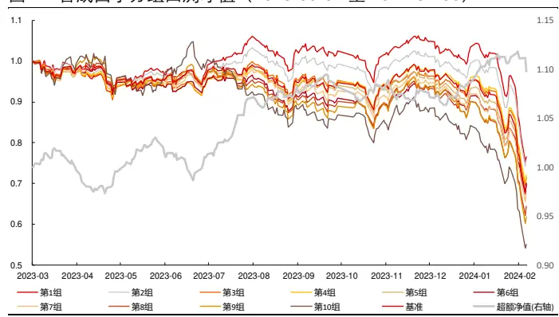
资料来源：Wind，长江证券研究所

图 2：深度学习因子分组回测净值（2023-03-01 至 2024-02-06）
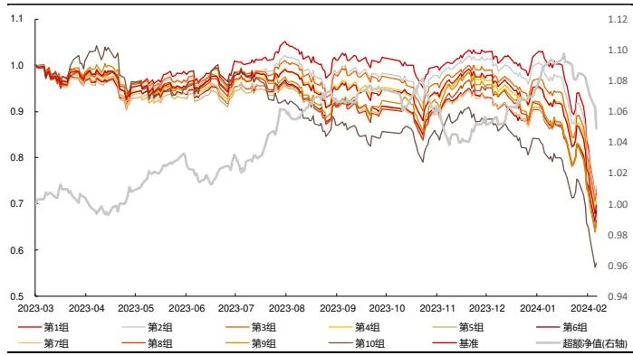
资料来源：Wind，长江证券研究所

具体从数值上看，下表展示了两个因子各个时间段的风险指标，为了使得不同时间长度的风险指标可比，对收益和风险收益比做年化处理：

不论是高频因子还是深度学习因子，近期获取多空收益的能力在逐步增加，但是获取超额收益的能力在逐步下降；

深度学习因子获取超额收益的能力下降更为明显，其尾部风险也出现在近一个月的时间段。

表 3：合成因子和深度学习因子分组风险指标

|  | 时间段 | 超额收益 | 超额最大回撤 | 信息比 | 多空收益 | 多空最大回撤 | 多空夏普比 |
| --- | --- | --- | --- | --- | --- | --- | --- |
| 合成 | 2023年3月以来 | 9.33% | 4.56% | 1.50 | 44.20% | 13.37% | 2.38 |
|  | 近三个月 | 0.97% | 2.90% | 0.03 | 76.23% | 4.89% | 3.71 |
|  | 近一个月 | -0.13% | 2.90% | -0.95 | 241.87% | 1.71% | 7.28 |
| 深度学习 | 2023年3月以来 | 5.37% | 4.40% | 1.01 | 30.63% | 7.03% | 2.29 |
|  | 近三个月 | -4.88% | 4.40% | -0.66 | 37.98% | 4.80% | 3.10 |
|  | 近一个月 | -17.42% | 4.40% | -4.60 | 70.05% | 1.50% | 5.41 |

资料来源：天软科技，Wind，长江证券研究所

深度学习因子和合成因子在近一年的表现有一定分化，两者有何异同？又是什么导致了两者之间产生了这种差异？

## 收益层面

因子收益直接表征了收益来源，本文以因子分组回测的第 1组相对等权基准的超额收益作为因子收益。从上文中可知，从因子值上看，深度学习因子和高频因子、合成因子和规模因子的相关性均较低，但从因子收益上看：

深度学习因子和特定高频因子的相关性提升到了 50%以上，和合成因子相关性提升到了 59.90%；

深度学习和合成因子与规模因子收益相关性也超过 30%。

即因子值（暴露）无法完全对应收益来源，高因子暴露相关性一般意味着因子的收益来源较为相似，但在量价中会存在局部偏差。（该结论的具体讨论见《高频因子（十四）：交易行情高频因子收益来源》）。

表 4：因子收益相关系数

|  | 波峰 | 波动 | 非流动性 | 量价相关性加权偏度 短期反转 |  |  | 短期动量 空头意愿 |  | 深度学习 | 合成 | 规模 |
| --- | --- | --- | --- | --- | --- | --- | --- | --- | --- | --- | --- |
| 波峰 | 100.00% | -5.71% -7.85% |  | 40.01% 30.94% |  | 37.20% | 14.51% 15.44% |  | 3.06% | 17.12% | -34.18% |
| 波动 | -5.71% | 100.00% | 45.88% | 39.70% 39.36% |  | -11.18% | -52.54% | 63.92% | 55.23% | 73.64% | 17.23% |
| 非流动性 | -7.85% | 45.88% | 100.00% | 29.68% 34.40% |  | 4.12% | -33.61% | 15.78% | 47.62% | 67.83% | 80.12% |
| 量价相关性 | 40.01% | 39.70% | 29.68% | 100.00% | 71.70% | 30.64% | -41.52% | 41.76% | 42.44% | 59.01% | -1.17% |
| 加权偏度 | 30.94% | 39.36% | 34.40% | 71.70% | 100.00% | 35.00% | -27.57% | 27.73% | 35.90% | 57.61% | 2.41% |
| 短期反转 | 37.20% | -11.18% | 4.12% | 30.64% 35.00% |  | 100.00% | 29.75% | -24.72% | -13.99% | 19.20% | -13.54% |
| 短期动量 | 14.51% | -52.54% | -33.61% | -41.52% | -27.57% | 29.75% | 100.00% | -61.18% | -52.17% | -49.70% | -23.68% |
| 空头意愿 | 15.44% | 63.92% | 15.78% | 41.76% 27.73% |  | -24.72% | -61.18% | 100.00% | 53.05% | 66.96% | -5.77% |
| 深度学习 3.06% |  | 55.23% | 47.62% | 42.44% 35.90% |  | -13.99% | -52.17% | 53.05% | 100.00% | 59.90% | 34.50% |
| 合成 | 17.12% | 73.64% | 67.83% | 59.01% 57.61% |  | 19.20% | -49.70% | 66.96% | 59.90% | 100.00% | 33.78% |
| 规模 | -34.18% | 17.23% | 80.12% | -1.17% 2.41% |  | -13.54% | -23.68% | -5.77% | 34.50% 33.78% |  | 100.00% |

资料来源：天软科技，Wind，长江证券研究所

合成因子由高频因子线性合成得到，所以其收益来源均来自高频因子，而也存在和深度学习因子收益相关性较高的高频因子，所以为了得到深度学习中的收益来源分布情况，需要对因子收益构成的因子体系做进一步的分析。

首先下图展示了高频因子、高频因子和深度学习因子、高频因子和合成因子三个因子体系的主成分分析结果：

从各个因子体系的解释度上看，在高频因子体系中加入了合成因子后，第一成分的解释度有较大提升，说明该因子为该体系已有风险；在深度学习因子加入合成因子后，第一成分的解释度有一定提升（未下降），说明该因子的主要收益来源属于该体系；

从主成分分析第一转移系数上看，加入深度学习和合成因子前后，高频因子体系的第一成分转移系数未发生明显变化，且深度学习和合成因子均和高频因子体系第一成分的主要方向相同，说明两个因子均可以代表因子体系的最主要风险，或反过来说该因子体系是两个因子的主要收益来源（即系统性风险，具体讨论见《高频因子（十四）：交易行情高频因子收益来源》）。

图 3：因子体系解释度
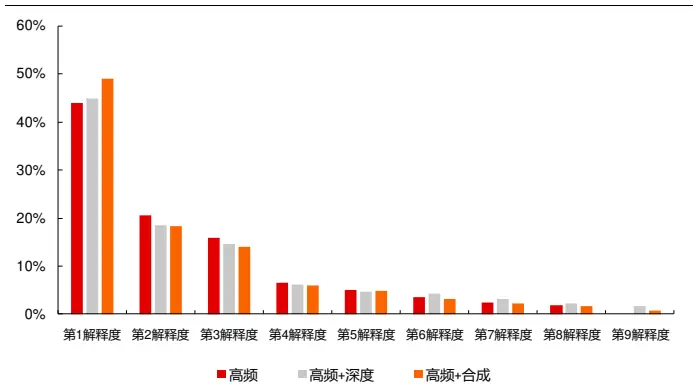
资料来源：天软科技，Wind，长江证券研究所

图 4：主成分第一成分转移系数
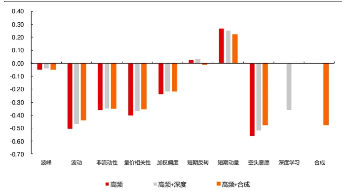
资料来源：天软科技，Wind，长江证券研究所

下图展示不同方式合成的因子收益和深度学习因子、合成因子的收益净值：

全高频因子为所有因子收益的平均，可以作为高频因子系统性风险的代表（具体讨论见《高频因子（十四）：交易行情高频因子收益来源》）；

第一成分高频因子为高频因子体系中第一成分影响较大的因子收益的平均，即波动、非流动性、量价相关性、加权偏度和空头意愿，代表第一成分的表现。

从趋势上看，四种因子收益净值趋势相近，也侧面佐证了该因子体系是两个因子的主要收益来源。

图 5：各因子收益净值
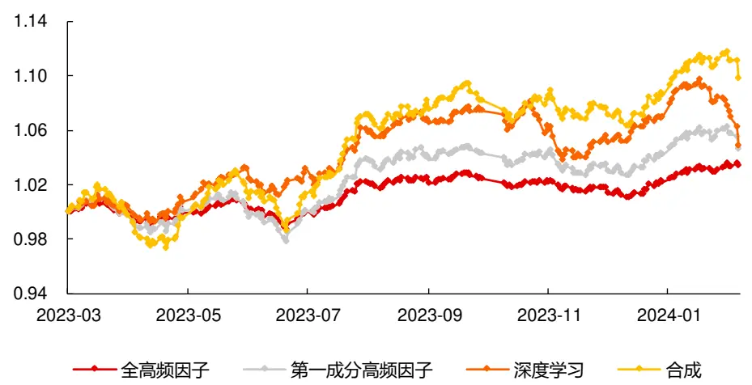
资料来源：天软科技，Wind，长江证券研究所

但是从收益相关性上看，深度学习因子和其他三个因子收益相关性不超过 70%，故深度学习因子中有高频因子体系中不包含的收益来源。而深度学习因子和第一成分高频因子收益相关性最高，结合前文中因子收益相关系数和主成分第一成分转移系数，深度学习因子和波峰、短期反转和短期动量的差异较大，即高频因子中也有深度学习因子不包含的收益来源，深度学习中包含的因子体系中收益来源主要为第一成分构成的收益来源。

表 5：各因子收益日度相关性

| 全高频因子 第一成分高频因子 深度学习 |  |  |  |
| --- | --- | --- | --- |
| 全高频因子 | 100.00% | 91.03% | 52.55% |
|  | 91.03% | 100.00% | 87.26% 90.63% |
| 第一成分高频因子 |  | 66.02% 100.00% |  |
| 深度学习 | 52.55% | 66.02% | 59.90% |
| 合成 | 87.26% | 90.63% | 59.90% 100.00% |

资料来源：天软科技，Wind，长江证券研究所

## 风险层面

首先下图给出了深度学习因子和合成因子的回撤区间，2023-03-01 至 2024-02-06 的时间段内，两个因子均发生了五次小级别（1.5%）以上的回撤，且回撤时间段相近。

图 6：深度学习因子回撤区间
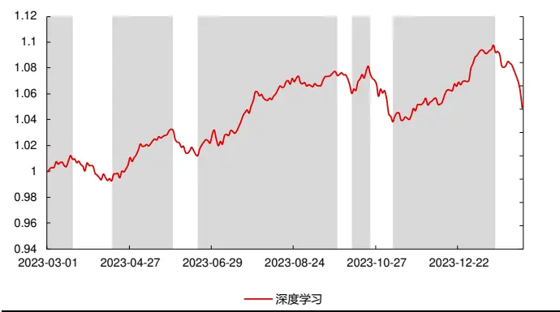
资料来源：天软科技，Wind，长江证券研究所

图 7：合成因子回撤区间
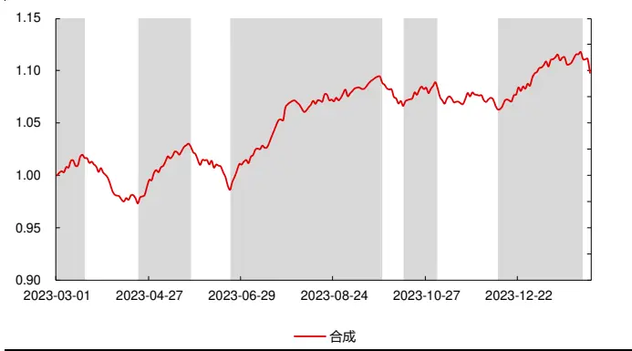
资料来源：天软科技，Wind，长江证券研究所

对因子体系的 8 个因子做相同处理得到各个因子的回撤区间，下表给出了因子回撤的重合区间长度和重合度，其中：

深度学习因子和合成因子与其他因子的重合度为：两者之间的重合长度/深度学习因子和合成因子的回撤区间长度；

考虑到当因子自身回撤区间较长时，和其他因子的重合区间长度天然较长，则计算出的重合度也会较高，故在重合度的基础上做了调整得到调整重合度：该因子的回撤长度/总区间长度×因子重合度。

## 从重合度的结果上看：

不论是重合度还是调整重合度，合成因子和高频因子的重合度水平均显著高于深度学习因子和高频因子的重合度，这也从风险端佐证了合成因子收益来源为因子体系，而深度学习有因子体系外的收益来源；

综合重合度和调整重合度，波动、非流动性、量价相关性、加权偏度和空头意愿因子是影响深度学习因子回撤的重要因素，这也是前文主成分分析中得到的因子体系第一成分的其中四个因子，而除波峰和短期动量外，合成因子和其他高频因子的重合度均较高，这也佐证了整个因子体系均为合成因子的收益来源，但只有因子体系的第一成分为深度学习因子的收益来源。

表 6：因子回撤重合度
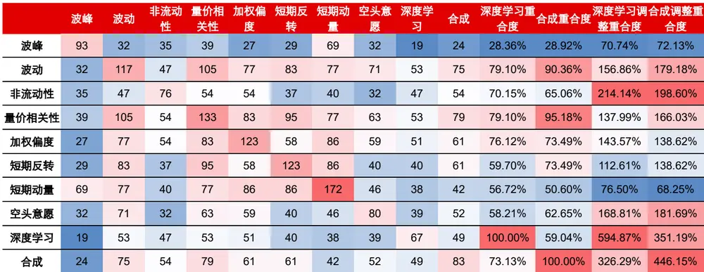
资料来源：天软科技，Wind，长江证券研究所

## 因子近期回撤的原因

下表给出了各个因子在不同时间段的收益和回撤情况：

在近三个月和近一个月，深度学习因子超额收益均回撤，因子体系中收益来源对应的五个因子中非流动性因子有明显回撤，波动、空头意愿因子有衰减，是造成两个因子回撤的原因；

合成因子在近一个月和近三个月的超额收益均高于深度学习因子，说明因子体系外的收益来源也是深度学习因子近期回撤的原因之一。

表 7：各因子近期表现
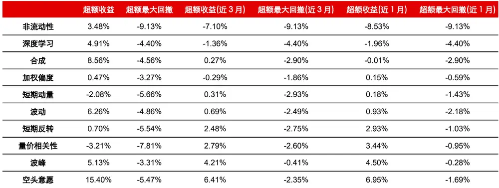
资料来源：天软科技，Wind，长江证券研究所

深度学习因子无法估计各个收益来源的贡献度，但合成因子则可以通过因子合成权重来估计各个收益来源的贡献，下图给出了 2023-02-28 至 2024-01-31 以来，月度因子体系对合成因子的贡献度（即线性合成权重）：

波峰和空头意愿因子的占比逐步提升，加权偏度和短期反转因子的占比逐步下降，其他因子的占比较为稳定；

2023-12-29 和 2024-01-31，占比较高的因子分别为波峰、波动、非流动性和空头意愿，大致各占 20%的比例，非流动性在因子贡献度上所占比例不高。

图 8：因子体系对合成因子的贡献度
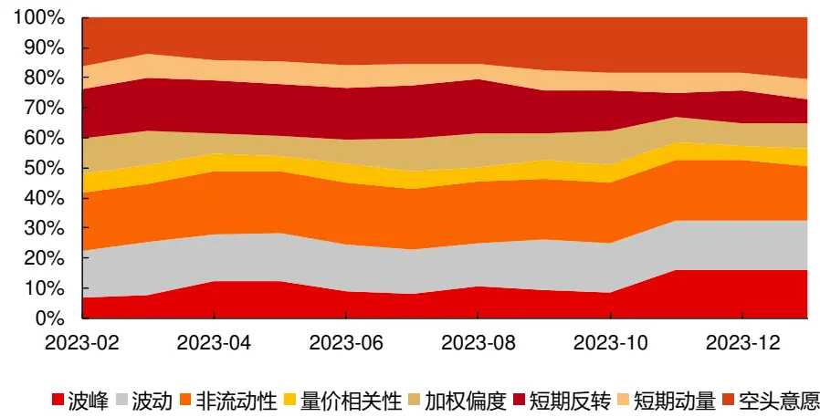
资料来源：天软科技，Wind，长江证券研究所

合成因子的表现和各个因子在合成因子上的线性贡献度并不匹配，则可能是特定因子（在当前情境下即为非流动性因子）的尾端分布较为极端，导致头部信息表达增加，从而在构建头部组合时实际拥有更高的贡献度。下表给出了 2023-12-29 这个截面上各个因子的头部因子分位数阈值，以及各个因子第 1 组个股和合成因子、深度学习一逆转第1 组个股的重合度：

从因子的头部阈值上看，非流动性因子的尾端分布并不极端，不会因该因子的值增加对头部信息的表达；

从组合重合度上看，非流动性因子的第 1 组个股有 46.09%的个股出现在了合成因子的第 1 组中，即实际上非流动性这一收益来源在头部信息的表达较高，这也是合成因子在近期产生回撤的原因。

深度学习因子第 1 组个股和因子体系的因子第 1 组个股重合度均不高，同样佐证了因子体系因子不是深度学习因子回撤的主要原因。

表 8：非流动性因子的头部影响

| 合成因子第1组个股重合度 深度学习因子第1组个股重合度 90%分位数 |  |  | 95%分位数 | 97%分位数 |
| --- | --- | --- | --- | --- |
| 波峰 | 19.66% 14.38% | 0.94 | 1.20 | 1.33 |
| 波动 | 24.95% 16.91% | 0.93 | 1.05 | 1.11 |
| 非流动性 | 46.09% 11.63% | 1.02 | 1.56 | 1.82 |
| 量价相关性 | 28.54% 9.09% | 1.28 | 1.67 | 1.90 |
| 加权偏度 | 25.37% 17.34% | 1.00 | 1.22 | 1.42 |
| 短期反转 | 21.14% 10.99% | 1.13 | 1.40 | 1.63 |
| 短期动量 | 11.84% 8.25% | 1.17 | 1.51 | 1.77 |
| 空头意愿 | 31.50% 9.09% | 1.26 | 1.66 | 1.96 |

资料来源：天软科技，Wind，长江证券研究所

所以在因子间存在一些彼此交叉的线性信息，而该信息又集中在非流动性收益来源的表达上。而对于深度学习因子，对其近期回撤影响最大的为因子体系以外的收益来源，下图给出了残差深度学习因子（即深度学习因子对因子体系的因子统一做线性回归得到的残差）的表现，不论从超额收益还是多空收益上看，深度学习因子均在近一个月有一定回撤。

图 9：残差深度学习因子净值
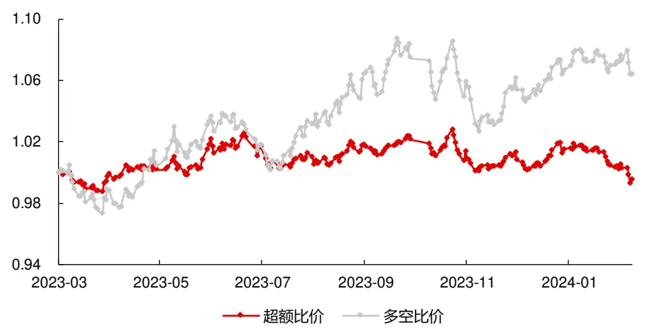
资料来源：天软科技，Wind，长江证券研究所

表 9：残差深度学习因子风险指标

| 超额收益 超额最大回撤 信息比 |  |  |  | 多空收益 多空最大回撤 多空夏普比 |  |  |
| --- | --- | --- | --- | --- | --- | --- |
| 近一年 | -0.45% | -3.35% | -0.12 | 6.41% | -5.55% | 0.88 |
| 近三个月 | -1.80% | -2.53% | -1.77 | 0.49% | -2.80% | 0.27 |
| 近一个月 | -1.92% | -2.51% | -5.24 | -0.21% | -1.45% | -0.34 |

资料来源：天软科技，Wind，长江证券研究所

## 各板块因子表现

下表中给出了各个因子在不同板块上的表现。

表 10：各板块因子近期表现
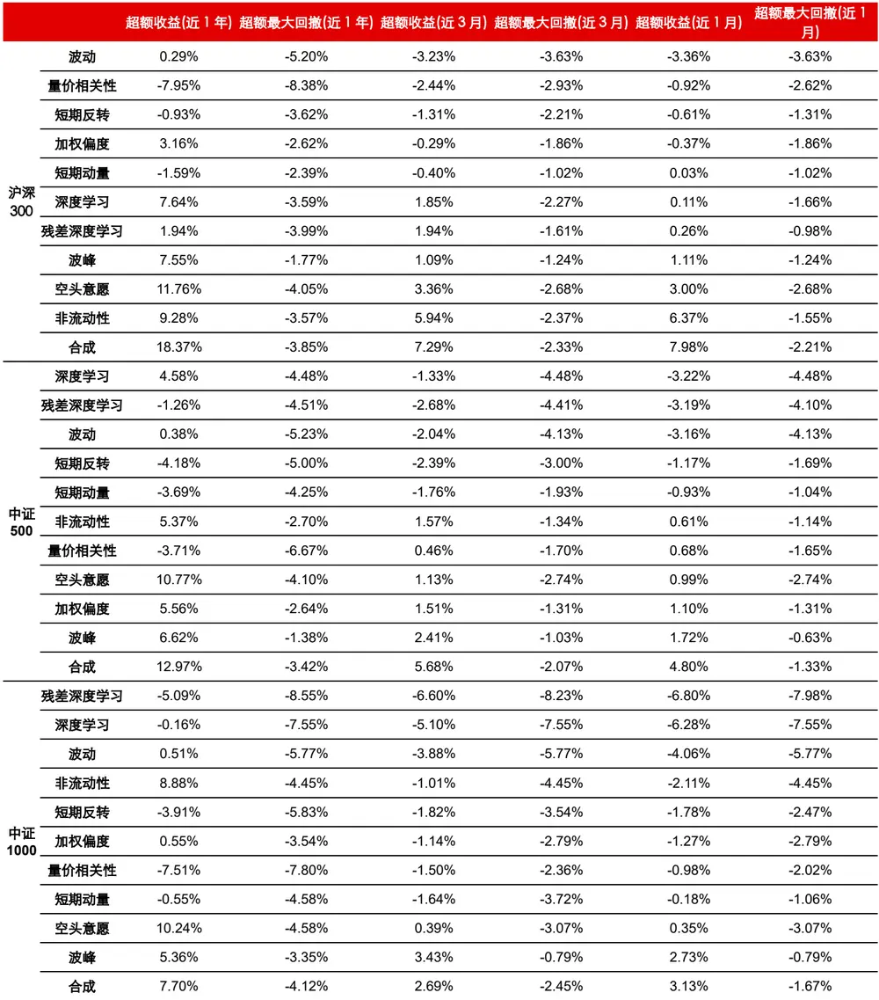
资料来源：天软科技，Wind，长江证券研究所

因为合成因子是通过对因子体系的因子做线性合成得到，则因子合成方式也会对信息表达有影响。在本文开头介绍了以因子动量的合成方式，前文中展示的合成因子为根据全市场的因子动量合成，但不同板块的因子动量不同，合成的因子也会有不同（深度学习因子同样有不同板块训练得到的因子不同的问题，但考虑到限定板块后学习样本量会显著减少，本文不针对深度学习这一情况做进一步探索）。上表中合成因子用板块对应的因子动量：

近一个月的时间窗口下，合成因子在各个板块内选股效果均最优，深度学习因子则仅在沪深 300 内有正超额收益；

因子体系的因子中，中证 1000范围内仅有空头意愿和波峰两个因子有正超额收益，但合成因子的超额收益相对显著，其原因和全市场范围内非流动性因子信息的集中表达相似，中证 1000 范围内空头意愿因子的信息集中表达，其第 1 组个股有42%的个股出现在了合成因子的第 1 组中。

在各个板块中（包括全市场，具体数据可见前文），近 1 年深度学习和残差深度学习因子的表现差异较大，但近 1 个月两者表现则较为接近，同样佐证了近期导致深度学习因子回撤的主要原因为因子体系外的收益来源，且近期因子体系在深度学习因子上的影响在降低。

## 小结

高频因子体系是合成因子的全部收益来源，是深度学习因子的主要收益来源。

深度学习因子包含高频因子体系不具备的收益来源，高频因子体系也包含深度学习因子不具备的收益来源，具体来说即为波峰、短期动量和短期反转。

非流动性、波动和空头意愿因子的衰减一定程度上影响了了合成因子和深度学习因子的近期表现，其中非流动性是因子体系中主要回撤的收益来源，也是导致高频因子回撤的主要原因；高频因子体系外的收益来源是导致深度学习因子相对合成因子回撤更大的主要原因。

非流动性因子在合成因子中的信息表达占比较低，但在近期实际构建组合中的影响较大，因子体系内的因子间存在一些彼此交叉的线性信息，而该信息又集中在非流动性收益来源的表达上。

近期因子体系对深度学习因子的影响在降低。

## 量价增强策略收益来源

## 各板块增强策略表现

通过因子在不同板块构建增强策略，组合间的差异主要为信息表达的差异：

在因子合成上这种差异为不同板块的因子动量，针对这一点在各板块因子表现上已给出介绍；

在组合构建上，不同板块的差异主要为信息的表达范围，因为市场上的指数增强策略往往为全市场选股，但限制成份内个股权重不低于 80%，所以板块内个股所占权重和信息表达范围都会影响最终策略表现。

本文以合成因子和深度学习因子为最终 alpha 表达，共给出了三种增强策略的展示：

以成份内的因子动量得到的合成因子，限定板块成分股占比 100%的增强策略，且合成因子通过成分内的动量得到，记为“成份内增强”，该策略主要衡量在成份内获得超额收益的能力。

限定板块成分股占比不低于 80%的增强策略，且合成因子通过全市场的动量得到，记为“增强”，该策略主要衡量在全市场获得超额收益的能力；

“增强”策略的成分股，记为“控制增强”，作为对比策略，其和“增强”策略的差别为成份内外获得超额收益能力的差距，其和“控制增强”与“成分内增强”策略的差别为不同信息表达范围获得超额收益能力的差距。

本文组合优化设置如下：风格中规模和价值在 0.15 以内，盈利在 0.2 以内，成长在 0.3以内，行业偏离在 1.5%以内，个股偏离在 1%以内，以最大化组合合成因子为目标。下表展示了不同成分下不同增强策略的表现：

以“增强”策略为标准，两个因子对比上，近一年深度学习在中证 500 和中证 1000内有更强的收益能力，近期（近三个月和近一个月）则遭遇了更大的回撤；合成因子在沪深 300 内有更强的收益能力；板块对比上，主要回撤的板块为中证 1000，所有中证 1000 增强策略均有回撤；这些现象和市场上存在的增强策略表现的实际情况相近。

整体上“增强”和“控制增强”策略表现相近，强于成分内增强，说明全市场表达信息比成飞内表达信息更好。

近一年“增强”和“控制增强”策略表现较为相近，即成分内外获得超额收益的能力无显著差别，但近一个月合成因子和深度学习因子在所有板块上均为“控制增强”表现优于“增强”，说明成分外选股能力的衰减是导致近期增强策略回撤的原因之

表 11：各增强策略近期超额收益

| 合成因子 |  |  |  |  | 深度学习因子 |  |  |
| --- | --- | --- | --- | --- | --- | --- | --- |
|  |  | 近一年 | 近三个月 | 近一个月 | 近一年 | 近三个月 | 近一个月 |
| 沪深300 | 成分内增强 | 7.99% | 4.06% | 2.87% | 4.58% | 0.72% | -0.64% |
|  | 增强 | 12.29% | 4.34% | 1.82% | 8.34% | 2.05% | 0.43% |
|  | 控制增强 | 13.24% | 5.38% | 3.12% | 8.83% | 2.89% | 0.89% |
| 中证500 | 成分内增强 | 5.43% | 1.29% | 1.20% | 4.47% | 2.22% | 1.53% |
|  | 增强 | 5.71% | 0.39% | -0.10% | 6.58% | 0.32% | -0.87% |
|  | 控制增强 | 7.96% | 3.60% | 3.42% | 9.01% | 3.90% | 3.02% |
| 中证1000 | 成分内增强 | 3.53% | -0.66% | -1.19% | 2.58% | -1.73% | -2.86% |
|  | 增强 | 1.07% | -1.14% | -2.40% | 4.41% | -3.09% | -3.97% |
|  | 控制增强 | 0.59% | 0.18% | -0.34% | 5.53% | -1.83% | -2.68% |

资料来源：天软科技，Wind，长江证券研究所

## 收益归因

为进一步分析策略在各个收益来源上获得收益的情况，本节以近一个月的时间段为例（即从 2023-12-29 开始），对策略做因子体系的因子、残差深度学习因子和规模因子的收益归因，下表展示了 2023-12-29 日各个策略的因子暴露（相对基准）情况：

对比合成因子和深度学习因子的增强策略，合成因子增强策略在深度学习因子不具有的收益来源上有更高的暴露，即波峰、短期反转和短期动量，深度学习因子则在残差深度学习这一特有收益来源上有更高的暴露；此外合成因子策略在除波动外的深度学习因子也具有的因子体系收益来源上也具有更高的暴露，即波峰、量价相关性、加权偏度和空头就意愿；所以近期合成因子和深度学习因子增强策略的主要差异即为因子体系收益来源和深度学习特有收益来源的差异。

各个策略均在规模上有较满的负向暴露（除“控制增强”策略外，因为该策略本身就是全市场选股的成分内持股情况），即会选择更偏小市值的个股。

表 12：增强策略因子暴露

| 波峰沪深300 |  |  | 波动 非流动性 |  | 量价相关性 | 加权偏度短期反转短期动量 空头意愿 残差深度学习规模 |  |  |  |  |  |  |  |  |
| --- | --- | --- | --- | --- | --- | --- | --- | --- | --- | --- | --- | --- | --- | --- |
|  |  |  | 成分内增强 成学因子 |  | 0.66 | 0.10 | 0.01 | 0.22 | 0.38 | 0.50 | 0.33 | 0.75 | -0.07 | -0.13 |
|  |  |  |  |  | 0.10 | -0.08 | -0.06 | 0.17 | 0.39 | 0.18 | -0.02 | 0.33 | 0.70 | -0.15 |
|  |  |  | 增强成学习子 |  | 0.66 | 0.09 | 0.18 | 0.34 | 0.42 | 0.58 | 0.14 | 0.96 | -0.05 | -0.16 |
|  |  |  |  |  | 0.21 | -0.14 | -0.05 | 0.23 | 0.44 | 0.11 | -0.03 | 0.30 | 0.86 | -0.16 |
|  |  |  | 控制增强成学习子 |  | 0.55 | 0.10 | 0.10 | 0.24 | 0.31 | 0.50 | 0.17 | 0.84 | 0.02 | 0.12 |
|  |  |  |  |  | 0.04 | -0.11 | 0.04 | 0.29 | 0.47 | 0.14 | -0.02 | 0.26 | 0.77 | 0.05 |
| 中证500 | 合成因子成分内增强 | 0.71 | 0.24 | 0.35 | 0.70 | 0.60 | 0.45 | 0.17 | 0.53 | -0.29 | -0.14 |  |  |  |
|  |  | 深度学习因子 | 0.25 | 0.08 | 0.01 | 0.03 | 0.26 | 0.14 | -0.04 | 0.24 | 0.97 | -0.08 |  |  |
|  | 合成因子增强 | 0.60 | 0.28 | 0.55 | 0.74 | 0.67 | 0.68 | 0.26 | 0.85 | -0.27 | -0.16 |  |  |  |
|  |  | 深度学习因子 | 0.23 | 0.16 | 0.08 | 0.09 | 0.35 | 0.12 | -0.06 | 0.23 | 1.08 | -0.16 |  |  |
|  | 控制增强深度学习因子 | 合成因子 | 0.62 | 0.29 | 0.31 | 0.69 | 0.59 | 0.62 | 0.29 | 0.71 | -0.23 | -0.06 |  |  |
|  |  | 0.24 | 0.07 | 0.04 | 0.03 | 0.30 | 0.06 | -0.09 | 0.18 | 1.05 | -0.02 |  |  |  |
| 中证1000 | 合成因子成分内增强 | 0.44 | 0.42 | 0.75 | 0.83 | 0.68 | 0.66 | 0.49 | 0.81 | -0.12 | -0.16 |  |  |  |
|  |  | 深度学习因子 | 0.32 | 0.31 | 0.08 | -0.06 | 0.33 | 0.15 | 0.02 | 0.16 | 1.08 | -0.16 |  |  |
|  | 合成因子增强深度学习因子0.34 |  | 0.43 | 0.37 | 0.88 | 0.90 | 0.73 | 0.76 | 0.40 | 1.20 | -0.11 | -0.16 |  |  |
|  |  |  | 0.32 | 0.08 | 0.02 | 0.39 | 0.13 | 0.08 | 0.24 | 1.23 | -0.16 |  |  |  |
|  | 合成因子 0.41控制增强深度学习因子 |  | 0.37 0.66 |  | 0.89 | 0.70 | 0.77 | 0.55 | 1.07 | -0.09 | -0.20 |  |  |  |
|  |  |  | 0.38 | 0.27 | 0.02 | -0.09 | 0.32 | 0.09 | 0.08 | 0.18 | 1.15 | -0.15 |  |  |

资料来源：天软科技，Wind，长江证券研究所

从实际实现的收益情况来看，下表给出了各个增强策略的在收益来源上的收益线性归因情况，并计算了未被解释的残差：

## 规模因子是所有增强策略产生回撤的重要原因；

合成因子增强策略相对深度学习因子增强策略的超额收益主要集中在波峰和空头意愿两个收益来源上；

残差深度学习因子是深度学习因子增强策略相对合成因子策略有负向超额的原因之一；

非流动性和量价相关性在增强策略上的贡献有限，其余因子体系的因子均在增强策略上有一定贡献，且在合成因子策略上的贡献更大。

表 13：增强策略收益归因

| 非流动性 量价相关性 加权偏度 短期反转 短期动量 |  |  |  |  |  |  |  |  |  |  |  |  |  |
| --- | --- | --- | --- | --- | --- | --- | --- | --- | --- | --- | --- | --- | --- |
|  | 成分内 | 合成因子 | 波峰 0.98% | 波动 0.13% | 0.00% | 0.00% | 0.24% | 0.23% | 0.27% | 空头意愿残差深度学习 1.33% | 0.01% | 规模 -1.35% | 超额收益 残差 2.41% 0.56% |
| 沪深 300 | 增强 | 深度学习因子0.14% |  | -0.11% | 0.01% | 0.00% | 0.25% | 0.08% | -0.02% | 0.58% -0.08% | -1.56% |  | -0.61%0.09% |
|  |  | 合成因子 | 0.99% | 0.12% | -0.02% | 0.01% | 0.27% | 0.27% | 0.11% | 1.70% | 0.01% | -1.66% | 1.64% 6-0.15% |
|  | 增强 | 深度学习因子 | 0.31% | -0.19% | 0.01% | 0.00% | 0.28% | 0.05% | -0.02% | 0.54% | -0.10% | -1.65% 0.90% | 1.68% |
|  |  | 控制增 合成因子 | 0.82% | 0.14% | -0.01% | 0.00% | 0.20% | 0.23% | 0.14% | 1.49% | 0.00% | 1.22% | 3.12%-1.11% |
|  | 强 | 深度学习因子0.06% |  | -0.15% | 0.00% | 0.01% | 0.30% | 0.06% | -0.01% 0.45% | -0.09% | 0.53% | 0.89%-0.27% |  |
|  | 成分内 增强 | 合成因子 | 1.06% | 0.33% | -0.04% | 0.01% | 0.39% | 0.21% | 0.14% | 0.94% | 0.03% |  |  |
|  |  | 深度学习因子 | 0.37% | 0.10% | 0.00% | 0.00% | 0.17% | 0.07% | -0.03% | 0.42% | -0.11% | -1.51% | 2.51% 0.95% |
|  | 中证 增强 500 | 合成因子 | 0.90% | 0.38% | -0.07% | 0.01% | 0.43% | 0.31% | 0.21% | 1.51% | 0.03% | -0.89% -1.70% | 1.92% 1.82% 0.08% -1.95% |
| 深度学习因子 |  | 0.35% | 0.22% | -0.01% | 0.00% | 0.23% | 0.05% | -0.05% | 0.40% | -0.12% | -1.71% | -0.85%-0.20% |  |
|  | 控制增 | 合成因子 | 0.93% | 0.40% -0.04% | 0.01% | 0.38% | 0.28% | 0.24% | 1.25% | 0.03% | -0.68% | 3.42% 0.62% |  |
|  | 强 | 深度学习因子 0.36% | 0.10% | 0.00% | 0.00% | 0.19% | 0.03% | -0.07% | 0.32% | -0.12% | -0.16% | 3.02% 2.38% |  |
| 中证 1000 | 成分内 增强 | 合成因子 | 0.65% 0.58% | -0.09% | 0.02% | 0.44% | 0.30% | 0.40% | 1.43% | 0.01% | -1.70% | 0.60%-1.44% |  |
|  |  | 深度学习因子 | 0.48%0.43% |  | -0.01% 0.00% | 0.21% | 0.07% | 0.01% | 0.28% | -0.12% | -1.70% | -1.47%-1.11% |  |
|  | 增强 | 合成因子 | 0.64% | 0.50% -0.11% | 0.02% | 0.47% | 0.35% | 0.33% | 2.12% | 0.01% | -1.71% | -1.60%-4.22% |  |
|  |  | 深度学习因子 | 0.51% | 0.44% -0.01% | 0.00% | 0.25% | 0.06% | 0.07% | 0.42% | -0.14% | -1.71% | -3.24%-3.13% |  |
|  | 控制增 强 | 合成因子 | 0.61% 0.51% | -0.08% | 0.02% | 0.46% | 0.36% | 0.45% | 1.90% | 0.01% | -2.11% | -0.34%-2.46% |  |
|  |  | 深度学习因子 | 0.57% 0.37% | 0.00% | 0.00% | 0.21% | 0.04% | 0.07% | 0.32% | -0.13% | -1.58% | -2.68%-2.53% |  |

资料来源：天软科技，Wind，长江证券研究所

策略收益归因的残差项仍较大，除了时间区间较短、上述收益来源并未完全解释策略收益的原因外，还存在因子收益估计存在误差的情况，下图展示了 3 种估计因子收益的结果：

超额收益即为对因子做分组回测，第 1 组相对等权基准的收益情况；

多空收益即为对因子做分组回测。前 50%个股相对后50%个股的收益情况；

因子收益即通过因子暴露和未来个股收益做线性回归得到的斜率项，也是前文中收益归因所用的因子收益。

## 所以从图中展示的结果上看：

非流动性因子在分组估计的因子收益和回归估计的因子收益上有较大差别，虽然两个因子彼此正交，但收益相似度仍较高，从前文中统计的近一年因子收益相关性上看（超额收益的相关性，下同），两个因子收益相关性为 80.12%，而在收益归因的近一个月的时间段上，两个因子收益相关性为 93.24%，所以在回归估计因子收益时非流动性因子的部分收益被规模因子替代，但在分组估计时因为没有规模因子的影响，非流动性因子的水平较高，该原因也是在上文收益归因时非流动性因子对策略贡献较小的原因；

对比超额收益和多空收益，波峰因子的超额收益更强，即波峰对策略的实际正向贡献可能要比收益归因展示的结果更大；非流动性、量价相关性、加权偏度、短期反转和短期动量的超额收益较弱，即这些因子对策略的实际正向贡献可能要比收益归因展示的结果更小。

对比分组估计的因子收益和回归估计的因子收益，量价相关性、短期动量、短期反转和残差深度学习因子的因子收益量纲小于超额收益和多空收益，即这些因子对策略的贡献度可能要比收益归因展示的结果更大。

图 10：不同方法估计的因子收益
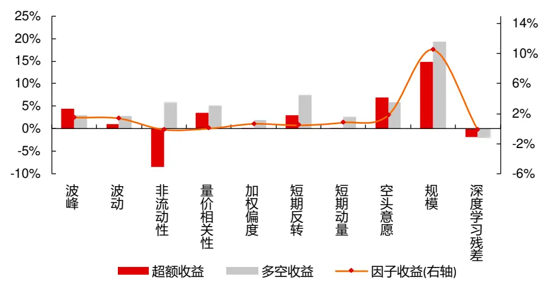
资料来源：天软科技，Wind，长江证券研究所

## 小结

过去一年，深度学习策略在中证 500和中证 1000上的表现更好，合成因子策略在沪深300 上表现更好；近期增强类策略的主要回撤集中在中证 1000 上，且所有板块上深度学习策略的衰减幅度更大。

策略构建层面，合成因子和深度学习因子的情况相似，在全市场范围内表达信息的增强策略近 1 年表现更好，且期间内各板块成分内和成份外获得超额收益的能力相近，但是近 1 个月板块成份外获取超额收益的能力显著降低，这也是增强策略表现下降的原因之一，使得信息表达范围的合理性上也受到影响，成分内表达信息的方式在局部占优。

规模因子回撤是近期增强策略表现下降的主要原因。

对比合成因子和深度学习因子两种增强策略，近期两者的主要差异为因子体系收益来源和深度学习特有收益来源的差异：

合成因子的超额收益集中在波峰和空头意愿两个收益来源上；除非流动性和量价相关性，因子体系的因子均在增强策略上有一定贡献，且在合成因子策略上的贡献更大；

残差深度学习因子是深度学习因子策略相对合成因子策略有负向超额的原因之一。

## 总结

深度学习因子的主要收益来源来自高频因子体系。在本文构建的高频因子体系中，波动、非流动性、量价相关性、加权偏度、空头意愿为深度学习包含的收益来源，波峰、短期反转、短期反转为深度学习因子不包含的收益来源。

因子体系外的深度学习因子的收益来源是近期其回撤的主要原因，因子体系内因子的局部衰减是高频合成因子近期衰减的主要原因：

非流动性、波动和空头意愿因子近期的衰减一定程度上影响了了高频合成因子和深度学习因子的近期表现，其中非流动性是因子体系中主要回撤的收益来源，也是导致高频合成因子回撤的主要原因。

残差深度学习因子是过去深度学习因子相对高频因子体系有超额的收益来源，叠加近期因子体系在深度学习因子上的影响降低，使得其是成为近期深度学习因子回撤的主要原因。

过去一年深度学习策略表现更好，而近期表现衰减更大。过去一年，深度学习策略在中证 500 和中证 1000 上的表现更好，合成因子策略在沪深 300 上表现更好；近期增强类策略的主要回撤集中在中证 1000 上，且所有板块上深度学习策略的衰减幅度更大。

增强策略回撤主要受收益来源衰减和组合偏离两方面影响：

近 1 年在全市场范围内表达信息的增强策略表现更好，且期间内各板块成分内和成份外获得超额收益的能力相近，但近 1 个月板块成份外获取超额收益的能力显著降低，导致增强策略在板块外的组合上遭受较大回撤。

近期规模因子收益下降显著，而各增强策略在放开规模暴露后，组合均会在规模风格上负暴露，遭受较大回撤。

高频合成因子增强策略和深度学习因子增强策略的近期表现的主要差异为因子体系收益来源和深度学习特有收益来源的差异，合成因子的超额收益集中在波峰和空头意愿两个收益来源上，且除非流动性和量价相关性，因子体系的因子均在增强策略上有一定贡献，且在合成因子策略上的贡献更大。残差深度学习因子在深度学习因子增强策略上的暴露显著更高，而其近期衰减较大，导致深度学习因子策略相对合成因子策略有更大回撤。

## 风险提示

1、模型存在失效风险：市场的宏观环境会随经济运行发生变化，投资者的交易行为也会因市场的发展、局部博弈发生变化，若市场的定价模式发生改变，或导致模型的失效。

2、本文举例均基于历史数据，不保证未来收益：量化模型均基于历史数据的回测，但样本外数据的分布和样本内或有较大变化，使预测收益和实际收益的对应关系产生波动。

## 投资评级说明

| 行业评级 | 报告发布日后的12个月内行业股票指数的涨跌幅相对同期相关证券市场代表性指数的涨跌幅为基准，投资建议的评 级标准为： |
| --- | --- |
|  | 看 好： 相对表现优于同期相关证券市场代表性指数 |
| 中 性： | 相对表现与同期相关证券市场代表性指数持平 |
|  | 看 淡： 相对表现弱于同期相关证券市场代表性指数 |
| 公司评级 | 报告发布日后的12个月内公司的涨跌幅相对同期相关证券市场代表性指数的涨跌幅为基准，投资建议的评级标准为： |
| 买 | 入： 相对同期相关证券市场代表性指数涨幅大于10% |
| 增 | 持： 相对同期相关证券市场代表性指数涨幅在5%～10%之间 |
| 中 性： | 相对同期相关证券市场代表性指数涨幅在-5%～5%之间 |
| 减持： | 相对同期相关证券市场代表性指数涨幅小于-5% |
|  | 无投资评级：由于我们无法获取必要的资料，或者公司面临无法预见结果的重大不确定性事件，或者其他原因，致使 |
| 我们无法给出明确的投资评级。 相关证券市场代表性指数说明：A股市场以沪深300指数为基准；新三板市场以三板成指（针对协议转让标的）或三板做市指数 |  |

## 办公地址

[Tabl上海
Add /浦东新区世纪大道 1198号世纪汇广场一座 29 层
P.C /（200122）
北京
Add /西城区金融街 33 号通泰大厦 15 层
P.C /（100032）
武汉
Add /武汉市江汉区淮海路 88号长江证券大厦 37 楼
P.C /（430015）
深圳
Add /深圳市福田区中心四路1号嘉里建设广场 3 期 36 楼
P.C /（518048）

## 分析师声明

作者具有中国证券业协会授予的证券投资咨询执业资格并注册为证券分析师，以勤勉的职业态度，独立、客观地出具本报告。分析逻辑基于作者的职业理解，本报告清晰准确地反映了作者的研究观点。作者所得报酬的任何部分不曾与，不与，也不将与本报告中的具体推荐意见或观点而有直接或间接联系，特此声明。

## 重要声明

长江证券股份有限公司具有证券投资咨询业务资格，经营证券业务许可证编号：10060000。

本报告仅限中国大陆地区发行，仅供长江证券股份有限公司（以下简称：本公司）的客户使用。本公司不会因接收人收到本报告而视其为客户。本报告的信息均来源于公开资料，本公司对这些信息的准确性和完整性不作任何保证，也不保证所包含信息和建议不发生任何变更。本公司已力求报告内容的客观、公正，但文中的观点、结论和建议仅供参考，不包含作者对证券价格涨跌或市场走势的确定性判断。报告中的信息或意见并不构成所述证券的买卖出价或征价，投资者据此做出的任何投资决策与本公司和作者无关。

本报告所载的资料、意见及推测仅反映本公司于发布本报告当日的判断，本报告所指的证券或投资标的的价格、价值及投资收入可升可跌，过往表现不应作为日后的表现依据；在不同时期，本公司可以发出其他与本报告所载信息不一致及有不同结论的报告；本报告所反映研究人员的不同观点、见解及分析方法，并不代表本公司或其他附属机构的立场；本公司不保证本报告所含信息保持在最新状态。同时，本公司对本报告所含信息可在不发出通知的情形下做出修改，投资者应当自行关注相应的更新或修改。

本公司及作者在自身所知情范围内，与本报告中所评价或推荐的证券不存在法律法规要求披露或采取限制、静默措施的利益冲突。

本报告版权仅为本公司所有，未经书面许可，任何机构和个人不得以任何形式翻版、复制和发布。如引用须注明出处为长江证券研究所，且不得对本报告进行有悖原意的引用、删节和修改。刊载或者转发本证券研究报告或者摘要的，应当注明本报告的发布人和发布日期，提示使用证券研究报告的风险。未经授权刊载或者转发本报告的，本公司将保留向其追究法律责任的权利。