## 高频因子（十六）：2024年有效因子

Changjiang Securities

长江证券研究所金融工程研究小组

## 分析师及联系人

分析师 郑起

分析师 覃川桃

SAC执业证书编号：S0490520060001

SAC执业证书编号：S0490513030001

SFC执业证书编号：BUT353

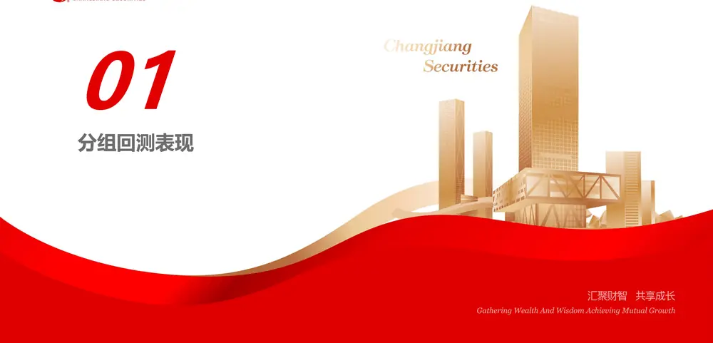

按照收益来源，对长期有效的选股因子做如下划分：

表：选股因子定义

| 大类 | 因子 | 计算方法 | 理论方向 |
| --- | --- | --- | --- |
| 波动 | 特异率 | 一减Fama-French三因子模型回归拟合优度 | -1 |
|  | 残差波动率 | Fama-French三因子模型回归残差波动率 | -1 |
|  | 换手率波动率 | 换手率标准差 | -1 |
|  | 换手率变异系数 | 换手率（标准差/平均值） | 1 |
|  | 残差峰度 | Fama-French三因子模型回归残差峰度 | -1 |
| 空头意愿 | 每笔成交 | 总成交量/成交笔数 | 1 |
|  | 高量成交占比 | 以5分钟成交量为划分，筛选后20%的数据计算每笔成交额，除以全时间段每笔成交额 | 1 |
|  | 低量成交占比 | 以5分钟成交量为划分，筛选后20%的数据计算每笔成交额，除以全时间段每笔成交额 | -1 |
| 交易拥挤度 | 量价相关性 | 成交量和复权收盘价秩相关系数 | -1 |
|  | 加权偏度 | 成交量加权收盘价偏度 | -1 |
|  | 时量价比 | 时间加权价格/量加权价格 | 1 |
|  | 高量交易成本 | 最高20%价格区间成交量/全区间成交量 | -1 |
|  | 高价成交占比 | 最高20%成交区间成交均价/全区间成交均价 | -1 |
|  | 成交占比熵 | 以成交量占比为p，带入信息熵公式 | 1 |
| 流动性 | 波峰 | 以日内1分钟成交量k线数据均值+1倍标准差作为峰值筛选，以局部峰值筛选后的局部峰值k线数量的20日均值 | 1 |
|  | 非流动性 | 收益率轨迹路径/总成交额 | 1 |
| 局部定价 | 短期动量 | 以5分钟成交量/成交笔数为划分，筛选前20%的数据的对数收益率求和 | 1 |
|  | 短期反转 | 以5分钟成交量/成交笔数为划分，筛选后20%的数据的对数收益率求和 | -1 |
|  | 每笔成交收益Beta | 以每笔成交额为自变量，和收益率回归，得到的斜率项 | -1 |
|  | 收益偏度 | 收益率偏度 | -1 |

资料来源：长江证券研究所

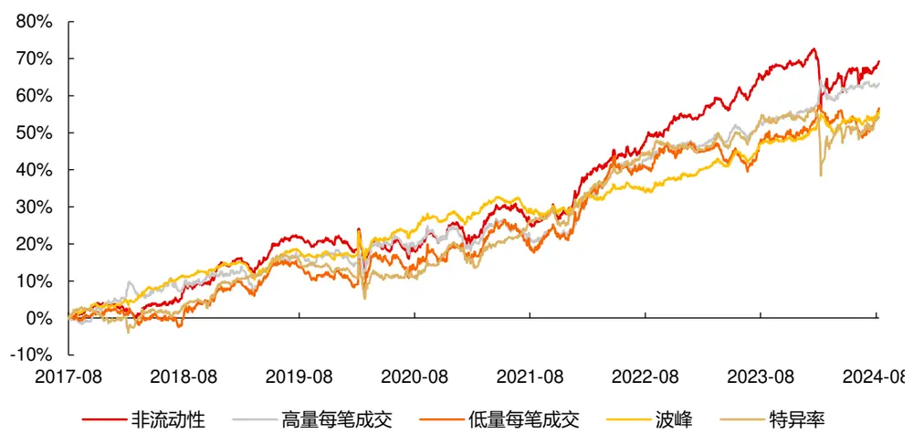

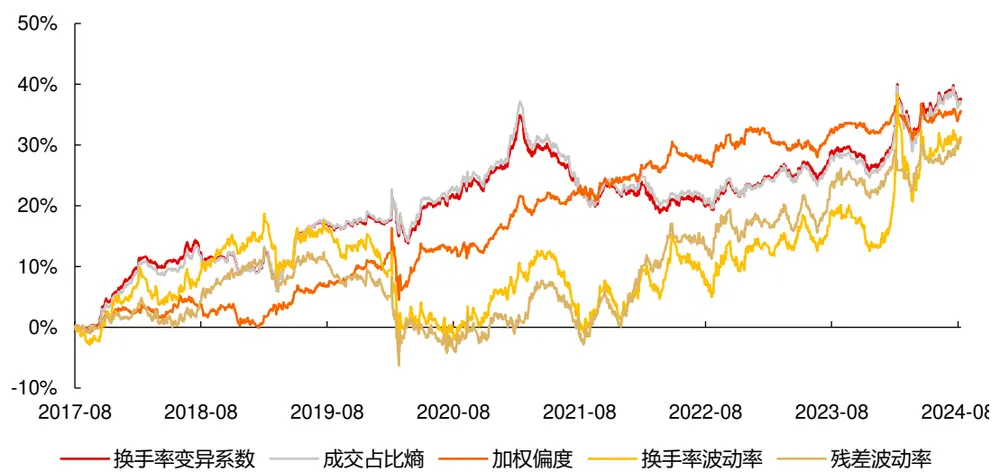
资料来源：天软科技，长江证券研究所

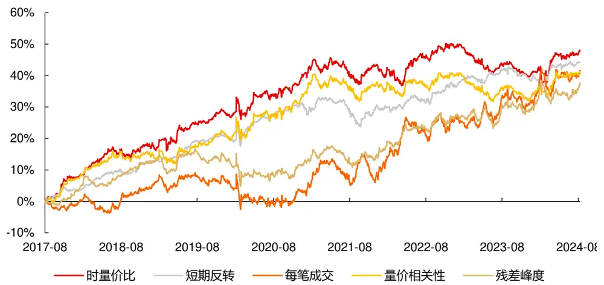

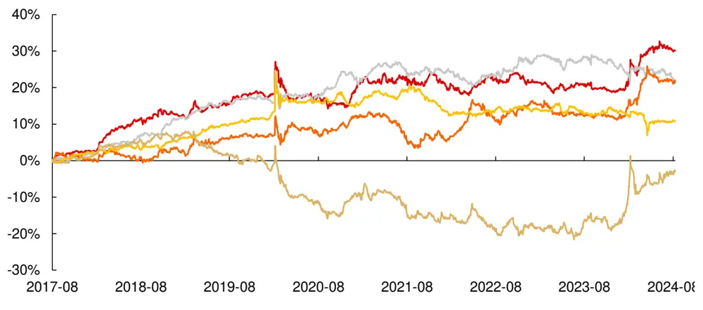
高量交易成本每笔成交收益Beta收益偏度短期动量高价成交占比

表：2017年以来全市场单因子分组回测表现

|  | IC | ICIR | 超额收益 | 超额最大回撤 | 信息比 | 月度胜率 | 月度盈亏比 |
| --- | --- | --- | --- | --- | --- | --- | --- |
| 非流动性 | 8.78% | 73.06% | 10.76% | -15.14% | 1.35 | 70.59% | 2.85 |
| 高量每笔成交 | 11.22% | 95.28% | 9.79% | -8.65% | 1.37 | 68.24% | 3.08 |
| 低量每笔成交 | 8.90% | 62.23% | 8.70% | -8.53% | 1.04 | 57.65% | 2.19 |
| 波峰 | 10.88% | 119.39% | 8.52% | -7.46% | 1.66 | 75.29% | 3.57 |
| 特异率 | 7.24% | 72.74% | 8.33% | -16.62% | 1.10 | 61.18% | 2.64 |
| 时量价比 | 8.96% | 88.67% | 7.34% | -14.23% | 1.03 | 69.41% | 2.29 |
| 短期反转 | 8.30% | 92.60% | 6.74% | -8.85% | 1.27 | 69.41% | 2.84 |
| 每笔成交 | 6.69% | 47.05% | 6.33% | -11.03% | 0.76 | 56.47% | 1.66 |
| 量价相关性 | 6.17% | 69.39% | 6.26% | -8.71% | 0.94 | 68.24% | 2.10 |
| 残差峰度 | 5.91% | 77.28% | 5.73% | -11.33% | 0.91 | 60.00% | 1.90 |
| 换手率变异系数 | 7.40% | 86.31% | 5.70% | -14.87% | 0.90 | 68.24% | 1.90 |
| 成交占比熵 | 7.90% | 87.66% | 5.63% | -16.09% | 0.85 | 63.53% | 1.82 |
| 加权偏度 | 5.88% | 88.48% | 5.38% | -11.15% | 0.96 | 65.88% | 2.24 |
| 换手率波动率 | 10.13% | 65.28% | 4.73% | -19.06% | 0.46 | 55.29% | 1.40 |
| 残差波动率 | 10.72% | 79.70% | 4.68% | -17.62% | 0.58 | 52.94% | 1.56 |
| 高量交易成本 | 7.03% | 100.20% | 4.55% | -12.04% | 0.80 | 60.00% | 1.97 |
| 每笔成交收益Beta | 6.64% | 72.45% | 3.31% | -10.01% | 0.62 | 61.18% | 1.80 |
| 收益偏度 | 6.00% | 73.86% | 3.28% | -9.39% | 0.63 | 50.59% | 1.62 |
| 短期动量 | 2.86% | 54.43% | 1.61% | -16.05% | 0.32 | 58.82% | 1.39 |
| 高价成交占比 | 5.22% | 65.32% | -0.39% | -25.67% | -0.06 | 49.41% | 0.95 |

资料来源：天软科技，长江证券研究所

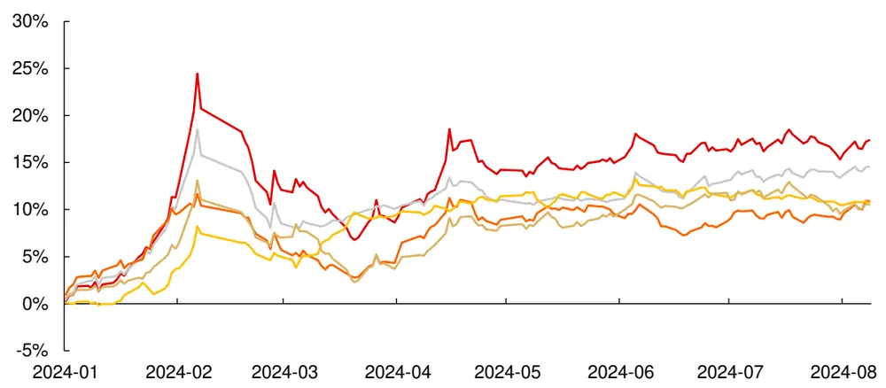
换手率波动率高价成交占比每笔成交高量交易成本成交占比熵

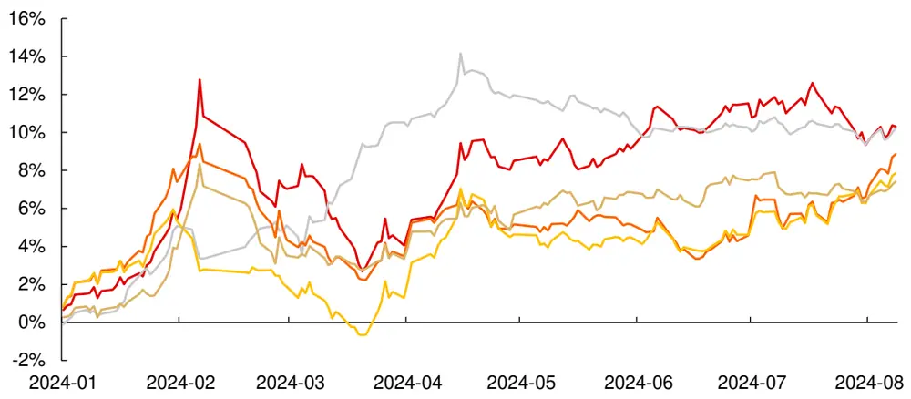
换手率变异系数收益偏度残差峰度残差波动率高量每笔成交

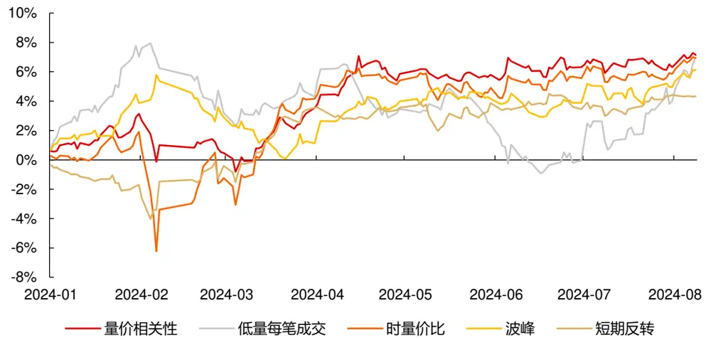
资料来源：天软科技，长江证券研究所

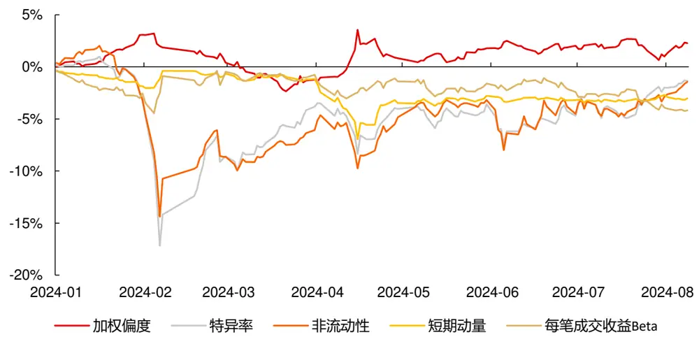

表：近一年全市场单因子分组回测表现

|  | IC | ICIR | 超额收益 | 超额最大回撤 | 信息比 | 月度胜率 | 月度盈亏比 |
| --- | --- | --- | --- | --- | --- | --- | --- |
| 换手率波动率 | 10.90% | 53.87% | 18.97% | -16.19% | 1.65 | 75.00% | 5.47 |
| 高价成交占比 | 8.16% | 145.55% | 15.70% | -9.95% | 2.13 | 75.00% | 15.85 |
| 每笔成交 | 5.98% | 28.88% | 11.54% | -8.48% | 1.93 | 62.50% | 2.55 |
| 高量交易成本 | 11.66% | 148.74% | 11.36% | -4.30% | 2.63 | 75.00% | 10.27 |
| 成交占比熵 | 7.97% | 63.61% | 11.12% | -10.27% | 1.67 | 75.00% | 3.37 |
| 换手率变异系数 | 7.86% | 69.76% | 10.86% | -9.59% | 1.70 | 75.00% | 3.56 |
| 收益偏度 | 10.54% | 71.88% | 10.74% | -4.69% | 2.89 | 62.50% | 5.29 |
| 残差峰度 | 6.58% | 65.95% | 9.26% | -6.91% | 1.91 | 62.50% | 2.68 |
| 残差波动率 | 10.68% | 66.60% | 8.18% | -6.42% | 1.83 | 62.50% | 2.75 |
| 高量每笔成交 | 9.76% | 83.95% | 7.70% | -5.43% | 1.83 | 62.50% | 5.93 |
| 量价相关性 | 8.78% | 75.21% | 7.42% | -3.88% | 2.01 | 75.00% | 3.93 |
| 低量每笔成交 | 4.74% | 21.48% | 7.23% | -8.48% | 1.33 | 50.00% | 1.81 |
| 时量价比 | 14.00% | 105.36% | 7.18% | -7.82% | 1.21 | 75.00% | 2.94 |
| 波峰 | 8.81% | 73.70% | 6.31% | -5.56% | 1.78 | 62.50% | 2.77 |
| 短期反转 | 7.28% | 100.75% | 4.42% | -3.95% | 1.25 | 62.50% | 3.11 |
| 加权偏度 | 2.84% | 32.77% | 2.30% | -5.41% | 0.61 | 62.50% | 1.45 |
| 特异率 | 4.05% | 22.25% | -1.33% | -16.62% | -0.16 | 62.50% | 0.86 |
| 非流动性 | 7.90% | 54.94% | -1.42% | -15.14% | -0.17 | 62.50% | 0.85 |
| 短期动量 | 0.54% | 14.57% | -2.97% | -6.71% | -1.01 | 37.50% | 0.40 |
| 每笔成交收益Beta | 3.65% | 73.00% | -4.10% | -4.34% | -1.15 | 25.00% | 0.32 |

资料来源：天软科技，长江证券研究所

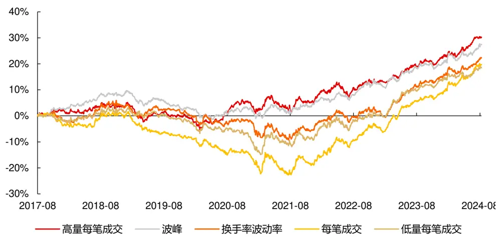

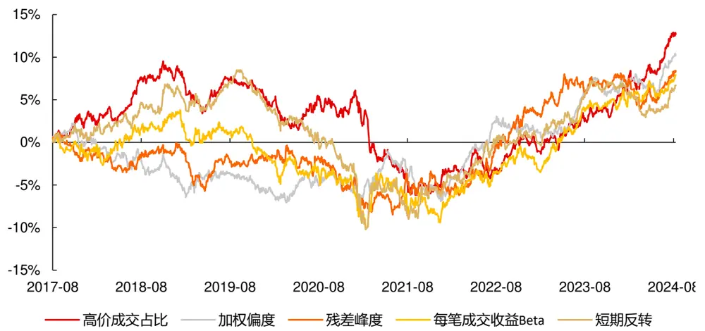
资料来源：天软科技，长江证券研究所

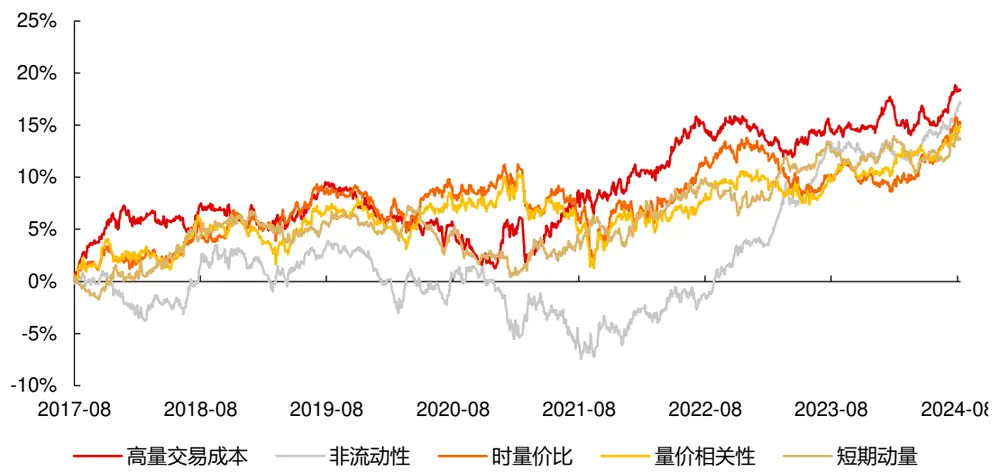

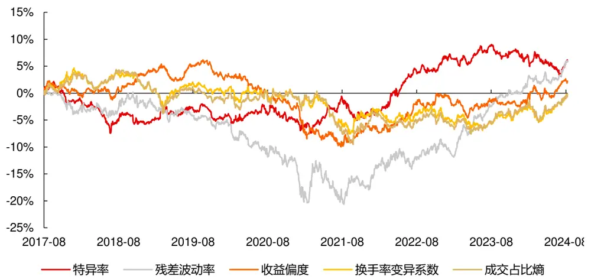

表：2017年以来沪深300单因子增强表现

|  | 超额收益 | 超额最大回撤 | 跟踪误差 | 信息比 | 月度胜率 | 月度盈亏比 |
| --- | --- | --- | --- | --- | --- | --- |
| 高量每笔成交 | 4.56% | -10.12% | 4.76% | 0.94 | 63.53% | 1.83 |
| 波峰 | 4.13% | -10.50% | 4.23% | 0.96 | 58.82% | 2.01 |
| 换手率波动率 | 3.36% | -14.11% | 5.03% | 0.66 | 60.00% | 1.57 |
| 每笔成交 | 2.96% | -21.65% | 5.10% | 0.57 | 57.65% | 1.44 |
| 低量每笔成交 | 2.76% | -16.83% | 5.13% | 0.53 | 56.47% | 1.49 |
| 高量交易成本 | 2.75% | -7.95% | 3.83% | 0.71 | 56.47% | 1.66 |
| 非流动性 | 2.56% | -10.68% | 4.28% | 0.59 | 56.47% | 1.53 |
| 时量价比 | 2.28% | -9.42% | 4.17% | 0.54 | 52.94% | 1.55 |
| 量价相关性 | 2.22% | -8.73% | 3.91% | 0.56 | 55.29% | 1.60 |
| 短期动量 | 2.03% | -6.63% | 3.63% | 0.55 | 56.47% | 1.51 |
| 高价成交占比 | 1.89% | -14.55% | 3.96% | 0.47 | 56.47% | 1.38 |
| 加权偏度 | 1.52% | -8.90% | 3.57% | 0.42 | 50.59% | 1.35 |
| 残差峰度 | 1.25% | -8.99% | 3.76% | 0.33 | 51.76% | 1.27 |
| 每笔成交收益Beta | 1.17% | -12.91% | 4.15% | 0.28 | 55.29% | 1.27 |
| 短期反转 | 0.99% | -17.08% | 4.10% | 0.24 | 58.82% | 1.20 |
| 特异率 | 0.87% | -9.18% | 3.78% | 0.23 | 48.24% | 1.17 |
| 残差波动率 | 0.86% | -19.20% | 5.21% | 0.16 | 49.41% | 1.14 |
| 收益偏度 | 0.33% | -14.90% | 3.68% | 0.09 | 56.47% | 1.06 |
| 换手率变异系数 | -0.04% | -11.52% | 3.86% | -0.01 | 52.94% | 0.99 |
| 成交占比熵 | -0.04% | -12.99% | 3.91% | -0.01 | 54.12% | 0.99 |

资料来源：天软科技，长江证券研究所

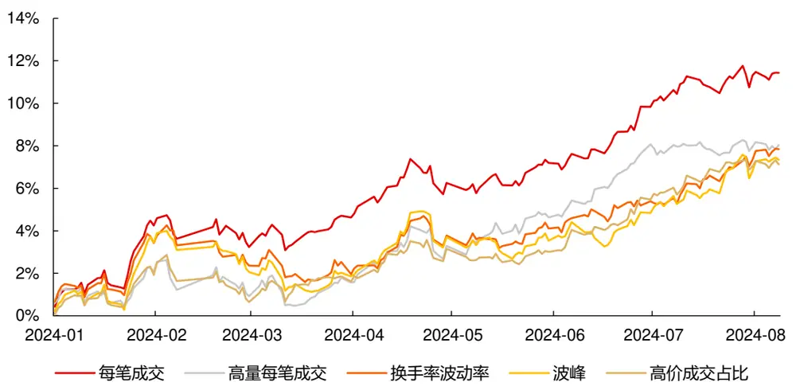

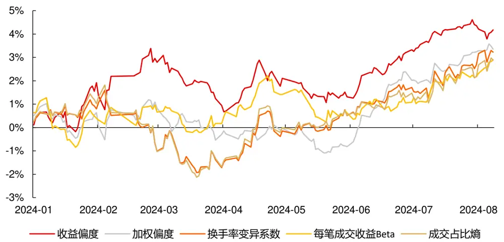
资料来源：天软科技，长江证券研究所

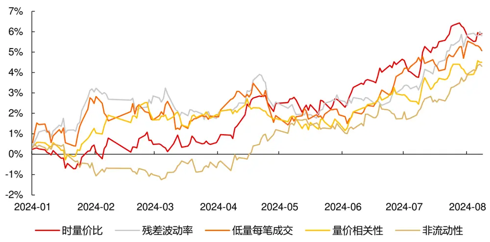

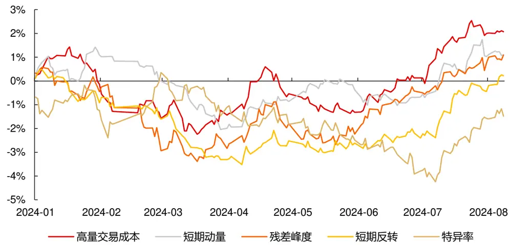

表：近一年沪深300单因子增强表现

|  | 超额收益 | 超额最大回撤 | 跟踪误差 | 信息比 | 月度胜率 | 月度盈亏比 |
| --- | --- | --- | --- | --- | --- | --- |
| 每笔成交 | 12.10% | -1.65% | 4.99% | 3.93 | 87.50% | 12.43 |
| 高量每笔成交 | 8.36% | -2.13% | 4.88% | 2.82 | 87.50% | 7.67 |
| 换手率波动率 | 8.16% | -2.63% | 4.74% | 2.84 | 75.00% | 7.47 |
| 波峰 | 7.62% | -2.82% | 5.24% | 2.40 | 62.50% | 4.93 |
| 高价成交占比 | 7.38% | -2.20% | 4.07% | 3.00 | 75.00% | 5.30 |
| 时量价比 | 6.09% | -1.01% | 3.91% | 2.59 | 75.00% | 12.76 |
| 残差波动率 | 5.97% | -2.12% | 3.94% | 2.52 | 75.00% | 5.31 |
| 低量每笔成交 | 5.20% | -2.02% | 4.61% | 1.89 | 87.50% | 6.23 |
| 量价相关性 | 4.61% | -1.54% | 3.39% | 2.28 | 62.50% | 13.17 |
| 非流动性 | 4.40% | -1.73% | 3.19% | 2.31 | 75.00% | 5.58 |
| 收益偏度 | 4.27% | -2.68% | 3.90% | 1.84 | 62.50% | 2.53 |
| 加权偏度 | 3.41% | -2.25% | 3.51% | 1.63 | 75.00% | 2.39 |
| 换手率变异系数 | 3.28% | -3.46% | 4.22% | 1.31 | 75.00% | 2.40 |
| 每笔成交收益Beta | 2.94% | -2.09% | 3.64% | 1.36 | 75.00% | 2.84 |
| 成交占比熵 | 2.93% | -3.87% | 4.30% | 1.15 | 75.00% | 2.15 |
| 高量交易成本 | 2.09% | -3.60% | 3.53% | 1.01 | 75.00% | 1.99 |
| 短期动量 | 1.11% | -3.40% | 3.03% | 0.62 | 62.50% | 1.30 |
| 残差峰度 | 1.09% | -3.88% | 4.03% | 0.46 | 62.50% | 1.38 |
| 短期反转 | 0.22% | -3.92% | 2.96% | 0.13 | 50.00% | 1.06 |
| 特异率 | -1.47% | -4.49% | 4.38% | -0.58 | 37.50% | 0.71 |

资料来源：天软科技，长江证券研究所

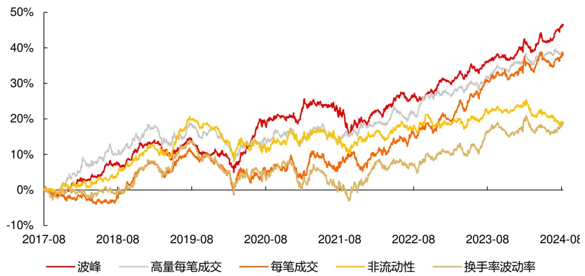

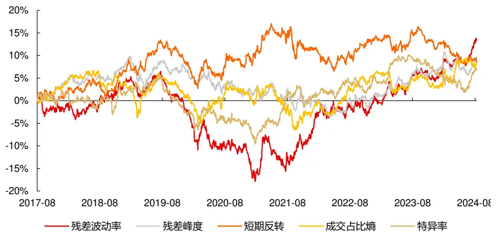
资料来源：天软科技，长江证券研究所

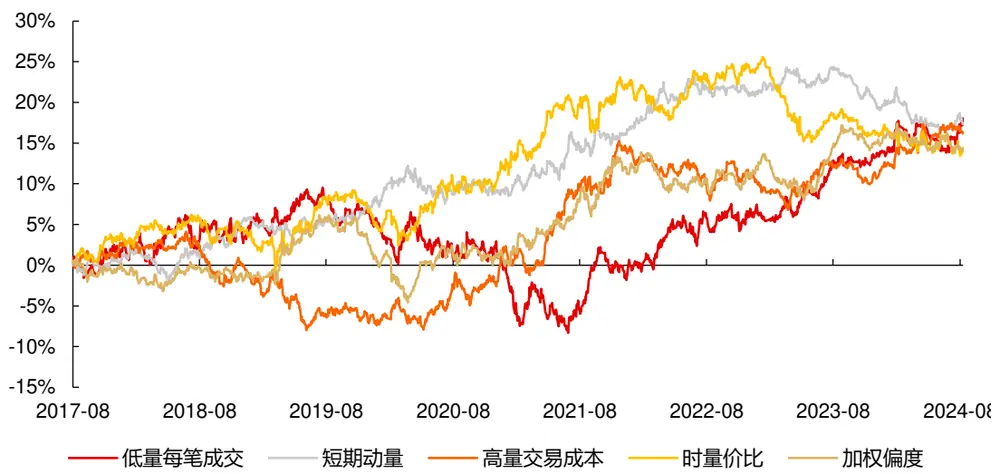

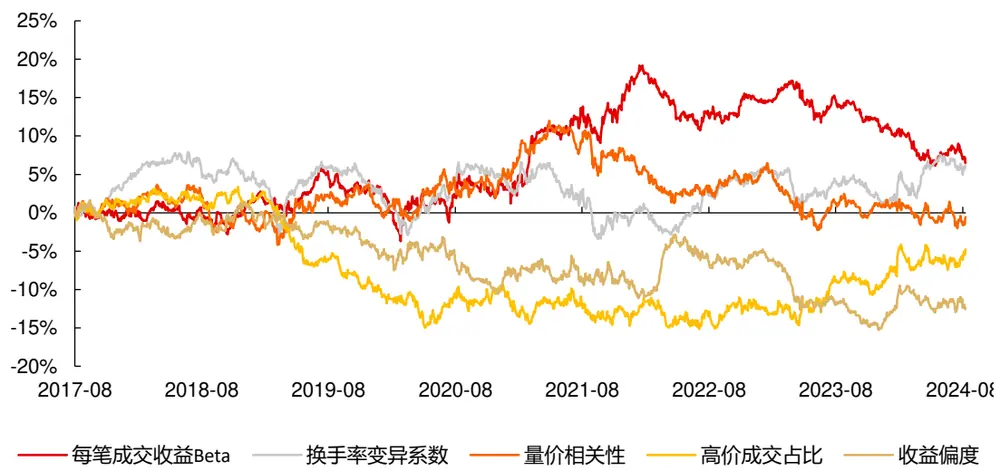

表：2017年以来中证500单因子增强表现

|  | 超额收益 | 超额最大回撤 | 跟踪误差 | 信息比 | 月度胜率 | 月度盈亏比 |
| --- | --- | --- | --- | --- | --- | --- |
| 波峰 | 7.09% | -9.75% | 5.68% | 1.21 | 68.24% | 2.35 |
| 高量每笔成交 | 5.88% | -10.58% | 5.61% | 1.02 | 65.88% | 2.11 |
| 每笔成交 | 5.81% | -12.24% | 6.18% | 0.91 | 55.29% | 1.92 |
| 非流动性 | 2.88% | -11.51% | 5.64% | 0.50 | 58.82% | 1.50 |
| 换手率波动率 | 2.82% | -15.77% | 6.50% | 0.43 | 51.76% | 1.38 |
| 低量每笔成交 | 2.70% | -16.35% | 6.26% | 0.43 | 56.47% | 1.37 |
| 短期动量 | 2.59% | -7.75% | 4.38% | 0.58 | 51.76% | 1.56 |
| 高量交易成本 | 2.41% | -11.39% | 4.85% | 0.49 | 55.29% | 1.40 |
| 时量价比 | 2.15% | -11.47% | 5.70% | 0.37 | 56.47% | 1.32 |
| 加权偏度 | 2.13% | -10.18% | 4.74% | 0.44 | 47.06% | 1.38 |
| 残差波动率 | 2.03% | -21.61% | 6.37% | 0.32 | 56.47% | 1.26 |
| 残差峰度 | 1.45% | -12.42% | 4.78% | 0.30 | 56.47% | 1.24 |
| 短期反转 | 1.28% | -10.14% | 5.28% | 0.24 | 50.59% | 1.20 |
| 成交占比熵 | 1.23% | -12.33% | 5.10% | 0.24 | 49.41% | 1.18 |
| 特异率 | 1.02% | -14.13% | 4.99% | 0.20 | 52.94% | 1.16 |
| 每笔成交收益Beta | 0.97% | -12.25% | 5.31% | 0.18 | 49.41% | 1.15 |
| 换手率变异系数 | 0.91% | -10.71% | 4.99% | 0.18 | 52.94% | 1.14 |
| 量价相关性 | -0.08% | -13.28% | 5.52% | -0.02 | 50.59% | 0.99 |
| 高价成交占比 | -0.70% | -16.87% | 5.06% | -0.14 | 50.59% | 0.89 |
| 收益偏度 | -1.82% | -15.53% | 4.91% | -0.38 | 41.18% | 0.74 |

资料来源：天软科技，长江证券研究所

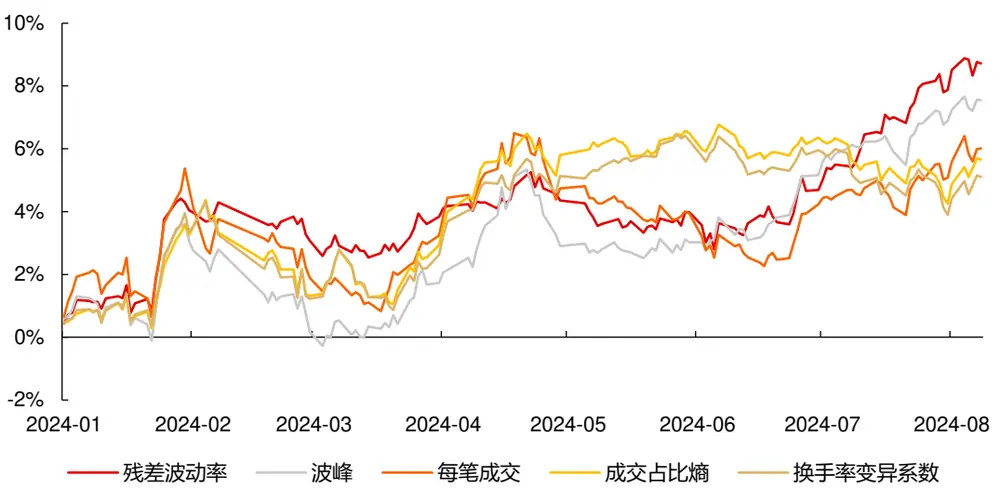

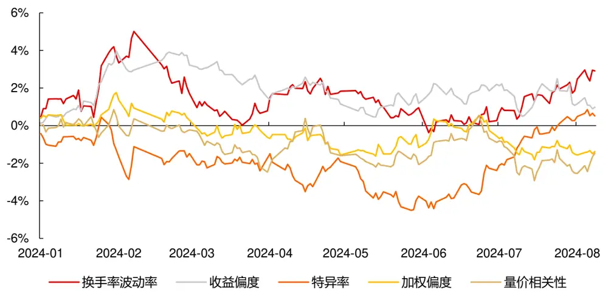
低量每笔成交高量交易成本高价成交占比高量每笔成交残差峰度

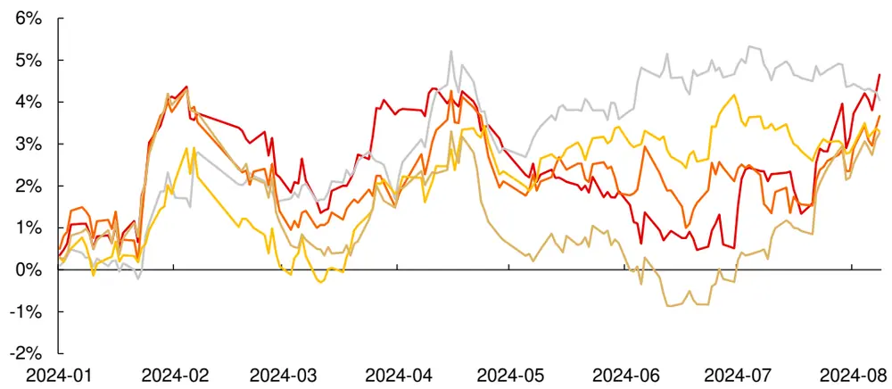
资料来源：天软科技，长江证券研究所

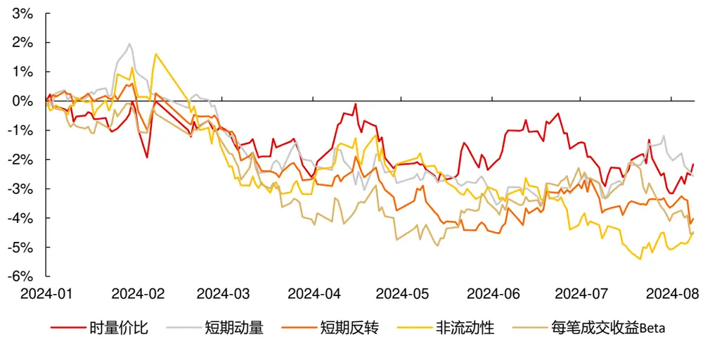

表：近一年中证500单因子增强表现

|  | 超额收益 | 超额最大回撤 | 跟踪误差 | 信息比 | 月度胜率 | 月度盈亏比 |
| --- | --- | --- | --- | --- | --- | --- |
| 残差波动率 | 9.10% | -2.43% | 5.17% | 2.89 | 75.00% | 7.19 |
| 波峰 | 7.83% | -3.81% | 6.04% | 2.14 | 87.50% | 3.64 |
| 每笔成交 | 6.20% | -4.44% | 6.79% | 1.52 | 62.50% | 2.52 |
| 成交占比熵 | 5.81% | -3.26% | 5.61% | 1.73 | 62.50% | 2.34 |
| 换手率变异系数 | 5.23% | -3.38% | 5.75% | 1.52 | 62.50% | 2.07 |
| 低量每笔成交 | 4.76% | -3.82% | 5.80% | 1.37 | 50.00% | 1.89 |
| 高量交易成本 | 4.12% | -2.49% | 4.79% | 1.45 | 62.50% | 4.13 |
| 高价成交占比 | 3.73% | -3.30% | 5.95% | 1.06 | 62.50% | 2.43 |
| 高量每笔成交 | 3.36% | -3.16% | 4.93% | 1.15 | 75.00% | 2.22 |
| 残差峰度 | 3.31% | -5.02% | 5.69% | 0.98 | 50.00% | 1.69 |
| 换手率波动率 | 2.95% | -5.24% | 6.53% | 0.76 | 50.00% | 1.56 |
| 收益偏度 | 0.98% | -3.46% | 4.64% | 0.36 | 50.00% | 1.28 |
| 特异率 | 0.52% | -4.83% | 5.17% | 0.17 | 50.00% | 1.12 |
| 加权偏度 | -1.36% | -3.53% | 4.22% | -0.56 | 50.00% | 0.69 |
| 量价相关性 | -1.46% | -3.71% | 5.02% | -0.50 | 50.00% | 0.72 |
| 时量价比 | -2.14% | -3.33% | 5.39% | -0.69 | 37.50% | 0.42 |
| 短期动量 | -2.53% | -5.36% | 4.22% | -1.04 | 25.00% | 0.55 |
| 短期反转 | -3.95% | -4.99% | 4.19% | -1.65 | 25.00% | 0.32 |
| 非流动性 | -4.38% | -6.78% | 5.44% | -1.41 | 37.50% | 0.37 |
| 每笔成交收益Beta | -4.43% | -4.83% | 4.89% | -1.59 | 25.00% | 0.28 |

资料来源：天软科技，长江证券研究所

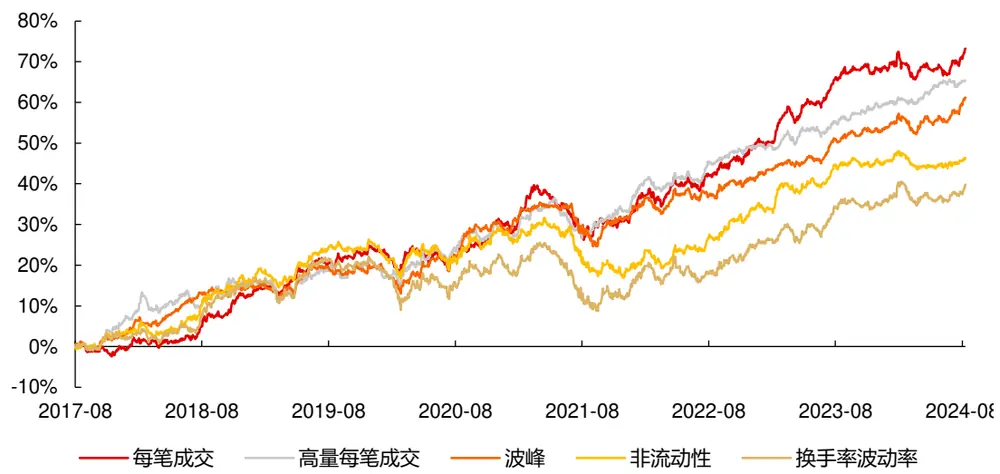

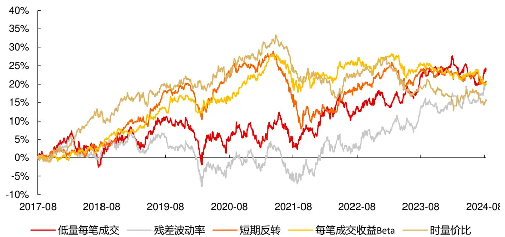
资料来源：天软科技，长江证券研究所

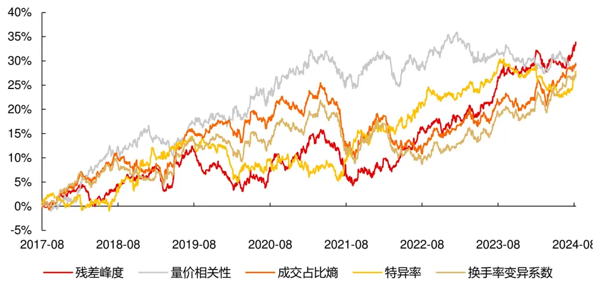

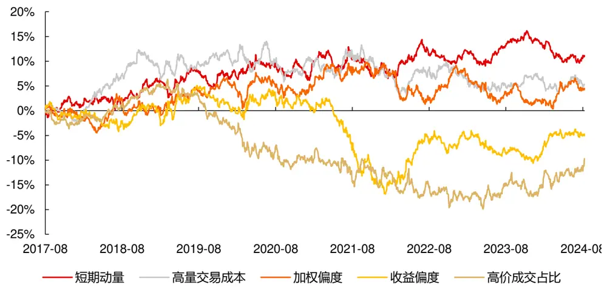

表：2017年以来中证1000单因子增强表现

|  | 超额收益 | 超额最大回撤 | 跟踪误差 | 信息比 | 月度胜率 | 月度盈亏比 |
| --- | --- | --- | --- | --- | --- | --- |
| 每笔成交 | 11.40% | -12.58% | 6.69% | 1.61 | 67.06% | 3.06 |
| 高量每笔成交 | 10.14% | -9.46% | 6.19% | 1.56 | 71.76% | 2.95 |
| 波峰 | 9.45% | -10.17% | 5.63% | 1.60 | 72.94% | 3.00 |
| 非流动性 | 7.07% | -13.68% | 6.61% | 1.03 | 64.71% | 1.97 |
| 换手率波动率 | 6.05% | -15.49% | 7.47% | 0.79 | 63.53% | 1.71 |
| 残差峰度 | 5.12% | -10.91% | 5.15% | 0.97 | 63.53% | 1.82 |
| 量价相关性 | 4.44% | -8.17% | 5.81% | 0.75 | 56.47% | 1.82 |
| 成交占比熵 | 4.42% | -14.29% | 5.25% | 0.82 | 62.35% | 1.65 |
| 特异率 | 4.19% | -9.11% | 5.55% | 0.74 | 56.47% | 1.75 |
| 换手率变异系数 | 4.07% | -12.40% | 5.04% | 0.79 | 57.65% | 1.59 |
| 低量每笔成交 | 3.62% | -12.29% | 7.59% | 0.47 | 60.00% | 1.39 |
| 残差波动率 | 3.12% | -13.59% | 7.19% | 0.43 | 52.94% | 1.37 |
| 短期反转 | 3.09% | -18.93% | 5.72% | 0.53 | 61.18% | 1.46 |
| 每笔成交收益Beta | 2.98% | -9.70% | 5.43% | 0.54 | 62.35% | 1.50 |
| 时量价比 | 2.32% | -18.59% | 5.85% | 0.39 | 58.82% | 1.32 |
| 短期动量 | 1.65% | -6.31% | 4.56% | 0.36 | 54.12% | 1.31 |
| 高量交易成本 | 0.79% | -10.71% | 5.13% | 0.15 | 45.88% | 1.11 |
| 加权偏度 | 0.65% | -9.02% | 5.13% | 0.13 | 49.41% | 1.10 |
| 收益偏度 | -0.74% | -19.71% | 5.32% | -0.14 | 44.71% | 0.91 |
| 高价成交占比 | -1.42% | -23.04% | 5.44% | -0.26 | 48.24% | 0.80 |

资料来源：天软科技，长江证券研究所

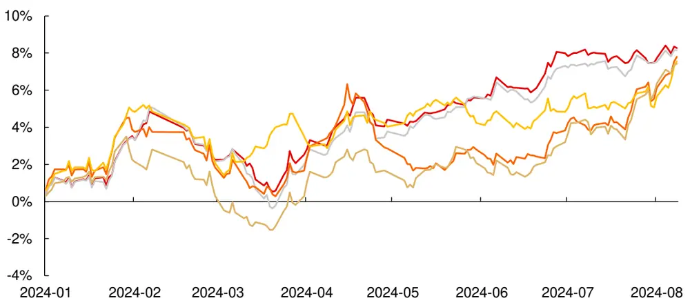

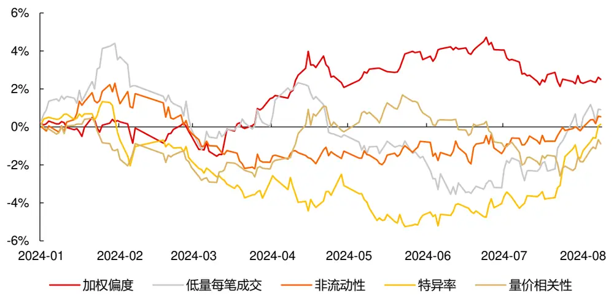
资料来源：天软科技，长江证券研究所

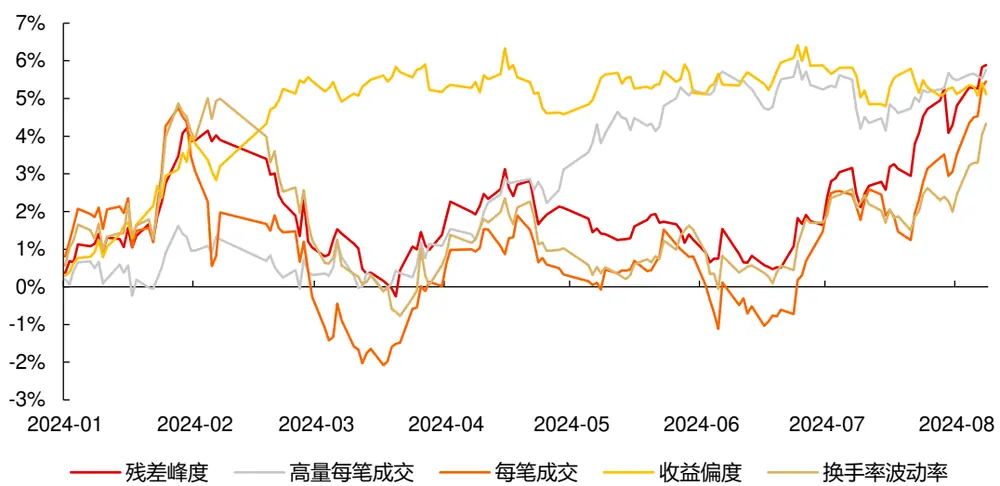

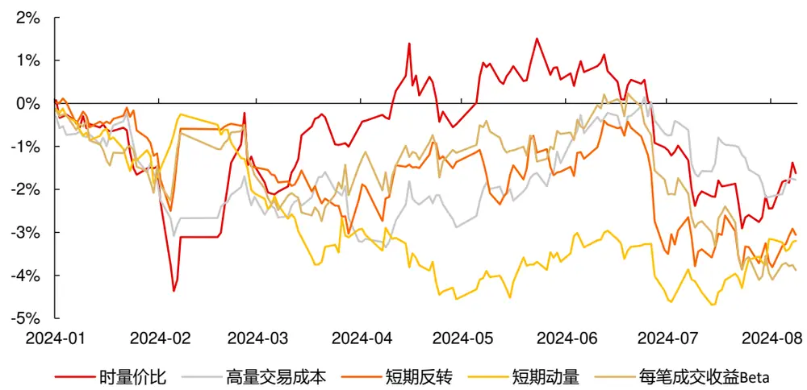

表：近一年中证1000单因子增强表现

|  | 超额收益 | 超额最大回撤 | 跟踪误差 | 信息比 | 月度胜率 | 月度盈亏比 |
| --- | --- | --- | --- | --- | --- | --- |
| 换手率变异系数 | 8.62% | -4.23% | 5.23% | 2.71 | 62.50% | 5.29 |
| 成交占比熵 | 8.49% | -5.30% | 5.59% | 2.50 | 75.00% | 5.27 |
| 残差波动率 | 8.11% | -4.56% | 6.56% | 2.04 | 62.50% | 3.60 |
| 高价成交占比 | 7.85% | -3.72% | 5.92% | 2.19 | 75.00% | 3.64 |
| 波峰 | 7.70% | -4.92% | 5.85% | 2.18 | 75.00% | 3.47 |
| 残差峰度 | 6.07% | -4.37% | 5.86% | 1.72 | 62.50% | 2.44 |
| 高量每笔成交 | 5.92% | -1.83% | 4.84% | 2.04 | 87.50% | 7.27 |
| 每笔成交 | 5.60% | -6.60% | 7.52% | 1.24 | 75.00% | 2.29 |
| 收益偏度 | 5.25% | -1.74% | 4.44% | 1.97 | 50.00% | 3.94 |
| 换手率波动率 | 4.42% | -5.61% | 6.64% | 1.12 | 75.00% | 1.97 |
| 加权偏度 | 2.54% | -2.56% | 4.76% | 0.90 | 62.50% | 2.22 |
| 低量每笔成交 | 0.92% | -7.65% | 7.03% | 0.22 | 37.50% | 1.12 |
| 非流动性 | 0.54% | -4.40% | 5.21% | 0.18 | 62.50% | 1.12 |
| 特异率 | 0.14% | -6.36% | 5.44% | 0.04 | 62.50% | 1.02 |
| 量价相关性 | -0.88% | -4.17% | 4.97% | -0.31 | 37.50% | 0.80 |
| 时量价比 | -1.61% | -4.34% | 5.76% | -0.48 | 62.50% | 0.61 |
| 高量交易成本 | -1.76% | -3.29% | 3.99% | -0.76 | 37.50% | 0.62 |
| 短期反转 | -3.01% | -3.90% | 5.03% | -1.04 | 25.00% | 0.38 |
| 短期动量 | -3.15% | -4.57% | 3.90% | -1.41 | 37.50% | 0.35 |
| 每笔成交收益Beta | -3.80% | -4.25% | 5.05% | -1.32 | 37.50% | 0.35 |

资料来源：天软科技，长江证券研究所

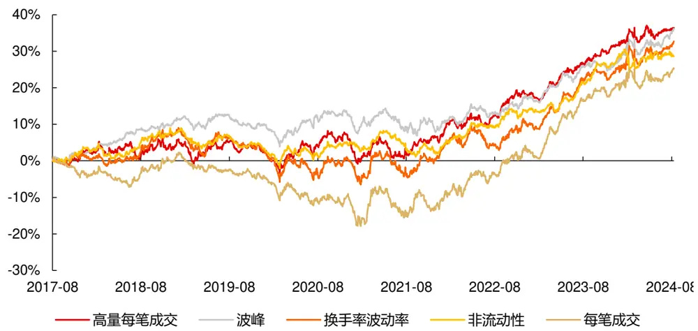

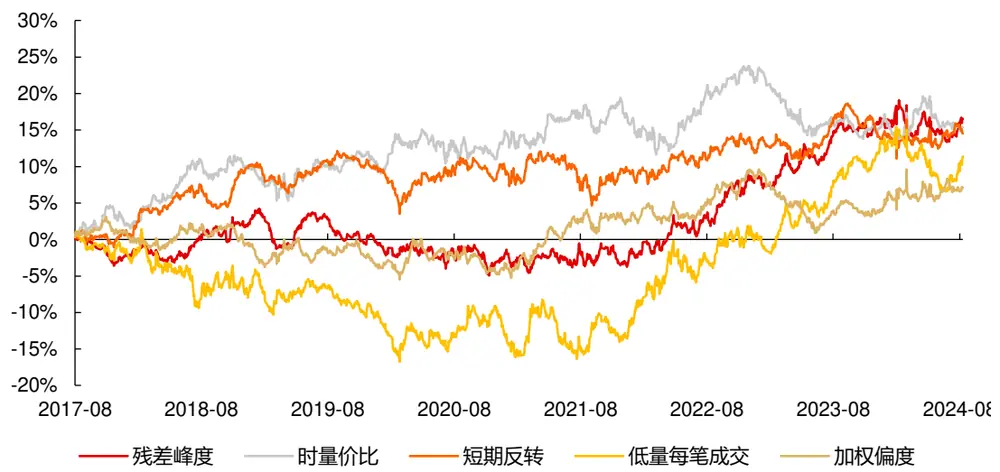
资料来源：天软科技，长江证券研究所

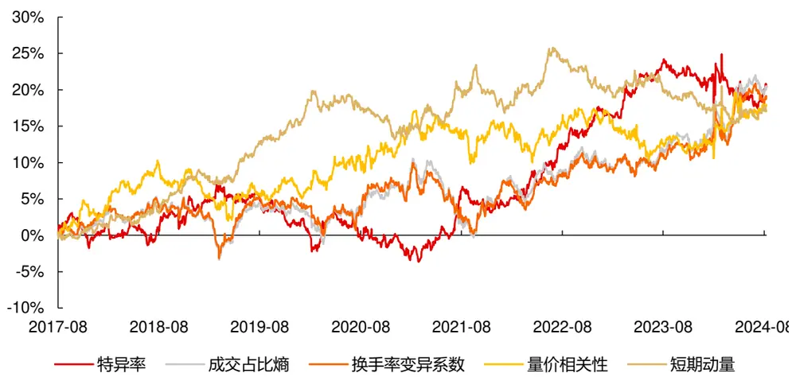

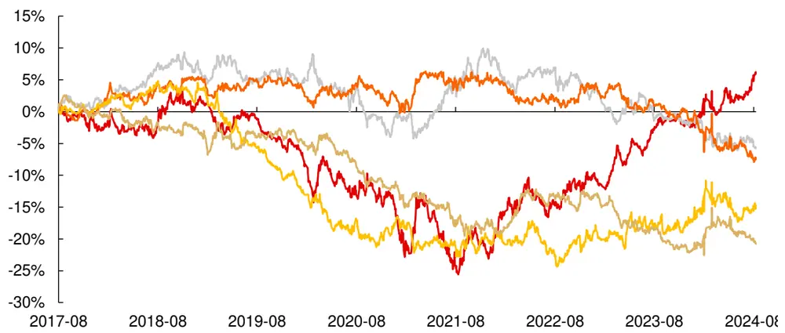
残差波动率高量交易成本每笔成交收益Beta高价成交占比收益偏度

表：2017年以来中证全指单因子增强表现

|  | 超额收益 | 超额最大回撤 | 跟踪误差 | 信息比 | 月度胜率 | 月度盈亏比 |
| --- | --- | --- | --- | --- | --- | --- |
| 每笔成交 | 11.40% | -12.58% | 6.69% | 1.61 | 67.06% | 3.06 |
| 高量每笔成交 | 10.14% | -9.46% | 6.19% | 1.56 | 71.76% | 2.95 |
| 波峰 | 9.45% | -10.17% | 5.63% | 1.60 | 72.94% | 3.00 |
| 非流动性 | 7.07% | -13.68% | 6.61% | 1.03 | 64.71% | 1.97 |
| 换手率波动率 | 6.05% | -15.49% | 7.47% | 0.79 | 63.53% | 1.71 |
| 残差峰度 | 5.12% | -10.91% | 5.15% | 0.97 | 63.53% | 1.82 |
| 量价相关性 | 4.44% | -8.17% | 5.81% | 0.75 | 56.47% | 1.82 |
| 成交占比熵 | 4.42% | -14.29% | 5.25% | 0.82 | 62.35% | 1.65 |
| 特异率 | 4.19% | -9.11% | 5.55% | 0.74 | 56.47% | 1.75 |
| 换手率变异系数 | 4.07% | -12.40% | 5.04% | 0.79 | 57.65% | 1.59 |
| 低量每笔成交 | 3.62% | -12.29% | 7.59% | 0.47 | 60.00% | 1.39 |
| 残差波动率 | 3.12% | -13.59% | 7.19% | 0.43 | 52.94% | 1.37 |
| 短期反转 | 3.09% | -18.93% | 5.72% | 0.53 | 61.18% | 1.46 |
| 每笔成交收益Beta | 2.98% | -9.70% | 5.43% | 0.54 | 62.35% | 1.50 |
| 时量价比 | 2.32% | -18.59% | 5.85% | 0.39 | 58.82% | 1.32 |
| 短期动量 | 1.65% | -6.31% | 4.56% | 0.36 | 54.12% | 1.31 |
| 高量交易成本 | 0.79% | -10.71% | 5.13% | 0.15 | 45.88% | 1.11 |
| 加权偏度 | 0.65% | -9.02% | 5.13% | 0.13 | 49.41% | 1.10 |
| 收益偏度 | -0.74% | -19.71% | 5.32% | -0.14 | 44.71% | 0.91 |
| 高价成交占比 | -1.42% | -23.04% | 5.44% | -0.26 | 48.24% | 0.80 |

资料来源：天软科技，长江证券研究所

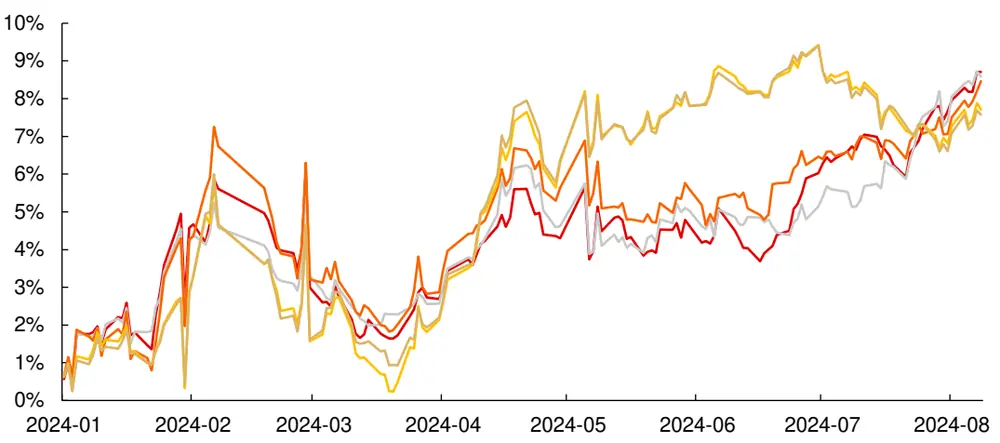
波峰残差波动率换手率波动率成交占比熵换手率变异系数

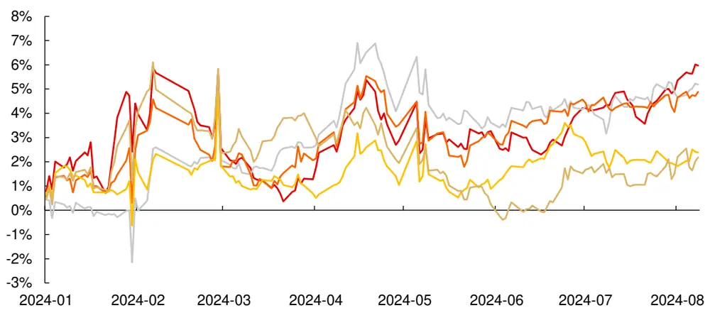
每笔成交量价相关性高量每笔成交加权偏度高价成交占比

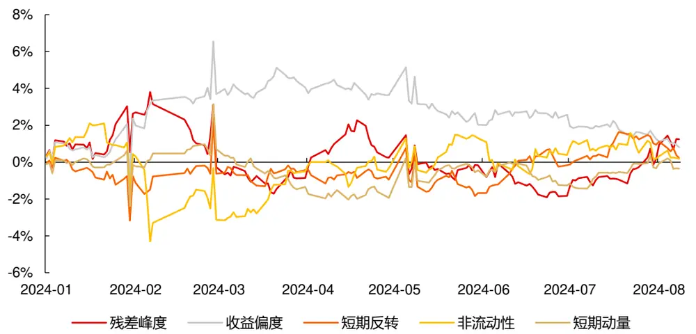
资料来源：天软科技，长江证券研究所

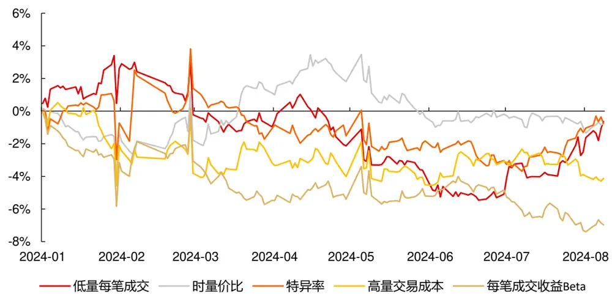

表：近一年中证全指单因子增强表现

|  | 超额收益 | 超额最大回撤 | 跟踪误差 | 信息比 | 月度胜率 | 月度盈亏比 |
| --- | --- | --- | --- | --- | --- | --- |
| 波峰 | 9.10% | -4.36% | 9.26% | 1.61 | 87.50% | 3.59 |
| 残差波动率 | 8.96% | -3.71% | 9.03% | 1.63 | 75.00% | 3.50 |
| 换手率波动率 | 8.83% | -5.28% | 10.09% | 1.44 | 75.00% | 3.42 |
| 成交占比熵 | 8.01% | -5.46% | 10.28% | 1.29 | 75.00% | 2.52 |
| 换手率变异系数 | 7.87% | -4.93% | 10.07% | 1.29 | 75.00% | 2.51 |
| 每笔成交 | 6.16% | -5.37% | 10.24% | 1.00 | 87.50% | 2.34 |
| 量价相关性 | 5.32% | -3.68% | 9.49% | 0.94 | 50.00% | 2.00 |
| 高量每笔成交 | 5.01% | -4.00% | 9.33% | 0.90 | 62.50% | 2.54 |
| 加权偏度 | 2.41% | -4.30% | 9.25% | 0.44 | 50.00% | 1.41 |
| 高价成交占比 | 2.20% | -6.30% | 9.84% | 0.38 | 50.00% | 1.37 |
| 残差峰度 | 1.26% | -5.55% | 9.63% | 0.22 | 62.50% | 1.20 |
| 收益偏度 | 0.83% | -5.56% | 10.03% | 0.14 | 25.00% | 1.12 |
| 短期反转 | 0.23% | -3.98% | 9.05% | 0.04 | 37.50% | 1.03 |
| 非流动性 | 0.20% | -6.21% | 9.93% | 0.03 | 50.00% | 1.07 |
| 短期动量 | -0.35% | -5.05% | 8.71% | -0.07 | 37.50% | 0.96 |
| 低量每笔成交 | -0.63% | -8.47% | 9.83% | -0.11 | 50.00% | 0.92 |
| 时量价比 | -0.75% | -4.71% | 9.56% | -0.13 | 50.00% | 0.89 |
| 特异率 | -0.75% | -7.22% | 10.79% | -0.12 | 50.00% | 0.93 |
| 高量交易成本 | -4.04% | -4.96% | 10.18% | -0.69 | 25.00% | 0.57 |
| 每笔成交收益Beta | -6.73% | -7.30% | 10.05% | -1.19 | 50.00% | 0.49 |

资料来源：天软科技，长江证券研究所

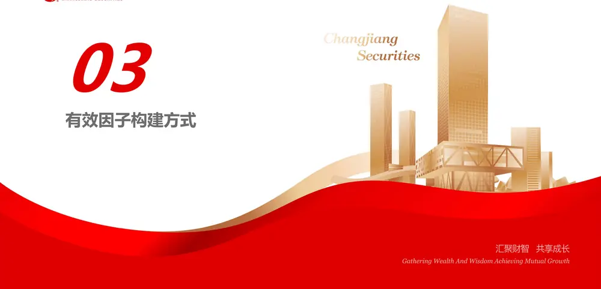

Amihud非流动性：收益率绝对值/成交额，衡量单位资金对价格变动的冲击。

## 波峰：

- 计算全部240根K线数据的均值与标准差，筛选出大于(均值+1倍标准差)的数据；

- 计算上一步筛选出的每一分钟与前一分钟之间的时间差，只有时间差超过1分钟(即相隔超过1根K线)时，该分钟数据才会被保留。

图：波峰筛选第一步
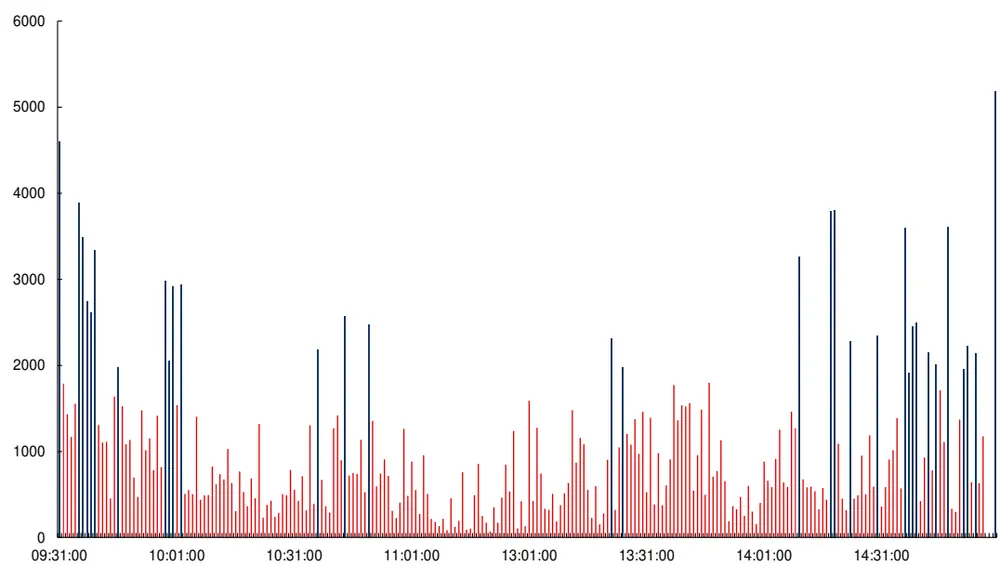
资料来源：天软科技，长江证券研究所

图：波峰筛选第一步
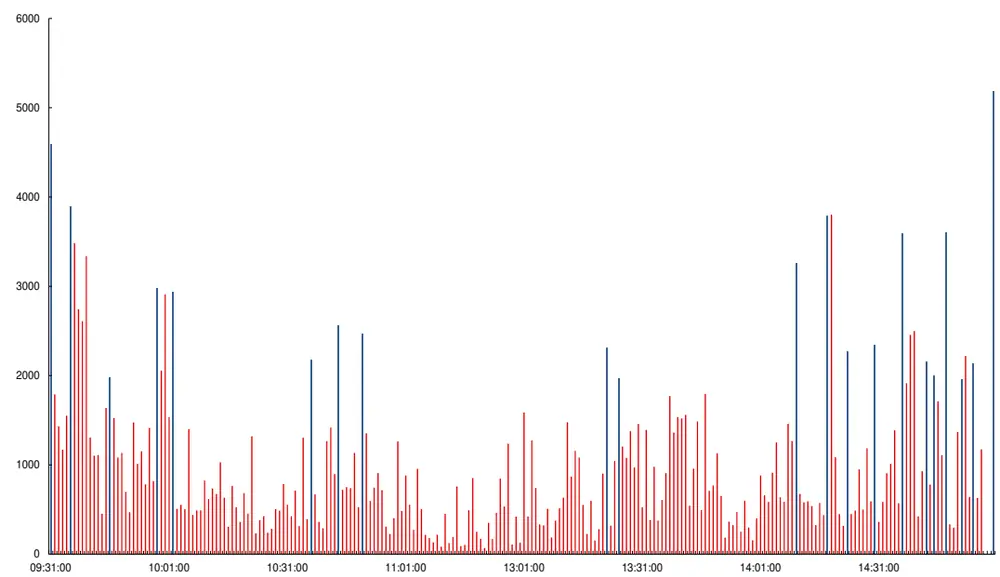

- 量价相关性：corr（成交量，收盘价），量价的趋同程度高（即价格高时成交量高，价格低时成交量低），说明在价格较高时成交更多，股票交易行为中存在着羊群效应。

加权收盘价比 $\frac{\sum_{t=1}^{T}\frac{vol_{t}}{VOL}close_{t}}{\frac{\sum_{t=1}^{T}close_{t}}{T}}$

$$
加权收盘价比=\frac{\sum_{t=1}^{T}\frac{vol_{t}}{VOL}close_{t}}{\sum_{t=1}^{T}\frac{close_{t}}{T}}=T\times\sum_{t=1}^{T}\frac{vol_{t}}{VOL}\frac{close_{t}}{CLOSE}
$$

从量纲上看相当于每个时刻的成交量占比和收盘价占比的乘积求和，是一种量纲单位1化后的成交额，后文中称为单位一成交额占比。由排序不等式性质：

设两组数列 $\{a_{i}\},\{b_{i}\}$ 满足 $.a_{1}\leq a_{2}\leq\cdots\leq a_{n},b_{1}\leq b_{2}\leq\cdots\leq b_{n}$ ，{ci}为 $\{b_{i}\}$ 的乱序排列，则有 $\left[a_{1}b_{n}+a_{2}b_{n-1}+\cdots+a_{n}b_{1}\leq a_{1}c_{1}+\right.$ $a_{2}c_{2}+\cdots+a_{n}c_{n}\leq a_{1}b_{1}+a_{2}b_{2}+\cdots+a_{n}b_{n}$

成交额占比熵：加权收盘价因子相当于将成交量和收盘价做权重化处理后，以排序不等式的角度刻画成交体系的“混乱”程度。而在衡量体系混乱程度时，信息熵的定义也可以参考：

$$
\begin{array}{r}{\mathrm{H}(p_{1},p_{2},\ldots,p_{n})=-\sum_{i=1}^{N}p_{i}\ln(p_{i})\Rightarrow\mathrm{H}(\frac{amount_{1}}{AMOUNT},\frac{amount_{2}}{AMOUNT},\ldots,\frac{amount_{N}}{AMOUNT})}\end{array}
$$

残差波动率：Fama-French模型残差的标准差，波动是成交异常的一种衡量，波动越大局部成交越活跃，容易形成错误定价。

换手率波动率：换手率标准差，成交过程的稳定性。

## 高频数据量价的含义：

1. 量：成交过程，量衡量了交易状态，如量的多少衡量流动性，量的分布衡量交易稳定性等。

2. 价：成交结果，价格是买卖双方的成交确定，如买方价格为做多方对资产的定价，均价为市场对资产的局部定价。

反转和动量成交结果的直接体现：

- 短期反转：以每笔成交量最高的的数据做对数收益率求和。

- 短期动量：以每笔成交量最低的的数据做对数收益率求和。

板块的动量和个股的反转：

- 板块以动量效应为主，如过去一个月表现较好的行业下一个月表现也较好，市场对信息的消化；

- 个股以反转效应为主，如过去一个月表现较好的个股下一个月表现较弱，市场的错误定价。

与反转和动量对应的“量”上的对应因子为换手率，Barra模型（CNE6）中的两个风险因子。

- 一致卖出占比：以（收盘价-开盘价）振幅和0.95倍（最高价-最低价）比较确定区间属性，卖出成交额/总成交额。成交异常时间段卖出占比越高，做空过度反应程度越高

高量每笔成交：以成交量最高的20%数据计算的每笔成交量，除以全时间段每笔成交量。

## 每笔成交

成交量：买卖双方达成的交易

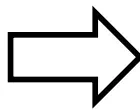

成交笔数：卖单的成交单数

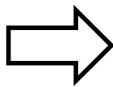

## 卖方的挂单效率

单位笔数下的成交越多，挂单效率越高，卖方交易意愿越强

过度反应的卖方交易意愿

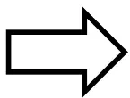

成交最活跃的区间，容易过度反应

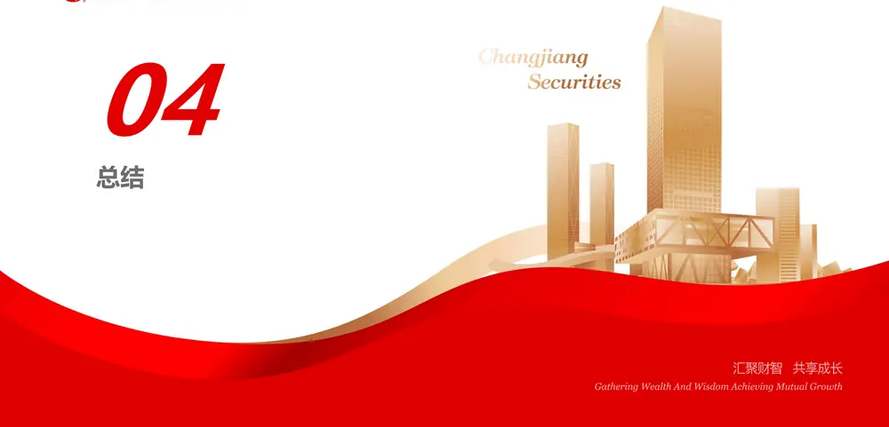

## 1 增强类策略是更好评价因子表现的方式

分组回测实际以平均收益为对比标准，但受市场风格影响较大，无法衡量在实际投资中的超额收益能力。而以单因子在风险控制下构建的增强类策略，可以更好的评价因子表现。

## 2 2024年因子表现有较大变化

中证1000和中证全指的因子整体表现有所下降，沪深300的因子表现有所上升。

一些历史上有超额收益的因子在2024年收益有较大衰减；但在各个收益来源下（局部定价除外）也存在长期有效的因子。

## 3因子构建逻辑

流动性——流动性低风险溢价高，空头意愿——密度高被过度卖出，波动—低波动确定性，交易拥挤——分布集中在价格低位羊群效应弱，反转、动量—错误定价、信息消化。

## 4 有效因子

2024年各个板块中均有效的因子有：波峰：日内个股成交显著活跃的次数，属流动性类别；换手率波动率：成交过程稳定性，属波动类别；
成交额占比熵：成交过程的混乱程度，属交易拥挤度类别；高量成交占比：空头意愿的过度反应，属空头意愿类别。

## 风险提示

1.模型存在失效风险；

2.本文举例均基于历史数据，不保证未来收益。

## 更多研究服务，请访问长江研究小程序

电脑端请访问https://research.95579.com/

## 办公地址

上海

虹口区新建路200号国华金融中心B栋22、23层

武汉武汉市江汉区淮海路88号长江证券大厦37楼

(200080)

(430015)

北京西城区金融街33号通泰大厦15层

(100032)

深圳

深圳市福田区中心四路1号嘉里建设广场3期36楼

(518048)

## 评级说明

## 评级说明

| 行业评级 |  |  | 报告发布日后的12个月内行业股票指数的涨跌幅度相对同期相关证券市场代表性指数的涨跌幅为基准，投资建议的评级标准为： |
| --- | --- | --- | --- |
|  | 看好: |  | 相对表现优于同期相关证券市场代表性指数 |
|  |  | 中性： | 相对表现与同期相关证券市场代表性指数持平 |
|  |  | 看淡： | 相对表现弱于同期相关证券市场代表性指数 |
|  |  |  | 报告发布日后的12个月内公司的涨跌幅相对同期相关证券市场代表性指数的涨跌幅为基准，投资建议的评级标准为 |
| 公司评级 | 买入： |  | 相对同期相关证券市场代表性指数涨幅大于10% |
|  |  | 增持: | 相对同期相关证券市场代表性指数涨幅在5%~10%之间 |
|  | 中性: |  | 相对同期相关证券市场代表性指数涨幅在-5%~5%之间 |
|  |  | 减持： | 相对同期相关证券市场代表性指数涨幅小于-5% |
|  |  | 无投资评级： | 由于我们无法获取必要的资料，或者公司面临无法预见结果的重大不确定性事件，或者其他原因，致使我们无法给出明确的投资评级。 |
|  |  |  | 相关证券市场代表性指数说明：A股市场以沪深300指数为基准；新三板市场以三板成指(针对协议转让标的)或三板做市指数(针对做市转让标的)为基准；香港市场以恒生指数为基准。 |

## 分析师声明、法律主体声明及其他声明

## 分析师声明

本报告署名分析师以勤勉的职业态度，独立、客观地出具本报告。分析逻辑基于作者的职业理解，本报告清晰准确地反映了作者的研究观点。作者所得报酬的任何部分不曾与，不与，也不将与本报告中的具体推荐意见或观点而有直接或间接联系，特此声明。

## 法律主体声明

本报告由长江证券股份有限公司及/或其附属机构（以下简称「长江证券」或「本公司」）制作，由长江证券股份有限公司在中华人民共和国大陆地区发行。长江证券股份有限公司具有中国证监会许可的投资咨询业务资格，经营证券业务许可证编号为：10060000。本报告署名分析师所持中国证券业协会授予的证券投资咨询执业资格书编号已披露在报告首页的作者姓名旁。

在遵守适用的法律法规情况下，本报告亦可能由长江证券经纪（香港）有限公司在香港地区发行。长江证券经纪（香港）有限公司具有香港证券及期货事务监察委员会核准的“就证券提供意见”业务资格（第四类牌照的受监管活动），中央编号为：AXY608。本报告作者所持香港证监会牌照的中央编号已披露在报告首页的作者姓名旁。

## 其他声明

本报告并非针对或意图发送、发布给在当地法律或监管规则下不允许该报告发送、发布的人员。本公司不会因接收人收到本报告而视其为客户。本报告的信息均来源于公开资料，本公司对这些信息的准确性和完整性不作任何保证，也不保证所包含信息和建议不发生任何变更。本报告内容的全部或部分均不构成投资建议。本报告所包含的观点、建议并未考虑报告接收人在财务状况、投资目的、风险偏好等方面的具体情况，报告接收者应当独立评估本报告所含信息，基于自身投资目标、需求、市场机会、风险及其他因素自主做出决策并自行承担投资风险。本公司已力求报告内容的客观、公正，但文中的观点、结论和建议仅供参考，不包含作者对证券价格涨跌或市场走势的确定性判断。报告中的信息或意见并不构成所述证券的买卖出价或征价，投资者据此做出的任何投资决策与本公司和作者无关。本研究报告并不构成本公司对购入、购买或认购证券的邀请或要约。本公司有可能会与本报告涉及的公司进行投资银行业务或投资服务等其他业务(例如：配售代理、牵头经办人、保荐人、承销商或自营投资)。

本报告所包含的观点及建议不适用于所有投资者，且并未考虑个别客户的特殊情况、目标或需要，不应被视为对特定客户关于特定证券或金融工具的建议或策略。投资者不应以本报告取代其独立判断或仅依据本报告做出决策，并在需要时咨询专业意见。

本报告所载的资料、意见及推测仅反映本公司于发布本报告当日的判断，本报告所指的证券或投资标的的价格、价值及投资收入可升可跌，过往表现不应作为日后的表现依据；在不同时期，本公司可以发出其他与本报告所载信息不一致及有不同结论的报告；本报告所反映研究人员的不同观点、见解及分析方法，并不代表本公司或其他附属机构的立场；本公司不保证本报告所含信息保持在最新状态。同时，本公司对本报告所含信息可在不发出通知的情形下做出修改，投资者应当自行关注相应的更新或修改。本公司及作者在自身所知情范围内，与本报告中所评价或推荐的证券不存在法律法规要求披露或采取限制、静默措施的利益冲突。

本报告版权仅为本公司所有，本报告仅供意向收件人使用。未经书面许可，任何机构和个人不得以任何形式翻版、复制和发布给其他机构及/或人士（无论整份和部分）。如引用须注明出处为本公司研究所，且不得对本报告进行有悖原意的引用、删节和修改。刊载或者转发本证券研究报告或者摘要的，应当注明本报告的发布人和发布日期，提示使用证券研究报告的风险。本公司不为转发人及/或其客户因使用本报告或报告载明的内容产生的直接或间接损失承担任何责任。未经授权刊载或者转发本报告的，本公司将保留向其追究法律责任的权利。

本公司保留一切权利。

## THANKS 感谢倾听 Changjiautiess

汇聚财智 共享成长

Gathering Wealth And Wisdom Achieving Mutual Growth