金融工程丨深度报告

[Table_Title]高频因子（十八）：收益来源基础的因子挖掘方法论维度匹配因子

## 报告要点

[Table_Summary] 高频因子的计算过程可拆解成若干个数据变换和 K线聚合的步骤，根据最后一步的 K线聚合时单维度聚合还是匹配聚合又可分为维度匹配和维度计算因子，本文就维度匹配方法，给出高频因子挖掘的讨论。

分析师及联系人

郑起SAC：S0490520060001

刘胜利SAC：S0490517070006SFC：BWH883

## [Table_Title 高频因子（十八）：收益来源基础的因子挖掘方2]法论一——维度匹配因子

## [Table_Summary2] 高频因子的计算过程可拆解成若干个数据变换和K线聚合步骤

数据变换即对维度数据做函数映射，本质为交易信息的局部处理；K 线聚合即对维度数据按照一定频率进行聚合计算，本质为交易信息的局部整合，以将数据从高频降至低频。量价因子的最后一步均为 K 线聚合，低频量价因子无数据变换和 K 线聚合的交叉。相比深度学习，该方法可以侧重至局部信息；相比遗传算法，该方法可以更好对应收益来源。

## 由残差波动率的匹配逻辑可得残差成交量波动率和残差振幅波动率因子

以 2010 年以来中证全指内选股为例，市值行业中性后的残差成交量波动率和残差振幅波动率IC 分别为 5.76%、7.55%，分组年化超额收益分别为 4.65%、5.25%，且基本每年超额收益均为正。但在量价中性后，两个因子的IC下降到4.02%、2.67%，超额收益下降到2.74%和0.45%，且超额收益的时序稳定性显著下降。简单逻辑的复制挖掘的信息增量有限。

## 由匹配 K线算子计算最后一步得到的因子称为维度匹配因子

金融工程丨深度报告

本文通过残差波动率算子，对每笔成交额和成交量占比聚合，构建成交匹配波动因子。以沪深300、中证 500、中证 1000 和中证全指范围内选股为例，量价中性后因子 IC 分别为 3.81%、3.63%、4.25%、4.15%，因子分组超额收益分别为 5.05%、3.53%、5.00%、5.77%，除中证1000有 5 年超额收益为负，其余板块的超额收益时序上较为稳定。

2026-02-27

## 相关研究

[Table_Report] •《四季度主动权益基金主动加仓前四大行业：金属、化学品、保险和机械设备》2026-02-09

- 《组合归因探微之一：基础归因范式及工具推演》2026-01-18

- 《Smart Beta 投资指南：GARP 策略的新范式探索（一）》2026-01-05

## 风险提示

1、 模型存在失效风险；

2、 市场交易行为发生变化；

3、 市场主题行情波动；

4、 本文举例均基于历史数据，不保证未来收益。

更多研报请访问长江研究小程序

## 维度匹配因子构建

高频因子范式

高频因子的计算过程可拆解成若干个数据变换和 K线聚合步骤：

数据变换即对该维度数据做函数映射，本质为交易信息的局部处理；

K 线聚合即对该维度数据按照一定频率进行聚合计算，聚合计算包括求和、计数、取极值等，本质为交易信息的局部整合，以将数据从高频降至低频。

低频量价因子相对高频量价因子的差别在于聚合计算部分，低频量价数据失去了聚合计算和函数步骤交叉处理的可能，直接从聚合后的信息最后整合，从而失去了交易行为中微观结构的刻画。

数据变换和 K 线聚合均可以通过算子表达，不同的算子得到不同因子，这里以非流动性因子和波峰因子为例，阐述由算子得到因子的过程，其中非流动性因子代表了数据变换中连续函数映射，波峰因子代表了数据变换中的离散函数映射：

表 1：因子计算流程

| 因子 方法 因子定义 | 含义 |
| --- | --- |
| 非流动性 | 过去20个交易日每日收益率绝对值/成交额的均值 |
|  | 1. 数据变换：收益率的绝对值 |
|  | 算子拆解 2. 数据变换：收益率绝对值/成交额 3. K线聚合 |
| 2. 因子定义 波峰 | 1.计算全部240根K线数据的均值与标准差，筛选出大于(均值+1倍标准差)的数据 计算上一步筛选出的每一分钟与前一分钟之间的时间差，只有时间差超过1分钟(即相隔超过1根K线)时，该分钟数据 才会被保留 3. 过去 20 个交易日计数的均值 1. 数据变换：成交量的和 |
| 算子拆解 | 2. 数据变换：成交量的标准差 3. 数据变换：成交量和+成交量标准差 4. 数据变换：成交量是否大于成交量和+成交量标准差 5. 数据变换：示性变量滞后 6. 数据变换：示性变量相减 7. 数据变换：示性变量是否大于0 8. 示性变量求和 |

资料来源：长江证券研究所

从上述因子算子拆解的过程中可以看到，数据变换和 K 线聚合的区别在于是由向量转化为向量还是由向量转化为标量：

$$
{\begin{array}{l}{{\frac{3}{5}}x+13={\frac{7}{15}}+15.}\\{=x(x)-5xy=f(x)-5xy=f(x_{1},x_{2})}\end{array}}
$$

$$
\mathsf{K}\mathbin{\lrcorner}\mathbin{\oplus}\mathbin{\lrcorner}\mathbin{\boxed{\cdot}}\mathbin{\lrcorner}\mathbin{\lrcorner}\mathbin{\boldsymbol{y}}=f(\boldsymbol{x})\mathbin{\boxdot{\cdot}}\mathbin{\boldsymbol{\updownarrow}}\boldsymbol{y}=f(\boldsymbol{x}_{1},\boldsymbol{x}_{2})
$$

因子即为每个个股的最终标量，所以不论是否存在数据变换的过程，最后一步一定为 K线聚合。

这里我们给出了一些传统的算子整理：

表 2：因子计算算子列举

| 算子类别 | 算子 | 经典因子 | 逻辑含义 |
| --- | --- | --- | --- |
| 时序变换算子 (单维度向量 转化向量） | 时间滞后 | 收益率 | 时间匹配，往往紧接着匹配K线算子进行匹配 时序窗口滚动以计算平滑 |
|  | 绝对值 | 振幅 | 方向钝化，如价格变动方向 |
|  | 排序 | 主动成交占比 | 连续钝化，往往和求和算子结合 |
|  | 0-1化 | 上行波动率 | 阈值钝化，往往为筛选，或和求和算子结合 |
|  | 正态分布函数 | 主动成交占比 | 连续钝化，如正态分布、T分布 |
|  | 去异常 | 剔除涨停动量 | 钝化，如分位数阈值划分 |
|  | 高次方 | 加权偏度 | 分布调整，如非线性市值 |
| 匹配变换算子 (多维度向量 转化向量） | 加法 |  | 聚合，往往同属性，所以匹配维度较少 |
|  | 减法 | 信息离散度：上涨-下跌占比 | 多属性对比，很多时候可转换为除法 时间差分，如剔除连续 |
|  | 乘法 | 主动成交占比 | 匹配另一维度，如量价结合，量的大小、价的方向 |
|  | 除法 | 换手率、收益率 | 多属性对比，体现性质，求和后相除可以和回归等同 |
|  | 逻辑 | 短期反转 | 微观区间生成，往往是自身时序对比 |
|  | 回归残差 | 残差波动率 | 匹配另一维度，如剔除市场影响 |
| 时序K线算子 (单维度向量 转化标量） | 高阶矩 | 残差波动率 | 计算分布 |
|  | 变异系数 | 换手率变异系数 | 计算分布 |
|  | 分位数 | 短期反转（前20%筛选） | 计算分布 |
|  | 计数 | 波峰 | 频率 |
|  | 熵 | 成交额占比熵 | 计算分布 |
|  | 最大值/最小值 |  | 极值 |
| 匹配K线算子 (多维度向量 转化标量） | 相关性 | 量价相关性 | 线性关系 |
|  | 回归斜率 | 回归非流动性 | 线性关系 |
|  | 回归残差高阶矩 | 残差峰度 | 计算分布 |
|  | 回归R方 | 特异率 | 线性关系 |
|  | 加权求和 | 高频反转 | 计算分布 |

资料来源：长江证券研究所

沿着上述思路，可以通过穷尽具体的算子、算子之间的结合，得到所有量价因子的生成过程，我们称之为数据变换——K 线聚合算子挖掘方式。以非流动性和波峰为例，因子的算子计算过程如下：

非流动性：时序变换算子（绝对值）——匹配变换算子（除法）——时序 K 线算子（高阶矩）。

波峰：时序 K 线算子（均值、标准差）——匹配变换算子（加法）——匹配变换算子（逻辑）——时序变换算子（时间滞后）——匹配变换算子（减法）——时序变换算子（0-1 化）——时序 K线算子（高阶矩）。

## 算子挖掘的意义

在高频因子挖掘中，有以 101Alpha 为代表的遗传算法挖掘过程，以及以监督学习为代表的深度学习挖掘过程，以数据变换和 K 线聚合的组合过程相比以上两种挖掘因子的方法并无效率上的提升，其意义就在算子的逻辑含义中。算子对应的逻辑含义对应了整合信息的方向，如收益率求和对应了价格变动，成交量求和对应了成交活跃，所以变换和聚合的过程是一种针对性的提取信息的方法，对应到选股因子层面则是可以对收益来源给出划分。在《风格切换下的因子投资——金融工程 2026 年度投资策略》中我们指出，当前因子整体收益在下降，但是波动在增加，收益来源的区分在控制风险、收益归因、因子轮动层面有较大意义。

下表给出了沪深 300 和中证 1000 内，大类量价因子之间的选股超额收益相关性1，超额收益相关性大部分在 50%以下。

表 3：沪深 300 大类量价因子超额收益相关性

| 价格稳定 成交稳定流动性 拥挤度 |  |  |  |  |  |  |  |  |
| --- | --- | --- | --- | --- | --- | --- | --- | --- |
|  |  |  |  |  |  | 反转 | 成交笔数 |  |
|  |  |  |  |  |  |  |  | 合成 |
| 价格稳定 | 100.00% | 42.33% | 51.90% | 18.49% | 35.99% | 56.20% | 72.32% |  |
| 成交稳定 | 42.33% | 100.00% | 37.86% | 35.82% | 31.52% | 53.85% | 69.62% |  |
| 流动性 | 51.90% | 37.86% | 100.00% | 35.27% | 28.44% | 74.64% | 77.09% |  |
| 拥挤度 | 18.49% | 35.82% | 35.27% | 100.00% | 35.90% | 23.53% | 61.26% |  |
| 反转 | 35.99% | 31.52% | 28.44% | 35.90% | 100.00% | 27.11% | 63.72% |  |
| 成交笔数 | 56.20% | 53.85% | 74.64% | 23.53% | 27.11% | 100.00% | 79.90% |  |
| 合成 | 72.32% | 69.62% | 77.09% | 61.26% | 63.72% | 79.90% | 100.00% |  |

资料来源：天软科技，长江证券研究所

表 4：中证 1000大类量价因子超额收益相关性

|  | 价格稳定 成交稳定 |  | 流动性 | 拥挤度 | 反转 | 成交笔数 | 合成 |
| --- | --- | --- | --- | --- | --- | --- | --- |
| 价格稳定 | 100.00% | 63.81% | 59.06% | 12.94% | 30.78% | 59.57% | 75.98% |
| 成交稳定 | 63.81% | 100.00% | 52.89% | 41.40% | 31.99% | 58.15% | 79.61% |
| 流动性 | 59.06% | 52.89% | 100.00% | 35.26% | 29.50% | 69.65% | 81.65% |
| 拥挤度 | 12.94% | 41.40% | 35.26% | 100.00% | 30.14% | 40.10% | 57.51% |
| 反转 | 30.78% | 31.99% | 29.50% | 30.14% | 100.00% | 26.40% | 56.94% |
| 成交笔数 | 59.57% | 58.15% | 69.65% | 40.10% | 26.40% | 100.00% | 80.05% |
| 合成 | 75.98% | 79.61% | 81.65% | 57.51% | 56.94% | 80.05% | 100.00% |

资料来源：天软科技，长江证券研究所

相对于深度学习：深度学习是从特征到预测目标的直接拟合，符合一般机器学习的规律，即输入数据的质量影响输出结果的质量，对数据量较为依赖，在信噪比较低的金融市场中，如果局限特定板块或者某个维度的数据，会降低得到因子的有效性；所以一般深度学习模型的特征较为全面，得到的因子也多为集合信息，不同网络结构的带来的结果差异较小。即深度学习方法较难在挖掘因子上产生差异化。

下图给出了特定高频因子和不同输入源的深度学习因子的全市场选股超额收益净值曲线和相关性，非高频数据输入得到的深度学习因子较为相近。

图 1：深度学习因子超额收益净值
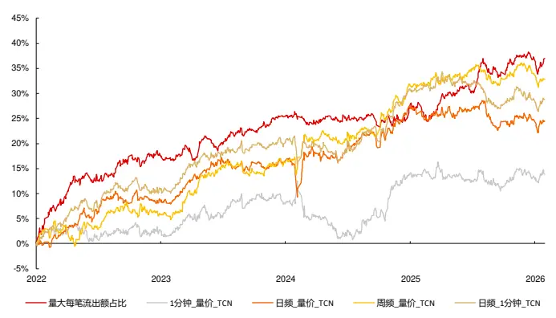
资料来源：天软科技，长江证券研究所

表 5：深度学习因子超额收益相关性
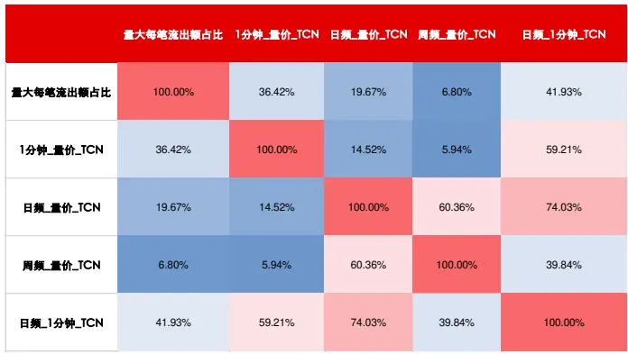
资料来源：天软科技，长江证券研究所

相对于遗传算法：遗传算法通过算子组合的穷举，遍历信息的组合路径，从中找到有效的选股路径，可以做到信息的差异，但整个过程均基于统计，没有辅以逻辑，会遍历较多无效组合路径，降低挖掘效率，也容易在收益来源的区分上产生偏差。

数据变换——K 线聚合算子方法可以从已有的经典因子逻辑出发，有倾向性的挖掘某类收益来源的因子，同时又具备一定的量产挖掘能力。

## 简单逻辑的扩充2

本文从残差波动率这一经典价格稳定性因子出发，分别提升频率、扩充维度两个方面，构建以下匹配逻辑的衍生因子：

高频残差波动率：30 分钟频率下个股收益率和三因子收益率的时间序列回归残差波动率；

- 残差成交量波动率：个股成交占比和全市场成交占比的时间序列回归残差波动率；

残差振幅波动率：个股振幅和市场（中证全指）振幅的时间序列回归残差波动率。下表展示了全市场和沪深 300 内，上述因子和风格因子的相关性：高频残差波动率、残差振幅波动率属于低波收益来源，残差成交量波动率和其他因子相关性较低。

表 6：全市场匹配因子和风格因子相关性

| 高频残差波动率 残差成交量波动率残差振幅波动率 波动率 |  |  |  |  | 规模 | 动量 | 反转 | BP | DP | 换手率 | 成长 | 盈利 |
| --- | --- | --- | --- | --- | --- | --- | --- | --- | --- | --- | --- | --- |
| 高频残差波动率 | 100.00% | 43.85% | 87.44% 89.32% |  | -10.98% | 25.39% | 36.91% | -36.17% | -25.94% | 60.39% | -1.13% | -4.86% |
| 残差成交量波动率 | 43.85% | 100.00% | 56.02% | 36.51% | -26.33% | -2.13% | 27.50% | -9.50% | -13.49% | 18.69% | -2.37% | -6.93% |
| 残差振幅波动率 | 87.44% | 56.02% | 100.00% | 79.75% | -22.67% | 19.11% | 34.73% | -29.47% | -25.75% | 55.84% | -1.96% | -7.07% |
| 波动率 | 89.32% | 36.51% | 79.75% | 100.00% | -14.73% | 23.28% | 35.46% | -34.86% | -24.56% | 63.83% | -0.91% | -4.25% |
| 规模 | -10.98% | -26.33% | -22.67% | -14.73% | 100.00% | 13.01% | 5.89% | 16.85% | 25.62% | -30.51% | 1.70% | 9.71% |
| 动量 | 25.39% | -2.13% | 19.11% | 23.28% | 13.01% | 100.00% | -2.62% | -25.30% | -8.56% | 19.09% | 2.44% | 5.09% |
| 反转 | 36.91% | 27.50% | 34.73% 35.46% |  | 5.89% | -2.62% | 100.00% | -10.04% | -3.30% | 23.25% | 0.46% 0.81% |  |
| BP | -36.17% | -9.50% | -29.47% | -34.86% | 16.85% | -25.30% | -10.04% | 100.00% | 34.50% | -25.13% | 0.00% 0.54% |  |
| DP | -25.94% | -13.49% | -25.75% -24.56% |  | 25.62% | -8.56% | -3.30% | 34.50% | 100.00% | -20.10% | 1.99% | 11.31% |
| 换手率 | 60.39% | 18.69% | 55.84% | 63.83% | -30.51% | 19.09% | 23.25% | -25.13% | -20.10% | 100.00% | -0.53% -3.76% |  |
| 成长 | -1.13% | -2.37% -1.96% -0.91% |  |  | 1.70% 2.44% |  | 0.46% 0.00% |  | 1.99% | -0.53% | 100.00% | 7.59% |
| 盈利 | -4.86% | -6.93% -7.07% |  | -4.25% | 9.71% 5.09% 0.81% |  |  | 0.54% | 11.31% | -3.76% | 7.59% | 100.00% |

资料来源：天软科技，长江证券研究所

表 7：沪深 300 匹配因子和风格因子相关性

| 高频残差波动率 残差成交量波动率 残差振幅波动率 波动率 |  |  |  |  | 规模 | 动量 | 反转 | BP | DP | 换手率 | 成长 | 盈利 |
| --- | --- | --- | --- | --- | --- | --- | --- | --- | --- | --- | --- | --- |
| 高频残差波动率 | 100.00% | 29.74% | 84.07% | 89.38% | -16.51% | 21.32% | 29.68% | -43.50% | -35.11% | 53.87% | 2.08% | 3.02% |
| 残差成交量波动率 | 29.74% | 100.00% | 44.66% | 24.55% | -15.96% | -7.71% | 21.20% | 5.91% | -7.06% | 9.42% | -4.63% | -17.99% |
| 残差振幅波动率 | 84.07% | 44.66% | 100.00% | 76.35% | -19.38% | 14.61% | 28.82% | -27.54% | -30.07% | 46.92% | -0.44% | -5.35% |
| 波动率 | 89.38% | 24.55% | 76.35% | 100.00% | -15.12% | 20.16% | 29.31% | -41.93% | -31.67% | 55.80% | 2.25% | 4.89% |
| 规模 | -16.51% -15.96% |  | -19.38% | -15.12% | 100.00% | 25.37% | 10.78% | 17.06% | 27.30% | -34.23% | 3.51% | 19.48% |
| 动量 | 21.32% | -7.71% | 14.61% | 20.16% | 25.37% | 100.00% | 2.20% | -18.58% | -6.86% | 10.63% | 10.55% | 18.63% |
| 反转 | 29.68% | 21.20% | 28.82% 29.31% |  | 10.78% | 2.20% | 100.00% | -6.90% | -2.53% | 15.05% | 1.14% | 2.83% |
| BP | -43.50% | 5.91% | -27.54% | -41.93% | 17.06% | -18.58% | -6.90% | 100.00% | 44.16% | -29.02% | -5.44% | -27.13% |
| DP | -35.11% | -7.06% | -30.07% | -31.67% | 27.30% | -6.86% | -2.53% | 44.16% | 100.00% | -28.61% | -1.17% | 22.66% |
| 换手率 | 53.87% | 9.42% | 46.92% | 55.80% | -34.23% | 10.63% | 15.05% | -29.02% | -28.61% | 100.00% | 4.96% | -1.79% |
| 成长 | 2.08% | -4.63% | -0.44% 2.25% 3.51% 10.55% |  |  |  | 1.14% | -5.44% | -1.17% | 4.96% | 100.00% | 22.13% |
| 盈利 | 3.02% | -17.99% | -5.35% | 4.89% | 19.48% 18.63% |  | 2.83% | -27.13% | 22.66% | -1.79% 22.13% |  | 100.00% |

资料来源：天软科技，长江证券研究所

下图给出了三个因子在市值行业中性和量价中性（市值、行业、波动率、换手率）3后的累计 IC，并在下表中给出了各个板块不同时间段的 IC 统计：

高频残差波动率在市值行业中性累积 IC 最高，但在量价中性后累积 IC 最低，其收益来源主要为低波；

- 残差成交量波动率在沪深 300 内有较高的信息增量；

在 IC 统计表中以绿色标注了 2025 年以来下降的部分，2025 年以来各个因子 IC均衰减显著。

图 2：市值行业中性匹配因子累积IC
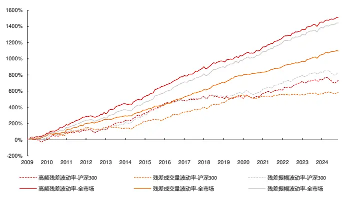
资料来源：天软科技，长江证券研究所

图 3：量价中性匹配因子累积 IC
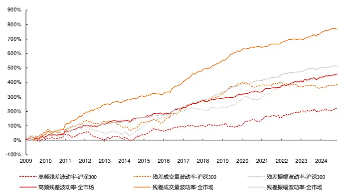
资料来源：天软科技，长江证券研究所

表 8：匹配因子 IC 统计

| 原始 |  |  |  |  | 市值行业中性 |  |  |  |  | 量价中性 |  |  |  |
| --- | --- | --- | --- | --- | --- | --- | --- | --- | --- | --- | --- | --- | --- |
|  |  | IC | ICIR | IC-2025 | ICIR-2025 | IC | ICIR | IC-2025 | ICIR-2025 | IC | ICIR | IC-2025 | ICIR-2025 |
| 沪深 | 高频残差波动率 | 4.55% | 23.67% | -0.16% | -0.63% | 3.84% | 33.24% | -1.23% | -8.35% | 1.16% | 16.20% | 1.88% | 30.01% |
| 300 | 残差成交量波动率 | 3.04% | 23.57% | 1.13% | 11.71% | 3.06% | 36.79% | 1.74% | 24.42% | 2.01% | 24.89% | 2.38% | 49.82% |
|  | 残差振幅波动率 | 5.08% | 29.63% | 0.13% | 0.53% | 4.34% | 40.37% | -0.97% | -6.46% | 2.39% | 33.51% | 1.86% | 34.64% |
| 中证 | 高频残差波动率 | 5.98% | 40.18% | 0.91% | 5.26% | 5.55% | 52.71% | -0.80% | -7.79% | 1.41% | 22.20% | 1.33% | 21.04% |
| 500 | 残差成交量波动率 | 4.04% | 40.76% | 2.85% | 24.48% | 4.13% | 52.08% | 1.39% | 12.61% | 2.96% | 40.80% | 2.11% | 26.37% |
|  | 残差振幅波动率 | 6.08% | 46.91% | 1.50% | 8.76% | 5.51% | 55.59% | -0.31% | -2.84% | 2.19% | 32.75% | 1.89% | 29.18% |
| 中证 1000 | 高频残差波动率 | 7.94% | 56.46% | 4.47% | 30.59% | 7.32% | 68.56% | 2.84% | 31.04% | 1.95% | 36.78% | 0.49% | 17.75% |
|  | 残差成交量波动率 | 5.56% | 65.59% | 2.86% | 42.03% | 5.49% | 77.25% | 2.02% | 35.76% | 4.10% | 62.34% | 1.37% | 28.85% |
|  | 残差振幅波动率 | 7.78% | 59.95% | 4.87% | 35.03% | 7.19% | 70.99% | 3.38% | 37.31% | 2.72% | 45.18% | 1.29% | 37.46% |
| 中证 | 高频残差波动率 | 7.71% | 56.83% | 6.35% | 55.48% | 7.94% | 76.49% | 5.87% | 66.78% | 2.40% | 51.15% | 2.58% | 103.53% |
| 全指 | 残差成交量波动率 | 4.43% | 49.18% | 3.33% | 43.18% | 5.76% | 84.63% | 4.95% | 77.91% | 4.02% | 65.60% | 3.20% | 68.25% |
|  | 残差振幅波动率 | 6.75% | 51.08% | 5.06% | 44.22% | 7.55% | 77.27% | 5.43% | 61.44% | 2.67% | 51.16% | 1.05% | 31.28% |

资料来源：天软科技，长江证券研究所

下图给出了全市场范围内市值行业中性后残差成交量波动率、残差振幅波动率因子的分组净值，以及分年风险指标，两个因子均可以获得较为稳定的超额、多空收益。

图 4：全市场市值行业中性残差成交量波动率因子分组净值

资料来源：天软科技，长江证券研究所

图 5：全市场市值行业中性残差振幅波动率因子分组净值
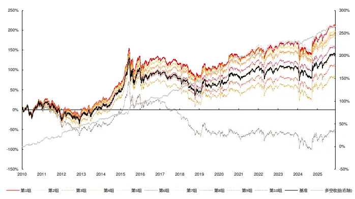
资料来源：天软科技，长江证券研究所

表 9：全市场市值行业中性残差成交量波动率、残差振幅波动率因子分组风险指标

| 残差成交量波动率 |  |  |  |  |  |  | 残差振幅波动率 |  |  |  |
| --- | --- | --- | --- | --- | --- | --- | --- | --- | --- | --- |
|  | 超额收益 | 超额最大回撤 | 信息比 | 超额胜率 | 超额盈亏比 | 超额收益 | 超额最大回撤 | 信息比 | 超额胜率 | 超额盈亏比 |
| 2010 | 4.79% | -3.15% | 1.18 | 50.00% | 2.55 | 3.91% | -3.32% | 0.87 | 66.67% | 2.55 |
| 2011 | 2.19% | -2.36% | 0.59 | 58.33% | 1.90 | 8.16% | -2.85% | 2.35 | 58.33% | 6.02 |
| 2012 | 4.32% | -3.63% | 1.14 | 58.33% | 2.06 | 4.08% | -1.70% | 1.56 | 66.67% | 3.38 |
| 2013 | 5.00% | -3.14% | 1.35 | 66.67% | 2.60 | 5.50% | -4.34% | 1.58 | 75.00% | 2.69 |
| 2014 | 1.87% | -1.82% | 0.56 | 50.00% | 1.86 | 9.37% | -1.31% | 3.15 | 91.67% | 10.44 |
| 2015 | 12.48% | -3.00% | 2.19 | 66.67% | 8.22 | 10.33% | -6.72% | 1.14 | 58.33% | 3.38 |
| 2016 | 6.14% | -2.99% | 1.27 | 50.00% | 3.24 | 9.07% | -3.56% | 2.17 | 100.00% |  |
| 2017 | 1.23% | -3.72% | 0.37 | 50.00% | 1.35 | 1.78% | -2.46% | 0.71 | 41.67% | 1.63 |
| 2018 | 2.28% | -3.51% | 0.50 | 58.33% | 1.78 | 3.59% | -3.07% | 1.16 | 75.00% | 2.13 |
| 2019 | 5.37% | -2.03% | 1.71 | 75.00% | 4.04 | 0.19% | -3.81% | 0.06 | 66.67% | 1.04 |
| 2020 | 3.66% | -10.96% | 0.41 | 66.67% | 1.82 | 1.78% | -10.09% | 0.20 | 50.00% | 1.32 |
| 2021 | -0.80% | -4.97% | -0.20 | 50.00% | 0.82 | 4.04% | -6.40% | 0.82 | 50.00% | 1.68 |
| 2022 | 8.66% | -1.70% | 2.33 | 75.00% | 6.97 | 4.18% | -3.52% | 0.90 | 33.33% | 1.96 |
| 2023 | 7.01% | -1.96% | 2.26 | 75.00% | 7.09 | 10.99% | -1.64% | 3.02 | 75.00% | 11.75 |
| 2024 | 4.73% | -13.27% | 0.51 | 66.67% | 1.59 | 4.49% | -5.28% | 0.93 | 50.00% | 1.87 |
| 2025 | 3.21% | -3.85% | 0.81 | 66.67% | 1.65 | 0.06% | -5.31% | 0.01 | 50.00% | 1.01 |
| 总计 | 4.65% | -13.27% | 0.91 | 61.46% | 2.36 | 5.25% | -10.09% | 1.06 | 63.02% | 2.50 |

资料来源：天软科技，长江证券研究所

下图分别展示了量价中性后残差成交量波动率、残差振幅波动率在各个板块的超额收益净值，并于下表中给出了全区间表现的风险指标，在因子剥离波动率、换手率后，因子的超额收益和多空收益下降显著。

图 6：量价中性残差成交量波动率因子超额净值
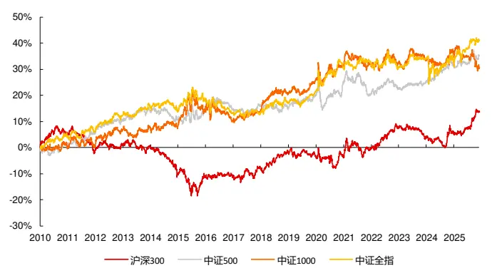
资料来源：天软科技，长江证券研究所

图 7：量价中性残差振幅波动率因子超额净值
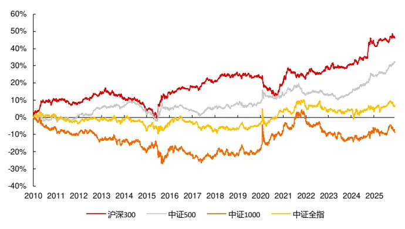
资料来源：天软科技，长江证券研究所

表 10：量价中性匹配因子风险指标

| 因子 | 板块 | 超额收益 超额最大回撤 |  | 信息比 | 超额胜率 | 超额盈亏比 多空收益 多空最大回撤 多空信息比 |  |  |  | 多空胜率 | 多空盈亏比 |
| --- | --- | --- | --- | --- | --- | --- | --- | --- | --- | --- | --- |
| 残差成交量 波动率 | 沪深300 | 0.94% | -23.41% | 0.20 | 48.44% | 1.16 | 3.48% | -34.95% | 0.48 | 53.13% | 1.40 |
|  | 中证500 | 2.38% | -12.96% | 0.53 | 61.46% | 1.49 | 8.00% | -9.93% | 1.13 | 61.46% | 2.23 |
|  | 中证1000 | 2.04% | -11.10% | 0.34 | 47.92% | 1.32 | 13.77% | -16.69% | 1.47 | 65.10% | 3.21 |
|  | 中证全指 | 2.74% | -11.85% | 0.51 | 58.33% | 1.56 | 13.32% | -11.03% | 1.63 | 69.27% | 3.48 |
| 残差振幅波 动率 | 沪深300 | 3.06% | -16.38% | 0.68 | 51.56% | 1.62 | 5.75% | -35.74% | 0.82 | 56.77% | 1.69 |
|  | 中证500 | 2.10% | -11.49% | 0.51 | 55.21% | 1.49 | 4.86% | -15.16% | 0.75 | 60.94% | 1.72 |
|  | 中证1000 | -0.53% | -23.71% | -0.09 | 47.92% | 0.93 | 5.99% | -17.84% | 0.67 | 56.77% | 1.63 |
|  | 中证全指 | 0.45% | -12.04% | 0.09 | 54.17% | 1.08 | 6.76% | -10.72% | 0.99 | 61.46% | 2.22 |

资料来源：天软科技，长江证券研究所

## 上述案例说明：

从已有因子逻辑出发对应到算子，在维度扩充后可以得到一些有区别且有效的选股因子；

简单逻辑的复制和已有因子相关性较高，仍需要丰富超参以挖掘增量信息。

## 成交匹配波动因子

## 多维度匹配

根据得到因子的最后一步是时序 K 线算子还是匹配 K 线算子，可以将数据变换——K线聚合算子挖掘方法分为两类，以匹配 K 线算子结尾得到的因子，称为维度匹配因子。匹配 K 线算子需要在最后一步得到两个或多个维度的数据，本文以两个维度为例，从最简单的量价维度出发，列出基本维度的匹配表格，其中两个维度之间可以采用 R 方、残差波动率、相关性、加权求和等算子得到因子：

表 11：高频因子维度匹配

|  | 收益率 | 振幅 | 波动率 | 成交量 | 量价相关性 | 收盘价 |
| --- | --- | --- | --- | --- | --- | --- |
| 收益率（已实现收益） |  | 风险利得 | 风险利得 | 流动性影响下收益率 | 交易利得 |  |
| 振幅（价格路径，波 动) | 风险利得 |  | 风险一致性 | 风险偏好 | 交易非理性风险关系 |  |
| 波动率（风险，价格稳 定性) | 风险利得 | 风险一致性 |  | 风险偏好 | 交易非理性风险关系 | 风险偏好 |
| 成交量（流动性，成交 额、每笔成交额同） | 流动性影响下收益率 | 流动性风险一致性 | 流动性风险一致性 | 成交一致性 |  | 筹码分布 |
| 量价相关性（交易拥挤 度) | 交易利得 | 交易非理性风险关系 | 交易非理性风险关系 |  |  |  |
| 收盘价（定价，交易成 本) |  |  | 风险偏好 | 筹码分布 |  |  |

资料来源：长江证券研究所

## 成交匹配波动因子构建

本文通过遍历上述表格维度匹配的计算，构建有较为明显信息增量的成交匹配波动因子：

1． 每笔成交量：匹配变化算子——除法（成交量，成交笔数）；

2． 成交量和：时序 K 线算子——求和（成交量）；

3． 成交量占比：匹配变化算子——除法（成交量，成交量和）；

4． 成交匹配波动：匹配 K 线算子——回归残差波动率（每笔成交量，成交量占比）。

下表分别给出了沪深 300 和全市场范围内，成交匹配波动因子和风格因子的相关性，因子主要和波动率、换手率因子相关性较高，即属于低波收益来源，同时和规模因子呈一定的负相关，偏小市值。

表 12：沪深 300 成交匹配波动因子和风格因子相关性

| 成交匹配波动率 波动率 |  |  | 规模 | 动量 | 反转 | BP | DP | 换手率 | 成长 | 盈利 |
| --- | --- | --- | --- | --- | --- | --- | --- | --- | --- | --- |
| 成交匹配波动率 | 100.00% | 40.63% | -17.45% | -5.28% | 16.21% | -5.88% | -22.63% | 46.47% | -0.28% | -21.60% |
| 波动率 | 40.63% | 100.00% | -15.12% | 20.16% | 29.31% | -41.93% | -31.67% | 55.80% | 2.25% | 4.89% |
| 规模 | -17.45% | -15.12% | 100.00% | 25.37% | 10.78% | 17.06% | 27.30% | -34.23% | 3.51% | 19.48% |
| 动量 | -5.28% | 20.16% | 25.37% | 100.00% | 2.20% | -18.58% | -6.86% | 10.63% 10.55% |  | 18.63% |
| 反转 | 16.21% | 29.31% | 10.78% | 2.20% | 100.00% | -6.90% | -2.53% | 15.05% | 1.14% | 2.83% |
| BP | -5.88% | -41.93% | 17.06% | -18.58% | -6.90% | 100.00% | 44.16% | -29.02% | -5.44% | -27.13% |
| DP | -22.63% | -31.67% | 27.30% | -6.86% | -2.53% | 44.16% | 100.00% | -28.61% | -1.17% | 22.66% |
| 换手率 | 46.47% | 55.80% | -34.23% | 10.63% | 15.05% | -29.02% -28.61% |  | 100.00% | 4.96% | -1.79% |
| 成长 | -0.28% | 2.25% | 3.51% | 10.55% 1.14% |  | -5.44% | -1.17% | 4.96% | 100.00% | 22.13% |
| 盈利 | -21.60% | 4.89% | 19.48% 18.63% |  | 2.83% | -27.13% | 22.66% | -1.79% | 22.13% | 100.00% |

资料来源：天软科技，长江证券研究所

表 13：全市场成交匹配波动因子和风格因子相关性

|  | 成交匹配波动率 波动率 |  | 规模 | 动量 | 反转 | BP | DP | 换手率 | 成长 盈利 |  |
| --- | --- | --- | --- | --- | --- | --- | --- | --- | --- | --- |
| 成交匹配波动率 | 100.00% | 52.45% | -34.91% | 2.02% | 26.72% | -14.88% | -23.03% | 42.43% | -2.53% | -11.44% |
| 波动率 | 52.45% | 100.00% | -14.73% | 23.28% | 35.46% | -34.86% | -24.56% | 63.83% | -0.91% | -4.25% |
| 规模 | -34.91% | -14.73% | 100.00% | 13.01% | 5.89% | 16.85% | 25.62% | -30.51% | 1.70% | 9.71% |
| 动量 | 2.02% | 23.28% | 13.01% | 100.00% | -2.62% | -25.30% | -8.56% | 19.09% | 2.44% 5.09% |  |
| 反转 | 26.72% | 35.46% | 5.89% | -2.62% | 100.00% | -10.04% | -3.30% | 23.25% | 0.46% 0.81% |  |
| BP | -14.88% | -34.86% | 16.85% | -25.30% | -10.04% | 100.00% | 34.50% | -25.13% | 0.00% 0.54% |  |
| DP | -23.03% | -24.56% | 25.62% | -8.56% | -3.30% | 34.50% | 100.00% | -20.10% | 1.99% | 11.31% |
| 换手率 | 42.43% | 63.83% | -30.51% | 19.09% | 23.25% | -25.13% | -20.10% | 100.00% | -0.53% | -3.76% |
| 成长 | -2.53% | -0.91% | 1.70% 2.44% 0.46% 0.00% |  |  |  | 1.99% | -0.53% | 100.00% | 7.59% |
| 盈利 | -11.44% | -4.25% | 9.71% 5.09% 0.81% 0.54% |  |  |  | 11.31% | -3.76% | 7.59% | 100.00% |

资料来源：天软科技，长江证券研究所

下图展示了成交匹配波动因子市值行业中性和量价中性后的累计 IC，并在下表中给出了各个板块不同时间段的 IC 统计：

量价中性后 IC 的信息量相对市值行业中性有一定下降；

2025 年后在沪深 300 和中证 500 内量价中性的 IC 更高。

图 8：市值行业中性成交匹配波动因子累积 IC
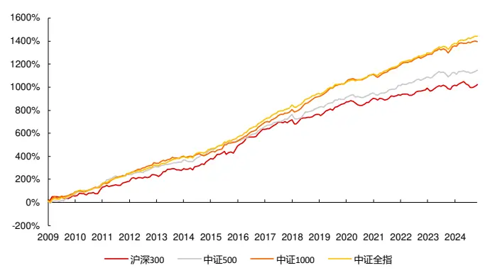
资料来源：天软科技，长江证券研究所

图 9：量价中性成交匹配波动因子累积 IC
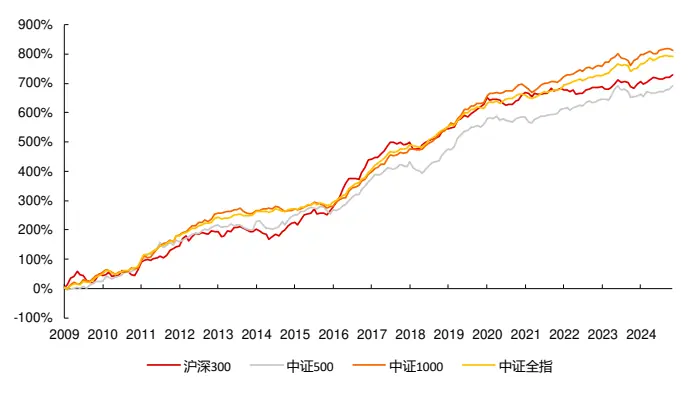
资料来源：天软科技，长江证券研究所

表 14：成交匹配波动因子 IC统计

| 原始 |  |  |  |  | 市值行业中性 |  |  |  |  | 量价中性 |  |  |  |
| --- | --- | --- | --- | --- | --- | --- | --- | --- | --- | --- | --- | --- | --- |
|  | IC | ICIR | IC-2025 | ICIR-2025 | IC | ICIR | IC-2025 | ICIR-2025 |  | IC | ICIR | IC-2025 | ICIR-2025 |
| 沪深300 | 6.82% | 38.55% | 2.42% | 11.18% | 5.35% |  | 44.84% | 1.30% | 10.20% | 3.81% | 39.81% | 2.70% | 46.33% |
| 中证500 | 6.40% | 50.77% | 3.07% | 19.19% | 6.01% | 59.91% | 1.75% |  | 14.23% | 3.63% | 42.19% | 3.19% | 43.74% |
| 中证1000 | 7.33% | 67.16% | 5.17% | 44.13% | 7.31% | 79.54% |  | 4.19% | 47.72% | 4.25% | 57.83% | 2.63% | 37.77% |
| 中证全指 | 5.94% | 52.10% | 4.49% | 39.86% | 7.55% | 89.62% | 6.50% |  | 72.10% | 4.15% | 67.24% | 3.63% | 61.61% |

资料来源：天软科技，长江证券研究所

下图给出了量价中性后的成交匹配波动因子在沪深 300 内的分组净值，并在下表中给出了分年的风险指标：

- 除 2014、2023 年外，因子均可获得超额收益；

- 因子在多头和空头的收益上较为均匀。

图 10：沪深 300量价中性成交匹配波动因子分组净值
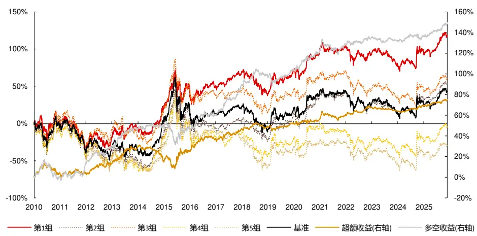
资料来源：天软科技，长江证券研究所

表 15：沪深 300量价中性成交匹配波动因子风险指标

|  | 超额收益 | 超额最大回撤 | 信息比 | 超额胜率 | 超额盈亏比 | 多空收益 | 多空最大回撤 | 多空信息比 | 多空胜率 | 多空盈亏比 |
| --- | --- | --- | --- | --- | --- | --- | --- | --- | --- | --- |
| 2010 | 3.91% | -10.88% | 0.46 | 66.67% | 1.33 | 0.66% | -17.93% | 0.06 | 66.67% | 1.04 |
| 2011 | 0.14% | -5.29% | 0.02 | 41.67% | 1.02 | 14.06% | -7.12% | 1.45 | 66.67% | 3.94 |
| 2012 | 9.83% | -3.57% | 1.41 | 58.33% | 3.43 | 16.48% | -4.20% | 1.98 | 75.00% | 5.32 |
| 2013 | 16.54% | -4.00% | 1.91 | 75.00% | 6.82 | 19.03% | -4.21% | 1.71 | 66.67% | 4.65 |
| 2014 | -11.94% | -14.72% | -1.78 | 33.33% | 0.27 | 2.93% | -4.80% | 0.35 | 66.67% | 1.49 |
| 2015 | 10.23% | -12.07% | 0.74 | 66.67% | 1.88 | -0.79% | -19.66% | -0.06 | 58.33% | 0.95 |
| 2016 | 12.30% | -4.01% | 1.59 | 75.00% | 4.45 | 12.76% | -4.73% | 1.47 | 66.67% | 3.07 |
| 2017 | 10.16% | -3.80% | 1.65 | 75.00% | 4.24 | 33.26% | -3.06% | 3.73 | 83.33% | 35.09 |
| 2018 | 2.86% | -5.93% | 0.65 | 58.33% | 1.52 | 11.24% | -6.53% | 1.44 | 75.00% | 3.22 |
| 2019 | 3.24% | -5.47% | 0.72 | 75.00% | 1.73 | 5.26% | -11.16% | 0.67 | 83.33% | 1.65 |
| 2020 | 2.69% | -3.85% | 0.45 | 58.33% | 1.54 | 17.47% | -4.69% | 1.81 | 75.00% | 7.93 |
| 2021 | 4.13% | -8.30% | 0.77 | 50.00% | 1.77 | 8.27% | -13.87% | 0.86 | 41.67% | 1.98 |
| 2022 | 8.50% | -2.59% | 1.78 | 58.33% | 3.69 | 6.14% | -4.26% | 0.82 | 41.67% | 2.18 |
| 2023 | -3.60% | -3.86% | -1.19 | 33.33% | 0.42 | -2.80% | -5.89% | -0.55 | 25.00% | 0.63 |
| 2024 | 5.55% | -1.82% | 1.33 | 66.67% | 3.16 | 4.49% | -5.49% | 0.68 | 58.33% | 1.61 |
| 2025 | 6.26% | -2.07% | 1.49 | 83.33% | 6.29 | 15.17% | -2.61% | 2.19 | 83.33% | 9.36 |
| 总计 | 5.05% | -20.60% | 0.72 | 60.94% | 1.82 | 10.31% | -19.66% | 1.09 | 64.58% | 2.43 |

资料来源：天软科技，长江证券研究所

下图给出了量价中性后的成交匹配波动因子在中证 500 内的分组净值，并在下表中给出了分年的风险指标：

- 除 2010、2014、2023 年外，因子均可获得超额收益；

图 11：中证 500量价中性成交匹配波动因子分组净值
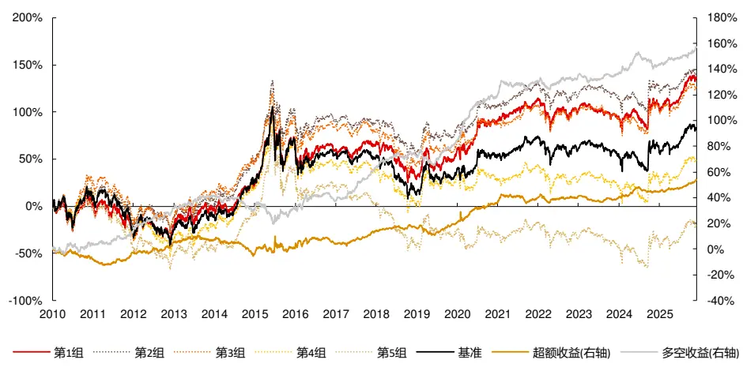
资料来源：天软科技，长江证券研究所

表 16：中证 500量价中性成交匹配波动因子风险指标

|  | 超额收益 | 超额最大回撤 | 信息比 | 超额胜率 | 超额盈亏比 | 多空收益 | 多空最大回撤 | 多空信息比 | 多空胜率 | 多空盈亏比 |
| --- | --- | --- | --- | --- | --- | --- | --- | --- | --- | --- |
| 2010 | -7.75% | -8.54% | -1.39 | 16.67% | 0.25 | 3.31% | -7.09% | 0.38 | 33.33% | 1.41 |
| 2011 | 5.75% | -4.85% | 1.27 | 58.33% | 2.29 | 11.53% | -2.86% | 1.70 | 75.00% | 5.63 |
| 2012 | 8.03% | -2.76% | 1.65 | 66.67% | 2.45 | 19.48% | -4.42% | 2.75 | 83.33% | 3.70 |
| 2013 | 1.90% | -4.19% | 0.34 | 41.67% | 1.63 | 10.08% | -3.40% | 1.18 | 75.00% | 6.57 |
| 2014 | -10.56% | -13.67% | -2.06 | 25.00% | 0.16 | -10.81% | -11.88% | -1.73 | 25.00% | 0.22 |
| 2015 | 4.59% | -11.61% | 0.41 | 50.00% | 1.44 | 1.38% | -15.76% | 0.12 | 50.00% | 1.08 |
| 2016 | 4.08% | -5.13% | 0.61 | 50.00% | 1.40 | 6.24% | -6.76% | 0.69 | 50.00% | 1.61 |
| 2017 | 10.04% | -2.66% | 2.38 | 91.67% | 15.28 | 29.43% | -1.78% | 3.96 | 83.33% | 19.68 |
| 2018 | 2.90% | -2.94% | 0.89 | 75.00% | 1.89 | 10.25% | -5.21% | 1.44 | 75.00% | 3.50 |
| 2019 | 3.36% | -7.60% | 0.68 | 66.67% | 1.46 | 11.46% | -11.35% | 1.30 | 58.33% | 1.94 |
| 2020 | 17.34% | -6.95% | 1.93 | 83.33% | 16.81 | 43.23% | -4.43% | 3.51 | 83.33% | 26.10 |
| 2021 | 3.89% | -6.88% | 0.75 | 58.33% | 1.56 | 12.11% | -7.41% | 1.47 | 58.33% | 2.45 |
| 2022 | 0.69% | -6.59% | 0.15 | 66.67% | 1.10 | 3.09% | -9.00% | 0.43 | 66.67% | 1.43 |
| 2023 | -1.08% | -5.00% | -0.37 | 58.33% | 0.81 | 1.92% | -6.79% | 0.37 | 66.67% | 1.30 |
| 2024 | 5.30% | -4.69% | 1.22 | 58.33% | 2.07 | 8.06% | -12.50% | 1.01 | 66.67% | 1.74 |
| 2025 | 8.86% | -1.98% | 2.48 | 66.67% | 4.20 | 13.54% | -2.49% | 2.22 | 66.67% | 7.25 |
| 总计 | 3.53% | -14.85% | 0.59 | 58.33% | 1.56 | 10.74% | -20.17% | 1.26 | 63.54% | 2.38 |

资料来源：天软科技，长江证券研究所

下图给出了量价中性后的成交匹配波动因子在中证 1000 内的分组净值，并在下表中给出了分年的风险指标：

- 因子超额收益为负的年份较多；

图 12：中证 1000量价中性成交匹配波动因子分组净值
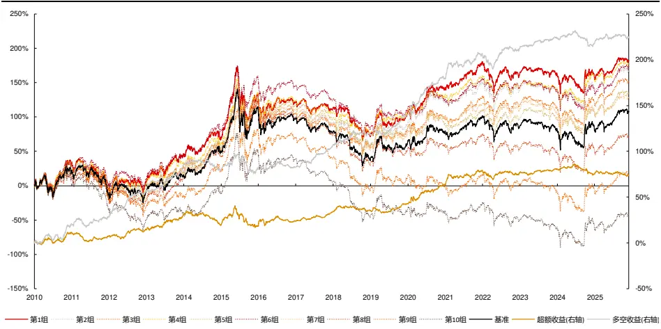
资料来源：天软科技，长江证券研究所

表 17：中证 1000量价中性成交匹配波动因子风险指标

|  | 超额收益 | 超额最大回撤 | 信息比 | 超额胜率 | 超额盈亏比 | 多空收益 | 多空最大回撤 | 多空信息比 | 多空胜率 | 多空盈亏比 |
| --- | --- | --- | --- | --- | --- | --- | --- | --- | --- | --- |
| 2010 | 12.19% | -6.28% | 1.61 | 75.00% | 2.47 | 22.57% | -7.45% | 2.04 | 58.33% | 2.80 |
| 2011 | -3.92% | -9.94% | -0.72 | 58.33% | 0.61 | 8.32% | -9.59% | 0.97 | 66.67% | 2.01 |
| 2012 | 7.00% | -4.73% | 1.26 | 58.33% | 2.06 | 31.82% | -5.19% | 3.53 | 83.33% | 6.73 |
| 2013 | 17.12% | -3.16% | 2.25 | 66.67% | 9.98 | 33.08% | -4.04% | 3.24 | 83.33% | 21.36 |
| 2014 | -9.98% | -14.21% | -1.57 | 33.33% | 0.36 | -5.28% | -12.51% | -0.65 | 41.67% | 0.56 |
| 2015 | -1.51% | -21.31% | -0.14 | 58.33% | 0.94 | 1.28% | -19.24% | 0.11 | 58.33% | 1.06 |
| 2016 | 6.30% | -7.13% | 0.82 | 58.33% | 1.84 | 2.44% | -7.38% | 0.31 | 50.00% | 1.27 |
| 2017 | 10.33% | -2.79% | 2.71 | 75.00% | 4.22 | 26.13% | -3.07% | 3.70 | 75.00% | 10.66 |
| 2018 | 1.88% | -6.08% | 0.37 | 50.00% | 1.29 | 14.38% | -6.59% | 1.39 | 75.00% | 3.89 |
| 2019 | 7.42% | -5.64% | 1.52 | 66.67% | 2.48 | 23.06% | -6.88% | 2.65 | 66.67% | 6.91 |
| 2020 | 23.07% | -4.34% | 2.26 | 75.00% | 6.41 | 49.07% | -8.16% | 2.99 | 83.33% | 15.80 |
| 2021 | 16.98% | -4.20% | 2.28 | 75.00% | 3.43 | 30.90% | -6.33% | 2.67 | 66.67% | 5.54 |
| 2022 | -3.46% | -9.82% | -0.49 | 66.67% | 0.68 | 5.12% | -16.20% | 0.43 | 66.67% | 1.29 |
| 2023 | 5.03% | -3.76% | 1.10 | 66.67% | 2.12 | 13.38% | -2.91% | 1.96 | 75.00% | 4.85 |
| 2024 | -5.80% | -11.34% | -1.03 | 50.00% | 0.49 | -6.92% | -16.13% | -0.85 | 41.67% | 0.61 |
| 2025 | 0.10% | -6.05% | 0.02 | 33.33% | 1.01 | 10.05% | -5.72% | 1.33 | 66.67% | 2.30 |
| 总计 | 5.00% | -21.31% | 0.71 | 60.42% | 1.56 | 15.92% | -19.24% | 1.54 | 66.15% | 2.70 |

资料来源：天软科技，长江证券研究所

下图给出了量价中性后的成交匹配波动因子在中证 1000 内的分组净值，并在下表中给出了分年的风险指标：

- 除 2011、2014、2024 年外，因子均可获得超额收益；

从超额最大回撤上看，因子表现较为平稳，从多空最大回撤上看，因子的失效区间主要集中在 2015 和 2024 年；

图 13：全市场量价中性成交匹配波动因子分组净值
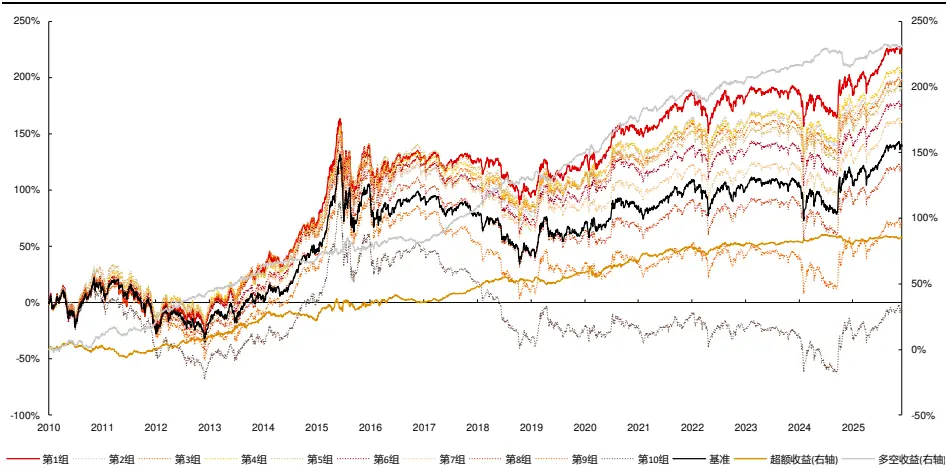
资料来源：天软科技，长江证券研究所

表 18：全市场量价中性成交匹配波动因子风险指标

|  | 超额收益 | 超额最大回撤 | 信息比 | 超额胜率 | 超额盈亏比 | 多空收益 | 多空最大回撤 | 多空信息比 | 多空胜率 | 多空盈亏比 |
| --- | --- | --- | --- | --- | --- | --- | --- | --- | --- | --- |
| 2010 | 2.70% | -7.52% | 0.47 | 75.00% | 1.45 | 12.19% | -5.74% | 1.47 | 66.67% | 2.46 |
| 2011 | -2.07% | -9.08% | -0.46 | 58.33% | 0.77 | 9.43% | -6.76% | 1.44 | 83.33% | 2.73 |
| 2012 | 9.25% | -3.76% | 2.03 | 66.67% | 3.68 | 27.21% | -3.02% | 4.07 | 83.33% | 14.51 |
| 2013 | 15.94% | -4.14% | 2.31 | 91.67% | 8.96 | 20.41% | -3.11% | 2.69 | 75.00% | 21.86 |
| 2014 | -1.77% | -7.18% | -0.34 | 41.67% | 0.80 | 5.60% | -3.83% | 0.97 | 66.67% | 2.50 |
| 2015 | 12.35% | -9.29% | 1.10 | 58.33% | 1.76 | 10.65% | -10.43% | 1.10 | 66.67% | 1.95 |
| 2016 | 2.31% | -6.13% | 0.42 | 50.00% | 1.36 | 3.47% | -5.15% | 0.55 | 58.33% | 1.55 |
| 2017 | 12.08% | -1.87% | 3.86 | 91.67% | 68.50 | 29.71% | -1.25% | 4.57 | 100.00% | -inf |
| 2018 | 5.09% | -4.47% | 1.23 | 58.33% | 2.45 | 24.70% | -5.89% | 2.72 | 91.67% | 8.76 |
| 2019 | 6.00% | -5.51% | 1.55 | 75.00% | 2.37 | 21.88% | -7.16% | 3.15 | 75.00% | 6.07 |
| 2020 | 9.60% | -7.99% | 1.14 | 66.67% | 3.12 | 27.12% | -5.87% | 2.45 | 75.00% | 5.76 |
| 2021 | 11.69% | -3.18% | 2.59 | 75.00% | 4.60 | 26.75% | -4.36% | 3.52 | 83.33% | 9.93 |
| 2022 | 1.22% | -6.49% | 0.20 | 58.33% | 1.18 | 6.87% | -8.81% | 0.75 | 58.33% | 1.86 |
| 2023 | 2.57% | -2.47% | 0.86 | 58.33% | 1.73 | 13.23% | -2.38% | 2.53 | 83.33% | 6.58 |
| 2024 | -1.97% | -6.81% | -0.45 | 41.67% | 0.71 | -0.09% | -13.75% | -0.01 | 75.00% | 0.99 |
| 2025 | 5.78% | -2.74% | 1.57 | 50.00% | 6.22 | 17.10% | -3.57% | 2.58 | 83.33% | 7.92 |
| 总计 | 5.77% | -11.42% | 0.98 | 63.54% | 2.02 | 16.33% | -13.75% | 2.04 | 76.56% | 4.04 |

资料来源：天软科技，长江证券研究所

## 总结

高频因子的计算过程可拆解成若干个数据变换和 K 线聚合步骤。数据变换即对维度数据做函数映射，本质为交易信息的局部处理；K 线聚合即对维度数据按照一定频率进行聚合计算，本质为交易信息的局部整合，以将数据从高频降至低频。量价因子的最后一步均为 K 线聚合，低频量价因子无数据变换和 K 线聚合的交叉。相比深度学习，该方法可以侧重至局部信息；相比遗传算法，该方法可以更好对应收益来源。

由残差波动率的匹配逻辑可得残差成交量波动率和残差振幅波动率因子。以 2010 年以来中证全指内选股为例，市值行业中性后的残差成交量波动率和残差振幅波动率 IC 分别为 5.76%、7.55%，分组年化超额收益分别为 4.65%、5.25%，且基本每年超额收益均为正。但在量价中性后，两个因子的 IC 下降到 4.02%、2.67%，超额收益下降到 2.74%和 0.45%，且超额收益的时序稳定性显著下降。简单逻辑的复制挖掘的信息增量有限。

由匹配 K 线算子计算最后一步得到的因子称为维度匹配因子。本文通过残差波动率算子，对每笔成交额和成交量占比聚合，构建成交匹配波动因子。以沪深 300、中证 500、中证 1000 和中证全指范围内选股为例，量价中性后因子 IC 分别为 3.81%、3.63%、4.25%、4.15%，因子分组超额收益分别为 5.05%、3.53%、5.00%、5.77%，除中证 1000有 5 年超额收益为负，其余板块的超额收益时序上较为稳定。

## 风险提示

1、模型存在失效风险：市场的宏观环境会随经济运行发生变化，投资者的交易行为也会因市场的发展、局部博弈发生变化，若市场的定价模式发生改变，或导致模型的失效；

2、市场交易行为发生变化：影响以历史统计规律得到的因子的实际表现；

3、市场主题行情波动：主题分类不属于传统行业分类，市场交易聚集在局部形成的主题上时会加大策略波动；

4、本文举例均基于历史数据，不保证未来收益：量化模型均基于历史数据的回测，但样本外数据的分布和样本内或有较大变化，使预测收益和实际收益的对应关系产生波动。

## 投资评级说明

| 行业评级 |  | 报告发布日后的12个月内行业股票指数的涨跌幅相对同期相关证券市场代表性指数的涨跌幅为基准，投资建议的评 |  |
| --- | --- | --- | --- |
|  |  | 级标准为： |  |
|  | 看 好： |  | 相对表现优于同期相关证券市场代表性指数 |
|  | 中 | 性： | 相对表现与同期相关证券市场代表性指数持平 |
| 公司评级 | 看 | 淡： | 相对表现弱于同期相关证券市场代表性指数 |
|  |  |  | 报告发布日后的12个月内公司的涨跌幅相对同期相关证券市场代表性指数的涨跌幅为基准，投资建议的评级标准为： |
|  | 买 增 | 入： 持： | 相对同期相关证券市场代表性指数涨幅大于10% 相对同期相关证券市场代表性指数涨幅在5%～10%之间 |
|  | 中 | 性： | 相对同期相关证券市场代表性指数涨幅在-5%～5%之间 |
|  | 减 | 持： |  |
|  |  |  | 相对同期相关证券市场代表性指数涨幅小于-5% 无投资评级：由于我们无法获取必要的资料，或者公司面临无法预见结果的重大不确定性事件，或者其他原因，致使 |
| 相关证券市场代表性指数说明：A股市场以沪深300指数为基准；新三板市场以三板成指（针对协议转让标的）或三板做市指数 (针对做市转让标的）为基准；香港市场以恒生指数为基准。 |  | 我们无法给出明确的投资评级。 |  |

## 办公地址

[Tabl上海
Add /虹口区新建路 200 号国华金融中心 B 栋 22、23 层
P.C /（200080）
北京
Add /朝阳区景辉街 16 号院1号楼泰康集团大厦 23 层
P.C /（100020）
武汉
Add /武汉市江汉区淮海路 88号长江证券大厦 37 楼
P.C /（430023）
深圳
Add /深圳市福田区中心四路1号嘉里建设广场 3 期 36 楼
P.C /（518048）

## 分析师声明

本报告署名分析师以勤勉的职业态度，独立、客观地出具本报告。分析逻辑基于作者的职业理解，本报告清晰准确地反映了作者的研究观点。作者所得报酬的任何部分不曾与，不与，也不将与本报告中的具体推荐意见或观点而有直接或间接联系，特此声明。

## 法律主体声明

本报告由长江证券股份有限公司及/或其附属机构（以下简称「长江证券」或「本公司」）制作，由长江证券股份有限公司在中华人民共和国大陆地区发行。长江证券股份有限公司具有中国证监会许可的投资咨询业务资格，经营证券业务许可证编号为：10060000。本报告署名分析师所持中国证券业协会授予的证券投资咨询执业资格书编号已披露在报告首页的作者姓名旁。

在遵守适用的法律法规情况下，本报告亦可能由长江证券经纪（香港）有限公司在香港地区发行。长江证券经纪（香港）有限公司具有香港证券及期货事务监察委员会核准的“就证券提供意见”业务资格（第四类牌照的受监管活动），中央编号为：AXY608。本报告作者所持香港证监会牌照的中央编号已披露在报告首页的作者姓名旁。

## 其他声明

本报告并非针对或意图发送、发布给在当地法律或监管规则下不允许该报告发送、发布的人员。本公司不会因接收人收到本报告而视其为客户。本报告的信息均来源于公开资料，本公司对这些信息的准确性和完整性不作任何保证，也不保证所包含信息和建议不发生任何变更。本报告内容的全部或部分均不构成投资建议。本报告所包含的观点、建议并未考虑报告接收人在财务状况、投资目的、风险偏好等方面的具体情况，报告接收者应当独立评估本报告所含信息，基于自身投资目标、需求、市场机会、风险及其他因素自主做出决策并自行承担投资风险。本公司已力求报告内容的客观、公正，但文中的观点、结论和建议仅供参考，不包含作者对证券价格涨跌或市场走势的确定性判断。报告中的信息或意见并不构成所述证券的买卖出价或征价，投资者据此做出的任何投资决策与本公司和作者无关。本研究报告并不构成本公司对购入、购买或认购证券的邀请或要约。本公司有可能会与本报告涉及的公司进行投资银行业务或投资服务等其他业务(例如:配售代理、牵头经办人、保荐人、承销商或自营投资)。

本报告所包含的观点及建议不适用于所有投资者，且并未考虑个别客户的特殊情况、目标或需要，不应被视为对特定客户关于特定证券或金融工具的建议或策略。投资者不应以本报告取代其独立判断或仅依据本报告做出决策，并在需要时咨询专业意见。

本报告所载的资料、意见及推测仅反映本公司于发布本报告当日的判断，本报告所指的证券或投资标的的价格、价值及投资收入可升可跌，过往表现不应作为日后的表现依据；在不同时期，本公司可以发出其他与本报告所载信息不一致及有不同结论的报告；本报告所反映研究人员的不同观点、见解及分析方法，并不代表本公司或其他附属机构的立场；本公司不保证本报告所含信息保持在最新状态。同时，本公司对本报告所含信息可在不发出通知的情形下做出修改，投资者应当自行关注相应的更新或修改。本公司及作者在自身所知情范围内，与本报告中所评价或推荐的证券不存在法律法规要求披露或采取限制、静默措施的利益冲突。

本报告版权仅为本公司所有，本报告仅供意向收件人使用。未经书面许可，任何机构和个人不得以任何形式翻版、复制和发布给其他机构及/或人士（无论整份和部分）。如引用须注明出处为本公司研究所，且不得对本报告进行有悖原意的引用、删节和修改。刊载或者转发本证券研究报告或者摘要的，应当注明本报告的发布人和发布日期，提示使用证券研究报告的风险。本公司不为转发人及/或其客户因使用本报告或报告载明的内容产生的直接或间接损失承担任何责任。未经授权刊载或者转发本报告的，本公司将保留向其追究法律责任的权利。

本公司保留一切权利。