金融工程丨深度报告

[Table_Title]高频因子（十九）：收益来源基础的因子挖掘方法论二——时间段切割因子

## 报告要点

[Table_Summary] 高频因子的计算过程可拆解成若干个数据变换和 K线聚合的步骤，根据最后一步的 K线聚合时单维度聚合还是匹配聚合又可分为维度匹配和维度计算因子，本文就维度匹配方法中离散向量这一衍生，给出高频因子挖掘的讨论。

分析师及联系人

郑起SAC：S0490520060001

刘胜利SAC：S0490517070006SFC：BWH883

## [Table_Title 高频因子（十九）：收益来源基础的因子挖掘方2]法论二——时间段切割因子

[Table_Summary2] 在算子挖掘体系下，时间段划分因子本质为离散化向量处理

从数学形式上看，时间段切割因子是维度匹配因子的一个子类，只是在计算的最后一步中，匹配 K 线算子中存在离散的向量，而单维度聚合因子实际是匹配 K 线算子中离散向量为⃗1 的维度匹配因子；从达成的效果上看，离散下可以形成数据的划分，通过信息的钝化达到去噪的目的，还可以提取不同逻辑的信息，产生差异化因子。

以振幅边际异常为离散向量，以收益率为连续向量，得到振幅边际异常相对波动因子

以 2010 年以来在中证 800 和全市场范围内选股为例，市值行业中性后 IC 分别为 4.11%、5.56%，分组年化超额收益分别为 4.85%、6.53%，中证800 内因子多头空头较为均匀，全市场因子空头能力更强；在量价中性后 IC 下降到 2.88%、3.66%，超额收益下降到 3.97%和5.10%，因子空头能力更强，2025、2026年均有正超额收益。

以振幅边际异常为离散向量，以换手率为连续向量，得到振幅边际异常相对换手因子

以 2010 年以来在中证 800 和全市场范围内选股为例，市值行业中性后 IC 分别为 2.46%、3.68%，分组年化超额收益分别为 3.61%、4.80%，因子多头空头较为均匀；在量价中性后 IC下降到 1.69%、2.29%，超额收益下降到 2.94%和 3.00%，因子多头空头较为均匀，2025、2026年有一定回撤。

以价格为离散向量，以换手率为连续向量，得到振幅边际异常相对换手因子

以 2010 年以来在中证 800 和全市场范围内选股为例，市值行业中性后 IC 分别为 2.69%、3.70%，分组年化超额收益分别为 2.61%、4.16%；因子多头空头较为均匀；在量价中性后 IC下降到 2.33%、3.32%，超额收益下降到 2.03%和 3.46%，中证 800 内因子多头空头较为均匀，全市场因子空头能力更强，2025、2026年均有正超额收益。

金融工程丨深度报告

## 相关研究

[Table_Report] •《龙头锁筹、链条扩散与市值沉淀——美股 AI 基

础设施核心资产成交集中度研究》2026-05-30

- 《行业轮动（十二）：分析师篇》2026-05-07

《• CJPY：长江金工投研数据服务解决方案》2026-04-30

## 风险提示

1、 模型存在失效风险；

2、 市场交易行为发生变化；

3、 市场主题行情波动；

4、 本文举例均基于历史数据，不保证未来收益。

更多研报请访问长江研究小程序

## 时间段切割因子定义

高频因子范式

高频因子的计算过程可拆解成若干个数据变换和 K线聚合步骤：

数据变换即对该维度数据做函数映射，本质为交易信息的局部处理；

K 线聚合即对该维度数据按照一定频率进行聚合计算，聚合计算包括求和、计数、取极值等，本质为交易信息的局部整合，以将数据从高频降至低频。

低频量价因子相对高频量价因子的差别在于聚合计算部分，低频量价数据失去了聚合计算和函数步骤交叉处理的可能，直接对聚合后的信息最后整合，从而失去了交易行为中微观结构的刻画。这里我们给出了一些传统的算子整理：

表 1：因子计算算子列举

| 算子类别 | 算子 | 经典因子 | 逻辑含义 |
| --- | --- | --- | --- |
| 时序变换算子 (单维度向量 转化向量） | 时间滞后 | 收益率 | 时间匹配，往往紧接着匹配K线算子进行匹配 时序窗口滚动以计算平滑 |
|  | 绝对值 | 振幅 | 方向钝化，如价格变动方向 |
|  | 排序 | 主动成交占比 | 连续钝化，往往和求和算子结合 |
|  | 0-1化 | 上行波动率 | 阈值钝化，往往为筛选，或和求和算子结合 |
|  | 正态分布函数 | 主动成交占比 | 连续钝化，如正态分布、T分布 |
|  | 去异常 | 剔除涨停动量 | 钝化，如分位数阈值划分 |
|  | 高次方 | 加权偏度 | 分布调整，如非线性市值 |
| 匹配变换算子 (多维度向量 转化向量） | 加法 |  | 聚合，往往同属性，所以匹配维度较少 |
|  | 减法 | 信息离散度：上涨-下跌占比 | 多属性对比，很多时候可转换为除法 时间差分，如剔除连续 |
|  | 乘法 | 主动成交占比 | 匹配另一维度，如量价结合，量的大小、价的方向 |
|  | 除法 | 换手率、收益率 | 多属性对比，体现性质，求和后相除可以和回归等同 |
|  | 逻辑 | 短期反转 | 微观区间生成，往往是自身时序对比 |
|  | 回归残差 | 残差波动率 | 匹配另一维度，如剔除市场影响 |
| 时序K线算子 (单维度向量 转化标量） | 高阶矩 | 残差波动率 | 计算分布 |
|  | 变异系数 | 换手率变异系数 | 计算分布 |
|  | 分位数 | 短期反转（前20%筛选） | 计算分布 |
|  | 计数 | 波峰 | 频率 |
|  | 熵 | 成交额占比熵 | 计算分布 |
|  | 最大值/最小值 |  | 极值 |
|  | 相关性 | 量价相关性 |  |
| 匹配K线算子 (多维度向量 转化标量） |  |  | 线性关系 |
|  | 回归斜率 | 回归非流动性 | 线性关系 |
|  | 回归残差高阶矩 | 残差峰度 | 计算分布 |
|  | 回归R方 | 特异率 | 线性关系 |
|  | 加权求和 | 高频反转 | 计算分布 |

资料来源：长江证券研究所

在《高频因子（十八）：收益来源基础的因子挖掘方法论一——维度匹配因子》中，我们根据维度间两两的匹配，讨论了维度匹配因子的构建范式，由匹配算子对连续向量进行处理，而如果将其中的某一维度变为离散向量，则可以衍生出本文讨论的第二种因子范式——时间段切割因子。这里以每笔成交收益 Beta、短期反转因子为例，阐述连续向量和离散向量的区别：

表 2：因子计算流程

| 因子 方法 | 含义 |
| --- | --- |
| 因子定义 每笔成交 | 过去20个交易日5分钟频率数据，以回归斜率算子对每笔成交量、收益率做匹配聚合处理 |
| 收益 Beta 算子拆解 | 1. 每笔成交量：匹配变化算子—除法（成交量，成交笔数） 2. 收益率：时序变换算子——时间滞后（收盘价），匹配变换算子——减法（收盘价1，收盘价2) |
| 因子定义 | 3. 每笔成交收益Beta：匹配K线算子—回归斜率（每笔成交量，对数收益率） 截取5分钟频率下每笔成交量最高20%数据，对过去20个交易日的该数据下对数收益率求和 |
|  | 1.每笔成交量：匹配变化算子除法（成交量，成交笔数） |
| 短期反转 算子拆解 3. 区间划分：时序变换算子—排序（每笔成交量），时序变换算子—大于0-1化（每笔成交量1） | 2. 收益率：时序变换算子——时间滞后（收盘价），匹配变换算子——减法（收盘价1，收盘价2） |

资料来源：长江证券研究所

从因子算子拆解过程可以看到，两个因子：

初始维度向量相同，均为每笔成交量、收益率；

最后一步均为匹配 K 线算子，一方面做两个维度信息整合，一方面将向量转化为标量；

短期反转中多了一步时序变换，变换的主要目的为信息钝化表达。

连续向量到离散向量的本质，即为信息的钝化表达，而以此角度展开，就得到了维度匹配因子下的一个衍生——时间段切割因子。时间段切割因子在匹配 K 线算子前会加入一步钝化时序变换的处理，达到对某一个维度离散化的效果，所以和广义的匹配不同之处在于，匹配的两个维度是有侧重，连续维度侧重信息表达，离散的维度侧重交易性质。

## 切割的意义

在高频因子计算过程中，有两种方法可以对数据进行去噪：

降频，即通过 K 线算子对数据降频，这一过程会剔除无关信息提取主要信息，最典型的案例是将成交量维度从 3 秒维度提升至 5 分钟维度，将交易不活跃的个股无成交的时间段进行合并，平滑信息表达；

钝化，即通过变换算子对数据钝化映射，实际上是通过降低信息表达同步降低噪音，最典型的案例是将每日个股涨跌幅进行截面排序，平滑截面上个股价格变动的分布。

从变换算子中看 0-1 化是，在高频因子构建中较多用在通过阈值对数据做出划分，而之所以划分有意义，是因为不同属性的时间段交易性质有较大差异，往往存在同一连续向量因不同离散向量而改变因子逻辑的情况，这里以成交活跃度这一维度为例，展示了高低活跃度划分下，三类基本量价因子的表现差异，因子分别为流动性（振幅绝对值/成交额）、波动率（收益率标准差）、收益率（收益率求和），下表展示了各个因子自 2017 年以来的 ICIR 情况1：

和全区间因子相比，流动性在区间划分后的因子方向和数量级并无明显变化，且ICIR 绝对值均小于全区间因子，说明在流动性维度高低活跃区间的信息并无明显差别，数据划分反而降低了信息的表达；

和全区间因子相比，波动率在区间划分后的因子方向无明显变化，但因子数量级有较大差异，高活跃因子绝对值大于全区间因子，低活跃因子绝对值低于全区间因子，说明在波动率维度高低活跃区间的信息有一定差别，数据划分可以对数据去噪；

和全区间因子相比，收益率在区间划分后的因子方向发生改变，因子数量级有一定差异，高低活跃因子绝对值均大于全区间因子，说明在收益率维度高低活跃区间的信息有一定差别，数据划分可以提取不同逻辑的信息。

表 3：活跃区间划分因子全市场 ICIR

| 流动性 | 波动率 | 收益率 |
| --- | --- | --- |
| 低 49.15% | -30.18% | 52.20% |
| 高 | 55.65% -66.37% | -90.88% |
| 全 | 56.09% -63.23% | -45.86% |
| 信息差异 | 无 有 | 差异较大 |

资料来源：天软科技，长江证券研究所

针对数据划分有意义的波动率和收益率维度，在下图中给出了因子的分组回测收益，并展示 10 组收益的趋势线（低活跃波动率剔除第 10 组收益）：

波动率维度下，高活跃呈现负向逻辑，即波动越低收益越高，而低活跃呈现正向逻辑，剔除第 10 组收益后，波动越高收益越高；

收益率维度下，高活跃呈现负向逻辑，即计算收益率越低未来收益越高，而低活跃呈现正向逻辑，计算收益率越高未来收益越高。

图 1：活跃区间划分波动率因子全市场分组收益
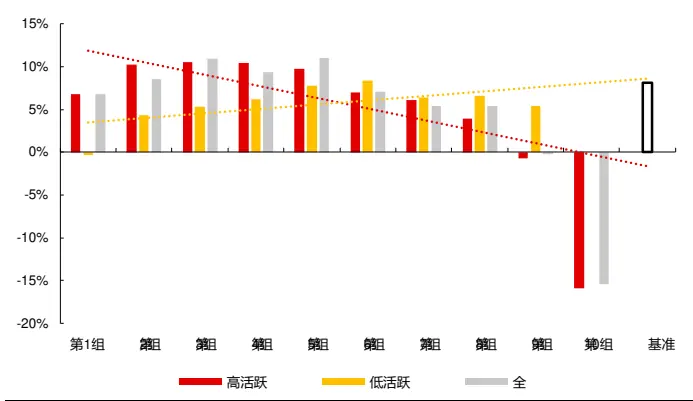
资料来源：天软科技，长江证券研究所

图 2：活跃区间划分收益率因子全市场分组收益
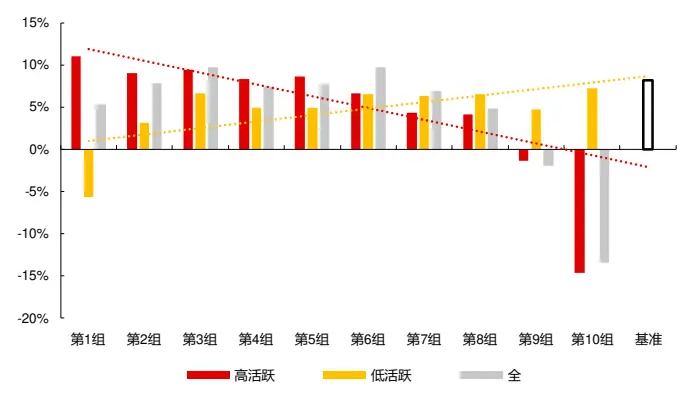
资料来源：天软科技，长江证券研究所

1 本节数据截至 2026 年 2 月 28 日。

故特定逻辑下的数据划分可以精细化交易逻辑的表达，甚至产生逻辑完全不同的因子。本文对离散向量在数据划分时所表达的交易性质含义做如下整理：

表 4：交易性质维度含义

| 基本维度 | 含义 | 时序值自身对比 | 特定值 | 边际变化 |
| --- | --- | --- | --- | --- |
| 收益率 | 价格变动，资金方向 | 尾端分布(分位、正态) | 固定值(8%)、涨跌停 |  |
| 振幅 | 价格变动速率，价格路径 | 异常阈值、分位数阈值 | 固定值（8%） | 边际相减，边际相减绝对值（风险波动） |
| 波动率 | 风险 | 异常阈值、分位数阈值 |  | 边际相减，边际相减绝对值（风险波动） |
| 成交量 | 成交活跃，大小单 | 异常阈值、分位数阈值 | 固定值（高占比） | 边际相减，边际相减绝对值（成交波动） |
| 量价相关性 | 交易拥挤度 | 异常阈值、分位数阈值 | 固定值 (0) | 边际相减 |
| 收盘价 | 市场定价，筹码成本 | 异常阈值、分位数阈值 |  | 一阶导等于收益率 |

资料来源：长江证券研究所

对连续向量在信息表达含义做如下整理：

表 5：信息表达维度含义

| 基本维度 | 因子维度来源 | 因子逻辑 | 绝对含义 | 相对含义 |
| --- | --- | --- | --- | --- |
| 收益率 | 反转、动量 | 反转：价格变动 | 已实现收益 |  |
| 波动率 | 价格稳定性 | 低波：成交活跃度 | 风险 | 风险贡献 |
| 量价相关性 | 交易拥挤度 | 筹码分布：高位成交占比 | 交易拥挤 | 筹码分布变化 |
| 换手率/成交量 | 成交稳定性 | 流动性：成交活跃度 | 成交活跃 | 成交占比 |
| 成交额 | 非流动性 | 流动性：成交金额 | 流动性 | 成交占比 |
| 振幅 | 价格稳定性 | 低波：价格变动 | 价格路径，风险 | 风险占比、路径占比 |
| 每笔成交 | 每笔成交额 | 流动性：撮合效率 | 撮合效率 | 相对撮合效率 |
| 收盘价 | 价格偏度 | 筹码分布：高位成交占比 |  | 交易成本、筹码分布 |
| 时间 | 量价相关性趋势 |  | 时间长度、交易密度 |  |

资料来源：长江证券研究所

在前系列报告《高频因子（十八）：收益来源基础的因子挖掘方法论一——维度匹配因子》中，我们对最后一步的 K 线聚合为匹配聚合的因子构建方式给出讨论，在本文离散向量视角下，单维度聚合其实是最后一步的匹配聚合其中一个向量为⃗1 ，可以归到本文框架之下，故在后续的系列讨论中我们不会专门对单维度因子给出讨论。本文通过遍历上述交易性质得到离散向量，遍历信息表达得到连续向量，构建有一定信息增量的高频因子。

## 振幅边际异常相对波动因子 因子构建

本节构建振幅边际异常相对波动因子：

1.离散向量：

1.1 振幅滞后：时序变换算子——时间滞后（振幅）；

1.2 振幅边际：匹配变换算子——减法（振幅，振幅滞后）；

1.3 振幅边际异常：时序变换算子——绝对值（振幅边际）；

1.4 振幅统计：时序 K 线算子——平均值（振幅边际异常）、标准差（振幅边际异常）；

1.5 振幅边际异常：匹配变换算子——大于 0-1 化（振幅边际异常，振幅统计）。

2.连续向量：收益率

3.振幅边际异常相对波动：匹配 K 线算子——加权波动（振幅边际异常，收益率）。

下表分别给出了中证 800 和全市场范围内，振幅边际异常相对波动因子和风格因子的相关性，因子主要和波动率、BP、换手率因子相关性较高，即属于低波价值收益来源，同时和规模因子呈一定的负相关，偏小市值。2

表 6：中证 800 振幅边际异常相对波动因子和风格因子相关性

|  | 相对波动率-振幅边际异常 | 波动率 | 规模 | 动量 | 反转 | BP | DP | 换手率 | 成长 | 盈利 |
| --- | --- | --- | --- | --- | --- | --- | --- | --- | --- | --- |
| 相对波动率-振幅边际异常 | 100.00% | 33.17% | -12.75% | 3.16% | 8.57% | -34.39% |  |  |  |  |
|  |  |  |  |  |  |  | -19.32% | 25.61% | 0.06% |  |
|  |  |  |  |  |  |  |  |  |  | 0.93% |
| 波动率 | 33.17% | 100.00% | -10.20% | 23.09% | 32.87% | -37.43% | -27.06% | 60.39% | 0.37% | -3.01% |
| 规模 | -12.75% | -10.20% | 100.00% | 22.16% | 9.20% | 7.46% | 21.39% | -26.77% | 3.91% | 22.79% |
| 动量 | 3.16% | 23.09% | 22.16% | 100.00% | 0.82% | -22.87% | -7.09% | 17.06% | 6.94% | 15.46% |
| 反转 | 8.57% | 32.87% | 9.20% | 0.82% | 100.00% |  |  |  |  |  |
|  |  |  |  |  |  | -8.82% | -2.62% | 20.29% | 1.04% |  |
|  |  |  |  |  |  |  |  |  |  | 3.03% |
| BP | -34.39% | -37.43% | 7.46% | -22.87% | -8.82% | 100.00% | 35.54% | -24.49% | -2.72% | -17.99% |
| DP | -19.32% | -27.06% | 21.39% | -7.09% | -2.62% | 35.54% | 100.00% | -23.60% | 0.97% | 25.18% |
| 换手率 | 25.61% | 60.39% | -26.77% |  |  |  |  |  |  |  |
|  |  |  |  | 17.06% | 20.29% | -24.49% | -23.60% | 100.00% | 0.87% |  |
|  |  |  |  |  |  |  |  |  |  | -7.91% |
| 成长 | 0.06% | 0.37% | 3.91% | 6.94% | 1.04% | -2.72% | 0.97% | 0.87% | 100.00% | 17.83% |
| 盈利 | 0.93% | -3.01% | 22.79% | 15.46% | 3.03% | -17.99% | 25.18% | -7.91% | 17.83% | 100.00% |

资料来源：天软科技，长江证券研究所

表 7：全市场振幅边际异常相对波动因子和风格因子相关性

|  | 相对波动率-振幅边际异常 | 波动率 | 规模 | 动量 | 反转 | BP | DP | 换手车 | 成长 | 盈利 |
| --- | --- | --- | --- | --- | --- | --- | --- | --- | --- | --- |
| 相对波动率-振幅边际异常 | 100.00% | 30.43% | -22.31% | 3.71% | 10.27% | -28.69% | -16.28% | 24.16% | -0.15% | -2.32% |
| 波动率 | 30.43% | 100.00% | -14.29% | 23.61% | 35.77% | -34.82% | -24.66% | 64.02% | -0.80% | -4.18% |
| 规模 | -22.31% | -14.29% | 100.00% | 13.03% | 5.90% | 16.76% | 25.43% | -30.18% | 1.74% | 9.63% |
| 动量 | 3.71% | 23.61% | 13.03% | 100.00% | -2.67% | -25.42% | -8.79% | 19.20% | 2.50% | 5.04% |
| 反转 | 10.27% | 35.77% | 5.90% | -2.67% | 100.00% | -9.88% | -3.28% | 23.46% | 0.48% | 0.75% |
| BP | -28.69% | -34.82% | 16.76% | -25.42% | -9.88% | 100.00% | 34.59% | -25.23% | -0.14% | 0.58% |
| DP | -16.28% | -24.66% | 25.43% | -8.79% | -3.28% | 34.59% | 100.00% | -20.33% | 1.96% | 11.26% |
| 换手率 | 24.16% | 64.02% | -30.18% | 19.20% | 23.46% | -25.23% | -20.33% | 100.00% | -0.42% | -3.76% |
| 成长 | -0.15% | -0.80% | 1.74% | 2.50% | 0.48% | -0.14% | 1.96% | -0.42% | 100.00% | 7.46% |
| 盈利 | -2.32% | -4.18% | 9.63% | 5.04% | 0.75% | 0.58% | 11.26% | -3.76% | 7.46% | 100.00% |

资料来源：天软科技，长江证券研究所

下图给出了因子在中证 800 和全市场范围内，市值行业中性和量价中性（市值、行业、波动率、换手率）3后的累计 IC，并在下表中给出了各个板块不同时间段的 IC 统计：

因子在量价中性后累积 IC 有一定程度上的降低，低波收益来源贡献了因子的部分信息；

- 2025 年以来因子 IC 有一定程度的下降。

图 3：振幅边际异常相对波动因子累积 IC
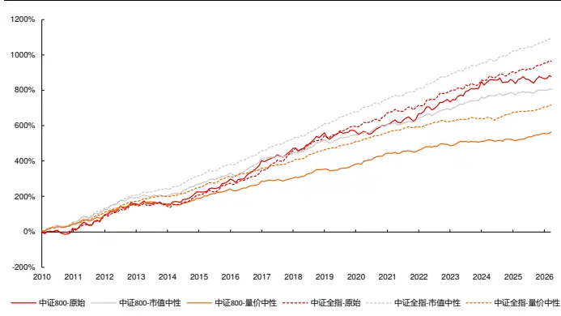
资料来源：天软科技，长江证券研究所

表 8：振幅边际异常相对波动因子IC统计

| IC |  |  |  |  |  |
| --- | --- | --- | --- | --- | --- |
|  |  |  | ICIR | IC-2025 | ICIR-2025 |
| 中证800 | 原始 | 4.47% | 40.80% | 1.07% | 8.45% |
|  | 市值中性 | 4.11% | 65.85% | 1.05% | 17.07% |
|  | 量价中性 | 2.88% | 59.62% | 2.53% | 68.11% |
| 全市场 | 原始 | 4.92% | 59.18% | 4.08% | 66.10% |
|  | 市值中性 | 5.56% | 108.71% | 4.79% | 107.11% |
|  | 量价中性 | 3.66% | 95.07% | 3.21% | 118.68% |

资料来源：天软科技，长江证券研究所

下图给出了市值行业中性后的振幅边际异常相对波动因子在中证 800、全市场范围内的分组净值，并在下表中给出了分年的风险指标：

中证 800 内，除 2013、2017、2019、2025、2026 年外因子均可获得超额收益，全市场中，除 2013 年外因子均可以获得超额收益；

中证 800 内因子在多头和空头的收益上较为均匀，全市场中因子空头能力更强。

图 4：中证 800 市值行业中性振幅边际异常相对波动因子分组净值
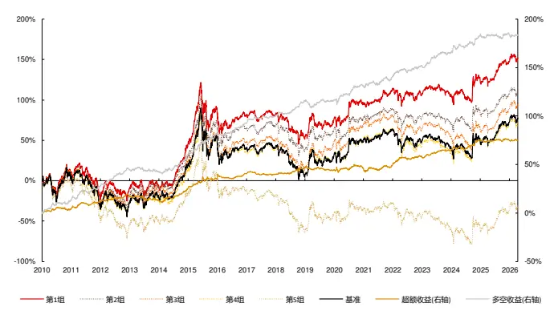
资料来源：天软科技，长江证券研究所

图 5：全市场市值行业中性振幅边际异常相对波动因子分组净值
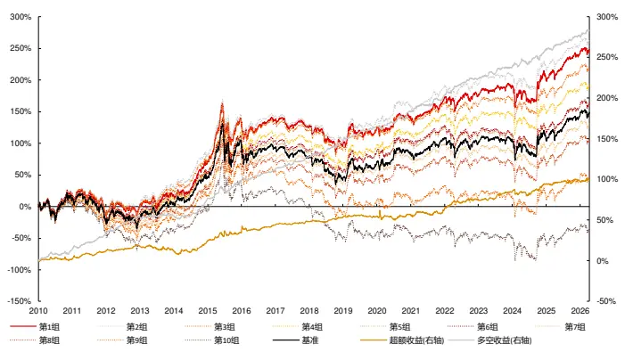
资料来源：天软科技，长江证券研究所

表 9：市值行业中性振幅边际异常相对波动因子风险指标

| 中证800 |  |  |  |  |  |  |  |  |  |
| --- | --- | --- | --- | --- | --- | --- | --- | --- | --- |
| 超额收益 超额最大回撤 |  | 信息比 多空收益 | 多空最大回撤 多空信息比 超额收益 超额最大回撤 |  |  |  | 全市场 信息比 | 多空收益 | 多空最大回撤 多空信息比 |
| 2010 3.75% | 3.10% | 1.07 | 13.77% 2.79% | 2.48 | 1.91% | 4.39% | 0.52 | 14.67% 3.99% | 2.34 |
| 2011 8.05% | 3.28% | 2.27 15.14% | 3.60% | 2.92 | 10.19% | 3.12% | 2.83 | 20.99% 3.09% | 4.59 |
| 2012 6.00% | 2.43% | 1.87 19.06% | 2.18% | 3.80 | 6.69% | 2.47% | 1.99 | 23.26% 1.28% | 5.33 |
| 2013 -4.28% | 5.33% | -1.16 -1.62% | 4.77% | -0.37 | -5.21% | 6.85% | -0.98 | 1.61% 2.94% | 0.36 |
| 2014 12.91% | 2.22% | 3.03 18.66% | 2.48% | 3.22 | 12.02% | 4.66% | 2.19 | 23.02% 3.93% | 4.02 |
| 2015 10.91% | 4.66% | 1.91 23.73% | 3.41% | 3.13 | 10.72% | 5.94% | 1.43 | 24.97% 8.28% | 2.76 |
| 2016 5.41% | 4.62% | 1.47 12.09% | 4.30% | 2.75 | 10.27% | 5.69% | 1.73 | 14.93% 3.98% | 2.77 |
| 2017 -0.44% | 3.90% | -0.19 7.95% | 2.22% | 2.11 | 4.26% | 1.94% | 1.60 | 16.81% 1.73% | 4.36 |
| 2018 7.04% | 1.78% | 2.25 16.51% | 2.45% | 3.61 | 4.92% | 3.13% | 1.48 | 20.61% 2.29% | 3.77 |
| 2019 -2.56% | 4.26% | -0.76 0.87% | 8.02% | 0.33 | 1.44% | 3.46% | 0.42 | 20.60% 1.68% | 4.34 |
| 2020 1.62% | 5.56% | 0.32 15.84% | 5.60% | 2.11 | 2.43% | 11.43% | 0.28 | 19.88% 5.42% | 2.29 |
| 2021 3.35% | 3.74% | 0.69 10.02% | 4.57% | 1.61 | 5.79% | 4.58% | 0.98 | 21.30% 3.52% | 3.00 |
| 2022 9.45% | 2.82% | 1.84 12.40% | 4.29% | 2.03 | 14.01% | 2.95% | 2.21 | 24.02% 2.01% | 3.64 |
| 2023 6.34% | 1.59% | 2.12 12.76% | 3.21% | 2.34 | 8.99% | 2.49% | 2.33 | 13.85% 3.67% | 2.58 |
| 2024 11.45% | 3.45% | 2.38 20.81% | 4.02% | 2.54 | 10.65% | 8.00% | 1.37 | 24.74% 6.57% | 2.50 |
| 2025 -0.55% | 2.55% | -0.18 0.28% | 4.98% | 0.04 | 4.26% | 3.47% | 0.75 | 19.42% 2.85% | 2.72 |
| 2026-0.44% | 1.85% | -0.46 | -0.85% 2.00% | -0.43 | 0.79% | 2.40% | 0.74 | 5.46% 2.39% | 2.35 |
| 总计 4.85% | 8.47% | 1.18 | 12.36% 8.02% | 2.04 | 6.53% | 11.51% | 1.16 | 19.72% | 8.28% 2.94 |

资料来源：天软科技，长江证券研究所

下图给出了量价中性后的振幅边际异常相对波动因子在中证 800、全市场范围内的分组净值，并在下表中给出了分年的风险指标：

中证 800 内，除 2013、2017、2019 年外因子均可获得超额收益，全市场中，除2013、2019 年外因子均可以获得超额收益；

- 因子空头能力更强。

图 6：中证 800量价中性振幅边际异常相对波动因子分组净值
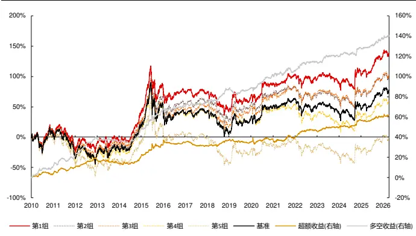
资料来源：天软科技，长江证券研究所

图 7：全市场量价中性振幅边际异常相对波动因子分组净值
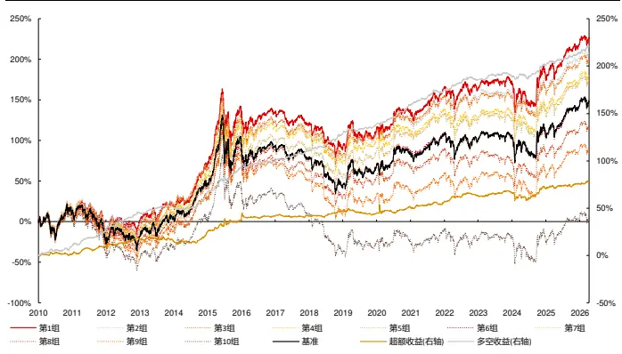
资料来源：天软科技，长江证券研究所

表 10：量价中性振幅边际异常相对波动因子风险指标

| 中证800 |  |  |  |  |  |  |  |  |  |
| --- | --- | --- | --- | --- | --- | --- | --- | --- | --- |
| 超额收益 超额最大回撤 | 信息比 | 多空收益 | 多空最大回撤 多空信息比 超额收益 超额最大回撤 |  |  | 信息比 | 全市场 多空收益 | 多空最大回撤 | 多空信息比 |
| 2010 3.40% | 3.02% | 1.19 | 11.48% 2.52% | 2.34 | 1.37% | 3.41% | 0.42 | 10.67% 3.07% | 1.96 |
| 2011 6.73% | 2.83% | 2.31 | 10.29% 3.27% | 2.41 | 8.79% | 3.19% | 2.75 | 17.48% 2.18% | 3.92 |
| 2012 7.58% | 2.32% | 2.81 18.88% | 2.13% | 4.65 | 8.15% | 2.24% | 2.64 | 20.70% 1.17% | 4.96 |
| 2013 -3.31% | 4.13% | -1.21 | -2.94% 3.79% | -0.91 | -2.06% | 4.96% | -0.49 | 6.00% 2.21% | 1.54 |
| 2014 7.08% | 2.16% | 2.14 | 13.42% 3.21% | 2.99 | 9.50% | 3.14% | 2.25 | 17.19% 2.23% | 3.68 |
| 2015 12.18% | 4.84% | 2.03 | 20.67% 3.61% | 2.93 | 12.82% | 6.47% | 1.72 | 29.38% 6.97% | 3.33 |
| 2016 2.34% | 4.26% | 0.61 | 3.84% 3.50% | 0.96 | 5.08% | 5.70% | 0.91 | 7.17% 4.10% | 1.52 |
| 2017 -2.68% | 5.01% | -1.29 | 4.47% 2.45% | 1.20 | 0.23% | 3.41% | 0.01 | 11.78% 1.45% | 2.98 |
| 2018 5.20% | 1.92% | 1.90 | 13.28% 2.11% | 2.79 | 4.89% | 2.50% | 1.54 | 19.09% 2.08% | 3.29 |
| 2019 -1.50% | 3.99% | -0.55 | 1.71% 6.83% | 0.53 | -2.31% | 6.86% | -0.71 | 10.78% 3.30% | 2.51 |
| 2020 3.04% | 5.84% | 0.67 | 14.08% 3.77% | 2.25 | 7.82% | 8.80% | 0.90 | 23.42% 3.85% | 3.58 |
| 2021 1.15% | 3.60% | 0.27 | 4.25% 4.92% | 0.70 | 4.87% | 2.86% | 1.14 | 16.99% 3.56% | 3.28 |
| 2022 7.30% | 1.64% | 2.09 | 9.36% 2.18% | 1.95 | 7.21% | 3.33% | 1.89 | 11.38% 3.61% | 2.23 |
| 2023 2.81% | 1.36% | 1.04 | 4.57% 1.92% | 1.07 | 3.42% | 1.80% | 0.99 | 4.39% 3.13% | 1.10 |
| 2024 7.88% | 2.40% | 2.03 | 9.28% 3.53% | 1.70 | 4.14% | 8.12% | 0.66 | 11.52% 5.35% | 1.80 |
| 2025 2.87% | 2.10% | 0.89 | 8.78% 2.16% | 1.78 | 4.76% | 3.01% | 1.00 | 13.49% 3.12% | 2.36 |
| 2026 1.36% | 2.11% | 1.07 | 3.03% 1.82% | 2.13 | 2.40% | 1.03% | 2.31 | 7.13% 1.23% | 4.92 |
| 总计 3.97% | 6.36% | 1.11 | 9.32% | 6.83% 1.85 | 5.10% | 9.75% | 1.06 | 15.10% | 7.06% 2.74 |

资料来源：天软科技，长江证券研究所

## 振幅边际异常相对换手因子因子构建

本节构建振幅边际异常相对换手因子：

1.离散向量：振幅边际异常。（同上节）

2.连续向量：换手率。

3. 振幅边际异常相对换手：匹配 K 线算子——加权求和（振幅边际异常，换手率）。

下表分别给出了中证 800 和全市场范围内，振幅边际异常相对换手因子和风格因子的相关性较低。

表 11：中证 800振幅边际异常相对换手因子和风格因子相关性

|  | 相对换手率-振幅边际异常 | 波动率 | 规模 | 动量 | 反转 | BP | DP | 换手牢 | 成长 | 盈利 |
| --- | --- | --- | --- | --- | --- | --- | --- | --- | --- | --- |
| 相对换手率-振幅边际异常 | 100.00% | 6.18% | -3.98% |  |  |  |  |  |  |  |
|  |  |  |  | -6.78% | 14.13% | 17.48% | -3.18% | 10.88% | -2.15% |  |
|  |  |  |  |  |  |  |  |  |  | -14.52% |
| 波动率 | 6.18% | 100.00% | -10.20% | 23.09% | 32.87% | -37.43% | -27.06% | 60.39% | 0.37% | -3.01% |
| 规模 | -3.98% | -10.20% | 100.00% | 22.16% | 9.20% | 7.46% | 21.39% | -26.77% | 3.91% | 22.79% |
| 动量 | -6.78% | 23.09% | 22.16% | 100.00% | 0.82% | -22.87% | -7.09% | 17.06% | 6.94% | 15.46% |
| 反转 | 14.13% | 32.87% | 9.20% | 0.82% | 100.00% | -8.82% | -2.62% | 20.29% | 1.04% | 3.03% |
| BP | 17.48% | -37.43% | 7.46% | -22.87% | -8.82% | 100.00% | 35.54% | -24.49% | -2.72% | -17.99% |
| DP | -3.18% | -27.06% | 21.39% | -7.09% | -2.62% | 35.54% | 100.00% | -23.60% | 0.97% | 25.18% |
| 换手率 | 10.88% | 60.39% | -26.77% | 17.06% | 20.29% | -24.49% | -23.60% | 100.00% | 0.87% | -7.91% |
| 成长 | -2.15% | 0.37% | 3.91% | 6.94% | 1.04% |  |  |  |  |  |
|  |  |  |  |  |  | -2.72% | 0.97% | 0.87% | 100.00% |  |
|  |  |  |  |  |  |  |  |  |  | 17.83% |
| 盈利 | -14.52% | -3.01%22.79% |  | 15.46% | 3.03% | -17.99% | 25.18% | -7.91% | 17.83% | 100.00% |

资料来源：天软科技，长江证券研究所

表 12：全市场振幅边际异常相对换手因子和风格因子相关性

|  | 相对换手牢-振幅边际异常 | 波动率 | 规模 | 动量 | 反转 | BP | DP | 换手率 | 成长 | 盈利 |
| --- | --- | --- | --- | --- | --- | --- | --- | --- | --- | --- |
| 相对换手率-振幅边际异常 | 100.00% | 13.57% | 0.46% | -3.83% |  |  |  |  |  |  |
|  |  |  |  |  | 17.46% | 9.95% | -4.52% | 12.64% | -1.32% | -5.07% |
| 波动率 | 13.57% | 100.00% | -14.29% | 23.61% | 35.77% | -34.82% | -24.66% | 64.02% | -0.80% | -4.18% |
| 规模 | 0.46% | -14.29% | 100.00% | 13.03% | 5.90% | 16.76% | 25.43% | -30.18% | 1.74% | 9.63% |
| 动量 | -3.83% | 23.61% | 13.03% | 100.00% | -2.67% | -25.42% | -8.79% | 19.20% | 2.50% | 5.04% |
| 反转 | 17.46% | 35.77% | 5.90% | -2.67% | 100.00% | -9.88% | -3.28% | 23.46% | 0.48% | 0.75% |
| BP | 9.95% | -34.82% | 16.76% | -25.42% | -9.88% | 100.00% | 34.59% | -25.23% | -0.14% | 0.58% |
| DP | -4.52% | -24.66% | 25.43% | -8.79% |  |  |  |  |  |  |
|  |  |  |  |  | -3.28% | 34.59% | 100.00% |  |  |  |
|  |  |  |  |  |  |  |  | -20.33% | 1.96% | 11.26% |
| 换手率 | 12.64% | 64.02% | -30.18% | 19.20% | 23.46% | -25.23% | -20.33% | 100.00% | -0.42% | -3.76% |
| 成长 | -1.32% -0.80% |  | 1.74% | 2.50% | 0.48% |  |  |  |  |  |
|  |  |  |  |  |  | -0.14% | 1.96% | -0.42% | 100.00% |  |
|  |  |  |  |  |  |  |  |  |  | 7.46% |
| 盈利 | -5.07% -4.18% 9.63% 5.04% 0.75% 0.58% |  |  |  |  |  | 11.26% | -3.76% | 7.46% | 100.00% |

资料来源：天软科技，长江证券研究所

下图给出了因子在中证 800 和全市场范围内，市值行业中性和量价中性后的累计 IC，并在下表中给出了各个板块不同时间段的 IC 统计：

虽然因子和风格相关性较低，但是在量价中性后累积 IC 仍有一定程度上的降低；

- 2025 年以来因子 IC 有一定程度的下降。

图 8：振幅边际异常相对换手因子累积 IC
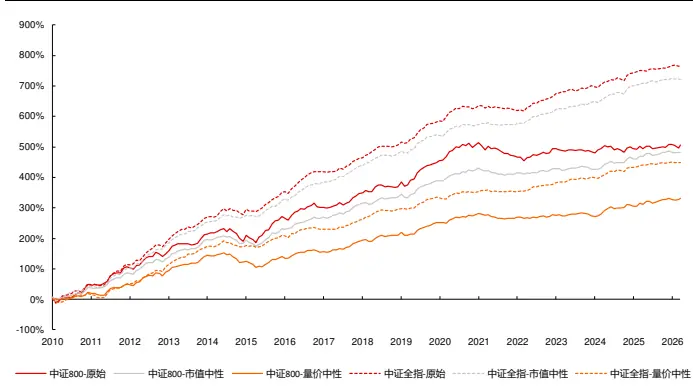
资料来源：天软科技，长江证券研究所

表 13：振幅边际异常相对换手因子 IC统计

| IC |  |  | ICIR | IC-2025 | ICIR-2025 |
| --- | --- | --- | --- | --- | --- |
| 中证800 | 原始 | 2.58% | 33.39% | 0.31% | 4.88% |
|  | 市值中性 | 2.46% | 48.58% | 1.00% | 19.79% |
|  | 量价中性 | 1.69% | 35.56% | 1.29% | 26.93% |
| 全市场 | 原始 | 3.91% | 64.26% | 1.56% | 59.83% |
|  | 市值中性 | 3.68% | 78.59% | 1.38% | 54.70% |
|  | 量价中性 | 2.29% | 54.07% | 1.10% | 52.97% |

资料来源：天软科技，长江证券研究所

下图给出了市值行业中性后的振幅边际异常相对换手因子在中证 800、全市场范围内的分组净值，并在下表中给出了分年的风险指标：

中证 800 内，除 2020、2021、2025、2026 年外因子均可获得超额收益，全市场中，除 2020、2021、2025、2026 年外因子均可以获得超额收益；

- 从超额最大回撤上看，因子的失效区间主要集中在 2020、2021 年；

图 9：中证 800市值行业中性振幅边际异常相对换手因子分组净值
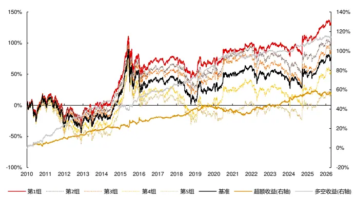
资料来源：天软科技，长江证券研究所

图 10：全市场市值行业中性振幅边际异常相对换手因子分组净值
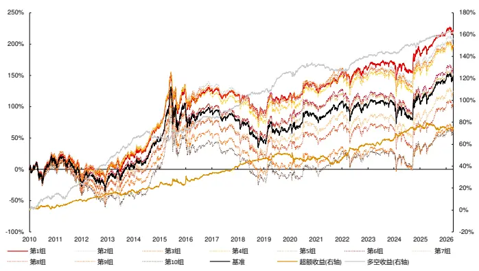
资料来源：天软科技，长江证券研究所

表 14：市值行业中性振幅边际异常相对换手因子风险指标

| 中证800 |  |  |  |  |  |  |  | 全市场 |  |  |  |
| --- | --- | --- | --- | --- | --- | --- | --- | --- | --- | --- | --- |
|  | 超额收益 超额最大回撤 | 信息比 | 多空收益 多空最大回撤 多空信息比 超额收益 超额最大回撤 |  |  |  |  | 信息比 | 多空收益 多空最大回撤 |  | 多空信息比 |
| 2010 5.26% | 2.85% | 1.47 | 14.06% | 2.35% | 2.28 | 2.52% | 3.67% | 0.66 | 15.17% | 3.07% | 2.32 |
| 2011 6.10% | 1.57% | 2.41 | 11.54% | 1.83% | 2.65 | 7.08% | 1.97% | 2.31 | 11.15% | 5.20% | 1.96 |
| 2012 2.68% | 2.29% | 1.09 | 10.64% | 2.03% | 2.57 | 5.59% | 1.78% | 2.10 | 20.96% | 1.45% | 4.83 |
| 2013 5.46% | 1.64% | 2.25 | 12.38% | 2.56% | 3.00 | 3.22% | 3.25% | 0.96 | 24.27% | 2.89% | 5.41 |
| 2014 1.53% | 2.72% | 0.58 | -4.05% | 8.60% | -0.92 | 4.67% | 2.64% | 1.59 | 0.28% | 8.94% | 0.10 |
| 2015 6.51% | 4.08% | 1.10 | 11.82% | 6.54% | 1.52 | 1.91% | 5.84% | 0.26 | 9.66% | 6.58% | 1.24 |
| 2016 4.69% | 4.00% | 1.19 | 5.08% | 1.71% | 1.26 | 9.19% | 4.93% | 1.81 | 9.45% | 3.20% | 2.15 |
| 2017 1.67% | 1.58% | 0.64 | 7.77% | 1.51% | 2.21 | 6.44% | 0.95% | 2.42 | 11.90% | 1.55% | 3.19 |
| 2018 7.57% | 1.94% | 2.58 | 8.08% | 2.50% | 1.99 | 7.81% | 1.72% | 2.82 | 14.55% | 2.11% | 3.34 |
| 2019 1.97% | 3.14% | 0.58 | 12.61% | 6.35% | 2.42 | 3.99% | 3.01% | 1.09 | 19.16% | 2.99% | 3.88 |
| 2020-3.96% | 6.32% | -0.68 | 14.33% | 3.21% | 2.38 | -3.34% | 7.81% | -0.42 | 5.34% | 4.76% | 0.89 |
| 2021 -2.21% | 5.47% | -0.45 | -3.69% | 9.32% | -0.65 | -1.41% | 8.10% | -0.13 | -4.35% | 6.48% | -0.95 |
| 2022 9.03% | 2.79% | 2.04 | 6.29% | 3.04% | 1.52 | 15.12% | 2.22% | 2.98 | 13.00% | 2.21% | 3.09 |
| 2023 2.46% | 2.54% | 0.91 | -1.45% | 3.73% | -0.38 | 3.77% | 2.88% | 1.17 | 4.60% | 2.59% | 1.34 |
| 2024 10.30% | 2.65% | 2.19 | 9.53% | 3.32% | 2.27 | 13.89% | 2.86% | 2.70 | 10.20% | 4.30% | 1.95 |
| 2025 -0.17% | 5.30% | -0.09 | 6.57% | 2.91% | 1.34 | -1.65% | 6.59% | -0.32 | 8.59% | 1.99% | 1.96 |
| 2026 -1.11% | 1.98% | -0.80 | -0.77% | 1.92% | -0.72 | -1.57% | 2.03% | -0.77 | -0.93% | 2.30% | -0.80 |
| 总计 3.61% | 9.86% | 0.94 | 7.54% | 9.85% | 1.52 | 4.80% | 10.32% | 1.07 | 10.80% | 8.94% | 2.06 |

资料来源：天软科技，长江证券研究所

下图给出了量价中性后的振幅边际异常相对换手因子在中证 800、全市场范围内的分组净值，并在下表中给出了分年的风险指标：

中证 800 内，除 2020、2021、2025 年外因子均可获得超额收益，全市场中，除2010、2015、2020、2021、2025、2026 年外因子均可以获得超额收益；

图 11：中证 800量价中性振幅边际异常相对换手因子分组净值
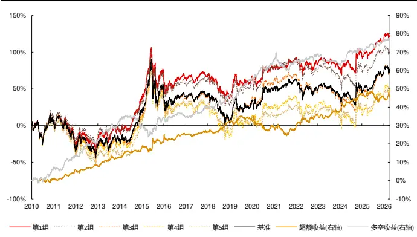
资料来源：天软科技，长江证券研究所

图 12：全市场量价中性振幅边际异常相对换手因子分组净值
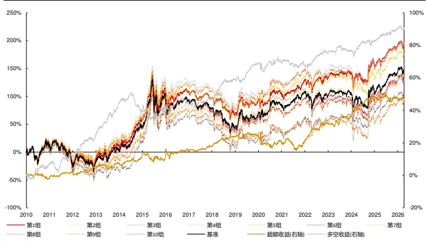
资料来源：天软科技，长江证券研究所

表 15：量价中性振幅边际异常相对换手因子风险指标

| 中证800 |  |  |  |  |  |  |  |  |  |
| --- | --- | --- | --- | --- | --- | --- | --- | --- | --- |
| 超额收益 超额最大回撤 | 信息比 | 多空收益 | 多空最大回撤 多空信息比 超额收益 超额最大回撤 |  |  | 信息比 | 全市场 多空收益 | 多空最大回撤 | 多空信息比 |
| 2010 0.90% | 2.55% | 0.35 | 7.66% 3.12% | 1.57 | -1.87% | 3.96% | -0.49 | 7.66% 3.23% | 1.39 |
| 2011 5.03% | 1.36% | 2.03 6.71% | 2.34% | 1.66 | 3.97% | 1.27% | 1.47 | 5.33% 6.54% | 1.04 |
| 2012 2.59% | 1.85% | 1.22 8.74% | 2.46% | 2.22 | 3.26% | 2.05% | 1.28 | 12.96% 2.63% | 2.96 |
| 2013 4.38% | 1.84% | 1.83 10.79% | 2.78% | 2.56 | 2.34% | 3.13% | 0.77 | 21.60% 3.45% | 4.52 |
| 2014 4.88% | 1.27% | 2.03 -3.15% | 7.14% | -0.77 | 4.60% | 2.22% | 1.65 | -4.12% 11.65% | -0.87 |
| 2015 3.63% | 3.47% | 0.73 | 5.43% 7.23% | 0.87 | -1.30% | 6.40% | -0.31 | 2.11% 9.40% | 0.40 |
| 2016 3.77% | 3.67% | 1.04 | -0.13% 2.85% | -0.08 | 4.30% | 6.09% | 0.88 | 1.29% 4.94% | 0.24 |
| 2017 1.91% | 1.68% | 0.78 | 5.80% 1.77% | 1.81 | 2.92% | 1.84% | 1.28 | 3.67% 2.92% | 1.21 |
| 2018 5.80% | 2.22% | 2.07 | 6.30% 2.69% | 1.61 | 6.17% | 1.69% | 2.39 | 12.73% 1.86% | 2.84 |
| 2019 1.37% | 2.44% | 0.47 | 9.83% 5.61% | 2.20 | 0.95% | 2.59% | 0.32 | 10.72% 3.61% | 2.82 |
| 2020 -3.83% | 7.87% | -0.69 10.83% | 3.88% | 1.93 | -3.97% | 9.17% | -0.53 | 0.49% 5.74% | 0.12 |
| 2021 -1.71% | 6.26% | -0.35 | -1.41% 9.75% | -0.24 | -0.25% | 7.38% | 0.11 | -2.06% 5.08% | -0.41 |
| 2022 8.36% | 3.13% | 1.85 | 4.70% 2.84% | 1.14 | 12.36% | 1.76% | 2.72 | 7.41% 2.49% | 1.83 |
| 2023 1.19% | 2.41% | 0.52 | -5.03% 5.85% | -1.49 | 3.60% | 2.73% | 1.11 | 2.25% 3.98% | 0.61 |
| 2024 10.86% | 2.52% | 2.40 | 8.12% 2.33% | 2.20 | 13.30% | 2.87% | 2.77 | 5.59% 3.93% | 1.13 |
| 2025 -2.26% | 5.78% | -0.54 | 4.47% 2.92% | 1.08 | -0.71% | 6.04% | -0.16 | 7.94% 1.61% | 2.05 |
| 2026 0.30% | 2.07% | 0.45 | 1.29% 0.96% | 0.94 | -1.00% | 1.75% | -0.60 | -0.43% 2.51% | -0.72 |
| 总计 2.94% | 10.27% | 0.82 | 5.05% | 11.27% 1.12 | 3.00% | 10.48% | 0.73 | 5.89% | 16.13% 1.22 |

资料来源：天软科技，长江证券研究所

## 价格异常相对换手因子因子构建

本节构建价格异常相对换手因子：

1.离散向量：

1.1 价格统计：时序 K 线算子——平均值（收盘价）、标准差（收盘价）；

1.2 价格异常：时序变换算子——大于 0-1 化（价格，价格统计）。

2.连续向量：换手率。

3. 价格异常相对换手：匹配 K线算子——加权求和（价格异常，换手率）。

下表分别给出了中证 800 和全市场范围内，价格异常相对换手因子和风格因子的相关性较低。

表 16：中证 800价格异常相对换手因子和风格因子相关性

|  | 相对换手率-价格异常 | 波动率 | 规模 | 动量 | 反转 | BP | DP | 换手率 | 成长 | 盈利 |
| --- | --- | --- | --- | --- | --- | --- | --- | --- | --- | --- |
| 相对换手率-价格异常 | 100.00% | 4.81% | 0.08% | 0.02% 8.42% |  | -2.42% | -2.96% | 4.52% | 0.18% | -1.45% |
| 波动率 | 4.81% | 100.00% | -10.20% | 23.09% | 32.87% | -37.43% | -27.06% | 60.39% | 0.37% | -3.01% |
| 规模 | 0.08% | -10.20% | 100.00% | 22.16% | 9.20% | 7.46% | 21.39% | -26.77% | 3.91% | 22.79% |
| 动量 | 0.02% | 23.09% | 22.16% | 100.00% | 0.82% | -22.87% | -7.09% | 17.06% | 6.94% | 15.46% |
| 反转 | 8.42% | 32.87% | 9.20% | 0.82% | 100.00% | -8.82% | -2.62% | 20.29% | 1.04% | 3.03% |
| BP | -2.42% | -37.43% | 7.46% | -22.87% | -8.82% | 100.00% | 35.54% | -24.49% | -2.72% | -17.99% |
| DP | -2.96% | -27.06% | 21.39% | -7.09% | -2.62% | 35.54% | 100.00% | -23.60% | 0.97% | 25.18% |
| 换手率 | 4.52% | 60.39% | -26.77% | 17.06% | 20.29% | -24.49% | -23.60% | 100.00% | 0.87% | -7.91% |
| 成长 | 0.18% 0.37% |  | 3.91% | 6.94% 1.04% |  | -2.72% | 0.97% 0.87% |  | 100.00% | 17.83% |
| 盈利 | -1.45% | -3.01% | 22.79% | 15.46% | 3.03% | -17.99% | 25.18% | -7.91% | 17.83% | 100.00% |

资料来源：天软科技，长江证券研究所

表 17：全市场价格异常相对换手因子和风格因子相关性

|  | 相对换手率-价格异常 | 波动率 | 规模 | 动量 | 反转 | BP | DP | 换手率 | 成长 盈利 |  |
| --- | --- | --- | --- | --- | --- | --- | --- | --- | --- | --- |
| 相对换手率-价格异常 | 100.00% | 5.01% | -1.43% | 0.69% | 9.25% |  |  |  |  |  |
|  |  |  |  |  |  | -3.72% | -3.60% |  |  |  |
|  |  |  |  |  |  |  |  | 4.17% | -0.16% -1.56% |  |
| 波动率 | 5.01% | 100.00% | -14.29% | 23.61% | 35.77% | -34.82% | -24.66% | 64.02% | -0.80% -4.18% |  |
| 规模 | -1.43% | -14.29% | 100.00% | 13.03% | 5.90% | 16.76% | 25.43% | -30.18% | 1.74% 9.63% |  |
| 动量 | 0.69% | 23.61% | 13.03% | 100.00% | -2.67% | -25.42% | -8.79% | 19.20% | 2.50% | 5.04% |
| 反转 | 9.25% | 35.77% | 5.90% | -2.67% | 100.00% | -9.88% | -3.28% | 23.46% | 0.48% | 0.75% |
| BP | -3.72% | -34.82% | 16.76% | -25.42% | -9.88% | 100.00% | 34.59% | -25.23% | -0.14% | 0.58% |
| DP | -3.60% | -24.66% | 25.43% | -8.79% | -3.28% | 34.59% | 100.00% | -20.33% | 1.96% | 11.26% |
| 换手率 | 4.17% | 64.02% | -30.18% | 19.20% | 23.46% | -25.23% | -20.33% | 100.00% | -0.42% | -3.76% |
| 成长 | -0.16% | -0.80% | 1.74% | 2.50% | 0.48% | -0.14% | 1.96% | -0.42% | 100.00% | 7.46% |
| 盈利 | -1.56% | -4.18% | 9.63% | 5.04% |  |  |  |  |  |  |
|  |  |  |  |  | 0.75% |  |  |  |  |  |
|  |  |  |  |  |  | 0.58% | 11.26% | -3.76% | 7.46% | 100.00% |

资料来源：天软科技，长江证券研究所

下图给出了因子在中证 800 和全市场范围内，市值行业中性和量价中性后的累计 IC，并在下表中给出了各个板块不同时间段的 IC 统计：

因子和风格相关性较低，所以在市值行业中性和量价中性后，累积 IC 差别不大；

- 2025 年以来因子 IC 有一定程度的下降。

图 13：价格异常相对换手因子累积 IC
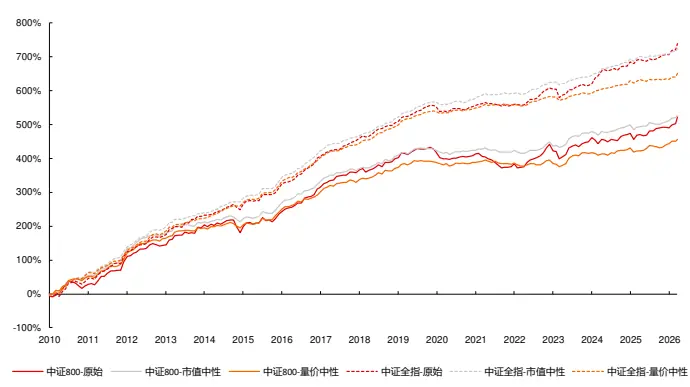
资料来源：天软科技，长江证券研究所

表 18：价格异常相对换手因子IC统计

| IC |  |  |  |  |  |
| --- | --- | --- | --- | --- | --- |
|  |  |  | ICIR | IC-2025 | ICIR-2025 |
| 中证800 | 原始 | 2.67% | 35.23% | 3.28% | 40.95% |
|  | 市值中性 | 2.69% | 52.41% | 1.96% | 36.08% |
|  | 量价中性 | 2.33% | 46.97% | 1.90% | 36.66% |
| 全市场 | 原始 | 3.77% | 64.89% | 4.14% | 60.81% |
|  | 市值中性 | 3.70% | 89.34% | 2.62% | 52.37% |
|  | 量价中性 | 3.32% | 83.61% | 1.95% | 42.61% |

资料来源：天软科技，长江证券研究所

下图给出了市值行业中性后的价格异常相对换手因子在中证 800、全市场范围内的分组净值，并在下表中给出了分年的风险指标：

中证 800 内，除 2014、2017、2019 年外因子均可获得超额收益，全市场中，除2017、2020、2022 年外因子均可以获得超额收益；

- 从超额最大回撤上看，因子的失效区间主要集中在 2015、2020 年；

图 14：中证 800市值行业中性价格异常相对换手因子分组净值
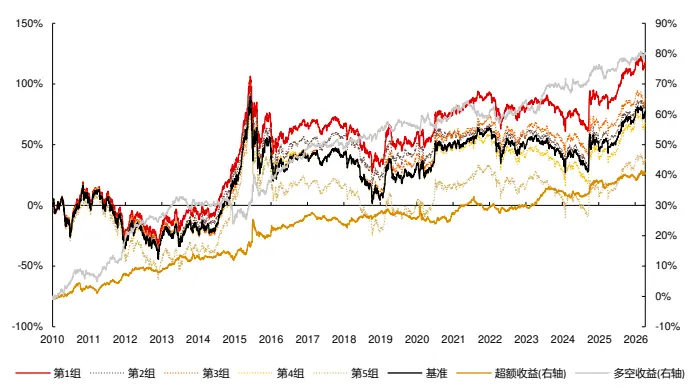
资料来源：天软科技，长江证券研究所

图 15：全市场市值行业中性价格异常相对换手因子分组净值
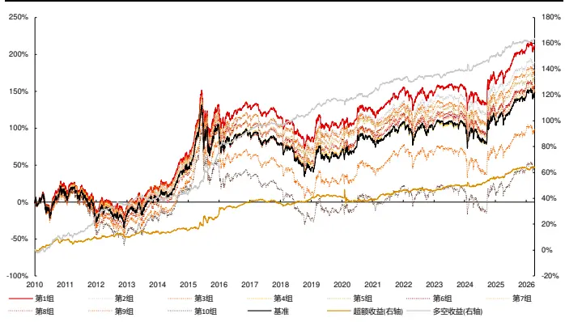
资料来源：天软科技，长江证券研究所

表 19：市值行业中性价格异常相对换手因子风险指标

| 中证800 |  |  |  |  |  |  |  | 全市场 |  |  |  |
| --- | --- | --- | --- | --- | --- | --- | --- | --- | --- | --- | --- |
|  | 超额收益 超额最大回撤 | 信息比 | 多空收益 | 多空最大回撤 多空信息比 超额收益 超额最大回撤 |  |  |  | 信息比 | 多空收益 | 多空最大回撤 | 多空信息比 |
| 2010 2.90% | 2.86% | 1.11 | 7.56% | 3.29% | 1.66 | 7.98% | 3.15% | 2.47 | 11.27% | 3.29% | 2.10 |
| 2011 4.37% | 2.53% | 1.83 | 11.21% | 2.90% | 2.97 | 1.70% | 4.01% | 0.62 | 16.49% | 3.87% | 3.60 |
| 2012 1.24% | 2.01% | 0.46 | 8.70% | 2.15% | 2.36 | 1.17% | 3.10% | 0.38 | 9.95% | 2.54% | 2.67 |
| 2013 4.97% | 2.10% | 1.87 | 4.48% | 4.20% | 1.04 | 3.62% | 2.72% | 1.32 | 5.47% | 4.74% | 1.40 |
| 2014 -0.96% | 3.15% | -0.29 | -5.93% | 8.40% | -1.20 | 1.42% | 2.16% | 0.65 | 2.97% | 3.33% | 0.78 |
| 2015 7.98% | 6.23% | 1.28 | 14.28% | 6.93% | 1.76 | 12.63% | 5.50% | 2.06 | 38.10% | 2.70% | 4.38 |
| 2016 6.57% | 1.67% | 2.13 | 11.10% | 1.35% | 3.02 | 9.91% | 2.01% | 2.31 | 17.56% | 3.13% | 3.70 |
| 2017-2.80% | 4.18% | -1.48 | 0.43% | 2.95% | 0.07 | -0.45% | 3.51% | -0.18 | 4.94% | 2.84% | 1.65 |
| 2018 4.26% | 1.63% | 1.50 | 6.27% | 2.27% | 1.58 | 3.32% | 2.21% | 1.38 | 10.59% | 2.26% | 2.56 |
| 2019 -2.33% | 3.56% | -0.83 | 0.57% | 3.19% | 0.32 | 1.63% | 2.31% | 0.57 | 9.77% | 2.55% | 2.51 |
| 2020 1.95% | 6.17% | 0.41 | 6.16% | 4.99% | 1.17 | -1.90% | 9.97% | -0.16 | 5.42% | 3.78% | 1.06 |
| 2021 2.02% | 4.45% | 0.54 | -1.42% | 5.81% | -0.39 | 7.28% | 1.45% | 2.21 | 11.84% | 2.52% | 2.69 |
| 2022 1.16% | 3.11% | 0.31 | 4.41% | 5.51% | 0.93 | -0.36% | 2.86% | -0.16 | 2.21% | 4.41% | 0.52 |
| 2023 4.54% | 1.77% | 1.82 | 4.68% | 4.55% | 1.10 | 3.69% | 1.52% | 1.66 | 3.55% | 3.40% | 0.96 |
| 2024 2.82% | 2.14% | 0.86 | 6.53% | 4.72% | 1.37 | 5.56% | 3.36% | 1.45 | 11.62% | 5.22% | 2.27 |
| 2025 1.52% | 2.70% | 0.53 | 2.89% | 4.67% | 0.58 | 8.89% | 1.36% | 2.52 | 13.41% | 2.98% | 2.31 |
| 2026 1.36% | 1.27% | 1.31 | 2.12% | 2.53% | 1.87 | 0.32% | 1.88% | 0.30 | 1.58% | 2.25% | 1.31 |
| 总计 2.61% | 6.23% | 0.80 | 5.25% | 8.71% | 1.11 | 4.16% | 9.97% | 1.06 | 11.00% | 5.22% | 2.21 |

资料来源：天软科技，长江证券研究所

下图给出了量价中性后的价格异常相对换手因子在中证 800、全市场范围内的分组净值，并在下表中给出了分年的风险指标：

中证 800 内，除 2014、2017、2019、2020 年外因子均可获得超额收益，全市场中，除 2017、2020、2022 年外因子均可以获得超额收益；

- 中证 800 内因子在多头和空头的收益上较为均匀，全市场中因子空头能力更强。

图 16：中证 800量价中性价格异常相对换手因子分组净值
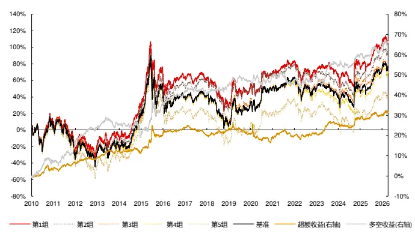
资料来源：天软科技，长江证券研究所

图 17：全市场量价中性价格异常相对换手因子分组净值
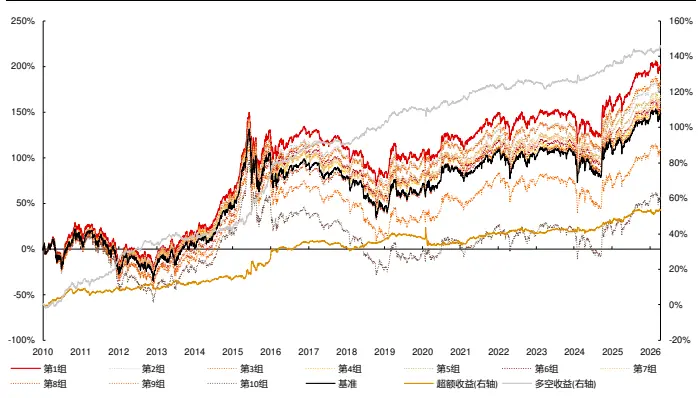
资料来源：天软科技，长江证券研究所

表 20：量价中性价格异常相对换手因子风险指标

| 中证800 |  |  |  |  |  |  |  | 全市场 |  |  |  |
| --- | --- | --- | --- | --- | --- | --- | --- | --- | --- | --- | --- |
|  | 超额收益 超额最大回撤 | 信息比 | 多空收益 | 多空最大回撤 多空信息比 超额收益 超额最大回撤 |  |  |  | 信息比 | 多空收益 | 多空最大回撤 多空信息比 |  |
| 2010 3.46% | 2.93% | 1.22 | 7.18% | 3.51% | 1.55 | 8.73% | 2.79% | 2.64 | 12.62% | 3.44% | 2.35 |
| 2011 3.02% | 2.08% | 1.31 | 8.68% | 2.68% | 2.44 | 0.51% | 4.07% | 0.19 | 14.44% | 4.15% | 3.47 |
| 2012 2.54% | 1.41% | 1.15 | 9.15% | 1.99% | 2.57 | 0.43% | 3.42% | 0.20 | 9.29% | 2.79% | 2.54 |
| 2013 3.48% | 1.88% | 1.37 | 1.52% | 5.05% | 0.41 | 3.35% | 2.87% | 1.18 | 4.95% | 4.63% | 1.29 |
| 2014 -1.03% | 3.03% | -0.34 | -5.66% | 7.52% | -1.16 | 1.94% | 2.33% | 0.83 | 3.82% | 3.03% | 0.98 |
| 2015 9.14% | 5.81% | 1.52 | 16.83% | 6.89% | 2.09 | 11.76% | 5.37% | 1.93 | 35.24% | 3.40% | 4.08 |
| 2016 3.67% | 1.58% | 1.30 | 6.28% | 1.88% | 1.78 | 9.62% | 1.94% | 2.25 | 16.66% | 1.77% | 3.78 |
| 2017 -3.62% | 5.06% | -1.79 | -0.93% | 3.18% | -0.33 | -2.12% | 4.14% | -0.99 | 2.38% | 3.17% | 0.85 |
| 2018 2.96% | 1.75% | 1.13 | 4.59% | 2.51% | 1.23 | 3.71% | 2.08% | 1.59 | 11.31% | 1.79% | 2.75 |
| 2019 -2.38% | 4.53% | -0.78 | 1.51% | 3.29% | 0.55 | 1.58% | 2.76% | 0.53 | 9.36% | 2.55% | 2.34 |
| 2020-1.43% | 8.81% | -0.26 | 3.07% | 5.02% | 0.64 | -2.55% | 9.77% | -0.26 | 4.65% | 4.06% | 0.89 |
| 2021 0.75% | 3.95% | 0.12 | -3.18% | 6.26% | -0.77 | 5.40% | 1.38% | 1.90 | 8.71% | 2.42% | 2.19 |
| 2022 1.57% | 2.86% | 0.50 | 3.81% | 4.97% | 0.88 | -0.15% | 3.13% | -0.04 | 1.66% | 3.50% | 0.42 |
| 2023 4.61% | 1.54% | 1.80 | 4.96% | 5.18% | 1.07 | 1.22% | 2.01% | 0.48 | 0.67% | 3.97% | 0.07 |
| 2024 2.36% | 2.18% | 0.71 | 4.59% | 3.60% | 1.13 | 4.92% | 3.43% | 1.36 | 9.29% | 3.29% | 2.37 |
| 2025 2.36% | 2.35% | 0.80 | 4.96% | 3.55% | 1.11 | 6.36% | 2.41% | 1.59 | 9.19% | 3.22% | 1.88 |
| 2026 0.99% | 1.34% | 0.93 | 2.41% | 2.33% | 1.93 | 0.74% | 2.64% | 0.58 | 2.56% | 2.90% | 1.72 |
| 总计 2.03% | 8.81% | 0.62 | 4.33% | 9.62% | 0.95 | 3.46% | 9.77% | 0.89 | 9.75% | 5.36% | 2.03 |

资料来源：天软科技，长江证券研究所

## 总结

在算子挖掘体系下，时间段划分因子本质为离散化向量处理。从数学形式上看，时间段切割因子在计算的最后一步，匹配 K 线算子中存在离散的向量，实际是通过信息的钝化达到去噪的目的；从达成的效果上看，离散下可以形成数据的划分，除了实现数据的去噪，还可以提取不同逻辑的信息，产生差异化因子。

以振幅边际异常为离散向量，以收益率为连续向量，得到振幅边际异常相对波动因子。以2010年以来在中证800和全市场范围内选股为例，市值行业中性后IC分别为4.11%、5.56%，分组年化超额收益分别为 4.85%、6.53%，中证 800 内因子多头空头较为均匀，全市场因子空头能力更强；在量价中性后 IC 下降到 2.88%、3.66%，超额收益下降到3.97%和 5.10%，因子空头能力更强，2025、2026 年均有正超额收益。

以振幅边际异常为离散向量，以换手率为连续向量，得到振幅边际异常相对换手因子。以2010年以来在中证800和全市场范围内选股为例，市值行业中性后IC分别为2.46%、3.68%，分组年化超额收益分别为 3.61%、4.80%，因子多头空头较为均匀；在量价中性后 IC 下降到 1.69%、2.29%，超额收益下降到 2.94%和 3.00%，因子多头空头较为均匀，2025、2026 年有一定回撤。

以价格为离散向量，以换手率为连续向量，得到振幅边际异常相对换手因子。以 2010年以来在中证800和全市场范围内选股为例，市值行业中性后IC分别为2.69%、3.70%，分组年化超额收益分别为 2.61%、4.16%；因子多头空头较为均匀；在量价中性后 IC 下降到 2.33%、3.32%，超额收益下降到 2.03%和 3.46%，中证800 内因子多头空头较为均匀，全市场因子空头能力更强，2025、2026 年均有正超额收益。

## 风险提示

1、模型存在失效风险：市场的宏观环境会随经济运行发生变化，投资者的交易行为也会因市场的发展、局部博弈发生变化，若市场的定价模式发生改变，或导致模型的失效；

2、市场交易行为发生变化：影响以历史统计规律得到的因子的实际表现；

3、市场主题行情波动：主题分类不属于传统行业分类，市场交易聚集在局部形成的主题上时会加大策略波动；

4、本文举例均基于历史数据，不保证未来收益：量化模型均基于历史数据的回测，但样本外数据的分布和样本内或有较大变化，使预测收益和实际收益的对应关系产生波动。

## 投资评级说明

| 行业评级 |  | 报告发布日后的12个月内行业股票指数的涨跌幅相对同期相关证券市场代表性指数的涨跌幅为基准，投资建议的评 |  |
| --- | --- | --- | --- |
|  |  | 级标准为： |  |
|  | 看 好： |  | 相对表现优于同期相关证券市场代表性指数 |
|  | 中 | 性： | 相对表现与同期相关证券市场代表性指数持平 |
| 公司评级 | 看 | 淡： | 相对表现弱于同期相关证券市场代表性指数 |
|  |  |  | 报告发布日后的12个月内公司的涨跌幅相对同期相关证券市场代表性指数的涨跌幅为基准，投资建议的评级标准为： |
|  | 买 增 | 入： 持： | 相对同期相关证券市场代表性指数涨幅大于10% 相对同期相关证券市场代表性指数涨幅在5%～10%之间 |
|  | 中 | 性： | 相对同期相关证券市场代表性指数涨幅在-5%～5%之间 |
|  | 减 | 持： |  |
|  |  |  | 相对同期相关证券市场代表性指数涨幅小于-5% 无投资评级：由于我们无法获取必要的资料，或者公司面临无法预见结果的重大不确定性事件，或者其他原因，致使 |
| 相关证券市场代表性指数说明：A股市场以沪深300指数为基准；新三板市场以三板成指（针对协议转让标的）或三板做市指数 (针对做市转让标的)为基准；香港市场以恒生指数为基准。 |  | 我们无法给出明确的投资评级。 |  |

## 办公地址

[Tabl上海
Add /虹口区新建路 200 号国华金融中心 B 栋 22、23 层
P.C /（200080）
北京
Add /朝阳区景辉街 16 号院1号楼泰康集团大厦 23 层
P.C /（100020）
武汉
Add /武汉市江汉区淮海路 88号长江证券大厦 37 楼
P.C /（430023）
深圳
Add /深圳市福田区中心四路1号嘉里建设广场 3 期 36 楼
P.C /（518048）

## 分析师声明

本报告署名分析师以勤勉的职业态度，独立、客观地出具本报告。分析逻辑基于作者的职业理解，本报告清晰准确地反映了作者的研究观点。作者所得报酬的任何部分不曾与，不与，也不将与本报告中的具体推荐意见或观点而有直接或间接联系，特此声明。

## 法律主体声明

本报告由长江证券股份有限公司及/或其附属机构（以下简称「长江证券」或「本公司」）制作，由长江证券股份有限公司在中华人民共和国大陆地区发行。长江证券股份有限公司具有中国证监会许可的投资咨询业务资格，经营证券业务许可证编号为：10060000。本报告署名分析师所持中国证券业协会授予的证券投资咨询执业资格书编号已披露在报告首页的作者姓名旁。

在遵守适用的法律法规情况下，本报告亦可能由长江证券经纪（香港）有限公司在香港地区发行。长江证券经纪（香港）有限公司具有香港证券及期货事务监察委员会核准的“就证券提供意见”业务资格（第四类牌照的受监管活动），中央编号为：AXY608。本报告作者所持香港证监会牌照的中央编号已披露在报告首页的作者姓名旁。

## 其他声明

本报告并非针对或意图发送、发布给在当地法律或监管规则下不允许该报告发送、发布的人员。本公司不会因接收人收到本报告而视其为客户。本报告的信息均来源于公开资料，本公司对这些信息的准确性和完整性不作任何保证，也不保证所包含信息和建议不发生任何变更。本报告内容的全部或部分均不构成投资建议。本报告所包含的观点、建议并未考虑报告接收人在财务状况、投资目的、风险偏好等方面的具体情况，报告接收者应当独立评估本报告所含信息，基于自身投资目标、需求、市场机会、风险及其他因素自主做出决策并自行承担投资风险。本公司已力求报告内容的客观、公正，但文中的观点、结论和建议仅供参考，不包含作者对证券价格涨跌或市场走势的确定性判断。报告中的信息或意见并不构成所述证券的买卖出价或征价，投资者据此做出的任何投资决策与本公司和作者无关。本研究报告并不构成本公司对购入、购买或认购证券的邀请或要约。本公司有可能会与本报告涉及的公司进行投资银行业务或投资服务等其他业务(例如:配售代理、牵头经办人、保荐人、承销商或自营投资)。

本报告所包含的观点及建议不适用于所有投资者，且并未考虑个别客户的特殊情况、目标或需要，不应被视为对特定客户关于特定证券或金融工具的建议或策略。投资者不应以本报告取代其独立判断或仅依据本报告做出决策，并在需要时咨询专业意见。

本报告所载的资料、意见及推测仅反映本公司于发布本报告当日的判断，本报告所指的证券或投资标的的价格、价值及投资收入可升可跌，过往表现不应作为日后的表现依据；在不同时期，本公司可以发出其他与本报告所载信息不一致及有不同结论的报告；本报告所反映研究人员的不同观点、见解及分析方法，并不代表本公司或其他附属机构的立场；本公司不保证本报告所含信息保持在最新状态。同时，本公司对本报告所含信息可在不发出通知的情形下做出修改，投资者应当自行关注相应的更新或修改。本公司及作者在自身所知情范围内，与本报告中所评价或推荐的证券不存在法律法规要求披露或采取限制、静默措施的利益冲突。

## 本报告版权仅为本公司所有， 。未经书面许可，任何机构和个人不得以任何形式翻版、复制和发布

给其他机构及/或人士（无论整份和部分）。如引用须注明出处为本公司研究所，且不得对本报告进行有悖原意的引用、删节和修改。刊载或者转发本证券研究报告或者摘要的，应当注明本报告的发布人和发布日期，提示使用证券研究报告的风险。本公司不为转发人及/或其客户因使用本报告或报告载明的内容产生的直接或间接损失承担任何责任。未经授权刊载或者转发本报告的，本公司将保留向其追究法律责任的权利。

本公司保留一切权利。