金融工程丨深度报告

[Table_Title]高频因子（二十）：收益来源基础的因子挖掘方法论三——时间点划分因子

## 报告要点

[Table_Summary] 高频因子的计算过程可拆解成若干个数据变换和 K线聚合的步骤，而最后一步一定为匹配 K 线算子实现信息汇总标量化得到因子，本文就维度匹配方法中离散向量这一衍生，给出时间点向量化的方法讨论。

分析师及联系人

郑起SAC：S0490520060001

刘胜利SAC：S0490517070006SFC：BWH883

## [Table_Title 高频因子（二十）：收益来源基础的因子挖掘方2]法论三——时间点划分因子

## [Table_Summary2] 在算子挖掘体系下，时间点划分因子本质为极端离散化向量处理过程

从数学形式上看，在因子计算最后一步的匹配 K 线算子中，其离散向量往往为在满足唯一条件的结果下，反向扩充到其他时间点；从达成的效果上看，是先以极端条件筛选最具代表信息，再放低条件扩充信息，实现信噪比的均衡的离散化向量处理过程。

## 时间点局部因子即以时间点为中心扩充得到时间段，得到交易性质极端情况下的信息表达

以价格高点前后扩充为离散向量，以振幅为连续向量，得到价格-高点-振幅因子。以 2010 年以来在中证 800 和中证全指范围内选股为例，市值行业中性后 IC 分别为 5.01%、7.04%，分组年化超额收益分别为 3.84%、5.71%，中证800 内因子多头空头较为均匀，中证全指因子空头能力更强；在量价中性后 IC 下降到 2.82%、2.99%，超额收益下降到 2.42%和 1.25%，因子空头能力更强。

## 相关研究

[Table_Report] •《双锚高位、链条扩散与头部再集中——A 股 AI基础设施成交集中度研究》2026-06-25

- 《深度解析银行理财产品：资金潮起潮落，收益配置梯度分明》2026-06-22

- 《平台突破——时序选股模型（一）》2026-06-14

## 时间点区间因子即获得可匹配的多个时间点，以时间点间为时间段，得到极端交易性质间的信息表达

以成交量高点前低点到后低点为离散向量，以收益率为连续向量，得到成交量-前低后低-平均收益率因子。以 2010 年以来在中证 800 和中证全指范围内选股为例，市值行业中性后 IC 分别为 4.23%、6.84%，分组年化超额收益分别为 2.82%、5.90%，因子多头空头较为均匀；在量价中性后 IC 下降到 2.80%、4.35%，超额收益下降到 1.74%和 2.88%，因子空头能力更强。

## 时间点特点因子即以同一规则筛选出多个时间点，由时间点组成时间段，得到同逻辑下多个极端交易性质的信息表达

以成交量规模以上高点为离散向量，以向量 1 为连续向量，得到成交量-高点个数因子。以 2010年以来在中证 800 和中证全指范围内选股为例，市值行业中性后 IC 分别为 5.98%、8.61%，分组年化超额收益分别为 6.18%、8.25%；因子多头空头较为均匀；在量价中性后 IC 下降到3.65%、4.60%，超额收益下降到 4.07%和 5.61%，中证 800内因子多头空头较为均匀，中证全指因子空头能力更强。

## 风险提示

1、 模型存在失效风险；

2、 市场交易行为发生变化；

3、 市场主题行情波动；

4、 本文举例均基于历史数据，不保证未来收益。

更多研报请访问长江研究小程序

## 时间点划分因子定义

高频因子范式

高频因子的计算过程可拆解成若干个数据变换和 K线聚合步骤：

数据变换即对该维度数据做函数映射，本质为交易信息的局部处理；

K 线聚合即对该维度数据按照一定频率进行聚合计算，聚合计算包括求和、计数、取极值等，本质为交易信息的局部整合，以将数据从高频降至低频。

低频量价因子相对高频量价因子的差别在于聚合计算部分，低频量价数据失去了聚合计算和函数步骤交叉处理的可能，直接对聚合后的信息最后整合，从而失去了交易行为中微观结构的刻画。这里我们给出了一些传统的算子整理：

表 1：因子计算算子列举

| 算子类别 | 算子 | 经典因子 | 逻辑含义 |
| --- | --- | --- | --- |
| 时序变换算子 (单维度向量 转化向量） | 时间滞后 | 收益率 | 时间匹配，往往紧接着匹配K线算子进行匹配 时序窗口滚动以计算平滑 |
|  | 绝对值 | 振幅 | 方向钝化，如价格变动方向 |
|  | 排序 | 主动成交占比 | 连续钝化，往往和求和算子结合 |
|  | 0-1化 | 上行波动率 | 阈值钝化，往往为筛选，或和求和算子结合 |
|  | 正态分布函数 | 主动成交占比 | 连续钝化，如正态分布、T分布 |
|  | 去异常 | 剔除涨停动量 | 钝化，如分位数阈值划分 |
|  | 高次方 | 加权偏度 | 分布调整，如非线性市值 |
| 匹配变换算子 (多维度向量 转化向量） | 加法 |  | 聚合，往往同属性，所以匹配维度较少 |
|  | 减法 | 信息离散度：上涨-下跌占比 | 多属性对比，很多时候可转换为除法 时间差分，如剔除连续 |
|  | 乘法 | 主动成交占比 | 匹配另一维度，如量价结合，量的大小、价的方向 |
|  | 除法 | 换手率、收益率 | 多属性对比，体现性质，求和后相除可以和回归等同 |
|  | 逻辑 | 短期反转 | 微观区间生成，往往是自身时序对比 |
|  | 回归残差 | 残差波动率 | 匹配另一维度，如剔除市场影响 |
| 时序K线算子 (单维度向量 转化标量） | 高阶矩 | 残差波动率 | 计算分布 |
|  | 变异系数 | 换手率变异系数 | 计算分布 |
|  | 分位数 | 短期反转（前20%筛选） | 计算分布 |
|  | 计数 | 波峰 | 频率 |
|  | 熵 | 成交额占比熵 | 计算分布 |
|  | 最大值/最小值 |  | 极值 |
|  | 相关性 | 量价相关性 |  |
| 匹配K线算子 (多维度向量 转化标量） |  |  | 线性关系 |
|  | 回归斜率 | 回归非流动性 | 线性关系 |
|  | 回归残差高阶矩 | 残差峰度 | 计算分布 |
|  | 回归R方 | 特异率 | 线性关系 |
|  | 加权求和 | 高频反转 | 计算分布 |

资料来源：长江证券研究所

在《高频因子（十九）：收益来源基础的因子挖掘方法论二——时间段切割因子》中，我们在匹配 K 线算子前加入一步钝化时序变换的处理，将其中的某一维度变为离散向量，从而衍生出时间段切割因子的构建范式，而在该报告中，我们将重点放在了由时序变化算子——0-1 化，直接提取出部分时间区间，这就导致：

- 所有的区间均根据一个阈值标准选择；

只存在选择区间和剔除区间，无其他中间状态。

所以离散向量的因子仅讨论了按照阈值条件划分数据，还存在其他离散向量的逻辑有待探讨。本文从时间点这一角度出发，提出另一种离散化向量的方法。

## 从时间段到时间点

从时间段到时间点，就是把满足条件的阈值提升至最极端的情况，如分位数阈值的80%提升至 100%，这样复合条件的数据就从多个变为 1 个，从而形成了向量上 1 个值为 1其余值为 0 的情况，从多个到 1 个，就是时间段到时间点的过程。 时间点实际上是对数据进行了更为“严格”的剔除，但一个时间点的信息较少，导致这一向量化的去噪过程信息量损失更多，实际信噪比反而下降， 这里从短期反转因子展开，按照向量化的极致情况可得到三种收益率因子：

收益率-整体：过去 20 个交易日所有数据的对数收益率求和；

收益率-时间段：过去 20 个交易日中，提取每日 5 分钟频率下每笔成交量在前 20%的数据，该数据的对数收益率求和；

收益率-时间点：过去 20 个交易日中，提取每日 5 分钟频率下每笔成交量最大的数据，该数据的对数收益率求和。

从和信息的重合度上看，收益率-时间段因子和收益率的相关性为 54.76%，收益率-时间点因子和收益率的相关性为 0.78%，时间点因子显著降低了和整体信息的关联程度，但伴随的是信息大量剔除后选股的无效。下图展示了三个因子的累计 IC（数据截至 2026-05-29），从信息量上看，收益率-时间段因子相对去噪，累计 IC 最高，收益率-整体因子保留全部信息，IC 次之，收益率-时间点因子过度去噪，IC 最低。

图 1：中证全指市值行业中性残差成交量波动率因子分组净值
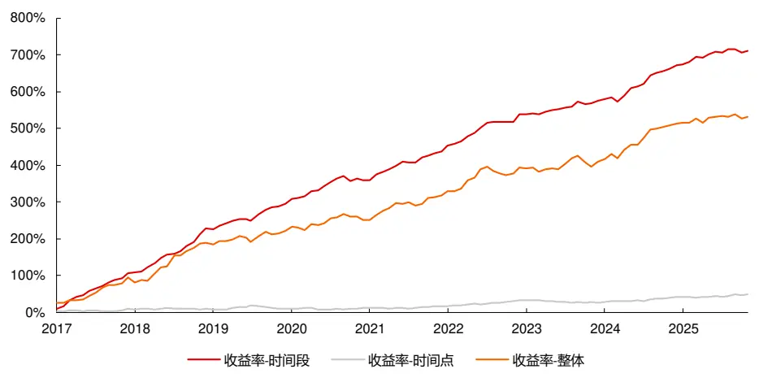
资料来源：天软科技，长江证券研究所

所以时间点的意义不在于直接提取数据，而是以该时间点为起点进行进一步展开，即先提取极致信息，再衍生放宽信息，达到信息提取的平衡以提高信噪比。

时间点划分的维度和时间段相同，即交易性质维度，详情可见《高频因子（十九）：收益来源基础的因子挖掘方法论二——时间段切割因子》表 4，将阈值提取到（局部）最大、最小即可。从极值点出发，给出了以下向量化的方法：

表 2：极值时间点确定方法

| 基本维度 | 具体含义 |
| --- | --- |
| 最大最小点 | 维度最大时间点、最小时间点 |
| 全局极值 第二最大最小点 | 维度最大时间点、最小时间点之外的极值点 |
| 分位数点 | 如中位数点 |
| 时间段起点 | 在时间段划分后，第一、最后的时间点 |
| 局部极值 趋势起点 | 趋势划分下各个趋势起点、终点 |
| 滚动最大最小点 | 时间窗口内前后滚动极值点 |

资料来源：长江证券研究所

下表给出了常用交易性质维度下，得到时间点之前时序处理的含义：

表 3：交易性质维度时序处理含义

|  | 原值 | 滚动 | 累计 | 累计计算 | 时间段极值 |
| --- | --- | --- | --- | --- | --- |
| 收益率 | 价格变动 | 平滑价格变动 | 等同收盘价原值 | 价格变动效率 | 根据某一维度得到的时间段， 在该时间段内进行前部分操作 |
| 振幅 | 价格波动 | 平滑价格波动 | 无意义 | 累计价格波动 |  |
| 波动率 | 无意义 | 价格波动 | 无意义 | 累计价格波动 |  |
| 成交量（成交额、每笔 成交额同) | 成交活跃 | 平滑成交活跃 | 无意义 | 累计成交活跃 |  |
| 量价相关性 | 无意义 | 交易拥挤度 | 筹码结构 | 累计交易拥挤 |  |
| 收盘价 | 市场定价 | 平滑定价 | 无意义 | 平滑定价 |  |

资料来源：长江证券研究所

在时间点的扩充上，本文共总结以下方式：

时间点局部：选择时间点前后若干数据，从时间点扩充至时间段，按照时间段切割方法构建因子；

时间点区间：由两个或多个时间点作为起点或终点，得到区间作为时间段，按照时间段切割方法构建因子；

时间点特点：得到单个或多个时间点特征，通过实现 k 序算子进行信息合并。

## 时间点局部因子

## 因子构建

时间点局部即在得到时间点后，以时间点为中心向前、向后扩充时间段，得到交易性质极端情况下的信息表达，该过程自由度为 2，分别为得到时间点的方法、时间点扩充的长度。本节以价格-高点-振幅因子，展示该类因子的计算过程：

1.1 价格滞后：时序变换算子——时间滞后（价格）；

1.2 价格滚动均值：匹配变换算子——平均值（价格，价格滞后）；

1.3 价格最大值：时序变换算子——最大值（价格滚动均值）；

1.4 价格高点：时序变换算子——前 0-1 化（价格最大值）；

1.5 价格高点局部区间：时序变换算子——前后局部 0-1 化（价格高点）；

## 2.连续向量：振幅

3.价格-高点-振幅：匹配 K 线算子——加权求和（价格高点局部区间，振幅）。

下表分别给出了中证 800 和中证全指范围内，价格-高点-振幅因子和风格因子的相关性1，因子主要和波动率、BP、换手率因子相关性较高，即属于低波价值收益来源，同时和规模因子呈一定的负相关，偏小市值。

表 4：中证 800 价格-高点-振幅因子和风格因子相关性

|  | 振幅-价格高点 | 波动率 | 规模 | 动量 | 反转 | BP | DP | 换手率 | 成长 | 盈利 |
| --- | --- | --- | --- | --- | --- | --- | --- | --- | --- | --- |
| 振幅-价格高点 | 100.00% | 70.08% | -17.51% | 16.10% | 26.46% | -24.25% | -31.42% | 53.98% | -1.65% | -15.76% |
| 波动率 | 70.08% | 100.00% | -9.97% | 23.36% | 33.06% | -37.47% | -27.18% | 60.41% | 0.39% | -2.96% |
| 规模 | -17.51% | -9.97% | 100.00% | 22.21% | 9.39% | 7.34% | 21.19% | -26.51% | 3.90% | 22.67% |
| 动量 | 16.10% | 23.36% | 22.21% | 100.00% | 1.20% | -22.93% | -7.33% | 17.28% | 6.87% | 15.33% |
| 反转 | 26.46% | 33.06% | 9.39% | 1.20% | 100.00% | -9.06% | -2.82% | 20.49% | 1.09% | 3.09% |
| BP | -24.25% | -37.47% | 7.34% | -22.93% | -9.06% | 100.00% | 35.57% | -24.60% | -2.76% | -17.80% |
| DP | -31.42% | -27.18% | 21.19% | -7.33% | -2.82% | 35.57% | 100.00% | -23.77% | 0.96% | 25.02% |
| 换手率 | 53.98% | 60.41% | -26.51% | 17.28% | 20.49% | -24.60% | -23.77% | 100.00% | 0.90% | -7.77% |
| 成长 | -1.65% | 0.39% | 3.90% | 6.87% | 1.09% | -2.76% | 0.96% | 0.90% | 100.00% | 17.60% |
| 盈利 | -15.76% | -2.96% | 22.67% | 15.33% | 3.09% | -17.80% | 25.02% | -7.77% | 17.60% | 100.00% |

资料来源：天软科技，长江证券研究所

表 5：中证全指价格-高点-振幅因子和风格因子相关性

|  | 振幅-价格高点 | 波动率 | 规模 | 动量 | 反转 | BP | DP | 换手率 | 成长 | 盈利 |
| --- | --- | --- | --- | --- | --- | --- | --- | --- | --- | --- |
| 振幅-价格高点 | 100.00% | 72.26% | -19.54% | 18.70% | 28.76% | -28.57% | -29.21% | 57.21% | -1.97% | -9.29% |
| 波动率 | 72.26% | 100.00% | -14.02% | 23.79% | 35.90% | -34.82% | -24.72% | 64.02% | -0.84% | -4.17% |
| 规模 | -19.54% | -14.02% | 100.00% | 13.16% | 5.99% | 16.63% | 25.30% | -29.93% | 1.74% | 9.51% |
| 动量 | 18.70% | 23.79% | 13.16% | 100.00% | -2.27% | -25.35% | -8.89% | 19.33% | 2.46% | 4.97% |
| 反转 | 28.76% | 35.90% | 5.99% | -2.27% | 100.00% | -10.14% | -3.46% | 23.68% | 0.45% | 0.81% |
| BP | -28.57% | -34.82% | 16.63% | -25.35% | -10.14% | 100.00% | 34.64% | -25.27% | -0.10% | 0.72% |
| DP | -29.21% | -24.72% | 25.30% | -8.89% | -3.46% | 34.64% | 100.00% | -20.41% | 1.98% | 11.14% |
| 换手率 | 57.21% | 64.02% | -29.93% | 19.33% | 23.68% | -25.27% | -20.41% | 100.00% | -0.47% | -3.71% |
| 成长 | -1.97% | -0.84% | 1.74% | 2.46% | 0.45% | -0.10% | 1.98% | -0.47% | 100.00% | 7.35% |
| 盈利 | -9.29% | -4.17% | 9.51% | 4.97% | 0.81% | 0.72% | 11.14% | -3.71% | 7.35% | 100.00% |

资料来源：天软科技，长江证券研究所

下图给出了因子在中证 800 和中证全指范围内，市值行业中性和量价中性（市值、行业、波动率、换手率）2后的累计 IC，并在下表中给出了各个板块不同时间段的 IC 统计：

因子在量价中性后累积 IC 有一定程度上的降低，低波收益来源贡献了因子的部分信息；

- 2025 年以来3因子 IC 有一定程度的下降。

图 2：价格-高点-振幅因子累积IC
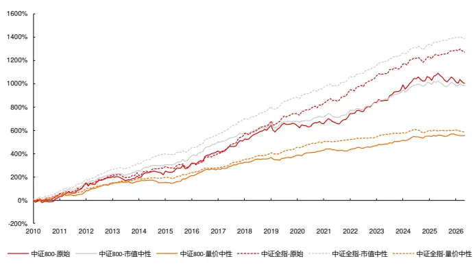
资料来源：天软科技，长江证券研究所

表 6：价格-高点-振幅因子IC统计

| IC |  |  | ICIR | IC-2025 | ICIR-2025 |
| --- | --- | --- | --- | --- | --- |
| 中证800 | 原始 | 5.08% | 33.41% | -3.18% | -15.09% |
|  | 市值中性 | 5.01% | 49.72% | -1.22% | -9.57% |
|  | 量价中性 | 2.82% | 48.24% | 0.41% | 8.01% |
| 全市场 | 原始 | 6.44% | 50.07% | 2.62% | 22.23% |
|  | 市值中性 | 7.04% | 73.03% | 3.31% | 36.96% |
|  | 量价中性 | 2.99% | 59.08% | 0.06% | 1.23% |

资料来源：天软科技，长江证券研究所

下图给出了市值行业中性后的价格-高点-振幅因子在中证 800、中证全指范围内的分组净值，并在下表中给出了分年的风险指标：

中证 800 内，除2017、2019、2025、2026 年外因子均可获得超额收益，中证全指中，除 2025、2026 年外因子均可以获得超额收益；

从超额最大回撤上看，因子的失效区间主要集中在 2020、2021、2025、2026 年；

- 中证800内因子在多头和空头的收益上较为均匀，中证全指中因子空头能力更强。

图 3：中证 800 市值行业中性价格-高点-振幅因子分组净值
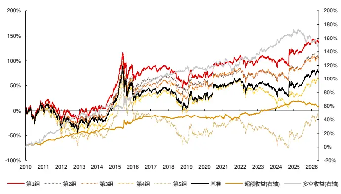
资料来源：天软科技，长江证券研究所

图 4：中证全指市值行业中性价格-高点-振幅因子分组净值
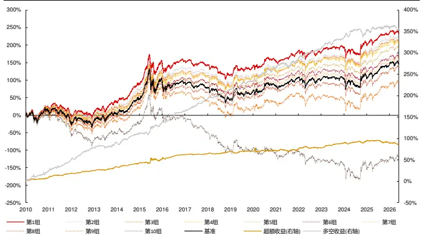
资料来源：天软科技，长江证券研究所

表 7：市值行业中性价格-高点-振幅因子风险指标

| 中证800 |  |  |  |  |  |  |  |  |  |  |
| --- | --- | --- | --- | --- | --- | --- | --- | --- | --- | --- |
| 超额收益 超额最大回撤 |  | 信息比 | 多空收益 多空最大回撤 多空信息比 超额收益 超额最大回撤 |  |  |  | 中证全指 信息比 |  | 多空收益 多空最大回撤 多空信息比 |  |
| 20105.57% | 2.93% | 1.59 | 11.09% | 6.34% | 1.37 8.67% | 2.49% | 2.17 | 25.70% | 6.67% | 2.55 |
| 2011 8.93% | 1.39% | 3.22 | 21.59% | 3.99% | 3.21 10.61% | 1.51% | 3.16 | 31.50% | 4.31% | 3.37 |
| 2012 6.76% | 1.80% | 2.66 | 18.21% | 2.67% | 3.28 6.91% | 1.63% | 2.38 | 33.74% | 3.54% | 4.34 |
| 2013 3.03% | 3.67% | 1.04 | 5.40% | 8.41% | 0.74 8.92% | 2.22% | 2.60 | 11.47% | 6.74% | 1.39 |
| 2014 2.32% | 2.50% | 0.83 | 4.50% | 6.47% | 0.75 | 9.08% 1.31% | 2.96 | 25.36% | 5.15% | 3.06 |
| 2015 11.20% | 6.90% | 1.28 | 19.37% | 11.01% | 1.28 | 9.61% 6.47% | 1.05 | 27.57% | 6.79% | 1.97 |
| 2016 8.73% | 1.75% | 2.36 | 25.04% | 3.19% | 3.00 | 11.27% 4.36% | 2.52 | 30.98% | 5.44% | 3.09 |
| 2017-2.21% | 4.35% | -0.83 | 9.95% | 4.01% | 1.55 | 2.25% 1.77% | 1.04 | 32.43% | 3.15% | 3.88 |
| 20184.32% | 2.04% | 1.39 | 11.44% | 2.67% | 1.87 | 6.08% 3.03% | 1.88 | 26.28% | 5.01% | 2.95 |
| 2019 -3.95% | 4.20% | -1.17 | -2.09% | 10.74% | -0.13 | 0.22% | 4.86% 0.07 | 22.01% | 12.63% | 2.12 |
| 20200.43% | 5.64% | 0.13 | 6.02% | 6.47% | 0.70 | 0.83% | 9.28% 0.16 | 33.25% | 9.56% | 2.40 |
| 2021 1.77% | 8.23% | 0.28 | 4.79% | 17.25% | 0.49 | 2.94% | 5.75% 0.59 | 23.47% | 12.13% | 1.60 |
| 2022 4.76% | 4.41% | 0.85 | 12.74% | 7.98% | 1.15 | 3.99% | 4.98% 0.70 | 28.01% | 5.78% | 2.22 |
| 2023 7.25% | 1.89% | 2.59 | 11.95% | 5.55% | 1.86 | 11.15% | 1.30% 3.80 | 26.96% | 8.18% | 3.05 |
| 2024 11.56% | 2.04% | 2.67 | 24.96% | 5.53% | 2.57 | 6.04% | 4.86% | 1.24 19.68% | 17.67% | 1.46 |
| 2025 -4.03% | 6.75% | -1.10 | -11.61% | 19.85% | -1.02 | -4.04% | 5.96% | -0.87 9.56% | 8.30% | 0.78 |
| 2026 -3.83% | 4.35% | -1.75 | -8.19% | 10.96% | -1.24 | -2.66% | 4.81% | -0.90 -5.14% | 10.77% | -0.62 |
| 总计 3.84% | 9.17% | 0.90 | 9.95% | 24.56% | 1.08 | 5.71% | 9.41% | 1.18 | 25.23% 17.67% | 2.15 |

资料来源：天软科技，长江证券研究所

下图给出了量价中性后的价格-高点-振幅因子在中证 800、中证全指范围内的分组净值，并在下表中给出了分年的风险指标：

中证 800 内，除 2014、2017、2019、2020 年外因子均可获得超额收益，中证全指中获得负超额收益的年份较多；

从超额最大回撤上看，因子的失效区间主要集中在 2020、2022 年；

图 5：中证 800量价中性价格-高点-振幅因子分组净值
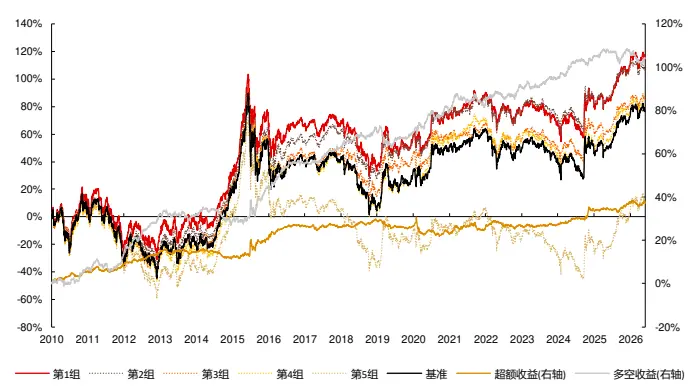
资料来源：天软科技，长江证券研究所

图 6：中证全指量价中性价格-高点-振幅因子分组净值
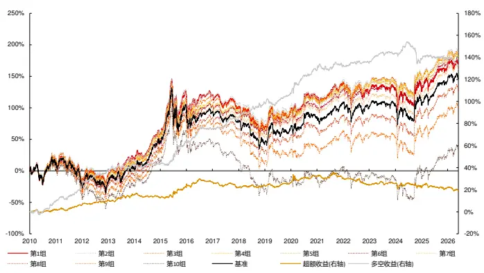
资料来源：天软科技，长江证券研究所

表 8：量价中性价格-高点-振幅因子风险指标

| 中证800 |  |  |  |  |  |  |  |  |  |
| --- | --- | --- | --- | --- | --- | --- | --- | --- | --- |
| 超额收益 超额最大回撤 | 信息比 |  | 多空收益 多空最大回撤 多空信息比 超额收益 超额最大回撤 |  |  |  | 中证全指 信息比 | 多空收益 多空最大回撤 多空信息比 |  |
| 2010 5.76% | 1.91% | 1.84 | 7.75% | 3.68% 1.41 | 1.75% | 3.88% | 0.53 | 9.44% | 4.35% 1.47 |
| 2011 3.20% | 2.70% | 1.27 | 6.13% 5.73% | 1.36 | 4.40% | 2.68% | 1.40 14.34% | 3.16% | 2.80 |
| 2012 5.81% | 1.35% | 2.41 | 19.88% 2.07% | 4.51 | 4.43% | 1.79% | 1.70 17.27% | 1.65% | 3.78 |
| 2013 0.11% | 2.32% | 0.08 | 0.09% 4.71% | 0.06 | 4.77% | 2.21% | 1.18 | 3.92% 5.00% | 0.79 |
| 2014-2.15% | 4.75% | -0.87 | -2.78% 8.18% | -0.60 | -2.05% | 4.23% | -0.71 | 1.78% 3.57% | 0.30 |
| 2015 8.58% | 5.10% | 1.35 | 16.71% 7.41% | 1.72 | 9.66% | 3.14% | 1.61 | 20.81% 3.98% | 2.10 |
| 2016 6.39% | 1.25% | 2.38 | 12.18% 2.28% | 2.94 | 4.83% | 3.30% | 1.07 | 13.08% 2.72% | 2.39 |
| 2017 -0.59% | 2.54% | -0.25 | 7.25% 1.93% | 1.86 | -4.53% | 5.57% | -1.37 | 9.96% 3.09% | 1.94 |
| 2018 3.22% | 1.64% | 1.30 | 8.97% 3.39% | 1.79 | 1.70% | 2.91% | 0.43 | 15.72% 4.07% | 2.31 |
| 2019 -2.89% | 4.08% | -0.98 | -1.41% 9.50% | -0.08 | 2.54% | 3.74% | 0.87 | 8.76% 6.16% | 1.91 |
| 2020-3.41% | 8.44% | -0.80 | 10.10% 3.97% | 1.53 | 5.74% | 5.63% | 0.82 | 22.41% 4.53% | 2.63 |
| 2021 2.48% | 3.63% | 0.66 | 3.28% 6.20% | 0.60 | -1.14% | 5.59% | -0.27 | 5.42% 6.22% | 0.87 |
| 2022 1.19% | 3.87% | 0.14 | 8.53% 3.83% | 1.31 | -6.77% | 6.69% | -1.95 | 1.55% 2.83% | 0.46 |
| 2023 0.45% | 1.46% | 0.26 | 3.93% 3.69% | 1.03 | 1.82% | 3.31% | 0.53 | 9.51% 3.11% | 2.33 |
| 2024 7.34% | 1.83% | 1.84 | 10.82% 3.12% | 2.06 | -2.86% | 5.09% | -0.40 | -5.61% 18.06% | -0.65 |
| 2025 3.57% | 2.11% | 1.51 | 1.87% 6.65% | 0.41 | -0.74% | 5.66% | -0.15 | 1.52% 4.91% | 0.41 |
| 2026 0.13% | 2.71% | 0.09 | -2.54% | 6.12% -0.86 | -2.43% | 4.00% | -1.47 | -6.13% 8.39% | -3.24 |
| 总计 2.42% | 8.44% | 0.72 | 6.83% | 9.50% 1.21 | 1.25% | 15.81% | 0.30 | 8.79% | 20.07% 1.41 |

资料来源：天软科技，长江证券研究所

## 时间点区间因子

## 因子构建

时间点区间即在得到多个时间点后，取时间点之间的时间段，再按照时间段切割因子的方法得到因子，故这一过程涉及多个可匹配时间点的获取过程，从极值点出发本文整理了以下方式：

最大最小时间点，时间点之间为主趋势时间段；

- 第一极值点、第二极值点…，时间点之间时间段为脉冲时间段；

高点前后低点，低点前后高点，时间点之间时间段为趋势时间段。

本节以成交量-前低后低-平均收益率因子，展示该类因子的计算过程：

1.1 成交量滞后：时序变换算子——时间滞后（成交量）；

1.2 成交量滚动均值：匹配变换算子——平均值（成交量，成交量滞后）；

1.3 成交量最大值：时序变换算子——最大值（成交量滚动均值）；

1.5 成交量前低：时序变换算子——前 0-1 化（成交量最大值），时序变换算子——最小值（前值），时序变换算子——后 0-1 化（前值）；

1.6 成交量后低：时序变换算子——后 0-1 化（成交量最大值），时序变换算子——最小值（前值），时序变换算子——前 0-1 化（前值）；

1.7 成交量前低至后低区间：匹配变换算子——且逻辑（成交量前低，成交量后低）。

## 2.连续向量：收益率

3. 成交量-前低后低-平均收益：匹配 K 线算子——加权平均（成交量前低至后低区间，收益率）。

下表分别给出了中证 800 和中证全指范围内，成交量-前低后低-平均收益率因子和风格因子的相关性，因子主要和波动率、反转、换手率因子相关性较高，和基本量价因子收益来源较为重合。

表 9：中证 800 成交量-前低后低-平均收益率因子和风格因子相关性

|  | 平均收益率-成交量区间 | 波动率 | 规模 | 动量 | 反转 | BP | DP | 换手率 | 成长 | 盈利 |
| --- | --- | --- | --- | --- | --- | --- | --- | --- | --- | --- |
| 平均收益率-成交量区间 | 100.00% | 29.68% | 2.27% | 0.92% | 62.18% | -7.29% | -6.87% | 22.40% | -0.18% | -3.14% |
| 波动率 | 29.68% | 100.00% | -9.97% | 23.36% | 33.06% | -37.47% | -27.18% | 60.41% | 0.39% | -2.96% |
| 规模 | 2.27% | -9.97% | 100.00% | 22.21% | 9.39% | 7.34% | 21.19% | -26.51% | 3.90% | 22.67% |
| 动量 | 0.92% | 23.36% | 22.21% | 100.00% | 1.20% | -22.93% | -7.33% | 17.28% | 6.87% | 15.33% |
| 反转 | 62.18% | 33.06% | 9.39% | 1.20% | 100.00% | -9.06% | -2.82% | 20.49% | 1.09% | 3.09% |
| BP | -7.29% | -37.47% | 7.34% | -22.93% | -9.06% | 100.00% | 35.57% | -24.60% | -2.76% | -17.80% |
| DP | -6.87% | -27.18% | 21.19% | -7.33% | -2.82% | 35.57% | 100.00% | -23.77% | 0.96% | 25.02% |
| 换手率 | 22.40% | 60.41% | -26.51% | 17.28% | 20.49% | -24.60% | -23.77% | 100.00% | 0.90% | -7.77% |
| 成长 | -0.18% 0.39% |  | 3.90% | 6.87% |  |  |  |  |  |  |
|  |  |  |  |  | 1.09% |  |  |  |  |  |
|  |  |  |  |  |  | -2.76% | 0.96% | 0.90% | 100.00% | 17.60% |
| 盈利 | -3.14% -2.96% |  | 22.67% | 15.33% | 3.09% | -17.80% | 25.02% | -7.77% | 17.60% | 100.00% |

资料来源：天软科技，长江证券研究所

表 10：中证全指成交量-前低后低-平均收益率因子和风格因子相关性

|  | 平均收益率-成交量区间 | 波动率 | 规模 | 动量 | 反转 | BP | DP | 换手率 | 成长 | 盈利 |
| --- | --- | --- | --- | --- | --- | --- | --- | --- | --- | --- |
| 平均收益率-成交量区间 | 100.00% | 35.00% | -1.29% | 1.07% | 58.79% | -10.83% | -8.62% | 27.88% | -0.33% -2.59% |  |
| 波动率 | 35.00% | 100.00% | -14.02% | 23.79% | 35.90% | -34.82% | -24.72% | 64.02% | -0.84% | -4.17% |
| 规模 | -1.29% | -14.02% | 100.00% | 13.16% | 5.99% | 16.63% | 25.30% | -29.93% | 1.74% | 9.51% |
| 动量 | 1.07% | 23.79% | 13.16% | 100.00% | -2.27% | -25.35% | -8.89% | 19.33% | 2.46% | 4.97% |
| 反转 | 58.79% | 35.90% | 5.99% | -2.27% | 100.00% | -10.14% | -3.46% | 23.68% | 0.45% | 0.81% |
| BP | -10.83% | -34.82% | 16.63% | -25.35% | -10.14% | 100.00% | 34.64% | -25.27% | -0.10% | 0.72% |
| DP | -8.62% | -24.72% | 25.30% | -8.89% | -3.46% | 34.64% | 100.00% | -20.41% | 1.98% | 11.14% |
| 换手率 | 27.88% | 64.02% | -29.93% | 19.33% | 23.68% | -25.27% | -20.41% | 100.00% | -0.47% | -3.71% |
| 成长 | -0.33% | -0.84% | 1.74% | 2.46% | 0.45% | -0.10% | 1.98% | -0.47% | 100.00% | 7.35% |
| 盈利 | -2.59% | -4.17% | 9.51% | 4.97% | 0.81% | 0.72% | 11.14% | -3.71% | 7.35% | 100.00% |

资料来源：天软科技，长江证券研究所

下图给出了因子在中证 800 和中证全指范围内，市值行业中性和量价中性（市值、行业、波动率、换手率）后的累计 IC，并在下表中给出了各个板块不同时间段的 IC 统计：

因子在量价中性后累积 IC 有一定程度上的降低，低波收益来源贡献了因子的部分信息；

- 2025 年以来因子 IC 有一定程度的下降。

图 7：成交量-前低后低-平均收益率因子累积 IC
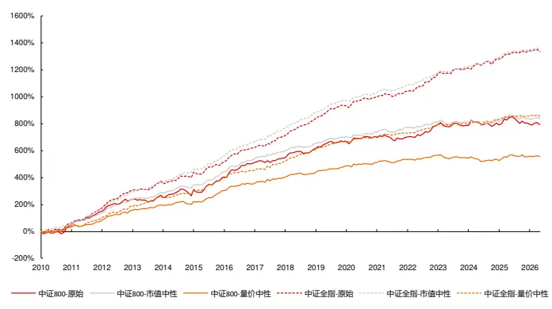
资料来源：天软科技，长江证券研究所

表 11：成交量-前低后低-平均收益率因子IC统计

| IC |  |  | ICIR | IC-2025 | ICIR-2025 |
| --- | --- | --- | --- | --- | --- |
| 中证800 | 原始 | 4.00% | 32.49% | -0.70% | -4.48% |
|  | 市值中性 | 4.23% | 53.86% | 0.62% | 5.58% |
|  | 量价中性 | 2.80% | 39.21% | 1.02% | 11.85% |
| 全市场 | 原始 | 6.74% | 69.45% | 3.01% | 33.85% |
|  | 市值中性 | 6.84% | 99.87% | 3.39% | 54.23% |
|  | 量价中性 | 4.35% | 70.31% | 1.58% | 32.65% |

资料来源：天软科技，长江证券研究所

下图给出了市值行业中性后的成交量-前低后低-平均收益率因子在中证 800、中证全指范围内的分组净值，并在下表中给出了分年的风险指标：

中证 800 内获得负超额收益年份较多，中证全指中，除 2017、2022 年外因子均可以获得超额收益；

从超额最大回撤上看，因子的失效区间主要集中在 2020、2024 年；

图 8：中证 800 市值行业中性成交量-前低后低-平均收益率因子分组净值
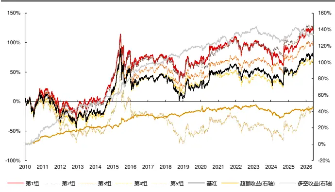
资料来源：天软科技，长江证券研究所

图 9：中证全指市值行业中性成交量-前低后低-平均收益率因子分组净
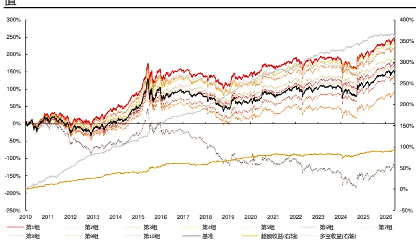
资料来源：天软科技，长江证券研究所

表 12：市值行业中性成交量-前低后低-平均收益率因子风险指标

| 中证800 |  |  |  |  |  |  |  |  |  |  |
| --- | --- | --- | --- | --- | --- | --- | --- | --- | --- | --- |
| 超额收益 超额最大回撤 |  | 信息比 | 多空收益 多空最大回撤 多空信息比 超额收益 超额最大回撤 |  |  |  | 信息比 |  | 多空收益 多空最大回撤 多空信息比 |  |
| 20109.23% | 1.61% | 2.60 | 17.16% | 3.84% | 2.14 11.44% | 2.61% | 2.71 | 29.02% | 5.44% | 3.05 |
| 2011 3.72% | 2.29% | 1.20 | 15.41% | 2.93% | 2.41 7.25% | 2.12% | 2.09 | 29.40% | 4.11% | 3.47 |
| 2012 4.64% | 2.17% | 1.47 | 16.60% | 3.12% | 2.78 8.89% | 1.72% | 2.50 | 37.62% | 1.95% | 5.08 |
| 2013 3.54% | 1.84% | 1.15 | 5.63% | 4.52% | 0.88 11.28% | 1.57% | 3.05 | 18.77% | 2.41% | 2.57 |
| 2014 -1.09% | 4.60% | -0.35 | 3.50% | 5.52% | 0.66 0.04% | 4.56% | 0.01 | 14.74% | 3.36% | 2.26 |
| 2015 12.21% | 4.71% | 2.20 | 31.31% | 6.08% | 2.84 16.96% | 2.99% | 2.97 | 48.46% | 2.78% | 4.33 |
| 2016 5.50% | 2.16% | 1.80 | 17.49% | 2.73% | 3.24 8.95% | 2.55% | 2.32 | 24.47% | 1.93% | 3.84 |
| 2017 -2.54% | 4.96% | -0.80 | 4.93% | 4.82% | 0.96 | -3.05% 5.81% | -0.92 | 17.47% | 3.88% | 2.84 |
| 2018 2.65% | 4.26% | 0.86 | 9.75% | 5.69% | 1.73 | 8.95% 2.76% | 2.14 | 38.19% | 2.35% | 5.46 |
| 20193.77% | 1.22% | 1.36 | 6.46% | 3.01% | 1.37 | 9.12% 1.44% | 3.08 | 32.15% | 3.39% | 4.57 |
| 2020 2.89% | 7.12% | 0.49 | 8.14% | 5.93% | 1.08 | 5.91% 9.91% | 0.68 | 25.74% | 5.37% | 2.42 |
| 2021 4.16% | 3.71% | 0.86 | 10.75% | 9.77% | 1.15 | 0.76% 6.27% | 0.08 | 17.31% | 9.27% | 1.46 |
| 2022 -0.02% | 4.70% | 0.03 | 5.83% | 5.64% | 0.84 | -0.37% 4.74% | 0.06 | 30.19% | 5.41% | 3.01 |
| 2023 -5.80% | 7.82% | -1.72 | -7.74% | 11.19% | -1.24 | 0.25% 3.57% | -0.09 | 11.86% | 5.21% | 1.54 |
| 2024-3.01% | 8.47% | -0.48 | -0.73% | 9.00% | 0.04 | 3.10% | 9.30% 0.52 | 23.67% | 6.60% | 2.02 |
| 2025 4.59% | 2.85% | 1.26 | 1.29% | 10.99% | 0.19 | 4.69% | 2.86% | 1.05 16.62% | 4.67% | 1.67 |
| 2026 1.63% | 2.11% | 0.66 | -0.88% | 4.18% | -0.42 | 1.06% | 2.48% | 0.38 -4.09% | 6.94% | -0.87 |
| 总计 2.82% | 15.29% | 0.72 | 8.81% | 17.94% | 1.21 | 5.90% | 11.82% | 1.19 25.64% | 9.27% | 2.72 |

资料来源：天软科技，长江证券研究所

下图给出了量价中性后的成交量-前低后低-平均收益率因子在中证 800、中证全指范围内的分组净值，并在下表中给出了分年的风险指标：

- 中证 800 和中证全指中，获得负超额收益的年份较多；

从超额最大回撤上看，因子的失效区间主要集中在 2020、2024 年；

图 10：中证 800量价中性成交量-前低后低-平均收益率因子分组净值
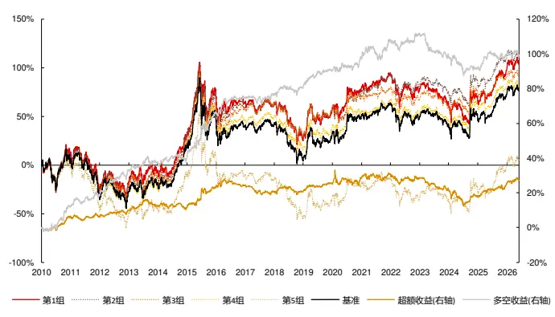
资料来源：天软科技，长江证券研究所

图 11：中证全指量价中性成交量-前低后低-平均收益率因子分组净值
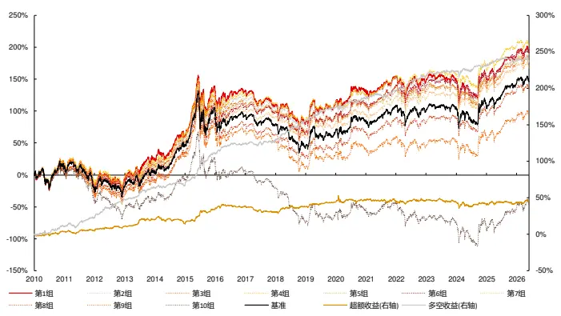
资料来源：天软科技，长江证券研究所

表 13：量价中性成交量-前低后低-平均收益率因子风险指标

| 中证800 |  |  |  |  |  |  |  |  |  |  |
| --- | --- | --- | --- | --- | --- | --- | --- | --- | --- | --- |
|  | 超额收益 超额最大回撤 | 信息比 | 多空收益 多空最大回撤 多空信息比 超额收益 超额最大回撤 |  |  |  | 信息比 | 中证全指 | 多空收益 多空最大回撤 多空信息比 |  |
| 2010 6.55% | 2.16% | 1.92 | 12.85% | 3.56% | 1.98 3.57% | 3.17% | 0.92 | 10.77% | 4.58% | 1.51 |
| 2011 0.15% | 3.41% | -0.05 | 7.11% | 3.55% | 1.32 1.38% | 4.57% | 0.31 | 13.80% | 6.66% | 2.04 |
| 2012 3.37% | 2.51% | 1.09 | 14.86% | 4.29% | 2.54 6.27% | 3.02% | 1.57 | 28.01% | 2.71% | 4.02 |
| 2013 3.04% | 4.09% | 0.82 | 5.12% | 4.76% | 0.83 | 9.32% 3.23% | 1.88 | 16.74% | 3.21% | 2.65 |
| 2014 -1.15% | 3.97% | -0.39 | 1.92% | 4.29% | 0.41 | -5.35% 9.46% | -1.15 | 3.35% | 4.51% | 0.57 |
| 2015 12.26% | 3.32% | 2.19 | 31.21% | 5.93% | 2.91 | 21.67% 3.06% | 3.44 | 56.53% | 4.22% | 5.17 |
| 2016 1.17% | 4.23% | 0.43 | 8.15% | 3.34% | 1.61 | 4.47% 3.97% | 1.00 | 13.85% | 3.04% | 2.22 |
| 2017-3.76% | 5.57% | -1.14 | 1.80% | 4.40% | 0.41 | -7.87% 8.76% | -1.94 | 4.09% | 5.50% | 0.78 |
| 2018 -0.03% | 4.78% | 0.04 | 3.94% | 5.52% | 0.78 | 7.48% 3.53% | 1.51 | 29.60% | 3.24% | 3.75 |
| 2019 4.70% | 1.47% | 1.41 | 10.88% | 2.28% | 2.22 | 6.69% | 2.01% 1.68 | 21.32% | 1.68% | 3.76 |
| 2020 3.36% | 8.69% | 0.50 | 7.33% | 3.92% | 1.08 | 3.40% | 9.65% 0.39 | 13.27% | 5.14% | 1.58 |
| 2021 2.42% | 4.17% | 0.43 | 10.64% | 7.73% | 1.24 | -1.40% | 4.76% -0.30 | 11.44% | 6.60% | 1.22 |
| 2022 -2.21% | 5.79% | -0.42 | 4.28% | 5.81% | 0.68 | 0.06% | 4.59% 0.16 | 21.79% | 3.67% | 2.46 |
| 2023 -5.64% | 7.24% | -1.55 | -11.38% | 13.50% | -1.83 | -1.03% | 5.73% | -0.39 7.31% | 3.85% | 1.00 |
| 2024 -4.57% | 9.24% | -0.73 | -7.42% | 11.25% | -0.96 | -3.38% | 8.38% | -0.37 8.34% | 8.24% | 0.98 |
| 2025 7.37% | 2.74% | 1.83 | 7.50% | 5.05% | 1.29 | 2.05% | 4.44% | 0.41 7.96% | 5.62% | 1.17 |
| 2026 2.16% | 1.77% | 0.77 | -1.20% | 3.80% | -0.66 | 1.47% | 2.65% | 0.54 -2.88% | 6.63% | -0.86 |
| 总计 1.74% | 18.80% | 0.42 | 6.42% | 21.83% | 0.98 | 2.88% | 16.20% | 0.54 16.14% | 8.92% | 2.03 |

资料来源：天软科技，长江证券研究所

## 时间点特点因子因子构建

时间点特点即对时间点数据做特征统计，时间点一般为同一规则下筛选出来的多个时间点，统计特征除了和时间段切割因子相同的信息表达维度，还可以是时间维度的特征统计，如时间点个数、时间点（平均）距离、时间点最大（小）间距、维度时间点平均、维度时间点趋势等。本节以成交量-高点个数，展示该类因子的计算过程：

1.1 成交量滞后：时序变换算子——时间滞后（成交量）；

1.2 成交量滚动最大值：匹配变换算子——最大值（成交量，成交量滞后）；

1.3 成交量极值：匹配变换算子——相等逻辑（成交量，成交量滚动最大值）；

1.4 成交量统计：时序 K 线算子——平均值（成交量）、标准差（成交量）；

1.5 成交量阈值：成交量平均值+成交量标准差

1.6 成交量规模筛选：匹配变换算子——大于 0-1 化（成交量，成交量阈值）；

1.7 成交量时间点：匹配变换算子——且逻辑（成交量极值，成交量规模筛选）。

## 2.连续向量：向量 1

3. 成交量-高点个数：匹配 K线算子——加权求和（向量 1，成交量时间点）。

下表分别给出了中证 800 和中证全指范围内，成交量-高点个数因子和风格因子的相关性，因子主要和波动率、换手率因子相关性较高，即属于低波价值收益来源，同时和规模因子呈一定的负相关，偏小市值。

表 14：中证 800成交量-高点个数因子和风格因子相关性

|  | 高点个数 | 波动率 | 规模 动量 |  | 反转 | BP | DP | 换手率 | 成长 盈利 |  |
| --- | --- | --- | --- | --- | --- | --- | --- | --- | --- | --- |
| 高点个数 | 100.00% | -43.01% | -14.55%-12.74% |  | -21.58% | 13.63% | 15.27% | -45.79% | -0.93% 6.77% |  |
| 波动率 | -43.01% | 100.00% | -9.97% | 23.36% | 33.06% | -37.47% | -27.18% | 60.41% | 0.39% | -2.96% |
| 规模 | -14.55% | -9.97% | 100.00% | 22.21% | 9.39% | 7.34% | 21.19% | -26.51% | 3.90% | 22.67% |
| 动量 | -12.74% | 23.36% | 22.21% | 100.00% | 1.20% | -22.93% | -7.33% | 17.28% | 6.87% | 15.33% |
| 反转 | -21.58% | 33.06% | 9.39% | 1.20% | 100.00% | -9.06% | -2.82% | 20.49% | 1.09% 3.09% |  |
| BP | 13.63% | -37.47% | 7.34% | -22.93% | -9.06% | 100.00% | 35.57% | -24.60% | -2.76% | -17.80% |
| DP | 15.27% | -27.18% | 21.19% | -7.33% | -2.82% | 35.57% | 100.00% | -23.77% | 0.96% | 25.02% |
| 换手率 | -45.79% | 60.41% | -26.51% | 17.28% | 20.49% | -24.60% | -23.77% | 100.00% | 0.90% | -7.77% |
| 成长 | -0.93% | 0.39% | 3.90% | 6.87% 1.09% |  | -2.76% | 0.96% 0.90% |  | 100.00% | 17.60% |
| 盈利 6.77% |  | -2.96% | 22.67% | 15.33% | 3.09% | -17.80% | 25.02% -7.77% |  | 17.60% | 100.00% |

资料来源：天软科技，长江证券研究所

表 15：中证全指成交量-高点个数因子和风格因子相关性

|  | 高点个数 | 波动率 | 规模 | 动量 | 反转 | BP | DP | 换手率 | 成长 盈利 |  |
| --- | --- | --- | --- | --- | --- | --- | --- | --- | --- | --- |
| 高点个数 | 100.00% | -51.03% | -12.60% | -15.17% | -26.28% | 15.44% | 13.58% | -48.87% | 0.87% 4.54% |  |
| 波动率 | -51.03% | 100.00% | -14.02% | 23.79% | 35.90% | -34.82% | -24.72% | 64.02% | -0.84% -4.17% |  |
| 规模 | -12.60% | -14.02% | 100.00% | 13.16% | 5.99% | 16.63% | 25.30% | -29.93% | 1.74% 9.51% |  |
| 动量 | -15.17% | 23.79% | 13.16% | 100.00% | -2.27% | -25.35% | -8.89% | 19.33% | 2.46% 4.97% |  |
| 反转 | -26.28% | 35.90% | 5.99% | -2.27% | 100.00% | -10.14% | -3.46% | 23.68% | 0.45% 0.81% |  |
| BP | 15.44% | -34.82% | 16.63% | -25.35% | -10.14% | 100.00% | 34.64% | -25.27% | -0.10% 0.72% |  |
| DP | 13.58% | -24.72% | 25.30% | -8.89% | -3.46% | 34.64% | 100.00% | -20.41% | 1.98% | 11.14% |
| 换手率 | -48.87% | 64.02% | -29.93% | 19.33% | 23.68% | -25.27% | -20.41% | 100.00% | -0.47% | -3.71% |
| 成长 | 0.87% | -0.84% | 1.74% | 2.46% 0.45% |  | -0.10% | 1.98% | -0.47% | 100.00% | 7.35% |
| 盈利 | 4.54% | -4.17% | 9.51% | 4.97% 0.81% |  | 0.72% | 11.14% | -3.71% | 7.35% | 100.00% |

资料来源：天软科技，长江证券研究所

下图给出了因子在中证 800 和中证全指范围内，市值行业中性和量价中性（市值、行业、波动率、换手率）后的累计 IC，并在下表中给出了各个板块不同时间段的 IC 统计：

因子在量价中性后累积 IC 有一定程度上的降低，低波收益来源贡献了因子的部分信息；

- 2025 年以来因子 IC 有一定程度的下降。

图 12：成交量-高点个数因子累积 IC
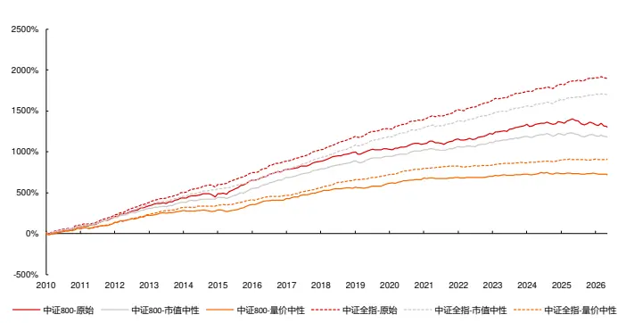
资料来源：天软科技，长江证券研究所

表 16：成交量-高点个数因子 IC统计

| IC ICIR |  |  |  | IC-2025ICIR | -2025 |
| --- | --- | --- | --- | --- | --- |
| 中证800 | 原始 | 6.60% | 53.79% | -3.49% | -19.08% |
|  | 市值中性 | 5.98% | 67.38% | -2.05% | -19.07% |
|  | 量价中性 | 3.65% | 58.82% | -0.90% | -23.56% |
| 全市场 | 原始 | 9.58% | 100.03% | 4.33% | 39.89% |
|  | 市值中性 | 8.61% | 109.80% | 4.01% | 53.47% |
|  | 量价中性 | 4.60% | 88.14% | 0.98% | 25.11% |

资料来源：天软科技，长江证券研究所

下图给出了市值行业中性后的成交量-高点个数因子在中证 800、中证全指范围内的分组净值，并在下表中给出了分年的风险指标：

中证 800 内，除 2025、2026年外因子均可获得超额收益，中证全指中，除 2026年外均可以获得超额收益；

从超额最大回撤上看，因子的失效区间主要集中在 2015、2020、2021、2025、2026 年；

图 13：中证 800市值行业中性成交量-高点个数因子分组净值
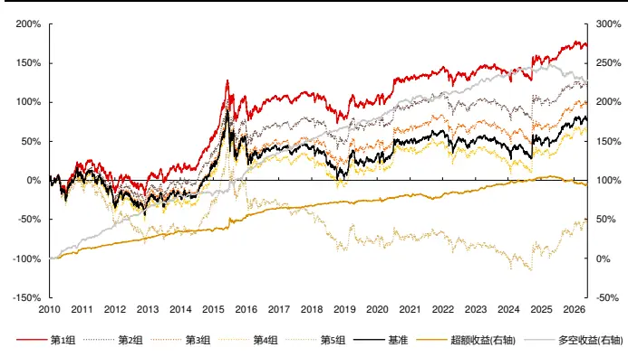
资料来源：天软科技，长江证券研究所

图 14：中证全指市值行业中性成交量-高点个数因子分组净值
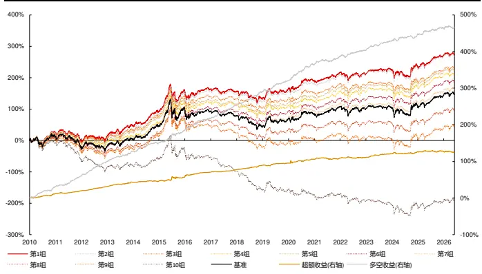
资料来源：天软科技，长江证券研究所

表 17：市值行业中性成交量-高点个数因子风险指标

| 中证800 |  |  |  |  |  |  |  |  |  |  |
| --- | --- | --- | --- | --- | --- | --- | --- | --- | --- | --- |
| 超额收益 超额最大回撤 |  | 信息比 | 多空收益 多空最大回撤 多空信息比 超额收益 超额最大回撤 |  |  |  | 信息比 | 中证全指 | 多空收益 多空最大回撤 多空信息比 |  |
| 2010 13.31% | 1.82% | 4.17 | 27.08% | 3.43% | 4.28 12.42% | 1.64% | 3.51 | 36.15% | 2.95% | 4.54 |
| 2011 7.08% | 1.09% | 3.10 | 20.94% | 2.31% | 3.81 7.72% | 2.21% | 2.82 | 33.34% | 2.66% | 4.40 |
| 2012 7.23% | 0.73% | 3.12 | 24.27% | 1.64% | 4.92 12.92% | 0.66% | 5.18 | 49.94% | 1.48% | 7.93 |
| 2013 8.90% | 1.97% | 2.89 | 18.08% | 2.69% | 2.95 | 12.79% 1.18% | 3.85 | 32.11% | 2.30% | 4.17 |
| 20140.56% | 2.74% | 0.25 | -0.54% | 5.54% | -0.11 | 2.78% 2.42% | 1.14 | 24.54% | 4.61% | 3.93 |
| 2015 18.48% | 6.69% | 2.17 | 33.74% | 7.79% | 2.66 | 11.57% 5.27% | 1.46 | 43.38% | 5.47% | 3.75 |
| 2016 12.72% | 1.62% | 3.48 | 28.24% | 2.70% | 4.49 | 14.52% 1.89% | 3.37 | 37.12% | 3.77% | 4.16 |
| 2017 3.70% | 1.53% | 1.41 | 18.54% | 2.03% | 3.45 | 6.94% 1.26% | 3.08 | 43.86% | 2.85% | 6.28 |
| 2018 5.42% | 1.39% | 2.29 | 18.03% | 2.22% | 3.50 | 12.52% 1.41% | 4.14 | 44.07% | 3.86% | 5.14 |
| 2019 1.23% | 3.35% | 0.43 | 11.46% | 6.04% | 1.80 | 6.41% 2.15% | 2.03 | 35.36% | 5.93% | 4.04 |
| 20205.48% | 4.73% | 1.13 | 23.50% | 3.97% | 3.05 | 10.77% | 6.30% 1.41 | 53.67% | 3.88% | 4.94 |
| 20210.54% | 7.12% | 0.16 | 10.19% | 7.55% | 1.28 | 2.99% | 4.55% 0.82 | 25.71% | 6.35% | 2.46 |
| 2022 7.51% | 2.27% | 1.95 | 13.72% | 3.85% | 2.22 | 2.61% | 4.18% 0.58 | 19.19% | 7.29% | 2.39 |
| 2023 8.87% | 1.63% | 2.95 | 13.03% | 4.27% | 2.21 | 9.63% | 1.79% 3.51 | 27.42% | 4.57% | 4.21 |
| 2024 7.95% | 2.60% | 1.62 | 10.30% | 7.08% | 1.12 | 5.90% | 4.21% | 1.23 19.23% | 8.04% | 1.82 |
| 2025 -4.90% | 6.84% | -1.28 | -8.85% | 15.25% | -0.94 | 1.49% | 3.80% | 0.35 20.53% | 4.68% | 1.87 |
| 2026 -3.83% | 4.62% | -1.53 | -7.88% | 10.60% | -1.32 | -2.10% | 3.96% | -0.73 -0.97% | 6.48% | -0.10 |
| 总计 6.18% | 11.49% | 1.53 | 15.47% | 22.82% | 2.02 | 8.25% | 6.30% | 1.88 34.09% | 8.04% | 3.64 |

资料来源：天软科技，长江证券研究所

下图给出了量价中性后的成交量-高点个数因子在中证 800、中证全指范围内的分组净值，并在下表中给出了分年的风险指标：

中证 800 内，除 2014、2021、2025、2026 年外因子均可获得超额收益，中证全指中，除 2014、2022、2024、2025 年外因子均可以获得超额收益；

从超额最大回撤上看，因子的失效区间主要集中在 2014、2015、2020、2021、2025 年；

- 中证800内因子在多头和空头的收益上较为均匀，中证全指中因子空头能力更强。

图 15：中证 800量价中性成交量-高点个数因子分组净值
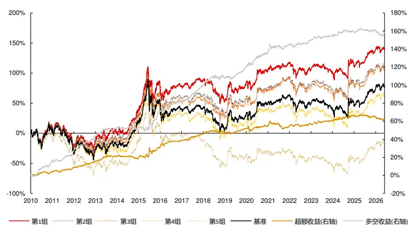
资料来源：天软科技，长江证券研究所

图 16：中证全指量价中性成交量-高点个数因子分组净值
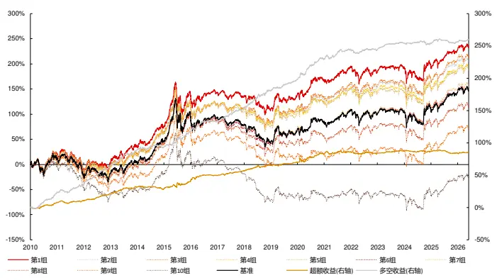
资料来源：天软科技，长江证券研究所

表 18：量价中性成交量-高点个数因子风险指标

| 中证800 |  |  |  |  |  |  |  |  |  |
| --- | --- | --- | --- | --- | --- | --- | --- | --- | --- |
| 超额收益 超额最大回撤 | 信息比 | 多空收益 多空最大回撤 多空信息比 超额收益 超额最大回撤 |  |  |  | 信息比 | 中证全指 多空收益 | 多空最大回撤 | 多空信息比 |
| 2010 4.47% | 2.11% | 1.64 | 17.90% 2.49% | 3.38 | 8.14% | 2.16% | 2.29 | 26.36% | 3.74% 3.96 |
| 2011 4.33% | 2.06% | 1.78 | 10.40% 2.74% | 2.23 | 2.67% | 4.28% | 0.83 | 12.16% 4.95% | 2.09 |
| 2012 7.19% | 1.09% | 2.91 | 18.26% 1.73% | 3.91 | 11.54% | 1.03% | 3.90 | 35.34% 1.55% | 6.08 |
| 2013 5.48% | 1.84% | 1.78 | 9.59% 2.90% | 1.89 | 11.09% | 1.68% | 2.88 | 27.04% 2.91% | 3.98 |
| 2014 -1.87% | 4.44% | -0.75 | -1.57% 5.40% | -0.40 | -3.46% | 5.12% | -1.17 | 3.57% 4.38% | 0.68 |
| 2015 12.25% | 6.73% | 1.64 | 22.38% 8.96% | 2.10 | 12.18% | 4.41% | 1.70 | 29.01% 4.21% | 3.13 |
| 2016 7.93% | 3.16% | 2.33 | 10.76% 4.37% | 2.48 | 10.35% | 2.99% | 2.19 | 16.31% 3.04% | 2.87 |
| 2017 8.12% | 1.67% | 3.05 | 20.64% 1.14% | 4.51 | 7.38% | 2.16% | 2.74 | 22.61% 1.93% | 3.90 |
| 2018 1.48% | 2.34% | 0.57 | 8.40% 5.29% | 1.24 | 8.70% | 2.72% | 2.25 | 30.88% 4.03% | 2.93 |
| 2019 4.35% | 2.61% | 1.59 | 13.08% 3.72% | 2.68 | 4.76% | 1.92% | 1.64 | 18.95% 2.32% | 3.17 |
| 2020 2.67% | 6.20% | 0.50 | 16.59% 3.04% | 2.18 | 14.36% | 5.26% | 1.74 | 37.96% 3.92% | 3.74 |
| 2021 -0.38% | 8.54% | -0.09 | 10.22% 5.41% | 1.51 | 3.40% | 4.89% | 0.86 | 16.47% 6.21% | 2.29 |
| 2022 3.22% | 2.58% | 0.97 | 5.05% 4.86% | 1.30 | -2.72% | 3.92% | -0.69 | -1.08% 6.28% | 0.01 |
| 2023 3.62% | 2.20% | 1.37 | 5.54% 2.87% | 1.53 | 3.93% | 1.17% | 1.83 | 11.23% 1.72% | 3.01 |
| 2024 5.15% | 2.24% | 1.18 | 4.02% 3.06% | 0.82 | -0.97% | 3.31% | -0.25 | -0.87% 6.38% | -0.07 |
| 2025 -0.22% | 3.56% | -0.08 | 1.65% 3.75% | 0.43 | -2.05% | 5.48% | -0.60 | 2.88% 7.48% | 0.68 |
| 2026 -2.49% | 4.06% | -1.27 | -3.01% 5.64% | -1.03 | 1.62% | 1.26% | 1.48 | 3.01% 2.05% | 1.64 |
| 总计 4.07% | 8.54% | 1.08 | 10.53% | 8.96% 1.82 | 5.61% | 5.74% | 1.32 | 17.86% | 7.48% 2.57 |

资料来源：天软科技，长江证券研究所

## 总结

在算子挖掘体系下，时间点划分因子本质为极端离散化向量处理过程。从数学形式上看，在因子计算最后一步的匹配 K 线算子中，其离散向量往往为在满足唯一条件的结果下，反向扩充到其他时间点；从达成的效果上看，是先以极端条件筛选最具代表信息，再放低条件扩充信息，实现信噪比的均衡的离散化向量处理过程。

时间点局部因子即以时间点为中心扩充得到时间段，得到交易性质极端情况下的信息表达。以价格高点前后扩充为离散向量，以振幅为连续向量，得到价格-高点-振幅因子。以 2010 年以来在中证 800 和中证全指范围内选股为例，市值行业中性后 IC 分别为5.01%、7.04%，分组年化超额收益分别为 3.84%、5.71%，中证 800 内因子多头空头较为均匀，中证全指因子空头能力更强；在量价中性后 IC 下降到 2.82%、2.99%，超额收益下降到 2.42%和 1.25%，因子空头能力更强。

时间点区间因子即获得可匹配的多个时间点，以时间点间为时间段，得到极端交易性质间的信息表达。以成交量高点前低点到后低点为离散向量，以收益率为连续向量，得到成交量-前低后低-平均收益率因子。以 2010 年以来在中证 800 和中证全指范围内选股为例，市值行业中性后 IC 分别为 4.23%、6.84%，分组年化超额收益分别为 2.82%、5.90%，因子多头空头较为均匀；在量价中性后 IC 下降到 2.80%、4.35%，超额收益下降到 1.74%和 2.88%，因子空头能力更强。

时间点特点因子即以同一规则筛选出多个时间点，由时间点组成时间段，得到同逻辑下多个极端交易性质的信息表达。以成交量规模以上高点为离散向量，以向量 1 为连续向量，得到成交量-高点个数因子。以 2010 年以来在中证 800 和中证全指范围内选股为例，市值行业中性后IC分别为5.98%、8.61%，分组年化超额收益分别为6.18%、8.25%；因子多头空头较为均匀；在量价中性后IC下降到3.65%、4.60%，超额收益下降到4.07%和 5.61%，中证 800 内因子多头空头较为均匀，中证全指因子空头能力更强。

## 风险提示

1、模型存在失效风险：市场的宏观环境会随经济运行发生变化，投资者的交易行为也会因市场的发展、局部博弈发生变化，若市场的定价模式发生改变，或导致模型的失效；

2、市场交易行为发生变化：影响以历史统计规律得到的因子的实际表现；

3、市场主题行情波动：主题分类不属于传统行业分类，市场交易聚集在局部形成的主题上时会加大策略波动；

4、本文举例均基于历史数据，不保证未来收益：量化模型均基于历史数据的回测，但样本外数据的分布和样本内或有较大变化，使预测收益和实际收益的对应关系产生波动。

## 投资评级说明

| 行业评级 |  | 报告发布日后的12个月内行业股票指数的涨跌幅相对同期相关证券市场代表性指数的涨跌幅为基准，投资建议的评 |  |
| --- | --- | --- | --- |
|  |  | 级标准为： |  |
|  | 看 好： |  | 相对表现优于同期相关证券市场代表性指数 |
|  | 中 | 性： | 相对表现与同期相关证券市场代表性指数持平 |
| 公司评级 | 看 | 淡： | 相对表现弱于同期相关证券市场代表性指数 |
|  |  |  | 报告发布日后的12个月内公司的涨跌幅相对同期相关证券市场代表性指数的涨跌幅为基准，投资建议的评级标准为： |
|  | 买 增 | 入： 持： | 相对同期相关证券市场代表性指数涨幅大于10% 相对同期相关证券市场代表性指数涨幅在5%～10%之间 |
|  | 中 | 性： | 相对同期相关证券市场代表性指数涨幅在-5%～5%之间 |
|  | 减 | 持： |  |
|  |  |  | 相对同期相关证券市场代表性指数涨幅小于-5% 无投资评级：由于我们无法获取必要的资料，或者公司面临无法预见结果的重大不确定性事件，或者其他原因，致使 |
| 相关证券市场代表性指数说明：A股市场以沪深300指数为基准；新三板市场以三板成指（针对协议转让标的）或三板做市指数 (针对做市转让标的）为基准；香港市场以恒生指数为基准。 |  | 我们无法给出明确的投资评级。 |  |

## 办公地址

[Tabl上海
Add /虹口区新建路 200 号国华金融中心 B 栋 22、23 层
P.C /（200080）
北京
Add /朝阳区景辉街 16 号院1号楼泰康集团大厦 23 层
P.C /（100020）
武汉
Add /武汉市江汉区淮海路 88号长江证券大厦 37 楼
P.C /（430023）
深圳
Add /深圳市福田区中心四路1号嘉里建设广场 3 期 36 楼
P.C /（518048）

## 分析师声明

本报告署名分析师以勤勉的职业态度，独立、客观地出具本报告。分析逻辑基于作者的职业理解，本报告清晰准确地反映了作者的研究观点。作者所得报酬的任何部分不曾与，不与，也不将与本报告中的具体推荐意见或观点而有直接或间接联系，特此声明。

## 法律主体声明

本报告由长江证券股份有限公司及/或其附属机构（以下简称「长江证券」或「本公司」）制作，由长江证券股份有限公司在中华人民共和国大陆地区发行。长江证券股份有限公司具有中国证监会许可的投资咨询业务资格，经营证券业务许可证编号为：10060000。本报告署名分析师所持中国证券业协会授予的证券投资咨询执业资格书编号已披露在报告首页的作者姓名旁。

在遵守适用的法律法规情况下，本报告亦可能由长江证券经纪（香港）有限公司在香港地区发行。长江证券经纪（香港）有限公司具有香港证券及期货事务监察委员会核准的“就证券提供意见”业务资格（第四类牌照的受监管活动），中央编号为：AXY608。本报告作者所持香港证监会牌照的中央编号已披露在报告首页的作者姓名旁。

## 其他声明

本报告并非针对或意图发送、发布给在当地法律或监管规则下不允许该报告发送、发布的人员。本公司不会因接收人收到本报告而视其为客户。本报告的信息均来源于公开资料，本公司对这些信息的准确性和完整性不作任何保证，也不保证所包含信息和建议不发生任何变更。本报告内容的全部或部分均不构成投资建议。本报告所包含的观点、建议并未考虑报告接收人在财务状况、投资目的、风险偏好等方面的具体情况，报告接收者应当独立评估本报告所含信息，基于自身投资目标、需求、市场机会、风险及其他因素自主做出决策并自行承担投资风险。本公司已力求报告内容的客观、公正，但文中的观点、结论和建议仅供参考，不包含作者对证券价格涨跌或市场走势的确定性判断。报告中的信息或意见并不构成所述证券的买卖出价或征价，投资者据此做出的任何投资决策与本公司和作者无关。本研究报告并不构成本公司对购入、购买或认购证券的邀请或要约。本公司有可能会与本报告涉及的公司进行投资银行业务或投资服务等其他业务(例如:配售代理、牵头经办人、保荐人、承销商或自营投资)。

本报告所包含的观点及建议不适用于所有投资者，且并未考虑个别客户的特殊情况、目标或需要，不应被视为对特定客户关于特定证券或金融工具的建议或策略。投资者不应以本报告取代其独立判断或仅依据本报告做出决策，并在需要时咨询专业意见。

本报告所载的资料、意见及推测仅反映本公司于发布本报告当日的判断，本报告所指的证券或投资标的的价格、价值及投资收入可升可跌，过往表现不应作为日后的表现依据；在不同时期，本公司可以发出其他与本报告所载信息不一致及有不同结论的报告；本报告所反映研究人员的不同观点、见解及分析方法，并不代表本公司或其他附属机构的立场；本公司不保证本报告所含信息保持在最新状态。同时，本公司对本报告所含信息可在不发出通知的情形下做出修改，投资者应当自行关注相应的更新或修改。本公司及作者在自身所知情范围内，与本报告中所评价或推荐的证券不存在法律法规要求披露或采取限制、静默措施的利益冲突。

本报告版权仅为本公司所有，本报告仅供意向收件人使用。未经书面许可，任何机构和个人不得以任何形式翻版、复制和发布给其他机构及/或人士（无论整份和部分）。如引用须注明出处为本公司研究所，且不得对本报告进行有悖原意的引用、删节和修改。刊载或者转发本证券研究报告或者摘要的，应当注明本报告的发布人和发布日期，提示使用证券研究报告的风险。本公司不为转发人及/或其客户因使用本报告或报告载明的内容产生的直接或间接损失承担任何责任。未经授权刊载或者转发本报告的，本公司将保留向其追究法律责任的权利。

本公司保留一切权利。